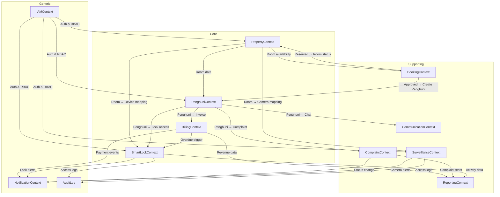

# DOMAIN MODEL — Granada Kost Platform

> **Versi**: 1.0  
> **Tanggal**: 15 Juni 2026  
> **Peran Pembuat**: Principal Domain Architect  
> **Status**: Draft — Menunggu Review Stakeholder

---

## 1. Executive Summary

> Update: selain persona Admin dan Penghuni, domain sekarang memiliki persona **Pemilik Rumah Kost** / **Property Investor**. Persona ini adalah investor pemilik satu atau lebih property tertentu di Granada Kost Platform, bukan owner platform.

### Update Business Rule - Property Investor

Persona baru: **Pemilik Rumah Kost** / **Property Investor**.

Definisi:
- Pemilik Rumah Kost adalah investor yang membeli atau memiliki satu unit rumah kost tertentu di dalam Granada Kost Platform.
- Pemilik Rumah Kost bukan owner platform dan tidak memiliki akses operasional penuh.
- Pemilik Rumah Kost hanya boleh melihat data property yang menjadi miliknya.
- Satu user Pemilik Rumah Kost harus dapat terhubung ke satu atau lebih property untuk kesiapan ekspansi.
- Role teknis boleh disebut `property_owner` atau `property_investor`; rekomendasi domain adalah `property_investor` agar tidak rancu dengan Owner platform. UI wajib memakai label **"Pemilik Rumah Kost"**.

Akses yang diperbolehkan:
- Melihat informasi rumah kost miliknya.
- Melihat daftar kamar pada rumah kost miliknya.
- Melihat informasi penghuni pada rumah kost miliknya.
- Melihat pembayaran/tagihan dari penghuni pada rumah kost miliknya.
- Melihat omset/laporan ringkas property miliknya.

Akses yang tidak diperbolehkan:
- Tidak boleh mengubah data operasional.
- Tidak boleh menjalankan smart lock command.
- Tidak boleh akses CCTV kecuali nanti ada izin khusus.
- Tidak boleh mengubah billing.
- Tidak boleh mengelola penghuni.
- Tidak boleh melihat property milik investor lain.
- Tidak boleh akses setting sistem.

Granada Kost Platform adalah sistem manajemen kost terintegrasi yang melayani persona **Admin/Operasional** (Owner platform, Manager, Admin, Teknisi), **Penghuni** (penyewa kamar), dan **Pemilik Rumah Kost** (Property Investor). Platform ini mencakup siklus hidup lengkap operasional kost — mulai dari input penghuni baru oleh admin, manajemen penghuni, billing dan pembayaran, manajemen komplain & maintenance, integrasi smart door lock (Tuya Cloud API), monitoring CCTV, hingga komunikasi dua arah dan notifikasi.

### Fakta Kunci dari Audit

| Aspek | Temuan |
|---|---|
| **Skala Awal** | ±200 kamar, 1 properti |
| **Frontend Admin** | 14 route, ~24.5 KB mock data, semua fitur **100% mock/dummy** |
| **Frontend Penghuni** | 7 route (PWA), ~5.3 KB dummy data, semua fitur **100% mock/dummy** |
| **Backend** | Belum ada — `backend/api` masih placeholder |
| **Integrasi Eksternal** | Tuya Cloud API (smart lock), CCTV gateway (belum terimplementasi) |
| **Shared Packages** | `packages/domain` ada tapi masih kosong |

### Risiko Utama

Seluruh data saat ini adalah **hardcoded mock**. Tidak ada autentikasi, otorisasi, koneksi API, atau persistensi. Domain model ini dirancang sebagai fondasi agar backend (NestJS) dan shared domain (`packages/domain`) dapat dibangun dengan arsitektur yang benar sejak awal.

---

## 2. Domain Landscape

### 2.1 Strategic Domain Classification

```
┌───────────────────────────────────────────────────────────────────┐
│                        GRANADA KOST PLATFORM                      │
├───────────────────────────────────────────────────────────────────┤
│                                                                   │
│  ╔══════════════════════════════════════════════════════╗         │
│  ║              CORE DOMAIN (Competitive Edge)          ║         │
│  ║                                                      ║         │
│  ║  • Property & Room Management                        ║         │
│  ║  • Penghuni Lifecycle                                ║         │
│  ║  • Billing & Payment                                 ║         │
│  ║  • Smart Lock Integration                            ║         │
│  ╚══════════════════════════════════════════════════════╝         │
│                                                                   │
│  ┌──────────────────────────────────────────────────────┐         │
│  │            SUPPORTING DOMAIN (Enablers)              │         │
│  │                                                      │         │
│  │  • Booking & Onboarding                              │         │
│  │  • Complaint & Maintenance                           │         │
│  │  • CCTV & Surveillance                               │         │
│  │  • Announcement & Communication                      │         │
│  │  • Reporting & Analytics                             │         │
│  └──────────────────────────────────────────────────────┘         │
│                                                                   │
│  ┌──────────────────────────────────────────────────────┐         │
│  │            GENERIC DOMAIN (Commodity)                │         │
│  │                                                      │         │
│  │  • Identity & Access Management (IAM)                │         │
│  │  • Notification Engine                               │         │
│  │  • Audit Log                                         │         │
│  │  • File/Media Storage                                │         │
│  │  • Settings & Configuration                          │         │
│  └──────────────────────────────────────────────────────┘         │
└───────────────────────────────────────────────────────────────────┘
```

---

## 3. Core Domain

### 3.1 Property & Room Management

**Alasan Core**: Kamar adalah aset utama bisnis kost. Seluruh domain lain bergantung pada entitas `Room`.

#### Bounded Context: `PropertyContext`

| Entity | Peran | Atribut Kunci (dari audit) |
|---|---|---|
| **Property** *(Aggregate Root)* | Representasi properti/kost fisik | id, name, address, phone, email, logo, totalRooms |
| **Room** | Unit kamar yang dapat disewakan | id, number, floor, type (Standard/Deluxe/Premium), price, deposit, size, status (occupied/vacant/maintenance/reserved), facilities[], photo |
| **RoomType** *(Value Object)* | Klasifikasi kamar | name, basePrice, defaultFacilities[] |
| **RoomFacility** *(Value Object)* | Fasilitas individu | name (AC, Kasur, WiFi, TV, Kamar Mandi Dalam, dsb.) |

**Business Rules**:
- Room number unik dalam satu Property
- Room memiliki lifecycle status: `vacant → reserved → occupied → vacant` atau `vacant → maintenance → vacant`
- Harga kamar bisa bervariasi dari base price per RoomType
- Room memiliki deposit yang berbeda per tipe
- Room yang sedang `occupied` atau `maintenance` tidak dapat di-booking
- Room yang `reserved` menunggu check-in sesuai booking yang disetujui
- Setiap Room memiliki Floor (lantai) yang digunakan untuk pengelompokan visual

**Catatan dari Audit**:
- Admin memiliki 2 representasi Room terpisah: `rooms` (manajemen) dan `bookingRooms` (booking) — ini harus **dikonsolidasikan** di backend menjadi satu entity
- Floor saat ini hanya ada di `bookingRooms` tetapi tidak ada di `rooms` — harus disatukan

---

### 3.2 Penghuni Lifecycle

**Alasan Core**: Penghuni adalah subjek utama yang menggerakkan seluruh transaksi bisnis.

#### Bounded Context: `PenghuniContext`

| Entity | Peran | Atribut Kunci (dari audit) |
|---|---|---|
| **Penghuni** *(Aggregate Root)* | Individu yang menyewa kamar | id, name, phone, ktp, email, joinDate, roomNumber, paymentStatus, gender, avatar, status (Aktif/Nonaktif) |
| **PenghuniProfile** *(Value Object)* | Data profil tambahan | email, avatar, emergencyContact |
| **OccupancyRecord** | Catatan hunian historis | id, penghuniId, roomId, startDate, endDate, status |

**Business Rules**:
- Satu kamar hanya boleh dihuni oleh satu Penghuni pada satu waktu
- Penghuni memiliki KTP yang unik sebagai identitas resmi
- Status pembayaran Penghuni secara agregat: `paid`, `unpaid`, `overdue`
- Penghuni hanya boleh mengakses perangkat (smart lock) yang terkait dengan kamarnya sendiri
- Terminologi UI wajib menggunakan "Penghuni", bukan "Tenant"
- Penghuni memiliki lifecycle: Booking → Onboarding → Aktif → Checkout/Keluar

**Catatan dari Audit**:
- Admin app masih menggunakan variabel `Tenant` pada kode (`tenants.tsx`, `type Tenant`) — perlu diperbaiki di refactor nanti
- Penghuni app (`currentUser`) memiliki atribut tambahan seperti `email`, `avatar` yang tidak ada di admin mock — harus dikonsolidasikan

---

### 3.3 Billing & Payment

**Alasan Core**: Revenue stream utama bisnis kost. Billing juga memiliki efek samping ke Smart Lock (auto-restriction).

#### Bounded Context: `BillingContext`

| Entity | Peran | Atribut Kunci (dari audit) |
|---|---|---|
| **Invoice** *(Aggregate Root)* | Tagihan per periode per Penghuni | id, penghuniId, roomNumber, amount, dueDate, period, status (paid/unpaid/overdue), breakdown[] |
| **InvoiceLineItem** *(Value Object)* | Rincian tagihan | label (Sewa Kamar, Listrik, Air, WiFi), amount |
| **Payment** | Catatan pembayaran | id, invoiceId, penghuniName, amount, paidDate, method (QRIS/Transfer Bank/E-Wallet), referenceNumber |
| **BookingFee** *(Value Object)* | Biaya booking | amount (fixed Rp 100.000), status, expiry |

**Business Rules**:
- Setiap Penghuni aktif mendapat Invoice bulanan
- Invoice memiliki breakdown komponen biaya (sewa, listrik, air, WiFi)
- Invoice yang melewati `dueDate` otomatis menjadi `overdue`
- Pembayaran dapat dilakukan melalui QRIS, Transfer Bank, atau E-Wallet
- Setiap pembayaran menghasilkan Invoice/receipt yang dapat diunduh
- Tagihan overdue menjadi trigger untuk Smart Lock restriction
- Booking fee sebesar Rp 100.000 wajib dibayar dalam 1×24 jam, jika tidak maka booking kadaluarsa
- Keterlambatan pembayaran dikenakan denda 1% per hari (dari FAQ Penghuni)
- Pembayaran sewa paling lambat tanggal 25 setiap bulan (dari Rules Penghuni)

**Catatan dari Audit**:
- Admin memiliki `payments` yang flat (tanpa breakdown) sedangkan Penghuni memiliki `currentBill` dengan breakdown — **backend harus memiliki breakdown**
- Booking fee terpisah dari invoice bulanan
- Dummy data menunjukkan income bulanan Rp 9.5jt – Rp 12.4jt dengan 10 kamar mock — untuk ±200 kamar real, skala billing sangat signifikan

---

### 3.4 Smart Lock Integration

**Alasan Core**: Differentiator utama platform. Integrasi IoT dengan efek bisnis langsung (auto-restriction karena billing).

#### Bounded Context: `SmartLockContext`

| Entity | Peran | Atribut Kunci (dari audit) |
|---|---|---|
| **SmartLockDevice** *(Aggregate Root)* | Perangkat kunci pintar per kamar | id, roomNumber, deviceId (Tuya), connection (online/offline), state (locked/unlocked/restricted), battery, autoLock, lastActivity |
| **AccessLog** | Catatan setiap aksi lock/unlock | id, penghuniName, roomNumber, time, type (lock/unlock), source (Mobile App/Admin Dashboard/Auto Lock/Billing System), status (success/failed) |
| **LockAlert** *(Domain Event)* | Peringatan terkait device | id, title, description, time, severity (info/warning/danger) |
| **LockRestriction** *(Value Object)* | Alasan pembatasan akses | reason, triggeredBy (Billing System), startDate |

**Business Rules**:
- Semua aksi unlock/lock **wajib melewati backend**, tidak langsung dari frontend
- Secret Tuya Cloud API hanya di backend environment
- Setiap aksi smart lock wajib memiliki **audit log**: aktor, device, aksi, waktu, hasil, correlation ID
- Aksi unlock harus memiliki otorisasi berbasis role dan rate limit
- Penghuni hanya boleh mengakses perangkat yang terkait dengan kamarnya
- **State "restricted"**: akses dikunci otomatis oleh Billing System karena tagihan overdue
- Device offline tidak dapat menerima perintah remote
- Battery low (<20%) menghasilkan alert warning; <12% menghasilkan alert danger
- Konfirmasi wajib sebelum eksekusi lock/unlock dari Admin Dashboard
- `autoLock` adalah konfigurasi per-device
- Source akses dibedakan: Mobile App, Admin Dashboard, Auto Lock, Billing System
- Multiple unlock attempt yang gagal menghasilkan alert severity "danger"
- Sinkronisasi status device secara periodik

**Model Hardware**:
- PALOMA DLP 2131
- Integrasi via Tuya Cloud API (masih eksplorasi)

**Catatan dari Audit**:
- Smart lock page adalah fitur paling matang di UI admin (286 baris, 6 stat cards, activity chart, alert panel, device grid, 2 dialog)
- Access History page terpisah dengan pagination, filter by type/source, export CSV
- Hubungan Smart Lock ↔ Billing (`restrictedReason: "Tagihan kamar 202 overdue 24 hari"`) sudah dimodelkan di mock data — ini adalah **cross-context business rule** yang kritis

---

## 4. Supporting Domain

### 4.1 Booking & Onboarding

#### Bounded Context: `BookingContext`

| Entity | Peran | Atribut Kunci |
|---|---|---|
| **Booking** *(Aggregate Root)* | Permintaan pemesanan kamar | id, code, name, phone, email, ktp, gender, roomNumber, checkInDate, duration (3/6/12 bulan), note, bookingDate, fee, status |
| **BookingStatus** *(Value Object)* | Status lifecycle booking | pending_payment → pending_verification → approved / rejected / expired |

**Business Rules**:
- Kode booking unik dan auto-generated (format: `BK-YYYY-NNN`)
- Alur booking: calon penghuni pilih kamar → isi form → bayar booking fee → admin verifikasi → approved/rejected
- Booking fee wajib dibayar dalam 1×24 jam, jika tidak maka status menjadi `expired`
- Admin dapat approve, reject, atau batalkan booking
- Booking yang di-approve mengubah status kamar menjadi `reserved`
- Kamar yang sudah occupied/reserved/maintenance tidak bisa di-booking
- Duration sewa: 3, 6, atau 12 bulan
- Data calon penghuni (KTP, gender, email) dikumpulkan saat booking
- Booking yang disetujui menjadi dasar pembuatan entitas Penghuni baru

**Catatan dari Audit**:
- Admin memiliki 2 route booking: `booking.tsx` (floor map + form calon penghuni) dan `bookings.tsx` (manajemen list semua booking)
- Booking tren bulanan dilacak untuk analytics

---

### 4.2 Complaint & Maintenance

#### Bounded Context: `ComplaintContext`

| Entity | Peran | Atribut Kunci |
|---|---|---|
| **Complaint** *(Aggregate Root)* | Tiket keluhan/kerusakan | id, penghuniId, roomNumber, category, title, description, date, priority, status, photo, technicianId |
| **ComplaintTimeline** *(Value Object)* | Riwayat progress tiket | time, label |
| **Technician** | Petugas maintenance | id, name |
| **ComplaintCategory** *(Enum)* | Kategori masalah | AC, Air, Listrik, WiFi/Internet, Kebersihan, Fasilitas, Keamanan, Kerusakan Kamar, Lainnya |

**Business Rules**:
- Penghuni membuat tiket dengan kategori, deskripsi, dan foto opsional
- Status tiket: `waiting → processing → done`
- Prioritas: `low`, `medium`, `high`
- Admin dapat assign teknisi ke tiket
- Setiap perubahan status dicatat di timeline
- Rata-rata waktu penyelesaian dilacak sebagai KPI (saat ini mock: 1.4 hari)
- Distribusi per kategori divisualisasikan untuk analisis operasional
- Penghuni bisa langsung chat admin untuk masalah urgent

**Catatan dari Audit**:
- Admin memiliki chart distribusi komplain per kategori
- Admin bisa upload foto dan assign teknisi (saat ini dummy)
- Penghuni memiliki kategori sedikit berbeda dari admin (Penghuni: "Internet", "Kerusakan kamar"; Admin: "WiFi", "Fasilitas") — **harus distandarkan**

---

### 4.3 CCTV & Surveillance

#### Bounded Context: `SurveillanceContext`

| Entity | Peran | Atribut Kunci |
|---|---|---|
| **Camera** *(Aggregate Root)* | Perangkat CCTV | id, name (CCTV-01..N), location, online (boolean), thumbnail, lastActivity |
| **CameraLocation** *(Value Object)* | Area kamera | name (Parkiran, Lobby, Koridor Lantai 1, Area Umum, Gerbang Masuk, dsb.) |
| **PreviewSession** | Sesi preview admin | id, cameraId, adminId, startTime, token, expiry |
| **CameraAccessLog** | Log akses preview | id, cameraId, userId, action, timestamp |

**Business Rules**:
- Recording tetap **lokal** (NVR/gateway lokal) — tidak di-upload ke cloud
- Admin mendapatkan **preview panel** sesuai izin akses
- Backend mengatur otorisasi, metadata kamera, audit access, dan token preview
- URL kamera internal **tidak boleh di-expose** langsung ke browser tanpa token/gateway
- Kamera offline menghasilkan peringatan visual di dashboard
- Snapshot dapat diambil dari preview (saat ini dummy)
- Real-time clock overlay pada setiap preview
- Penghuni **tidak memiliki akses** ke CCTV (tidak ada route CCTV di penghuni app)

**Arsitektur Hybrid**:
```
[Kamera IP] → [NVR/Gateway Lokal] → [Backend API] → [Admin Panel Preview]
                    ↓
              [Storage Lokal]
```

**Catatan dari Audit**:
- 6 kamera mock dengan berbagai lokasi
- Fitur snapshot dan refresh ada tapi dummy
- Motion detection tersirat dari alert ("Gerakan terdeteksi di Gerbang Masuk pukul 02:14")

---

### 4.4 Announcement & Communication

#### Bounded Context: `CommunicationContext`

| Entity | Peran | Atribut Kunci |
|---|---|---|
| **Announcement** | Pengumuman dari admin ke penghuni | id, title, body, date, priority, category (Maintenance/Info/Promo/Aturan) |
| **ChatThread** *(Aggregate Root)* | Percakapan antara penghuni dan admin | id, penghuniId, status (open/closed) |
| **ChatMessage** | Pesan individu dalam thread | id, threadId, from (admin/penghuni), text, time, read |
| **KostRule** | Peraturan kost | id, orderNumber, content |
| **CleaningSchedule** | Jadwal kebersihan | day, task |
| **FAQ** | Pertanyaan umum | id, question, answer |

**Business Rules**:
- Pengumuman memiliki prioritas (high/medium/low) dan kategori
- Chat bersifat dua arah antara Penghuni dan Admin
- Auto-reply dummy sudah tersirat (bot response setelah 1.4 detik)
- Nomor darurat tersedia di chat page
- Peraturan kost dapat dikelola dan ditampilkan ke penghuni
- FAQ dapat dikelola dan ditampilkan dengan accordion UI

**Catatan dari Audit**:
- Fitur chat ada di Penghuni app tapi **tidak ada padanannya di Admin app** — Admin perlu endpoint/UI untuk mengelola chat
- Pengumuman tampil di home page Penghuni dan halaman Info
- Peraturan dan jadwal kebersihan saat ini hardcoded — idealnya menjadi konten yang dapat dikelola admin

---

### 4.5 Reporting & Analytics

#### Bounded Context: `ReportingContext`

| Data Point | Sumber | Visualisasi |
|---|---|---|
| **Pemasukan Bulanan** | BillingContext | Area Chart (tren 7 bulan) |
| **Okupansi Kamar** | PropertyContext | Pie Chart (terisi/kosong/maintenance), Progress bar |
| **Distribusi Komplain per Kategori** | ComplaintContext | Bar Chart |
| **Booking Bulanan** | BookingContext | Area Chart |
| **Okupansi Booking** | BookingContext | Bar Chart (kosong/terisi/dibooking/maintenance) |
| **Aktivitas Smart Lock per Jam** | SmartLockContext | Area Chart (lock vs unlock) |
| **Security Score** | SmartLockContext | Single metric |
| **Rata-rata Penyelesaian Komplain** | ComplaintContext | Single metric |

**Business Rules**:
- Laporan dapat diekspor (fitur dummy saat ini)
- Filter berdasarkan tahun dan quarter
- Laporan menghitung total pendapatan, rata-rata bulanan, dan bulan terbaik

---

## 5. Generic Domain

### 5.1 Identity & Access Management (IAM)

#### Bounded Context: `IAMContext`

| Entity | Peran |
|---|---|
| **User** *(Aggregate Root)* | Akun pengguna platform |
| **Role** *(Value Object)* | Owner platform, Manager, Admin, Teknisi, Penghuni, Pemilik Rumah Kost |
| **Session** | Sesi autentikasi aktif |
| **Permission** | Izin per-role |
| **PropertyInvestorAccess** | Relasi user investor ke satu atau lebih property yang dimilikinya |

**Business Rules**:
- Autentikasi belum ada di kedua app (langsung masuk tanpa login)
- RBAC diperlukan: Owner/Manager/Admin memiliki akses operasional sesuai role, Penghuni hanya data miliknya, dan Pemilik Rumah Kost hanya read-only pada property miliknya.
- Rencana: OTP login untuk Penghuni, email/password untuk Admin
- Rate limit untuk login, OTP, smart lock, dan CCTV preview
- Secret tidak boleh di frontend bundle
- Pemilik Rumah Kost tidak boleh mengubah data operasional, billing, penghuni, smart lock command, CCTV, atau setting sistem.
- Pemilik Rumah Kost hanya boleh melihat informasi property, daftar kamar, informasi penghuni, pembayaran/tagihan, dan laporan ringkas/omset untuk property yang dimilikinya.
- Relasi akses Pemilik Rumah Kost harus mendukung satu user memiliki satu atau lebih property di masa depan.
- Role teknis boleh disebut `property_owner` atau `property_investor`; UI wajib memakai label "Pemilik Rumah Kost".

**Status**: Belum diimplementasikan sama sekali.

---

### 5.2 Notification Engine

#### Bounded Context: `NotificationContext`

| Entity | Peran | Atribut Kunci |
|---|---|---|
| **Notification** *(Aggregate Root)* | Notifikasi ke pengguna | id, recipientId, title, description, time, type, read |
| **NotificationType** *(Enum)* | Kategori notifikasi | payment, complaint, cctv, tenant, bill, ticket, announce |

**Trigger Events**:
- Pembayaran diterima → Notifikasi ke Admin & Penghuni
- Komplain baru → Notifikasi ke Admin
- CCTV offline → Notifikasi ke Admin
- Penghuni baru terdaftar → Notifikasi ke Admin
- Tagihan jatuh tempo → Notifikasi ke Penghuni
- Tiket diproses/selesai → Notifikasi ke Penghuni
- Pengumuman baru → Notifikasi ke semua Penghuni
- Smart Lock alert → Notifikasi ke Admin

**Delivery Channel** (rencana):
- In-app notification (sudah ada UI)
- Push notification (PWA — belum diimplementasikan)
- Email notification (tersirat dari Settings: "Pengingat jatuh tempo")

---

### 5.3 Audit Log

| Data | Keperluan |
|---|---|
| Smart Lock actions | Wajib — aktor, device, aksi, waktu, hasil, correlation ID |
| CCTV preview access | Wajib — siapa mengakses kamera mana kapan |
| Payment transactions | Wajib — jejak pembayaran |
| Complaint status changes | Perlu — timeline sudah dimodelkan |
| Admin actions | Perlu — perubahan data kritis |

---

### 5.4 File/Media Storage

| Kebutuhan | Context |
|---|---|
| Foto kerusakan (complaint) | ComplaintContext |
| Foto kamar (booking) | PropertyContext |
| Logo kost | PropertyContext |
| Invoice PDF | BillingContext |
| Snapshot CCTV | SurveillanceContext |

---

### 5.5 Settings & Configuration

| Setting | Scope |
|---|---|
| Informasi kost (nama, alamat, kontak) | Property-level |
| Logo kost | Property-level |
| Dark mode | User-level |
| Email notification toggle | User-level |
| Booking fee amount | Business-level |
| Denda keterlambatan | Business-level |
| Tanggal jatuh tempo default | Business-level |
| Jam malam / peraturan | Property-level |

---

## 6. Bounded Context Map



### Relasi Antar Context

| Upstream | Downstream | Tipe Relasi | Keterangan |
|---|---|---|---|
| PropertyContext | PenghuniContext | Shared Kernel | Room dan Penghuni saling terkait erat |
| PropertyContext | BookingContext | Customer-Supplier | Booking membutuhkan data ketersediaan kamar |
| PropertyContext | SmartLockContext | Customer-Supplier | Smart Lock dipasang per Room |
| PenghuniContext | BillingContext | Customer-Supplier | Invoice dibuat untuk Penghuni aktif |
| BillingContext | SmartLockContext | **Conformist** | Smart Lock mematuhi aturan Billing (auto-restriction) |
| BookingContext | PenghuniContext | Customer-Supplier | Booking yang disetujui menciptakan Penghuni baru |
| PenghuniContext | ComplaintContext | Customer-Supplier | Penghuni membuat komplain |
| * (semua) | NotificationContext | Published Language | Event domain dikirim sebagai notifikasi |
| SmartLockContext | AuditLog | Published Language | Setiap aksi dilog |
| IAMContext | * (semua) | Anti-Corruption Layer | Autentikasi dan otorisasi terpusat |

---

## 7. Entity Catalogue

### 7.1 Ringkasan Seluruh Entity

| # | Entity | Bounded Context | Tipe | Aggregate Root? |
|---|---|---|---|---|
| 1 | Property | PropertyContext | Entity | ✅ |
| 2 | Room | PropertyContext | Entity | ❌ (child of Property) |
| 3 | RoomType | PropertyContext | Value Object | — |
| 4 | RoomFacility | PropertyContext | Value Object | — |
| 5 | Penghuni | PenghuniContext | Entity | ✅ |
| 6 | PenghuniProfile | PenghuniContext | Value Object | — |
| 7 | OccupancyRecord | PenghuniContext | Entity | ❌ |
| 8 | Invoice | BillingContext | Entity | ✅ |
| 9 | InvoiceLineItem | BillingContext | Value Object | — |
| 10 | Payment | BillingContext | Entity | ❌ |
| 11 | BookingFee | BillingContext | Value Object | — |
| 12 | SmartLockDevice | SmartLockContext | Entity | ✅ |
| 13 | AccessLog | SmartLockContext | Entity | ❌ |
| 14 | LockAlert | SmartLockContext | Domain Event | — |
| 15 | LockRestriction | SmartLockContext | Value Object | — |
| 16 | Booking | BookingContext | Entity | ✅ |
| 17 | BookingStatus | BookingContext | Value Object | — |
| 18 | Complaint | ComplaintContext | Entity | ✅ |
| 19 | ComplaintTimeline | ComplaintContext | Value Object | — |
| 20 | Technician | ComplaintContext | Entity | ❌ |
| 21 | Camera | SurveillanceContext | Entity | ✅ |
| 22 | CameraLocation | SurveillanceContext | Value Object | — |
| 23 | PreviewSession | SurveillanceContext | Entity | ❌ |
| 24 | Announcement | CommunicationContext | Entity | ❌ |
| 25 | ChatThread | CommunicationContext | Entity | ✅ |
| 26 | ChatMessage | CommunicationContext | Entity | ❌ |
| 27 | KostRule | CommunicationContext | Entity | ❌ |
| 28 | FAQ | CommunicationContext | Entity | ❌ |
| 29 | User | IAMContext | Entity | ✅ |
| 30 | Role | IAMContext | Value Object | — |
| 31 | PropertyInvestorAccess | IAMContext / PropertyContext | Entity | ❌ |
| 32 | Notification | NotificationContext | Entity | ✅ |

---

## 8. Business Rules — Consolidated

### 8.1 Aturan Lintas Domain (Cross-Context)

| # | Rule | Context Terlibat | Prioritas |
|---|---|---|---|
| CR-01 | Tagihan overdue otomatis memicu restricted state pada Smart Lock kamar terkait | Billing → SmartLock | 🔴 Kritis |
| CR-02 | Booking yang disetujui mengubah status Room menjadi `reserved` dan akhirnya menciptakan entitas Penghuni baru | Booking → Property → Penghuni | 🔴 Kritis |
| CR-03 | Penghuni checkout/keluar mengubah status Room menjadi `vacant` dan menonaktifkan akses Smart Lock | Penghuni → Property → SmartLock | 🔴 Kritis |
| CR-04 | Setiap perubahan status signifikan menghasilkan Notification ke pihak terkait | * → Notification | 🟡 Penting |
| CR-05 | Semua aksi Smart Lock dan CCTV preview wajib dicatat di Audit Log | SmartLock/Surveillance → AuditLog | 🔴 Kritis |
| CR-06 | Semua operasi sensitif memerlukan autentikasi dan otorisasi berbasis role | IAM → * | 🔴 Kritis |
| CR-07 | Penghuni hanya bisa melihat data miliknya sendiri (invoice, complaint, notification, lock access) | IAM → * | 🔴 Kritis |
| CR-08 | Pemilik Rumah Kost hanya bisa membaca data property miliknya sendiri dan tidak boleh melakukan aksi operasional | IAM → Property/Billing/Reporting | 🔴 Kritis |

### 8.2 Aturan Bisnis per Domain

| # | Rule | Domain | Sumber |
|---|---|---|---|
| BR-01 | Pembayaran sewa paling lambat tanggal 25 | Billing | FAQ Penghuni |
| BR-02 | Denda keterlambatan 1% per hari | Billing | FAQ Penghuni |
| BR-03 | Booking fee Rp 100.000, wajib bayar dalam 1×24 jam | Booking | Mock data |
| BR-04 | Jam malam pukul 23:00, gerbang dikunci | Communication (Rules) | Info page |
| BR-05 | Tamu wajib lapor maksimal pukul 21:00 | Communication (Rules) | Info page |
| BR-06 | Dilarang merokok di dalam kamar | Communication (Rules) | Info page |
| BR-07 | Smart Lock secret Tuya hanya di backend environment | Smart Lock | SMARTLOCK_POLICY |
| BR-08 | Unlock harus melewati backend, bukan langsung frontend | Smart Lock | SMARTLOCK_POLICY |
| BR-09 | URL kamera tidak boleh di-expose langsung tanpa token | CCTV | CCTV_ARCHITECTURE |
| BR-10 | Battery Smart Lock <20% → alert warning, <12% → alert danger | Smart Lock | Mock data |
| BR-11 | Multiple unlock attempt gagal → alert danger | Smart Lock | Mock data |
| BR-12 | Durasi sewa: 3, 6, atau 12 bulan | Booking | Booking form |
| BR-13 | Deposit bervariasi per tipe kamar | Property | BookingRoom data |
| BR-14 | Pemilik Rumah Kost adalah investor property, bukan owner platform; aksesnya read-only dan scoped per property | IAM / Property | Business rule update |

---

## 9. Risiko Domain

### 9.1 Risiko Tinggi

| # | Risiko | Dampak | Mitigasi |
|---|---|---|---|
| R-01 | **Tuya Cloud API capability belum tervalidasi** — fitur restrict/auto-lock belum pasti tersedia di API | Smart Lock restriction mungkin tidak bisa diimplementasikan seperti yang dimodelkan | Lakukan POC integrasi Tuya sebelum memfinalisasi API contract Smart Lock |
| R-02 | **Tidak ada autentikasi/otorisasi** — seluruh app saat ini tanpa auth | Keamanan data = nol, semua orang bisa akses semua | Prioritaskan IAM di Milestone 2 |
| R-03 | **Cross-context Billing → SmartLock coupling** — business rule paling kritis melintasi 2 bounded context | Jika salah desain, bisa menyebabkan data inconsistency atau race condition | Gunakan Domain Events (async) untuk trigger restriction, bukan synchronous call |
| R-04 | **Skala 200 kamar vs 10 kamar mock** — mock data hanya 10 kamar; performance characteristics akan sangat berbeda | UI/UX pagination, search, dan dashboard metrics perlu redesign | Database indexing strategy harus dirancang dari awal untuk 200+ kamar |

### 9.2 Risiko Sedang

| # | Risiko | Dampak | Mitigasi |
|---|---|---|---|
| R-05 | **Duplikasi model Room** — Admin memiliki 2 definisi Room (`rooms` dan `bookingRooms`) yang tidak konsisten | Bug data saat integrasi backend | Konsolidasikan menjadi 1 entity Room di `packages/domain` |
| R-06 | **Inkonsistensi kategori komplain** — Admin dan Penghuni menggunakan label berbeda untuk kategori yang sama | UX membingungkan, reporting tidak akurat | Standarisasi enum `ComplaintCategory` di shared domain |
| R-07 | **Chat hanya ada di Penghuni** — Admin tidak memiliki UI untuk merespon chat | Fitur chat tidak berguna tanpa admin counterpart | Tambahkan chat management di Admin app |
| R-08 | **CCTV stream delivery** — Bagaimana admin panel mendapat preview dari kamera lokal secara aman belum didesain | Bottleneck arsitektur — apakah via WebSocket, RTSP-to-HLS, atau proxy | Perlu POC arsitektur CCTV gateway |
| R-09 | **Multi-properti dan investor ownership** — desain awal single-property harus tetap siap untuk Pemilik Rumah Kost yang memiliki satu atau lebih property | Investor bisa melihat property lain jika scoping salah; migrasi multi-property bisa mahal | Property entity sudah dimodelkan; pastikan semua entity memiliki `propertyId` dan akses investor memakai relasi user-property yang eksplisit |

### 9.3 Risiko Rendah

| # | Risiko | Dampak | Mitigasi |
|---|---|---|---|
| R-10 | **PWA offline state** — Penghuni app belum memiliki strategi offline | UX buruk saat koneksi tidak stabil | Definisikan offline-first data strategy (billing history, room info) |
| R-11 | **Terminologi "tenant" di kode** — masih ada di `tenants.tsx` dan tipe `Tenant` | Inkonsistensi dengan keputusan bisnis | Rename saat refactor ke shared domain |

---

## 10. Pertanyaan Domain yang Masih Belum Terjawab

### Kritis (Blocker untuk Database Planning)

| # | Pertanyaan | Dampak pada Database/API |
|---|---|---|
| Q-01 | **Apakah satu kamar bisa dihuni oleh lebih dari satu orang?** (kos putra-putri, kos pasutri, kamar sharing?) | Relasi Penghuni-Room: 1:1 atau N:1 |
| Q-02 | **Apakah Tuya Cloud API mendukung `lock`, `unlock`, `get_status`, `get_battery`, dan `restrict` via API?** | Desain SmartLockDevice entity dan API contract |
| Q-03 | **Bagaimana mekanisme kalkulasi tagihan utilitas (listrik, air)?** — Apakah flat rate, meter-based, atau proporsional? | Schema Invoice breakdown dan apakah perlu integrasi meter reading |
| Q-04 | **TERJAWAB:** Role sistem adalah Owner platform, Manager, Admin, Teknisi, Penghuni, dan Pemilik Rumah Kost. Role teknis untuk Pemilik Rumah Kost boleh `property_owner` atau `property_investor`, dengan rekomendasi `property_investor`. | RBAC harus membedakan owner platform dari investor property read-only |
| Q-05 | **Bagaimana flow onboarding Penghuni setelah booking disetujui?** — Apakah otomatis menjadi Penghuni atau ada proses check-in manual? | Booking → Penghuni transition logic |

### Penting (Mempengaruhi desain tapi bisa ditentukan nanti)

| # | Pertanyaan | Dampak |
|---|---|---|
| Q-06 | **Apakah invoice digenerate otomatis setiap bulan atau manual oleh admin?** | Scheduling/cron job vs manual trigger |
| Q-07 | **Apakah ada deposit kamar yang perlu dikelola?** (terlihat di BookingRoom data tapi tidak ada alur refund) | Entity Deposit dan alur refund |
| Q-08 | **Apakah ada kontrak sewa formal yang perlu di-digitalisasi?** | Entity Contract, digital signature |
| Q-09 | **Bagaimana CCTV stream diprovide ke admin panel?** — RTSP-to-HLS proxy? WebSocket? Signed URL? | Arsitektur gateway dan API contract CCTV |
| Q-10 | **Apakah notifikasi push (PWA push notification) direncanakan?** | Integrasi web push, service worker setup |
| Q-11 | **Apakah Penghuni bisa melakukan self-service extend/perpanjang sewa?** | Alur perpanjangan, auto-renewal |
| Q-12 | **Apakah ada proses checkout formal?** — Inspeksi kamar, refund deposit, serah terima kunci | Checkout workflow |
| Q-13 | **Apakah gender kamar (kost putra/putri/campur) perlu dikelola?** | Property/Room attribute tambahan |
| Q-14 | **Apakah teknisi adalah user terpisah yang perlu login sendiri?** | Technician entity vs simple name string |

---

## 11. Rekomendasi Tahap Berikutnya

### Phase 1: Domain Consolidation (Minggu 1-2)

1. **Standardisasi Shared Domain** (`packages/domain`)
   - Pindahkan semua type/interface yang saat ini tersebar di `mock-data.ts` dan `dummy-data.ts`
   - Konsolidasikan `Room` dan `BookingRoom` menjadi satu entity
   - Konsolidasikan `Tenant` (admin) dan `currentUser` (penghuni) menjadi satu entity `Penghuni`
   - Standardisasi `ComplaintCategory` enum
   - Definisikan semua Value Objects dan Enums

2. **Jawab Pertanyaan Kritis (Q-01 s/d Q-05)**
   - Khususnya Q-02 (Tuya API capability) — lakukan POC minimal

### Phase 2: Database Planning (Minggu 2-3)

3. **Buat `docs/DATABASE_PLANNING.md`** berdasarkan Domain Model ini
   - ERD dari Entity Catalogue
   - Migration strategy
   - Indexing strategy untuk skala 200+ kamar
   - Soft-delete vs hard-delete policy
   - Multi-properti readiness (propertyId di setiap tabel)

### Phase 3: API Planning (Minggu 3-4)

4. **Buat `docs/API_PLANNING.md`** berdasarkan Domain Model + Database Planning
   - REST API contract per Bounded Context
   - Authentication & Authorization design (JWT + RBAC)
   - Rate limiting rules per endpoint
   - Event/webhook design untuk cross-context communication

### Phase 4: Backend Implementation (Minggu 4+)

5. **Scaffold NestJS Backend** mengikuti Bounded Context sebagai module boundary
   - Module per Bounded Context
   - Shared domain dari `packages/domain`
   - Typed API client di `packages/api-client`

---

## Appendix A: Audit Frontend — Fitur per Route

### Admin App (`apps/admin`)

| Route | Fitur | Status | Mock? |
|---|---|---|---|
| `/` (Dashboard) | Stat cards (kamar, penghuni, pendapatan, tagihan), chart pemasukan, okupansi, aktivitas terbaru, aksi cepat | ✅ Tampil | 🔴 100% Mock |
| `/rooms` | CRUD kamar, filter status, search, dialog add/edit | ✅ Tampil | 🔴 100% Mock (local state) |
| `/tenants` | Tabel penghuni, search, detail dialog | ✅ Tampil | 🔴 100% Mock |
| `/payments` | Stat cards, tabs (semua/belum/riwayat), tombol bayar | ✅ Tampil | 🔴 100% Mock |
| `/complaints` | Stat cards, chart kategori, tabs status, tiket cards, detail dialog, assign teknisi, upload foto, update status | ✅ Tampil | 🔴 100% Mock |
| `/smart-lock` | 6 stat cards, activity chart, alert panel, device grid, lock/unlock confirm dialog, detail dialog | ✅ Tampil | 🔴 100% Mock |
| `/access-history` | Stat cards, tabel riwayat, filter type/source, pagination, export | ✅ Tampil | 🔴 100% Mock |
| `/cctv` | Stat cards, kamera grid dengan live indicator, area filter, search, snapshot, fullscreen preview | ✅ Tampil | 🔴 100% Mock |
| `/bookings` | Stat cards, chart booking/okupansi, tabs status, tabel/cards, detail dialog, approve/reject/batalkan | ✅ Tampil | 🔴 100% Mock |
| `/booking` | Floor map, filter lantai/tipe/harga, detail kamar dialog, form booking, payment dialog | ✅ Tampil | 🔴 100% Mock |
| `/notifications` | List notifikasi, mark all read, unread indicator | ✅ Tampil | 🔴 100% Mock |
| `/reports` | Stat cards, bar chart pendapatan, pie chart okupansi, filter tahun/quarter, export | ✅ Tampil | 🔴 100% Mock |
| `/settings` | Form info kost, upload logo, dark mode toggle, email notification toggle | ✅ Tampil | 🔴 100% Mock |

### Penghuni App (`apps/penghuni`)

| Route | Fitur | Status | Mock? |
|---|---|---|---|
| `/` (Home) | Hero section, bill card, quick actions, stats, progress pembayaran, pengumuman, riwayat pembayaran | ✅ Tampil | 🔴 100% Mock |
| `/billing` | Total tagihan + breakdown, metode pembayaran (QRIS/Bank/E-Wallet), tombol bayar, success sheet, riwayat | ✅ Tampil | 🔴 100% Mock |
| `/complaints` | Kategori grid, link chat admin, riwayat tiket, FAB buat tiket, bottom sheet form + success state | ✅ Tampil | 🔴 100% Mock |
| `/chat` | Chat bubble UI, auto-reply bot, emergency contact, typing indicator | ✅ Tampil | 🔴 100% Mock |
| `/info` | Tabs (Pengumuman/Peraturan/FAQ), peraturan kos, jadwal kebersihan, FAQ accordion | ✅ Tampil | 🔴 100% Mock |
| `/notifications` | List notifikasi, unread indicator, empty state | ✅ Tampil | 🔴 100% Mock |
| `/profile` | Profile card, info display, dark mode toggle, notification toggle, nav links, logout | ✅ Tampil | 🔴 100% Mock |

### Fitur yang Belum Ada di UI tapi Tersirat dari Domain

| Fitur | Tersirat dari | Priority |
|---|---|---|
| Login / Register | Semua fitur memerlukan auth | 🔴 Kritis |
| Admin Chat Management | Chat di Penghuni app tanpa counterpart di Admin | 🟡 Penting |
| Smart Lock di Penghuni App | Penghuni harusnya bisa lock/unlock kamarnya sendiri via PWA | 🟡 Penting |
| Deposit Management | Data deposit ada di BookingRoom tapi tidak ada alur pengelolaan | 🟢 Nice to have |
| Contract/Sewa Management | Durasi sewa ada di Booking tapi tidak ada entitas kontrak | 🟢 Nice to have |
| Checkout / Keluar Process | Tidak ada alur formal untuk penghuni keluar | 🟡 Penting |
| Portal Pemilik Rumah Kost | Persona investor read-only sudah menjadi business rule tetapi belum ada UI khusus | 🟡 Penting |
| Multi-property Switch | Disiapkan untuk masa depan | 🟢 Future |

---

## Appendix B: Glossary / Ubiquitous Language

| Istilah | Definisi | Catatan |
|---|---|---|
| **Pemilik Rumah Kost** | Investor yang membeli atau memiliki satu atau lebih property tertentu di Granada Kost Platform | UI wajib memakai istilah ini. Role teknis boleh `property_owner` atau `property_investor`, rekomendasi `property_investor` |
| **Penghuni** | Individu yang menyewa kamar kost | Wajib digunakan pada UI. Jangan gunakan "Tenant" |
| **Kamar** | Unit hunian yang dapat disewakan | Memiliki tipe: Standard, Deluxe, Premium |
| **Tagihan / Invoice** | Dokumen penagihan bulanan kepada Penghuni | Terdiri dari breakdown: sewa, listrik, air, WiFi |
| **Booking** | Permintaan pemesanan kamar oleh calon Penghuni | Memiliki lifecycle: pending_payment → pending_verification → approved/rejected/expired |
| **Booking Fee** | Biaya pemesanan (Rp 100.000) | Non-refundable, wajib bayar 1×24 jam |
| **Deposit** | Uang jaminan saat masuk | Bervariasi per tipe kamar |
| **Komplain / Tiket** | Laporan keluhan atau permintaan maintenance dari Penghuni | Memiliki kategori, prioritas, dan status |
| **Smart Lock** | Kunci pintu digital yang terhubung via Tuya Cloud API | Memiliki state: locked, unlocked, restricted |
| **Restricted** | Status Smart Lock yang dikunci otomatis karena tagihan overdue | Dipicu oleh Billing System |
| **CCTV Preview** | Akses real-time view kamera oleh Admin | Recording tetap lokal, preview via panel admin |
| **Okupansi** | Persentase kamar yang terisi | Metrik utama dashboard admin |
| **Teknisi** | Petugas yang ditugaskan untuk menangani komplain/maintenance | Dapat di-assign ke tiket oleh Admin |
