# BILLING DOMAIN — Granada Kost Platform

> **Versi**: 1.0  
> **Tanggal**: 17 Juni 2026  
> **Peran Pembuat**: Principal Billing Domain Architect  
> **Status**: Dokumen Analisis — Dasar Implementasi Billing Module  
> **Dokumen Acuan**:  
> - [DOMAIN_MODEL.md](file:///d:/PROJECT%20CODING/Granada%20Kost%20Platform/docs/DOMAIN_MODEL.md)  
> - [DATABASE_PLANNING.md](file:///d:/PROJECT%20CODING/Granada%20Kost%20Platform/docs/DATABASE_PLANNING.md)  
> - [API_PLANNING.md](file:///d:/PROJECT%20CODING/Granada%20Kost%20Platform/docs/API_PLANNING.md)  
> - [BACKEND_ARCHITECTURE.md](file:///d:/PROJECT%20CODING/Granada%20Kost%20Platform/docs/BACKEND_ARCHITECTURE.md)  
> - [MASTER_DATA_MAPPING.md](file:///d:/PROJECT%20CODING/Granada%20Kost%20Platform/docs/MASTER_DATA_MAPPING.md)  
> - [SEED_DATA_PLAN.md](file:///d:/PROJECT%20CODING/Granada%20Kost%20Platform/docs/SEED_DATA_PLAN.md)

---

## Daftar Isi

1. [Executive Summary](#1-executive-summary)
2. [Billing Lifecycle](#2-billing-lifecycle)
3. [Invoice Lifecycle](#3-invoice-lifecycle)
4. [Occupancy → Billing Relationship](#4-occupancy--billing-relationship)
5. [Renewal Flow](#5-renewal-flow)
6. [Manual Transfer Verification Flow](#6-manual-transfer-verification-flow)
7. [Payment Evidence Flow](#7-payment-evidence-flow)
8. [Outstanding Balance Calculation](#8-outstanding-balance-calculation)
9. [Overdue Strategy](#9-overdue-strategy)
10. [Property Owner Visibility](#10-property-owner-visibility)
11. [RBAC Matrix](#11-rbac-matrix)
12. [Audit Requirements](#12-audit-requirements)
13. [Future Payment Gateway Integration](#13-future-payment-gateway-integration)
14. [Future Smart Lock Restriction Integration](#14-future-smart-lock-restriction-integration)
15. [Database Entity Recommendation](#15-database-entity-recommendation)
16. [API Recommendation](#16-api-recommendation)
17. [Risks and Edge Cases](#17-risks-and-edge-cases)
18. [Implementation Phases](#18-implementation-phases)

---

## 1. Executive Summary

Billing adalah **Core Domain** Granada Kost Platform yang menggerakkan revenue stream utama bisnis kost. Domain ini bertanggung jawab atas siklus lengkap tagihan — mulai dari pembuatan invoice otomatis berdasarkan occupancy aktif, pengelolaan pembayaran manual (transfer bank, QRIS, e-wallet), verifikasi bukti pembayaran oleh admin, perhitungan denda keterlambatan, hingga pelaporan keuangan kepada Pemilik Rumah Kost.

### Konteks Saat Ini

| Aspek | Status |
|---|---|
| **Backend modules yang sudah ada** | Property, Room, Resident, Occupancy, IAM/Auth/RBAC |
| **Backend modules yang belum ada** | Billing, Invoice, Payment, Deposit (settlement), Lease |
| **Frontend billing (Admin)** | UI sudah ada dengan mock data — stat cards, tabs, tombol bayar |
| **Frontend billing (Penghuni)** | UI sudah ada dengan mock data — breakdown tagihan, metode pembayaran, riwayat |
| **Skala** | 163 kamar (123 RuKost + 40 ApartKost), tarif seragam Rp 1.800.000/bulan |
| **Payment gateway** | Ditunda ke Phase 2 — Phase 1 memakai pembayaran manual + upload bukti |
| **Smart Lock restriction** | Direncanakan, memerlukan approval admin/manager (tidak auto-lock) |

### Parameter Bisnis yang Sudah Disetujui

| Parameter | Nilai | Sumber |
|---|---|---|
| Tarif sewa | Rp 1.800.000/bulan (seragam) | MASTER_DATA_MAPPING.md |
| Tanggal jatuh tempo | Tanggal 25 setiap bulan | DATABASE_PLANNING.md |
| Denda keterlambatan | 1% per hari | DOMAIN_MODEL.md (FAQ Penghuni) |
| Metode pembayaran Phase 1 | Transfer Bank BSI 7318321153 a/n PT SON SMART LIVING | MASTER_DATA_KOSTATION.docx |
| Metode pembayaran frontend | QRIS, Transfer Bank, E-Wallet | Mock data Penghuni app |
| Occupancy rule | 1 kamar = 1 penghuni aktif | DATABASE_PLANNING.md |

---

## 2. Billing Lifecycle

### 2.1 Gambaran Umum

Billing lifecycle menggambarkan siklus hidup penagihan dari awal penghuni check-in hingga penghuni check-out. Billing berjalan selama occupancy aktif dan berhenti ketika occupancy berakhir.

### 2.2 State Diagram Billing

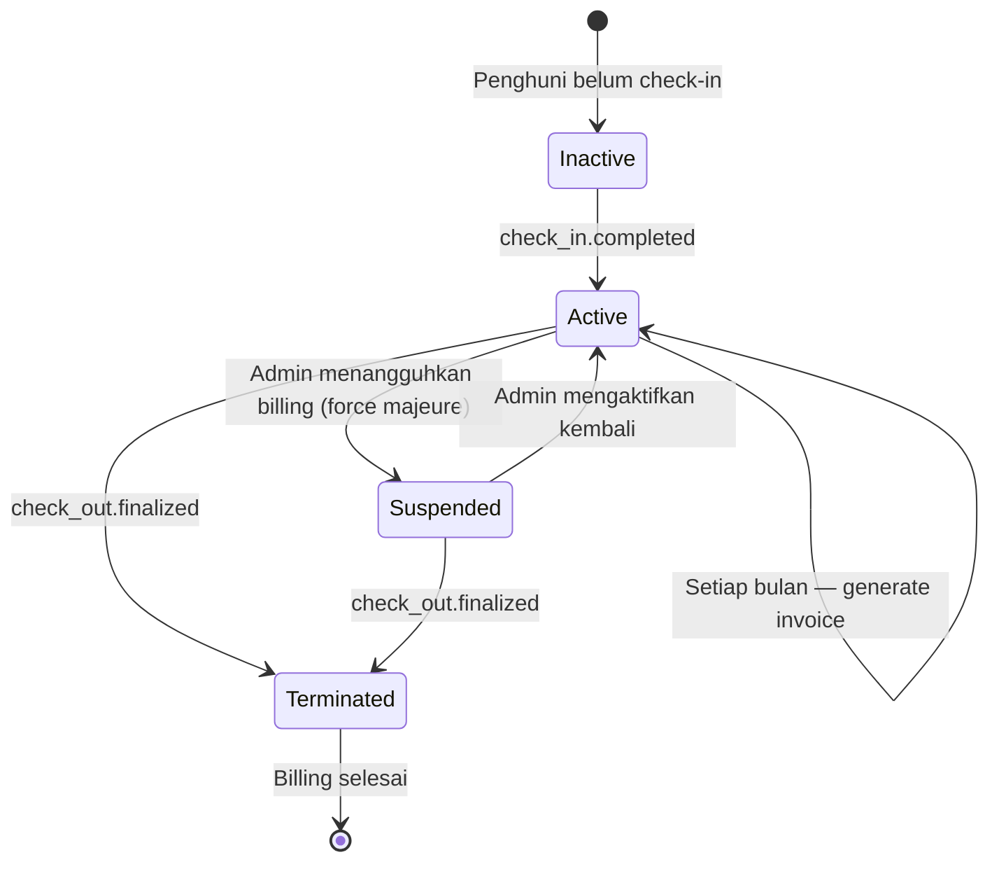

### 2.3 Tahapan Billing Lifecycle

| # | Tahap | Trigger | Aksi | Entitas Terlibat |
|---|---|---|---|---|
| BL-01 | **Billing Activation** | `check_in.completed` event | Sistem menandai occupancy aktif sebagai billable; invoice pertama dijadwalkan | Occupancy, Billing Schedule |
| BL-02 | **Invoice Generation** | Cron job pada awal bulan atau admin trigger manual | Invoice baru dibuat dengan breakdown komponen biaya | Invoice, Invoice Line Items |
| BL-03 | **Invoice Issuance** | Admin issue invoice (atau auto-issue jika dikonfigurasi) | Invoice dikirim ke Penghuni via notifikasi; status `issued` | Invoice, Notification |
| BL-04 | **Payment Window** | Invoice terbit hingga due date (tanggal 25) | Penghuni membayar dan upload bukti transfer | Payment Proof |
| BL-05 | **Payment Verification** | Admin memeriksa bukti pembayaran | Payment diverifikasi atau ditolak; invoice di-update | Payment, Payment Allocation |
| BL-06 | **Overdue Detection** | Cron job setelah due date | Invoice yang belum dibayar ditandai `overdue`; denda dihitung | Late Fee Assessment |
| BL-07 | **Overdue Escalation** | Hari overdue melewati threshold | Notifikasi berulang; opsi Smart Lock restriction request | Notification, Smart Lock Restriction |
| BL-08 | **Billing Settlement** | `check_out.finalized` event | Semua invoice outstanding diselesaikan; deposit dipotong untuk tunggakan | Deposit Settlement, Invoice |
| BL-09 | **Billing Termination** | Check-out selesai | Tidak ada invoice baru yang digenerate; billing inactive | Occupancy closed |

### 2.4 Billing Period Convention

| Parameter | Nilai |
|---|---|
| Billing period | Bulanan, dimulai tanggal 1 |
| Period key format | `YYYY-MM` (contoh: `2026-07`) |
| Due date default | Tanggal 25 setiap bulan |
| Pro-rata policy | **Disabled** — Penghuni selalu bayar penuh bulan pertama dan terakhir (Decision D-01) |

### 2.5 Business Rules

| # | Rule | Keterangan |
|---|---|---|
| BR-BL-01 | Invoice hanya digenerate untuk occupancy yang aktif (status `active`) | Penghuni yang sudah check-out tidak mendapat invoice baru |
| BR-BL-02 | Satu occupancy hanya boleh memiliki satu invoice per billing period | Duplikasi invoice per period dilarang |
| BR-BL-03 | Invoice harus memiliki minimal satu line item | Invoice kosong tidak valid |
| BR-BL-04 | Perubahan tarif kamar di tengah bulan tidak mempengaruhi invoice yang sudah terbit | Invoice snapshot harga saat issuance |
| BR-BL-05 | Billing suspension hanya boleh dilakukan oleh owner/manager dengan alasan terdokumentasi | Mencegah penyalahgunaan; audit required |
| BR-BL-06 | Billing otomatis berjalan tanpa intervensi admin setiap bulan, kecuali di-suspend | Cron job generate + auto-issue sesuai konfigurasi |

---

## 3. Invoice Lifecycle

### 3.1 State Diagram Invoice

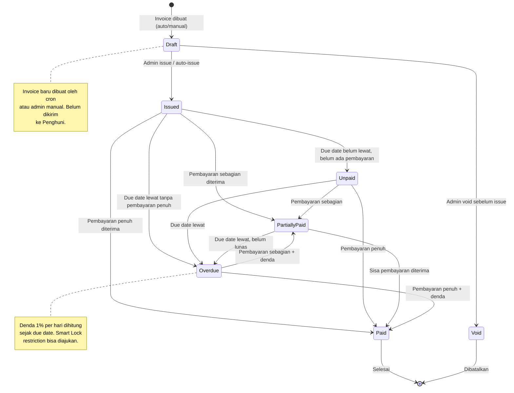

### 3.2 Detail Status Invoice

| Status | Kode | Keterangan | Transisi yang Valid |
|---|---|---|---|
| **Draft** | `draft` | Invoice dibuat, belum di-issue ke Penghuni | → `issued`, → `void` |
| **Issued** | `issued` | Invoice sudah dikirim ke Penghuni, belum jatuh tempo | → `unpaid` (otomatis sama dengan issued sebelum due date), → `paid`, → `partially_paid`, → `overdue`, → `void` |
| **Unpaid** | `unpaid` | Invoice terbit, belum ada pembayaran | → `paid`, → `partially_paid`, → `overdue` |
| **Partially Paid** | `partially_paid` | Pembayaran diterima tapi belum lunas | → `paid`, → `overdue` |
| **Paid** | `paid` | Lunas — semua komponen termasuk denda terbayar | Terminal state |
| **Overdue** | `overdue` | Melewati due date dengan sisa hutang > 0 | → `paid`, → `partially_paid` |
| **Void** | `void` | Dibatalkan oleh admin/owner — misalnya salah generate | Terminal state |

> **Catatan**: Status `issued` dan `unpaid` secara semantik serupa. Rekomendasi implementasi: gunakan `issued` sebagai status awal setelah publish, dan transisikan ke `overdue` jika melewati due date. Status `unpaid` bisa dipertahankan sebagai alias display di UI jika diperlukan, atau dieliminasi agar state machine lebih sederhana. Keputusan ini harus ditetapkan saat implementasi.

### 3.3 Invoice Line Item Types

| Kode | Label UI | Keterangan |
|---|---|---|
| `rent` | Sewa Kamar | Komponen utama — snapshot dari `rooms.monthly_price` atau `leases.monthly_price` |
| `electricity` | Listrik | Flat rate atau meter-based (perlu keputusan bisnis) |
| `water` | Air | Flat rate atau meter-based (perlu keputusan bisnis) |
| `wifi` | WiFi | Biasanya flat rate per kamar |
| `late_fee` | Denda Keterlambatan | Dihitung otomatis: 1% × jumlah hari overdue × subtotal |
| `adjustment` | Penyesuaian | Koreksi manual oleh admin — bisa positif (tambah) atau negatif (diskon) |
| `other` | Lainnya | Biaya tambahan yang tidak masuk kategori lain |

### 3.4 Invoice Snapshot Strategy

Invoice harus meng-snapshot data penting saat issuance agar tidak berubah retroaktif:

| Data yang Di-snapshot | Sumber | Alasan |
|---|---|---|
| Room number | `rooms.number` | Room number bisa berubah jika pindah kamar |
| Monthly price | `leases.monthly_price` atau `rooms.monthly_price` | Tarif bisa berubah di masa depan |
| Resident name | `residents.full_name` | Referensi cepat tanpa join |
| Due date | `property_settings.default_due_day` | Due day bisa dikonfigurasi ulang |
| Billing period | Dihitung dari bulan berjalan | Immutable per invoice |

### 3.5 Business Rules Invoice

| # | Rule |
|---|---|
| BR-INV-01 | Invoice tidak boleh diedit setelah status `paid` — koreksi hanya melalui credit note/adjustment invoice |
| BR-INV-02 | Invoice void harus menyertakan alasan dan hanya boleh dilakukan oleh owner/manager |
| BR-INV-03 | Invoice yang sudah memiliki payment allocation tidak boleh di-void — harus di-reverse dulu |
| BR-INV-04 | Satu invoice hanya untuk satu billing period per satu occupancy |
| BR-INV-05 | Late fee line item ditambahkan ke invoice existing, bukan membuat invoice baru |
| BR-INV-06 | Invoice code format: `INV-{PROPERTY_CODE}-{YYYY}-{NNNN}` — unik per property per tahun |

---

## 4. Occupancy → Billing Relationship

### 4.1 Relationship Diagram

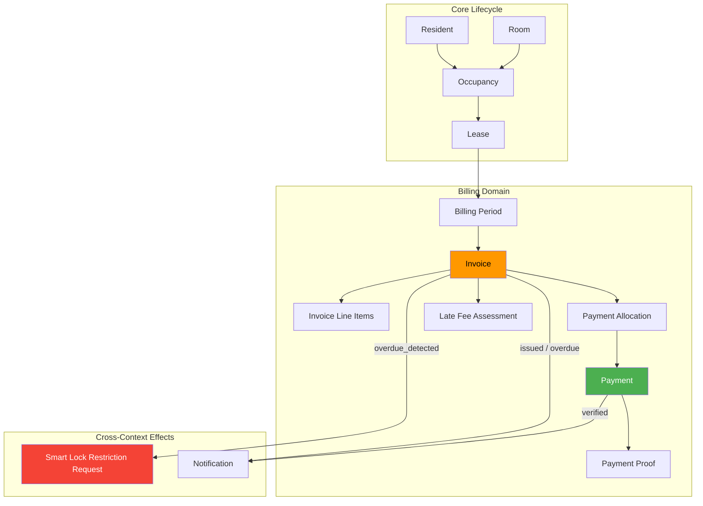

### 4.2 Relationship Rules

| # | Relationship | Cardinality | Keterangan |
|---|---|---|---|
| REL-01 | Occupancy → Invoices | 1:N | Satu occupancy aktif menghasilkan banyak invoice (satu per bulan) |
| REL-02 | Lease → Invoices | 1:N | Lease menentukan kontrak yang berlaku; invoice merujuk lease untuk snapshot harga |
| REL-03 | Invoice → Line Items | 1:N | Setiap invoice memiliki breakdown komponen biaya |
| REL-04 | Payment → Payment Allocations | 1:N | Satu payment bisa dialokasikan ke satu atau lebih invoice |
| REL-05 | Invoice → Payment Allocations | 1:N | Satu invoice bisa dilunasi oleh satu atau lebih payment |
| REL-06 | Resident → Payments | 1:N | Penghuni membayar melalui berbagai transaksi |
| REL-07 | Billing Period → Invoices | 1:N | Satu period menghasilkan banyak invoice (satu per occupancy aktif) |

### 4.3 Kapan Billing Dimulai?

```
Trigger: check_in.completed event
│
├── Occupancy status → active
├── Room status → occupied
├── Billing activation:
│   ├── Tentukan billing period pertama
│   ├── Jika check-in di awal bulan → generate invoice bulan ini
│   ├── Jika check-in di tengah bulan → bayar penuh bulan ini (pro-rata disabled, Decision D-01)
│   └── Jadwalkan invoice bulanan berikutnya via cron
└── Smart Lock access grant created
```

### 4.4 Kapan Billing Berakhir?

```
Trigger: check_out.finalized event
│
├── Occupancy status → ended
├── Room status → vacant / maintenance
├── Billing termination:
│   ├── Hentikan cron job untuk occupancy ini
│   ├── Cek outstanding invoices
│   ├── Bayar penuh bulan terakhir (pro-rata disabled, Decision D-01)
│   ├── Generate final invoice jika ada sisa tagihan
│   ├── Sisa tunggakan dipotong dari deposit
│   └── Emit billing.settlement_completed event
└── Smart Lock access grant revoked
```

---

## 5. Renewal Flow

### 5.1 Gambaran Umum

Renewal (perpanjangan sewa) mempengaruhi billing karena menentukan apakah invoice terus digenerate atau berhenti. Penghuni dapat mengajukan perpanjangan sendiri melalui `lease_extension_requests`.

### 5.2 Renewal State Diagram

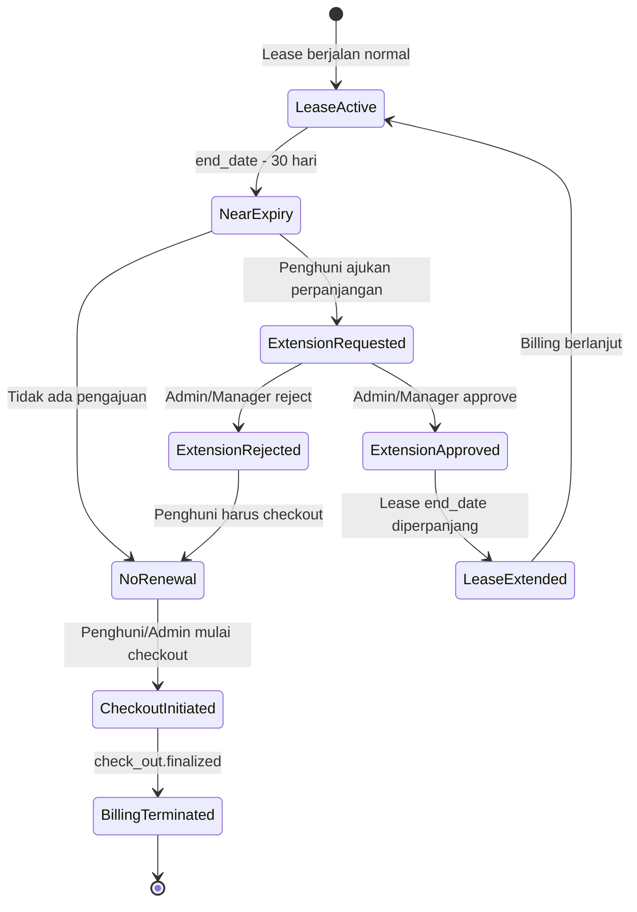

### 5.3 Dampak Renewal terhadap Billing

| Skenario | Dampak pada Billing |
|---|---|
| **Perpanjangan disetujui** | `lease.end_date` diperpanjang; invoice generation cron terus berjalan tanpa interupsi |
| **Perpanjangan ditolak** | Billing berjalan hingga lease end date; setelah itu check-out process |
| **Perpanjangan dengan perubahan tarif** | Lease baru dibuat atau lease existing di-update; invoice bulan berikutnya memakai tarif baru |
| **Penghuni tidak mengajukan perpanjangan** | Billing berjalan hingga lease end date; sistem kirim notifikasi pengingat; admin memulai checkout |
| **Penghuni pindah kamar (future)** | Lease lama ditutup, lease baru dibuat di kamar baru; billing menyesuaikan |

### 5.4 Renewal Business Rules

| # | Rule |
|---|---|
| BR-REN-01 | Perpanjangan hanya bisa diajukan untuk lease yang masih aktif atau mendekati expiry (≤ 60 hari sebelum end_date) |
| BR-REN-02 | Perpanjangan yang disetujui tidak mempengaruhi invoice yang sudah terbit |
| BR-REN-03 | Perpanjangan bisa mengubah tarif jika ada perubahan harga — tarif baru berlaku mulai bulan setelah approval |
| BR-REN-04 | Jika lease expired tanpa perpanjangan atau checkout, sistem harus mengirim alert ke admin |
| BR-REN-05 | Invoice generation cron harus memeriksa lease validity sebelum generate — jangan generate invoice untuk lease expired |

### 5.5 Notifikasi Renewal

| Waktu | Penerima | Isi Notifikasi |
|---|---|---|
| T-60 hari (2 bulan sebelum end) | Penghuni | "Masa sewa Anda akan berakhir pada {end_date}. Ajukan perpanjangan melalui aplikasi." |
| T-30 hari (1 bulan sebelum end) | Penghuni + Admin | "Masa sewa Penghuni {name} di kamar {room} akan berakhir 30 hari lagi." |
| T-14 hari | Penghuni + Admin | "URGENT: Masa sewa berakhir 14 hari lagi. Segera ajukan perpanjangan atau proses checkout." |
| T-0 (expired) | Admin | "Lease {code} telah expired tanpa perpanjangan atau checkout. Tindakan diperlukan." |

---

## 6. Manual Transfer Verification Flow

### 6.1 Gambaran Umum

Phase 1 tidak memiliki payment gateway. Semua pembayaran dilakukan secara manual (transfer bank, QRIS, e-wallet) dan diverifikasi oleh admin melalui bukti pembayaran yang di-upload Penghuni.

### 6.2 Flow Diagram

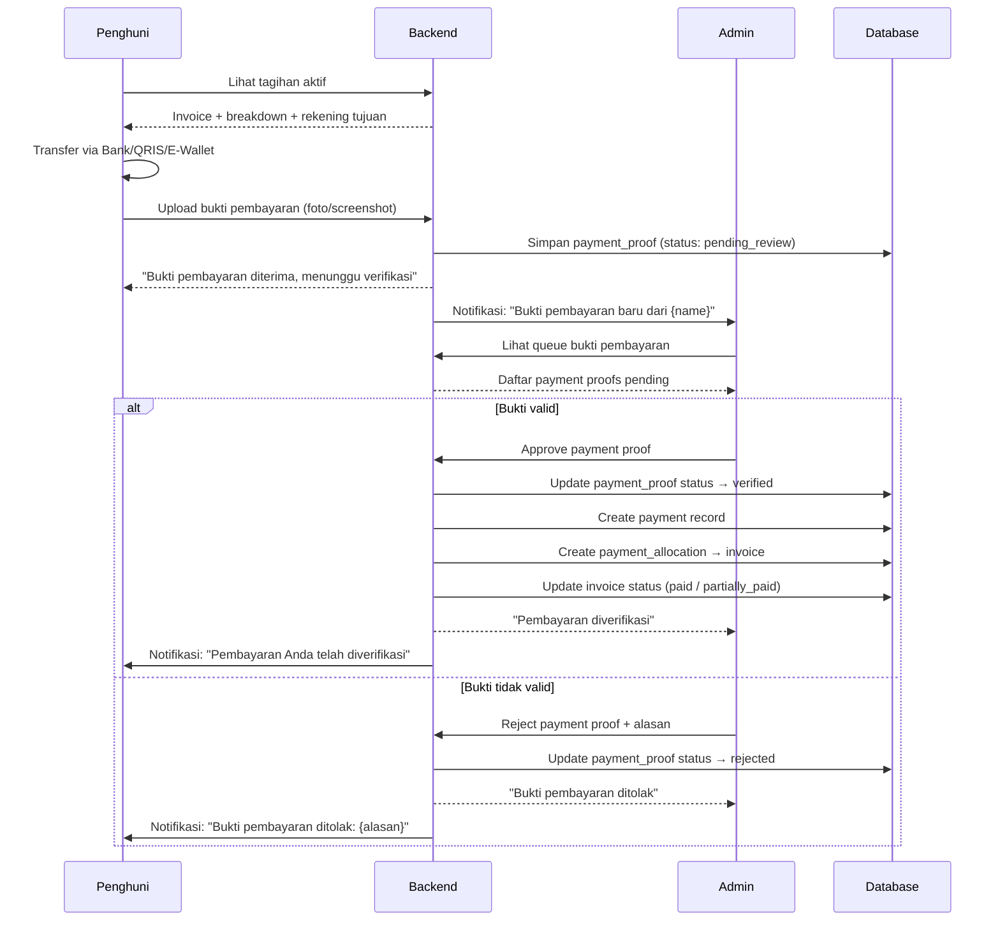

### 6.3 Payment Proof States

| Status | Kode | Keterangan |
|---|---|---|
| **Pending Review** | `pending_review` | Bukti baru di-upload, menunggu review admin |
| **Verified** | `verified` | Admin memverifikasi bukti valid; payment record dibuat |
| **Rejected** | `rejected` | Admin menolak bukti; Penghuni harus upload ulang |
| **Expired** | `expired` | Bukti terlalu lama tanpa review (opsional, bisa dikonfigurasi) |

### 6.4 Informasi Rekening Pembayaran

Dari MASTER_DATA_KOSTATION.docx:

| Parameter | Nilai |
|---|---|
| Bank | BSI (Bank Syariah Indonesia) |
| Nomor Rekening | 7318321153 |
| Atas Nama | PT SON SMART LIVING |

> **Rekomendasi**: Informasi rekening pembayaran disimpan di `property_settings` atau tabel `payment_accounts` agar bisa ditampilkan di Penghuni app dan bisa dikelola per property.

### 6.5 Business Rules Verifikasi

| # | Rule |
|---|---|
| BR-VER-01 | Hanya admin, manager, dan owner yang boleh memverifikasi bukti pembayaran |
| BR-VER-02 | Admin tidak boleh memverifikasi bukti tanpa melihat lampiran (file harus ada) |
| BR-VER-03 | Payment amount pada verification bisa berbeda dari invoice total (pembayaran sebagian diperbolehkan) |
| BR-VER-04 | Setiap verifikasi (approve/reject) harus menghasilkan audit log |
| BR-VER-05 | Payment proof yang sudah verified tidak boleh di-reject ulang — koreksi melalui void payment + audit |
| BR-VER-06 | Admin boleh membuat payment record tanpa payment proof (contoh: cash) dengan audit |

---

## 7. Payment Evidence Flow

### 7.1 Gambaran Umum

Payment evidence (bukti pembayaran) adalah file digital (foto, screenshot) yang di-upload oleh Penghuni sebagai bukti transfer bank atau pembayaran lainnya. File ini menjadi dasar verifikasi admin.

### 7.2 Upload dan Storage

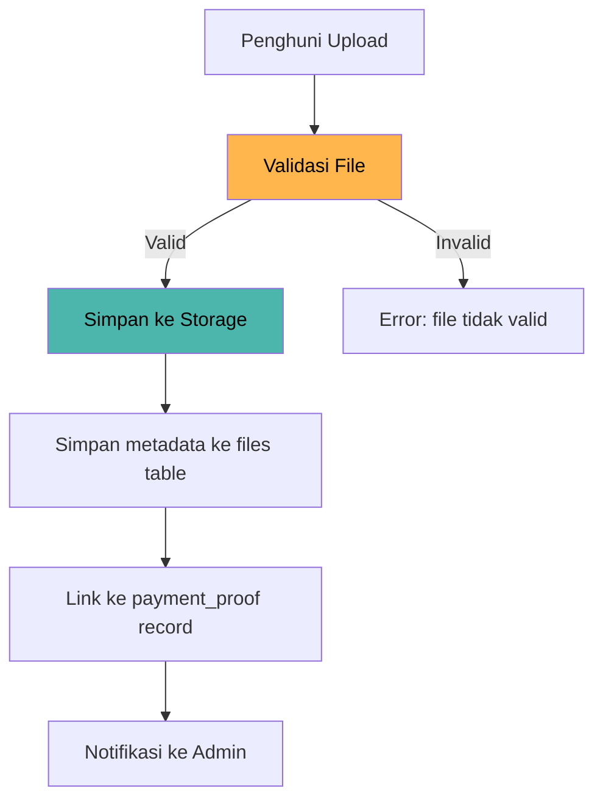

### 7.3 Validasi File Evidence

| Parameter | Aturan |
|---|---|
| Tipe file yang diizinkan | `image/jpeg`, `image/png`, `image/webp`, `application/pdf` |
| Ukuran maksimal | 5 MB per file |
| Jumlah file per proof | 1 — 3 file |
| Resolusi minimum | Cukup untuk terbaca (tidak ada hard limit, tapi UI bisa warn) |
| Penyimpanan | Private — hanya accessible oleh uploader dan admin yang berwenang |
| Audit | Upload dan setiap akses file dicatat di `file_access_logs` |

### 7.4 Retention

| Jenis | Retention |
|---|---|
| Payment proof (verified) | 5 tahun — sesuai retensi data finansial |
| Payment proof (rejected) | 1 tahun — kemudian soft-delete |
| File metadata | Mengikuti payment proof retention |
| Physical file | Dihapus setelah metadata retention berakhir |

### 7.5 Business Rules Evidence

| # | Rule |
|---|---|
| BR-EVI-01 | Penghuni hanya boleh upload bukti untuk invoice miliknya sendiri |
| BR-EVI-02 | Penghuni boleh upload bukti baru setelah bukti sebelumnya ditolak |
| BR-EVI-03 | File evidence tidak boleh dihapus oleh Penghuni setelah di-upload |
| BR-EVI-04 | Admin dan Pemilik Rumah Kost bisa melihat bukti pembayaran (read-only untuk Pemilik Rumah Kost) |
| BR-EVI-05 | File URL harus menggunakan signed URL atau backend streaming — raw object key tidak boleh terekspos |

---

## 8. Outstanding Balance Calculation

### 8.1 Definisi

Outstanding balance adalah total tagihan yang belum dibayar oleh seorang Penghuni pada suatu titik waktu. Ini mencakup seluruh invoice yang belum lunas termasuk denda yang sudah terakumulasi.

### 8.2 Formula Kalkulasi

```
Outstanding Balance =
    Σ (invoice.total_amount - Σ payment_allocations.allocated_amount)
    untuk semua invoice dimana invoice_status ∈ ('issued', 'unpaid', 'partially_paid', 'overdue')
    AND invoice.resident_id = {target_resident}
```

### 8.3 Komponen Outstanding

| Komponen | Sumber | Kalkulasi |
|---|---|---|
| **Sewa belum bayar** | Invoice line items `rent` | Sum of rent amounts pada unpaid invoices |
| **Utilitas belum bayar** | Invoice line items `electricity`, `water`, `wifi` | Sum of utility amounts pada unpaid invoices |
| **Denda akumulasi** | `late_fee_assessments` yang sudah di-apply | Sum of assessed late fees yang belum terbayar |
| **Adjustment** | Invoice line items `adjustment` | Positif menambah, negatif mengurangi |

### 8.4 Aggregasi untuk Reporting

| Level | Siapa yang Melihat | Query Pattern |
|---|---|---|
| **Per Penghuni** | Penghuni (own), Admin | Sum outstanding per resident_id |
| **Per Kamar** | Admin | Join occupancy → invoice → outstanding |
| **Per Property** | Admin, Pemilik Rumah Kost | Sum outstanding per property_id |
| **Per Billing Period** | Admin | Group by billing_period_id |
| **Aging Summary** | Admin, Pemilik Rumah Kost | Group by overdue age bracket (0-30, 31-60, 61-90, >90 hari) |

### 8.5 Aging Brackets

| Bracket | Label | Warna UI | Keterangan |
|---|---|---|---|
| 0 hari | Current | 🟢 Hijau | Belum jatuh tempo |
| 1–30 hari | Overdue | 🟡 Kuning | Baru melewati due date |
| 31–60 hari | Seriously Overdue | 🟠 Oranye | Perlu eskalasi |
| 61–90 hari | Critical | 🔴 Merah | Smart Lock restriction dipertimbangkan |
| > 90 hari | Default | ⚫ Hitam | Risiko uncollectible; checkout dipertimbangkan |

### 8.6 Business Rules Outstanding

| # | Rule |
|---|---|
| BR-OUT-01 | Outstanding balance dihitung real-time dari invoice dan payment allocations, bukan disimpan sebagai field terpisah |
| BR-OUT-02 | Invoice yang di-void tidak termasuk dalam outstanding calculation |
| BR-OUT-03 | Payment allocations yang statusnya `cancelled` atau `refunded` dikembalikan ke outstanding |
| BR-OUT-04 | Pemilik Rumah Kost melihat aggregate outstanding per property, bukan per-resident detail |
| BR-OUT-05 | Outstanding balance harus konsisten antara Penghuni app, Admin dashboard, dan reporting |

---

## 9. Overdue Strategy

### 9.1 Gambaran Umum

Overdue strategy mendefinisikan apa yang terjadi ketika Penghuni tidak membayar invoice tepat waktu. Strategi ini harus **tegas namun fair**, memberikan kesempatan pembayaran sambil melindungi revenue bisnis.

### 9.2 Overdue Timeline

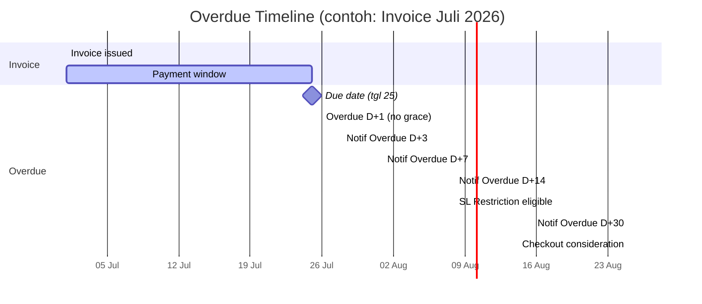

### 9.3 Overdue Detection Process

```
Cron: Setiap hari pada 00:01 WIB
│
├── Query: invoices WHERE due_date < TODAY
│                   AND invoice_status IN ('issued', 'unpaid', 'partially_paid')
│                   AND invoice_status != 'overdue'
│
├── Untuk setiap invoice:
│   ├── Update status → 'overdue'
│   ├── Hitung denda: 1% × hari_overdue × subtotal_amount
│   ├── Insert/update late_fee_assessment record
│   ├── Tambahkan late_fee line item ke invoice (atau update existing)
│   ├── Update invoice.total_amount
│   ├── Emit invoice.overdue_detected event
│   └── Create notification ke Penghuni dan Admin
│
└── Untuk invoice yang sudah overdue:
    ├── Update late_fee_assessment (recalculate hari_overdue dan amount)
    ├── Update late_fee line item amount
    └── Check escalation thresholds
```

### 9.4 Denda Keterlambatan

| Parameter | Nilai | Sumber |
|---|---|---|
| Rate | 1% per hari | DOMAIN_MODEL.md — FAQ Penghuni |
| Basis kalkulasi | Subtotal invoice (sewa + utilitas, tanpa denda sebelumnya) | Menghindari compound interest |
| Mulai dihitung | Hari setelah due date (D+1) — tanpa grace period (Decision D-02) | Due date = tanggal 25, denda langsung D+1 |
| Denda maksimal | **30% dari subtotal** (Decision D-03) | Cap mencegah denda melebihi tagihan; tercapai pada hari ke-30 |
| Frekuensi update | Harian via cron job | Late fee terakumulasi setiap hari |

**Contoh Kalkulasi:**

```
Invoice Juli 2026:
  Sewa kamar: Rp 1.800.000
  Listrik:    Rp    100.000 (contoh flat rate)
  Air:        Rp     50.000 (contoh flat rate)
  WiFi:       Rp     50.000 (contoh flat rate)
  ─────────────────────────
  Subtotal:   Rp 2.000.000
  Due date:   25 Juli 2026

Hari ini: 5 Agustus 2026 (D+11)
  Denda: 1% × 11 hari × Rp 2.000.000 = Rp 220.000
  Total tagihan: Rp 2.000.000 + Rp 220.000 = Rp 2.220.000
```

### 9.5 Escalation Tiers

| Tier | Hari Overdue | Aksi Otomatis | Aksi Manual (Admin) |
|---|---|---|---|
| **Tier 1** | D+1 – D+7 | Notifikasi in-app ke Penghuni; denda berjalan | Reminder manual via chat |
| **Tier 2** | D+8 – D+14 | Notifikasi berulang (D+3, D+7); denda berjalan | Admin menghubungi Penghuni langsung |
| **Tier 3** | D+15 – D+30 | Notifikasi escalated; flag di admin dashboard | Admin bisa ajukan Smart Lock restriction request |
| **Tier 4** | D+31 – D+60 | Dashboard alert critical; denda mendekati cap | Manager review — pertimbangkan checkout paksa |
| **Tier 5** | D+61+ | Dashboard alert severe | Owner decision — checkout, deposit forfeiture, atau negosiasi |

### 9.6 Overdue Business Rules

| # | Rule |
|---|---|
| BR-OVD-01 | Denda dihitung berdasarkan subtotal (tanpa compound/denda-atas-denda) |
| BR-OVD-02 | Denda memiliki cap maksimal 30% dari subtotal (Decision D-03); konfigurabel per property |
| BR-OVD-03 | Pembayaran overdue harus melunasi denda juga — partial payment dialokasikan ke principal dulu, lalu denda |
| BR-OVD-04 | Invoice overdue yang dilunasi tetap tercatat sebagai "pernah overdue" untuk reporting |
| BR-OVD-05 | Smart Lock restriction karena overdue memerlukan approval admin/manager — tidak otomatis |
| BR-OVD-06 | Grace period = 0 hari (Decision D-02); Owner/Manager bisa waive denda dengan audit trail |
| BR-OVD-07 | Overdue multi-bulan: setiap invoice dihitung terpisah, denda per invoice |

---

## 10. Property Owner Visibility

### 10.1 Prinsip Dasar

Pemilik Rumah Kost (property_owner) memiliki akses **read-only** ke data finansial property miliknya. Mereka bisa melihat ringkasan keuangan tetapi **tidak boleh** melakukan mutasi billing apapun.

### 10.2 Data yang Terlihat oleh Property Owner

| Data | Level Detail | Endpoint Pattern |
|---|---|---|
| **Revenue summary** | Aggregat per bulan/quarter/tahun | `GET /api/v1/property-owner/properties/{id}/revenue-summary` |
| **Payment list** | Daftar pembayaran yang sudah verified (tanpa bukti detail) | `GET /api/v1/property-owner/properties/{id}/payments` |
| **Occupancy summary** | Persentase terisi, kosong, maintenance | `GET /api/v1/property-owner/properties/{id}/occupancy-summary` |
| **Outstanding summary** | Total tagihan belum terbayar (aggregate) | Termasuk di revenue-summary |
| **Invoice summary** | Jumlah invoice per status (aggregate) | Termasuk di revenue-summary |

### 10.3 Data yang TIDAK Terlihat oleh Property Owner

| Data | Alasan |
|---|---|
| Invoice detail per Penghuni | PII concern — hanya admin yang perlu |
| Payment proof files | Operational detail |
| Late fee assessment detail | Operational detail |
| Billing configuration/settings | Admin/manager only |
| Individual Penghuni billing history | PII concern |
| Payment allocation detail | Too granular |
| Void/adjustment history | Operational audit |

### 10.4 Revenue Summary untuk Property Owner

| Metric | Kalkulasi | Frekuensi Update |
|---|---|---|
| Pendapatan bulan ini | Sum verified payments bulan berjalan | Real-time |
| Pendapatan bulan lalu | Sum verified payments bulan sebelumnya | Snapshot |
| Total outstanding | Sum outstanding balance seluruh Penghuni | Real-time |
| Occupancy rate | Jumlah occupied / total kamar × 100% | Real-time |
| Trend pendapatan | Array [bulan, amount] untuk 12 bulan terakhir | Awal bulan |

### 10.5 Business Rules Property Owner

| # | Rule |
|---|---|
| BR-PO-01 | Property owner hanya melihat data property yang di-assign kepadanya via `property_investor_assignments` |
| BR-PO-02 | Property owner tidak boleh melihat data property investor lain |
| BR-PO-03 | Semua read access property owner ke data finansial di-audit |
| BR-PO-04 | Property owner tidak menerima notifikasi operasional billing (overdue, payment proof, dll.) |
| BR-PO-05 | Property owner menerima notifikasi ringkasan bulanan pendapatan (opsional, konfigurabel) |

---

## 11. RBAC Matrix

### 11.1 Matrix Lengkap Billing Operations

| Operation | `owner` | `manager` | `admin` | `technician` | `resident` | `property_owner` |
|---|:---:|:---:|:---:|:---:|:---:|:---:|
| **Invoice** | | | | | | |
| View all invoices | ✅ | ✅ | ✅ | ❌ | ❌ | ❌ |
| View own invoices | — | — | — | ❌ | ✅ | ❌ |
| View invoice aggregate | ✅ | ✅ | ✅ | ❌ | ❌ | ✅ (summary) |
| Create invoice manual | ✅ | ✅ | ✅ | ❌ | ❌ | ❌ |
| Issue invoice | ✅ | ✅ | ✅ | ❌ | ❌ | ❌ |
| Edit draft invoice | ✅ | ✅ | ❌ | ❌ | ❌ | ❌ |
| Void invoice | ✅ | ✅ | ❌ | ❌ | ❌ | ❌ |
| **Payment** | | | | | | |
| View all payments | ✅ | ✅ | ✅ | ❌ | ❌ | ❌ |
| View own payment history | — | — | — | ❌ | ✅ | ❌ |
| View payment aggregate | ✅ | ✅ | ✅ | ❌ | ❌ | ✅ (summary) |
| Upload payment proof | ❌ | ❌ | ❌ | ❌ | ✅ | ❌ |
| Verify payment proof | ✅ | ✅ | ✅ | ❌ | ❌ | ❌ |
| Reject payment proof | ✅ | ✅ | ✅ | ❌ | ❌ | ❌ |
| Create manual payment | ✅ | ✅ | ✅ | ❌ | ❌ | ❌ |
| Void payment | ✅ | ✅ | ❌ | ❌ | ❌ | ❌ |
| **Late Fee** | | | | | | |
| Assess late fee | ✅ | ✅ | ❌ | ❌ | ❌ | ❌ |
| Waive late fee | ✅ | ✅ | ❌ | ❌ | ❌ | ❌ |
| **Billing Config** | | | | | | |
| View billing settings | ✅ | ✅ | ✅ | ❌ | ❌ | ❌ |
| Edit billing settings | ✅ | ✅ | ❌ | ❌ | ❌ | ❌ |
| **Reporting** | | | | | | |
| Revenue report (full) | ✅ | ✅ | ✅ | ❌ | ❌ | ❌ |
| Revenue summary (owner) | ✅ | ✅ | ✅ | ❌ | ❌ | ✅ |
| Billing aging report | ✅ | ✅ | ✅ | ❌ | ❌ | ❌ |
| Export billing data | ✅ | ✅ | ❌ | ❌ | ❌ | ❌ |
| **Smart Lock Restriction** | | | | | | |
| Request restriction (billing) | ✅ | ✅ | ✅ | ❌ | ❌ | ❌ |
| Approve restriction | ✅ | ✅ | ❌ | ❌ | ❌ | ❌ |
| Lift restriction (after payment) | ✅ | ✅ | ❌ | ❌ | ❌ | ❌ |

### 11.2 Permission Codes untuk Billing

| Permission Code | Deskripsi |
|---|---|
| `billing.view` | Melihat invoice, payment, billing summary |
| `billing.manage` | Membuat/edit/issue/void invoice; manage billing configuration |
| `billing.self.view` | Penghuni melihat tagihan dan riwayat miliknya sendiri |
| `payment.verify` | Verify/reject bukti pembayaran |
| `payment.create` | Membuat record pembayaran manual (cash, admin-entry) |
| `payment.void` | Void pembayaran yang sudah diverifikasi |
| `late_fee.manage` | Assess/waive denda keterlambatan |
| `billing.export` | Export data billing ke CSV/Excel |
| `billing.settings.manage` | Mengubah konfigurasi billing (due day, late fee rate, dll.) |

### 11.3 Property Scoping Enforcement

| Scope Type | Enforcement |
|---|---|
| Staff (owner/manager/admin) | `user_property_roles` — hanya akses property yang di-assign |
| Technician | Tidak ada akses billing |
| Resident | `resident_id` dari auth context — hanya data miliknya |
| Property Owner | `property_investor_assignments` — read-only, hanya property miliknya |

---

## 12. Audit Requirements

### 12.1 High-Priority Audited Operations

| # | Operation | Audit Level | Data yang Dicatat | Audit Target |
|---|---|---|---|---|
| AUD-01 | **Invoice created** | Required | invoice_id, resident_id, amount, period, creator | `audit_logs` |
| AUD-02 | **Invoice issued** | Required | invoice_id, issued_at, actor | `audit_logs` |
| AUD-03 | **Invoice voided** | Required | invoice_id, void_reason, actor, before_data | `audit_logs` |
| AUD-04 | **Invoice edited** | Required | invoice_id, before_data, after_data, actor | `audit_logs` |
| AUD-05 | **Payment proof uploaded** | Required | proof_id, resident_id, invoice_id, file_id | `audit_logs` + `file_access_logs` |
| AUD-06 | **Payment verified** | Required | proof_id, payment_id, amount, verifier, invoice_id | `audit_logs` |
| AUD-07 | **Payment rejected** | Required | proof_id, reject_reason, verifier | `audit_logs` |
| AUD-08 | **Payment voided** | Required | payment_id, void_reason, actor, before_data | `audit_logs` |
| AUD-09 | **Manual payment created** | Required | payment_id, amount, method, creator | `audit_logs` |
| AUD-10 | **Late fee assessed** | Required | assessment_id, invoice_id, days, amount | `audit_logs` |
| AUD-11 | **Late fee waived** | Required | assessment_id, waive_reason, actor | `audit_logs` |
| AUD-12 | **Billing settings changed** | Required | setting_key, before_value, after_value, actor | `audit_logs` |
| AUD-13 | **Smart Lock restriction requested** | Required | restriction_id, invoice_id, resident_id, requester | `audit_logs` |
| AUD-14 | **Billing data exported** | Required | export_type, filter_params, actor | `audit_logs` |
| AUD-15 | **Property owner reads financial data** | Required | property_id, data_type, actor | `audit_logs` |

### 12.2 Audit Data Schema

Setiap audit entry minimal berisi:

| Field | Keterangan |
|---|---|
| `actor_user_id` | Siapa yang melakukan aksi |
| `property_id` | Property scope |
| `action` | Kode aksi (contoh: `billing.invoice.issued`) |
| `resource_type` | Tipe resource (contoh: `invoice`, `payment`, `payment_proof`) |
| `resource_id` | ID resource yang terpengaruh |
| `before_data` | State sebelum perubahan (JSON) |
| `after_data` | State setelah perubahan (JSON) |
| `ip_address` | IP address aktor |
| `user_agent` | User agent aktor |
| `correlation_id` | Correlation ID dari request |
| `occurred_at` | Timestamp aksi |

### 12.3 Audit Retention untuk Billing

| Jenis Data | Retention |
|---|---|
| Invoice audit | Minimum 5 tahun, rekomendasi 7 tahun |
| Payment audit | Minimum 5 tahun, rekomendasi 7 tahun |
| Late fee audit | Minimum 5 tahun |
| Billing settings audit | Minimum 3 tahun |
| Property owner access audit | Minimum 3 tahun |
| Export audit | Minimum 2 tahun |

### 12.4 PII Protection dalam Audit

| Data | Perlakuan |
|---|---|
| Resident name | Boleh di-log sebagai referensi (bukan PII sensitif) |
| KTP number | **Tidak boleh** di-log dalam audit billing |
| Payment amount | Boleh di-log (data finansial, bukan PII) |
| Bank account destination | Boleh di-log (informasi publik property) |
| Payment proof file content | **Tidak boleh** di-log; hanya file_id reference |

---

## 13. Future Payment Gateway Integration

### 13.1 Gambaran Umum

Payment gateway integration direncanakan untuk Phase 2. Desain Phase 1 harus memudahkan integrasi tanpa refactor fundamental.

### 13.2 Arsitektur Target

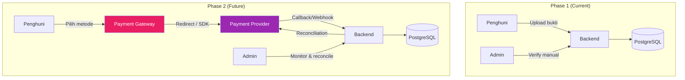

### 13.3 Design Decisions untuk Phase 1 yang Memudahkan Phase 2

| Aspek | Phase 1 Design | Mengapa Memudahkan Phase 2 |
|---|---|---|
| **Payment sebagai entitas terpisah** | Payment record tidak di-embed di invoice | Gateway callback cukup membuat payment baru + allocation |
| **Payment allocation pattern** | Satu payment bisa dialokasikan ke banyak invoice | Gateway payment yang mencakup multiple invoice tetap works |
| **Payment status machine** | `pending`, `verified`, `failed`, `cancelled`, `refunded` | Gateway status (pending, success, failed, expired) bisa di-map |
| **Payment method enum extensible** | `cash`, `bank_transfer`, `qris`, `ewallet`, `other` | Tambah `gateway_midtrans`, `gateway_xendit`, dll. |
| **Idempotency key** | Setiap payment operation punya idempotency | Gateway callback idempotency tinggal extend |
| **Event-driven side effects** | `payment.verified` event triggers invoice update | Gateway callback → event → side effects (sama) |

### 13.4 Phase 2 Tables yang Disiapkan

Berdasarkan DATABASE_PLANNING.md Phase 2:

| Table | Purpose |
|---|---|
| `payment_gateway_transactions` | Raw gateway transaction log, provider reference, callback payload |
| `payment_method_accounts` | Konfigurasi akun gateway per property (Midtrans merchant ID, Xendit API key, dll.) |

### 13.5 Gateway Integration Flow (Phase 2 Preview)

```
Penghuni pilih metode → Backend create payment intent → 
  Gateway create transaction → Penghuni bayar → 
  Gateway callback → Backend verify signature → 
  Create payment + allocation → Update invoice → 
  Emit event → Notification
```

### 13.6 Anti-Corruption Layer

Gateway provider response **tidak boleh** bocor ke:
- Frontend response
- Invoice/payment domain model
- Audit log raw payload

Provider payload disimpan di `payment_gateway_transactions.provider_payload` (JSONB) dan diterjemahkan ke domain status melalui adapter.

---

## 14. Future Smart Lock Restriction Integration

### 14.1 Gambaran Umum

Smart Lock restriction karena billing overdue adalah **cross-context business rule** paling kritis di Granada Kost Platform. Billing context mendeteksi overdue; Smart Lock context mengeksekusi restriction. Hubungan ini harus melalui **domain event**, bukan direct coupling.

### 14.2 Flow Diagram

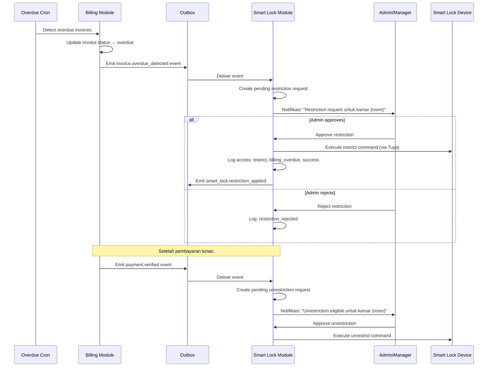

### 14.3 Phase 1 Safety Rules

| # | Rule | Keterangan |
|---|---|---|
| SL-01 | **Tidak ada auto-lock penuh tanpa approval manusia** | Billing overdue hanya membuat pending restriction request |
| SL-02 | **Approval diperlukan untuk restrict DAN unrestrict** | Keduanya memerlukan tindakan eksplisit admin/manager |
| SL-03 | **Semua aksi diaudit** | Restrict, unrestrict, approve, reject — semuanya tercatat |
| SL-04 | **Billing module tidak langsung memanggil Tuya** | Hanya emit event; Smart Lock module yang handle execution |
| SL-05 | **Penghuni dinotifikasi sebelum restriction** | Minimal notifikasi saat overdue detected, bukan saat restriction applied |
| SL-06 | **Grace period minimum sebelum restriction eligible** | Rekomendasi: ≥ 14 hari overdue sebelum restriction bisa diajukan |

### 14.4 Restriction → Billing Feedback Loop

```
Invoice Overdue 
  → Restriction Request Created
    → Admin Approves
      → Smart Lock Restricted
        → Penghuni bayar
          → Payment Verified
            → Invoice Paid
              → Unrestriction Request Created
                → Admin Approves
                  → Smart Lock Unrestricted
```

### 14.5 Event Contract

**Event: `invoice.overdue_detected`**
```json
{
  "event_type": "invoice.overdue_detected",
  "property_id": "uuid",
  "invoice_id": "uuid",
  "resident_id": "uuid",
  "room_id": "uuid",
  "days_overdue": 15,
  "outstanding_amount": 2200000,
  "correlation_id": "uuid"
}
```

**Event: `payment.verified` (triggers unrestriction review)**
```json
{
  "event_type": "payment.verified",
  "property_id": "uuid",
  "payment_id": "uuid",
  "resident_id": "uuid",
  "invoice_id": "uuid",
  "remaining_outstanding": 0,
  "correlation_id": "uuid"
}
```

---

## 15. Database Entity Recommendation

### 15.1 Entity Relationship Diagram

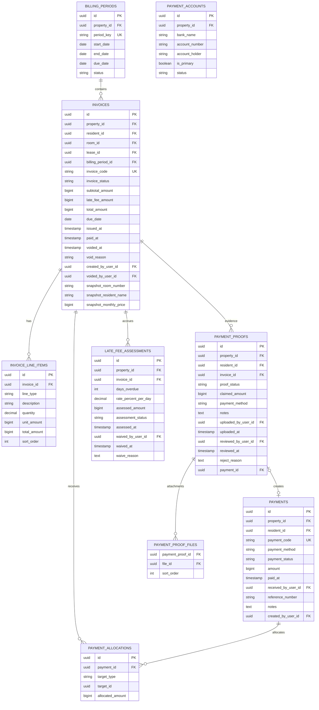

### 15.2 Tabel Baru yang Direkomendasikan

| # | Tabel | Sudah di DB Planning? | Keterangan |
|---|---|---|---|
| 1 | `billing_periods` | ✅ Ya | Periode tagihan per property |
| 2 | `invoices` | ✅ Ya | Tagihan utama dengan snapshot |
| 3 | `invoice_line_items` | ✅ Ya | Breakdown komponen biaya |
| 4 | `payments` | ✅ Ya | Record pembayaran |
| 5 | `payment_allocations` | ✅ Ya | Alokasi payment ke invoice/deposit |
| 6 | `late_fee_assessments` | ✅ Ya | Catatan denda keterlambatan |
| 7 | `payment_proofs` | ❌ **Baru** | Record bukti pembayaran dari Penghuni — belum eksplisit di DB Planning |
| 8 | `payment_proof_files` | ❌ **Baru** | Relasi bukti pembayaran ke files (many-to-many) |
| 9 | `payment_accounts` | ❌ **Baru** | Rekening pembayaran per property (BSI, dll.) |

### 15.3 Detail Kolom per Tabel

#### 15.3.1 `billing_periods`

| Kolom | Tipe | Constraint | Keterangan |
|---|---|---|---|
| `id` | UUID | PK | |
| `property_id` | UUID | FK → properties, NOT NULL | |
| `period_key` | TEXT | NOT NULL, UNIQUE(property_id, period_key) | Format: `2026-07` |
| `start_date` | DATE | NOT NULL | Tanggal 1 bulan |
| `end_date` | DATE | NOT NULL | Tanggal terakhir bulan |
| `due_date` | DATE | NOT NULL | Default: tanggal 25 |
| `status` | TEXT | NOT NULL, CHECK IN ('open', 'closed', 'cancelled') | |
| `created_at` | TIMESTAMPTZ | NOT NULL, DEFAULT NOW() | |
| `created_by_user_id` | UUID | FK → users | |

#### 15.3.2 `invoices`

| Kolom | Tipe | Constraint | Keterangan |
|---|---|---|---|
| `id` | UUID | PK | |
| `property_id` | UUID | FK → properties, NOT NULL | |
| `resident_id` | UUID | FK → residents, NOT NULL | |
| `room_id` | UUID | FK → rooms, NOT NULL | |
| `lease_id` | UUID | FK → leases | Nullable jika lease belum diimplementasi |
| `billing_period_id` | UUID | FK → billing_periods, NOT NULL | |
| `invoice_code` | TEXT | NOT NULL, UNIQUE(property_id, invoice_code) | Format: `INV-GSH-2026-0001` |
| `invoice_status` | TEXT | NOT NULL, CHECK IN ('draft','issued','unpaid','partially_paid','paid','overdue','void') | |
| `subtotal_amount` | BIGINT | NOT NULL, CHECK ≥ 0 | Sewa + utilitas (tanpa denda) |
| `late_fee_amount` | BIGINT | NOT NULL DEFAULT 0, CHECK ≥ 0 | Akumulasi denda |
| `total_amount` | BIGINT | NOT NULL, CHECK ≥ 0 | subtotal + late_fee |
| `due_date` | DATE | NOT NULL | Snapshot dari billing period |
| `issued_at` | TIMESTAMPTZ | | Waktu invoice di-issue |
| `paid_at` | TIMESTAMPTZ | | Waktu invoice dilunasi |
| `voided_at` | TIMESTAMPTZ | | Waktu di-void |
| `void_reason` | TEXT | | Alasan void |
| `snapshot_room_number` | TEXT | NOT NULL | Room number saat issuance |
| `snapshot_resident_name` | TEXT | NOT NULL | Nama Penghuni saat issuance |
| `snapshot_monthly_price` | BIGINT | NOT NULL | Harga sewa saat issuance |
| `created_by_user_id` | UUID | FK → users | |
| `voided_by_user_id` | UUID | FK → users | |
| `created_at` | TIMESTAMPTZ | NOT NULL, DEFAULT NOW() | |
| `updated_at` | TIMESTAMPTZ | NOT NULL, DEFAULT NOW() | |

#### 15.3.3 `payment_proofs`

| Kolom | Tipe | Constraint | Keterangan |
|---|---|---|---|
| `id` | UUID | PK | |
| `property_id` | UUID | FK → properties, NOT NULL | |
| `resident_id` | UUID | FK → residents, NOT NULL | |
| `invoice_id` | UUID | FK → invoices, NOT NULL | Invoice yang dibayar |
| `proof_status` | TEXT | NOT NULL, CHECK IN ('pending_review','verified','rejected','expired') | |
| `claimed_amount` | BIGINT | NOT NULL, CHECK > 0 | Jumlah yang diklaim dibayar |
| `payment_method` | TEXT | NOT NULL | bank_transfer, qris, ewallet |
| `notes` | TEXT | | Catatan dari Penghuni |
| `uploaded_by_user_id` | UUID | FK → users, NOT NULL | |
| `uploaded_at` | TIMESTAMPTZ | NOT NULL, DEFAULT NOW() | |
| `reviewed_by_user_id` | UUID | FK → users | Admin yang mereview |
| `reviewed_at` | TIMESTAMPTZ | | Waktu review |
| `reject_reason` | TEXT | | Alasan reject |
| `payment_id` | UUID | FK → payments | Payment yang dibuat setelah verify |
| `created_at` | TIMESTAMPTZ | NOT NULL, DEFAULT NOW() | |
| `updated_at` | TIMESTAMPTZ | NOT NULL, DEFAULT NOW() | |

#### 15.3.4 `payment_accounts`

| Kolom | Tipe | Constraint | Keterangan |
|---|---|---|---|
| `id` | UUID | PK | |
| `property_id` | UUID | FK → properties, NOT NULL | |
| `bank_name` | TEXT | NOT NULL | Contoh: "Bank Syariah Indonesia (BSI)" |
| `account_number` | TEXT | NOT NULL | Contoh: "7318321153" |
| `account_holder` | TEXT | NOT NULL | Contoh: "PT SON SMART LIVING" |
| `is_primary` | BOOLEAN | NOT NULL, DEFAULT false | Rekening utama |
| `status` | TEXT | NOT NULL, CHECK IN ('active','inactive') | |
| `created_by_user_id` | UUID | FK → users | |
| `created_at` | TIMESTAMPTZ | NOT NULL, DEFAULT NOW() | |
| `updated_at` | TIMESTAMPTZ | NOT NULL, DEFAULT NOW() | |

### 15.4 Index Strategy untuk Billing

| Tabel | Index | Kolom | Query Pattern |
|---|---|---|---|
| `invoices` | Unpaid/overdue queue | `(property_id, invoice_status, due_date)` | Admin: list tagihan belum bayar |
| `invoices` | Penghuni billing page | `(resident_id, issued_at DESC)` | Penghuni: riwayat tagihan |
| `invoices` | Unique per occupancy per period | `UNIQUE (billing_period_id, resident_id)` | Mencegah duplikasi |
| `invoices` | Invoice code lookup | `UNIQUE (property_id, invoice_code)` | Lookup by code |
| `payments` | Admin payment history | `(property_id, payment_status, paid_at DESC)` | Admin: riwayat pembayaran |
| `payments` | Payment code lookup | `UNIQUE (property_id, payment_code)` | Lookup by code |
| `payment_proofs` | Review queue | `(property_id, proof_status, uploaded_at ASC)` | Admin: queue verifikasi |
| `payment_proofs` | Per resident | `(resident_id, uploaded_at DESC)` | Penghuni: riwayat bukti |
| `late_fee_assessments` | Per invoice | `(invoice_id)` | Late fee lookup |
| `billing_periods` | Period lookup | `(property_id, period_key)` | Period retrieval |
| `payment_accounts` | Per property active | `(property_id, status)` | Tampilkan rekening aktif |

---

## 16. API Recommendation

### 16.1 Billing API (Admin)

Berdasarkan API_PLANNING.md dengan penambahan untuk payment proof workflow:

| Method | Endpoint | Tujuan | Roles | Audit | Rate Limit |
|---|---|---|---|---|---|
| GET | `/api/v1/billing/invoices` | List invoice dengan filter | owner, manager, admin | Optional | Standard |
| POST | `/api/v1/billing/invoices` | Buat invoice manual | owner, manager, admin | Required | Strict/idempotent |
| GET | `/api/v1/billing/invoices/{id}` | Detail invoice + line items | owner, manager, admin | Optional | Standard |
| PATCH | `/api/v1/billing/invoices/{id}` | Edit draft invoice | owner, manager | Required | Strict |
| POST | `/api/v1/billing/invoices/{id}/issue` | Issue invoice ke Penghuni | owner, manager, admin | Required | Strict/idempotent |
| POST | `/api/v1/billing/invoices/{id}/void` | Void invoice | owner, manager | Required | Strict |
| POST | `/api/v1/billing/invoices/{id}/late-fee` | Hitung/catat denda | owner, manager | Required | Strict/idempotent |
| POST | `/api/v1/billing/invoices/{id}/waive-late-fee` | Waive denda | owner, manager | Required | Strict |
| GET | `/api/v1/billing/payments` | List pembayaran | owner, manager, admin | Optional | Standard |
| POST | `/api/v1/billing/payments` | Buat payment manual (cash/admin-entry) | owner, manager, admin | Required | Strict/idempotent |
| POST | `/api/v1/billing/payments/{id}/void` | Void payment | owner, manager | Required | Strict |
| GET | `/api/v1/billing/payment-proofs` | Queue bukti pembayaran | owner, manager, admin | Optional | Standard |
| GET | `/api/v1/billing/payment-proofs/{id}` | Detail bukti pembayaran | owner, manager, admin | Optional | Standard |
| POST | `/api/v1/billing/payment-proofs/{id}/approve` | Approve bukti | owner, manager, admin | Required | Strict/idempotent |
| POST | `/api/v1/billing/payment-proofs/{id}/reject` | Reject bukti | owner, manager, admin | Required | Strict |
| GET | `/api/v1/billing/aging-summary` | Ringkasan overdue/aging | owner, manager, admin | None | Standard |
| GET | `/api/v1/billing/periods` | List billing periods | owner, manager, admin | None | Standard |
| POST | `/api/v1/billing/periods/{id}/generate-invoices` | Generate invoice untuk period | owner, manager | Required | Strict/idempotent |
| GET | `/api/v1/billing/payment-accounts` | List rekening pembayaran | owner, manager, admin | None | Standard |
| POST | `/api/v1/billing/payment-accounts` | Tambah rekening pembayaran | owner, manager | Required | Strict |
| PATCH | `/api/v1/billing/payment-accounts/{id}` | Edit rekening pembayaran | owner, manager | Required | Strict |

### 16.2 Penghuni Billing API

| Method | Endpoint | Tujuan | Roles | Audit | Rate Limit |
|---|---|---|---|---|---|
| GET | `/api/v1/penghuni/billing/current` | Tagihan berjalan + breakdown | resident | None | Standard |
| GET | `/api/v1/penghuni/billing/history` | Riwayat invoice + payment | resident | None | Standard |
| GET | `/api/v1/penghuni/billing/outstanding` | Total outstanding balance | resident | None | Standard |
| GET | `/api/v1/penghuni/billing/payment-accounts` | Rekening tujuan pembayaran | resident | None | Standard |
| POST | `/api/v1/penghuni/payments/proofs` | Upload bukti pembayaran | resident | Required | Strict/upload |
| GET | `/api/v1/penghuni/payments/proofs` | Riwayat bukti pembayaran miliknya | resident | None | Standard |
| GET | `/api/v1/penghuni/payments/proofs/{id}` | Detail bukti pembayaran miliknya | resident | None | Standard |

### 16.3 Property Owner Billing API

| Method | Endpoint | Tujuan | Roles | Audit | Rate Limit |
|---|---|---|---|---|---|
| GET | `/api/v1/property-owner/properties/{id}/revenue-summary` | Ringkasan pendapatan | property_owner | Required | Standard |
| GET | `/api/v1/property-owner/properties/{id}/payments` | Daftar pembayaran verified | property_owner | Required | Standard |
| GET | `/api/v1/property-owner/properties/{id}/billing-summary` | Outstanding & aging aggregate | property_owner | Required | Standard |

### 16.4 Reporting API (Billing-related)

| Method | Endpoint | Tujuan | Roles | Audit |
|---|---|---|---|---|
| GET | `/api/v1/reports/revenue` | Laporan revenue | owner, manager, admin | Optional |
| GET | `/api/v1/reports/billing-aging` | Laporan aging tagihan | owner, manager, admin | Optional |
| GET | `/api/v1/reports/payments` | Laporan pembayaran | owner, manager, admin | Optional |
| POST | `/api/v1/reports/exports` | Export laporan billing | owner, manager | Required |

### 16.5 Domain Events yang Dipublish oleh Billing Module

| Event | Trigger | Consumers |
|---|---|---|
| `invoice.created` | Invoice dibuat | Audit |
| `invoice.issued` | Invoice di-issue ke Penghuni | Notification |
| `invoice.overdue_detected` | Invoice melewati due date | Notification, Smart Lock (restriction workflow) |
| `invoice.paid` | Invoice dilunasi | Notification, Smart Lock (unrestriction review) |
| `invoice.voided` | Invoice di-void | Audit, Notification |
| `payment.proof_uploaded` | Penghuni upload bukti | Notification (ke admin) |
| `payment.verified` | Admin verify payment | Notification, Invoice update, Smart Lock review |
| `payment.rejected` | Admin reject payment proof | Notification (ke Penghuni) |
| `late_fee.assessed` | Denda dihitung | Audit |
| `late_fee.waived` | Denda di-waive | Audit |

---

## 17. Risks and Edge Cases

### 17.1 High Risk

| # | Risk/Edge Case | Dampak | Mitigasi |
|---|---|---|---|
| EC-01 | **Pro-rata invoice pertama/terakhir** — Penghuni check-in tanggal 15, apakah bayar penuh atau pro-rata? | Tagihan bisa salah; Penghuni komplain | ✅ **Decided (D-01)**: Pro-rata disabled — Penghuni selalu bayar penuh bulan pertama dan terakhir. Simplicity Phase 1 |
| EC-02 | **Double payment** — Penghuni upload bukti dua kali untuk invoice yang sama | Overpayment; refund complicated | Validasi: jika invoice sudah `paid`, reject upload baru; jika ada pending proof, warn sebelum upload kedua |
| EC-03 | **Partial payment allocation** — Penghuni bayar Rp 1.000.000 dari tagihan Rp 2.000.000 | Outstanding tidak jelas; multi-proof rumit | Payment allocation harus track sisa; invoice status → `partially_paid`; Penghuni bisa upload bukti berikutnya |
| EC-04 | **Invoice generation failure** — Cron job gagal generate invoice untuk bulan tertentu | Penghuni tidak ditagih; revenue loss | Monitoring cron job; dead-letter handling; admin manual generate sebagai fallback |
| EC-05 | **Concurrent payment verification** — Dua admin approve bukti yang sama | Double payment created | Optimistic lock pada payment_proof; idempotency key per approval |
| EC-06 | **Billing overdue → Smart Lock coupling failure** — Event overdue tidak terdeliver ke Smart Lock module | Restriction tidak dibuat meskipun sudah overdue | Outbox pattern dengan retry; dead-letter monitoring; manual restriction fallback |
| EC-07 | **Tarif berubah mid-lease** — Harga kamar naik tapi lease belum expired | Invoice amount salah jika mengambil tarif terbaru | Invoice snapshot harga dari lease, bukan dari room current price |

### 17.2 Medium Risk

| # | Risk/Edge Case | Dampak | Mitigasi |
|---|---|---|---|
| EC-08 | **Penghuni pindah kamar mid-billing** | Invoice bulan berjalan untuk kamar mana? | Tutup occupancy lama, buat occupancy baru; invoice bulan berjalan di-void dan re-generate untuk kamar baru |
| EC-09 | **Utilitas meter-based vs flat rate ambiguity** | Breakdown invoice tidak akurat | Phase 1 gunakan flat rate; meter-based sebagai Phase 2 feature |
| EC-10 | **Denda compound vs simple** | Denda membesar tidak terkontrol jika compound | Gunakan simple interest (denda atas subtotal saja, bukan atas denda sebelumnya) |
| EC-11 | **Invoice void setelah partial payment** | Payment yang sudah dialokasikan harus di-unallocate | Void invoice memerlukan void/reverse semua payment allocations terkait terlebih dahulu |
| EC-12 | **Timezone issue** — Due date midnight di zona waktu mana? | Invoice bisa jadi overdue sehari terlalu awal/lambat | Semua date comparison menggunakan `Asia/Jakarta` timezone; property timezone disimpan |
| EC-13 | **Penghuni checkout dengan outstanding balance** | Sisa tagihan hangus atau dipotong deposit? | Checkout settlement: outstanding dipotong dari deposit; sisa yang tidak tercover menjadi written-off record atau tetap outstanding |

### 17.3 Low Risk

| # | Risk/Edge Case | Dampak | Mitigasi |
|---|---|---|---|
| EC-14 | **Leap year / bulan 28-31 hari** | Billing period end date edge case | Pro-rata disabled (D-01) sehingga risiko ini berkurang; tetap gunakan library date yang handle ini (date-fns, dayjs) untuk billing period calculation |
| EC-15 | **Rekening pembayaran berubah** | Penghuni transfer ke rekening lama | Versioning rekening; old rekening tetap visible sampai grace period |
| EC-16 | **Invoice code sequence gap** | Code `INV-GSH-2026-0004` skip ke `INV-GSH-2026-0006` | Sequence gap acceptable; do not re-use codes |
| EC-17 | **Very large number of invoices** | Performance saat generate 163 invoices sekaligus | Batch processing; generate in chunks; timeout handling |

---

## 18. Implementation Phases

### 18.1 Phase 6A — Billing Foundation (Current Milestone)

**Scope**: Analisis dan perencanaan domain billing (dokumen ini).

**Deliverable**: `docs/BILLING_DOMAIN.md` ✅

---

### 18.2 Phase 6B — Billing Database Migration

**Scope**: Implementasi schema database billing.

| # | Task | Priority | Dependency |
|---|---|---|---|
| 6B-01 | Migration: `billing_periods` table | 🔴 Kritis | — |
| 6B-02 | Migration: `invoices` table + indexes | 🔴 Kritis | billing_periods |
| 6B-03 | Migration: `invoice_line_items` table | 🔴 Kritis | invoices |
| 6B-04 | Migration: `payments` table + indexes | 🔴 Kritis | — |
| 6B-05 | Migration: `payment_allocations` table | 🔴 Kritis | payments, invoices |
| 6B-06 | Migration: `payment_proofs` table + indexes | 🔴 Kritis | invoices |
| 6B-07 | Migration: `payment_proof_files` table | 🟡 Penting | payment_proofs, files |
| 6B-08 | Migration: `late_fee_assessments` table | 🟡 Penting | invoices |
| 6B-09 | Migration: `payment_accounts` table | 🟡 Penting | properties |
| 6B-10 | Seed: payment account BSI data | 🟡 Penting | payment_accounts |

---

### 18.3 Phase 6C — Billing Module Backend

**Scope**: NestJS module implementation.

| # | Task | Priority | Dependency |
|---|---|---|---|
| 6C-01 | Billing module scaffold (transport, application, domain, infrastructure layers) | 🔴 Kritis | 6B |
| 6C-02 | Billing period management (CRUD + cron job) | 🔴 Kritis | 6C-01 |
| 6C-03 | Invoice generation use case | 🔴 Kritis | 6C-02 |
| 6C-04 | Invoice issuance use case + notification event | 🔴 Kritis | 6C-03 |
| 6C-05 | Invoice line item management | 🔴 Kritis | 6C-03 |
| 6C-06 | Invoice void use case | 🟡 Penting | 6C-04 |
| 6C-07 | Payment proof upload use case (Penghuni) | 🔴 Kritis | 6C-01 |
| 6C-08 | Payment proof verification use case (Admin) | 🔴 Kritis | 6C-07 |
| 6C-09 | Payment creation + allocation use case | 🔴 Kritis | 6C-08 |
| 6C-10 | Overdue detection cron job | 🔴 Kritis | 6C-04 |
| 6C-11 | Late fee assessment use case | 🟡 Penting | 6C-10 |
| 6C-12 | Late fee waiver use case | 🟡 Penting | 6C-11 |
| 6C-13 | Outstanding balance calculation service | 🔴 Kritis | 6C-09 |
| 6C-14 | Aging summary query service | 🟡 Penting | 6C-13 |
| 6C-15 | Payment account management | 🟡 Penting | 6C-01 |
| 6C-16 | Domain events emission (outbox) | 🔴 Kritis | 6C-04, 6C-08, 6C-10 |
| 6C-17 | Audit log integration | 🔴 Kritis | All write operations |

---

### 18.4 Phase 6D — Billing API Endpoints

**Scope**: HTTP transport layer.

| # | Task | Priority | Dependency |
|---|---|---|---|
| 6D-01 | Admin Billing API — invoices CRUD | 🔴 Kritis | 6C |
| 6D-02 | Admin Billing API — payment proofs queue + verify/reject | 🔴 Kritis | 6C-08 |
| 6D-03 | Admin Billing API — payments + manual payment | 🔴 Kritis | 6C-09 |
| 6D-04 | Admin Billing API — aging summary | 🟡 Penting | 6C-14 |
| 6D-05 | Admin Billing API — billing periods + generate | 🔴 Kritis | 6C-02 |
| 6D-06 | Admin Billing API — payment accounts | 🟡 Penting | 6C-15 |
| 6D-07 | Penghuni Billing API — current bill + history + outstanding | 🔴 Kritis | 6C-13 |
| 6D-08 | Penghuni Billing API — payment proof upload + history | 🔴 Kritis | 6C-07 |
| 6D-09 | Penghuni Billing API — payment accounts (read) | 🟡 Penting | 6C-15 |
| 6D-10 | Property Owner API — revenue summary + payments + billing summary | 🟡 Penting | 6C-13, 6C-14 |
| 6D-11 | Reporting API — revenue, aging, payments | 🟡 Penting | 6C-14 |

---

### 18.5 Phase 6E — Billing Integration & Testing

**Scope**: Cross-context integration dan testing.

| # | Task | Priority | Dependency |
|---|---|---|---|
| 6E-01 | Integration: check_in.completed → billing activation | 🔴 Kritis | 6C, Lease module |
| 6E-02 | Integration: check_out.finalized → billing settlement | 🔴 Kritis | 6C, Deposit module |
| 6E-03 | Integration: invoice.overdue_detected → Smart Lock restriction workflow | 🟡 Penting | 6C-16, Smart Lock module |
| 6E-04 | Integration: payment.verified → Smart Lock unrestriction review | 🟡 Penting | 6C-16, Smart Lock module |
| 6E-05 | Integration: lease extension → billing continuation | 🟡 Penting | 6C, Lease module |
| 6E-06 | Unit tests: domain rules, state transitions, calculations | 🔴 Kritis | 6C |
| 6E-07 | Application tests: use cases, idempotency, outbox | 🔴 Kritis | 6C |
| 6E-08 | API tests: RBAC, property scope, resident self-scope | 🔴 Kritis | 6D |
| 6E-09 | Security tests: property_owner cannot mutate, resident cannot see others | 🔴 Kritis | 6D |
| 6E-10 | Performance tests: 163 invoice generation, aging query | 🟡 Penting | 6D |

---

### 18.6 Phase Summary

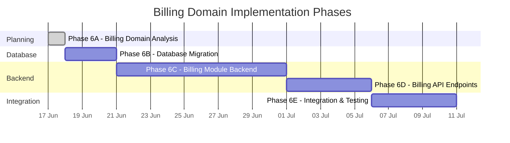

---

## Appendix A: Glossary Billing

| Istilah | Definisi |
|---|---|
| **Billing Period** | Periode penagihan bulanan (1 bulan kalender) per property |
| **Invoice** | Tagihan resmi yang diterbitkan kepada Penghuni untuk satu billing period |
| **Invoice Line Item** | Komponen breakdown pada invoice (sewa, listrik, air, WiFi, denda, dll.) |
| **Payment** | Record pembayaran yang sudah diverifikasi |
| **Payment Proof** | Bukti pembayaran (foto/screenshot transfer) yang di-upload Penghuni |
| **Payment Allocation** | Alokasi satu payment ke satu atau lebih invoice/deposit |
| **Late Fee** | Denda keterlambatan yang dihitung berdasarkan hari overdue |
| **Late Fee Assessment** | Record kalkulasi denda pada suatu invoice |
| **Outstanding Balance** | Total tagihan belum terbayar oleh seorang Penghuni |
| **Aging** | Pengelompokan invoice overdue berdasarkan lamanya keterlambatan |
| **Payment Account** | Rekening bank tujuan pembayaran yang ditampilkan ke Penghuni |
| **Pro-rata** | Perhitungan proporsional tagihan untuk bulan tidak penuh |
| **Void** | Pembatalan invoice/payment dengan alasan terdokumentasi |
| **Snapshot** | Salinan data (harga, nama, dll.) yang disimpan di invoice saat issuance |
| **Billing Settlement** | Penyelesaian seluruh tagihan outstanding saat Penghuni checkout |

---

## Appendix B: Keputusan Bisnis yang Dibutuhkan

Sebelum implementasi billing, keputusan berikut harus diambil:

| # | Keputusan | Dampak | Rekomendasi | Status |
|---|---|---|---|---|
| BD-01 | **Pro-rata bulan pertama/terakhir** | Invoice pertama & terakhir Penghuni | Bayar penuh — pro-rata disabled | ✅ Decided (D-01) |
| BD-02 | **Cap denda keterlambatan** | Maximum denda per invoice | 30% dari subtotal | ✅ Decided (D-03) |
| BD-03 | **Komponen utilitas** — flat rate atau meter? | Invoice line items | Flat rate Phase 1; meter Phase 2 | ⏳ Menunggu |
| BD-04 | **Tarif utilitas** (listrik, air, WiFi) | Invoice amounts | Perlu input dari pengelola | ⏳ Menunggu |
| BD-05 | **Grace period sebelum overdue** | Kapan denda mulai dihitung | 0 hari — langsung setelah due date | ✅ Decided (D-02) |
| BD-06 | **Minimum hari overdue untuk restriction eligible** | Smart Lock restriction trigger | 14 hari | ⏳ Menunggu |
| BD-07 | **Payment allocation order** — principal first atau pro-rata? | Bagaimana partial payment dialokasikan | Principal (sewa + utilitas) first, denda last | ⏳ Menunggu |
| BD-08 | **Billing saat checkout** — pro-rata bulan terakhir? | Final invoice | Bayar penuh bulan terakhir (simplicity) | ⏳ Menunggu |
| BD-09 | **Auto-issue vs manual issue invoice** | Workflow admin | Auto-issue setelah cron generate | ⏳ Menunggu |
| BD-10 | **Notifikasi billing ke Property Owner** | Ringkasan bulanan | Opsional, konfigurabel per investor | ⏳ Menunggu |
