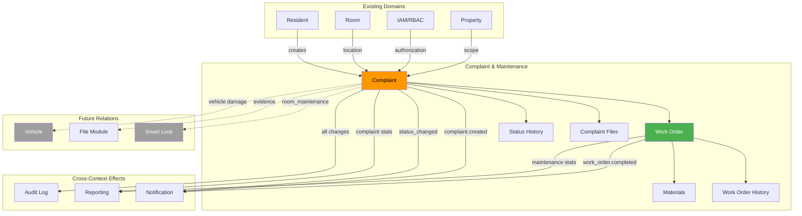
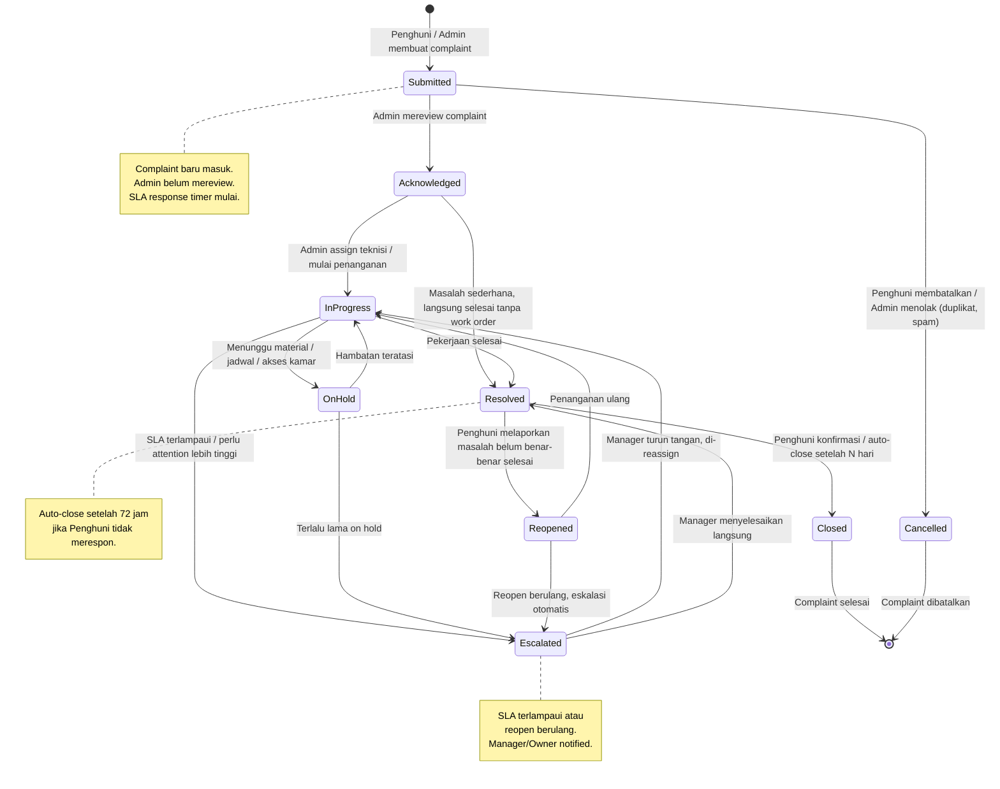
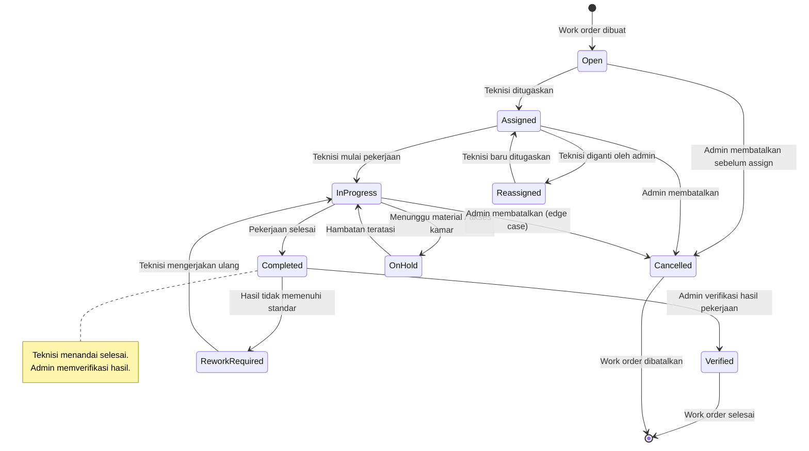
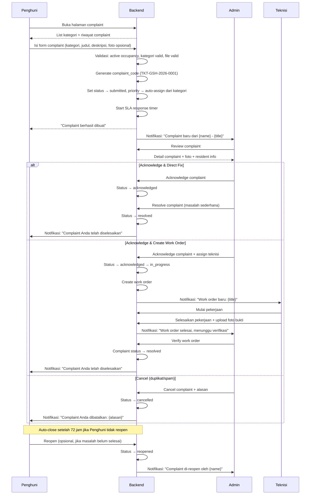
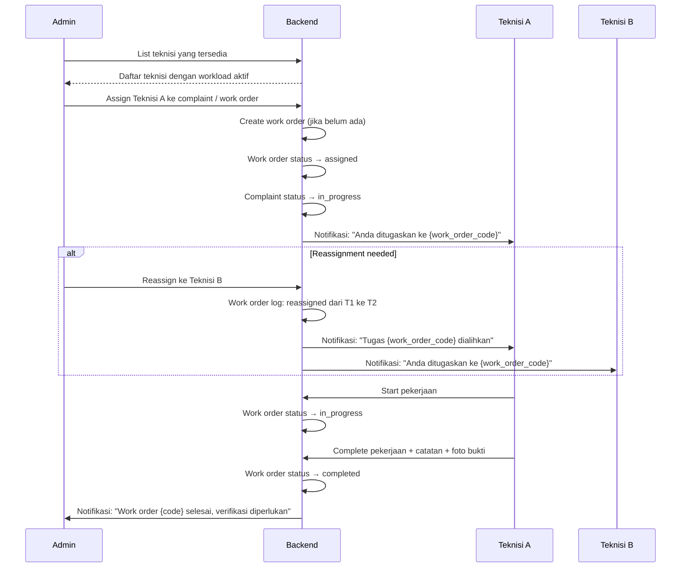
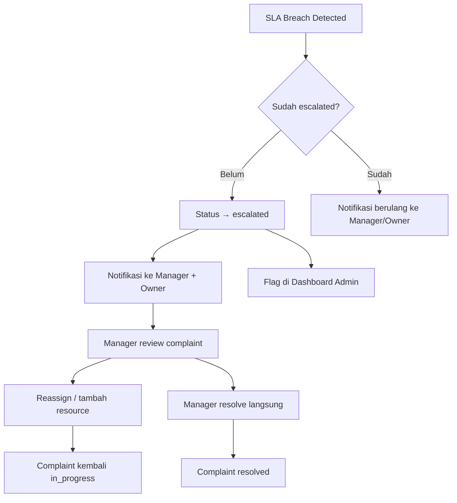
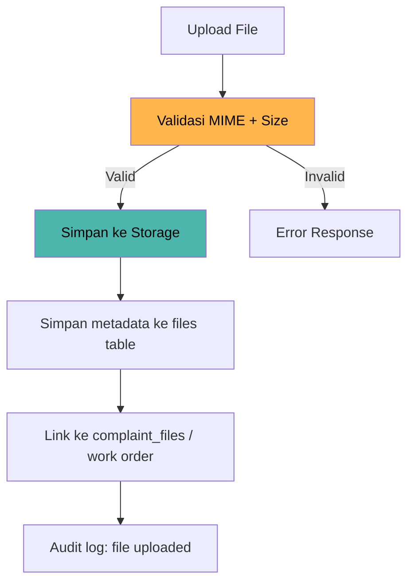
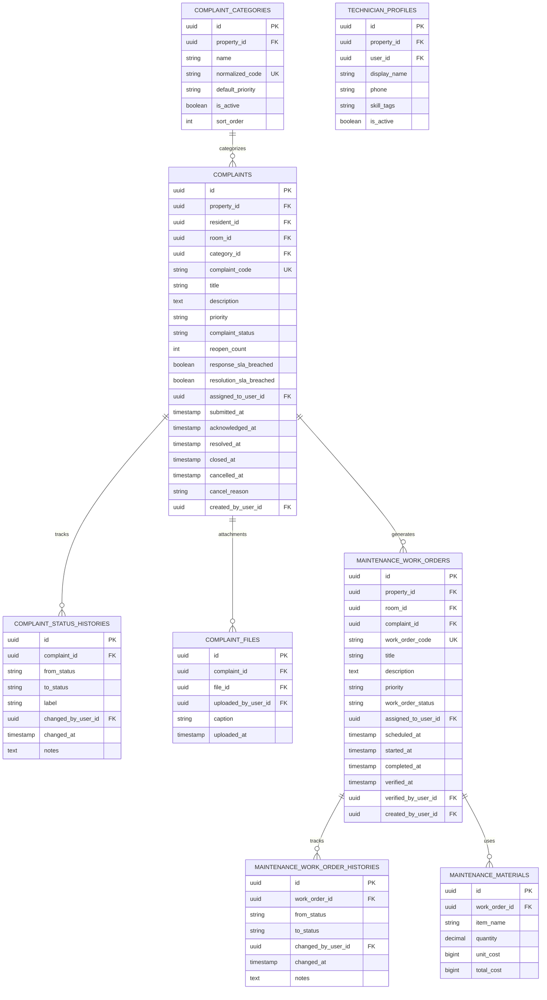
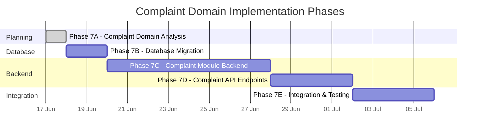

# COMPLAINT DOMAIN — Granada Kost Platform

> **Versi**: 1.0  
> **Tanggal**: 17 Juni 2026  
> **Peran Pembuat**: Principal Complaint Domain Architect  
> **Status**: Dokumen Analisis — Dasar Implementasi Complaint & Maintenance Module  
> **Dokumen Acuan**:  
> - [DOMAIN_MODEL.md](file:///d:/PROJECT%20CODING/Granada%20Kost%20Platform/docs/DOMAIN_MODEL.md)  
> - [DATABASE_PLANNING.md](file:///d:/PROJECT%20CODING/Granada%20Kost%20Platform/docs/DATABASE_PLANNING.md)  
> - [API_PLANNING.md](file:///d:/PROJECT%20CODING/Granada%20Kost%20Platform/docs/API_PLANNING.md)  
> - [BACKEND_ARCHITECTURE.md](file:///d:/PROJECT%20CODING/Granada%20Kost%20Platform/docs/BACKEND_ARCHITECTURE.md)  
> - [BILLING_DOMAIN.md](file:///d:/PROJECT%20CODING/Granada%20Kost%20Platform/docs/BILLING_DOMAIN.md)

---

## Daftar Isi

1. [Executive Summary](#1-executive-summary)
2. [Complaint Lifecycle](#2-complaint-lifecycle)
3. [Maintenance Lifecycle](#3-maintenance-lifecycle)
4. [Resident Complaint Flow](#4-resident-complaint-flow)
5. [Technician Assignment Flow](#5-technician-assignment-flow)
6. [SLA Strategy](#6-sla-strategy)
7. [Priority Strategy](#7-priority-strategy)
8. [Escalation Strategy](#8-escalation-strategy)
9. [Complaint Category Taxonomy](#9-complaint-category-taxonomy)
10. [Evidence / Photo Attachment Strategy](#10-evidence--photo-attachment-strategy)
11. [Property Owner Visibility](#11-property-owner-visibility)
12. [RBAC Matrix](#12-rbac-matrix)
13. [Audit Requirements](#13-audit-requirements)
14. [Notification Touchpoints](#14-notification-touchpoints)
15. [Database Entity Recommendation](#15-database-entity-recommendation)
16. [API Recommendation](#16-api-recommendation)
17. [Risks and Edge Cases](#17-risks-and-edge-cases)
18. [Future Domain Relations](#18-future-domain-relations)
19. [Implementation Phases](#19-implementation-phases)

---

## 1. Executive Summary

Complaint & Maintenance adalah **Supporting Domain** pada Granada Kost Platform yang mengelola siklus hidup keluhan penghuni, penugasan teknisi, dan penyelesaian pekerjaan maintenance. Domain ini menjadi jembatan antara kebutuhan penghuni dan operasional properti — setiap keluhan yang masuk harus tercatat, terlacak, dan terselesaikan dengan transparan.

### Konteks Saat Ini

| Aspek | Status |
|---|---|
| **Backend modules yang sudah ada** | IAM/Auth/RBAC, Property, Room, Resident, Occupancy, Billing |
| **Backend modules yang belum ada** | Complaint, Maintenance, Smart Lock, CCTV, Notification (full), File (full) |
| **Frontend complaint (Admin)** | UI sudah ada dengan mock data — stat cards, chart kategori, tabs status, detail dialog, assign teknisi, upload foto |
| **Frontend complaint (Penghuni)** | UI sudah ada dengan mock data — kategori grid, riwayat tiket, FAB buat tiket, form bottom sheet |
| **Skala** | ±163 kamar (123 RuKost + 40 ApartKost), estimasi 20–50 tiket/bulan |
| **Maintenance** | Complaint dapat berubah menjadi maintenance work order |
| **Teknisi** | Sudah memiliki role `technician` di RBAC, namun module complaint/maintenance belum dibangun |

### Hubungan dengan Domain Lain



---

## 2. Complaint Lifecycle

### 2.1 Gambaran Umum

Complaint lifecycle menggambarkan perjalanan keluhan dari saat penghuni menyampaikan masalah hingga masalah terselesaikan dan ditutup. Lifecycle ini memiliki dua jalur: **simple resolution** (langsung selesai tanpa work order) dan **maintenance resolution** (memerlukan pekerjaan fisik oleh teknisi).

### 2.2 State Diagram Complaint



### 2.3 Detail Status Complaint

| Status | Kode | Keterangan | Transisi yang Valid |
|---|---|---|---|
| **Submitted** | `submitted` | Complaint baru, belum ditinjau admin | → `acknowledged`, → `cancelled` |
| **Acknowledged** | `acknowledged` | Admin telah mereview, belum mulai dikerjakan | → `in_progress`, → `resolved` |
| **In Progress** | `in_progress` | Sedang dalam penanganan (work order aktif / tindakan langsung) | → `resolved`, → `on_hold`, → `escalated` |
| **On Hold** | `on_hold` | Terhenti sementara karena faktor eksternal | → `in_progress`, → `escalated` |
| **Escalated** | `escalated` | Ditingkatkan ke level yang lebih tinggi (manager/owner) | → `in_progress`, → `resolved` |
| **Resolved** | `resolved` | Masalah sudah diperbaiki, menunggu konfirmasi penghuni | → `closed`, → `reopened` |
| **Reopened** | `reopened` | Penghuni melaporkan masalah belum selesai | → `in_progress`, → `escalated` |
| **Closed** | `closed` | Selesai — terminal state | Terminal state |
| **Cancelled** | `cancelled` | Dibatalkan — duplikat, spam, atau retracted | Terminal state |

### 2.4 Transisi yang Dilarang

| Dari | Ke | Alasan |
|---|---|---|
| `closed` | any | Terminal state — jika masalah muncul lagi, buat complaint baru |
| `cancelled` | any | Terminal state — jika valid, buat complaint baru |
| `submitted` | `resolved` | Harus melalui `acknowledged` agar terdokumentasi review admin |
| `submitted` | `in_progress` | Harus melalui `acknowledged` dulu |
| `resolved` | `in_progress` | Harus melalui `reopened` agar tracking reopen count jelas |

### 2.5 Auto-Close Rule

| Parameter | Nilai |
|---|---|
| Auto-close delay | 72 jam setelah status `resolved` |
| Kondisi | Penghuni tidak melakukan reopen dalam 72 jam |
| Implementasi | Scheduled job atau delayed event |
| Override | Admin dapat menutup atau mereopen manual kapanpun |

### 2.6 Business Rules Complaint

| # | Rule | Keterangan |
|---|---|---|
| BR-CMP-01 | Penghuni hanya boleh membuat complaint untuk occupancy aktifnya | Validasi `resident_id` + active occupancy |
| BR-CMP-02 | Satu complaint memiliki tepat satu kategori | Kategori dari master `complaint_categories` |
| BR-CMP-03 | Complaint code unik per property per tahun | Format: `TKT-{PROPERTY_CODE}-{YYYY}-{NNNN}` |
| BR-CMP-04 | Setiap perubahan status wajib dicatat di `complaint_status_histories` | Termasuk actor, timestamp, notes |
| BR-CMP-05 | Complaint yang sudah `closed` tidak dapat diubah | Buat complaint baru jika masalah berulang |
| BR-CMP-06 | Reopen count di-track; reopen ≥ 3 kali otomatis escalate | Indikasi penyelesaian tidak tuntas |
| BR-CMP-07 | Complaint minimal memiliki title dan description | Photo/evidence opsional saat submit |
| BR-CMP-08 | Admin dapat membuat complaint atas nama Penghuni | Untuk laporan telepon/walk-in |
| BR-CMP-09 | Complaint cancelled oleh Penghuni hanya boleh saat status `submitted` | Setelah `acknowledged`, perlu admin intervention |
| BR-CMP-10 | Property scoping wajib pada semua query complaint | Multi-property ready |

---

## 3. Maintenance Lifecycle

### 3.1 Gambaran Umum

Maintenance work order adalah unit pekerjaan fisik yang harus diselesaikan oleh teknisi atau vendor. Work order bisa dibuat dari complaint (complaint-driven) atau secara mandiri oleh admin (internal maintenance). Satu complaint dapat menghasilkan satu atau lebih work order.

### 3.2 State Diagram Work Order



### 3.3 Detail Status Work Order

| Status | Kode | Keterangan | Transisi yang Valid |
|---|---|---|---|
| **Open** | `open` | Work order baru dibuat, belum di-assign | → `assigned`, → `cancelled` |
| **Assigned** | `assigned` | Teknisi sudah ditugaskan | → `in_progress`, → `cancelled` |
| **In Progress** | `in_progress` | Teknisi sedang mengerjakan | → `completed`, → `on_hold`, → `cancelled` |
| **On Hold** | `on_hold` | Menunggu material, jadwal, atau akses | → `in_progress` |
| **Completed** | `completed` | Teknisi menandai pekerjaan selesai | → `verified`, → `rework_required` |
| **Rework Required** | `rework_required` | Admin menilai hasil belum memadai | → `in_progress` |
| **Verified** | `verified` | Admin memverifikasi pekerjaan OK | Terminal state |
| **Cancelled** | `cancelled` | Dibatalkan | Terminal state |

### 3.4 Hubungan Complaint ↔ Work Order

```
Complaint (submitted → acknowledged → in_progress)
  └── Work Order 1 (open → assigned → in_progress → completed → verified)
  └── Work Order 2 (opsional, jika pekerjaan tambahan diperlukan)
      └── Semua work order verified → Complaint status → resolved
```

| Rule | Keterangan |
|---|---|
| Complaint → Work Order | 1:0..N — complaint bisa diselesaikan tanpa work order (simple fix) |
| Work Order → Complaint | N:0..1 — work order bisa independent (internal maintenance) |
| Auto-resolve | Ketika semua work order dari complaint sudah `verified`, complaint otomatis menjadi `resolved` |
| Partial completion | Jika salah satu work order masih belum selesai, complaint tetap `in_progress` |
| Independent work order | Work order tanpa complaint (preventive, internal) — `complaint_id` nullable |

### 3.5 Business Rules Work Order

| # | Rule | Keterangan |
|---|---|---|
| BR-WO-01 | Work order harus memiliki judul dan deskripsi | Minimal context untuk teknisi |
| BR-WO-02 | Work order code unik per property per tahun | Format: `WO-{PROPERTY_CODE}-{YYYY}-{NNNN}` |
| BR-WO-03 | Hanya owner/manager/admin yang dapat membuat work order | Teknisi hanya bisa update assigned work order |
| BR-WO-04 | Teknisi hanya dapat mengakses work order yang ditugaskan kepadanya | Kecuali ada permission tambahan |
| BR-WO-05 | Verifikasi work order memerlukan approval admin/manager/owner | Teknisi tidak bisa self-verify |
| BR-WO-06 | Material cost pada work order bersifat informatif | Tidak terhubung ke billing di Phase 1 |
| BR-WO-07 | Work order selesai bisa mempengaruhi room status | Dari `maintenance` → `vacant` jika room sedang maintenance |
| BR-WO-08 | Setiap perubahan status wajib dicatat di `maintenance_work_order_histories` | Termasuk actor, timestamp, notes |

---

## 4. Resident Complaint Flow

### 4.1 Flow Diagram — Penghuni Membuat Complaint



### 4.2 Penghuni Capabilities

| Aksi | Boleh? | Kondisi |
|---|---|---|
| Membuat complaint | ✅ | Memiliki active occupancy |
| Melihat complaint miliknya | ✅ | Self-scope enforcement |
| Upload foto saat submit | ✅ | Maksimal 3 file, ukuran ≤ 5 MB per file |
| Upload foto tambahan setelah submit | ✅ | Hanya saat status `submitted` atau `in_progress` |
| Cancel complaint sendiri | ✅ | Hanya saat status `submitted` |
| Reopen complaint | ✅ | Hanya saat status `resolved` (dalam 72 jam) |
| Melihat complaint Penghuni lain | ❌ | Self-scope wajib |
| Assign teknisi | ❌ | Admin only |
| Mengubah prioritas | ❌ | Admin only |
| Mengubah kategori | ❌ | Admin only |
| Melihat work order detail | ❌ | Admin/Teknisi only |

---

## 5. Technician Assignment Flow

### 5.1 Flow Diagram



### 5.2 Technician Availability

| Parameter | Strategi Phase 1 |
|---|---|
| Tracking workload | Count work orders aktif (assigned + in_progress) per teknisi |
| Availability status | Ditentukan manual oleh admin (active/inactive di `technician_profiles`) |
| Skill matching | Opsional — `skill_tags` pada `technician_profiles` bisa dipakai admin untuk referensi manual |
| Auto-assignment | ❌ Tidak ada di Phase 1 — assignment selalu manual oleh admin |
| Multi-property | Teknisi di-assign per property via `user_property_roles` |

### 5.3 Business Rules Assignment

| # | Rule | Keterangan |
|---|---|---|
| BR-ASN-01 | Hanya owner/manager/admin yang boleh assign teknisi | Teknisi tidak bisa self-assign |
| BR-ASN-02 | Teknisi yang di-assign harus aktif dan terdaftar pada property yang sama | Validasi `technician_profiles.is_active` + property scope |
| BR-ASN-03 | Reassignment harus mencatat alasan dan actor | Audit trail assignment history |
| BR-ASN-04 | Teknisi hanya melihat dan meng-update work order yang ditugaskan kepadanya | Kecuali ada permission tambahan |
| BR-ASN-05 | Assignment otomatis membuat work order jika belum ada | Shortcut workflow: assign = acknowledge + create WO + assign |

---

## 6. SLA Strategy

### 6.1 Definisi SLA

SLA (Service Level Agreement) mendefinisikan target waktu penanganan complaint berdasarkan prioritas. SLA bersifat **soft** pada Phase 1 — pelanggaran SLA menghasilkan eskalasi dan notifikasi, bukan penalti otomatis.

### 6.2 SLA Targets

| Prioritas | Response SLA | Resolution SLA | Keterangan |
|---|---|---|---|
| **Urgent** | ≤ 2 jam | ≤ 24 jam | Keamanan, kebocoran gas, listrik padam total |
| **High** | ≤ 4 jam | ≤ 48 jam | AC rusak di cuaca panas, air mati, WiFi mati total |
| **Medium** | ≤ 8 jam | ≤ 5 hari | Kerusakan fasilitas non-kritis |
| **Low** | ≤ 24 jam | ≤ 10 hari | Saran, permintaan perbaikan kosmetik |

### 6.3 Definisi Waktu SLA

| Metric | Definisi |
|---|---|
| **Response SLA** | Waktu dari `submitted` ke `acknowledged` |
| **Resolution SLA** | Waktu dari `submitted` ke `resolved` |
| **SLA breach** | Waktu aktual melebihi target SLA untuk prioritas terkait |
| **SLA compliance rate** | Persentase complaint yang diselesaikan dalam target SLA |
| **On-hold exclusion** | Waktu saat status `on_hold` **tidak** dihitung dalam SLA resolution (clock pause) |

### 6.4 SLA Monitoring

```
Cron: Setiap 30 menit
│
├── Query: complaints WHERE complaint_status IN ('submitted', 'acknowledged', 'in_progress')
│
├── Untuk setiap complaint:
│   ├── Hitung elapsed time (exclude on_hold periods)
│   ├── Bandingkan dengan SLA target berdasarkan priority
│   ├── Jika response SLA breach:
│   │   ├── Flag complaint sebagai response_sla_breached
│   │   └── Notifikasi ke admin + manager
│   └── Jika resolution SLA breach:
│       ├── Flag complaint sebagai resolution_sla_breached
│       ├── Notifikasi ke admin + manager + owner
│       └── Auto-escalate jika belum escalated
│
└── Update dashboard SLA metrics
```

### 6.5 Phase 1 SLA Implementation

| Aspek | Phase 1 | Phase 2 |
|---|---|---|
| SLA targets | Konfigurabel per property di `property_settings` atau hardcoded | Dynamic SLA per kategori + prioritas |
| SLA tracking | Calculated dari `complaint_status_histories` timestamps | Dedicated `complaint_sla_records` table |
| SLA breach action | Notifikasi + flag | Auto-escalation + SLA breach reporting |
| SLA dashboard | Rata-rata response/resolution time (sudah ada di mock: 1.4 hari) | Full SLA compliance dashboard |
| On-hold clock pause | Calculated dari status history | Pre-calculated field |

---

## 7. Priority Strategy

### 7.1 Priority Levels

| Level | Kode | Warna UI | Definisi | Contoh Kasus |
|---|---|---|---|---|
| **Urgent** | `urgent` | 🔴 Merah | Keselamatan, keamanan, atau kondisi tidak layak huni | Kebocoran gas, korsleting listrik, pintu rusak tidak bisa dikunci, kebanjiran |
| **High** | `high` | 🟠 Oranye | Gangguan signifikan terhadap kenyamanan tinggal | AC mati total, air mati, WiFi mati total property, lift rusak |
| **Medium** | `medium` | 🟡 Kuning | Masalah yang mengganggu tapi masih bisa ditoleransi sementara | AC kurang dingin, keran bocor kecil, WiFi lambat, lampu mati |
| **Low** | `low` | 🟢 Hijau | Masalah minor atau permintaan perbaikan | Cat mengelupas, furnitur minor, saran perbaikan, kebersihan area umum |

### 7.2 Auto-Priority dari Kategori

Untuk mempermudah Penghuni (yang tidak menentukan prioritas sendiri), sistem dapat meng-assign priority awal berdasarkan kategori:

| Kategori | Default Priority | Override oleh Admin |
|---|---|---|
| `security` | `urgent` | ✅ |
| `electricity` | `high` | ✅ |
| `water` | `high` | ✅ |
| `ac` | `high` | ✅ |
| `internet` | `medium` | ✅ |
| `room_facility` | `medium` | ✅ |
| `cleanliness` | `low` | ✅ |
| `other` | `low` | ✅ |

### 7.3 Priority Business Rules

| # | Rule | Keterangan |
|---|---|---|
| BR-PRI-01 | Penghuni tidak menentukan priority — auto-assigned dari kategori | Mengurangi abuse dan simplify UX |
| BR-PRI-02 | Admin/Manager/Owner dapat mengubah priority kapanpun | Dengan audit trail |
| BR-PRI-03 | Priority change harus tercatat di status history | Audit siapa, kapan, dari apa ke apa |
| BR-PRI-04 | Priority mempengaruhi SLA target | Complaint urgent = SLA paling ketat |
| BR-PRI-05 | Dashboard admin menampilkan complaint sorted by priority | Urgent di atas |

---

## 8. Escalation Strategy

### 8.1 Escalation Triggers

| # | Trigger | Aksi | Notifikasi Ke |
|---|---|---|---|
| ESC-01 | **Response SLA breach** — complaint belum di-acknowledge dalam batas waktu | Auto-flag `response_sla_breached`; escalate ke manager | Manager, Owner |
| ESC-02 | **Resolution SLA breach** — complaint belum resolved dalam batas waktu | Auto-flag `resolution_sla_breached`; status → `escalated` | Manager, Owner |
| ESC-03 | **Reopen count ≥ 3** — penghuni reopen complaint 3 kali atau lebih | Status → `escalated`; penanganan ulang diperlukan | Manager, Owner |
| ESC-04 | **On-hold terlalu lama** — complaint on_hold > 7 hari | Notifikasi pengingat; pertimbangkan escalation | Admin, Manager |
| ESC-05 | **Manual escalation** — admin menilai perlu perhatian manager/owner | Status → `escalated` oleh admin | Manager, Owner |
| ESC-06 | **Urgent complaint idle** — urgent complaint belum di-assign > 1 jam | Notifikasi berulang tiap 30 menit | Admin, Manager, Owner |

### 8.2 Escalation Flow



### 8.3 Escalation Business Rules

| # | Rule | Keterangan |
|---|---|---|
| BR-ESC-01 | Escalation tidak mengubah assigned technician secara otomatis | Manager memutuskan reassignment |
| BR-ESC-02 | Escalated complaint mendapat visual indicator di dashboard | Badge/icon merah, pinned di atas queue |
| BR-ESC-03 | Manager/Owner melihat escalated complaints di dashboard summary | Count dan list escalated complaints |
| BR-ESC-04 | Escalation de-escalation terjadi saat complaint kembali ke `in_progress` | Manager sudah menangani |
| BR-ESC-05 | Semua escalation dicatat di status history dengan trigger reason | Audit: "SLA breach", "Reopen ≥ 3", "Manual" |

---

## 9. Complaint Category Taxonomy

### 9.1 Masalah dari Audit

DOMAIN_MODEL.md mencatat inkonsistensi kategori antara Admin dan Penghuni:
- Admin: "WiFi", "Fasilitas"
- Penghuni: "Internet", "Kerusakan kamar"

Kategori harus **distandarisasi** di shared domain.

### 9.2 Kategori Terstandarisasi

| # | Kode Canonical | Label UI (Indonesia) | Icon Suggestion | Default Priority | Deskripsi |
|---|---|---|---|---|---|
| 1 | `ac` | AC / Pendingin Ruangan | ❄️ | `high` | Masalah AC: tidak dingin, mati, bocor, bau |
| 2 | `water` | Air / Plumbing | 💧 | `high` | Air mati, keran bocor, pipa pecah, water heater |
| 3 | `electricity` | Listrik | ⚡ | `high` | Listrik padam, stop kontak rusak, korsleting |
| 4 | `internet` | Internet / WiFi | 🌐 | `medium` | WiFi mati, lambat, tidak bisa connect |
| 5 | `room_facility` | Fasilitas Kamar | 🛏️ | `medium` | Kerusakan furnitur, pintu, jendela, kunci manual, kamar mandi |
| 6 | `cleanliness` | Kebersihan | 🧹 | `low` | Area umum kotor, sampah, hama |
| 7 | `security` | Keamanan | 🔒 | `urgent` | Pencurian, orang asing, pintu/gerbang rusak, CCTV mati |
| 8 | `common_facility` | Fasilitas Umum | 🏢 | `medium` | Parkiran, lobby, laundry room, lift, tangga |
| 9 | `noise` | Kebisingan | 🔊 | `low` | Penghuni berisik, konstruksi, kendaraan |
| 10 | `other` | Lainnya | 📋 | `low` | Masalah yang tidak masuk kategori lain |

### 9.3 Category Taxonomy Rules

| # | Rule | Keterangan |
|---|---|---|
| BR-CAT-01 | Kategori disimpan di `complaint_categories` table | Bukan hardcoded enum di kode |
| BR-CAT-02 | Kategori memiliki `normalized_code` untuk query/reporting | Konsisten lintas UI |
| BR-CAT-03 | Kategori memiliki `sort_order` untuk urutan tampil di UI | Penghuni app: grid kategori |
| BR-CAT-04 | Admin dapat menambah/menonaktifkan kategori | Soft delete — `is_active` flag |
| BR-CAT-05 | Kategori memiliki `default_priority` | Auto-assign priority saat submit |
| BR-CAT-06 | Kategori memiliki `property_id` | Multi-property ready — beda properti bisa beda kategori |
| BR-CAT-07 | Setiap kategori memiliki `label_id` (Indonesia) dan opsional `label_en` | Bilingual ready |

---

## 10. Evidence / Photo Attachment Strategy

### 10.1 Gambaran Umum

Foto/evidence adalah bukti visual yang memperkuat complaint dan membantu admin/teknisi memahami masalah. File juga digunakan teknisi untuk mendokumentasikan hasil pekerjaan (before/after).

### 10.2 Upload Rules

| Parameter | Aturan |
|---|---|
| Tipe file yang diizinkan | `image/jpeg`, `image/png`, `image/webp` |
| Ukuran maksimal per file | 5 MB |
| Jumlah file per complaint | 1 – 5 file |
| Jumlah file per work order completion | 1 – 5 file |
| Resolusi minimum | Tidak ada hard limit; UI bisa warn jika terlalu kecil |
| Penyimpanan | Private — hanya accessible oleh uploader, admin, dan assigned technician |
| Audit | Upload dan setiap akses file dicatat di `file_access_logs` |

### 10.3 Siapa yang Boleh Upload

| Aktor | Kapan | Tujuan |
|---|---|---|
| **Penghuni** | Saat membuat complaint (`submitted`) | Bukti masalah |
| **Penghuni** | Saat complaint masih `submitted` / `in_progress` | Foto tambahan |
| **Admin** | Kapanpun complaint belum `closed`/`cancelled` | Dokumentasi admin |
| **Teknisi** | Saat work order yang ditugaskan kepadanya aktif | Bukti before/after pekerjaan |

### 10.4 Evidence Storage Strategy



### 10.5 Integrasi dengan File Module

| Aspek | Strategi |
|---|---|
| Relasi complaint-file | Melalui `complaint_files` table (complaint_id + file_id) |
| Relasi work order-file | Melalui `file_links` table (resource_type=`maintenance_work_order`) |
| File ownership | `complaint_files.uploaded_by_user_id` tracking |
| File visibility | Private — signed URL atau backend streaming |
| Retention | Mengikuti complaint retention: 3–5 tahun |
| TD-004 dependency | `complaint_files.file_id` sebagai logical FK; formal FK ditambahkan saat File Module full |

### 10.6 Business Rules Evidence

| # | Rule | Keterangan |
|---|---|---|
| BR-EVI-01 | Penghuni hanya boleh upload file untuk complaint miliknya sendiri | Self-scope |
| BR-EVI-02 | Teknisi hanya boleh upload file untuk work order yang ditugaskan kepadanya | Assignment scope |
| BR-EVI-03 | File evidence tidak boleh dihapus oleh Penghuni setelah di-upload | Admin bisa soft-delete |
| BR-EVI-04 | File URL menggunakan signed URL atau backend streaming | Raw object key tidak boleh terekspos |
| BR-EVI-05 | Foto sebelum dan sesudah pekerjaan di-encourage untuk teknisi | UI guidance, bukan hard requirement |

---

## 11. Property Owner Visibility

### 11.1 Prinsip Dasar

Pemilik Rumah Kost (`property_owner`) memiliki akses **read-only** ke ringkasan complaint dan maintenance property miliknya. Mereka bisa melihat statistik operasional tetapi **tidak boleh** melakukan mutasi apapun.

### 11.2 Data yang Terlihat oleh Property Owner

| Data | Level Detail | Endpoint Pattern |
|---|---|---|
| **Complaint summary** | Count per status, per kategori, per prioritas (aggregate) | `GET /api/v1/property-owner/properties/{id}/complaint-summary` |
| **Average resolution time** | Rata-rata waktu penyelesaian complaint | Termasuk dalam complaint-summary |
| **SLA compliance rate** | Persentase complaint selesai dalam SLA | Termasuk dalam complaint-summary |
| **Open complaint count** | Jumlah complaint aktif (belum resolved/closed) | Termasuk dalam complaint-summary |
| **Maintenance summary** | Count work order per status (aggregate) | Termasuk dalam complaint-summary |

### 11.3 Data yang TIDAK Terlihat oleh Property Owner

| Data | Alasan |
|---|---|
| Detail complaint per Penghuni | PII concern — hanya admin yang perlu |
| Complaint description/deskripsi | Operational detail |
| Foto evidence complaint | Privacy dan operational |
| Work order detail | Operational detail |
| Technician assignment | Internal operation |
| Complaint status history | Too granular |
| Complaint cancel reason | Internal operation |
| Individual response/resolution times | Too granular |

### 11.4 Property Owner Business Rules

| # | Rule | Keterangan |
|---|---|---|
| BR-PO-CMP-01 | Property owner hanya melihat data property yang di-assign kepadanya | `property_investor_assignments` scoping |
| BR-PO-CMP-02 | Property owner tidak dapat membuat, update, atau cancel complaint | Write operations forbidden |
| BR-PO-CMP-03 | Property owner tidak menerima notifikasi complaint individual | Hanya summary bulanan (opsional) |
| BR-PO-CMP-04 | Semua read access property owner ke complaint data di-audit | `audit_logs` |

---

## 12. RBAC Matrix

### 12.1 Matrix Lengkap Complaint & Maintenance Operations

| Operation | `owner` | `manager` | `admin` | `technician` | `resident` | `property_owner` |
|---|:---:|:---:|:---:|:---:|:---:|:---:|
| **Complaint** | | | | | | |
| View all complaints | ✅ | ✅ | ✅ | ❌ | ❌ | ❌ |
| View assigned complaints | — | — | — | ✅ | — | ❌ |
| View own complaints | — | — | — | ❌ | ✅ | ❌ |
| View complaint aggregate | ✅ | ✅ | ✅ | ❌ | ❌ | ✅ (summary) |
| Create complaint (admin) | ✅ | ✅ | ✅ | ❌ | ❌ | ❌ |
| Create complaint (self) | — | — | — | ❌ | ✅ | ❌ |
| Acknowledge complaint | ✅ | ✅ | ✅ | ❌ | ❌ | ❌ |
| Update complaint metadata | ✅ | ✅ | ✅ | ❌ | ❌ | ❌ |
| Change complaint priority | ✅ | ✅ | ✅ | ❌ | ❌ | ❌ |
| Cancel complaint | ✅ | ✅ | ✅ | ❌ | ✅ (own, submitted only) | ❌ |
| Resolve complaint | ✅ | ✅ | ✅ | ❌ | ❌ | ❌ |
| Reopen complaint | ✅ | ✅ | ✅ | ❌ | ✅ (own, resolved only) | ❌ |
| Escalate complaint | ✅ | ✅ | ✅ | ❌ | ❌ | ❌ |
| Upload complaint photo | ✅ | ✅ | ✅ | ✅ (assigned) | ✅ (own) | ❌ |
| **Work Order** | | | | | | |
| View all work orders | ✅ | ✅ | ✅ | ❌ | ❌ | ❌ |
| View assigned work orders | — | — | — | ✅ | ❌ | ❌ |
| Create work order | ✅ | ✅ | ✅ | ❌ | ❌ | ❌ |
| Assign / reassign technician | ✅ | ✅ | ✅ | ❌ | ❌ | ❌ |
| Start work order | ✅ | ✅ | ✅ | ✅ (assigned) | ❌ | ❌ |
| Complete work order | ✅ | ✅ | ✅ | ✅ (assigned) | ❌ | ❌ |
| Verify work order | ✅ | ✅ | ✅ | ❌ | ❌ | ❌ |
| Request rework | ✅ | ✅ | ✅ | ❌ | ❌ | ❌ |
| Cancel work order | ✅ | ✅ | ✅ | ❌ | ❌ | ❌ |
| Upload work order photo | ✅ | ✅ | ✅ | ✅ (assigned) | ❌ | ❌ |
| **Category Management** | | | | | | |
| View categories | ✅ | ✅ | ✅ | ✅ | ✅ | ❌ |
| Manage categories | ✅ | ✅ | ❌ | ❌ | ❌ | ❌ |
| **Reporting** | | | | | | |
| Complaint report (full) | ✅ | ✅ | ✅ | ❌ | ❌ | ❌ |
| Complaint summary (owner) | ✅ | ✅ | ✅ | ❌ | ❌ | ✅ |
| Maintenance report | ✅ | ✅ | ✅ | ❌ | ❌ | ❌ |
| Export complaint data | ✅ | ✅ | ❌ | ❌ | ❌ | ❌ |

### 12.2 Permission Codes untuk Complaint & Maintenance

| Permission Code | Deskripsi |
|---|---|
| `complaint.view` | Melihat complaint list, detail, timeline |
| `complaint.manage` | Create/acknowledge/assign/resolve/escalate/cancel complaint |
| `complaint.self.create` | Penghuni membuat complaint untuk dirinya sendiri |
| `complaint.self.view` | Penghuni melihat complaint miliknya sendiri |
| `complaint.self.reopen` | Penghuni reopen complaint miliknya yang resolved |
| `complaint.self.cancel` | Penghuni cancel complaint miliknya yang submitted |
| `maintenance.view` | Melihat work order list dan detail |
| `maintenance.manage` | Create/assign/verify/cancel work order |
| `maintenance.assigned.view` | Teknisi melihat work order yang ditugaskan |
| `maintenance.assigned.update` | Teknisi start/complete work order yang ditugaskan |
| `complaint.category.manage` | Mengelola master kategori complaint |
| `complaint.export` | Export data complaint ke CSV/Excel |

### 12.3 Property Scoping Enforcement

| Scope Type | Enforcement |
|---|---|
| Staff (owner/manager/admin) | `user_property_roles` — hanya akses property yang di-assign |
| Technician | `user_property_roles` + `assigned_to_user_id` pada work order |
| Resident | `resident_id` dari auth context — hanya complaint miliknya |
| Property Owner | `property_investor_assignments` — read-only summary, hanya property miliknya |

---

## 13. Audit Requirements

### 13.1 High-Priority Audited Operations

| # | Operation | Audit Level | Data yang Dicatat | Audit Target |
|---|---|---|---|---|
| AUD-CMP-01 | **Complaint created** | Required | complaint_id, resident_id, category, priority, creator | `audit_logs` |
| AUD-CMP-02 | **Complaint acknowledged** | Required | complaint_id, actor | `audit_logs` + `complaint_status_histories` |
| AUD-CMP-03 | **Complaint status changed** | Required | complaint_id, from_status, to_status, actor, notes | `complaint_status_histories` + `audit_logs` |
| AUD-CMP-04 | **Complaint priority changed** | Required | complaint_id, old_priority, new_priority, actor, reason | `audit_logs` |
| AUD-CMP-05 | **Complaint cancelled** | Required | complaint_id, cancel_reason, actor | `complaint_status_histories` + `audit_logs` |
| AUD-CMP-06 | **Complaint escalated** | Required | complaint_id, escalation_reason, actor_or_system | `complaint_status_histories` + `audit_logs` |
| AUD-CMP-07 | **Complaint reopened** | Required | complaint_id, reopen_reason, actor (resident/admin) | `complaint_status_histories` + `audit_logs` |
| AUD-CMP-08 | **Complaint file uploaded** | Required | complaint_id, file_id, uploader | `audit_logs` + `file_access_logs` |
| AUD-CMP-09 | **Technician assigned** | Required | work_order_id, technician_user_id, assigner, old_assignee | `audit_logs` + `maintenance_work_order_histories` |
| AUD-CMP-10 | **Work order status changed** | Required | work_order_id, from_status, to_status, actor, notes | `maintenance_work_order_histories` + `audit_logs` |
| AUD-CMP-11 | **Work order verified** | Required | work_order_id, verifier, verification_result | `audit_logs` |
| AUD-CMP-12 | **Work order rework requested** | Required | work_order_id, reason, requester | `audit_logs` + `maintenance_work_order_histories` |
| AUD-CMP-13 | **Category created/updated** | Required | category_id, before_data, after_data, actor | `audit_logs` |
| AUD-CMP-14 | **Complaint data exported** | Required | export_type, filter_params, actor | `audit_logs` |
| AUD-CMP-15 | **Property owner reads complaint summary** | Required | property_id, data_type, actor | `audit_logs` |

### 13.2 Audit Data Schema

Setiap audit entry minimal berisi (konsisten dengan BILLING_DOMAIN.md §12.2):

| Field | Keterangan |
|---|---|
| `actor_user_id` | Siapa yang melakukan aksi |
| `property_id` | Property scope |
| `action` | Kode aksi (contoh: `complaint.created`, `work_order.assigned`) |
| `resource_type` | Tipe resource (contoh: `complaint`, `maintenance_work_order`) |
| `resource_id` | ID resource yang terpengaruh |
| `before_data` | State sebelum perubahan (JSON) — untuk update/status change |
| `after_data` | State setelah perubahan (JSON) |
| `ip_address` | IP address aktor |
| `user_agent` | User agent aktor |
| `correlation_id` | Correlation ID dari request |
| `occurred_at` | Timestamp aksi |

### 13.3 Audit Retention untuk Complaint

| Jenis Data | Retention |
|---|---|
| Complaint audit | Minimum 3 tahun, rekomendasi 5 tahun |
| Work order audit | Minimum 3 tahun |
| Assignment audit | Minimum 3 tahun |
| Category management audit | Minimum 2 tahun |
| Property owner access audit | Minimum 2 tahun |
| Export audit | Minimum 2 tahun |

### 13.4 PII Protection dalam Audit

| Data | Perlakuan |
|---|---|
| Resident name | Boleh di-log sebagai referensi (bukan PII sensitif) |
| KTP number | **Tidak boleh** di-log dalam audit complaint |
| Complaint description | Boleh di-log (bukan PII) |
| Complaint photo file content | **Tidak boleh** di-log; hanya file_id reference |
| Technician name | Boleh di-log sebagai referensi |

---

## 14. Notification Touchpoints

### 14.1 Notification Events

| # | Event | Penerima | Channel | Prioritas |
|---|---|---|---|---|
| NOTIF-CMP-01 | **Complaint created** | Admin (semua admin property) | In-app | Normal |
| NOTIF-CMP-02 | **Complaint acknowledged** | Penghuni (complaint owner) | In-app | Normal |
| NOTIF-CMP-03 | **Technician assigned** | Teknisi yang ditugaskan | In-app | High |
| NOTIF-CMP-04 | **Technician reassigned** | Teknisi lama + teknisi baru | In-app | Normal |
| NOTIF-CMP-05 | **Work order started** | Admin + Penghuni (complaint owner) | In-app | Low |
| NOTIF-CMP-06 | **Work order completed** | Admin (verifikasi diperlukan) | In-app | Normal |
| NOTIF-CMP-07 | **Complaint resolved** | Penghuni (complaint owner) | In-app | High |
| NOTIF-CMP-08 | **Complaint cancelled** | Penghuni (complaint owner) | In-app | Normal |
| NOTIF-CMP-09 | **Complaint reopened** | Admin + assigned technician | In-app | High |
| NOTIF-CMP-10 | **SLA response breached** | Admin + Manager | In-app | High |
| NOTIF-CMP-11 | **SLA resolution breached** | Admin + Manager + Owner | In-app | Urgent |
| NOTIF-CMP-12 | **Complaint escalated** | Manager + Owner | In-app | Urgent |
| NOTIF-CMP-13 | **Urgent complaint created** | Admin + Manager | In-app | Urgent |
| NOTIF-CMP-14 | **Work order rework required** | Assigned technician | In-app | High |
| NOTIF-CMP-15 | **Auto-close warning** | Penghuni (72 jam sebelum auto-close) | In-app | Low |

### 14.2 Notification Content Template (Contoh)

| Event | Title | Body |
|---|---|---|
| Complaint created | Complaint Baru | "{resident_name} di kamar {room_number} melaporkan masalah: {title}" |
| Complaint resolved | Complaint Diselesaikan | "Complaint Anda \"{title}\" telah diselesaikan. Jika masalah belum teratasi, Anda dapat membuka kembali tiket ini dalam 72 jam." |
| Technician assigned | Tugas Baru | "Anda ditugaskan ke work order {work_order_code}: {title}" |
| SLA breached | ⚠️ SLA Terlampaui | "Complaint {complaint_code} belum {response/resolved} melampaui target SLA ({priority})." |
| Complaint escalated | 🔴 Eskalasi Complaint | "Complaint {complaint_code} telah di-eskalasi. Alasan: {reason}" |

### 14.3 Domain Events yang Dipublish oleh Complaint Module

| Event | Trigger | Consumers |
|---|---|---|
| `complaint.created` | Complaint baru dibuat | Notification, Audit |
| `complaint.acknowledged` | Admin acknowledge complaint | Notification, Audit |
| `complaint.status_changed` | Setiap status transition | Notification, Audit |
| `complaint.priority_changed` | Priority di-update | Audit |
| `complaint.escalated` | Complaint di-escalate | Notification, Audit |
| `complaint.resolved` | Complaint resolved | Notification, Auto-close scheduler |
| `complaint.reopened` | Penghuni reopen complaint | Notification, Audit |
| `complaint.closed` | Auto-close atau manual close | Audit |
| `complaint.cancelled` | Complaint dibatalkan | Notification, Audit |
| `complaint.file_uploaded` | File baru di-attach | Audit |
| `work_order.created` | Work order baru dibuat | Notification, Audit |
| `work_order.assigned` | Teknisi ditugaskan | Notification, Audit |
| `work_order.started` | Teknisi mulai pekerjaan | Notification, Audit |
| `work_order.completed` | Teknisi menyelesaikan pekerjaan | Notification, Audit, Complaint (auto-resolve check) |
| `work_order.verified` | Admin verifikasi OK | Notification, Complaint (auto-resolve trigger), Room (status update if maintenance) |
| `work_order.rework_required` | Admin minta rework | Notification, Audit |

---

## 15. Database Entity Recommendation

### 15.1 Entity Relationship Diagram



### 15.2 Tabel — Sudah Direncanakan vs Baru

| # | Tabel | Sudah di DB Planning? | Keterangan |
|---|---|---|---|
| 1 | `complaint_categories` | ✅ Ya | Master kategori complaint per property |
| 2 | `complaints` | ✅ Ya | Tiket complaint utama — ditambahkan field SLA dan reopen tracking |
| 3 | `complaint_status_histories` | ✅ Ya | Timeline complaint |
| 4 | `complaint_files` | ✅ Ya | Lampiran foto complaint |
| 5 | `technician_profiles` | ✅ Ya | Profil teknisi linked to user |
| 6 | `maintenance_work_orders` | ✅ Ya | Work order maintenance — ditambahkan verified_at, verified_by |
| 7 | `maintenance_work_order_histories` | ✅ Ya | Riwayat status work order |
| 8 | `maintenance_materials` | ✅ Ya | Material/biaya pekerjaan |

### 15.3 Detail Kolom per Tabel

#### 15.3.1 `complaint_categories`

| Kolom | Tipe | Constraint | Keterangan |
|---|---|---|---|
| `id` | UUID | PK | |
| `property_id` | UUID | FK → properties, NOT NULL | Multi-property scope |
| `name` | TEXT | NOT NULL | Label UI: "AC / Pendingin Ruangan" |
| `normalized_code` | TEXT | NOT NULL, UNIQUE(property_id, normalized_code) | Query code: `ac`, `water`, `internet` |
| `default_priority` | TEXT | NOT NULL, CHECK IN ('low','medium','high','urgent') | Auto-assign saat submit |
| `description` | TEXT | | Deskripsi opsional untuk admin |
| `icon` | TEXT | | Icon reference opsional |
| `is_active` | BOOLEAN | NOT NULL, DEFAULT true | Soft deactivation |
| `sort_order` | INT | NOT NULL, DEFAULT 0 | Urutan tampil di UI |
| `created_by_user_id` | UUID | FK → users | |
| `created_at` | TIMESTAMPTZ | NOT NULL, DEFAULT NOW() | |
| `updated_at` | TIMESTAMPTZ | NOT NULL, DEFAULT NOW() | |

#### 15.3.2 `complaints`

| Kolom | Tipe | Constraint | Keterangan |
|---|---|---|---|
| `id` | UUID | PK | |
| `property_id` | UUID | FK → properties, NOT NULL | |
| `resident_id` | UUID | FK → residents, NOT NULL | Penghuni pelapor |
| `room_id` | UUID | FK → rooms, NOT NULL | Kamar terkait (snapshot saat submit) |
| `category_id` | UUID | FK → complaint_categories, NOT NULL | Kategori complaint |
| `complaint_code` | TEXT | NOT NULL, UNIQUE(property_id, complaint_code) | Format: `TKT-GSH-2026-0001` |
| `title` | TEXT | NOT NULL | Judul singkat |
| `description` | TEXT | NOT NULL | Deskripsi lengkap masalah |
| `priority` | TEXT | NOT NULL, CHECK IN ('low','medium','high','urgent') | Auto-set dari kategori, overrideable |
| `complaint_status` | TEXT | NOT NULL, CHECK IN ('submitted','acknowledged','in_progress','on_hold','escalated','resolved','reopened','closed','cancelled') | |
| `reopen_count` | INT | NOT NULL, DEFAULT 0 | Tracking reopen untuk escalation rule |
| `response_sla_breached` | BOOLEAN | NOT NULL, DEFAULT false | Flag SLA response breach |
| `resolution_sla_breached` | BOOLEAN | NOT NULL, DEFAULT false | Flag SLA resolution breach |
| `assigned_to_user_id` | UUID | FK → users | Teknisi/staff yang ditugaskan (bisa null jika belum assign) |
| `submitted_at` | TIMESTAMPTZ | NOT NULL, DEFAULT NOW() | Waktu complaint dibuat |
| `acknowledged_at` | TIMESTAMPTZ | | Waktu admin acknowledge |
| `resolved_at` | TIMESTAMPTZ | | Waktu complaint resolved |
| `closed_at` | TIMESTAMPTZ | | Waktu complaint closed (auto atau manual) |
| `cancelled_at` | TIMESTAMPTZ | | Waktu complaint cancelled |
| `cancel_reason` | TEXT | | Alasan cancel |
| `snapshot_room_number` | TEXT | NOT NULL | Room number saat submit (snapshot) |
| `snapshot_resident_name` | TEXT | NOT NULL | Nama Penghuni saat submit (snapshot) |
| `created_by_user_id` | UUID | FK → users, NOT NULL | Penghuni sendiri atau admin atas nama Penghuni |
| `created_at` | TIMESTAMPTZ | NOT NULL, DEFAULT NOW() | |
| `updated_at` | TIMESTAMPTZ | NOT NULL, DEFAULT NOW() | |

#### 15.3.3 `complaint_status_histories`

| Kolom | Tipe | Constraint | Keterangan |
|---|---|---|---|
| `id` | UUID | PK | |
| `complaint_id` | UUID | FK → complaints, NOT NULL | |
| `from_status` | TEXT | | Null untuk status pertama |
| `to_status` | TEXT | NOT NULL | Status baru |
| `label` | TEXT | | Label UI: "Admin telah mereview complaint Anda" |
| `changed_by_user_id` | UUID | FK → users | Null jika system (auto-close, SLA) |
| `changed_at` | TIMESTAMPTZ | NOT NULL, DEFAULT NOW() | |
| `notes` | TEXT | | Catatan actor: alasan cancel, escalation trigger, dll. |

#### 15.3.4 `complaint_files`

| Kolom | Tipe | Constraint | Keterangan |
|---|---|---|---|
| `id` | UUID | PK | |
| `complaint_id` | UUID | FK → complaints, NOT NULL | |
| `file_id` | UUID | NOT NULL | Logical FK ke files table (formal FK saat File Module ready, ref TD-004) |
| `uploaded_by_user_id` | UUID | FK → users, NOT NULL | Siapa yang upload |
| `caption` | TEXT | | Caption opsional |
| `uploaded_at` | TIMESTAMPTZ | NOT NULL, DEFAULT NOW() | |

#### 15.3.5 `maintenance_work_orders` (diperluas dari DATABASE_PLANNING.md)

| Kolom | Tipe | Constraint | Keterangan |
|---|---|---|---|
| `id` | UUID | PK | |
| `property_id` | UUID | FK → properties, NOT NULL | |
| `room_id` | UUID | FK → rooms | Nullable untuk work order tidak terkait kamar spesifik |
| `complaint_id` | UUID | FK → complaints | Nullable — work order bisa independent |
| `work_order_code` | TEXT | NOT NULL, UNIQUE(property_id, work_order_code) | Format: `WO-GSH-2026-0001` |
| `title` | TEXT | NOT NULL | Judul pekerjaan |
| `description` | TEXT | | Deskripsi detail pekerjaan |
| `priority` | TEXT | NOT NULL, CHECK IN ('low','medium','high','urgent') | Inherited dari complaint atau admin-set |
| `work_order_status` | TEXT | NOT NULL, CHECK IN ('open','assigned','in_progress','on_hold','completed','rework_required','verified','cancelled') | |
| `assigned_to_user_id` | UUID | FK → users | Teknisi yang ditugaskan |
| `scheduled_at` | TIMESTAMPTZ | | Jadwal pengerjaan (opsional) |
| `started_at` | TIMESTAMPTZ | | Waktu mulai dikerjakan |
| `completed_at` | TIMESTAMPTZ | | Waktu teknisi tandai selesai |
| `verified_at` | TIMESTAMPTZ | | Waktu admin verifikasi OK |
| `verified_by_user_id` | UUID | FK → users | Admin yang memverifikasi |
| `created_by_user_id` | UUID | FK → users, NOT NULL | |
| `created_at` | TIMESTAMPTZ | NOT NULL, DEFAULT NOW() | |
| `updated_at` | TIMESTAMPTZ | NOT NULL, DEFAULT NOW() | |

### 15.4 Index Strategy untuk Complaint & Maintenance

| Tabel | Index | Kolom | Query Pattern |
|---|---|---|---|
| `complaints` | Admin queue | `(property_id, complaint_status, priority, submitted_at DESC)` | Admin: list complaint aktif sorted by priority |
| `complaints` | Penghuni history | `(resident_id, submitted_at DESC)` | Penghuni: riwayat complaint miliknya |
| `complaints` | Code lookup | `UNIQUE (property_id, complaint_code)` | Lookup by code |
| `complaints` | SLA breach filter | `(property_id, response_sla_breached, resolution_sla_breached)` | Admin: list SLA breached |
| `complaints` | Category distribution | `(property_id, category_id, complaint_status)` | Reporting: distribusi per kategori |
| `complaint_status_histories` | Timeline | `(complaint_id, changed_at ASC)` | Timeline display |
| `complaint_files` | Per complaint | `(complaint_id)` | File list per complaint |
| `complaint_categories` | Active per property | `(property_id, is_active, sort_order)` | Penghuni: kategori grid |
| `maintenance_work_orders` | Admin queue | `(property_id, work_order_status, priority, scheduled_at)` | Admin: work order queue |
| `maintenance_work_orders` | Technician queue | `(assigned_to_user_id, work_order_status, scheduled_at)` | Teknisi: my work orders |
| `maintenance_work_orders` | Per complaint | `(complaint_id)` | Work orders for a complaint |
| `maintenance_work_order_histories` | Timeline | `(work_order_id, changed_at ASC)` | Timeline display |
| `technician_profiles` | Active per property | `(property_id, is_active)` | Admin: list teknisi aktif |

---

## 16. API Recommendation

### 16.1 Complaint API (Admin)

Konsisten dengan API_PLANNING.md yang sudah ada:

| Method | Endpoint | Tujuan | Roles | Audit | Rate Limit |
|---|---|---|---|---|---|
| GET | `/api/v1/complaints` | List complaint dengan filter property/status/priority/category | owner, manager, admin | Optional | Standard |
| POST | `/api/v1/complaints` | Buat complaint dari admin (atas nama Penghuni) | owner, manager, admin | Required | Standard |
| GET | `/api/v1/complaints/{id}` | Detail complaint + timeline + files | owner, manager, admin | Optional | Standard |
| PATCH | `/api/v1/complaints/{id}` | Update metadata complaint (title, description, category, priority) | owner, manager, admin | Required | Standard |
| POST | `/api/v1/complaints/{id}/acknowledge` | Acknowledge complaint | owner, manager, admin | Required | Standard |
| POST | `/api/v1/complaints/{id}/assign` | Assign teknisi + opsional buat work order | owner, manager, admin | Required | Standard |
| POST | `/api/v1/complaints/{id}/resolve` | Resolve complaint (direct atau setelah WO verified) | owner, manager, admin | Required | Standard |
| POST | `/api/v1/complaints/{id}/escalate` | Manual escalation | owner, manager, admin | Required | Standard |
| POST | `/api/v1/complaints/{id}/cancel` | Cancel complaint + alasan | owner, manager, admin | Required | Standard |
| POST | `/api/v1/complaints/{id}/close` | Manual close complaint | owner, manager, admin | Required | Standard |
| POST | `/api/v1/complaints/{id}/files` | Upload foto complaint | owner, manager, admin, technician (assigned) | Required | Strict upload |
| GET | `/api/v1/complaint-categories` | List kategori complaint | owner, manager, admin, technician, resident | None | Standard |
| POST | `/api/v1/complaint-categories` | Buat kategori baru | owner, manager | Required | Standard |
| PATCH | `/api/v1/complaint-categories/{id}` | Update kategori | owner, manager | Required | Standard |

### 16.2 Maintenance API (Admin & Technician)

| Method | Endpoint | Tujuan | Roles | Audit | Rate Limit |
|---|---|---|---|---|---|
| GET | `/api/v1/maintenance/work-orders` | List work order | owner, manager, admin, technician | Optional | Standard |
| POST | `/api/v1/maintenance/work-orders` | Buat work order (standalone atau dari complaint) | owner, manager, admin | Required | Standard |
| GET | `/api/v1/maintenance/work-orders/{id}` | Detail work order + history + materials | owner, manager, admin, technician (assigned) | Optional | Standard |
| PATCH | `/api/v1/maintenance/work-orders/{id}` | Update metadata work order | owner, manager, admin | Required | Standard |
| POST | `/api/v1/maintenance/work-orders/{id}/assign` | Assign/reassign teknisi | owner, manager, admin | Required | Standard |
| POST | `/api/v1/maintenance/work-orders/{id}/start` | Teknisi mulai pekerjaan | technician (assigned), owner, manager, admin | Required | Standard |
| POST | `/api/v1/maintenance/work-orders/{id}/complete` | Teknisi tandai pekerjaan selesai | technician (assigned), owner, manager, admin | Required | Standard |
| POST | `/api/v1/maintenance/work-orders/{id}/verify` | Admin verifikasi hasil pekerjaan | owner, manager, admin | Required | Standard |
| POST | `/api/v1/maintenance/work-orders/{id}/rework` | Admin minta rework + alasan | owner, manager, admin | Required | Standard |
| POST | `/api/v1/maintenance/work-orders/{id}/cancel` | Cancel work order | owner, manager, admin | Required | Standard |
| POST | `/api/v1/maintenance/work-orders/{id}/files` | Upload foto work order | owner, manager, admin, technician (assigned) | Required | Strict upload |
| GET | `/api/v1/maintenance/work-orders/{id}/materials` | List material work order | owner, manager, admin, technician (assigned) | None | Standard |
| POST | `/api/v1/maintenance/work-orders/{id}/materials` | Tambah material | owner, manager, admin, technician (assigned) | Required | Standard |
| GET | `/api/v1/maintenance/my-work-orders` | Work order yang ditugaskan ke teknisi login | technician | None | Standard |
| GET | `/api/v1/maintenance/technicians` | List teknisi aktif per property | owner, manager, admin | None | Standard |

### 16.3 Penghuni Complaint API

| Method | Endpoint | Tujuan | Roles | Audit | Rate Limit |
|---|---|---|---|---|---|
| GET | `/api/v1/penghuni/complaints` | Riwayat complaint milik Penghuni | resident | None | Standard |
| POST | `/api/v1/penghuni/complaints` | Membuat complaint | resident | Required | Standard (stricter with file upload) |
| GET | `/api/v1/penghuni/complaints/{id}` | Detail complaint miliknya + timeline | resident | None | Standard |
| POST | `/api/v1/penghuni/complaints/{id}/cancel` | Cancel complaint sendiri (submitted only) | resident | Required | Standard |
| POST | `/api/v1/penghuni/complaints/{id}/reopen` | Reopen complaint (resolved only, dalam 72 jam) | resident | Required | Standard |
| POST | `/api/v1/penghuni/complaints/{id}/files` | Upload foto tambahan | resident | Required | Strict upload |
| GET | `/api/v1/penghuni/complaint-categories` | List kategori aktif | resident | None | Standard |

### 16.4 Property Owner Complaint API

| Method | Endpoint | Tujuan | Roles | Audit | Rate Limit |
|---|---|---|---|---|---|
| GET | `/api/v1/property-owner/properties/{id}/complaint-summary` | Ringkasan complaint (aggregate) | property_owner | Required | Standard |

### 16.5 Reporting API (Complaint-related)

| Method | Endpoint | Tujuan | Roles | Audit |
|---|---|---|---|---|
| GET | `/api/v1/reports/complaints` | Laporan complaint per kategori/status/priority | owner, manager, admin | Optional |
| GET | `/api/v1/reports/maintenance` | Laporan maintenance/work order | owner, manager, admin | Optional |
| GET | `/api/v1/reports/complaint-sla` | Laporan SLA compliance | owner, manager, admin | Optional |

---

## 17. Risks and Edge Cases

### 17.1 High Risk

| # | Risk/Edge Case | Dampak | Mitigasi |
|---|---|---|---|
| EC-CMP-01 | **Spam complaints** — Penghuni membuat banyak complaint dalam waktu singkat | Queue admin penuh; noise | Rate limit: max 5 complaint per Penghuni per hari; flag frequent complainers |
| EC-CMP-02 | **Reopen loop** — Penghuni terus reopen complaint yang sebenarnya sudah selesai | Teknisi overloaded; metrik rusak | Reopen ≥ 3 kali auto-escalate; manager review |
| EC-CMP-03 | **SLA timing timezone** — SLA dihitung di timezone mana? | SLA bisa salah 7 jam (UTC vs WIB) | Semua SLA calculation menggunakan `Asia/Jakarta` timezone; property timezone di-config |
| EC-CMP-04 | **Concurrent acknowledge** — Dua admin acknowledge complaint bersamaan | Duplikat status history | Optimistic lock pada complaint; idempotent status transition |
| EC-CMP-05 | **Complaint after checkout** — Penghuni sudah checkout tapi masalah baru ditemukan | Complaint untuk occupancy yang sudah ended | Validasi active occupancy saat submit; complaint setelah checkout = admin membuat manual |

### 17.2 Medium Risk

| # | Risk/Edge Case | Dampak | Mitigasi |
|---|---|---|---|
| EC-CMP-06 | **Teknisi resign / nonaktif** — Work order assigned ke teknisi yang sudah tidak aktif | Work order stuck | Reassignment required; admin notified saat teknisi dinonaktifkan |
| EC-CMP-07 | **Complaint tanpa room** — Edge case jika masalah di area umum | `room_id` required tapi masalah bukan di kamar | Pertimbangkan `room_id` nullable atau kategori `common_facility` di-map ke virtual "room" area umum; **Decision needed** |
| EC-CMP-08 | **Auto-close saat on_hold** — 72 jam auto-close tidak seharusnya berjalan saat WO on_hold | Complaint auto-close padahal masih dalam penanganan | Auto-close hanya dari status `resolved`, bukan status lain |
| EC-CMP-09 | **File upload failure** — Upload foto gagal setelah complaint text sudah submitted | Complaint tanpa evidence | Allow retry upload; complaint bisa dibuat tanpa foto; foto bisa ditambahkan nanti |
| EC-CMP-10 | **Kategori dihapus** — Kategori di-deactivate sementara masih ada complaint aktif | FK violation atau data inconsistency | Soft deactivate (`is_active=false`); existing complaints tetap merujuk kategori; kategori tidak bisa di-delete jika ada complaint aktif |

### 17.3 Low Risk

| # | Risk/Edge Case | Dampak | Mitigasi |
|---|---|---|---|
| EC-CMP-11 | **Complaint code sequence gap** — Code `TKT-GSH-2026-0004` skip ke `TKT-GSH-2026-0006` | Sequence gap visible | Acceptable; do not re-use codes |
| EC-CMP-12 | **Large photo upload** — Penghuni upload foto 5 MB × 5 files sekaligus | Timeout / bandwidth | Server-side size limit enforcement; progressive upload UI |
| EC-CMP-13 | **Complaint language** — Penghuni menulis complaint dalam berbagai bahasa | Admin mungkin tidak mengerti | Phase 1: abaikan; Phase 2: pertimbangkan translation |
| EC-CMP-14 | **Material cost accuracy** — Biaya material di work order tidak akurat | Laporan maintenance cost misleading | Phase 1: informatif saja; Phase 2: approval workflow untuk biaya |

---

## 18. Future Domain Relations

### 18.1 Future Smart Lock Relation

| Aspek | Deskripsi |
|---|---|
| **Scenario** | Complaint kategori `room_facility` atau `security` memerlukan akses kamar oleh teknisi |
| **Impact** | Work order bisa men-trigger temporary Smart Lock access grant untuk teknisi |
| **Flow** | Work order `assigned` → Smart Lock module membuat temporary access grant → teknisi bisa unlock kamar → work order `completed` → access grant otomatis revoked |
| **Phase** | Phase 2 — setelah Smart Lock module stabil |
| **Dependency** | Smart Lock access grants + event flow |
| **Event** | `work_order.assigned` → Smart Lock consumer creates temp grant; `work_order.completed` → revoke temp grant |
| **Safety Rule** | Temporary grant dibatasi waktu (max 8 jam) dan hanya untuk device di room work order |

### 18.2 Future Vehicle Relation

| Aspek | Deskripsi |
|---|---|
| **Scenario** | Complaint terkait kerusakan kendaraan di area parkir, atau masalah parkir |
| **Impact** | Complaint bisa merujuk ke `vehicle_id` untuk identifikasi |
| **Flow** | Penghuni submit complaint kategori `security` atau `common_facility` → Admin bisa link ke vehicle record jika relevan |
| **Phase** | Setelah Vehicle Management module dibangun |
| **Dependency** | Vehicle Management entities (plate_number, vehicle_type, resident relation) |
| **Database** | Tambahkan kolom opsional `vehicle_id` FK di `complaints`, atau gunakan `file_links` reference |

### 18.3 Future Reporting Relation

| Aspek | Deskripsi |
|---|---|
| **Scenario** | Reporting module mengaggregasi complaint data untuk dashboard dan analisis |
| **Impact** | Complaint stats menjadi input untuk dashboard operasional |
| **Data Points** | Distribusi per kategori (bar chart), rata-rata response time, rata-rata resolution time, SLA compliance rate, reopen rate, escalation rate |
| **Phase** | Phase 1 basic (count/average), Phase 2 advanced (trend, comparison, export) |
| **Query Pattern** | Read-only aggregate query dari `complaints` table; snapshot opsional di `dashboard_metric_snapshots` |
| **Mock Data Reference** | Admin dashboard sudah memiliki: chart distribusi per kategori, rata-rata penyelesaian 1.4 hari |

### 18.4 Future Complaint Rating

| Aspek | Deskripsi |
|---|---|
| **Scenario** | Setelah complaint closed, Penghuni bisa memberi rating penyelesaian |
| **Impact** | KPI tambahan untuk evaluasi teknisi dan admin |
| **Phase** | Phase 2 |
| **Database** | `complaint_ratings` (complaint_id, rating 1-5, comment, rated_at) |

### 18.5 Future Complaint Comments / Thread

| Aspek | Deskripsi |
|---|---|
| **Scenario** | Komunikasi dua arah pada complaint antara Penghuni dan Admin |
| **Impact** | Mengurangi kebutuhan chat terpisah untuk complaint-related discussion |
| **Phase** | Phase 2 — setelah Chat module stabil atau sebagai alternatif |
| **Database** | `complaint_comments` (complaint_id, sender_user_id, message, sent_at) |

---

## 19. Implementation Phases

### 19.1 Phase 7A — Complaint Domain Planning (Current Milestone)

**Scope**: Analisis dan perencanaan domain complaint (dokumen ini).

**Deliverable**: `docs/COMPLAINT_DOMAIN.md` ✅

---

### 19.2 Phase 7B — Complaint Database Migration

**Scope**: Implementasi schema database complaint dan maintenance.

| # | Task | Priority | Dependency |
|---|---|---|---|
| 7B-01 | Migration: `complaint_categories` table | 🔴 Kritis | — |
| 7B-02 | Migration: `complaints` table + indexes | 🔴 Kritis | complaint_categories |
| 7B-03 | Migration: `complaint_status_histories` table | 🔴 Kritis | complaints |
| 7B-04 | Migration: `complaint_files` table | 🟡 Penting | complaints |
| 7B-05 | Migration: `technician_profiles` table | 🔴 Kritis | — |
| 7B-06 | Migration: `maintenance_work_orders` table + indexes | 🔴 Kritis | complaints, technician_profiles |
| 7B-07 | Migration: `maintenance_work_order_histories` table | 🔴 Kritis | maintenance_work_orders |
| 7B-08 | Migration: `maintenance_materials` table | 🟡 Penting | maintenance_work_orders |
| 7B-09 | Seed: complaint categories default data | 🔴 Kritis | complaint_categories |

---

### 19.3 Phase 7C — Complaint Module Backend

**Scope**: NestJS module implementation.

| # | Task | Priority | Dependency |
|---|---|---|---|
| 7C-01 | Complaint module scaffold (transport, application, domain, infrastructure layers) | 🔴 Kritis | 7B |
| 7C-02 | Complaint category management (CRUD) | 🔴 Kritis | 7C-01 |
| 7C-03 | Create complaint use case (Penghuni + Admin) | 🔴 Kritis | 7C-02 |
| 7C-04 | Acknowledge complaint use case | 🔴 Kritis | 7C-03 |
| 7C-05 | Assign technician + create work order use case | 🔴 Kritis | 7C-04 |
| 7C-06 | Complaint status transition engine (state machine) | 🔴 Kritis | 7C-03 |
| 7C-07 | Work order status transition engine | 🔴 Kritis | 7C-05 |
| 7C-08 | Resolve complaint use case | 🔴 Kritis | 7C-06 |
| 7C-09 | Cancel complaint use case | 🟡 Penting | 7C-06 |
| 7C-10 | Reopen complaint use case | 🟡 Penting | 7C-08 |
| 7C-11 | Escalation use case (manual + auto) | 🟡 Penting | 7C-06 |
| 7C-12 | Work order complete + verify use case | 🔴 Kritis | 7C-07 |
| 7C-13 | Work order rework use case | 🟡 Penting | 7C-12 |
| 7C-14 | Complaint file upload use case | 🟡 Penting | 7C-03 |
| 7C-15 | Maintenance material management | 🟢 Nice-to-have | 7C-05 |
| 7C-16 | Auto-close scheduler (72h after resolved) | 🟡 Penting | 7C-08 |
| 7C-17 | SLA monitoring cron job | 🟡 Penting | 7C-06 |
| 7C-18 | Domain events emission (outbox) | 🔴 Kritis | 7C-03, 7C-06, 7C-07 |
| 7C-19 | Audit log integration | 🔴 Kritis | All write operations |

---

### 19.4 Phase 7D — Complaint API Endpoints

**Scope**: HTTP transport layer.

| # | Task | Priority | Dependency |
|---|---|---|---|
| 7D-01 | Admin Complaint API — complaints CRUD + status transitions | 🔴 Kritis | 7C |
| 7D-02 | Admin Complaint API — assign, escalate, cancel, close | 🔴 Kritis | 7C-04, 7C-05, 7C-09, 7C-11 |
| 7D-03 | Admin Complaint API — file upload | 🟡 Penting | 7C-14 |
| 7D-04 | Admin Complaint API — category management | 🔴 Kritis | 7C-02 |
| 7D-05 | Admin Maintenance API — work orders CRUD + status transitions | 🔴 Kritis | 7C-07, 7C-12 |
| 7D-06 | Admin Maintenance API — assign, complete, verify, rework | 🔴 Kritis | 7C-05, 7C-12, 7C-13 |
| 7D-07 | Technician API — my work orders, start, complete, file upload | 🔴 Kritis | 7C-07, 7C-12 |
| 7D-08 | Penghuni Complaint API — create, list, detail, cancel, reopen, file upload | 🔴 Kritis | 7C-03, 7C-09, 7C-10, 7C-14 |
| 7D-09 | Property Owner API — complaint summary | 🟡 Penting | 7C |
| 7D-10 | Reporting API — complaints, maintenance, SLA | 🟡 Penting | 7C |

---

### 19.5 Phase 7E — Complaint Integration & Testing

**Scope**: Cross-context integration dan testing.

| # | Task | Priority | Dependency |
|---|---|---|---|
| 7E-01 | Integration: complaint.created → notification to admin | 🔴 Kritis | 7C-18, Notification module |
| 7E-02 | Integration: complaint.resolved → notification to Penghuni | 🔴 Kritis | 7C-18, Notification module |
| 7E-03 | Integration: work_order.verified → complaint auto-resolve check | 🔴 Kritis | 7C-12, 7C-08 |
| 7E-04 | Integration: SLA breach → auto-escalation + notification | 🟡 Penting | 7C-17, Notification module |
| 7E-05 | Integration: work_order.verified → room status update (if maintenance) | 🟡 Penting | 7C-12, Room module |
| 7E-06 | Unit tests: state machine, SLA calculation, priority auto-assign, reopen rules | 🔴 Kritis | 7C |
| 7E-07 | Application tests: use cases, idempotency, outbox | 🔴 Kritis | 7C |
| 7E-08 | API tests: RBAC, property scope, resident self-scope, technician assignment scope | 🔴 Kritis | 7D |
| 7E-09 | Security tests: property_owner cannot mutate, resident cannot see others, technician scope | 🔴 Kritis | 7D |
| 7E-10 | Performance tests: complaint list with 1000+ records, SLA cron with 200+ active complaints | 🟡 Penting | 7D |

---

### 19.6 Phase Summary



---

## Appendix A: Glossary Complaint

| Istilah | Definisi |
|---|---|
| **Complaint** | Tiket keluhan atau permintaan perbaikan dari Penghuni kepada Admin |
| **Work Order** | Unit pekerjaan maintenance yang harus diselesaikan oleh Teknisi |
| **Teknisi** | Petugas maintenance yang ditugaskan untuk menyelesaikan pekerjaan fisik |
| **SLA** | Service Level Agreement — target waktu penanganan berdasarkan prioritas |
| **Response SLA** | Target waktu dari `submitted` ke `acknowledged` |
| **Resolution SLA** | Target waktu dari `submitted` ke `resolved` |
| **Escalation** | Peningkatan complaint ke level yang lebih tinggi (manager/owner) karena SLA breach atau masalah berulang |
| **Reopen** | Penghuni membuka kembali complaint yang sudah `resolved` karena masalah belum teratasi |
| **Auto-close** | Complaint otomatis ditutup setelah 72 jam di status `resolved` tanpa reopen |
| **Acknowledge** | Admin mereview dan mengakui complaint — SLA response timer berhenti |
| **Verify** | Admin memverifikasi hasil pekerjaan teknisi memenuhi standar |
| **Rework** | Admin menilai pekerjaan belum memadai dan meminta teknisi mengerjakan ulang |
| **Snapshot** | Salinan data (room number, resident name) yang disimpan di complaint saat submit |
| **Priority** | Tingkat urgensi complaint: urgent, high, medium, low |
| **Category** | Klasifikasi masalah: AC, Air, Listrik, Internet, dll. |

---

## Appendix B: Keputusan Bisnis yang Dibutuhkan

Sebelum implementasi complaint, keputusan berikut harus diambil:

| # | Keputusan | Dampak | Rekomendasi | Status |
|---|---|---|---|---|
| BD-CMP-01 | **Room ID pada complaint area umum** — Apakah complaint untuk area umum (lobby, parkir) memerlukan room_id? | Schema `complaints.room_id` nullable atau virtual room | `room_id` nullable; tambahkan `location_note` field untuk area umum | ⏳ Menunggu |
| BD-CMP-02 | **SLA target values** — Apakah SLA target yang direkomendasikan sudah sesuai dengan kemampuan operasional? | SLA terlalu ketat = banyak breach; terlalu longgar = complaint lama | Mulai dengan target yang direkomendasikan, evaluasi setelah 1 bulan operasional | ⏳ Menunggu |
| BD-CMP-03 | **Auto-close duration** — 72 jam atau berapa lama? | Penghuni butuh waktu untuk cek apakah masalah benar-benar selesai | 72 jam (3 hari) — cukup waktu tapi tidak terlalu lama | ⏳ Menunggu |
| BD-CMP-04 | **Reopen limit** — Berapa kali Penghuni boleh reopen sebelum auto-escalate? | Terlalu sedikit = Penghuni frustasi; terlalu banyak = loop | 3 kali reopen → auto-escalate | ⏳ Menunggu |
| BD-CMP-05 | **Complaint rating** — Apakah perlu di Phase 1? | Feedback loop untuk evaluasi teknisi | Tunda ke Phase 2 — fokus core complaint flow dulu | ⏳ Menunggu |
| BD-CMP-06 | **Complaint daily limit per Penghuni** — Berapa complaint max per hari? | Anti-spam vs. kenyamanan Penghuni | 5 complaint per hari per Penghuni | ⏳ Menunggu |
| BD-CMP-07 | **Work order material cost tracking** — Informatif saja atau ada approval workflow? | Akurasi laporan biaya maintenance | Phase 1: informatif saja, Phase 2: approval workflow | ⏳ Menunggu |
| BD-CMP-08 | **Teknisi melihat detail Penghuni** — Apakah teknisi perlu lihat nama/nomor Penghuni? | Privacy vs. operasional | Teknisi melihat room number + complaint detail, bukan PII Penghuni | ⏳ Menunggu |
