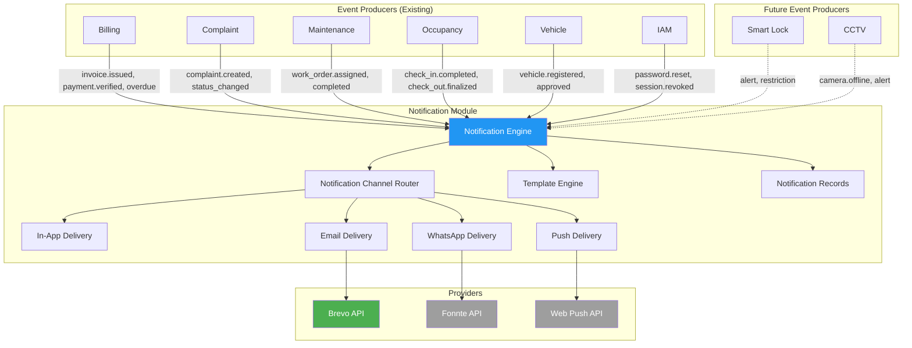
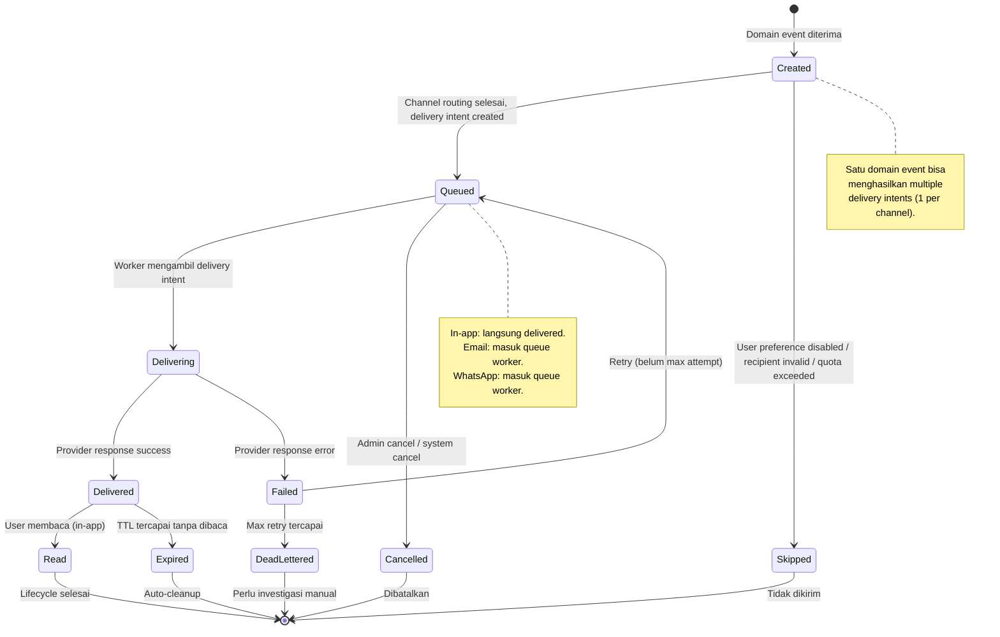
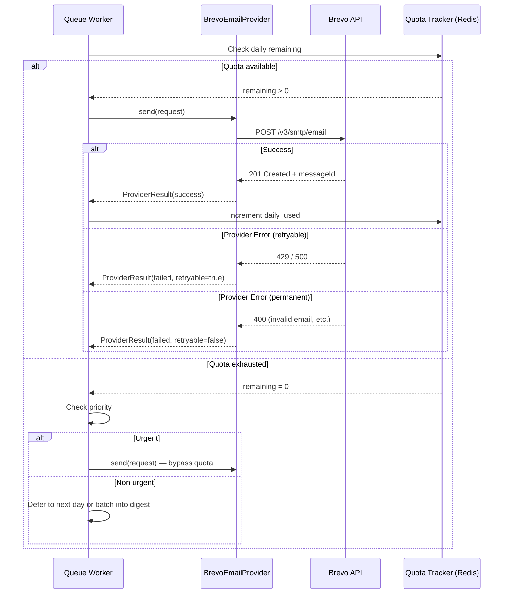
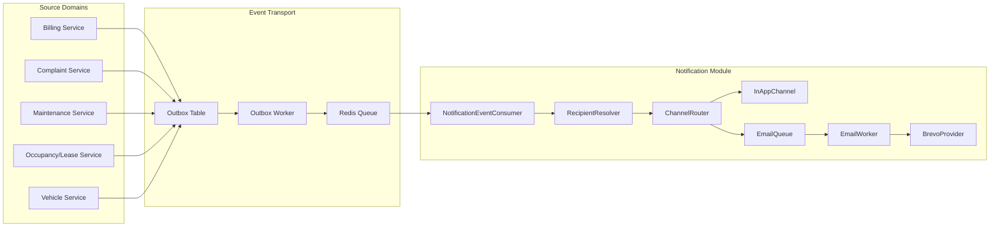
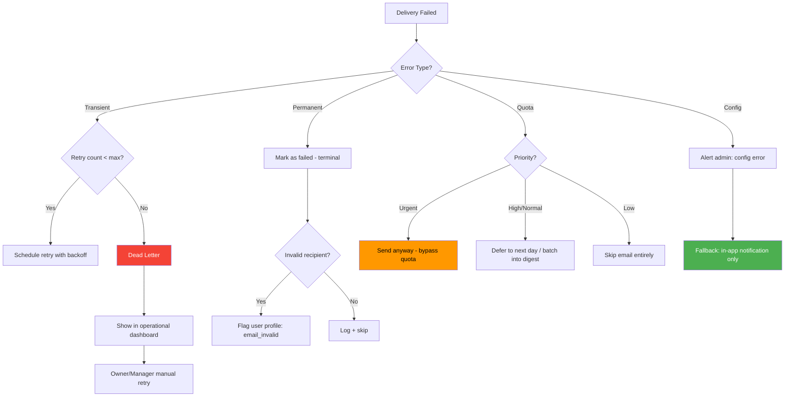
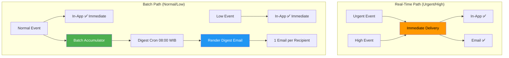
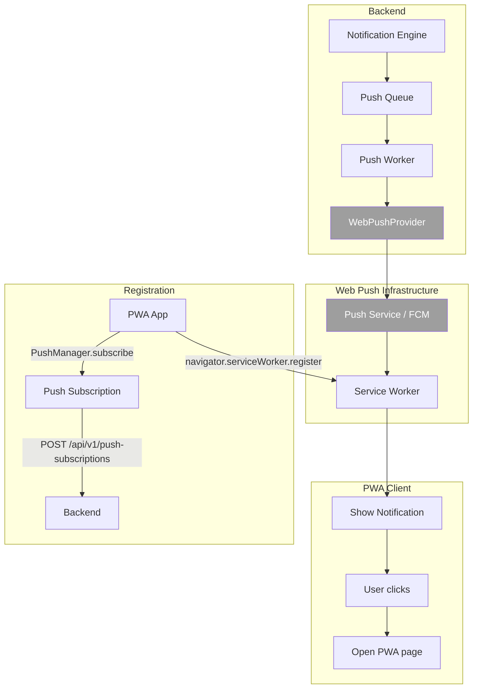
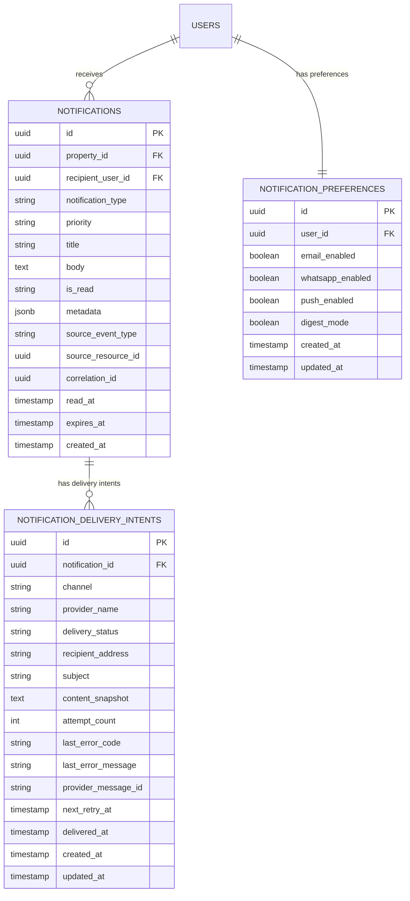

# NOTIFICATION DOMAIN — Granada Kost Platform

> **Versi**: 1.0  
> **Tanggal**: 19 Juni 2026  
> **Peran Pembuat**: Principal Notification Domain Architect  
> **Status**: Dokumen Analisis — Dasar Implementasi Notification Module  
> **Milestone**: 9A — Notification Domain Planning  
> **Dokumen Acuan**:  
> - [PROJECT_MASTER.md](file:///d:/PROJECT%20CODING/Granada%20Kost%20Platform/docs/PROJECT_MASTER.md)  
> - [DOMAIN_MODEL.md](file:///d:/PROJECT%20CODING/Granada%20Kost%20Platform/docs/DOMAIN_MODEL.md)  
> - [API_PLANNING.md](file:///d:/PROJECT%20CODING/Granada%20Kost%20Platform/docs/API_PLANNING.md)  
> - [BACKEND_ARCHITECTURE.md](file:///d:/PROJECT%20CODING/Granada%20Kost%20Platform/docs/BACKEND_ARCHITECTURE.md)  
> - [BILLING_DOMAIN.md](file:///d:/PROJECT%20CODING/Granada%20Kost%20Platform/docs/BILLING_DOMAIN.md)  
> - [COMPLAINT_DOMAIN.md](file:///d:/PROJECT%20CODING/Granada%20Kost%20Platform/docs/COMPLAINT_DOMAIN.md)  
> - [VEHICLE_DOMAIN.md](file:///d:/PROJECT%20CODING/Granada%20Kost%20Platform/docs/VEHICLE_DOMAIN.md)  
> - [SMARTLOCK_POLICY.md](file:///d:/PROJECT%20CODING/Granada%20Kost%20Platform/docs/SMARTLOCK_POLICY.md)  
> - [SECURITY_POLICY.md](file:///d:/PROJECT%20CODING/Granada%20Kost%20Platform/docs/SECURITY_POLICY.md)

---

## Daftar Isi

1. [Executive Summary](#1-executive-summary)
2. [Notification Lifecycle](#2-notification-lifecycle)
3. [Notification Status Strategy](#3-notification-status-strategy)
4. [Notification Priority Strategy](#4-notification-priority-strategy)
5. [Notification Channel Strategy](#5-notification-channel-strategy)
6. [Notification Provider Abstraction Strategy](#6-notification-provider-abstraction-strategy)
7. [Brevo Integration Strategy](#7-brevo-integration-strategy)
8. [Fonnte Future Integration Strategy](#8-fonnte-future-integration-strategy)
9. [Template Strategy](#9-template-strategy)
10. [Event-Driven Architecture](#10-event-driven-architecture)
11. [Billing Notification Flow](#11-billing-notification-flow)
12. [Complaint Notification Flow](#12-complaint-notification-flow)
13. [Maintenance Notification Flow](#13-maintenance-notification-flow)
14. [Occupancy Notification Flow](#14-occupancy-notification-flow)
15. [Vehicle Notification Flow](#15-vehicle-notification-flow)
16. [Future Smart Lock Notification Flow](#16-future-smart-lock-notification-flow)
17. [Future CCTV Notification Flow](#17-future-cctv-notification-flow)
18. [Property Owner Notification Visibility](#18-property-owner-notification-visibility)
19. [RBAC Matrix](#19-rbac-matrix)
20. [Audit Requirements](#20-audit-requirements)
21. [Retry Strategy](#21-retry-strategy)
22. [Failure Handling Strategy](#22-failure-handling-strategy)
23. [Brevo Free Tier Optimization](#23-brevo-free-tier-optimization)
24. [Notification Batching / Digest Strategy](#24-notification-batching--digest-strategy)
25. [Risks & Edge Cases](#25-risks--edge-cases)
26. [Future Push Notification Strategy](#26-future-push-notification-strategy)
27. [Recommended Implementation Phases](#27-recommended-implementation-phases)

---

## 1. Executive Summary

Notification adalah **Generic Domain** pada Granada Kost Platform yang bertanggung jawab atas penyampaian informasi transaksional dan operasional kepada pengguna melalui berbagai channel. Notification module **tidak memiliki business state sendiri** — ia bereaksi terhadap domain events dari bounded context lain dan menyampaikan pesan melalui channel yang dikonfigurasi.

### 1.1 Konteks Saat Ini

| Aspek | Status |
|---|---|
| **Backend modules yang sudah ada** | IAM/RBAC, Property, Room, Resident, Occupancy, Billing, Complaint, Maintenance, Vehicle |
| **Backend modules yang belum ada** | Notification (full), Smart Lock, CCTV, File (full), Chat |
| **Frontend notification (Admin)** | UI sudah ada — list notifikasi, mark all read, unread indicator (100% mock) |
| **Frontend notification (Penghuni)** | UI sudah ada — list notifikasi, unread indicator, empty state (100% mock) |
| **Skala** | ±163 kamar, ~6 roles, estimasi 200–500 notifikasi/hari di puncak billing cycle |
| **Email provider** | **Brevo** (primary, 300 email/hari free tier) |
| **WhatsApp provider** | **Fonnte** (future, disabled by default) |
| **Mobile app** | Tidak ada Flutter — Penghuni menggunakan **PWA** |

### 1.2 Keputusan Arsitektur Final

| Keputusan | Nilai |
|---|---|
| **ND-01** Primary channel | In-app notification |
| **ND-02** Secondary channel | Email via Brevo |
| **ND-03** Tertiary channel (future) | WhatsApp via Fonnte (disabled by default) |
| **ND-04** Provider abstraction | Wajib — provider tidak boleh hardcoded ke Brevo |
| **ND-05** Event-driven | Notification module adalah consumer, bukan producer of business state |
| **ND-06** PWA push (future) | Web Push API via service worker — Phase 3 |
| **ND-07** Brevo free tier | 300 email/hari — kuota harus dioptimasi |

### 1.3 Hubungan dengan Domain Lain



### 1.4 Domain Classification

| Aspek | Klasifikasi |
|---|---|
| **Domain type** | Generic Domain (commodity) |
| **Bounded context** | `NotificationContext` |
| **Module ownership** | Notification records, delivery intents, channel routing, template management |
| **Multi-property** | Wajib — `property_id` pada semua notification records |
| **Data sensitivity** | Medium — notification content bisa berisi nama, nomor kamar, jumlah tagihan |

---

## 2. Notification Lifecycle

### 2.1 Gambaran Umum

Notification lifecycle dimulai dari domain event yang diterima oleh notification module, melalui proses routing, rendering template, delivery ke channel, dan berakhir saat user membaca atau notification expired.

### 2.2 State Diagram



### 2.3 Lifecycle Phases

| # | Phase | Trigger | Aksi | Entitas Terlibat |
|---|---|---|---|---|
| NL-01 | **Event Reception** | Domain event dari outbox consumer | Parse event, identify notification type | Outbox Event |
| NL-02 | **Recipient Resolution** | Notification type mapping | Tentukan siapa penerima berdasarkan event context | Users, Roles, Property scope |
| NL-03 | **Preference Check** | Recipient list ready | Filter berdasarkan user notification preferences | Notification Preferences |
| NL-04 | **Channel Routing** | Per-recipient delivery | Tentukan channel(s) berdasarkan priority × preference × quota | Channel Configuration |
| NL-05 | **Template Rendering** | Channel ditentukan | Render content sesuai template per channel | Notification Templates |
| NL-06 | **Delivery Intent Creation** | Content ready | Persist delivery intent + in-app notification record | Delivery Intents, Notifications |
| NL-07 | **Queue Dispatch** | Delivery intent created | In-app: instant write; Email/WA: enqueue ke worker | Redis Queue |
| NL-08 | **Provider Delivery** | Worker pickup | Kirim via provider API (Brevo, Fonnte, Web Push) | Provider Adapter |
| NL-09 | **Result Recording** | Provider response | Update delivery intent status; audit jika sensitif | Delivery Intents |
| NL-10 | **User Interaction** | User action | Mark read, mark all read, dismiss | Notifications |

### 2.4 Business Rules

| # | Rule | Keterangan |
|---|---|---|
| BR-NTF-01 | Notification module tidak boleh mengubah business state domain lain | Read-only consumer |
| BR-NTF-02 | Satu domain event bisa menghasilkan notifikasi ke multiple recipients melalui multiple channels | Fan-out pattern |
| BR-NTF-03 | User yang tidak memiliki email tervalidasi tidak menerima email notification | Skip + log |
| BR-NTF-04 | In-app notification selalu dibuat terlepas dari channel preference | Channel minimum wajib |
| BR-NTF-05 | Notification content di-snapshot saat creation — perubahan data source setelahnya tidak mengubah notification | Immutable content |
| BR-NTF-06 | Penghuni hanya menerima notifikasi yang relevan dengan datanya sendiri | Self-scope enforcement |
| BR-NTF-07 | Property owner hanya menerima notifikasi yang dikonfigurasi (ringkasan bulanan) | Restricted by design |

---

## 3. Notification Status Strategy

### 3.1 In-App Notification Status

| Status | Kode | Keterangan |
|---|---|---|
| **Unread** | `unread` | Notifikasi belum dibaca oleh user |
| **Read** | `read` | User telah membuka/membaca notifikasi |
| **Archived** | `archived` | User menyembunyikan notifikasi (opsional Phase 2) |

### 3.2 Delivery Intent Status

| Status | Kode | Keterangan | Applicable Channel |
|---|---|---|---|
| **Pending** | `pending` | Menunggu dipick worker | Email, WhatsApp, Push |
| **Sending** | `sending` | Sedang dikirim ke provider | Email, WhatsApp, Push |
| **Delivered** | `delivered` | Provider mengkonfirmasi terkirim | Email, WhatsApp, Push |
| **Failed** | `failed` | Provider mengembalikan error | Email, WhatsApp, Push |
| **Dead Lettered** | `dead_lettered` | Max retry tercapai, perlu investigasi | Email, WhatsApp, Push |
| **Skipped** | `skipped` | Tidak dikirim (preference/quota/invalid) | All |

### 3.3 Status Tracking Rules

| # | Rule | Keterangan |
|---|---|---|
| BR-STS-01 | In-app status dan delivery intent status adalah independent | Satu notification bisa unread (in-app) tapi delivered (email) |
| BR-STS-02 | `read` status di-set oleh user action, bukan oleh system | Tidak ada auto-read |
| BR-STS-03 | `mark all read` menandai semua unread milik user pada property scope | Batch operation |
| BR-STS-04 | Delivery intent status harus immutable setelah terminal (`delivered`, `dead_lettered`, `skipped`) | Append-only audit trail |

---

## 4. Notification Priority Strategy

### 4.1 Priority Levels

| Level | Kode | Keterangan | Channel Behavior |
|---|---|---|---|
| **Urgent** | `urgent` | Keamanan, SLA breach, Smart Lock alert | In-app + Email (always, ignore quota) |
| **High** | `high` | Invoice overdue, complaint resolved, technician assigned | In-app + Email (quota permitting) |
| **Normal** | `normal` | Invoice issued, payment verified, complaint created | In-app + Email (if daily quota allows) |
| **Low** | `low` | Informational, auto-close warning, work order started | In-app only (default) |

### 4.2 Priority-Channel Matrix

| Priority | In-App | Email (Brevo) | WhatsApp (Fonnte) | Push (PWA) |
|---|:---:|:---:|:---:|:---:|
| **Urgent** | ✅ Always | ✅ Always (bypass quota) | ✅ Future (if enabled) | ✅ Future |
| **High** | ✅ Always | ✅ Quota permitting | ⬜ Future (if enabled) | ✅ Future |
| **Normal** | ✅ Always | ⚠️ Quota permitting, batchable | ⬜ Future | ⬜ Future |
| **Low** | ✅ Always | ❌ Not sent | ❌ Not sent | ❌ Not sent |

### 4.3 Priority Assignment Rules

| # | Rule | Keterangan |
|---|---|---|
| BR-PRI-01 | Priority ditentukan oleh notification type, bukan oleh source domain | Konsistensi lintas domain |
| BR-PRI-02 | Admin tidak dapat mengubah priority notifikasi individual | Priority adalah config per type |
| BR-PRI-03 | Urgent notification tidak boleh di-batch/digest | Real-time delivery wajib |
| BR-PRI-04 | Email untuk urgent notification boleh melampaui daily quota | Safety override |

---

## 5. Notification Channel Strategy

### 5.1 Channel Architecture

```
NotificationService
  │
  ├── ChannelRouter
  │     ├── Resolves channels per notification type × priority × user preference
  │     └── Applies quota check before email/WhatsApp routing
  │
  ├── InAppChannel
  │     └── Direct DB write → notifications table
  │
  ├── EmailChannel
  │     ├── Template rendering (HTML)
  │     ├── Queue to Redis
  │     └── Worker → NotificationProvider (Brevo)
  │
  ├── WhatsAppChannel (Future)
  │     ├── Template rendering (plain text)
  │     ├── Queue to Redis
  │     └── Worker → NotificationProvider (Fonnte)
  │
  └── PushChannel (Future)
        ├── Payload construction
        ├── Queue to Redis
        └── Worker → Web Push API
```

### 5.2 Channel Details

| Channel | Phase | Delivery | Latency Target | Persistence |
|---|---|---|---|---|
| **In-App** | Phase 1 | Synchronous DB write | < 500ms | Permanent (until expired/archived) |
| **Email** | Phase 1 | Async via queue + Brevo API | < 5 min | Delivery intent log |
| **WhatsApp** | Future | Async via queue + Fonnte API | < 5 min | Delivery intent log |
| **PWA Push** | Future | Async via queue + Web Push API | < 30s | Delivery intent log |

### 5.3 Channel Configuration per Property

| Setting | Tipe | Default | Keterangan |
|---|---|---|---|
| `notification_email_enabled` | BOOLEAN | `true` | Aktifkan email channel untuk property |
| `notification_whatsapp_enabled` | BOOLEAN | `false` | Aktifkan WhatsApp channel (future) |
| `notification_push_enabled` | BOOLEAN | `false` | Aktifkan push notification (future) |
| `notification_digest_enabled` | BOOLEAN | `true` | Aktifkan daily digest untuk low-priority |
| `notification_digest_hour` | INT | `8` | Jam pengiriman digest (WIB) |

### 5.4 User Notification Preferences

| Preference | Default | Keterangan |
|---|---|---|
| `email_notifications` | `true` | User opt-out individual email |
| `whatsapp_notifications` | `false` | User opt-in WhatsApp (future) |
| `push_notifications` | `true` | User opt-out push (future) |
| `digest_mode` | `false` | User prefer digest over individual emails |

### 5.5 Channel Business Rules

| # | Rule | Keterangan |
|---|---|---|
| BR-CHN-01 | In-app channel tidak dapat dinonaktifkan oleh user | Minimum viable channel |
| BR-CHN-02 | Email memerlukan `user.email` tervalidasi | Skip jika tidak valid |
| BR-CHN-03 | WhatsApp memerlukan `user.phone` tervalidasi + channel enabled | Skip jika kondisi tidak terpenuhi |
| BR-CHN-04 | Channel disabled di property level mengoverride user preference | Property toggle = master switch |
| BR-CHN-05 | Urgent notification mengoverride user opt-out untuk email | Safety requirement |

---

## 6. Notification Provider Abstraction Strategy

### 6.1 Arsitektur Provider

```
NotificationService
  ↓
NotificationProvider (Interface)
  ├── BrevoEmailProvider (implements NotificationProvider)
  │     ├── send(recipient, content): ProviderResult
  │     ├── sendBatch(recipients[], content): ProviderResult[]
  │     └── getQuotaStatus(): QuotaInfo
  │
  ├── FonnteWhatsAppProvider (implements NotificationProvider) [Future]
  │     ├── send(recipient, content): ProviderResult
  │     └── getQuotaStatus(): QuotaInfo
  │
  └── WebPushProvider (implements NotificationProvider) [Future]
        ├── send(subscription, payload): ProviderResult
        └── sendBatch(subscriptions[], payload): ProviderResult[]
```

### 6.2 Provider Interface Contract

```
interface NotificationProvider {
  readonly channel: NotificationChannel;  // 'email' | 'whatsapp' | 'push'
  readonly providerName: string;          // 'brevo' | 'fonnte' | 'web_push'

  send(request: ProviderSendRequest): Promise<ProviderResult>;
  sendBatch?(requests: ProviderSendRequest[]): Promise<ProviderResult[]>;
  getQuotaStatus?(): Promise<QuotaInfo>;
  validateRecipient(recipient: string): boolean;
}

interface ProviderSendRequest {
  recipientAddress: string;    // email address, phone number, or push subscription
  subject?: string;            // email subject
  htmlContent?: string;        // email HTML body
  textContent: string;         // plain text content (used by all channels)
  metadata: Record<string, string>;  // provider-specific tags, correlation_id, etc.
}

interface ProviderResult {
  success: boolean;
  providerMessageId?: string;  // Brevo message ID, Fonnte ID, etc.
  errorCode?: string;
  errorMessage?: string;
  retryable: boolean;
}

interface QuotaInfo {
  dailyLimit: number;
  dailyUsed: number;
  dailyRemaining: number;
  resetAt: Date;
}
```

### 6.3 Anti-Corruption Layer Rules

| # | Rule | Keterangan |
|---|---|---|
| BR-ACL-01 | Provider response tidak boleh bocor ke notification domain model | Translate ke `ProviderResult` |
| BR-ACL-02 | Provider API key/secret hanya di backend environment | Tidak di database, tidak di frontend |
| BR-ACL-03 | Raw provider error message tidak dikirim ke user | Safe error message only |
| BR-ACL-04 | Provider switch (Brevo → SendGrid, Fonnte → Twilio) tidak boleh mengubah domain logic | Interface contract guarantees |
| BR-ACL-05 | Delivery intent menyimpan `provider_name` dan `provider_message_id` untuk audit | Traceability |

### 6.4 Provider Registration Strategy

```
Module startup:
  ├── Read environment config
  ├── Initialize BrevoEmailProvider (if BREVO_API_KEY exists)
  ├── Initialize FonnteWhatsAppProvider (if FONNTE_TOKEN exists) [Future]
  ├── Initialize WebPushProvider (if VAPID_KEYS exist) [Future]
  └── Register all active providers in ProviderRegistry

ProviderRegistry:
  ├── getProvider(channel: 'email'): NotificationProvider | null
  ├── getProvider(channel: 'whatsapp'): NotificationProvider | null
  ├── getProvider(channel: 'push'): NotificationProvider | null
  └── getActiveChannels(): NotificationChannel[]
```

---

## 7. Brevo Integration Strategy

### 7.1 Brevo Overview

| Aspek | Detail |
|---|---|
| **Provider** | Brevo (formerly Sendinblue) |
| **API type** | REST API v3 |
| **Free tier** | 300 email/hari |
| **Authentication** | API Key (header `api-key`) |
| **Sending method** | Transactional email API (`POST /v3/smtp/email`) |
| **Template support** | Brevo template system atau inline HTML |
| **Rate limit** | Varies by plan; free tier ~10 req/sec |

### 7.2 Brevo Configuration

| Config Key | Contoh Nilai | Keterangan |
|---|---|---|
| `BREVO_API_KEY` | `xkeysib-xxx...` | API key dari Brevo dashboard |
| `BREVO_SENDER_EMAIL` | `noreply@kostsaya.com` | Sender email address (verified di Brevo) |
| `BREVO_SENDER_NAME` | `Granada Kost` | Display name pengirim |
| `BREVO_DAILY_LIMIT` | `300` | Daily quota (override default free tier value) |
| `BREVO_REPLY_TO` | `admin@kostsaya.com` | Reply-to address (opsional) |

### 7.3 Email Sending Flow



### 7.4 Brevo Request Format

```json
{
  "sender": {
    "name": "Granada Kost",
    "email": "noreply@kostsaya.com"
  },
  "to": [
    { "email": "penghuni@example.com", "name": "Andi" }
  ],
  "subject": "Tagihan Bulan Juli 2026 Sudah Terbit",
  "htmlContent": "<html>...</html>",
  "textContent": "Tagihan Anda bulan Juli 2026 sebesar Rp 1.800.000...",
  "headers": {
    "X-Correlation-Id": "uuid",
    "X-Notification-Type": "billing.invoice_issued"
  },
  "tags": ["billing", "invoice_issued"]
}
```

### 7.5 Brevo Business Rules

| # | Rule | Keterangan |
|---|---|---|
| BR-BRV-01 | Sender email harus terverifikasi di Brevo dashboard | Setup prerequisite |
| BR-BRV-02 | API key disimpan di environment variable, bukan database | Security |
| BR-BRV-03 | Daily quota di-track via Redis counter (key: `brevo:daily:{YYYY-MM-DD}`, TTL: 48h) | Accurate tracking |
| BR-BRV-04 | Quota reset setiap 00:00 UTC (sesuai Brevo) | Sinkronisasi Redis counter |
| BR-BRV-05 | Email content harus lolos Brevo compliance (no spam, valid unsubscribe jika marketing) | Transactional email umumnya exempt |
| BR-BRV-06 | Rate limit provider (429) harus di-handle dengan retry + backoff | Provider protection |

---

## 8. Fonnte Future Integration Strategy

### 8.1 Overview

| Aspek | Detail |
|---|---|
| **Provider** | Fonnte |
| **Channel** | WhatsApp |
| **Status** | **Future — disabled by default** |
| **API type** | REST API |
| **Pricing** | Per-message atau subscription-based |
| **Target use case** | Urgent notification fallback + billing reminder |

### 8.2 Fonnte Configuration (Future)

| Config Key | Contoh Nilai | Keterangan |
|---|---|---|
| `FONNTE_TOKEN` | `xxx...` | API token dari Fonnte dashboard |
| `FONNTE_DEVICE_ID` | `628xxxx` | WhatsApp number yang terdaftar |
| `FONNTE_DAILY_LIMIT` | `100` | Self-imposed daily limit |

### 8.3 Integration Architecture (Preview)

```
FonnteWhatsAppProvider
  ├── send(phone, textContent)
  │     └── POST https://api.fonnte.com/send
  │           Body: { target, message, delay, countryCode }
  │
  ├── validateRecipient(phone)
  │     └── Phone format validation (62xxx)
  │
  └── getQuotaStatus()
        └── Redis counter tracking
```

### 8.4 Fonnte Enablement Strategy

| Step | Aksi | Keterangan |
|---|---|---|
| 1 | Set `FONNTE_TOKEN` di environment | Provider initialization |
| 2 | Set `notification_whatsapp_enabled = true` di property settings | Property-level toggle |
| 3 | Penghuni opt-in di user preferences | User-level consent |
| 4 | Phone number tervalidasi di user profile | Delivery prerequisite |

### 8.5 Fonnte Business Rules

| # | Rule | Keterangan |
|---|---|---|
| BR-FNT-01 | WhatsApp channel disabled by default | Opt-in required |
| BR-FNT-02 | Penghuni harus memiliki nomor telepon tervalidasi | Format: 62xxx |
| BR-FNT-03 | WhatsApp hanya untuk urgent dan high priority | Tidak untuk notifikasi low |
| BR-FNT-04 | Consent penghuni wajib sebelum pengiriman | GDPR/privacy compliance |
| BR-FNT-05 | Daily limit self-imposed untuk cost control | Configurable per property |

---

## 9. Template Strategy

### 9.1 Template Architecture

```
NotificationTemplates
  ├── notification_type: 'billing.invoice_issued'
  ├── channel: 'email' | 'in_app' | 'whatsapp' | 'push'
  ├── locale: 'id' | 'en'
  │
  ├── In-App Template
  │     ├── title_template: "Tagihan {{period}} Sudah Terbit"
  │     └── body_template: "Tagihan Anda bulan {{period}} sebesar {{amount}}..."
  │
  ├── Email Template
  │     ├── subject_template: "Tagihan Bulan {{period}} - Granada Kost"
  │     ├── html_template: "<html>...{{content}}...</html>"
  │     └── text_template: "Tagihan Anda bulan {{period}}..."
  │
  └── WhatsApp Template (Future)
        └── text_template: "Halo {{name}}, tagihan Anda bulan {{period}}..."
```

### 9.2 Template Variable Catalog

| Variable | Sumber | Digunakan Di |
|---|---|---|
| `{{recipient_name}}` | User/Resident full name | Semua template |
| `{{property_name}}` | Property name | Semua template |
| `{{room_number}}` | Room number dari occupancy | Billing, Occupancy |
| `{{period}}` | Billing period (contoh: "Juli 2026") | Billing |
| `{{amount}}` | Formatted currency (Rp 1.800.000) | Billing |
| `{{due_date}}` | Formatted date | Billing |
| `{{complaint_code}}` | Complaint code (TKT-GSH-2026-0001) | Complaint |
| `{{complaint_title}}` | Complaint title | Complaint |
| `{{work_order_code}}` | Work order code | Maintenance |
| `{{vehicle_plate}}` | Plat kendaraan | Vehicle |
| `{{days_overdue}}` | Jumlah hari overdue | Billing overdue |
| `{{late_fee_amount}}` | Formatted denda | Billing overdue |
| `{{app_url}}` | URL PWA Penghuni atau Admin dashboard | Semua template |

### 9.3 Template Storage Strategy

| Aspek | Strategi Phase 1 | Strategi Phase 2 |
|---|---|---|
| Storage | Hardcoded di code (TypeScript constants) | Database `notification_templates` table |
| Customization | Developer update | Admin UI template editor |
| Locale | Indonesia only (`id`) | Multi-locale (`id`, `en`) |
| Email HTML | Simple inline HTML template | Brevo template system atau MJML |
| Versioning | Git-tracked source code | Versioned template records |

### 9.4 Template Business Rules

| # | Rule | Keterangan |
|---|---|---|
| BR-TPL-01 | Template wajib memiliki fallback plain text | Untuk channel yang tidak support HTML |
| BR-TPL-02 | Variable yang tidak tersedia di-render sebagai string kosong, bukan error | Graceful degradation |
| BR-TPL-03 | Template tidak boleh mengandung data sensitif (KTP, password, raw URL) | Security |
| BR-TPL-04 | Email template wajib memiliki header Granada Kost dan footer kontak | Branding consistency |
| BR-TPL-05 | WhatsApp template harus ringkas (< 1000 karakter) | Platform limitation |

---

## 10. Event-Driven Architecture

### 10.1 Architecture Overview



### 10.2 Event-to-Notification Mapping

Notification module menerima domain events dan memetakannya ke notification types:

| Domain Event | Notification Type | Priority | Recipients |
|---|---|---|---|
| `invoice.issued` | `billing.invoice_issued` | Normal | Penghuni (invoice owner) |
| `invoice.overdue_detected` | `billing.invoice_overdue` | High | Penghuni + Admin |
| `payment.proof_uploaded` | `billing.payment_proof_uploaded` | Normal | Admin (all property admins) |
| `payment.verified` | `billing.payment_verified` | High | Penghuni (payer) |
| `payment.rejected` | `billing.payment_rejected` | High | Penghuni (payer) |
| `complaint.created` | `complaint.created` | Normal / Urgent* | Admin (property admins) |
| `complaint.acknowledged` | `complaint.acknowledged` | Normal | Penghuni (complaint owner) |
| `complaint.resolved` | `complaint.resolved` | High | Penghuni (complaint owner) |
| `complaint.cancelled` | `complaint.cancelled` | Normal | Penghuni (complaint owner) |
| `complaint.reopened` | `complaint.reopened` | High | Admin + Assigned technician |
| `complaint.escalated` | `complaint.escalated` | Urgent | Manager + Owner |
| `complaint.sla_breached` | `complaint.sla_breached` | Urgent | Admin + Manager + Owner |
| `work_order.assigned` | `maintenance.work_order_assigned` | High | Assigned technician |
| `work_order.completed` | `maintenance.work_order_completed` | Normal | Admin (verification needed) |
| `work_order.rework_required` | `maintenance.rework_required` | High | Assigned technician |
| `check_in.completed` | `occupancy.check_in_completed` | Normal | Penghuni + Admin |
| `check_out.finalized` | `occupancy.check_out_finalized` | Normal | Penghuni + Admin |
| `lease.near_expiry` | `occupancy.lease_near_expiry` | High | Penghuni + Admin |
| `lease.expired` | `occupancy.lease_expired` | Urgent | Admin |
| `vehicle.registered` | `vehicle.registered` | Normal | Admin (approval queue) |
| `vehicle.approved` | `vehicle.approved` | Normal | Penghuni (vehicle owner) |
| `vehicle.rejected` | `vehicle.rejected` | Normal | Penghuni (vehicle owner) |
| `vehicle.suspended` | `vehicle.suspended` | High | Penghuni (vehicle owner) |

> \* Complaint with `security` category = `urgent` priority.

### 10.3 Event Consumer Rules

| # | Rule | Keterangan |
|---|---|---|
| BR-EVT-01 | Consumer harus idempotent | Same event processed twice = same result |
| BR-EVT-02 | Consumer tidak boleh memodifikasi source domain state | Read-only reaction |
| BR-EVT-03 | Consumer harus handle unknown event types gracefully | Log + skip, tidak crash |
| BR-EVT-04 | Event payload harus mengandung `property_id` dan `correlation_id` | Scoping + tracing |
| BR-EVT-05 | Consumer failure tidak boleh memblokir event processing untuk recipient lain | Partial failure isolation |
| BR-EVT-06 | Dead letter events harus visible di operational dashboard | Monitoring |

### 10.4 Idempotency Strategy

```
Idempotency Key = hash(event_id + recipient_user_id + channel)

Before processing:
  1. Check Redis: idempotency_key exists?
  2. Yes → Skip (already processed)
  3. No → Process + Set Redis key with TTL 24h
```

---

## 11. Billing Notification Flow

### 11.1 Complete Billing Notification Map

| # | Event | Penerima | Priority | Channel | Template |
|---|---|---|---|---|---|
| BN-01 | **Invoice issued** | Penghuni | Normal | In-app + Email | "Tagihan {{period}} sebesar {{amount}} sudah terbit. Batas bayar: {{due_date}}" |
| BN-02 | **Invoice overdue D+1** | Penghuni | High | In-app + Email | "Tagihan {{period}} telah melewati jatuh tempo. Denda 1%/hari berlaku." |
| BN-03 | **Invoice overdue D+3** | Penghuni + Admin | High | In-app + Email | "Tagihan {{period}} overdue 3 hari. Denda: {{late_fee_amount}}" |
| BN-04 | **Invoice overdue D+7** | Penghuni + Admin | High | In-app + Email | "Tagihan {{period}} overdue 7 hari. Segera lunasi untuk menghindari denda lebih besar." |
| BN-05 | **Invoice overdue D+14** | Penghuni + Admin + Manager | Urgent | In-app + Email | "⚠️ Tagihan {{period}} overdue 14 hari. Restriction Smart Lock dapat diajukan." |
| BN-06 | **Invoice overdue D+30** | Admin + Manager + Owner | Urgent | In-app + Email | "🔴 Tagihan {{period}} overdue 30 hari. Denda mencapai batas maksimum (30%). Pertimbangkan checkout." |
| BN-07 | **Payment proof uploaded** | Admin (all property) | Normal | In-app | "Bukti pembayaran baru dari {{recipient_name}} untuk tagihan {{period}}" |
| BN-08 | **Payment verified** | Penghuni | High | In-app + Email | "Pembayaran Anda untuk tagihan {{period}} sebesar {{amount}} telah diverifikasi." |
| BN-09 | **Payment rejected** | Penghuni | High | In-app + Email | "Bukti pembayaran untuk tagihan {{period}} ditolak. Alasan: {{reason}}. Silakan upload ulang." |
| BN-10 | **Late fee waived** | Penghuni | Normal | In-app | "Denda keterlambatan untuk tagihan {{period}} sebesar {{late_fee_amount}} telah dibebaskan." |

### 11.2 Overdue Notification Schedule (Cron-Driven)

```
Daily Overdue Cron (00:01 WIB):
│
├── Query overdue invoices
├── For each invoice:
│   ├── D+1:  Create BN-02 notification
│   ├── D+3:  Create BN-03 notification
│   ├── D+7:  Create BN-04 notification
│   ├── D+14: Create BN-05 notification (urgent)
│   ├── D+30: Create BN-06 notification (urgent)
│   └── D+30+: No new notification (cap reached)
│
└── Deduplicate: only send each tier notification ONCE per invoice
    Key: notification_type + invoice_id + tier
```

### 11.3 Billing Notification Business Rules

| # | Rule | Keterangan |
|---|---|---|
| BR-BN-01 | Overdue notification dikirim per invoice, bukan per penghuni | Penghuni bisa overdue di multiple invoices |
| BR-BN-02 | Setiap tier overdue hanya dikirim sekali per invoice | Deduplicate by invoice_id + tier |
| BR-BN-03 | Payment verified notification harus menyertakan sisa outstanding jika ada | "Sisa tagihan: Rp X" |
| BR-BN-04 | Property owner tidak menerima notifikasi billing operasional | Hanya ringkasan bulanan (lihat Section 18) |

---

## 12. Complaint Notification Flow

### 12.1 Complete Complaint Notification Map

| # | Event | Penerima | Priority | Channel |
|---|---|---|---|---|
| CN-01 | **Complaint created** | Admin (semua admin property) | Normal | In-app |
| CN-02 | **Complaint created (security category)** | Admin + Manager | Urgent | In-app + Email |
| CN-03 | **Complaint acknowledged** | Penghuni (complaint owner) | Normal | In-app |
| CN-04 | **Technician assigned** | Assigned technician | High | In-app + Email |
| CN-05 | **Technician reassigned** | Technician lama + baru | Normal | In-app |
| CN-06 | **Work order started** | Admin + Penghuni | Low | In-app |
| CN-07 | **Work order completed** | Admin (verifikasi) | Normal | In-app |
| CN-08 | **Complaint resolved** | Penghuni | High | In-app + Email |
| CN-09 | **Complaint cancelled** | Penghuni | Normal | In-app |
| CN-10 | **Complaint reopened** | Admin + technician | High | In-app |
| CN-11 | **SLA response breached** | Admin + Manager | High | In-app + Email |
| CN-12 | **SLA resolution breached** | Admin + Manager + Owner | Urgent | In-app + Email |
| CN-13 | **Complaint escalated** | Manager + Owner | Urgent | In-app + Email |
| CN-14 | **Work order rework required** | Assigned technician | High | In-app |
| CN-15 | **Auto-close warning (48h)** | Penghuni | Low | In-app |

### 12.2 Complaint Notification Rules

| # | Rule | Keterangan |
|---|---|---|
| BR-CN-01 | Security complaint langsung urgent | Category `security` = urgent priority |
| BR-CN-02 | Escalation notification harus ke Manager + Owner, bukan hanya Admin | Escalation bypasses admin level |
| BR-CN-03 | Penghuni tidak menerima notifikasi work order detail | Hanya status tingkat complaint |

---

## 13. Maintenance Notification Flow

### 13.1 Complete Maintenance Notification Map

| # | Event | Penerima | Priority | Channel |
|---|---|---|---|---|
| MN-01 | **Work order created** | Assigned technician (if assigned) | Normal | In-app |
| MN-02 | **Work order assigned** | Assigned technician | High | In-app + Email |
| MN-03 | **Work order reassigned** | Technician lama + baru | Normal | In-app |
| MN-04 | **Work order started** | Admin | Low | In-app |
| MN-05 | **Work order completed** | Admin (verifikasi diperlukan) | Normal | In-app |
| MN-06 | **Work order verified** | Technician + Penghuni (if complaint-linked) | Normal | In-app |
| MN-07 | **Work order rework required** | Assigned technician | High | In-app + Email |
| MN-08 | **Independent WO created** | Assigned technician | Normal | In-app |

---

## 14. Occupancy Notification Flow

### 14.1 Complete Occupancy Notification Map

| # | Event | Penerima | Priority | Channel |
|---|---|---|---|---|
| ON-01 | **Check-in completed** | Penghuni + Admin | Normal | In-app + Email (welcome) |
| ON-02 | **Check-out finalized** | Penghuni + Admin | Normal | In-app + Email |
| ON-03 | **Lease near expiry (T-60)** | Penghuni | Normal | In-app + Email |
| ON-04 | **Lease near expiry (T-30)** | Penghuni + Admin | High | In-app + Email |
| ON-05 | **Lease near expiry (T-14)** | Penghuni + Admin | Urgent | In-app + Email |
| ON-06 | **Lease expired** | Admin | Urgent | In-app + Email |
| ON-07 | **Extension requested** | Admin | Normal | In-app |
| ON-08 | **Extension approved** | Penghuni | High | In-app + Email |
| ON-09 | **Extension rejected** | Penghuni | High | In-app + Email |
| ON-10 | **Resident created** | Admin | Low | In-app |

### 14.2 Welcome Email (ON-01)

Saat check-in selesai, Penghuni menerima welcome email yang berisi:

| Konten | Detail |
|---|---|
| Greeting | "Selamat datang di {{property_name}}, {{recipient_name}}!" |
| Room info | "Kamar Anda: {{room_number}}" |
| Billing info | "Tagihan bulanan: {{amount}}, jatuh tempo tanggal 25 setiap bulan" |
| App link | "Akses aplikasi Penghuni di {{app_url}}" |
| Peraturan | Link ke halaman peraturan kost |
| Kontak | Nomor darurat dan kontak admin |

---

## 15. Vehicle Notification Flow

### 15.1 Complete Vehicle Notification Map

| # | Event | Penerima | Priority | Channel |
|---|---|---|---|---|
| VN-01 | **Vehicle registered by resident** | Admin (approval queue) | Normal | In-app |
| VN-02 | **Vehicle approved** | Penghuni (vehicle owner) | Normal | In-app |
| VN-03 | **Vehicle rejected** | Penghuni (vehicle owner) | Normal | In-app + Email |
| VN-04 | **Vehicle suspended** | Penghuni (vehicle owner) | High | In-app + Email |
| VN-05 | **Vehicle reactivated** | Penghuni (vehicle owner) | Normal | In-app |
| VN-06 | **Vehicle auto-deactivated (checkout)** | — (system action, no notification needed) | — | — |
| VN-07 | **Parking capacity warning (≥80%)** | Admin + Manager | High | In-app |

---

## 16. Future Smart Lock Notification Flow

### 16.1 Smart Lock Notification Map (Future)

| # | Event | Penerima | Priority | Channel |
|---|---|---|---|---|
| SLN-01 | **Battery low warning (<20%)** | Admin | High | In-app + Email |
| SLN-02 | **Battery critical (<12%)** | Admin + Manager | Urgent | In-app + Email |
| SLN-03 | **Device offline** | Admin | High | In-app |
| SLN-04 | **Multiple failed unlock attempts** | Admin + Manager | Urgent | In-app + Email |
| SLN-05 | **Restriction request created** | Admin + Manager | High | In-app + Email |
| SLN-06 | **Restriction applied** | Penghuni + Admin | Urgent | In-app + Email |
| SLN-07 | **Restriction lifted** | Penghuni + Admin | High | In-app + Email |
| SLN-08 | **Access grant created** | Penghuni | Normal | In-app |
| SLN-09 | **Access grant revoked** | Penghuni | High | In-app + Email |

### 16.2 Smart Lock Notification Rules

| # | Rule | Keterangan |
|---|---|---|
| BR-SLN-01 | Battery critical = urgent, selalu email | Physical security concern |
| BR-SLN-02 | Multiple failed attempts = urgent + security event | Potential security breach |
| BR-SLN-03 | Restriction notification ke Penghuni dikirim SEBELUM restriction applied | Fair warning |
| BR-SLN-04 | Property owner tidak menerima Smart Lock notifications | Sesuai RBAC — no Smart Lock access |

---

## 17. Future CCTV Notification Flow

### 17.1 CCTV Notification Map (Future)

| # | Event | Penerima | Priority | Channel |
|---|---|---|---|---|
| CCTVN-01 | **Camera offline** | Admin | High | In-app |
| CCTVN-02 | **Multiple cameras offline** | Admin + Manager | Urgent | In-app + Email |
| CCTVN-03 | **Camera back online** | Admin | Low | In-app |
| CCTVN-04 | **Motion detected (after hours)** | Admin | Normal | In-app |
| CCTVN-05 | **NVR/Gateway connection lost** | Admin + Manager + Owner | Urgent | In-app + Email |

### 17.2 CCTV Notification Rules

| # | Rule | Keterangan |
|---|---|---|
| BR-CCTVN-01 | Single camera offline = high; multiple offline = urgent | Escalation by severity |
| BR-CCTVN-02 | NVR disconnected = urgent (all cameras affected) | Infrastructure failure |
| BR-CCTVN-03 | Property owner tidak menerima CCTV notifications | Sesuai RBAC — no CCTV access |
| BR-CCTVN-04 | Motion detection notifications hanya saat diluar jam operasional | Menghindari noise |

---

## 18. Property Owner Notification Visibility

### 18.1 Prinsip Dasar

Pemilik Rumah Kost (`property_owner`) memiliki visibility **sangat terbatas** pada notification. Mereka hanya menerima ringkasan periodik, bukan notifikasi operasional real-time.

### 18.2 Notifikasi yang Diterima Property Owner

| # | Tipe | Frekuensi | Channel | Konten |
|---|---|---|---|---|
| PO-01 | **Ringkasan bulanan pendapatan** | 1×/bulan (tanggal 1) | Email | Revenue, occupancy rate, outstanding summary |
| PO-02 | **Alert keamanan kritis** (future) | Real-time | In-app + Email | Gateway down, multiple intrusion attempts |

### 18.3 Notifikasi yang TIDAK Diterima Property Owner

| Tipe | Alasan |
|---|---|
| Individual billing (invoice issued, overdue, payment) | Operational — admin only |
| Individual complaint | Operational + PII concern |
| Work order updates | Internal operation |
| Vehicle registrations | Internal operation |
| Smart Lock events | No Smart Lock access (RBAC) |
| CCTV events | No CCTV access (RBAC) |
| Staff/technician assignments | Internal operation |

### 18.4 Property Owner Monthly Digest

```
Subject: "Laporan Bulanan {{property_name}} — {{month}} {{year}}"

Content:
  ├── Revenue summary: Rp XX.XXX.XXX
  ├── vs. bulan lalu: +/-X%
  ├── Occupancy rate: XX%
  ├── Total outstanding: Rp XX.XXX.XXX
  ├── Complaint summary: X baru, Y selesai, Z outstanding
  └── Parking utilization: XX%
```

### 18.5 Business Rules

| # | Rule | Keterangan |
|---|---|---|
| BR-PO-NTF-01 | Monthly digest dikirim tanggal 1 setiap bulan | Scheduled job |
| BR-PO-NTF-02 | Property owner tidak bisa opt-in ke notifikasi operasional | Hard restriction |
| BR-PO-NTF-03 | Monthly digest bisa di-disable di user preferences | Opt-out available |
| BR-PO-NTF-04 | Digest hanya berisi aggregate data, bukan per-penghuni detail | PII protection |

---

## 19. RBAC Matrix

### 19.1 Matrix Lengkap Notification Operations

| Operation | `owner` | `manager` | `admin` | `technician` | `resident` | `property_owner` |
|---|:---:|:---:|:---:|:---:|:---:|:---:|
| **Notification** | | | | | | |
| View own notifications | ✅ | ✅ | ✅ | ✅ | ✅ | ✅ |
| Mark notification read | ✅ | ✅ | ✅ | ✅ | ✅ | ✅ |
| Mark all notifications read | ✅ | ✅ | ✅ | ✅ | ✅ | ✅ |
| View notification delivery logs | ✅ | ✅ | ❌ | ❌ | ❌ | ❌ |
| **Notification Configuration** | | | | | | |
| View notification settings | ✅ | ✅ | ✅ | ❌ | ❌ | ❌ |
| Manage notification settings | ✅ | ✅ | ❌ | ❌ | ❌ | ❌ |
| Manage notification templates | ✅ | ❌ | ❌ | ❌ | ❌ | ❌ |
| **User Preferences** | | | | | | |
| View own notification preferences | ✅ | ✅ | ✅ | ✅ | ✅ | ✅ |
| Update own notification preferences | ✅ | ✅ | ✅ | ✅ | ✅ | ✅ |
| **Operational** | | | | | | |
| View email delivery queue | ✅ | ✅ | ❌ | ❌ | ❌ | ❌ |
| View dead letter notifications | ✅ | ✅ | ❌ | ❌ | ❌ | ❌ |
| Retry failed delivery | ✅ | ✅ | ❌ | ❌ | ❌ | ❌ |
| View provider quota status | ✅ | ✅ | ❌ | ❌ | ❌ | ❌ |

### 19.2 Permission Codes

| Permission Code | Deskripsi |
|---|---|
| `notification.view` | Melihat notifikasi milik sendiri |
| `notification.manage` | Mark read, dismiss |
| `notification.config.view` | Melihat konfigurasi notification |
| `notification.config.manage` | Mengubah settings, templates |
| `notification.delivery.view` | Melihat delivery logs, queue, dead letter |
| `notification.delivery.retry` | Retry failed delivery |
| `notification.preferences.manage` | Update own notification preferences |

### 19.3 Recipient Scoping Enforcement

| Scope Type | Enforcement |
|---|---|
| Staff (owner/manager/admin) | Receives notifications for assigned properties only |
| Technician | Receives notifications for assigned work orders only |
| Resident | Receives notifications for own data only (self-scope) |
| Property Owner | Receives monthly digest for owned properties only |

---

## 20. Audit Requirements

### 20.1 Audited Operations

| # | Operation | Audit Level | Data yang Dicatat |
|---|---|---|---|
| AUD-NTF-01 | **Email delivered** | Required | delivery_intent_id, recipient, provider_message_id, notification_type |
| AUD-NTF-02 | **Email delivery failed** | Required | delivery_intent_id, recipient, error_code, retry_count |
| AUD-NTF-03 | **Email delivery dead-lettered** | Required | delivery_intent_id, recipient, total_attempts, last_error |
| AUD-NTF-04 | **WhatsApp delivered** (future) | Required | delivery_intent_id, recipient_phone (masked), provider_message_id |
| AUD-NTF-05 | **Notification config changed** | Required | setting_key, before_value, after_value, actor |
| AUD-NTF-06 | **Template updated** | Required | template_id, before_data, after_data, actor |
| AUD-NTF-07 | **Failed delivery retried manually** | Required | delivery_intent_id, retry_actor |
| AUD-NTF-08 | **Urgent email sent bypassing quota** | Required | delivery_intent_id, notification_type, remaining_quota |
| AUD-NTF-09 | **Monthly digest generated** | Required | property_id, property_owner_user_id, digest_period |

### 20.2 Audit Data Schema

Konsisten dengan format audit lintas domain:

| Field | Keterangan |
|---|---|
| `actor_user_id` | Siapa yang melakukan aksi (atau `system` untuk automated) |
| `property_id` | Property scope |
| `action` | Kode aksi (contoh: `notification.email.delivered`) |
| `resource_type` | `notification`, `delivery_intent`, `notification_config` |
| `resource_id` | ID resource |
| `before_data` | State sebelum (JSON) — untuk config changes |
| `after_data` | State setelah (JSON) |
| `ip_address` | IP address (jika user-initiated) |
| `correlation_id` | Correlation ID dari originating event |
| `occurred_at` | Timestamp |

### 20.3 PII Protection

| Data | Perlakuan |
|---|---|
| Email address | Boleh di-log dalam delivery intent (needed for retry) |
| Phone number | **Masked** di audit log (62812***456) |
| Notification content | **Tidak** di-log di audit — hanya notification_type dan template reference |
| Resident name | Boleh di-log sebagai referensi |
| Provider response payload | **Tidak** di-log verbatim — hanya error_code dan safe message |

### 20.4 Audit Retention

| Jenis Data | Retention |
|---|---|
| Delivery intent logs | Minimum 1 tahun |
| Notification config audit | Minimum 3 tahun |
| Template audit | Minimum 2 tahun |
| Dead letter records | Minimum 6 bulan |

---

## 21. Retry Strategy

### 21.1 Retry Architecture

```
Email/WhatsApp Delivery:
│
├── Attempt 1: Immediately from queue
│   ├── Success → status = delivered
│   └── Failure → check retryable?
│       ├── Non-retryable (400, invalid email) → status = failed (terminal)
│       └── Retryable (429, 500, timeout) → schedule retry
│
├── Attempt 2: After 2 minutes
├── Attempt 3: After 10 minutes
├── Attempt 4: After 1 hour
├── Attempt 5: After 6 hours
│
└── All attempts failed → status = dead_lettered
    └── Visible in operational dashboard
```

### 21.2 Retry Configuration

| Parameter | Nilai | Keterangan |
|---|---|---|
| Max retry attempts | 5 | Including initial attempt |
| Backoff strategy | Exponential with jitter | Mencegah thundering herd |
| Retry intervals | 2m, 10m, 1h, 6h | Progressive backoff |
| Retryable HTTP codes | 429, 500, 502, 503, 504 | Provider temporary errors |
| Non-retryable HTTP codes | 400, 401, 403 | Client errors / permanent |
| Timeout per attempt | 30 seconds | Provider API timeout |
| Dead letter visibility | Owner, Manager | Operational dashboard |

### 21.3 Retry Business Rules

| # | Rule | Keterangan |
|---|---|---|
| BR-RTR-01 | Retry hanya untuk error yang bersifat transient | 400 = permanent failure |
| BR-RTR-02 | Setiap retry attempt dicatat di delivery intent | attempt_count, last_error, next_retry_at |
| BR-RTR-03 | Dead letter notification harus visible di admin dashboard | Operational awareness |
| BR-RTR-04 | Manual retry oleh owner/manager memerlukan audit | Accountability |
| BR-RTR-05 | Retry tidak boleh menyebabkan duplicate delivery ke user | Idempotency check |

---

## 22. Failure Handling Strategy

### 22.1 Failure Categories

| Category | Contoh | Aksi |
|---|---|---|
| **Provider Unavailable** | Brevo API down, Fonnte timeout | Retry with backoff; fallback to in-app only |
| **Invalid Recipient** | Email bounced, phone invalid | Mark delivery as permanent failure; flag user profile |
| **Quota Exhausted** | 300/hari Brevo habis | Defer non-urgent; urgent bypass; batch remaining into digest |
| **Template Error** | Missing variable, render failure | Log error; send with fallback plain text |
| **Configuration Error** | Missing API key, expired token | Skip channel; alert admin; in-app still works |
| **Partial Failure** | 3/5 recipients delivered | Continue processing remaining; log partial result |

### 22.2 Failure Flow Diagram



### 22.3 Failure Business Rules

| # | Rule | Keterangan |
|---|---|---|
| BR-FH-01 | In-app notification selalu berhasil (database write) | Baseline delivery guarantee |
| BR-FH-02 | Email failure tidak boleh memblokir in-app notification | Channel independence |
| BR-FH-03 | Invalid email harus di-flag di user profile | Mencegah waste quota berulang |
| BR-FH-04 | Provider config error harus generate admin notification | Self-healing awareness |
| BR-FH-05 | Dead letter count > threshold → alert owner/manager | Operational health signal |

---

## 23. Brevo Free Tier Optimization

### 23.1 Constraint Analysis

| Parameter | Nilai |
|---|---|
| **Daily limit** | 300 email/hari |
| **Total kamar** | 163 |
| **Estimasi penghuni aktif** | ~150 |
| **Admin/staff** | ~5-10 |
| **Property owner** | ~1-3 |
| **Worst case daily email** | Billing cycle day: ~150 invoice issued + ~30 overdue reminders = **~180 email** |
| **Average daily email** | Non-billing day: ~20-50 email (complaint, maintenance, etc.) |
| **Monthly digest** | ~3 email (property owners) |

### 23.2 Daily Quota Budget Allocation

| Category | Priority | Max Daily Budget | Keterangan |
|---|---|---|---|
| **Urgent** (safety/security) | Reserved | 30 email (~10%) | Always delivered, bypass quota |
| **High** (overdue, payment, assignment) | Reserved | 100 email (~33%) | Priority allocation |
| **Normal** (invoice, complaint, vehicle) | Allocated | 150 email (~50%) | Subject to quota |
| **Low** (informational) | None | 0 email | In-app only, never emailed |
| **Buffer** | Reserved | 20 email (~7%) | Safety margin |

### 23.3 Quota Optimization Strategies

#### Strategy 1: Priority-Based Email Gating

```
Before sending email:
  1. Get remaining_quota from Redis
  2. Get notification priority
  3. Apply gate:
     │
     ├── Urgent: ALWAYS send (even if quota = 0)
     ├── High: Send if remaining_quota > 30 (reserve for urgent)
     ├── Normal: Send if remaining_quota > 80 (reserve for high + urgent)
     └── Low: NEVER send email
```

#### Strategy 2: Billing Cycle Awareness

```
Billing cycle days (tanggal 1 dan 26):
  ├── Tanggal 1: Invoice generation → high volume
  │   └── Strategy: Batch invoice notifications into digest email
  │       "Tagihan bulan {{period}} Anda sudah terbit. Lihat detail di aplikasi."
  │       (1 email per penghuni, bukan 1 per invoice line item)
  │
  └── Tanggal 26 (D+1 overdue): Overdue detection → high volume
      └── Strategy: Stagger overdue emails throughout the day
          ├── 00:01 - Process overdue detection
          ├── 06:00 - Send batch 1 (50 emails)
          ├── 12:00 - Send batch 2 (50 emails)
          └── 18:00 - Send batch 3 (remaining)
```

#### Strategy 3: Smart Deduplication

```
Within 24h window, do NOT send separate emails for:
  ├── Same invoice: overdue + late fee assessed → merge into 1 email
  ├── Same penghuni: multiple complaints updated → merge into 1 email
  └── Same admin: multiple payment proofs uploaded → merge into digest

Deduplication key: recipient + notification_category + date
```

#### Strategy 4: Digest for Non-Urgent

```
Daily Digest Email (sent at configurable hour, default 08:00 WIB):
│
├── Collect all Normal/Low notifications from last 24h
│   that were NOT sent individually
│
├── Group by recipient
│
├── Render digest template:
│   "Ringkasan Notifikasi Hari Ini:"
│   ├── 📋 2 complaint baru
│   ├── 💰 1 pembayaran diverifikasi
│   └── 🚗 1 registrasi kendaraan pending
│
└── Send 1 email per recipient instead of N emails
```

### 23.4 Quota Monitoring

| Metric | Source | Alert Threshold |
|---|---|---|
| Daily emails sent | Redis counter `brevo:daily:{date}` | ≥ 250 (83%) → warning |
| Daily emails remaining | 300 - sent | ≤ 30 → high alert |
| Quota exhausted incidents | Monthly count | > 3 per month → consider paid plan |
| Deferred email count | Queue metrics | > 50 → investigate |
| Average daily usage | Monthly average | > 200 → plan upgrade |

### 23.5 Upgrade Decision Framework

| Daily Email Demand | Action |
|---|---|
| < 200/hari | Free tier sufficient |
| 200-300/hari | Optimize with digest + batching |
| > 300/hari consistently | Upgrade to Brevo Starter (~$9/mo for 5,000/mo) |
| > 500/hari | Upgrade to Brevo Business |

### 23.6 Quota Business Rules

| # | Rule | Keterangan |
|---|---|---|
| BR-QTA-01 | Urgent email NEVER blocked by quota | Safety override |
| BR-QTA-02 | Quota counter resets at 00:00 UTC daily | Match Brevo reset |
| BR-QTA-03 | Quota warning notification ke admin saat ≥ 80% consumed | Self-awareness |
| BR-QTA-04 | Deferred emails processed next day in priority order | FIFO per priority |
| BR-QTA-05 | Digest mode reduces individual email count by ~60-70% | Primary optimization |
| BR-QTA-06 | Billing cycle days may consume up to 60% of daily quota | Expected peak |

---

## 24. Notification Batching / Digest Strategy

### 24.1 Batching Architecture



### 24.2 Digest Content Structure

```
Subject: "📋 Ringkasan Notifikasi — {{date}}"

Halo {{recipient_name}},

Berikut ringkasan notifikasi Anda hari ini:

💰 BILLING
  • Tagihan bulan Juli 2026 sudah terbit (Rp 1.800.000)

📋 COMPLAINT
  • Complaint TKT-GSH-2026-0012 telah diselesaikan
  • Complaint baru TKT-GSH-2026-0013 (AC tidak dingin)

🚗 KENDARAAN
  • Registrasi kendaraan B 1234 ABC telah disetujui

Lihat detail selengkapnya di: {{app_url}}

---
Granada Kost
{{property_name}}
```

### 24.3 Digest Configuration

| Parameter | Default | Keterangan |
|---|---|---|
| Digest enabled | `true` | Property-level toggle |
| Digest hour | `08:00 WIB` | Configurable per property |
| Minimum items | 1 | Kirim digest meskipun hanya 1 item |
| Maximum items | 20 | Truncate dengan "dan X lainnya..." |
| Digest for admin | `false` | Admin default real-time, bisa opt-in digest |
| Digest for resident | `true` | Resident default digest untuk non-urgent |

### 24.4 Digest Business Rules

| # | Rule | Keterangan |
|---|---|---|
| BR-DIG-01 | Urgent notification TIDAK pernah masuk digest | Real-time always |
| BR-DIG-02 | High notification default real-time, bisa opt-in digest | User preference |
| BR-DIG-03 | Normal notification default digest untuk resident | Mengurangi email noise |
| BR-DIG-04 | Digest hanya berisi notifikasi yang belum dikirim via email | Avoid duplication |
| BR-DIG-05 | Digest kosong tidak dikirim | Save quota |
| BR-DIG-06 | Admin digest terpisah dari resident digest | Different content grouping |

---

## 25. Risks & Edge Cases

### 25.1 Risks

| # | Risk | Severity | Probability | Impact | Mitigation |
|---|---|---|---|---|---|
| RISK-01 | **Brevo quota habis di billing cycle day** | 🔴 High | Medium | Urgent emails delayed | Priority gating + urgent bypass + digest |
| RISK-02 | **Brevo API down** | 🟡 Medium | Low | All emails delayed | Retry with backoff; in-app still works; dead letter alert |
| RISK-03 | **Email spam filtering** | 🟡 Medium | Medium | Emails tidak sampai | Proper SPF/DKIM/DMARC setup; Brevo sender verification |
| RISK-04 | **Notification flood (mass event)** | 🟡 Medium | Medium | Queue overwhelmed | Rate limiting on event consumer; batch processing |
| RISK-05 | **PII leak in notification** | 🔴 High | Low | Privacy breach | Template review; no raw PII in logs; masked phone |
| RISK-06 | **Duplicate notifications** | 🟡 Medium | Medium | User annoyance | Idempotency key per event+recipient+channel |
| RISK-07 | **Stale notification content** | 🟢 Low | Low | Misleading info | Snapshot at creation; add "lihat detail terkini di app" link |
| RISK-08 | **Provider API key exposure** | 🔴 High | Low | Security breach | Environment-only; not in database; not in frontend |
| RISK-09 | **Dead letter accumulation** | 🟡 Medium | Low | Missed notifications | Dashboard alert; auto-expire after 7 days |
| RISK-10 | **WhatsApp consent violation** | 🔴 High | Low | Legal risk | Opt-in only; consent tracking; easy unsubscribe |

### 25.2 Edge Cases

| # | Edge Case | Handling |
|---|---|---|
| EC-01 | Penghuni tanpa email | In-app only; log `skipped` for email channel |
| EC-02 | Admin tanpa notifikasi preference (baru dibuat) | Apply default preferences (all channels on) |
| EC-03 | Property tanpa email channel enabled | Skip email for all users di property; in-app only |
| EC-04 | 163 invoice issued bersamaan (bulk generation) | Batch into digest; stagger email delivery; use queue |
| EC-05 | Penghuni check-out tapi masih ada unread notifications | Notifications tetap ada; user bisa baca sampai session expired |
| EC-06 | Notification untuk user yang sudah di-deactivate | Skip delivery; mark as `skipped` with reason |
| EC-07 | Same complaint updated 5 kali dalam 1 jam | Deduplicate email; each update creates in-app notification |
| EC-08 | Brevo daily quota resets mid-delivery batch | Monitor quota between batch items; pause if exhausted |
| EC-09 | Property owner dengan multiple properties | One digest email per property, atau satu gabungan digest |
| EC-10 | Template variable missing di event payload | Render empty string; log warning; don't fail |
| EC-11 | Overdue notification sudah dikirim, penghuni bayar sebelum next tier | Tier notification yang sudah dikirim tetap; skip next tier |
| EC-12 | Email bounce → user email flagged invalid → user updates email | Clear `email_invalid` flag; resume email delivery |

---

## 26. Future Push Notification Strategy

### 26.1 PWA Push Architecture (Phase 3)



### 26.2 Push Notification Prerequisites

| Prerequisite | Status | Keterangan |
|---|---|---|
| Service Worker registered | Needed | PWA manifest + SW setup |
| VAPID keys generated | Needed | `npx web-push generate-vapid-keys` |
| Push subscription stored | Needed | `push_subscriptions` table per user per device |
| User permission granted | Needed | Browser `Notification.requestPermission()` |
| HTTPS deployment | Required | Web Push requires HTTPS |

### 26.3 Push Subscription Management

| Operation | Keterangan |
|---|---|
| Subscribe | PWA sends subscription to backend; store in `push_subscriptions` |
| Unsubscribe | User revokes permission; backend deletes subscription |
| Refresh | Subscription may change; PWA re-sends updated subscription |
| Multi-device | One user can have multiple subscriptions (phone PWA + laptop PWA) |
| Cleanup | Remove expired/invalid subscriptions after delivery failure |

### 26.4 Push Notification Design

| Aspek | Rekomendasi |
|---|---|
| Title | Singkat: "Tagihan Juli Terbit" |
| Body | 1 kalimat: "Rp 1.800.000 — jatuh tempo 25 Juli" |
| Icon | Granada Kost logo |
| Badge | Notification type icon |
| Click action | Deep link ke relevant page di PWA |
| TTL | 24 hours (push service will retry during this window) |
| Urgency | Map to Web Push `urgency` header: `urgent`, `high`, `normal`, `low` |

### 26.5 Phase 3 Implementation Plan

| Step | Keterangan |
|---|---|
| 1 | Generate VAPID keys; store in environment |
| 2 | Implement service worker with push event handler in PWA |
| 3 | Add `push_subscriptions` table |
| 4 | Implement subscription API (`POST /api/v1/push-subscriptions`) |
| 5 | Implement `WebPushProvider` (implements `NotificationProvider`) |
| 6 | Register provider in `ProviderRegistry` |
| 7 | Add push channel to `ChannelRouter` |
| 8 | Test across browsers (Chrome, Firefox, Edge) |

---

## 27. Recommended Implementation Phases

### Phase 9B — Database Migration

| # | Task | Priority |
|---|---|---|
| 9B-01 | Create `notifications` table (in-app notification records) | 🔴 Critical |
| 9B-02 | Create `notification_delivery_intents` table (email/WA/push delivery tracking) | 🔴 Critical |
| 9B-03 | Create `notification_preferences` table (user-level channel preferences) | 🟡 Important |
| 9B-04 | Add notification-related `property_settings` keys | 🟡 Important |
| 9B-05 | Create indexes for notification queries (recipient_user_id, property_id, is_read, created_at) | 🔴 Critical |

### Phase 9C — Core Module Scaffolding

| # | Task | Priority |
|---|---|---|
| 9C-01 | Create NotificationModule scaffolding (NestJS module, controller, service) | 🔴 Critical |
| 9C-02 | Implement `NotificationProvider` interface | 🔴 Critical |
| 9C-03 | Implement `BrevoEmailProvider` | 🔴 Critical |
| 9C-04 | Implement `InAppChannel` (direct DB write) | 🔴 Critical |
| 9C-05 | Implement `EmailChannel` (queue + worker) | 🔴 Critical |
| 9C-06 | Implement `ChannelRouter` (priority × preference × quota routing) | 🔴 Critical |
| 9C-07 | Implement `RecipientResolver` (event → recipient mapping) | 🔴 Critical |
| 9C-08 | Implement `TemplateEngine` (variable substitution) | 🟡 Important |
| 9C-09 | Implement quota tracker (Redis counter for Brevo daily limit) | 🟡 Important |

### Phase 9D — Event Consumer Integration

| # | Task | Priority |
|---|---|---|
| 9D-01 | Implement `NotificationEventConsumer` for billing events | 🔴 Critical |
| 9D-02 | Implement consumer for complaint events | 🔴 Critical |
| 9D-03 | Implement consumer for maintenance events | 🔴 Critical |
| 9D-04 | Implement consumer for occupancy/lease events | 🟡 Important |
| 9D-05 | Implement consumer for vehicle events | 🟡 Important |
| 9D-06 | Implement idempotency check (Redis dedup key) | 🔴 Critical |

### Phase 9E — API Endpoints

| # | Task | Priority |
|---|---|---|
| 9E-01 | `GET /api/v1/notifications` — list user notifications | 🔴 Critical |
| 9E-02 | `PATCH /api/v1/notifications/{id}/read` — mark read | 🔴 Critical |
| 9E-03 | `PATCH /api/v1/notifications/read-all` — mark all read | 🔴 Critical |
| 9E-04 | `GET /api/v1/penghuni/notifications` — penghuni notification list | 🔴 Critical |
| 9E-05 | `PATCH /api/v1/penghuni/notifications/{id}/read` — penghuni mark read | 🔴 Critical |
| 9E-06 | `GET /api/v1/notifications/preferences` — get user preferences | 🟡 Important |
| 9E-07 | `PATCH /api/v1/notifications/preferences` — update user preferences | 🟡 Important |
| 9E-08 | `GET /api/v1/notifications/delivery-status` — admin delivery monitoring | 🟢 Nice to have |

### Phase 9F — Retry, Digest & Optimization

| # | Task | Priority |
|---|---|---|
| 9F-01 | Implement retry logic with exponential backoff | 🔴 Critical |
| 9F-02 | Implement dead letter handling + dashboard visibility | 🟡 Important |
| 9F-03 | Implement daily digest cron job | 🟡 Important |
| 9F-04 | Implement email deduplication within 24h window | 🟡 Important |
| 9F-05 | Implement quota monitoring + admin alerts | 🟡 Important |
| 9F-06 | Implement billing cycle email staggering | 🟢 Nice to have |

### Phase 9G — Property Owner Digest

| # | Task | Priority |
|---|---|---|
| 9G-01 | Implement monthly digest cron for property owners | 🟡 Important |
| 9G-02 | Implement digest email template | 🟡 Important |
| 9G-03 | Integrate revenue/occupancy/complaint summary data | 🟡 Important |

### Phase Future — Fonnte & Push

| # | Task | Phase |
|---|---|---|
| F-01 | Implement `FonnteWhatsAppProvider` | Future |
| F-02 | Implement WhatsApp consent management | Future |
| F-03 | Implement `WebPushProvider` | Phase 3 |
| F-04 | Implement service worker push handler in PWA | Phase 3 |
| F-05 | Create `push_subscriptions` table and API | Phase 3 |

---

## Appendix A: Notification Type Registry

| Notification Type Code | Domain | Priority | In-App | Email | WA (Future) | Push (Future) |
|---|---|---|---|---|---|---|
| `billing.invoice_issued` | Billing | Normal | ✅ | ✅ | ⬜ | ⬜ |
| `billing.invoice_overdue` | Billing | High | ✅ | ✅ | ✅ | ✅ |
| `billing.invoice_overdue_critical` | Billing | Urgent | ✅ | ✅ | ✅ | ✅ |
| `billing.payment_proof_uploaded` | Billing | Normal | ✅ | ❌ | ❌ | ❌ |
| `billing.payment_verified` | Billing | High | ✅ | ✅ | ⬜ | ✅ |
| `billing.payment_rejected` | Billing | High | ✅ | ✅ | ⬜ | ✅ |
| `billing.late_fee_waived` | Billing | Normal | ✅ | ❌ | ❌ | ❌ |
| `complaint.created` | Complaint | Normal | ✅ | ❌ | ❌ | ❌ |
| `complaint.created_urgent` | Complaint | Urgent | ✅ | ✅ | ✅ | ✅ |
| `complaint.acknowledged` | Complaint | Normal | ✅ | ❌ | ❌ | ❌ |
| `complaint.resolved` | Complaint | High | ✅ | ✅ | ⬜ | ✅ |
| `complaint.cancelled` | Complaint | Normal | ✅ | ❌ | ❌ | ❌ |
| `complaint.reopened` | Complaint | High | ✅ | ❌ | ❌ | ❌ |
| `complaint.escalated` | Complaint | Urgent | ✅ | ✅ | ✅ | ✅ |
| `complaint.sla_breached` | Complaint | Urgent | ✅ | ✅ | ✅ | ✅ |
| `maintenance.work_order_assigned` | Maintenance | High | ✅ | ✅ | ⬜ | ✅ |
| `maintenance.work_order_completed` | Maintenance | Normal | ✅ | ❌ | ❌ | ❌ |
| `maintenance.rework_required` | Maintenance | High | ✅ | ✅ | ⬜ | ✅ |
| `occupancy.check_in_completed` | Occupancy | Normal | ✅ | ✅ | ⬜ | ❌ |
| `occupancy.check_out_finalized` | Occupancy | Normal | ✅ | ✅ | ⬜ | ❌ |
| `occupancy.lease_near_expiry` | Occupancy | High | ✅ | ✅ | ⬜ | ✅ |
| `occupancy.lease_expired` | Occupancy | Urgent | ✅ | ✅ | ✅ | ✅ |
| `occupancy.extension_approved` | Occupancy | High | ✅ | ✅ | ⬜ | ✅ |
| `occupancy.extension_rejected` | Occupancy | High | ✅ | ✅ | ⬜ | ✅ |
| `vehicle.registered` | Vehicle | Normal | ✅ | ❌ | ❌ | ❌ |
| `vehicle.approved` | Vehicle | Normal | ✅ | ❌ | ❌ | ❌ |
| `vehicle.rejected` | Vehicle | Normal | ✅ | ✅ | ⬜ | ❌ |
| `vehicle.suspended` | Vehicle | High | ✅ | ✅ | ⬜ | ✅ |
| `smart_lock.battery_warning` | Smart Lock | High | ✅ | ✅ | ⬜ | ✅ |
| `smart_lock.battery_critical` | Smart Lock | Urgent | ✅ | ✅ | ✅ | ✅ |
| `smart_lock.device_offline` | Smart Lock | High | ✅ | ❌ | ❌ | ❌ |
| `smart_lock.failed_attempts` | Smart Lock | Urgent | ✅ | ✅ | ✅ | ✅ |
| `smart_lock.restriction_applied` | Smart Lock | Urgent | ✅ | ✅ | ✅ | ✅ |
| `smart_lock.restriction_lifted` | Smart Lock | High | ✅ | ✅ | ⬜ | ✅ |
| `cctv.camera_offline` | CCTV | High | ✅ | ❌ | ❌ | ❌ |
| `cctv.multiple_cameras_offline` | CCTV | Urgent | ✅ | ✅ | ✅ | ✅ |
| `cctv.gateway_disconnected` | CCTV | Urgent | ✅ | ✅ | ✅ | ✅ |
| `property_owner.monthly_digest` | Reporting | Normal | ❌ | ✅ | ⬜ | ❌ |

---

## Appendix B: Database Entity Recommendation

### B.1 Entity Relationship Diagram



### B.2 Table Details

#### `notifications`

| Column | Type | Nullable | Keterangan |
|---|---|---|---|
| `id` | UUID | NOT NULL | PK |
| `property_id` | UUID | NOT NULL | FK → properties |
| `recipient_user_id` | UUID | NOT NULL | FK → users |
| `notification_type` | VARCHAR(100) | NOT NULL | Type code dari registry |
| `priority` | VARCHAR(20) | NOT NULL | `urgent`, `high`, `normal`, `low` |
| `title` | VARCHAR(500) | NOT NULL | Rendered title |
| `body` | TEXT | NOT NULL | Rendered body (plain text) |
| `is_read` | BOOLEAN | NOT NULL | Default `false` |
| `metadata` | JSONB | NULL | Extra context: invoice_id, complaint_code, etc. |
| `source_event_type` | VARCHAR(100) | NULL | Originating domain event type |
| `source_resource_id` | UUID | NULL | ID of source resource |
| `correlation_id` | UUID | NULL | From originating event |
| `read_at` | TIMESTAMP | NULL | When user read the notification |
| `expires_at` | TIMESTAMP | NULL | Auto-cleanup deadline (90 days default) |
| `created_at` | TIMESTAMP | NOT NULL | Record creation |

**Indexes**:
- `idx_notifications_recipient_unread`: `(recipient_user_id, is_read, created_at DESC)` — primary query
- `idx_notifications_property_type`: `(property_id, notification_type, created_at DESC)` — admin filtering
- `idx_notifications_expires`: `(expires_at)` WHERE `expires_at IS NOT NULL` — cleanup job

#### `notification_delivery_intents`

| Column | Type | Nullable | Keterangan |
|---|---|---|---|
| `id` | UUID | NOT NULL | PK |
| `notification_id` | UUID | NOT NULL | FK → notifications |
| `channel` | VARCHAR(20) | NOT NULL | `email`, `whatsapp`, `push` |
| `provider_name` | VARCHAR(50) | NOT NULL | `brevo`, `fonnte`, `web_push` |
| `delivery_status` | VARCHAR(20) | NOT NULL | `pending`, `sending`, `delivered`, `failed`, `dead_lettered`, `skipped` |
| `recipient_address` | VARCHAR(500) | NOT NULL | Email address, phone, or push endpoint |
| `subject` | VARCHAR(500) | NULL | Email subject |
| `content_snapshot` | TEXT | NULL | Rendered content for retry (optional) |
| `attempt_count` | INT | NOT NULL | Default 0 |
| `last_error_code` | VARCHAR(100) | NULL | Provider error code |
| `last_error_message` | TEXT | NULL | Safe error message |
| `provider_message_id` | VARCHAR(200) | NULL | Brevo messageId, etc. |
| `next_retry_at` | TIMESTAMP | NULL | When to retry |
| `delivered_at` | TIMESTAMP | NULL | Actual delivery timestamp |
| `created_at` | TIMESTAMP | NOT NULL | Record creation |
| `updated_at` | TIMESTAMP | NOT NULL | Last update |

**Indexes**:
- `idx_delivery_status_retry`: `(delivery_status, next_retry_at)` WHERE `delivery_status IN ('pending', 'failed')` — worker query
- `idx_delivery_notification`: `(notification_id)` — join to notification

---

## Appendix C: Open Business Decisions

| # | Decision | Options | Impact | Recommendation |
|---|---|---|---|---|
| OBD-01 | **Admin email delivery: real-time atau digest?** | (A) Real-time semua, (B) Digest default, opt-in real-time | Quota consumption | (B) Digest default — admin bisa opt-in real-time |
| OBD-02 | **Email sender domain** | (A) `kostsaya.com`, (B) `granadakost.com`, (C) Brevo shared sender | Deliverability + branding | (A) `kostsaya.com` — perlu DNS setup SPF/DKIM |
| OBD-03 | **Notification retention period** | (A) 30 hari, (B) 90 hari, (C) 1 tahun | Storage + performance | (B) 90 hari — reasonable balance |
| OBD-04 | **Property owner digest: per-property atau gabungan?** | (A) Satu email per property, (B) Satu email gabungan semua property | Email count | (B) Gabungan — lebih efisien; 1 email vs N |
| OBD-05 | **WhatsApp consent mechanism** | (A) Opt-in saat onboarding, (B) Opt-in via app setting | UX + compliance | (B) Via app setting — tidak membebani onboarding |
