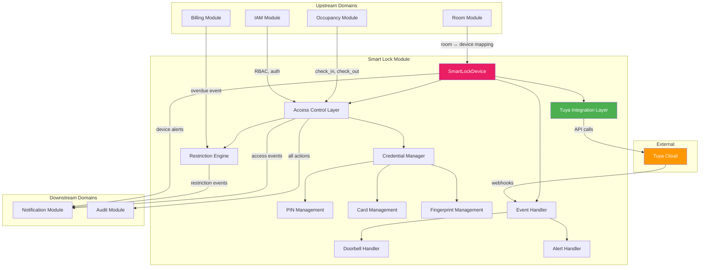
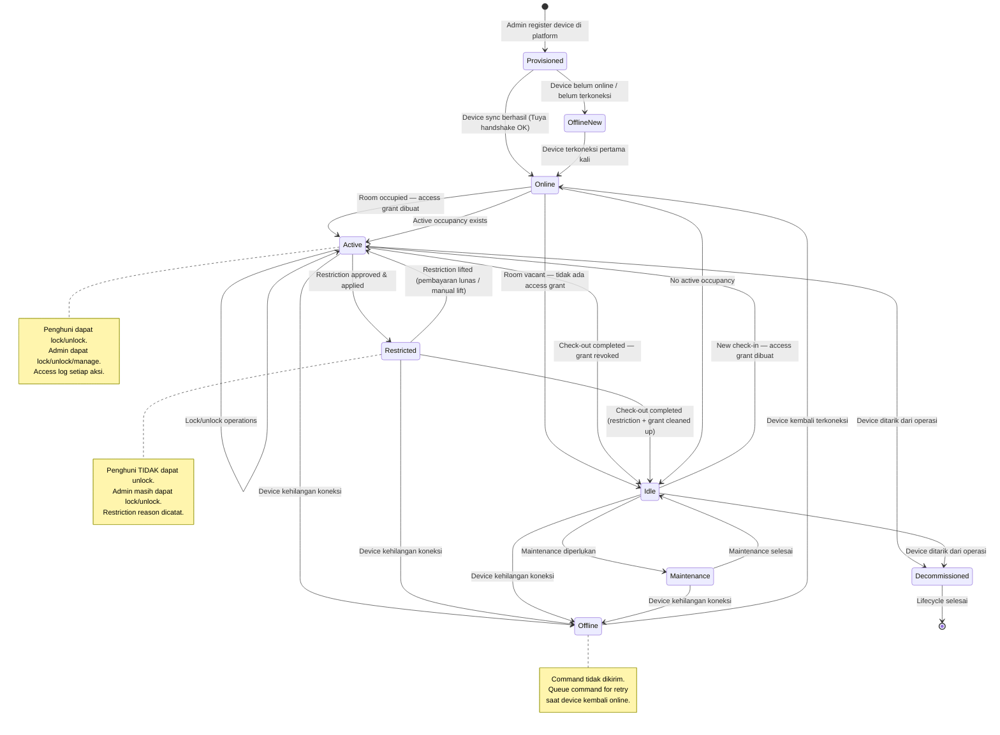
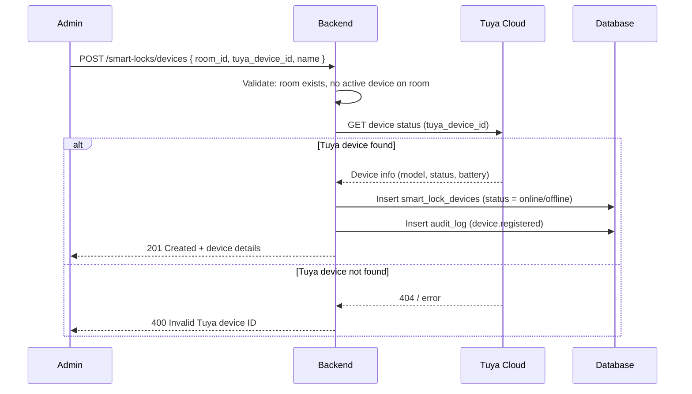
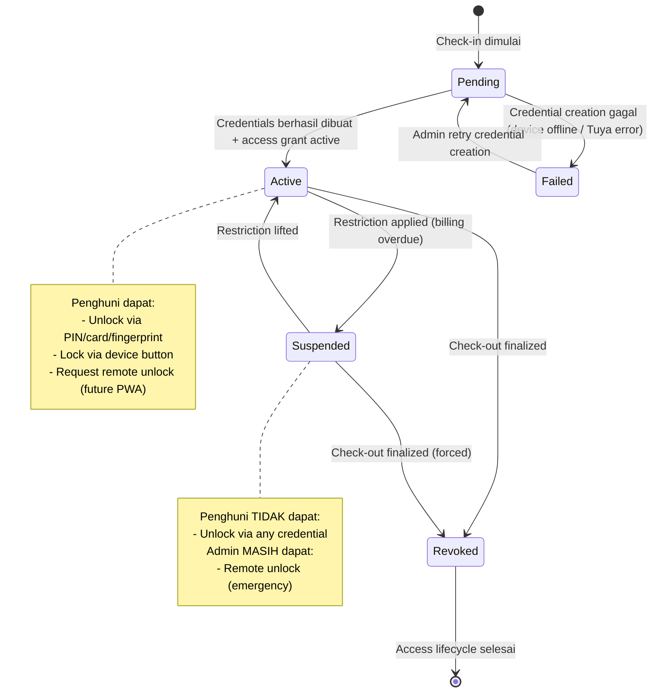
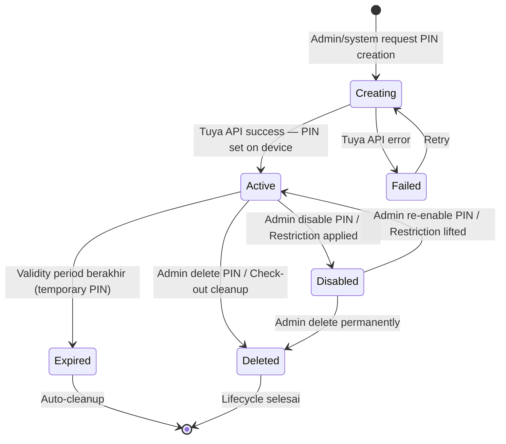
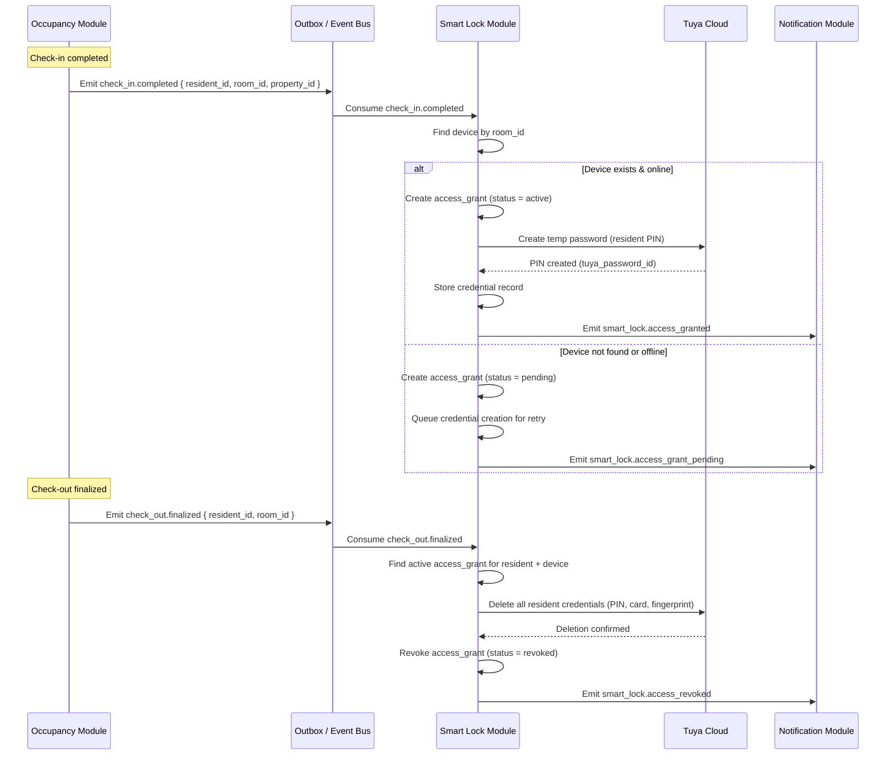
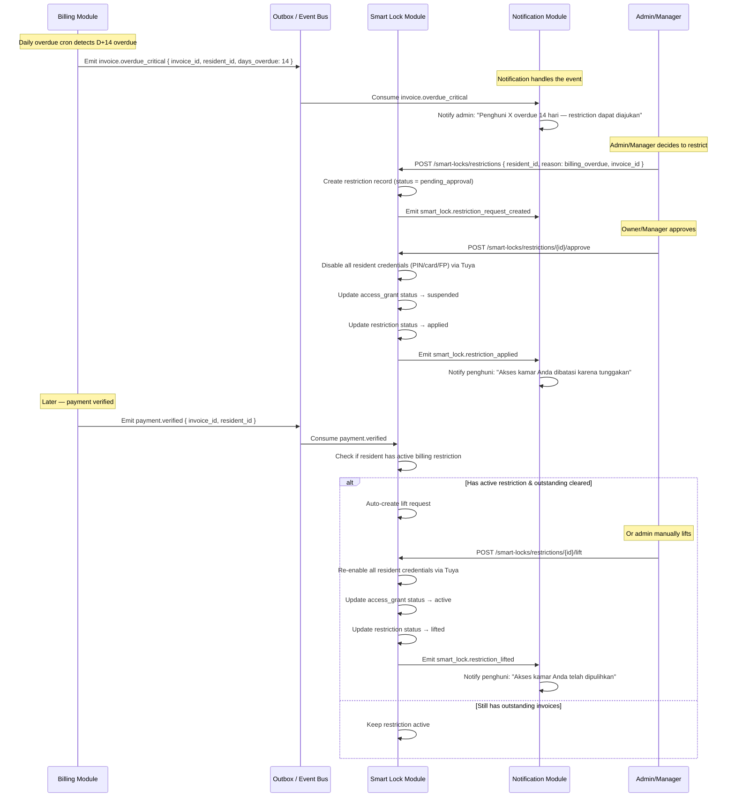
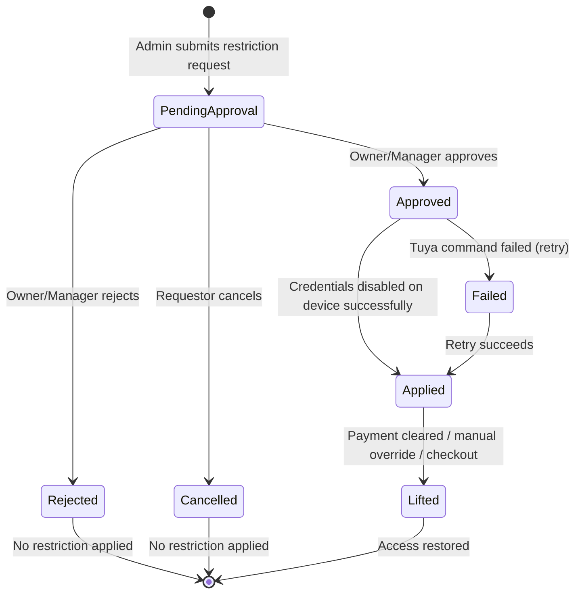
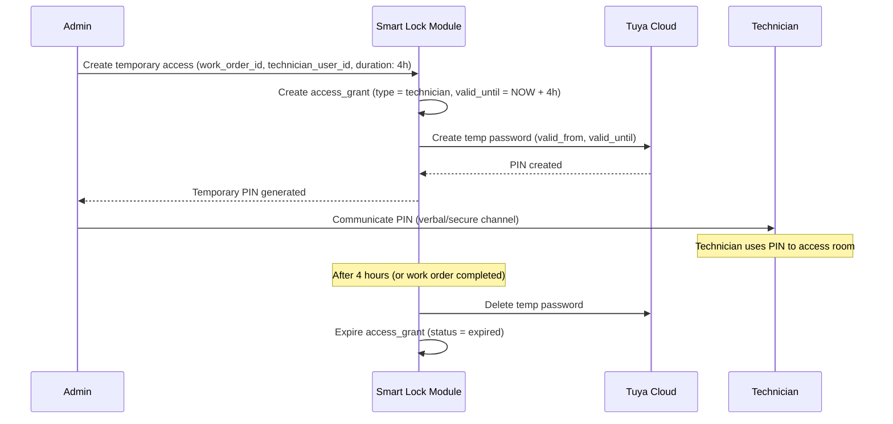
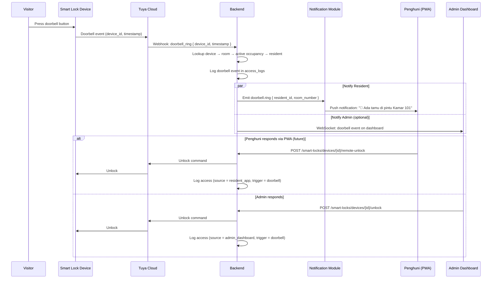

# SMART LOCK DOMAIN — Granada Kost Platform

> **Versi**: 1.0  
> **Tanggal**: 19 Juni 2026  
> **Peran Pembuat**: Principal Smart Lock Domain Architect  
> **Status**: Dokumen Analisis — Dasar Implementasi Smart Lock Module  
> **Milestone**: 10A — Smart Lock Domain Planning  
> **Dokumen Acuan**:  
> - [PROJECT_MASTER.md](file:///d:/PROJECT%20CODING/Granada%20Kost%20Platform/docs/PROJECT_MASTER.md)  
> - [DOMAIN_MODEL.md](file:///d:/PROJECT%20CODING/Granada%20Kost%20Platform/docs/DOMAIN_MODEL.md)  
> - [API_PLANNING.md](file:///d:/PROJECT%20CODING/Granada%20Kost%20Platform/docs/API_PLANNING.md)  
> - [BACKEND_ARCHITECTURE.md](file:///d:/PROJECT%20CODING/Granada%20Kost%20Platform/docs/BACKEND_ARCHITECTURE.md)  
> - [SMARTLOCK_POLICY.md](file:///d:/PROJECT%20CODING/Granada%20Kost%20Platform/docs/SMARTLOCK_POLICY.md)  
> - [SECURITY_POLICY.md](file:///d:/PROJECT%20CODING/Granada%20Kost%20Platform/docs/SECURITY_POLICY.md)  
> - [BILLING_DOMAIN.md](file:///d:/PROJECT%20CODING/Granada%20Kost%20Platform/docs/BILLING_DOMAIN.md)  
> - [NOTIFICATION_DOMAIN.md](file:///d:/PROJECT%20CODING/Granada%20Kost%20Platform/docs/NOTIFICATION_DOMAIN.md)  
> - [DATABASE_PLANNING.md](file:///d:/PROJECT%20CODING/Granada%20Kost%20Platform/docs/DATABASE_PLANNING.md)

---

## Daftar Isi

1. [Executive Summary](#1-executive-summary)
2. [Smart Lock Lifecycle](#2-smart-lock-lifecycle)
3. [Device Lifecycle](#3-device-lifecycle)
4. [Resident Access Lifecycle](#4-resident-access-lifecycle)
5. [PIN Management Lifecycle](#5-pin-management-lifecycle)
6. [Card Management Lifecycle](#6-card-management-lifecycle)
7. [Fingerprint Management Lifecycle](#7-fingerprint-management-lifecycle)
8. [Occupancy ↔ Smart Lock Relationship](#8-occupancy--smart-lock-relationship)
9. [Billing ↔ Smart Lock Relationship](#9-billing--smart-lock-relationship)
10. [Restriction Strategy untuk Penghuni Menunggak](#10-restriction-strategy-untuk-penghuni-menunggak)
11. [Grace Period Strategy](#11-grace-period-strategy)
12. [Emergency Override Strategy](#12-emergency-override-strategy)
13. [Property Owner Visibility](#13-property-owner-visibility)
14. [Technician Access Strategy](#14-technician-access-strategy)
15. [Temporary Access Strategy](#15-temporary-access-strategy)
16. [Guest Access Strategy](#16-guest-access-strategy)
17. [Doorbell Workflow](#17-doorbell-workflow)
18. [Remote Unlock Workflow](#18-remote-unlock-workflow)
19. [Audit Requirements](#19-audit-requirements)
20. [Security Requirements](#20-security-requirements)
21. [Notification Touchpoints](#21-notification-touchpoints)
22. [Tuya Integration Boundary](#22-tuya-integration-boundary)
23. [Failure Handling Strategy](#23-failure-handling-strategy)
24. [Offline Device Strategy](#24-offline-device-strategy)
25. [Risks & Edge Cases](#25-risks--edge-cases)
26. [Future Multi-Property Strategy](#26-future-multi-property-strategy)
27. [Recommended Implementation Phases](#27-recommended-implementation-phases)

---

## 1. Executive Summary

Smart Lock adalah **Core Domain** pada Granada Kost Platform yang menjadi differentiator utama bisnis. Domain ini mengelola integrasi perangkat kunci pintar PALOMA DLP 2131 melalui Tuya Cloud API, mencakup device management, access control per penghuni, credential lifecycle (PIN/kartu/fingerprint), restriction workflow akibat billing overdue, serta audit operasi keamanan tinggi.

### 1.1 Konteks Saat Ini

| Aspek | Status |
|---|---|
| **Modul yang sudah selesai** | IAM/RBAC, Property, Room, Resident, Occupancy, Billing, Complaint, Maintenance, Vehicle, Notification |
| **Hardware** | PALOMA Smart Lock DLP 2131 |
| **Ekosistem** | Tuya Cloud API |
| **Pengujian yang sudah berhasil** | ✅ Unlock request, ✅ Remote unlock, ✅ Status monitoring, ✅ Doorbell event, ✅ Normal open mode |
| **Frontend Smart Lock (Admin)** | UI matang — 6 stat cards, activity chart, alert panel, device grid, lock/unlock confirm dialog, detail dialog (100% mock) |
| **Frontend Smart Lock (Penghuni)** | Belum ada UI — perlu dibangun |
| **Skala** | ±163 kamar → ±163 device |

### 1.2 Keputusan Arsitektur Final

| # | Keputusan | Nilai |
|---|---|---|
| **SL-01** | Hardware model | PALOMA DLP 2131 |
| **SL-02** | Integration platform | Tuya Cloud API |
| **SL-03** | Command routing | Semua command melalui backend — frontend TIDAK langsung ke Tuya |
| **SL-04** | Secret management | Tuya secrets hanya di backend environment variable |
| **SL-05** | Audit requirement | Semua aksi Smart Lock wajib diaudit |
| **SL-06** | Restriction automation | Restriction TIDAK otomatis — wajib melalui approval workflow |
| **SL-07** | Property owner access | Read-only, TIDAK boleh command |
| **SL-08** | Notification | Menggunakan Notification Module yang sudah ada |
| **SL-09** | Admin PIN management | Admin dapat mengganti, menonaktifkan PIN penghuni |
| **SL-10** | Admin card management | Admin dapat menonaktifkan kartu akses penghuni |
| **SL-11** | Admin fingerprint management | Admin dapat menonaktifkan fingerprint penghuni |

### 1.3 PALOMA DLP 2131 Capabilities

Berdasarkan pengujian yang sudah berhasil:

| Capability | Status | Via |
|---|---|---|
| Remote unlock | ✅ Tested | Tuya Cloud API |
| Remote lock | ✅ Available | Tuya Cloud API |
| Status monitoring (lock state) | ✅ Tested | Tuya Cloud API |
| Battery level monitoring | ✅ Available | Tuya Cloud API status query |
| Doorbell event | ✅ Tested | Tuya Cloud API webhook/push |
| Normal open mode (passage) | ✅ Tested | Tuya Cloud API command |
| PIN management | ✅ Available | Tuya Cloud API — add/delete/modify temp password |
| Card management | ⚠️ Expected | Tuya Cloud API — credential management |
| Fingerprint management | ⚠️ Expected | Tuya Cloud API — credential management |
| Auto-lock | ✅ Available | Device-level setting via Tuya |
| Access log (device-side) | ✅ Available | Tuya Cloud API — operation logs |

### 1.4 Hubungan dengan Domain Lain



### 1.5 Domain Classification

| Aspek | Klasifikasi |
|---|---|
| **Domain type** | Core Domain (competitive edge) |
| **Bounded context** | `SmartLockContext` |
| **Module ownership** | Device metadata, access grants, credentials, restrictions, access logs, alerts |
| **Multi-property** | Wajib — `property_id` pada semua Smart Lock entities |
| **Data sensitivity** | 🔴 **Very High** — akses fisik ke kamar penghuni |

---

## 2. Smart Lock Lifecycle

### 2.1 Gambaran Umum

Smart Lock lifecycle mencakup keseluruhan operasi device dari provisioning hingga decommission, termasuk interaksi dengan occupancy, billing, dan maintenance context.

### 2.2 Master State Diagram



### 2.3 Lifecycle Phases

| # | Phase | Trigger | Aksi | Entitas |
|---|---|---|---|---|
| SL-LC-01 | **Provisioning** | Admin register device | Simpan metadata device + link ke room + sync status dari Tuya | SmartLockDevice |
| SL-LC-02 | **Activation** | Check-in completed | Buat access grant + credential (PIN/card/fingerprint) untuk penghuni | AccessGrant, Credentials |
| SL-LC-03 | **Normal Operation** | Penghuni/admin lock/unlock | Execute command via Tuya → log result | AccessLog |
| SL-LC-04 | **Restriction** | Billing overdue + approval | Disable penghuni credential; penghuni tidak bisa unlock | Restriction |
| SL-LC-05 | **Restriction Lifted** | Payment verified / manual lift | Re-enable penghuni credential | Restriction, Credentials |
| SL-LC-06 | **Deactivation** | Check-out finalized | Revoke access grant + delete/disable credentials | AccessGrant, Credentials |
| SL-LC-07 | **Maintenance** | Device issue reported | Suspend normal operations, teknisi access | MaintenanceFlag |
| SL-LC-08 | **Decommission** | Device physically removed | Soft-deactivate device record, archive logs | SmartLockDevice |

### 2.4 Business Rules

| # | Rule | Keterangan |
|---|---|---|
| BR-SL-01 | Satu room = paling banyak satu smart lock device aktif | Device-room mapping 1:0..1 |
| BR-SL-02 | Smart Lock command selalu melalui backend | Frontend tidak pernah berkomunikasi langsung dengan Tuya |
| BR-SL-03 | Setiap aksi lock/unlock/restrict wajib audit log | Aktor, device, aksi, waktu, hasil, correlation_id |
| BR-SL-04 | Penghuni hanya bisa mengakses device di kamarnya | Self-scope enforcement melalui access grant |
| BR-SL-05 | Device offline tidak bisa menerima remote command | Command harus di-queue atau di-reject dengan pesan informatif |
| BR-SL-06 | Battery < 20% → warning alert; < 12% → danger alert | Threshold dari DOMAIN_MODEL.md |
| BR-SL-07 | Multiple failed unlock attempts → danger alert | Security event — notify admin + manager |
| BR-SL-08 | Restriction TIDAK pernah otomatis tanpa approval manusia | Phase 1 safety rule dari API_PLANNING.md |
| BR-SL-09 | Auto-lock adalah konfigurasi per-device | Setting di device level, bukan platform-level |

---

## 3. Device Lifecycle

### 3.1 Device States

| State | Kode | Keterangan |
|---|---|---|
| **Provisioned** | `provisioned` | Device terdaftar di platform, belum synced dengan Tuya |
| **Online** | `online` | Device terkoneksi, heartbeat aktif |
| **Offline** | `offline` | Device kehilangan koneksi — command tidak bisa dikirim |
| **Maintenance** | `maintenance` | Device dalam perbaikan — operasi normal suspended |
| **Decommissioned** | `decommissioned` | Device ditarik dari operasi — soft-deactivated |

### 3.2 Lock States

Terpisah dari device connection state:

| Lock State | Kode | Keterangan |
|---|---|---|
| **Locked** | `locked` | Pintu terkunci — state normal |
| **Unlocked** | `unlocked` | Pintu terbuka — auto-lock akan mengembalikan ke locked |
| **Unknown** | `unknown` | State tidak bisa ditentukan (device baru / sync gagal) |

### 3.3 Device Registration Flow



### 3.4 Device Metadata

| Field | Source | Keterangan |
|---|---|---|
| `device_name` | Admin input | Nama display: "Lock Kamar 101" |
| `tuya_device_id` | Tuya dashboard | Device ID pada platform Tuya |
| `model` | Admin input / Tuya | "PALOMA DLP 2131" |
| `room_id` | Admin assignment | Room yang dipasangi device |
| `connection_status` | Tuya sync | `online`, `offline`, `unknown` |
| `lock_state` | Tuya sync | `locked`, `unlocked`, `unknown` |
| `battery_percent` | Tuya sync | 0-100, nullable jika tidak tersedia |
| `auto_lock_enabled` | Tuya sync / admin config | Boolean |
| `auto_lock_delay_seconds` | Tuya sync / admin config | Detik sebelum auto-lock (default: 5) |
| `firmware_version` | Tuya sync | Untuk tracking update |
| `last_synced_at` | Backend | Kapan terakhir sync status berhasil |
| `last_activity_at` | Backend | Kapan terakhir ada aksi lock/unlock |

---

## 4. Resident Access Lifecycle

### 4.1 State Diagram



### 4.2 Access Grant Model

| Field | Type | Keterangan |
|---|---|---|
| `id` | UUID | PK |
| `property_id` | UUID | FK → properties |
| `smart_lock_device_id` | UUID | FK → smart_lock_devices |
| `resident_id` | UUID | FK → residents (nullable untuk staff grants) |
| `user_id` | UUID | FK → users |
| `grant_type` | VARCHAR | `resident`, `technician`, `temporary`, `master` |
| `valid_from` | TIMESTAMP | Kapan akses mulai berlaku |
| `valid_until` | TIMESTAMP | Kapan akses berakhir (nullable = indefinite, ikut occupancy) |
| `grant_status` | VARCHAR | `active`, `suspended`, `revoked`, `expired` |
| `created_by_user_id` | UUID | Siapa yang memberikan akses |
| `suspended_at` | TIMESTAMP | Kapan di-suspend (nullable) |
| `revoked_at` | TIMESTAMP | Kapan di-revoke (nullable) |
| `revoke_reason` | VARCHAR | `checkout`, `restriction`, `manual_admin`, `security_incident` |

### 4.3 Access Grant Rules

| # | Rule | Keterangan |
|---|---|---|
| BR-AG-01 | Satu penghuni = satu active access grant per device | Unique active (resident_id, device_id) |
| BR-AG-02 | Access grant dibuat saat check-in completed | Otomatis oleh occupancy event consumer |
| BR-AG-03 | Access grant di-revoke saat check-out finalized | Otomatis oleh occupancy event consumer |
| BR-AG-04 | Access grant di-suspend saat restriction applied | Status → `suspended` |
| BR-AG-05 | Access grant di-reactivate saat restriction lifted | Status → `active` |
| BR-AG-06 | `valid_until` untuk resident = NULL (ikut occupancy lifetime) | Explicit revoke on checkout |
| BR-AG-07 | `valid_until` untuk temporary grant = explicit datetime | Auto-expire after deadline |

---

## 5. PIN Management Lifecycle

### 5.1 Overview

PALOMA DLP 2131 mendukung temporary/dynamic PIN melalui Tuya Cloud API. PIN adalah credential utama untuk akses fisik harian.

### 5.2 PIN Types

| Type | Kode | Keterangan | Lifetime |
|---|---|---|---|
| **Resident PIN** | `resident_pin` | PIN utama penghuni untuk akses kamar | Selama occupancy aktif |
| **Temporary PIN** | `temporary_pin` | PIN sementara untuk tamu/teknisi | Custom duration (hours/days) |
| **Master PIN** | `master_pin` | PIN admin/master untuk emergency | Permanent, dikelola admin |

### 5.3 State Diagram



### 5.4 PIN Operations

| # | Operation | Actor | Tuya API Call | Keterangan |
|---|---|---|---|---|
| PIN-01 | **Create resident PIN** | System (on check-in) | `POST /v1.0/devices/{id}/door-lock/temp-password` | PIN digenerate secara acak atau admin-defined |
| PIN-02 | **Change resident PIN** | Admin | `PUT /v1.0/devices/{id}/door-lock/temp-password/{pw_id}` | Admin berhak mengganti PIN kapan saja |
| PIN-03 | **Disable resident PIN** | Admin | `PUT ...` (set invalid/expired) | Menonaktifkan tanpa menghapus record |
| PIN-04 | **Re-enable resident PIN** | Admin | `PUT ...` (set valid again) | Setelah restriction lifted |
| PIN-05 | **Delete resident PIN** | System (on check-out) | `DELETE /v1.0/devices/{id}/door-lock/temp-password/{pw_id}` | Cleanup saat check-out |
| PIN-06 | **Create temporary PIN** | Admin | Same create API with time bounds | Untuk tamu/teknisi |
| PIN-07 | **View active PINs** | Admin | `GET /v1.0/devices/{id}/door-lock/temp-passwords` | List semua PIN aktif pada device |

### 5.5 PIN Business Rules

| # | Rule | Keterangan |
|---|---|---|
| BR-PIN-01 | Penghuni TIDAK bisa membuat/mengubah PIN sendiri | Admin-managed — keputusan bisnis final |
| BR-PIN-02 | PIN resident otomatis dibuat saat check-in | System-initiated via occupancy event |
| BR-PIN-03 | PIN resident otomatis dihapus saat check-out | System-initiated via occupancy event |
| BR-PIN-04 | Admin bisa mengganti PIN kapan saja | Override capability |
| BR-PIN-05 | PIN disabled saat restriction applied | Bagian dari restriction flow |
| BR-PIN-06 | PIN re-enabled saat restriction lifted | Bagian dari lift flow |
| BR-PIN-07 | Temporary PIN memiliki explicit valid_from dan valid_until | Auto-expire on Tuya device |
| BR-PIN-08 | PIN value TIDAK disimpan plaintext di database | Hanya Tuya password ID + metadata; PIN value sementara untuk display saat creation |
| BR-PIN-09 | PIN creation harus idempotent | Retry-safe jika Tuya call fails mid-way |

### 5.6 PIN Data Model

| Field | Type | Keterangan |
|---|---|---|
| `id` | UUID | PK |
| `smart_lock_device_id` | UUID | FK → smart_lock_devices |
| `access_grant_id` | UUID | FK → smart_lock_access_grants (nullable untuk master PIN) |
| `tuya_password_id` | VARCHAR | Tuya's internal password ID (returned on creation) |
| `pin_type` | VARCHAR | `resident_pin`, `temporary_pin`, `master_pin` |
| `pin_status` | VARCHAR | `active`, `disabled`, `expired`, `deleted` |
| `pin_label` | VARCHAR | Human-readable label: "PIN Kamar 101 - Andi" |
| `valid_from` | TIMESTAMP | Kapan PIN mulai berlaku |
| `valid_until` | TIMESTAMP | Kapan PIN berakhir (nullable = indefinite) |
| `created_by_user_id` | UUID | Siapa yang membuat PIN |
| `disabled_at` | TIMESTAMP | Kapan PIN di-disable (nullable) |
| `disabled_by_user_id` | UUID | Siapa yang men-disable (nullable) |
| `created_at` | TIMESTAMP | Record creation |
| `updated_at` | TIMESTAMP | Last update |

---

## 6. Card Management Lifecycle

### 6.1 Overview

PALOMA DLP 2131 mendukung akses kartu RFID. Kartu harus didaftarkan ke device melalui Tuya Cloud API atau secara fisik pada device.

### 6.2 Card States

| State | Kode | Keterangan |
|---|---|---|
| **Registered** | `registered` | Kartu sedang didaftarkan (waiting device enrollment) |
| **Active** | `active` | Kartu aktif dan bisa digunakan unlock |
| **Disabled** | `disabled` | Kartu dinonaktifkan oleh admin |
| **Revoked** | `revoked` | Kartu dicabut (check-out / security) |

### 6.3 Card Operations

| # | Operation | Actor | Keterangan |
|---|---|---|---|
| CARD-01 | **Register card** | Admin (physical enrollment) | Kartu ditap pada device + backend records mapping |
| CARD-02 | **Disable card** | Admin | Menonaktifkan tanpa menghapus dari device |
| CARD-03 | **Re-enable card** | Admin | Mengaktifkan kembali |
| CARD-04 | **Revoke card** | System (on check-out) | Menghapus kartu dari device |
| CARD-05 | **List cards** | Admin | Melihat semua kartu pada device |

### 6.4 Card Business Rules

| # | Rule | Keterangan |
|---|---|---|
| BR-CARD-01 | Kartu didaftarkan oleh admin, bukan self-service penghuni | Physical enrollment process |
| BR-CARD-02 | Admin bisa menonaktifkan kartu kapan saja | SL-10 decision |
| BR-CARD-03 | Kartu otomatis di-revoke saat check-out | System-initiated cleanup |
| BR-CARD-04 | Kartu di-disable saat restriction applied | Bagian dari restriction flow |
| BR-CARD-05 | Kartu di-enable kembali saat restriction lifted | Bagian dari lift flow |
| BR-CARD-06 | Satu penghuni bisa memiliki 0–2 kartu (utama + cadangan) | Business limit |

### 6.5 Card Data Model

| Field | Type | Keterangan |
|---|---|---|
| `id` | UUID | PK |
| `smart_lock_device_id` | UUID | FK → smart_lock_devices |
| `access_grant_id` | UUID | FK → smart_lock_access_grants |
| `tuya_card_id` | VARCHAR | Tuya's internal card identifier |
| `card_label` | VARCHAR | Human-readable: "Kartu Utama - Andi" |
| `card_status` | VARCHAR | `registered`, `active`, `disabled`, `revoked` |
| `registered_at` | TIMESTAMP | Kapan kartu didaftarkan |
| `disabled_at` | TIMESTAMP | Kapan di-disable (nullable) |
| `disabled_by_user_id` | UUID | Siapa yang men-disable (nullable) |
| `revoked_at` | TIMESTAMP | Kapan di-revoke (nullable) |
| `created_at` | TIMESTAMP | Record creation |
| `updated_at` | TIMESTAMP | Last update |

---

## 7. Fingerprint Management Lifecycle

### 7.1 Overview

PALOMA DLP 2131 mendukung akses fingerprint. Fingerprint harus didaftarkan secara fisik pada device — tidak bisa di-enroll secara remote via API.

### 7.2 Fingerprint States

| State | Kode | Keterangan |
|---|---|---|
| **Enrolled** | `enrolled` | Fingerprint terdaftar pada device |
| **Active** | `active` | Fingerprint aktif dan bisa unlock |
| **Disabled** | `disabled` | Fingerprint dinonaktifkan oleh admin |
| **Revoked** | `revoked` | Fingerprint dicabut (check-out / security) |

### 7.3 Fingerprint Operations

| # | Operation | Actor | Keterangan |
|---|---|---|---|
| FP-01 | **Enroll fingerprint** | Admin (physical on device) | Penghuni menempatkan jari pada sensor, admin records di backend |
| FP-02 | **Disable fingerprint** | Admin via Tuya API | Menonaktifkan tanpa menghapus dari device |
| FP-03 | **Re-enable fingerprint** | Admin | Mengaktifkan kembali |
| FP-04 | **Revoke fingerprint** | System (on check-out) | Menghapus fingerprint dari device |
| FP-05 | **List fingerprints** | Admin | Melihat semua fingerprint pada device |

### 7.4 Fingerprint Business Rules

| # | Rule | Keterangan |
|---|---|---|
| BR-FP-01 | Fingerprint didaftarkan secara fisik di device oleh admin | Tidak bisa remote enrollment |
| BR-FP-02 | Admin bisa menonaktifkan fingerprint kapan saja | SL-11 decision |
| BR-FP-03 | Fingerprint otomatis di-revoke saat check-out | System cleanup — delete dari device |
| BR-FP-04 | Fingerprint di-disable saat restriction applied | Bagian dari restriction flow |
| BR-FP-05 | Fingerprint di-enable kembali saat restriction lifted | Bagian dari lift flow |
| BR-FP-06 | Satu penghuni bisa memiliki 1–3 fingerprint | Multiple fingers untuk redundancy |
| BR-FP-07 | Fingerprint data biometric TIDAK disimpan di platform | Hanya tersimpan pada device hardware + Tuya; platform menyimpan metadata (ID, label, status) |

### 7.5 Fingerprint Data Model

| Field | Type | Keterangan |
|---|---|---|
| `id` | UUID | PK |
| `smart_lock_device_id` | UUID | FK → smart_lock_devices |
| `access_grant_id` | UUID | FK → smart_lock_access_grants |
| `tuya_fingerprint_id` | VARCHAR | Tuya's internal fingerprint identifier |
| `finger_label` | VARCHAR | Human-readable: "Jari telunjuk kanan - Andi" |
| `fingerprint_status` | VARCHAR | `enrolled`, `active`, `disabled`, `revoked` |
| `enrolled_at` | TIMESTAMP | Kapan didaftarkan |
| `disabled_at` | TIMESTAMP | Kapan di-disable (nullable) |
| `disabled_by_user_id` | UUID | Siapa yang men-disable (nullable) |
| `revoked_at` | TIMESTAMP | Kapan di-revoke (nullable) |
| `created_at` | TIMESTAMP | Record creation |
| `updated_at` | TIMESTAMP | Last update |

---

## 8. Occupancy ↔ Smart Lock Relationship

### 8.1 Cross-Context Event Flow



### 8.2 Relationship Rules

| # | Rule | Keterangan |
|---|---|---|
| BR-OCC-SL-01 | Check-in completed → automatic access grant creation | Event-driven, bukan synchronous call |
| BR-OCC-SL-02 | Check-out finalized → automatic credential cleanup + grant revocation | All credentials (PIN/card/FP) dihapus dari device |
| BR-OCC-SL-03 | Room tanpa smart lock device → skip, tidak error | Tidak semua kamar wajib punya smart lock |
| BR-OCC-SL-04 | Device offline saat check-in → access grant dibuat dengan status `pending`, credential creation di-queue | Retry saat device online |
| BR-OCC-SL-05 | Occupancy module TIDAK tahu detail Smart Lock | Loose coupling via domain events |
| BR-OCC-SL-06 | Smart Lock module TIDAK memodifikasi occupancy state | Read-only consumer |

---

## 9. Billing ↔ Smart Lock Relationship

### 9.1 Cross-Context Relationship Overview

Billing ↔ Smart Lock adalah **cross-context business rule paling kritis** di platform (CR-01 dari DOMAIN_MODEL.md). Invoice overdue dapat memicu restriction pada smart lock penghuni.

**Prinsip utama**: Restriction TIDAK otomatis. Billing overdue menghasilkan **restriction request** yang harus di-approve oleh owner/manager sebelum diterapkan.

### 9.2 Restriction Trigger Flow



### 9.3 Billing ↔ Smart Lock Business Rules

| # | Rule | Keterangan |
|---|---|---|
| BR-BSL-01 | Billing overdue TIDAK otomatis restrict Smart Lock | Wajib approval workflow (SL-06) |
| BR-BSL-02 | Restriction request hanya bisa dibuat oleh owner/manager/admin | Billing module hanya emit event — tidak create restriction |
| BR-BSL-03 | Restriction approval hanya oleh owner/manager | Decision requires authority |
| BR-BSL-04 | Pembayaran terverifikasi dengan semua outstanding cleared → restriction bisa diangkat | Auto-suggest lift, tapi tetap perlu admin action |
| BR-BSL-05 | Restriction tetap berlaku meskipun partial payment | Harus fully cleared untuk lift |
| BR-BSL-06 | Penghuni diberi notifikasi SEBELUM restriction applied | Fair warning principle (BR-SLN-03 dari NOTIFICATION_DOMAIN.md) |
| BR-BSL-07 | Smart Lock module TIDAK tahu detail billing (jumlah, denda) | Hanya tahu "ada restriction karena billing" + invoice reference |

---

## 10. Restriction Strategy untuk Penghuni Menunggak

### 10.1 Complete Restriction Flow — Penghuni Menunggak

```
Timeline Overdue → Restriction:

Tanggal 25  : Jatuh tempo invoice
D+1         : Invoice status → overdue; denda 1%/hari mulai berlaku
              Notifikasi: BN-02 (high) — Penghuni
D+3         : Notifikasi: BN-03 (high) — Penghuni + Admin
D+7         : Notifikasi: BN-04 (high) — Penghuni + Admin
D+14        : Notifikasi: BN-05 (urgent) — Penghuni + Admin + Manager
              ⚠️ THRESHOLD: Admin dashboard menampilkan opsi "Ajukan Restriction"
D+14 – D+30: Admin/Manager DAPAT mengajukan restriction
              → Restriction request dibuat (pending_approval)
              → Owner/Manager approve
              → Credentials disabled pada device
              → Penghuni notified: "Akses dibatasi"
              → Penghuni masih bisa menghubungi admin (chat/phone)
D+30        : Notifikasi: BN-06 (urgent) — Admin + Manager + Owner
              Pertimbangkan checkout jika masih belum bayar

Setelah pembayaran:
              → Payment verified
              → Admin checks outstanding = 0
              → Admin lift restriction
              → Credentials re-enabled
              → Penghuni notified: "Akses dipulihkan"
```

### 10.2 Restriction Types

| Type | Kode | Trigger | Approval |
|---|---|---|---|
| **Billing Overdue** | `billing_overdue` | Admin request setelah invoice overdue D+14 | Owner/Manager |
| **Manual Admin** | `manual_admin` | Admin/Manager manual decision | Owner/Manager |
| **Security Incident** | `security_incident` | Security event (intrusion, unauthorized access) | Owner/Manager |
| **Checkout Completed** | `checkout_completed` | System — bagian dari checkout flow | Automatic (system) |

### 10.3 Restriction Data Model

| Field | Type | Keterangan |
|---|---|---|
| `id` | UUID | PK |
| `property_id` | UUID | FK → properties |
| `smart_lock_device_id` | UUID | FK → smart_lock_devices |
| `room_id` | UUID | FK → rooms |
| `resident_id` | UUID | FK → residents |
| `reason_type` | VARCHAR | `billing_overdue`, `manual_admin`, `security_incident`, `checkout_completed` |
| `reason_description` | TEXT | Human-readable reason: "Tagihan Kamar 202 overdue 24 hari" |
| `reason_ref_type` | VARCHAR | `invoice`, `complaint`, `checkout_request` (nullable) |
| `reason_ref_id` | UUID | ID of related entity (nullable) |
| `restriction_status` | VARCHAR | `pending_approval`, `approved`, `applied`, `rejected`, `lifted`, `cancelled` |
| `requested_by_user_id` | UUID | Admin yang mengajukan |
| `approved_by_user_id` | UUID | Owner/Manager yang approve (nullable) |
| `applied_at` | TIMESTAMP | Kapan restriction diterapkan pada device (nullable) |
| `lifted_at` | TIMESTAMP | Kapan restriction diangkat (nullable) |
| `lifted_by_user_id` | UUID | Siapa yang mengangkat (nullable) |
| `lift_reason` | VARCHAR | `payment_cleared`, `manual_override`, `checkout` (nullable) |
| `rejected_at` | TIMESTAMP | Kapan ditolak (nullable) |
| `rejected_by_user_id` | UUID | Siapa yang menolak (nullable) |
| `rejection_reason` | TEXT | Alasan penolakan (nullable) |
| `created_at` | TIMESTAMP | Record creation |
| `updated_at` | TIMESTAMP | Last update |

### 10.4 Restriction Status Transitions



---

## 11. Grace Period Strategy

### 11.1 Grace Period Definition

Grace period adalah waktu antara approval restriction dan actual application pada device, memberikan kesempatan terakhir kepada penghuni.

### 11.2 Grace Period Rules

| # | Rule | Keterangan |
|---|---|---|
| BR-GP-01 | Grace period = **24 jam** setelah restriction approved | Penghuni diberi notifikasi + waktu untuk bayar |
| BR-GP-02 | Notifikasi dikirim saat restriction approved: "Akses akan dibatasi dalam 24 jam" | Urgent priority, in-app + email |
| BR-GP-03 | Jika penghuni membayar dalam grace period → restriction auto-cancelled | Payment verified → cancel pending restriction |
| BR-GP-04 | Jika grace period habis tanpa pembayaran → credentials disabled | System auto-applies |
| BR-GP-05 | Grace period TIDAK berlaku untuk `security_incident` restriction | Security = immediate apply |
| BR-GP-06 | Admin/Manager bisa skip grace period (immediate apply) dengan justifikasi | Emergency override capability |

### 11.3 Grace Period Flow

```
Restriction Approved:
│
├── 1. Create restriction record (status = approved)
├── 2. Notify Penghuni: "⚠️ Akses kamar akan dibatasi dalam 24 jam karena tunggakan"
├── 3. Schedule grace period timer (24h)
│
├── [Within 24h] Penghuni pays:
│   ├── Payment verified event received
│   ├── Outstanding = 0 → Cancel restriction (status = cancelled)
│   ├── Notify Penghuni: "Restriction dibatalkan. Akses tetap aktif."
│   └── Cancel timer
│
└── [After 24h] No payment:
    ├── Apply restriction (disable credentials via Tuya)
    ├── Update status → applied
    ├── Notify Penghuni: "🔴 Akses kamar dibatasi. Hubungi admin."
    └── Notify Admin: "Restriction applied pada Kamar XXX"
```

---

## 12. Emergency Override Strategy

### 12.1 Emergency Scenarios

| # | Scenario | Required Action | Authority |
|---|---|---|---|
| EM-01 | **Penghuni terkunci diluar (restricted + lupa HP)** | Remote unlock oleh admin | Admin/Manager/Owner |
| EM-02 | **Kebakaran / keadaan darurat** | Remote unlock ALL devices pada property | Owner + Manager |
| EM-03 | **Device malfunction — pintu tidak bisa dibuka** | Physical override (master key) + Tuya command | Admin on-site |
| EM-04 | **Medical emergency — penghuni butuh bantuan dalam kamar** | Remote unlock oleh admin | Admin/Manager/Owner |
| EM-05 | **Security incident — perlu masuk ke kamar segera** | Remote unlock + audit trail | Owner/Manager |

### 12.2 Emergency Override Rules

| # | Rule | Keterangan |
|---|---|---|
| BR-EM-01 | Emergency unlock SELALU meninggalkan audit trail | source = `emergency_override` |
| BR-EM-02 | Emergency unlock bisa dilakukan walaupun restriction active | Override restriction for safety |
| BR-EM-03 | Emergency unlock TIDAK mengangkat restriction | Restriction tetap berlaku setelah pintu kembali terkunci |
| BR-EM-04 | Mass unlock (all devices) hanya oleh Owner + Manager | Highest authority required |
| BR-EM-05 | Emergency override harus memiliki `reason` wajib diisi | Accountability |
| BR-EM-06 | Emergency override events dikirim sebagai notification (urgent) | Awareness ke management chain |

### 12.3 Emergency Override Data

| Field | Value |
|---|---|
| `action_type` | `emergency_unlock` |
| `source` | `emergency_override` |
| `reason` | Wajib diisi (free text) |
| `result_status` | `success`, `failed`, `timeout` |
| `audit_level` | Always full audit |
| `notification` | Urgent → admin + manager + owner |

---

## 13. Property Owner Visibility

### 13.1 Access Rules (Final)

| Operation | `property_owner` | Keterangan |
|---|---|---|
| View device list | ❌ **NO** | No Smart Lock access per RBAC |
| View device status | ❌ **NO** | No Smart Lock access |
| Lock/unlock command | ❌ **NO** | Never — decision SL-07 |
| View access logs | ❌ **NO** | Security-sensitive |
| View alerts | ❌ **NO** | Operational |
| Manage restrictions | ❌ **NO** | Write operation |
| View Smart Lock summary report | ⚠️ **Limited** | Hanya via Property Owner monthly digest — aggregate stats only |
| Receive Smart Lock notifications | ❌ **NO** | BR-SLN-04 dari NOTIFICATION_DOMAIN.md |

### 13.2 Monthly Digest for Property Owner

Dalam monthly digest, property owner **hanya** menerima aggregate data:

| Data Point | Format | Contoh |
|---|---|---|
| Total devices | Count | "15 Smart Lock terpasang" |
| Devices online | Count | "14 online, 1 offline" |
| Battery warnings | Count | "2 device battery rendah" |

> **Tidak** menerima: per-device detail, access logs, restriction details, specific penghuni info, emergency events.

---

## 14. Technician Access Strategy

### 14.1 Use Cases

| # | Scenario | Access Type | Duration |
|---|---|---|---|
| TA-01 | Perbaikan AC/listrik di kamar occupied | Temporary PIN | Durasi work order (hours) |
| TA-02 | Inspeksi kamar kosong | Temporary PIN | Durasi inspeksi (1–2 jam) |
| TA-03 | Maintenance device Smart Lock | Master PIN / physical key | Admin supervised |
| TA-04 | Check-out inspection | Temporary PIN | Durasi inspeksi |

### 14.2 Technician Access Flow



### 14.3 Technician Access Rules

| # | Rule | Keterangan |
|---|---|---|
| BR-TA-01 | Technician access selalu temporary dengan explicit expiry | Tidak boleh indefinite |
| BR-TA-02 | Technician access dibuat oleh admin, bukan self-service | Admin authorization required |
| BR-TA-03 | Technician access di-audit | action_type = `technician_access_granted` |
| BR-TA-04 | Technician access otomatis expire setelah duration | Tuya temp password handles expiry |
| BR-TA-05 | Technician tidak bisa memperpanjang akses sendiri | Admin must extend |
| BR-TA-06 | Kamar restricted masih bisa diberi technician access | Maintenance tetap harus dilakukan |

---

## 15. Temporary Access Strategy

### 15.1 Temporary Access Types

| Type | Use Case | Max Duration | Created By |
|---|---|---|---|
| **Work Order** | Maintenance pekerjaan | 24 jam | Admin (linked to work order) |
| **Inspection** | Inspeksi kamar / check-out | 4 jam | Admin |
| **Cleaning** | Cleaning service | 2 jam | Admin |
| **Emergency** | Akses darurat | 1 jam | Admin/Manager/Owner |

### 15.2 Temporary Access Rules

| # | Rule | Keterangan |
|---|---|---|
| BR-TEMP-01 | Maximum duration: 24 jam | Lebih lama harus ada justifikasi + approval |
| BR-TEMP-02 | Auto-expire di device (Tuya) DAN di platform | Double cleanup |
| BR-TEMP-03 | Admin bisa early-revoke temporary access | Sebelum expiry jika pekerjaan selesai |
| BR-TEMP-04 | Temporary access tidak boleh diberikan ke penghuni yang sedang restricted | Bypass restriction tidak diizinkan |
| BR-TEMP-05 | Setiap temporary access harus memiliki purpose/reason | Audit requirement |

---

## 16. Guest Access Strategy

### 16.1 Phase 1: No Self-Service Guest Access

| Decision | Rationale |
|---|---|
| **Penghuni TIDAK bisa membuat guest access sendiri** | Security control — semua akses harus melalui admin |
| **Guest access = temporary PIN dari admin** | Penghuni request via chat/admin → admin create temporary PIN |

### 16.2 Guest Access Flow

```
Guest wants to visit penghuni:
│
├── 1. Penghuni menghubungi admin (chat / datang langsung)
├── 2. Admin verifikasi penghuni dan identitas tamu
├── 3. Admin membuat temporary PIN (duration: 2–4 jam)
├── 4. Penghuni menerima PIN dan memberikan ke tamu
│     (atau admin memberikan langsung)
├── 5. Tamu menggunakan PIN untuk masuk
├── 6. PIN otomatis expire setelah duration
│
└── Audit: temporary_access_granted (reason = guest_visit)
```

### 16.3 Future Phase: Penghuni Self-Service Guest

| Feature | Phase | Keterangan |
|---|---|---|
| Penghuni request guest PIN via PWA | Phase 2+ | PWA form → backend validates → Tuya creates temp PIN |
| Guest PIN auto-approved for low-risk hours | Phase 2+ | Config: hours where auto-approval is allowed |
| Guest access history di penghuni app | Phase 2+ | Read-only log of guest PINs created |

### 16.4 Guest Access Business Rules

| # | Rule | Keterangan |
|---|---|---|
| BR-GUEST-01 | Jam malam (23:00 WIB) berlaku — guest access tidak boleh dibuat setelah 23:00 | Kost policy BR-04 |
| BR-GUEST-02 | Maximum guest PIN duration: 4 jam | Bukan untuk menginap |
| BR-GUEST-03 | Guest access tidak tersedia untuk kamar restricted | Security enforcement |
| BR-GUEST-04 | Tamu wajib dilaporkan sebelum 21:00 WIB | Kost policy BR-05 |

---

## 17. Doorbell Workflow

### 17.1 Overview

PALOMA DLP 2131 mendukung doorbell event. Saat seseorang menekan tombol doorbell, Tuya mengirim push event ke backend. Ini bisa digunakan untuk notifikasi dan remote unlock.

### 17.2 Doorbell Event Flow



### 17.3 Doorbell Business Rules

| # | Rule | Keterangan |
|---|---|---|
| BR-DB-01 | Doorbell event selalu di-log | Access log type = `doorbell_ring` |
| BR-DB-02 | Doorbell notification dikirim ke penghuni kamar terkait | Via Notification Module (in-app + push future) |
| BR-DB-03 | Doorbell notification TIDAK dikirim jika kamar kosong (no occupancy) | No recipient |
| BR-DB-04 | Doorbell notification pada kamar restricted tetap dikirim | Penghuni tetap perlu tahu ada tamu |
| BR-DB-05 | Rate limit doorbell notifications: max 1 per 30 detik per device | Anti-spam |
| BR-DB-06 | Admin dashboard mendapat real-time doorbell events via WebSocket | Live monitoring |

---

## 18. Remote Unlock Workflow

### 18.1 Remote Unlock Flow

```mermaid
sequenceDiagram
    participant ACTOR as Admin / Penghuni
    participant BACKEND as Backend
    participant GUARD as Auth + RBAC Guard
    participant RL as Rate Limiter
    participant SL as Smart Lock Service
    participant TUYA as Tuya Cloud
    participant DEVICE as Smart Lock Device
    participant AUDIT as Audit Service

    ACTOR->>BACKEND: POST /smart-locks/devices/{id}/unlock { reason? }
    BACKEND->>GUARD: Validate auth token + check permission
    GUARD-->>BACKEND: Authorized

    BACKEND->>RL: Check rate limit (user_id + device_id)
    alt Rate limit OK
        RL-->>BACKEND: Allowed
    else Rate limit exceeded
        RL-->>BACKEND: 429 Too Many Requests
        BACKEND-->>ACTOR: Error: rate limit exceeded
    end

    BACKEND->>SL: Execute unlock command
    SL->>SL: Check device status (connection_status = online?)

    alt Device online
        SL->>SL: Check if actor has active access grant (or is admin)
        alt Has access + not restricted (or admin override)
            SL->>TUYA: POST /v1.0/devices/{id}/commands [switch_lock: true]
            alt Tuya success
                TUYA->>DEVICE: Unlock signal
                DEVICE-->>TUYA: Acknowledgment
                TUYA-->>SL: Success
                SL->>AUDIT: Log access (action=unlock, result=success, source, actor)
                SL-->>BACKEND: Unlock successful
                BACKEND-->>ACTOR: 200 OK { status: unlocked }
            else Tuya error
                TUYA-->>SL: Error response
                SL->>AUDIT: Log access (action=unlock, result=failed, error)
                SL-->>BACKEND: Unlock failed
                BACKEND-->>ACTOR: 502 Provider error
            end
        else No access grant or restricted
            SL->>AUDIT: Log access (action=unlock, result=denied, reason)
            SL-->>BACKEND: Access denied
            BACKEND-->>ACTOR: 403 Forbidden
        end
    else Device offline
        SL->>AUDIT: Log access (action=unlock, result=device_offline)
        SL-->>BACKEND: Device offline
        BACKEND-->>ACTOR: 503 Device offline
    end
```

### 18.2 Remote Unlock Sources

| Source | Kode | Actor | Validation |
|---|---|---|---|
| **Admin Dashboard** | `admin_dashboard` | Owner/Manager/Admin | RBAC permission + rate limit |
| **Penghuni PWA** | `resident_app` | Resident | Access grant + not restricted + rate limit |
| **Emergency Override** | `emergency_override` | Owner/Manager/Admin | RBAC + reason mandatory |
| **Billing System** (lift restriction) | `billing_system` | System | Internal — no direct unlock, only re-enable credentials |
| **Checkout Workflow** | `checkout_workflow` | System | Internal — part of checkout flow |

### 18.3 Remote Unlock Rate Limits

| Role | Rate Limit | Window |
|---|---|---|
| Admin/Manager/Owner | 10 unlock per device per 5 min | Sliding window |
| Resident | 5 unlock per device per 5 min | Sliding window |
| Emergency override | No rate limit | — |

---

## 19. Audit Requirements

### 19.1 Audited Operations

| # | Action | Audit Level | Source | Data yang Dicatat |
|---|---|---|---|---|
| AUD-SL-01 | **Device registered** | Required | `admin_dashboard` | device_id, room_id, tuya_device_id, actor |
| AUD-SL-02 | **Device status synced** | Required | `system` | device_id, before_status, after_status |
| AUD-SL-03 | **Lock command** | Required | All sources | device_id, actor, result, correlation_id |
| AUD-SL-04 | **Unlock command** | Required | All sources | device_id, actor, result, correlation_id |
| AUD-SL-05 | **Remote unlock** | Required | All sources | device_id, actor, source, result, reason |
| AUD-SL-06 | **Emergency unlock** | Required | `emergency_override` | device_id, actor, reason, result |
| AUD-SL-07 | **Access grant created** | Required | `system` / `admin` | device_id, resident_id, grant_type, actor |
| AUD-SL-08 | **Access grant revoked** | Required | `system` / `admin` | device_id, resident_id, revoke_reason, actor |
| AUD-SL-09 | **Credential created** (PIN/card/FP) | Required | `system` / `admin` | device_id, credential_type, actor |
| AUD-SL-10 | **Credential disabled** | Required | `admin` | device_id, credential_type, actor, reason |
| AUD-SL-11 | **Credential re-enabled** | Required | `admin` | device_id, credential_type, actor |
| AUD-SL-12 | **Credential deleted** | Required | `system` / `admin` | device_id, credential_type, actor |
| AUD-SL-13 | **Restriction requested** | Required | `admin` | device_id, resident_id, reason_type, actor |
| AUD-SL-14 | **Restriction approved** | Required | `admin` | restriction_id, actor |
| AUD-SL-15 | **Restriction applied** | Required | `system` | restriction_id, credentials_disabled |
| AUD-SL-16 | **Restriction rejected** | Required | `admin` | restriction_id, actor, rejection_reason |
| AUD-SL-17 | **Restriction lifted** | Required | `admin` / `system` | restriction_id, actor, lift_reason |
| AUD-SL-18 | **Doorbell ring** | Required | `device` | device_id, timestamp |
| AUD-SL-19 | **Normal open mode toggled** | Required | `admin` | device_id, enabled/disabled, actor |
| AUD-SL-20 | **Device decommissioned** | Required | `admin` | device_id, room_id, actor |
| AUD-SL-21 | **Failed unlock attempt** | Required | `device` | device_id, attempt_method, timestamp |

### 19.2 Access Log Data Model

Menggunakan existing `smart_lock_access_logs` table (DATABASE_PLANNING.md):

| Field | Type | Keterangan |
|---|---|---|
| `id` | UUID | PK |
| `property_id` | UUID | FK → properties |
| `smart_lock_device_id` | UUID | FK → smart_lock_devices |
| `room_id` | UUID | FK → rooms |
| `resident_id` | UUID | Nullable — FK → residents |
| `actor_user_id` | UUID | Nullable — FK → users (admin/system) |
| `action_type` | VARCHAR | `lock`, `unlock`, `remote_unlock`, `emergency_unlock`, `sync_status`, `doorbell_ring`, `failed_attempt`, `restrict`, `unrestrict`, `normal_open_mode` |
| `source` | VARCHAR | `resident_app`, `admin_dashboard`, `auto_lock`, `billing_system`, `checkout_workflow`, `emergency_override`, `device`, `system`, `maintenance` |
| `trigger` | VARCHAR | Nullable — `doorbell`, `manual`, `auto_lock`, `schedule` |
| `result_status` | VARCHAR | `success`, `failed`, `denied`, `timeout`, `device_offline`, `queued` |
| `failure_reason` | TEXT | Nullable — safe error message |
| `ip_address` | VARCHAR | Nullable — request IP |
| `user_agent` | VARCHAR | Nullable — request user agent |
| `correlation_id` | UUID | Request/event correlation |
| `occurred_at` | TIMESTAMP | When the action occurred |

---

## 20. Security Requirements

### 20.1 Security Principles

| # | Principle | Implementation |
|---|---|---|
| SEC-SL-01 | **Zero Trust Frontend** | Frontend TIDAK pernah mengirim command langsung ke Tuya |
| SEC-SL-02 | **Secret Isolation** | Tuya Client ID, Secret Key hanya di backend environment variable |
| SEC-SL-03 | **Mandatory Auth** | Semua Smart Lock API endpoint require authentication |
| SEC-SL-04 | **RBAC Enforcement** | Smart Lock command memerlukan explicit `smart_lock.command` permission |
| SEC-SL-05 | **Rate Limiting** | Redis-based rate limit per user per device per time window |
| SEC-SL-06 | **Audit Everything** | 21 audited operation types (Section 19) |
| SEC-SL-07 | **Property Scoping** | Device queries ALWAYS scoped by property_id |
| SEC-SL-08 | **Resident Self-Scope** | Penghuni hanya mengakses device di kamarnya via active access_grant |
| SEC-SL-09 | **Credential Security** | PIN value TIDAK disimpan plaintext di database — hanya Tuya password ID |
| SEC-SL-10 | **Biometric Security** | Fingerprint biometric data TIDAK pernah meninggalkan device hardware |

### 20.2 Rate Limit Configuration

| Endpoint | Limit | Window | Scope |
|---|---|---|---|
| `POST /devices/{id}/unlock` | 5 | 5 min | per user + per device |
| `POST /devices/{id}/lock` | 5 | 5 min | per user + per device |
| `POST /devices/{id}/sync-status` | 3 | 1 min | per device |
| `POST /restrictions` | 3 | 1 hour | per user + per property |
| `POST /restrictions/{id}/approve` | 1 | 1 min | per restriction |
| Emergency override | No limit | — | Audit-controlled |

### 20.3 Intrusion Detection

| Event | Threshold | Response |
|---|---|---|
| Failed unlock (wrong PIN) | 5 consecutive in 10 min | Alert `danger` → admin + manager |
| Failed unlock (wrong card) | 5 consecutive in 10 min | Same as above |
| Failed unlock (wrong fingerprint) | 5 consecutive in 10 min | Same as above |
| Remote unlock denied (unauthorized) | 3 in 5 min | Alert + temporary IP block |
| Mass unlock request | > 3 devices in 1 min from same user | Alert + rate limit escalation |

---

## 21. Notification Touchpoints

### 21.1 Smart Lock → Notification Module Events

Menggunakan event mapping yang sudah didefinisikan di NOTIFICATION_DOMAIN.md Section 16:

| # | Event | Notification Type | Penerima | Priority | Channel |
|---|---|---|---|---|---|
| SLN-01 | Battery low warning (<20%) | `smart_lock.battery_warning` | Admin | High | In-app + Email |
| SLN-02 | Battery critical (<12%) | `smart_lock.battery_critical` | Admin + Manager | Urgent | In-app + Email |
| SLN-03 | Device offline | `smart_lock.device_offline` | Admin | High | In-app |
| SLN-04 | Multiple failed unlock attempts | `smart_lock.failed_attempts` | Admin + Manager | Urgent | In-app + Email |
| SLN-05 | Restriction request created | `smart_lock.restriction_request` | Admin + Manager | High | In-app + Email |
| SLN-06 | Restriction approved (grace period start) | `smart_lock.restriction_approved` | Penghuni + Admin | Urgent | In-app + Email |
| SLN-07 | Restriction applied (credentials disabled) | `smart_lock.restriction_applied` | Penghuni + Admin | Urgent | In-app + Email |
| SLN-08 | Restriction lifted (access restored) | `smart_lock.restriction_lifted` | Penghuni + Admin | High | In-app + Email |
| SLN-09 | Access grant created (check-in) | `smart_lock.access_granted` | Penghuni | Normal | In-app |
| SLN-10 | Access grant revoked (check-out) | `smart_lock.access_revoked` | Penghuni | High | In-app + Email |
| SLN-11 | Doorbell ring | `smart_lock.doorbell_ring` | Penghuni | Normal | In-app + Push (future) |
| SLN-12 | Emergency unlock | `smart_lock.emergency_unlock` | Admin + Manager + Owner | Urgent | In-app + Email |
| SLN-13 | Device back online | `smart_lock.device_online` | Admin | Low | In-app |

### 21.2 Notification Business Rules

| # | Rule | Keterangan |
|---|---|---|
| BR-SLN-01 | Battery critical = urgent, selalu email | Physical security concern |
| BR-SLN-02 | Multiple failed attempts = urgent + security event | Potential security breach |
| BR-SLN-03 | Restriction notification ke Penghuni dikirim SEBELUM restriction applied | Fair warning — grace period |
| BR-SLN-04 | Property owner TIDAK menerima Smart Lock notifications | Per RBAC rules |
| BR-SLN-05 | Doorbell notifications rate limited: max 1 per 30 detik per device | Anti-spam |
| BR-SLN-06 | Emergency unlock = urgent notification ke seluruh management chain | Full awareness |

---

## 22. Tuya Integration Boundary

### 22.1 Anti-Corruption Layer

```
Smart Lock Domain Layer
    │
    ├── SmartLockService (domain logic, RBAC, audit)
    │     ↓
    ├── TuyaGateway (interface — domain owns this contract)
    │     │
    │     ├── lockDevice(deviceId): CommandResult
    │     ├── unlockDevice(deviceId): CommandResult
    │     ├── getDeviceStatus(deviceId): DeviceStatus
    │     ├── createTempPassword(deviceId, pin, validFrom, validUntil): PasswordResult
    │     ├── deleteTempPassword(deviceId, passwordId): DeleteResult
    │     ├── listTempPasswords(deviceId): PasswordList
    │     ├── getDeviceLogs(deviceId, startTime, endTime): LogEntries
    │     └── syncDeviceInfo(deviceId): DeviceInfo
    │
    └── TuyaCloudAdapter (infrastructure — implements TuyaGateway)
          │
          ├── Handles: authentication, token refresh, request signing
          ├── Maps: Tuya response → domain DeviceStatus / CommandResult
          ├── Hides: Tuya-specific error codes, retry logic, rate limits
          └── Configured: via environment (TUYA_CLIENT_ID, TUYA_SECRET)
```

### 22.2 Integration Boundaries

| Aspect | Domain (Backend Owns) | Tuya (External) |
|---|---|---|
| **Device identity** | `smart_lock_devices.id` (UUID) | `tuya_device_id` (Tuya's string ID) |
| **Lock state** | `locked`, `unlocked`, `unknown` | Tuya DP codes (device-specific) |
| **Connection state** | `online`, `offline` | Tuya device online/offline status |
| **PIN management** | Credential metadata (ID, type, status) | Actual PIN storage on device |
| **Access control** | Access grants, restrictions, RBAC | Physical device behavior |
| **Audit** | `smart_lock_access_logs` | Tuya operation logs (secondary) |
| **Configuration** | Device metadata in PostgreSQL | Device-level settings on Tuya |

### 22.3 Tuya API Calls Needed

| # | Purpose | Tuya API Endpoint | Frequency |
|---|---|---|---|
| T-01 | Lock device | `POST /v1.0/devices/{id}/commands` | On-demand (admin/resident action) |
| T-02 | Unlock device | `POST /v1.0/devices/{id}/commands` | On-demand |
| T-03 | Get device status | `GET /v1.0/devices/{id}/status` | Periodic sync (every 5 min) + on-demand |
| T-04 | Get device info | `GET /v1.0/devices/{id}` | On registration + periodic |
| T-05 | Create temp password | `POST /v1.0/devices/{id}/door-lock/temp-password` | On check-in, temporary access |
| T-06 | Delete temp password | `DELETE /v1.0/devices/{id}/door-lock/temp-password/{pw_id}` | On check-out, access revoke |
| T-07 | List temp passwords | `GET /v1.0/devices/{id}/door-lock/temp-passwords` | Admin view, audit |
| T-08 | Get operation logs | `GET /v1.0/devices/{id}/logs` | Periodic sync for audit |
| T-09 | Receive webhook events | `POST /webhook` (Tuya pushes to our endpoint) | Real-time: doorbell, battery, status |

### 22.4 Tuya Anti-Corruption Rules

| # | Rule | Keterangan |
|---|---|---|
| BR-TUYA-01 | Tuya response TIDAK boleh bocor ke API response | Translate ke domain CommandResult |
| BR-TUYA-02 | Tuya error codes TIDAK boleh diteruskan ke frontend | Map ke safe error message |
| BR-TUYA-03 | Tuya auth token di-refresh otomatis (token lifecycle management) | Background token refresh |
| BR-TUYA-04 | Tuya API timeout = 10 detik | Fail fast, don't hang |
| BR-TUYA-05 | Tuya API rate limit harus di-respect (SDK handles) | Backend rate limit per Tuya plan |
| BR-TUYA-06 | Tuya webhook HARUS divalidasi (signature verification) | Security against spoofed events |
| BR-TUYA-07 | Provider switch (Tuya → brand lain) hanya mengubah adapter, bukan domain | Interface contract guarantees |

---

## 23. Failure Handling Strategy

### 23.1 Failure Categories

| # | Failure | Impact | Handling |
|---|---|---|---|
| FH-01 | **Tuya API timeout** | Command tidak terkirim ke device | Retry 1x immediately → if still fails, return error + log |
| FH-02 | **Tuya API 429 (rate limited)** | Command throttled | Backoff 5 sec → retry → if still fails, queue for later |
| FH-03 | **Tuya API 500 (server error)** | Tuya down | Return error to caller + log + alert if persistent (>3 failures in 10 min) |
| FH-04 | **Device offline** | Command cannot reach device | Return informative error: "Device offline. Command tidak dapat dikirim." |
| FH-05 | **PIN creation fails** | Penghuni tidak mendapat akses | Retry 3x with backoff → if still fails, queue + alert admin |
| FH-06 | **PIN deletion fails (checkout)** | Credential tetap aktif setelah checkout | Retry 5x → if still fails, flag for manual cleanup + alert |
| FH-07 | **Webhook delivery fails** | Doorbell/battery events missed | Periodic sync catches up within 5 min |
| FH-08 | **Database write fails after Tuya success** | Inconsistent state | Log error + alert; Tuya command already executed → reconcile via periodic sync |
| FH-09 | **Restriction apply fails** | Restriction approved tapi credentials masih aktif | Retry → if persistent, alert admin: "Restriction belum diterapkan" |

### 23.2 Retry Strategy

| Operation | Max Retries | Backoff Strategy | On Max Retry Exceeded |
|---|---|---|---|
| Lock/unlock command | 1 | Immediate retry once | Return error, log, user retries manually |
| PIN creation (check-in) | 3 | 5s → 30s → 2min | Queue for background retry + alert admin |
| PIN deletion (check-out) | 5 | 5s → 30s → 2min → 10min → 30min | Flag credential as `orphaned` + alert admin |
| Restriction apply | 3 | 1min → 5min → 15min | Alert admin: manual intervention needed |
| Status sync | 2 | 30s → 2min | Skip cycle, try next scheduled sync |
| Webhook processing | 3 | Immediate → 5s → 30s | Dead letter event |

### 23.3 Idempotency

| Operation | Idempotency Key | TTL |
|---|---|---|
| Lock/unlock command | `sl:cmd:{device_id}:{action}:{correlation_id}` | 5 min |
| PIN creation | `sl:pin:create:{device_id}:{access_grant_id}` | 24h |
| PIN deletion | `sl:pin:delete:{device_id}:{credential_id}` | 24h |
| Restriction apply | `sl:restrict:{restriction_id}` | 24h |

---

## 24. Offline Device Strategy

### 24.1 Offline Detection

| Method | Keterangan |
|---|---|
| **Tuya webhook** | Tuya sends device offline event → backend updates `connection_status = 'offline'` |
| **Periodic sync** | Every 5 min, backend queries device status; if unreachable → mark offline |
| **Command failure** | If lock/unlock command returns device offline error → mark offline |

### 24.2 Offline Device Rules

| # | Rule | Keterangan |
|---|---|---|
| BR-OFF-01 | Remote command TIDAK dikirim ke offline device | Immediate error response |
| BR-OFF-02 | Offline device tetap di-display di admin dashboard | Status indicator: 🔴 Offline |
| BR-OFF-03 | Offline > 1 jam → alert High ke admin | `smart_lock.device_offline` notification |
| BR-OFF-04 | Offline > 24 jam → alert Urgent ke admin + manager | Escalation |
| BR-OFF-05 | Credential operations (PIN create/delete) di-queue saat offline | Executed when device back online |
| BR-OFF-06 | Penghuni masih bisa gunakan existing credentials secara lokal | PIN/card/fingerprint bekerja offline pada device |
| BR-OFF-07 | Auto-lock tetap bekerja saat device offline | Local device feature, tidak bergantung pada cloud |
| BR-OFF-08 | Access logs saat offline di-sync saat device kembali online | Tuya syncs accumulated logs |

### 24.3 Offline Queue Strategy

```
Device goes offline:
│
├── 1. Mark connection_status = 'offline' in DB
├── 2. Any pending commands → queue in Redis
│     Key: sl:offline_queue:{device_id}
│     Value: list of { command, params, created_at, requester }
│
├── [Device comes back online (Tuya webhook)]
│   ├── 3. Mark connection_status = 'online' in DB
│   ├── 4. Process offline queue (FIFO)
│   │   ├── For each queued command:
│   │   │   ├── Still relevant? (check if access_grant still active, etc.)
│   │   │   ├── Yes → execute via Tuya
│   │   │   └── No → discard + log
│   │   └── Clear queue after processing
│   └── 5. Sync device status + access logs
│
└── Queue TTL: 72 hours (discard stale commands)
```

---

## 25. Risks & Edge Cases

### 25.1 Risks

| # | Risk | Severity | Probability | Impact | Mitigation |
|---|---|---|---|---|---|
| RISK-SL-01 | **Tuya API down** — semua remote commands gagal | 🔴 High | Low | Penghuni tidak bisa remote unlock; admin tidak bisa manage | Local credentials (PIN/card/FP) tetap bekerja offline. Emergency: physical master key. |
| RISK-SL-02 | **Credential cleanup gagal saat checkout** — ex-penghuni masih punya akses | 🔴 High | Medium | Security breach — unauthorized access | Retry queue + orphaned credential alert + manual cleanup checklist |
| RISK-SL-03 | **Race condition restriction + payment** — payment verified bersamaan dengan restriction apply | 🟡 Medium | Medium | Restriction applied padahal sudah bayar | Idempotency + check outstanding balance BEFORE applying restriction |
| RISK-SL-04 | **Battery habis** — device tidak bisa lock/unlock | 🔴 High | Low | Physical security compromised | Battery monitoring → warning at 20%, critical at 12%. Require immediate battery replacement. |
| RISK-SL-05 | **WiFi outage** — semua devices offline | 🟡 Medium | Medium | Remote management disabled | Local credentials unaffected. Invest in reliable WiFi infrastructure. |
| RISK-SL-06 | **Tuya temp password limit** — device has max PIN slots | 🟡 Medium | Low | Cannot create new PIN | Limit active PINs per device. Cleanup expired PINs proactively. |
| RISK-SL-07 | **PIN brute force** — attacker tries all PIN combinations | 🔴 High | Low | Unauthorized physical access | Failed attempt detection + alert. PALOMA DLP 2131 has built-in lockout. |
| RISK-SL-08 | **Tuya webhook spoofing** — fake events injected | 🔴 High | Low | False doorbell events, status manipulation | Webhook signature verification (HMAC) |
| RISK-SL-09 | **DB-Tuya inconsistency** — state drift between database and device | 🟡 Medium | Medium | Dashboard shows wrong status | Periodic sync (5 min) reconciles. Status sync on every command. |
| RISK-SL-10 | **Emergency at restricted room** — need to unlock for safety | 🔴 High | Low | Life-threatening delay | Emergency override workflow (Section 12) — bypasses restriction |

### 25.2 Edge Cases

| # | Edge Case | Expected Behavior |
|---|---|---|
| EC-SL-01 | Admin creates restriction for room without smart lock device | Reject: "Room tidak memiliki Smart Lock device" |
| EC-SL-02 | Check-in for room without smart lock device | Skip smart lock provisioning — not an error |
| EC-SL-03 | Device decommissioned while restriction is active | Lift restriction first → decommission |
| EC-SL-04 | Two restriction requests for same resident (billing + security) | Allow both — each has independent lifecycle |
| EC-SL-05 | Payment verified but restriction already applied | Auto-suggest lift; admin must confirm |
| EC-SL-06 | Device online/offline rapidly (flapping) | Debounce status changes: ignore offline events < 60 seconds |
| EC-SL-07 | Technician access during restriction | Allowed — technician access independent from resident restriction |
| EC-SL-08 | Room reassigned to new resident (quick turnover) | Old credentials MUST be fully cleaned before new ones created |
| EC-SL-09 | Admin changes PIN while penghuni is using old PIN | Old PIN invalid immediately; penghuni notified |
| EC-SL-10 | Mass power outage → all devices offline | Mass alert. Track recovery. No remote operations possible until WiFi restored. |
| EC-SL-11 | Tuya account/plan expires | All API calls fail. CRITICAL alert to owner. |
| EC-SL-12 | Normal open mode left enabled accidentally | Alert after 30 minutes of normal open mode |
| EC-SL-13 | Resident tries unlock while restriction active (via device PIN) | Device-side: PIN already disabled. Backend: log denied attempt. |

---

## 26. Future Multi-Property Strategy

### 26.1 Current Design (Multi-Property Ready)

| Aspect | Strategy |
|---|---|
| `property_id` on all tables | ✅ Already enforced in DATABASE_PLANNING.md |
| Device-room mapping | `smart_lock_devices.room_id` → `rooms.property_id` provides property scope |
| Access grants | `smart_lock_access_grants.property_id` for direct filtering |
| Admin access | Via `user_property_roles` — admin only sees devices for assigned properties |
| Tuya account | Same Tuya account can manage devices across properties |

### 26.2 Multi-Property Considerations

| # | Consideration | Current Design |
|---|---|---|
| MP-SL-01 | Satu Tuya account untuk semua properties | Tuya credentials are platform-level (env vars), not per-property |
| MP-SL-02 | Admin hanya lihat devices property-nya | Query filter: `WHERE property_id IN (user's assigned properties)` |
| MP-SL-03 | Dashboard stats per property | Aggregate queries already scoped by property_id |
| MP-SL-04 | Different device models per property (future) | `smart_lock_devices.model` sudah ada — adapter pattern handles differences |
| MP-SL-05 | Different Tuya accounts per property (future) | Would require `property_settings.tuya_client_id` per property → Phase 2 |

---

## 27. Recommended Implementation Phases

### Phase 10B — Database Migration

| # | Task | Priority |
|---|---|---|
| 10B-01 | Review existing `smart_lock_devices` table definition | 🔴 Critical |
| 10B-02 | Review existing `smart_lock_access_grants` table | 🔴 Critical |
| 10B-03 | Review existing `smart_lock_access_logs` table | 🔴 Critical |
| 10B-04 | Review existing `smart_lock_restrictions` table | 🔴 Critical |
| 10B-05 | Review existing `smart_lock_alerts` table | 🔴 Critical |
| 10B-06 | Design `smart_lock_credentials` table (PIN/card/fingerprint unified) | 🔴 Critical |
| 10B-07 | Create comprehensive database plan document | 🔴 Critical |
| 10B-08 | Create indexes for access log queries | 🔴 Critical |

### Phase 10C — Core Module + Tuya Integration

| # | Task | Priority |
|---|---|---|
| 10C-01 | Create SmartLockModule scaffolding (NestJS module, controller, service) | 🔴 Critical |
| 10C-02 | Implement `TuyaGateway` interface (anti-corruption layer) | 🔴 Critical |
| 10C-03 | Implement `TuyaCloudAdapter` (infrastructure) | 🔴 Critical |
| 10C-04 | Implement device CRUD (register, update, decommission) | 🔴 Critical |
| 10C-05 | Implement device status sync (periodic + on-demand) | 🔴 Critical |
| 10C-06 | Implement lock/unlock commands with audit | 🔴 Critical |
| 10C-07 | Implement Tuya webhook handler (doorbell, battery, status) | 🟡 Important |
| 10C-08 | Implement rate limiting (Redis) | 🔴 Critical |

### Phase 10D — Access Control & Credentials

| # | Task | Priority |
|---|---|---|
| 10D-01 | Implement AccessGrantService (create, revoke, suspend, reactivate) | 🔴 Critical |
| 10D-02 | Implement PIN management (create, change, disable, delete via Tuya) | 🔴 Critical |
| 10D-03 | Implement card management (register, disable, revoke) | 🟡 Important |
| 10D-04 | Implement fingerprint management (register, disable, revoke) | 🟡 Important |
| 10D-05 | Implement occupancy event consumers (check-in → grant, check-out → revoke) | 🔴 Critical |
| 10D-06 | Implement temporary access (technician, inspection) | 🟡 Important |

### Phase 10E — Restriction Workflow

| # | Task | Priority |
|---|---|---|
| 10E-01 | Implement restriction request creation | 🔴 Critical |
| 10E-02 | Implement restriction approval workflow (approve/reject) | 🔴 Critical |
| 10E-03 | Implement grace period (24h timer + payment listener) | 🔴 Critical |
| 10E-04 | Implement restriction application (credential disabling) | 🔴 Critical |
| 10E-05 | Implement restriction lifting (credential re-enabling) | 🔴 Critical |
| 10E-06 | Implement payment.verified event consumer (auto-suggest lift) | 🟡 Important |

### Phase 10F — API Endpoints

| # | Task | Priority |
|---|---|---|
| 10F-01 | Admin Smart Lock API (device CRUD, lock/unlock, status sync) | 🔴 Critical |
| 10F-02 | Admin access grant API | 🔴 Critical |
| 10F-03 | Admin restriction API (request, approve, reject, lift) | 🔴 Critical |
| 10F-04 | Admin access log API (list, filter, export) | 🟡 Important |
| 10F-05 | Admin alert API (list, acknowledge) | 🟡 Important |
| 10F-06 | Penghuni Smart Lock API (view device, remote unlock) | 🟡 Important |
| 10F-07 | Emergency override API | 🔴 Critical |

### Phase 10G — Alerts & Monitoring

| # | Task | Priority |
|---|---|---|
| 10G-01 | Implement battery monitoring + alerts | 🟡 Important |
| 10G-02 | Implement offline device monitoring + alerts | 🟡 Important |
| 10G-03 | Implement failed attempt detection + security alerts | 🔴 Critical |
| 10G-04 | Implement normal open mode monitoring | 🟢 Nice to have |
| 10G-05 | Connect alerts to Notification Module | 🟡 Important |

### Phase Future — Penghuni Self-Service

| # | Task | Phase |
|---|---|---|
| F-SL-01 | Penghuni PWA: view Smart Lock status | Phase 2 |
| F-SL-02 | Penghuni PWA: remote unlock button | Phase 2 |
| F-SL-03 | Penghuni PWA: request guest PIN | Phase 3 |
| F-SL-04 | Penghuni PWA: doorbell response (remote open) | Phase 3 |

---

## Appendix A: Open Business Decisions

| # | Decision | Options | Impact | Recommendation |
|---|---|---|---|---|
| OBD-SL-01 | **PIN generation: random atau admin-defined?** | (A) System generates random 6-digit PIN, (B) Admin defines PIN | User experience + security | **(A) Random** — lebih aman, admin tidak perlu ingat PINs |
| OBD-SL-02 | **Penghuni bisa melihat PIN sendiri di PWA?** | (A) Ya — tampil saat check-in saja, (B) Ya — selalu bisa lihat, (C) Tidak — hanya dikasih admin | Security vs convenience | **(B) Selalu bisa lihat** — mengurangi beban admin |
| OBD-SL-03 | **Grace period duration** | (A) 12 jam, (B) 24 jam, (C) 48 jam | Fair warning vs enforcement speed | **(B) 24 jam** — cukup waktu bayar tanpa terlalu lama |
| OBD-SL-04 | **Restriction lift: manual atau auto setelah payment verified?** | (A) Always manual admin, (B) Auto-lift if outstanding = 0, (C) Auto-suggest, admin confirms | Automation vs control | **(C) Auto-suggest** — admin gets notification, confirm with 1-click |
| OBD-SL-05 | **Normal open mode: who can toggle?** | (A) Owner only, (B) Owner + Manager, (C) Owner + Manager + Admin | Security sensitivity | **(B) Owner + Manager** — high-security action |
| OBD-SL-06 | **Device status sync interval** | (A) 1 min, (B) 5 min, (C) 15 min | Tuya API quota vs freshness | **(B) 5 min** — balance antara freshness dan API budget |
| OBD-SL-07 | **Max active PINs per device** | (A) 5, (B) 10, (C) Device limit (varies) | Resource management | **(B) 10** — 1 resident + 1 master + room for temp PINs |

---

## Appendix B: Keputusan Arsitektur Final Summary

| # | Decision | Value | Source |
|---|---|---|---|
| SL-01 | Hardware model | PALOMA DLP 2131 | User requirement |
| SL-02 | Integration platform | Tuya Cloud API | User requirement |
| SL-03 | Command routing | Backend only | SMARTLOCK_POLICY.md |
| SL-04 | Secret management | Environment variables only | SECURITY_POLICY.md |
| SL-05 | Audit requirement | All actions audited (21 types) | SMARTLOCK_POLICY.md |
| SL-06 | Restriction automation | NOT automatic — approval workflow | API_PLANNING.md |
| SL-07 | Property owner access | Read-only, NO command | DOMAIN_MODEL.md |
| SL-08 | Notification integration | Via existing Notification Module | User requirement |
| SL-09 | Admin PIN management | Can change, disable | User requirement |
| SL-10 | Admin card management | Can disable | User requirement |
| SL-11 | Admin fingerprint management | Can disable | User requirement |
| SL-12 | Credential storage | Metadata only — no plaintext PIN, no biometric data | Security design |
| SL-13 | Anti-corruption layer | TuyaGateway interface + TuyaCloudAdapter | BACKEND_ARCHITECTURE.md |
| SL-14 | Event-driven coupling | Outbox events for cross-context (occupancy, billing) | BACKEND_ARCHITECTURE.md |
| SL-15 | Grace period | 24h between approval and application | Domain design |
