# VEHICLE DOMAIN — Granada Kost Platform

> **Versi**: 1.0  
> **Tanggal**: 17 Juni 2026  
> **Peran Pembuat**: Principal Vehicle Domain Architect  
> **Status**: Dokumen Analisis — Dasar Implementasi Vehicle Management Module  
> **Milestone**: 8A — Vehicle Management Domain Planning  
> **Dokumen Acuan**:  
> - [DOMAIN_MODEL.md](file:///d:/PROJECT%20CODING/Granada%20Kost%20Platform/docs/DOMAIN_MODEL.md)  
> - [DATABASE_PLANNING.md](file:///d:/PROJECT%20CODING/Granada%20Kost%20Platform/docs/DATABASE_PLANNING.md)  
> - [API_PLANNING.md](file:///d:/PROJECT%20CODING/Granada%20Kost%20Platform/docs/API_PLANNING.md)  
> - [BACKEND_ARCHITECTURE.md](file:///d:/PROJECT%20CODING/Granada%20Kost%20Platform/docs/BACKEND_ARCHITECTURE.md)  
> - [COMPLAINT_DOMAIN.md](file:///d:/PROJECT%20CODING/Granada%20Kost%20Platform/docs/COMPLAINT_DOMAIN.md)  
> - [BACKLOG.md](file:///d:/PROJECT%20CODING/Granada%20Kost%20Platform/docs/BACKLOG.md)

---

## Daftar Isi

1. [Executive Summary](#1-executive-summary)
2. [Vehicle Lifecycle](#2-vehicle-lifecycle)
3. [Resident ↔ Vehicle Relationship](#3-resident--vehicle-relationship)
4. [Occupancy ↔ Vehicle Relationship](#4-occupancy--vehicle-relationship)
5. [Vehicle Registration Flow](#5-vehicle-registration-flow)
6. [Vehicle Approval Flow](#6-vehicle-approval-flow)
7. [Vehicle Status Strategy](#7-vehicle-status-strategy)
8. [Parking Slot Strategy](#8-parking-slot-strategy)
9. [Parking Capacity Strategy](#9-parking-capacity-strategy)
10. [Visitor Vehicle Strategy](#10-visitor-vehicle-strategy)
11. [Vehicle Document Strategy](#11-vehicle-document-strategy)
12. [Property Owner Visibility](#12-property-owner-visibility)
13. [RBAC Matrix](#13-rbac-matrix)
14. [Audit Requirements](#14-audit-requirements)
15. [Database Entities](#15-database-entities)
16. [API Recommendation](#16-api-recommendation)
17. [Reporting Recommendation](#17-reporting-recommendation)
18. [Risks & Edge Cases](#18-risks--edge-cases)
19. [Future Smart Lock Integration](#19-future-smart-lock-integration)
20. [Future CCTV Integration](#20-future-cctv-integration)
21. [Future Complaint Integration](#21-future-complaint-integration)
22. [Implementation Phases](#22-implementation-phases)

---

## 1. Executive Summary

Vehicle Management adalah **Supporting Domain** pada Granada Kost Platform yang mengelola data kendaraan penghuni untuk keperluan **administrasi**, **keamanan lingkungan**, dan **manajemen parkir**. Module ini menjadi enabler bagi keamanan properti — setiap kendaraan yang masuk area kost harus teridentifikasi dan terdaftar.

### 1.1 Konteks Bisnis

Granada Kost memiliki dua tipe properti:

| Tipe | Karakter Parkir |
|---|---|
| **RuKost** (Rumah Kost) | Area parkir bersama, biasanya tidak terstruktur; motor dominan, mobil terbatas |
| **ApartKost** (Apartemen Kost) | Potensi parking slot terstruktur; bisa memiliki basement/covered parking |

Fakta lapangan Indonesia:
- Mayoritas penghuni kost memiliki **motor** (70-80% estimasi)
- Sebagian memiliki **mobil** (~15%)
- Sebagian kecil menggunakan **sepeda** atau **tanpa kendaraan**
- Satu penghuni bisa memiliki **lebih dari satu kendaraan** (motor + mobil)
- Kost dengan 100+ kamar memiliki tantangan parkir signifikan
- Tidak semua kost memiliki slot parkir bernomor — banyak yang hanya "area parkir bersama"

### 1.2 Tujuan Module

1. **Pendataan** — Setiap kendaraan penghuni tercatat: plat, tipe, warna, merk
2. **Identifikasi** — Admin/satpam dapat memverifikasi kendaraan yang keluar-masuk
3. **Keamanan** — Kendaraan tidak terdaftar dapat terdeteksi sebagai anomali
4. **Administrasi** — Data kendaraan menjadi bagian dari profil penghuni
5. **Complaint linkage** — Kendaraan dapat menjadi objek complaint (parkir liar, kendaraan terbengkalai, kebisingan)

### 1.3 Hubungan dengan Domain Lain

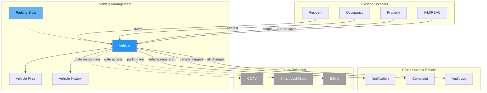

### 1.4 Domain Classification

| Aspek | Klasifikasi |
|---|---|
| **Domain type** | Supporting Domain |
| **Bounded context** | `VehicleContext` |
| **Module ownership** | Vehicle (vehicles, parking, vehicle files, vehicle history) |
| **Multi-property** | Wajib — `property_id` pada semua entities |
| **Data sensitivity** | Medium — plat nomor adalah identifiable data |

---

## 2. Vehicle Lifecycle

### 2.1 Gambaran Umum

Kendaraan penghuni memiliki siklus hidup yang terikat dengan **masa tinggal penghuni** (occupancy). Saat penghuni check-in, kendaraan didaftarkan. Saat penghuni check-out, kendaraan otomatis menjadi tidak aktif.

### 2.2 State Diagram

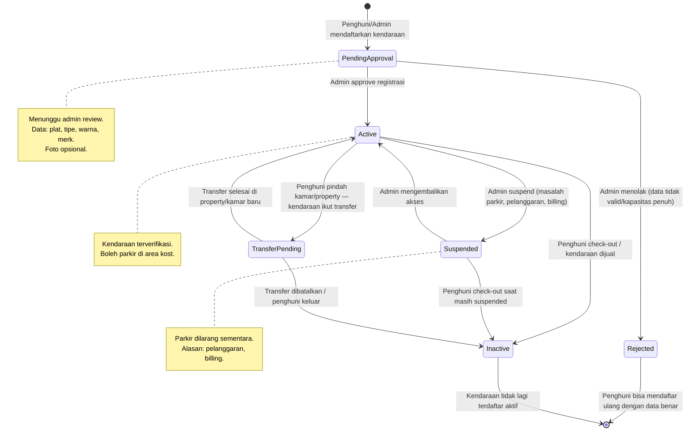

### 2.3 Detail Status Vehicle

| Status | Kode | Keterangan | Transisi Valid |
|---|---|---|---|
| **Pending Approval** | `pending_approval` | Kendaraan baru didaftarkan, menunggu review admin | → `active`, → `rejected` |
| **Active** | `active` | Kendaraan terverifikasi dan boleh parkir | → `suspended`, → `transfer_pending`, → `inactive` |
| **Rejected** | `rejected` | Admin menolak registrasi | Terminal (bisa daftar ulang sebagai entry baru) |
| **Suspended** | `suspended` | Akses parkir dicabut sementara | → `active`, → `inactive` |
| **Transfer Pending** | `transfer_pending` | Kendaraan dalam proses transfer (pindah kamar/property) | → `active`, → `inactive` |
| **Inactive** | `inactive` | Kendaraan tidak lagi terdaftar aktif | Terminal |

### 2.4 Business Rules Vehicle Lifecycle

| # | Rule | Keterangan |
|---|---|---|
| BR-VEH-01 | Kendaraan hanya boleh didaftarkan oleh penghuni dengan occupancy aktif atau oleh admin | Validasi active occupancy |
| BR-VEH-02 | Satu plat nomor unik per property pada saat tertentu | Tidak boleh ada dua kendaraan aktif dengan plat sama di property yang sama |
| BR-VEH-03 | Kendaraan otomatis → `inactive` ketika occupancy berakhir (checkout) | Triggered oleh domain event `occupancy.ended` |
| BR-VEH-04 | Kendaraan `rejected` tidak menghapus data — menyimpan audit trail | Penghuni bisa submit ulang |
| BR-VEH-05 | Perubahan data kendaraan oleh penghuni memerlukan approval admin | Kecuali perubahan minor (catatan/notes) |
| BR-VEH-06 | Admin dapat mendaftarkan kendaraan atas nama penghuni | Untuk kasus walk-in atau registrasi manual |
| BR-VEH-07 | Kendaraan yang `suspended` tidak boleh digunakan untuk complaint parking | Status harus clear dulu |

---

## 3. Resident ↔ Vehicle Relationship

### 3.1 Relationship Diagram

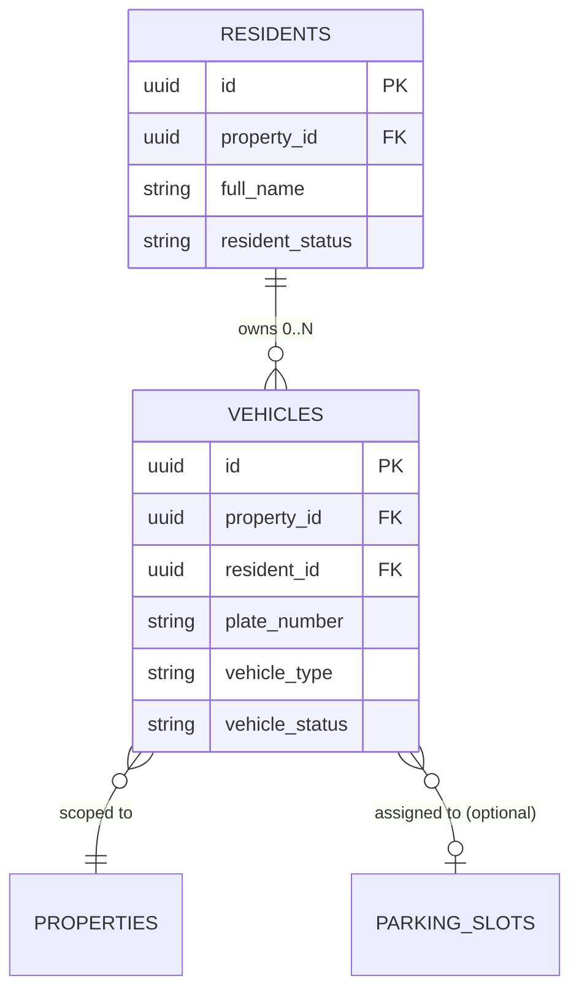

### 3.2 Cardinality Rules

| Relationship | Cardinality | Keterangan |
|---|---|---|
| Resident → Vehicle | 1 : 0..N | Satu penghuni bisa punya 0, 1, atau banyak kendaraan |
| Vehicle → Resident | N : 1 | Setiap kendaraan dimiliki tepat satu penghuni |
| Vehicle → Property | N : 1 | Setiap kendaraan terdaftar di satu property |
| Vehicle → Parking Slot | N : 0..1 | Kendaraan bisa punya atau tidak punya slot (opsional) |

### 3.3 Contoh Skenario

| Penghuni | Kendaraan 1 | Kendaraan 2 | Kendaraan 3 |
|---|---|---|---|
| Andi (Kamar 101) | Honda Vario, B 1234 ABC | — | — |
| Budi (Kamar 205) | Yamaha NMAX, B 5678 DEF | Toyota Avanza, B 9012 GHI | — |
| Citra (Kamar 312) | — (tanpa kendaraan) | — | — |
| Dewi (Kamar 401) | Honda Beat, B 3456 JKL | Honda PCX, B 7890 MNO | Honda Brio, B 1234 PQR |

### 3.4 Batas Kendaraan per Penghuni

| Aspek | Rekomendasi |
|---|---|
| Maximum kendaraan per penghuni | **Configurable per property** — default 3 |
| Dimana disimpan | `property_settings.max_vehicles_per_resident` |
| Alasan | RuKost kecil mungkin limit 1; ApartKost besar bisa allow 3+ |

---

## 4. Occupancy ↔ Vehicle Relationship

### 4.1 Gambaran Umum

Vehicle terikat pada **occupancy context** penghuni. Ketika occupancy berakhir, kendaraan harus ditangani.

### 4.2 Lifecycle Events yang Mempengaruhi Vehicle

| Event | Impact pada Vehicle | Aksi Otomatis |
|---|---|---|
| **Check-in** | Admin bisa mendaftarkan kendaraan saat onboarding | Prompt registrasi kendaraan |
| **Room transfer (same property)** | Kendaraan tetap aktif; parking slot mungkin berubah | Update `parking_slot_id` jika applicable |
| **Property transfer** | Kendaraan → `transfer_pending`; perlu re-register di property baru | Admin property baru harus approve |
| **Check-out** | Semua kendaraan penghuni → `inactive` | Auto-deactivation; parking slot freed |
| **Occupancy expired (not renewed)** | Sama dengan check-out | Auto-deactivation setelah grace period |

### 4.3 Sequence Diagram — Check-out Impact

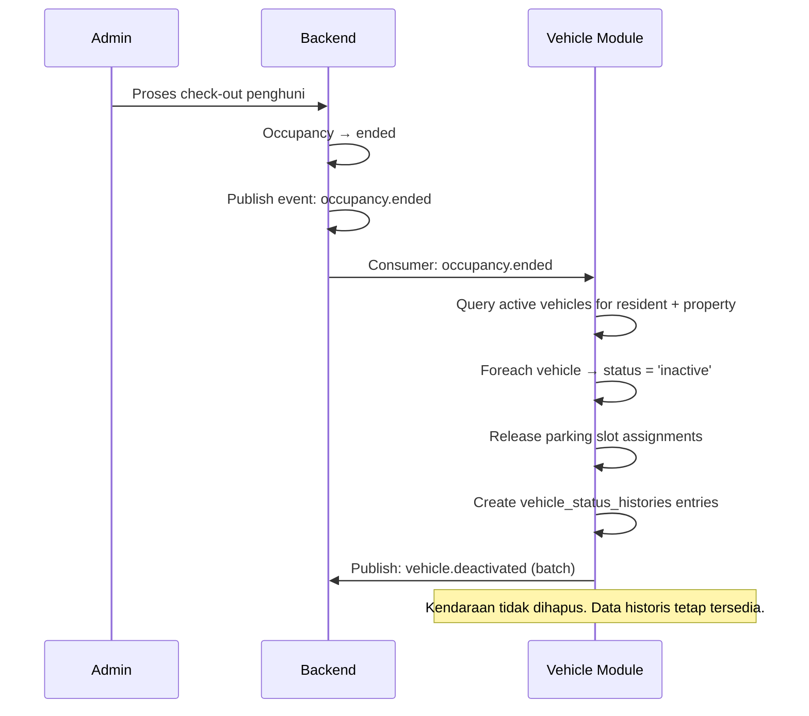

---

## 5. Vehicle Registration Flow

### 5.1 Flow Diagram — Penghuni Mendaftarkan Kendaraan

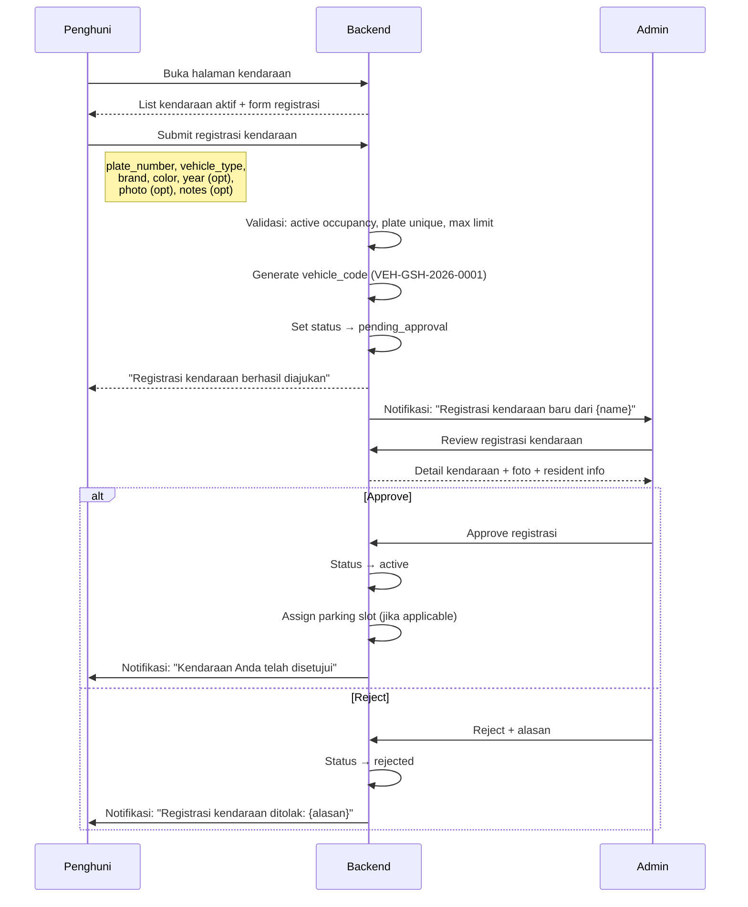

### 5.2 Flow Diagram — Admin Mendaftarkan Kendaraan (Manual)

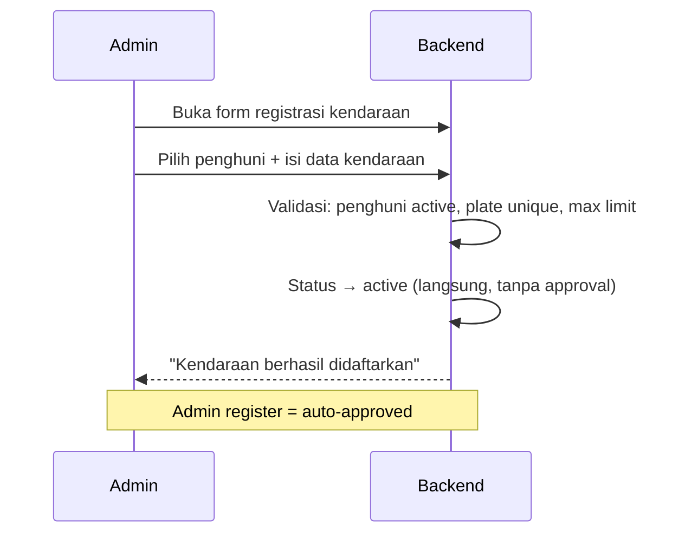

### 5.3 Registration Business Rules

| # | Rule | Keterangan |
|---|---|---|
| BR-REG-01 | Plat nomor wajib diisi | Format validasi ringan (belum strict regex) |
| BR-REG-02 | Vehicle type wajib dipilih | `motorcycle`, `car`, `bicycle`, `electric_scooter`, `other` |
| BR-REG-03 | Brand dan color wajib diisi | Identifikasi visual minimum |
| BR-REG-04 | Foto kendaraan opsional tapi direkomendasikan | Mempermudah identifikasi visual |
| BR-REG-05 | Plat nomor unique per property (active status only) | Partial unique index |
| BR-REG-06 | Penghuni hanya bisa daftar jika belum mencapai max limit | `property_settings.max_vehicles_per_resident` |
| BR-REG-07 | Admin register = auto-approved | Tidak perlu flow approval |
| BR-REG-08 | Penghuni register = pending_approval | Memerlukan review admin |

---

## 6. Vehicle Approval Flow

### 6.1 State Diagram — Approval

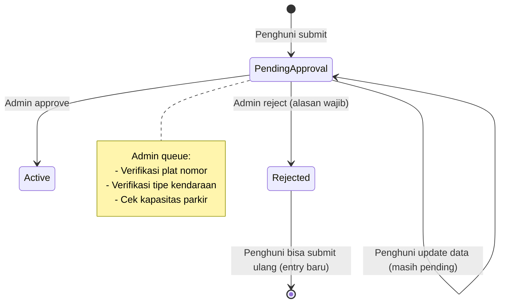

### 6.2 Approval Business Rules

| # | Rule | Keterangan |
|---|---|---|
| BR-APR-01 | Admin wajib memberikan alasan saat reject | Audit trail + feedback ke penghuni |
| BR-APR-02 | Penghuni boleh update data selama masih `pending_approval` | Koreksi plat salah ketik, dll |
| BR-APR-03 | Perubahan data kendaraan `active` oleh penghuni → kembali ke `pending_approval` | Kecuali field `notes` |
| BR-APR-04 | Admin bisa langsung edit data kendaraan tanpa approval flow | Admin trusted |
| BR-APR-05 | Approval queue di-sort by `created_at ASC` | FIFO |

### 6.3 Data Change Approval

| Field | Penghuni Ubah → Perlu Approval? | Admin Ubah → Langsung? |
|---|---|---|
| `plate_number` | ✅ Ya → pending_approval | ✅ Langsung |
| `vehicle_type` | ✅ Ya → pending_approval | ✅ Langsung |
| `brand` | ✅ Ya → pending_approval | ✅ Langsung |
| `color` | ✅ Ya → pending_approval | ✅ Langsung |
| `year` | ✅ Ya → pending_approval | ✅ Langsung |
| `notes` | ❌ Tidak (langsung) | ✅ Langsung |
| `photo` | ✅ Ya → pending_approval | ✅ Langsung |

---

## 7. Vehicle Status Strategy

### 7.1 Status Values

| Status | Kode DB | Keterangan | Siapa Trigger |
|---|---|---|---|
| **Pending Approval** | `pending_approval` | Menunggu review admin | Penghuni submit / Penghuni update data |
| **Active** | `active` | Kendaraan terverifikasi, boleh parkir | Admin approve |
| **Rejected** | `rejected` | Registrasi ditolak | Admin reject |
| **Suspended** | `suspended` | Akses parkir dicabut sementara | Admin (alasan wajib) |
| **Transfer Pending** | `transfer_pending` | Sedang proses transfer property | System (property transfer event) |
| **Inactive** | `inactive` | Tidak lagi terdaftar aktif | System (checkout) / Admin manual |

### 7.2 Valid Status Transitions

| Dari | Ke | Trigger | Siapa |
|---|---|---|---|
| — | `pending_approval` | Penghuni submit registrasi | Penghuni |
| — | `active` | Admin register manual | Admin |
| `pending_approval` | `active` | Admin approve | Admin |
| `pending_approval` | `rejected` | Admin reject | Admin |
| `active` | `suspended` | Admin suspend (pelanggaran, billing) | Admin |
| `active` | `transfer_pending` | Penghuni transfer property | System |
| `active` | `inactive` | Check-out / Admin deactivate | System / Admin |
| `suspended` | `active` | Admin reinstate | Admin |
| `suspended` | `inactive` | Check-out saat suspended | System |
| `transfer_pending` | `active` | Transfer selesai | Admin (property baru) |
| `transfer_pending` | `inactive` | Transfer dibatalkan | Admin |

### 7.3 Transisi yang Dilarang

| Dari | Ke | Alasan |
|---|---|---|
| `rejected` | `active` | Harus submit ulang sebagai entry baru |
| `inactive` | `active` | Harus register ulang |
| `rejected` | any | Terminal — submit baru |
| `inactive` | any (kecuali re-register) | Terminal |

---

## 8. Parking Slot Strategy

### 8.1 Analisis: Parking Slot Wajib vs Opsional

| Aspek | Slot Wajib (Opsi A) | Slot Opsional per Property (Opsi B) |
|---|---|---|
| **Cocok untuk** | ApartKost dengan basement terstruktur | Semua tipe — flexible |
| **RuKost reality** | ❌ Tidak sesuai — kebanyakan area bersama | ✅ Bisa disable slot |
| **ApartKost reality** | ✅ Sesuai jika terstruktur | ✅ Bisa enable slot |
| **Implementation cost** | Tinggi — slot management wajib | Rendah — slot opsional |
| **Data complexity** | Slot entity wajib ada | Slot entity ada hanya jika dipakai |
| **User experience** | Membebani RuKost kecil | Fleksibel |
| **Indonesia context** | ❌ Majority kost tanpa slot bernomor | ✅ Akomodasi realitas lapangan |

### 8.2 Rekomendasi: **Opsi B — Parking Slot Opsional per Property**

```
property_settings.parking_management_mode:
  ├── 'unmanaged'  → Tidak ada slot, hanya data kendaraan (default)
  ├── 'zone'       → Area parkir zona (Motor Area A, Mobil Area B)
  └── 'slot'       → Slot bernomor per kendaraan
```

### 8.3 Detail per Mode

#### Mode: `unmanaged` (Default — Cocok RuKost)

```
┌──────────────────────────────────────────┐
│           AREA PARKIR BERSAMA             │
│                                           │
│   🏍️ 🏍️ 🏍️ 🏍️ 🏍️ 🏍️ 🏍️ 🏍️ 🏍️ 🏍️    │
│   🏍️ 🏍️ 🏍️ 🏍️ 🏍️ 🚗  🚗              │
│                                           │
│  Tidak ada slot assignment.               │
│  Kendaraan hanya tercatat datanya.        │
│  parking_slots table TIDAK dipakai.       │
└──────────────────────────────────────────┘
```

- Tidak ada `parking_slots` entries untuk property ini
- Vehicle hanya punya data identitas (plat, tipe, warna)
- Admin bisa melihat total kendaraan terdaftar vs estimasi kapasitas

#### Mode: `zone` (Cocok RuKost/ApartKost menengah)

```
┌──────────────────────────────────────────┐
│  ZONA A — Motor       │  ZONA B — Mobil  │
│  Kapasitas: 50        │  Kapasitas: 10   │
│                        │                  │
│  🏍️ 🏍️ 🏍️ 🏍️ 🏍️    │  🚗 🚗  🚗      │
│  🏍️ 🏍️ 🏍️ 🏍️ 🏍️    │  🚗 🚗           │
│  ...                   │                  │
│  Assigned: 35          │  Assigned: 5     │
│  Available: 15         │  Available: 5    │
└──────────────────────────────────────────┘
```

- `parking_slots` entries dibuat per zona (bukan per nomor)
- Vehicle di-assign ke zona, bukan ke slot spesifik
- Kapasitas per zona di-track

#### Mode: `slot` (Cocok ApartKost terstruktur)

```
┌──────────────────────────────────────────┐
│  BASEMENT LEVEL 1                         │
│                                           │
│  [M-01] 🏍️  [M-02] 🏍️  [M-03] —       │
│  [M-04] 🏍️  [M-05] —   [M-06] 🏍️      │
│                                           │
│  [C-01] 🚗  [C-02] —   [C-03] 🚗       │
│  [C-04] —   [C-05] —   [C-06] —         │
│                                           │
│  Assigned: 6/12    Available: 6/12        │
└──────────────────────────────────────────┘
```

- `parking_slots` entries dibuat per nomor slot
- Vehicle di-assign ke slot spesifik
- Visual slot map di admin dashboard

### 8.4 Parking Slot Entity (Opsional)

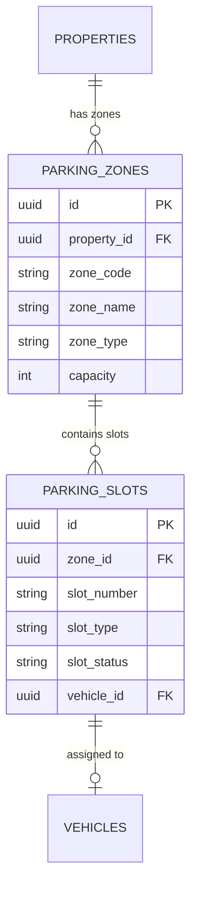

---

## 9. Parking Capacity Strategy

### 9.1 Capacity Tracking per Mode

| Mode | Capacity Tracking | Enforcement |
|---|---|---|
| `unmanaged` | `property_settings.parking_capacity_motorcycle` + `parking_capacity_car` | Soft warning — admin notified saat mendekati kapasitas |
| `zone` | `parking_zones.capacity` per zona | Soft or hard limit per zona |
| `slot` | Count `parking_slots` per zone | Hard limit — slot penuh = tidak bisa assign |

### 9.2 Capacity Rules

| # | Rule | Keterangan |
|---|---|---|
| BR-CAP-01 | Kapasitas parkir bersifat **soft limit** pada mode `unmanaged` | Admin tetap bisa approve kendaraan melebihi estimasi |
| BR-CAP-02 | Kapasitas per zona adalah **configurable** | Admin bisa update kapasitas |
| BR-CAP-03 | Kapasitas per slot adalah **hard limit** | Slot occupied = tidak bisa assign |
| BR-CAP-04 | Dashboard menampilkan utilization rate | Total kendaraan aktif vs kapasitas |
| BR-CAP-05 | Warning threshold default: 80% | Notifikasi ke admin saat kapasitas ≥ 80% |

### 9.3 Property Settings untuk Parking

| Setting | Tipe | Default | Keterangan |
|---|---|---|---|
| `parking_management_mode` | TEXT | `'unmanaged'` | Mode parkir property |
| `max_vehicles_per_resident` | INT | `3` | Batas kendaraan per penghuni |
| `parking_capacity_motorcycle` | INT | NULL | Estimasi kapasitas motor (mode unmanaged) |
| `parking_capacity_car` | INT | NULL | Estimasi kapasitas mobil (mode unmanaged) |
| `parking_requires_approval` | BOOLEAN | `true` | Registrasi kendaraan perlu approval? |

---

## 10. Visitor Vehicle Strategy

### 10.1 Gambaran Umum

Kendaraan tamu/pengunjung perlu dicatat untuk keamanan. Visitor vehicle bersifat **temporary** dan tidak terikat pada penghuni sebagai owner.

### 10.2 Visitor Vehicle Model

| Aspek | Detail |
|---|---|
| **Entity** | `visitor_vehicles` (tabel terpisah dari `vehicles`) |
| **Data** | plate_number, vehicle_type, visitor_name, purpose, host_resident_id |
| **Lifecycle** | `checked_in` → `checked_out` |
| **Retention** | Data disimpan untuk audit; purge setelah 90 hari (configurable) |
| **Phase** | **Phase 2** — fokus Phase 1 pada kendaraan penghuni |

### 10.3 Alasan Defer ke Phase 2

| Faktor | Justifikasi |
|---|---|
| Kompleksitas | Visitor vehicle memerlukan check-in/check-out flow + security guard role |
| Volume | Visitor parking biasanya rendah di kost (bukan apartment umum) |
| Priority | Data kendaraan penghuni lebih kritis untuk keamanan |
| Guard role | Belum ada role security guard di RBAC |

### 10.4 Phase 2 Visitor Vehicle Flow (Preview)

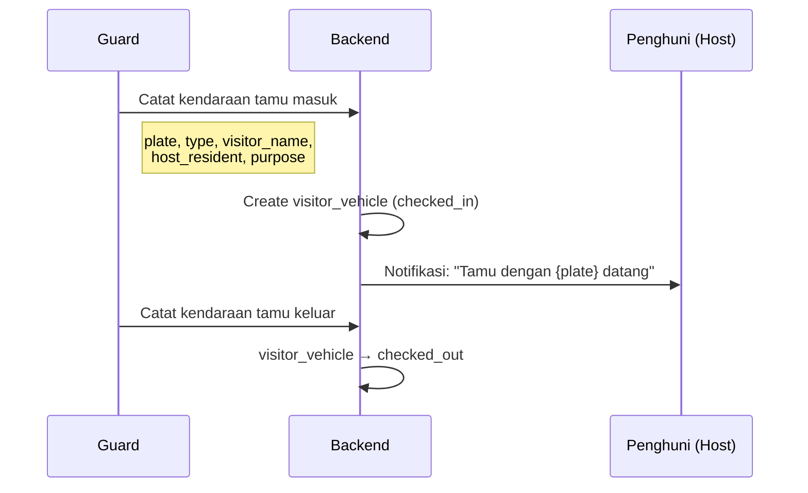

---

## 11. Vehicle Document Strategy

### 11.1 Dokumen Kendaraan

| Dokumen | Wajib? | Keterangan |
|---|---|---|
| **Foto kendaraan** | Opsional (recommended) | Identifikasi visual; min 1 foto |
| **STNK** | Opsional Phase 1 | Verifikasi kepemilikan; sensitive document |
| **SIM** | ❌ Tidak perlu | Bukan domain kost |
| **BPKB** | ❌ Tidak perlu | Berlebihan untuk kost |

### 11.2 File Strategy

```
vehicle_files (pola sama dengan complaint_files)
  ├── vehicle_id    → vehicles (formal FK)
  ├── file_id       → files (logical FK — TD-004)
  ├── file_purpose  → 'vehicle_photo' | 'stnk' | 'other'
  └── uploaded_by_user_id → users
```

### 11.3 Business Rules Dokumen

| # | Rule | Keterangan |
|---|---|---|
| BR-DOC-01 | Foto kendaraan opsional tapi direkomendasikan saat registrasi | UI guidance |
| BR-DOC-02 | STNK opsional Phase 1; bisa diwajibkan Phase 2 via setting | `property_settings.require_stnk` |
| BR-DOC-03 | File upload max 3 file × 5 MB per kendaraan | Konsisten dengan complaint file rules |
| BR-DOC-04 | File access mengikuti pola signed URL / backend streaming | Tidak expose raw object key |
| BR-DOC-05 | STNK adalah data sensitif — akses harus di-audit | `file_access_logs` |

---

## 12. Property Owner Visibility

### 12.1 Prinsip

Konsisten dengan domain lain — Property Owner (`property_investor`) memiliki akses **read-only aggregate** ke data kendaraan property miliknya.

### 12.2 Data yang Terlihat

| Data | Level Detail |
|---|---|
| **Total kendaraan terdaftar** | Count per vehicle_type (aggregate) |
| **Parking utilization** | % kapasitas terpakai (aggregate) |
| **Status distribution** | Count per status (aggregate) |

### 12.3 Data yang TIDAK Terlihat

| Data | Alasan |
|---|---|
| Detail kendaraan per penghuni | PII — plat nomor linked to individual |
| Plat nomor individual | PII |
| Foto kendaraan | Operational detail |
| STNK | Sensitive document |
| Visitor vehicle log | Operational detail |
| Vehicle approval queue | Internal operation |

---

## 13. RBAC Matrix

### 13.1 Matrix Lengkap

| Operation | `owner` | `manager` | `admin` | `technician` | `resident` | `property_owner` |
|---|:---:|:---:|:---:|:---:|:---:|:---:|
| **Vehicle** | | | | | | |
| View all vehicles | ✅ | ✅ | ✅ | ❌ | ❌ | ❌ |
| View own vehicles | — | — | — | ❌ | ✅ | ❌ |
| View vehicle aggregate | ✅ | ✅ | ✅ | ❌ | ❌ | ✅ (summary) |
| Register vehicle (admin) | ✅ | ✅ | ✅ | ❌ | ❌ | ❌ |
| Register vehicle (self) | — | — | — | ❌ | ✅ | ❌ |
| Approve/reject vehicle | ✅ | ✅ | ✅ | ❌ | ❌ | ❌ |
| Update vehicle (admin) | ✅ | ✅ | ✅ | ❌ | ❌ | ❌ |
| Update own vehicle | — | — | — | ❌ | ✅ (→ pending) | ❌ |
| Suspend vehicle | ✅ | ✅ | ✅ | ❌ | ❌ | ❌ |
| Deactivate vehicle | ✅ | ✅ | ✅ | ❌ | ❌ | ❌ |
| Upload vehicle photo (admin) | ✅ | ✅ | ✅ | ❌ | ❌ | ❌ |
| Upload vehicle photo (self) | — | — | — | ❌ | ✅ (own) | ❌ |
| **Parking Management** | | | | | | |
| Manage parking zones/slots | ✅ | ✅ | ✅ | ❌ | ❌ | ❌ |
| Assign parking slot | ✅ | ✅ | ✅ | ❌ | ❌ | ❌ |
| View parking map | ✅ | ✅ | ✅ | ❌ | ❌ | ❌ |
| **Reporting** | | | | | | |
| Vehicle report (full) | ✅ | ✅ | ✅ | ❌ | ❌ | ❌ |
| Vehicle summary (owner) | ✅ | ✅ | ✅ | ❌ | ❌ | ✅ |

### 13.2 Permission Codes

| Permission Code | Deskripsi |
|---|---|
| `vehicle.view` | Melihat vehicle list, detail |
| `vehicle.manage` | Register/approve/update/suspend/deactivate |
| `vehicle.self.register` | Penghuni mendaftarkan kendaraan sendiri |
| `vehicle.self.view` | Penghuni melihat kendaraan miliknya |
| `vehicle.self.update` | Penghuni update data kendaraan (→ pending) |
| `parking.manage` | Kelola zones, slots, assignment |
| `vehicle.export` | Export data kendaraan |

### 13.3 Phase 1 RBAC Strategy

Konsisten dengan complaint module — Phase 1 menggunakan coarse permissions:
- `vehicle.manage` — sudah cukup untuk staff
- `vehicle.self.*` — enforce di application level (resident self-scope)
- Fine-grained permissions di Phase 2

---

## 14. Audit Requirements

### 14.1 Audited Operations

| # | Operation | Audit Level | Data yang Dicatat |
|---|---|---|---|
| AUD-VEH-01 | **Vehicle registered** | Required | vehicle_id, resident_id, plate_number, vehicle_type, registrar |
| AUD-VEH-02 | **Vehicle approved** | Required | vehicle_id, approver |
| AUD-VEH-03 | **Vehicle rejected** | Required | vehicle_id, rejector, reject_reason |
| AUD-VEH-04 | **Vehicle data updated** | Required | vehicle_id, before_data, after_data, actor |
| AUD-VEH-05 | **Vehicle suspended** | Required | vehicle_id, suspend_reason, actor |
| AUD-VEH-06 | **Vehicle reactivated** | Required | vehicle_id, actor |
| AUD-VEH-07 | **Vehicle deactivated** | Required | vehicle_id, deactivation_reason, actor |
| AUD-VEH-08 | **Vehicle photo uploaded** | Required | vehicle_id, file_id, uploader |
| AUD-VEH-09 | **Parking slot assigned** | Required | vehicle_id, slot_id, actor |
| AUD-VEH-10 | **Parking slot released** | Required | vehicle_id, slot_id, actor |
| AUD-VEH-11 | **Vehicle auto-deactivated (checkout)** | Required | vehicle_id, occupancy_id, trigger |
| AUD-VEH-12 | **Property owner reads vehicle summary** | Required | property_id, actor |

### 14.2 Dual-Layer Audit (Konsisten dengan Complaint)

| Layer | Tabel | Tujuan |
|---|---|---|
| **Domain-specific** | `vehicle_status_histories` | Timeline per kendaraan untuk UI |
| **Generic** | `audit_logs` (existing) | Cross-cutting audit |

### 14.3 PII Protection

| Data | Perlakuan |
|---|---|
| Plate number | Boleh di-log — bukan PII sensitif (visible di jalan) |
| Resident name | Boleh di-log sebagai referensi |
| STNK content | **Tidak boleh** di-log — hanya file_id reference |
| KTP number | **Tidak boleh** di-log dalam vehicle audit |

---

## 15. Database Entities

### 15.1 Entity Relationship Diagram

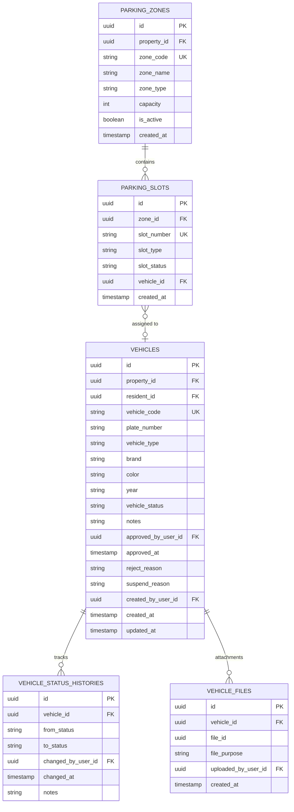

### 15.2 Table Details

#### 15.2.1 `vehicles`

| Kolom | Tipe | Constraint | Keterangan |
|---|---|---|---|
| `id` | UUID | PK, DEFAULT gen_random_uuid() | |
| `property_id` | UUID | NOT NULL, FK → properties | Multi-property scope |
| `resident_id` | UUID | NOT NULL, FK → residents | Pemilik kendaraan |
| `vehicle_code` | TEXT | NOT NULL | Format: `VEH-{PROP_CODE}-{YYYY}-{NNNN}` |
| `plate_number` | TEXT | NOT NULL | Nomor plat kendaraan |
| `vehicle_type` | TEXT | NOT NULL | CHECK: motorcycle, car, bicycle, electric_scooter, other |
| `brand` | TEXT | NOT NULL | Merk kendaraan (Honda, Yamaha, Toyota, dll) |
| `color` | TEXT | NOT NULL | Warna kendaraan |
| `year` | TEXT | | Tahun pembuatan (opsional) |
| `vehicle_status` | TEXT | NOT NULL, DEFAULT 'pending_approval' | Status lifecycle |
| `notes` | TEXT | | Catatan tambahan |
| `approved_by_user_id` | UUID | FK → users | Admin yang approve |
| `approved_at` | TIMESTAMPTZ | | Waktu approve |
| `reject_reason` | TEXT | | Alasan reject |
| `suspend_reason` | TEXT | | Alasan suspend |
| `deactivation_reason` | TEXT | | Alasan deactivation |
| `deactivated_at` | TIMESTAMPTZ | | Waktu deactivation |
| `snapshot_resident_name` | TEXT | NOT NULL | Nama penghuni saat register (snapshot) |
| `snapshot_room_number` | TEXT | | Room number saat register |
| `created_by_user_id` | UUID | NOT NULL, FK → users | Penghuni sendiri atau admin |
| `created_at` | TIMESTAMPTZ | NOT NULL, DEFAULT now() | |
| `updated_at` | TIMESTAMPTZ | NOT NULL, DEFAULT now() | |

**Constraints**:
- `CHECK (vehicle_type IN ('motorcycle', 'car', 'bicycle', 'electric_scooter', 'other'))`
- `CHECK (vehicle_status IN ('pending_approval', 'active', 'rejected', 'suspended', 'transfer_pending', 'inactive'))`
- `UNIQUE (property_id, vehicle_code)`
- Partial unique: `UNIQUE (property_id, plate_number) WHERE vehicle_status IN ('pending_approval', 'active', 'suspended', 'transfer_pending')` — plat unik hanya untuk kendaraan non-terminal

#### 15.2.2 `vehicle_status_histories`

| Kolom | Tipe | Constraint | Keterangan |
|---|---|---|---|
| `id` | UUID | PK | |
| `vehicle_id` | UUID | NOT NULL, FK → vehicles (CASCADE) | |
| `from_status` | TEXT | | Null untuk initial |
| `to_status` | TEXT | NOT NULL | Status baru |
| `changed_by_user_id` | UUID | FK → users (SET NULL) | Null untuk system trigger |
| `changed_at` | TIMESTAMPTZ | NOT NULL, DEFAULT now() | |
| `notes` | TEXT | | Alasan/context |

#### 15.2.3 `vehicle_files`

| Kolom | Tipe | Constraint | Keterangan |
|---|---|---|---|
| `id` | UUID | PK | |
| `vehicle_id` | UUID | NOT NULL, FK → vehicles (CASCADE) | |
| `file_id` | UUID | NOT NULL | Logical FK (TD-004) |
| `file_purpose` | TEXT | NOT NULL, CHECK IN ('vehicle_photo', 'stnk', 'other') | |
| `uploaded_by_user_id` | UUID | FK → users (SET NULL) | |
| `created_at` | TIMESTAMPTZ | NOT NULL, DEFAULT now() | |

**Constraints**: `UNIQUE (vehicle_id, file_id)`

#### 15.2.4 `parking_zones` (Opsional — mode `zone` atau `slot`)

| Kolom | Tipe | Constraint | Keterangan |
|---|---|---|---|
| `id` | UUID | PK | |
| `property_id` | UUID | NOT NULL, FK → properties | |
| `zone_code` | TEXT | NOT NULL | Kode zona: "M-A", "C-B1" |
| `zone_name` | TEXT | NOT NULL | Nama zona: "Motor Area A", "Mobil Basement 1" |
| `zone_type` | TEXT | NOT NULL, CHECK IN ('motorcycle', 'car', 'mixed') | |
| `capacity` | INTEGER | NOT NULL, DEFAULT 0 | Max kendaraan di zona |
| `location_description` | TEXT | | Deskripsi lokasi zona |
| `is_active` | BOOLEAN | NOT NULL, DEFAULT true | |
| `sort_order` | INTEGER | NOT NULL, DEFAULT 0 | |
| `created_at` | TIMESTAMPTZ | NOT NULL, DEFAULT now() | |
| `updated_at` | TIMESTAMPTZ | NOT NULL, DEFAULT now() | |

**Constraints**: `UNIQUE (property_id, zone_code)`

#### 15.2.5 `parking_slots` (Opsional — mode `slot` only)

| Kolom | Tipe | Constraint | Keterangan |
|---|---|---|---|
| `id` | UUID | PK | |
| `zone_id` | UUID | NOT NULL, FK → parking_zones (CASCADE) | |
| `slot_number` | TEXT | NOT NULL | Nomor slot: "M-01", "C-03" |
| `slot_type` | TEXT | NOT NULL, CHECK IN ('motorcycle', 'car') | |
| `slot_status` | TEXT | NOT NULL, DEFAULT 'available' | CHECK: available, occupied, reserved, maintenance |
| `vehicle_id` | UUID | FK → vehicles (SET NULL) | Kendaraan yang menempati |
| `created_at` | TIMESTAMPTZ | NOT NULL, DEFAULT now() | |
| `updated_at` | TIMESTAMPTZ | NOT NULL, DEFAULT now() | |

**Constraints**: `UNIQUE (zone_id, slot_number)`

### 15.3 Index Strategy

| # | Tabel | Index | Kolom | Query Pattern |
|---|---|---|---|---|
| 1 | `vehicles` | `idx_veh_admin_list` | `(property_id, vehicle_status, created_at DESC)` | Admin: list kendaraan per property |
| 2 | `vehicles` | `idx_veh_resident` | `(resident_id, vehicle_status)` | Penghuni: kendaraan miliknya |
| 3 | `vehicles` | `idx_veh_plate_active` | `UNIQUE (property_id, plate_number) WHERE vehicle_status IN ('pending_approval','active','suspended','transfer_pending')` | Plat unik per property (active only) |
| 4 | `vehicles` | `idx_veh_approval_queue` | `(property_id, vehicle_status, created_at ASC) WHERE vehicle_status = 'pending_approval'` | Admin: approval queue |
| 5 | `vehicle_status_histories` | `idx_vsh_vehicle_timeline` | `(vehicle_id, changed_at ASC)` | Timeline per kendaraan |
| 6 | `vehicle_files` | `idx_vf_vehicle` | `(vehicle_id)` | File list per kendaraan |
| 7 | `parking_zones` | `idx_pz_property` | `(property_id, is_active, sort_order)` | Admin: list zona aktif |
| 8 | `parking_slots` | `idx_ps_zone_status` | `(zone_id, slot_status)` | Admin: slot per zona |
| 9 | `parking_slots` | `idx_ps_vehicle` | `(vehicle_id) WHERE vehicle_id IS NOT NULL` | Lookup slot by vehicle |

---

## 16. API Recommendation

### 16.1 Vehicle API (Admin)

| Method | Endpoint | Tujuan | Roles | Audit |
|---|---|---|---|---|
| GET | `/api/v1/vehicles` | List kendaraan + filter property/status/type | owner, manager, admin | Optional |
| POST | `/api/v1/vehicles` | Register kendaraan (admin = auto-approve) | owner, manager, admin | Required |
| GET | `/api/v1/vehicles/{id}` | Detail kendaraan + timeline + files | owner, manager, admin | Optional |
| PATCH | `/api/v1/vehicles/{id}` | Update data kendaraan | owner, manager, admin | Required |
| POST | `/api/v1/vehicles/{id}/approve` | Approve registrasi | owner, manager, admin | Required |
| POST | `/api/v1/vehicles/{id}/reject` | Reject registrasi + alasan | owner, manager, admin | Required |
| POST | `/api/v1/vehicles/{id}/suspend` | Suspend kendaraan + alasan | owner, manager, admin | Required |
| POST | `/api/v1/vehicles/{id}/reactivate` | Reactivate kendaraan suspended | owner, manager, admin | Required |
| POST | `/api/v1/vehicles/{id}/deactivate` | Deactivate kendaraan | owner, manager, admin | Required |
| POST | `/api/v1/vehicles/{id}/files` | Upload foto/dokumen kendaraan | owner, manager, admin | Required |

### 16.2 Penghuni Vehicle API

| Method | Endpoint | Tujuan | Roles | Audit |
|---|---|---|---|---|
| GET | `/api/v1/penghuni/vehicles` | List kendaraan milik sendiri | resident | None |
| POST | `/api/v1/penghuni/vehicles` | Register kendaraan (→ pending_approval) | resident | Required |
| GET | `/api/v1/penghuni/vehicles/{id}` | Detail kendaraan milik sendiri | resident | None |
| PATCH | `/api/v1/penghuni/vehicles/{id}` | Update data (→ pending jika sensitive field) | resident | Required |
| POST | `/api/v1/penghuni/vehicles/{id}/files` | Upload foto kendaraan | resident | Required |

### 16.3 Parking Management API (Admin)

| Method | Endpoint | Tujuan | Roles | Audit |
|---|---|---|---|---|
| GET | `/api/v1/parking/zones` | List parking zones | owner, manager, admin | None |
| POST | `/api/v1/parking/zones` | Create parking zone | owner, manager, admin | Required |
| PATCH | `/api/v1/parking/zones/{id}` | Update zona | owner, manager, admin | Required |
| GET | `/api/v1/parking/zones/{id}/slots` | List slots per zona | owner, manager, admin | None |
| POST | `/api/v1/parking/zones/{id}/slots` | Create parking slot | owner, manager, admin | Required |
| POST | `/api/v1/parking/slots/{id}/assign` | Assign vehicle ke slot | owner, manager, admin | Required |
| POST | `/api/v1/parking/slots/{id}/release` | Release slot | owner, manager, admin | Required |
| GET | `/api/v1/parking/overview` | Overview parkir (utilization, map) | owner, manager, admin | None |

### 16.4 Property Owner Vehicle API

| Method | Endpoint | Tujuan | Roles | Audit |
|---|---|---|---|---|
| GET | `/api/v1/property-owner/properties/{id}/vehicle-summary` | Ringkasan kendaraan (aggregate) | property_owner | Required |

---

## 17. Reporting Recommendation

### 17.1 Dashboard Metrics

| Metric | Sumber | Visualisasi |
|---|---|---|
| **Total kendaraan aktif** | `vehicles WHERE status = 'active'` | Stat card |
| **Breakdown per tipe** | `GROUP BY vehicle_type` | Pie/donut chart |
| **Parking utilization** | Active vehicles vs capacity | Progress bar |
| **Pending approvals** | `vehicles WHERE status = 'pending_approval'` | Badge count |
| **Recent registrations** | Last 7 days | Mini list |

### 17.2 Report Endpoints

| Report | Data | Phase |
|---|---|---|
| Vehicle registry report | Full list per property + filter by status/type | Phase 1 |
| Parking utilization report | Capacity vs actual per zona | Phase 1 (mode zone/slot) |
| Vehicle history per resident | Registration, approval, deactivation timeline | Phase 1 |
| Visitor vehicle log | Check-in/check-out tamu | Phase 2 |

---

## 18. Risks & Edge Cases

### 18.1 High Risk

| # | Risk | Dampak | Mitigasi |
|---|---|---|---|
| EC-VEH-01 | **Plat nomor duplikat** — penghuni daftar plat yang sama | Data collision | Partial unique index per property (active only) |
| EC-VEH-02 | **Checkout tanpa deactivation** — kendaraan tetap aktif setelah checkout | Ghost vehicles in system | Domain event `occupancy.ended` → auto-deactivate |
| EC-VEH-03 | **Transfer property** — kendaraan harus pindah registrasi | Data inconsistency | `transfer_pending` status + re-approval di property baru |

### 18.2 Medium Risk

| # | Risk | Dampak | Mitigasi |
|---|---|---|---|
| EC-VEH-04 | **Plat nomor format** — Indonesia punya banyak format plat | Validasi terlalu ketat/longgar | Phase 1: validasi ringan (non-empty); Phase 2: regex per region |
| EC-VEH-05 | **Kendaraan kost terbengkalai** — penghuni titip kendaraan lalu pergi | Slot terpakai tidak produktif | Admin bisa suspend + batas waktu tidak aktif |
| EC-VEH-06 | **Photo requirement** — tidak semua penghuni mau upload foto | Registrasi terhambat | Foto opsional; admin bisa foto manual saat onboarding |
| EC-VEH-07 | **Max vehicle limit** — penghuni sudah mencapai limit tapi punya kendaraan baru | Registrasi ditolak | Admin bisa override limit; setting per property |
| EC-VEH-08 | **Concurrent approval** — dua admin approve/reject bersamaan | Status inconsistency | Optimistic lock; idempotent transition |

### 18.3 Low Risk

| # | Risk | Dampak | Mitigasi |
|---|---|---|---|
| EC-VEH-09 | **Vehicle code gap** — `VEH-GSH-2026-0003` skip ke `VEH-GSH-2026-0005` | Sequence gap visible | Acceptable; jangan re-use codes |
| EC-VEH-10 | **Parking mode switch** — property berubah dari unmanaged ke slot | Data migration | Application handles: create zones/slots; existing vehicles unassigned |
| EC-VEH-11 | **Electric vehicle** — tipe baru yang tidak umum | Belum ada di dropdown | `electric_scooter` sudah ada; `other` sebagai fallback |

---

## 19. Future Smart Lock Integration

### 19.1 Gate Access Control

| Aspek | Deskripsi |
|---|---|
| **Scenario** | Gerbang kost menggunakan smart lock/barrier; kendaraan terdaftar bisa buka gerbang |
| **Flow** | Penghuni tap/scan → System cek: resident active + vehicle active → Gate open |
| **Impact** | `vehicles.vehicle_status` menjadi input untuk gate access decision |
| **Phase** | Phase 3 — setelah Smart Lock module stabil + gate hardware available |
| **Dependency** | Smart Lock module + gate device integration |

### 19.2 Auto-Restriction

| Trigger | Aksi |
|---|---|
| Billing overdue | Vehicle bisa di-suspend otomatis (domain event) |
| Occupancy ended | Vehicle auto-deactivate → gate access revoked |
| Vehicle suspended | Gate access denied |

---

## 20. Future CCTV Integration

### 20.1 Plate Number Recognition

| Aspek | Deskripsi |
|---|---|
| **Scenario** | CCTV di gerbang mendeteksi plat nomor kendaraan masuk/keluar |
| **Flow** | CCTV capture → OCR → Match against `vehicles.plate_number` → Log entry/exit |
| **Impact** | `vehicles` table menjadi master data untuk plate recognition |
| **Phase** | Phase 3+ — memerlukan CCTV AI/OCR capability |
| **Dependency** | CCTV module + AI/OCR service + gate camera positioning |

### 20.2 Security Alert

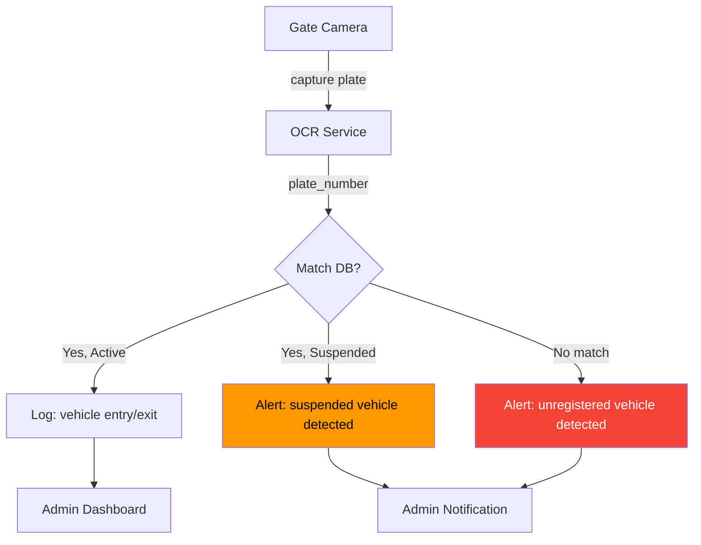

---

## 21. Future Complaint Integration

### 21.1 Vehicle-Linked Complaints

Seperti yang tercatat di [COMPLAINT_DOMAIN.md §18.2](file:///d:/PROJECT%20CODING/Granada%20Kost%20Platform/docs/COMPLAINT_DOMAIN.md):

| Aspek | Deskripsi |
|---|---|
| **Scenario** | Complaint terkait kendaraan: parkir liar, kendaraan terbengkalai, kebisingan mesin |
| **Impact** | Complaint bisa merujuk ke `vehicle_id` |
| **Implementation** | Tambahkan kolom opsional `vehicle_id` FK di `complaints` |
| **Phase** | Setelah Vehicle Management module stabil |
| **Categories** | `security`, `common_facility`, `noise` — bisa terkait kendaraan |

### 21.2 Complaint → Vehicle Suspension

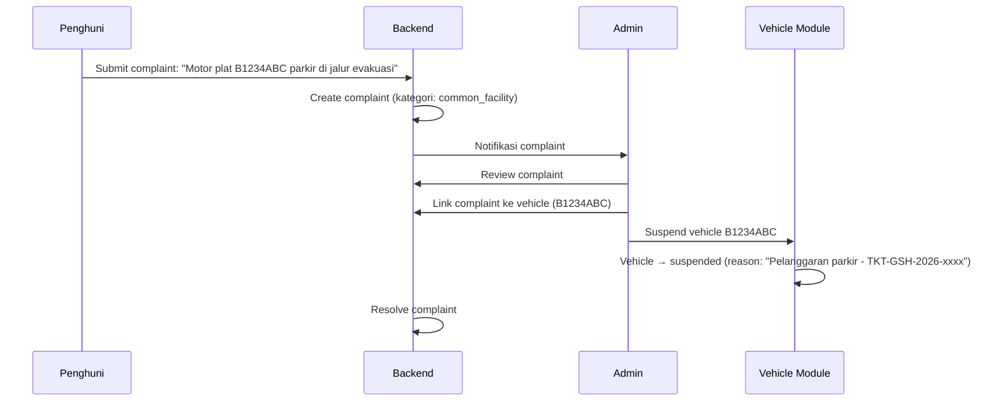

---

## 22. Implementation Phases

### 22.1 Phase 8A — Vehicle Domain Planning (Current)

**Scope**: Dokumen ini.

**Deliverable**: `docs/VEHICLE_DOMAIN.md`

**Status**: ✅ Complete

---

### 22.2 Phase 8B — Vehicle Database Planning

**Scope**: Detail database plan, migration checklist.

**Deliverable**: `docs/VEHICLE_DATABASE_PLAN.md`

**Konten**:
- Final table list dan kolom detail
- Constraint dan FK plan
- Index strategy final
- Seed data plan (vehicle types, sample dev data)
- Migration file plan: `007_vehicle.sql`
- `property_settings` additions for parking config

---

### 22.3 Phase 8C — Vehicle Migration

**Scope**: SQL migration implementation.

**Deliverable**:
- `migrations/007_vehicle.sql`
- `seeds/003_vehicle_dev_seed.sql` (dev only)
- Update `property_settings` with parking columns

**Dependency**: Phase 7C (Complaint migration) — jika complaint-vehicle FK dimasukkan sekarang

---

### 22.4 Phase 8D — Vehicle Backend

**Scope**: NestJS module implementation.

**Deliverable**:
- `src/modules/vehicle/` — Vehicle module
- Transport: controllers, DTOs, guards
- Application: use cases (register, approve, update, suspend, deactivate)
- Domain: vehicle entity, status transitions, business rules
- Infrastructure: repository, queries

**Endpoints**: Admin vehicle CRUD, Penghuni vehicle self-service

---

### 22.5 Phase 8E — Parking Backend (Opsional)

**Scope**: Parking management jika property membutuhkan mode `zone` atau `slot`.

**Deliverable**:
- Parking zone/slot CRUD
- Vehicle-to-slot assignment
- Parking overview/utilization

**Dependency**: Phase 8D (Vehicle backend)

---

### 22.6 Phase 8F — Integration & Testing

**Scope**: Cross-context integration.

**Tasks**:
- Domain event: `occupancy.ended` → vehicle auto-deactivate
- Domain event: `vehicle.registered` → notification
- Complaint module: optional `vehicle_id` FK
- E2E testing: registration → approval → checkout → deactivation
- RBAC testing: resident self-scope, admin manage, property owner read-only

---

## Appendix A: Business Decisions Log

| # | Keputusan | Status | Catatan |
|---|---|---|---|
| BD-VEH-01 | Parking slot entity wajib atau opsional? | **Decided: Opsional per property** | 3 mode: unmanaged, zone, slot |
| BD-VEH-02 | Visitor vehicle Phase 1 atau Phase 2? | **Decided: Phase 2** | Fokus kendaraan penghuni dulu |
| BD-VEH-03 | Foto kendaraan wajib atau opsional? | **Decided: Opsional** | Recommended tapi tidak blocking |
| BD-VEH-04 | STNK wajib atau opsional? | **Decided: Opsional Phase 1** | Bisa diwajibkan via setting nanti |
| BD-VEH-05 | Max kendaraan per penghuni? | **Decided: Configurable** | Default 3, setting per property |
| BD-VEH-06 | Plat nomor validasi ketat atau ringan? | **Decided: Ringan Phase 1** | Non-empty; strict regex Phase 2 |
| BD-VEH-07 | Auto-deactivate saat checkout? | **Decided: Ya** | Domain event driven |
| BD-VEH-08 | Penghuni bisa update data sendiri? | **Decided: Ya, tapi pending approval** | Kecuali field `notes` |

## Appendix B: Open Questions untuk Stakeholder

| # | Pertanyaan | Impact | Default Assumption |
|---|---|---|---|
| OQ-VEH-01 | Apakah ada biaya parkir per kendaraan? | Jika ya, perlu integrasi billing | **Tidak ada Phase 1** — defer ke Phase 2 |
| OQ-VEH-02 | Apakah kendaraan perlu stiker/kartu parkir? | Physical token management | **Tidak Phase 1** — hanya digital registry |
| OQ-VEH-03 | Apakah guard/satpam perlu akses ke vehicle list? | RBAC impact — perlu role baru? | **Admin cukup Phase 1** — guard role Phase 2 |
| OQ-VEH-04 | Apakah kendaraan bisa di-"pinjam" antar penghuni? | Ownership transfer | **Tidak** — satu kendaraan = satu owner |
| OQ-VEH-05 | Apakah sepeda listrik masuk kategori motor atau terpisah? | vehicle_type enum | **Terpisah**: `electric_scooter` |

## Appendix C: Glossary

| Term | Definisi |
|---|---|
| **RuKost** | Rumah Kost — tipe properti rumah yang dijadikan kost |
| **ApartKost** | Apartemen Kost — tipe properti apartemen yang dijadikan kost |
| **Parking Mode** | Strategi pengelolaan parkir: unmanaged, zone, slot |
| **Vehicle Code** | Kode unik kendaraan per property: `VEH-{PROP}-{YYYY}-{NNNN}` |
| **Plate Number** | Nomor plat kendaraan Indonesia (contoh: B 1234 ABC) |
| **Soft Limit** | Batas yang bisa di-override oleh admin |
| **Hard Limit** | Batas yang tidak bisa di-override (contoh: slot penuh) |
