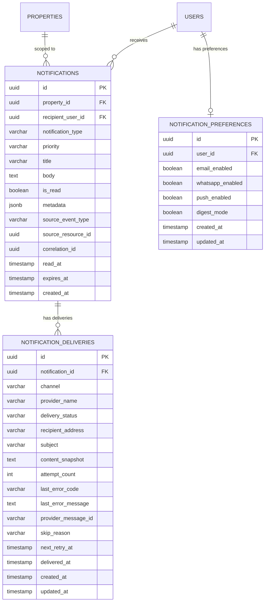
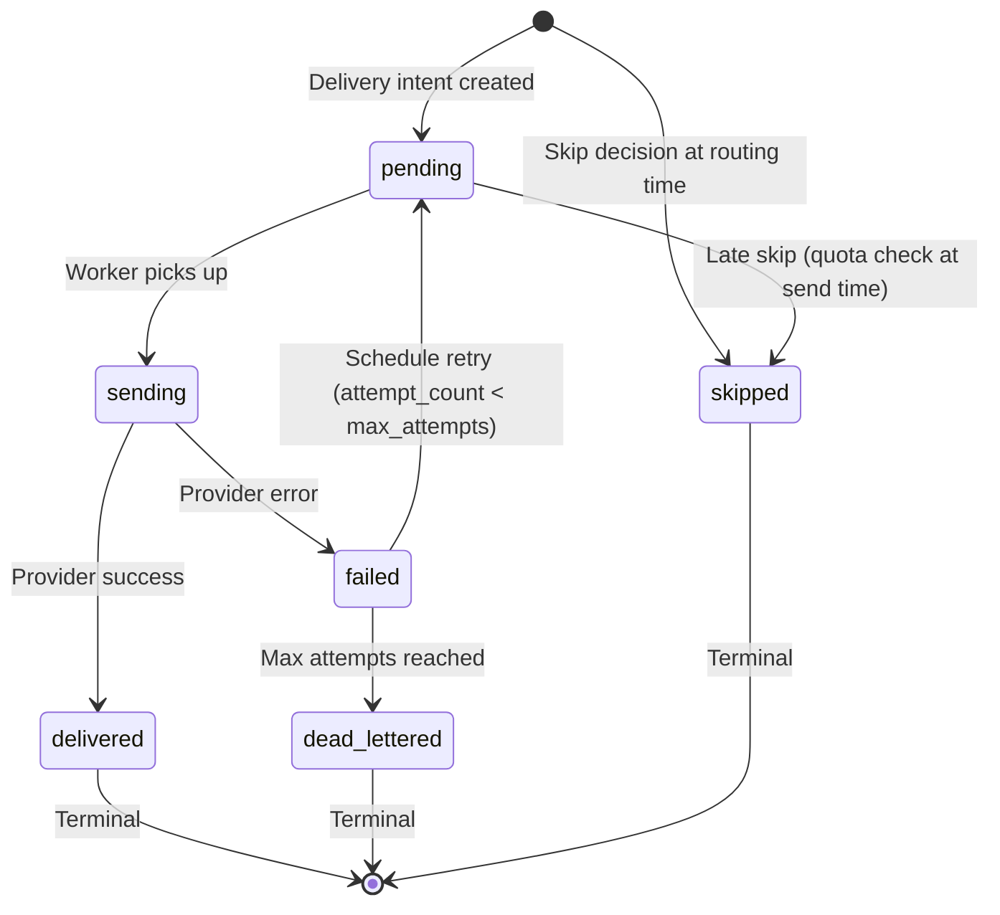

# NOTIFICATION DATABASE PLAN — Granada Kost Platform

> **Versi**: 1.0  
> **Tanggal**: 19 Juni 2026  
> **Peran Pembuat**: Principal Database Architect — Notification Context  
> **Status**: Dokumen Analisis Database — Dasar Migration Notification Module  
> **Milestone**: 9B — Notification Database Planning  
> **Dokumen Acuan**:  
> - [NOTIFICATION_DOMAIN.md](file:///d:/PROJECT%20CODING/Granada%20Kost%20Platform/docs/NOTIFICATION_DOMAIN.md)  
> - [DOMAIN_MODEL.md](file:///d:/PROJECT%20CODING/Granada%20Kost%20Platform/docs/DOMAIN_MODEL.md)  
> - [DATABASE_PLANNING.md](file:///d:/PROJECT%20CODING/Granada%20Kost%20Platform/docs/DATABASE_PLANNING.md)  
> - [API_PLANNING.md](file:///d:/PROJECT%20CODING/Granada%20Kost%20Platform/docs/API_PLANNING.md)  
> - [BACKEND_ARCHITECTURE.md](file:///d:/PROJECT%20CODING/Granada%20Kost%20Platform/docs/BACKEND_ARCHITECTURE.md)  
> - [SECURITY_POLICY.md](file:///d:/PROJECT%20CODING/Granada%20Kost%20Platform/docs/SECURITY_POLICY.md)

---

## Daftar Isi

1. [Executive Summary](#1-executive-summary)
2. [Locked Decisions](#2-locked-decisions)
3. [Table Structure Evaluation](#3-table-structure-evaluation)
4. [Final Table List](#4-final-table-list)
5. [Table: `notifications`](#5-table-notifications)
6. [Table: `notification_deliveries`](#6-table-notification_deliveries)
7. [Table: `notification_preferences`](#7-table-notification_preferences)
8. [Property Settings Keys](#8-property-settings-keys)
9. [Constraint Strategy](#9-constraint-strategy)
10. [Foreign Key Strategy](#10-foreign-key-strategy)
11. [Index Strategy](#11-index-strategy)
12. [Notification Status Enum Strategy](#12-notification-status-enum-strategy)
13. [Notification Priority Enum Strategy](#13-notification-priority-enum-strategy)
14. [Notification Channel Enum Strategy](#14-notification-channel-enum-strategy)
15. [Notification Provider Enum Strategy](#15-notification-provider-enum-strategy)
16. [Template Storage Strategy](#16-template-storage-strategy)
17. [User Preference Strategy](#17-user-preference-strategy)
18. [Digest Strategy](#18-digest-strategy)
19. [Retry Strategy](#19-retry-strategy)
20. [Dead-Letter Strategy](#20-dead-letter-strategy)
21. [Notification Log Strategy](#21-notification-log-strategy)
22. [Audit Integration](#22-audit-integration)
23. [Property Owner Digest Storage Strategy](#23-property-owner-digest-storage-strategy)
24. [Brevo Quota Tracking Strategy](#24-brevo-quota-tracking-strategy)
25. [Development Seed Strategy](#25-development-seed-strategy)
26. [Production Seed Strategy](#26-production-seed-strategy)
27. [Migration Checklist](#27-migration-checklist)
28. [Risks Before Migration](#28-risks-before-migration)
29. [Verdict](#29-verdict)

---

## 1. Executive Summary

Dokumen ini menerjemahkan NOTIFICATION_DOMAIN.md (Milestone 9A, APPROVED) menjadi rencana database PostgreSQL tingkat arsitektur untuk Notification module Granada Kost Platform. Dokumen ini **tidak menghasilkan migration, SQL, atau code** — hanya menyediakan blueprint final yang akan digunakan oleh Milestone 9C (Migration).

### 1.1 Konteks

| Aspek | Status |
|---|---|
| **Milestone 9A** | ✅ APPROVED — NOTIFICATION_DOMAIN.md final |
| **Existing DB tables** | DATABASE_PLANNING.md mendefinisikan placeholder: `notifications`, `notification_preferences`, `notification_deliveries` |
| **Milestone ini** | Mendetailkan kolom, constraint, index, enum, seed, dan migration checklist |
| **Output** | Blueprint siap untuk 9C Migration |

### 1.2 Scope

Milestone 9B mendefinisikan:
- Schema PostgreSQL untuk notification context
- Enum values yang digunakan application layer
- Redis keys yang mendukung notification (bukan PostgreSQL)
- Property settings keys yang ditambahkan ke `property_settings`
- Seed data untuk development dan production

Milestone 9B **TIDAK** mendefinisikan:
- Migration SQL / Prisma / TypeORM schema
- Application code / NestJS module
- API endpoint contracts
- Email HTML templates

---

## 2. Locked Decisions

### 2.1 Dari Milestone 9A

| Decision | Nilai |
|---|---|
| **ND-01** Primary channel | In-app notification |
| **ND-02** Secondary channel | Email via Brevo |
| **ND-03** Tertiary channel (future) | WhatsApp via Fonnte (disabled by default) |
| **ND-04** Provider abstraction | Wajib |
| **ND-05** Event-driven | Notification = consumer only |
| **ND-06** PWA Push | Future (Phase 3) |
| **ND-07** Brevo free tier | 300 email/hari, kuota dioptimasi |

### 2.2 Open Business Decisions (Now Resolved)

| # | Decision | Final Value | Impact on DB |
|---|---|---|---|
| OBD-01 | Admin email delivery | **Real-time** | No digest_mode default for staff; `notification_preferences.digest_mode` default `false` |
| OBD-02 | Email sender domain | **Placeholder** (final domain TBD) | No DB impact — sender config in environment |
| OBD-03 | Notification retention | **90 hari** | `expires_at` default = `created_at + 90 days` |
| OBD-04 | Property owner digest | **Per-property** | One notification row + one delivery row per property per digest |
| OBD-05 | WhatsApp consent | **Opt-in via app setting** | `notification_preferences.whatsapp_enabled` default `false` |

### 2.3 Dari DATABASE_PLANNING.md

| Convention | Rule |
|---|---|
| Table names | English, plural, snake_case |
| Primary key | `id` as UUID |
| Foreign key | Singular table name + `_id` |
| Timestamps | `created_at`, `updated_at` |
| Status columns | Explicit status name |
| Enum values | Lowercase snake_case |
| Money | Integer minor unit (IDR, no fractional) |
| Multi-property | `property_id` wajib pada operational tables |
| Soft delete | `deleted_at` where applicable |

---

## 3. Table Structure Evaluation

### 3.1 Evaluation Matrix

NOTIFICATION_DOMAIN.md Appendix B mengusulkan 3 tabel. User request meminta evaluasi 6 kandidat tabel. Berikut analisis lengkap:

| Kandidat Tabel | Keputusan | Justifikasi |
|---|---|---|
| **`notifications`** | ✅ **Gunakan** | Core table — menyimpan in-app notification record per recipient. Ini adalah tabel yang di-query frontend untuk menampilkan notification list, unread count, mark read. |
| **`notification_deliveries`** | ✅ **Gunakan** (rename dari `notification_delivery_intents`) | Menyimpan delivery attempt per external channel (email, WhatsApp, push). In-app channel **tidak** memerlukan delivery record karena `notifications` row IS the delivery. Mendukung retry, dead letter, audit. |
| **`notification_templates`** | ❌ **Tidak digunakan Phase 1** | Phase 1 menggunakan template hardcoded di TypeScript constants (NOTIFICATION_DOMAIN.md Section 9.3). Database table baru diperlukan Phase 2 saat admin perlu mengedit template via UI. Menambahkan tabel ini sekarang menambah complexity tanpa value. |
| **`notification_preferences`** | ✅ **Gunakan** | Menyimpan user-level channel preferences (email on/off, WhatsApp on/off, digest mode). Diperlukan sejak Phase 1 untuk email opt-out dan preference query saat channel routing. |
| **`notification_digests`** | ❌ **Tidak digunakan** | Digest tidak memerlukan tabel terpisah. Daily digest cron job cukup query `notifications` yang belum dikirim via email, render digest email, lalu create satu `notification_deliveries` row. Redis accumulator (`digest:pending:{user_id}:{date}`) menyimpan pending items. Tabel terpisah menambah join dan complexity tanpa benefit. |
| **`notification_dead_letters`** | ❌ **Tidak digunakan** | Dead letter adalah status `dead_lettered` di `notification_deliveries`, bukan tabel terpisah. Query dead letters: `WHERE delivery_status = 'dead_lettered'`. Admin dashboard cukup filter by status. Tabel terpisah menduplikasi data. |

### 3.2 Rejected Alternative: Flat Single Table

Menggabungkan `notifications` dan `notification_deliveries` menjadi satu tabel akan menyebabkan:
- ❌ One notification per recipient bisa memiliki 0–3 delivery records (email + WA + push) — flat table memaksa nullable columns atau row duplication
- ❌ In-app notifications yang tidak memerlukan delivery tracking akan memiliki banyak kolom null
- ❌ Retry tracking memerlukan update pada delivery, bukan pada notification row
- ❌ Melanggar normalisasi — notification content dan delivery status memiliki lifecycle berbeda

**Verdict: 2-table split (notifications + deliveries) adalah optimal.**

### 3.3 Rejected Alternative: Separate Tables per Channel

Membuat `notification_email_deliveries`, `notification_whatsapp_deliveries`, dll:
- ❌ Menambah jumlah tabel tanpa benefit — semua channel memiliki kolom yang sama
- ❌ Worker code harus tahu tabel mana yang di-query
- ❌ Cross-channel reporting memerlukan UNION
- ❌ Future channel (push) memerlukan tabel baru

**Verdict: Single `notification_deliveries` table dengan `channel` column lebih baik.**

---

## 4. Final Table List

### 4.1 Phase 1 — Notification Tables

| # | Table | Type | Purpose |
|---|---|---|---|
| 1 | **`notifications`** | New table | In-app notification records per recipient |
| 2 | **`notification_deliveries`** | New table | External channel delivery tracking (email, WA, push) |
| 3 | **`notification_preferences`** | New table | User-level channel preference configuration |

### 4.2 Existing Tables Modified

| # | Table | Modification |
|---|---|---|
| 4 | **`property_settings`** | Add notification-specific setting keys (rows, not columns) |

### 4.3 Future Phase Tables

| # | Table | Phase | Trigger |
|---|---|---|---|
| 5 | `notification_templates` | Phase 2 | Saat admin template editor UI dibutuhkan |
| 6 | `push_subscriptions` | Phase 3 | Saat PWA Web Push diimplementasi |

### 4.4 Redis Keys (Non-PostgreSQL)

| # | Key Pattern | Purpose | TTL |
|---|---|---|---|
| R1 | `brevo:daily:{YYYY-MM-DD}` | Brevo daily email counter | 48h |
| R2 | `ntf:idemp:{event_id}:{user_id}:{channel}` | Idempotency dedup check | 24h |
| R3 | `ntf:digest:pending:{user_id}:{YYYY-MM-DD}` | Pending digest items accumulator | 48h |
| R4 | `ntf:delivery:queue` | Email/WA delivery job queue | — |
| R5 | `ntf:delivery:retry` | Retry scheduled deliveries (sorted set by next_retry_at) | — |

### 4.5 Entity Relationship Diagram



---

## 5. Table: `notifications`

### 5.1 Purpose

Menyimpan setiap in-app notification yang diterima user. Satu domain event bisa menghasilkan banyak rows (fan-out: satu per recipient). Ini adalah tabel yang di-query oleh frontend notification list, unread count badge, dan mark-read actions.

### 5.2 Column Specification

| # | Column | Type | Nullable | Default | Keterangan |
|---|---|---|---|---|---|
| 1 | `id` | `UUID` | NOT NULL | `gen_random_uuid()` | Primary key |
| 2 | `property_id` | `UUID` | NOT NULL | — | FK → `properties.id`. Notification scoped to property |
| 3 | `recipient_user_id` | `UUID` | NOT NULL | — | FK → `users.id`. User yang menerima notification |
| 4 | `notification_type` | `VARCHAR(100)` | NOT NULL | — | Type code dari registry (contoh: `billing.invoice_issued`) |
| 5 | `priority` | `VARCHAR(20)` | NOT NULL | `'normal'` | `urgent`, `high`, `normal`, `low` |
| 6 | `title` | `VARCHAR(500)` | NOT NULL | — | Rendered title (snapshot, immutable setelah creation) |
| 7 | `body` | `TEXT` | NOT NULL | — | Rendered body plain text (snapshot, immutable) |
| 8 | `is_read` | `BOOLEAN` | NOT NULL | `false` | Apakah user sudah membaca |
| 9 | `metadata` | `JSONB` | NULL | — | Extra context: `invoice_id`, `complaint_code`, `room_number`, dll. untuk deep linking di frontend |
| 10 | `source_event_type` | `VARCHAR(100)` | NULL | — | Domain event type yang menghasilkan notification ini (audit/tracing) |
| 11 | `source_resource_id` | `UUID` | NULL | — | ID resource asal (invoice_id, complaint_id, dll.) |
| 12 | `correlation_id` | `UUID` | NULL | — | Correlation ID dari originating request/event |
| 13 | `read_at` | `TIMESTAMP WITH TIME ZONE` | NULL | — | Kapan user membaca notification |
| 14 | `expires_at` | `TIMESTAMP WITH TIME ZONE` | NULL | `created_at + INTERVAL '90 days'` | Auto-cleanup deadline. Application layer menghitung ini saat insert. |
| 15 | `created_at` | `TIMESTAMP WITH TIME ZONE` | NOT NULL | `NOW()` | Record creation timestamp |

### 5.3 Design Decisions

| Decision | Rationale |
|---|---|
| **No `updated_at`** | Notification content is immutable after creation. Only `is_read` and `read_at` change — these are simple flag updates, not content modifications. Menambah `updated_at` memperlambat setiap read mark tanpa value. |
| **No `deleted_at` / soft delete** | Notifications di-expire dan di-cleanup via `expires_at`, bukan soft delete. Expired notifications di-hard-delete oleh cleanup cron. Tidak ada business case untuk "undelete" notification. |
| **`is_read` + `read_at` dual** | `is_read` boolean untuk fast index filtering. `read_at` timestamp untuk audit/reporting. |
| **`metadata` JSONB** | Flexible context untuk deep linking tanpa schema change. Contoh: `{"invoice_id": "uuid", "room_number": "101", "amount": 1800000}`. Tidak di-filter/sort secara langsung — jika filter dibutuhkan, gunakan `notification_type` + `source_resource_id`. |
| **`expires_at` nullable** | Default 90 hari via application layer. NULL = no expiry (untuk platform-level announcements jika dibutuhkan future). |
| **`priority` as VARCHAR** | Tidak menggunakan PostgreSQL enum type agar bisa extend tanpa migration. Application layer validates against allowed values. |
| **No `channel` column** | In-app notification IS the channel. External channel tracking ada di `notification_deliveries`. Satu `notifications` row = satu in-app notification. |

### 5.4 Volume Estimation

| Scenario | Volume/hari | Volume/bulan | Volume/90 hari (retention) |
|---|---|---|---|
| Normal day | ~200–300 rows | ~7.500 rows | ~22.500 rows |
| Billing cycle day (tanggal 1) | ~500–800 rows | 1 hari/bulan | — |
| Overdue spike (tanggal 26) | ~400–600 rows | 1 hari/bulan | — |
| **Steady state** | — | **~9.000 rows** | **~27.000 rows** |

> Dengan 90 hari retention, tabel `notifications` akan stabil di ~25.000–30.000 rows. Ini sangat kecil untuk PostgreSQL — tidak perlu partitioning.

---

## 6. Table: `notification_deliveries`

### 6.1 Purpose

Menyimpan setiap delivery attempt ke external channel (email, WhatsApp, push). In-app channel **tidak** memerlukan row di tabel ini. Tabel ini digunakan oleh queue worker untuk retry, oleh admin dashboard untuk delivery monitoring, dan oleh dead letter visibility.

### 6.2 Column Specification

| # | Column | Type | Nullable | Default | Keterangan |
|---|---|---|---|---|---|
| 1 | `id` | `UUID` | NOT NULL | `gen_random_uuid()` | Primary key |
| 2 | `notification_id` | `UUID` | NOT NULL | — | FK → `notifications.id`. Parent notification |
| 3 | `channel` | `VARCHAR(20)` | NOT NULL | — | `email`, `whatsapp`, `push` |
| 4 | `provider_name` | `VARCHAR(50)` | NOT NULL | — | `brevo`, `fonnte`, `web_push` |
| 5 | `delivery_status` | `VARCHAR(20)` | NOT NULL | `'pending'` | `pending`, `sending`, `delivered`, `failed`, `dead_lettered`, `skipped` |
| 6 | `recipient_address` | `VARCHAR(500)` | NOT NULL | — | Email address, phone (62xxx), atau push endpoint URL |
| 7 | `subject` | `VARCHAR(500)` | NULL | — | Email subject line. NULL untuk WhatsApp/push. |
| 8 | `content_snapshot` | `TEXT` | NULL | — | Rendered HTML (email) atau plain text (WA). Digunakan untuk retry tanpa re-render. NULL jika `skipped`. |
| 9 | `attempt_count` | `INTEGER` | NOT NULL | `0` | Jumlah attempt yang sudah dilakukan |
| 10 | `max_attempts` | `INTEGER` | NOT NULL | `5` | Configurable max retry per delivery |
| 11 | `last_error_code` | `VARCHAR(100)` | NULL | — | Provider error code (contoh: `429`, `invalid_email`, `timeout`) |
| 12 | `last_error_message` | `TEXT` | NULL | — | Safe error message (bukan raw provider response) |
| 13 | `provider_message_id` | `VARCHAR(200)` | NULL | — | Provider tracking ID (Brevo messageId, Fonnte ID, dll.) |
| 14 | `skip_reason` | `VARCHAR(100)` | NULL | — | Alasan skip: `quota_exhausted`, `preference_disabled`, `invalid_recipient`, `channel_disabled`, `deferred_to_digest` |
| 15 | `next_retry_at` | `TIMESTAMP WITH TIME ZONE` | NULL | — | Kapan retry berikutnya. NULL jika tidak perlu retry. Worker polls by this column. |
| 16 | `delivered_at` | `TIMESTAMP WITH TIME ZONE` | NULL | — | Timestamp delivery berhasil dari provider |
| 17 | `created_at` | `TIMESTAMP WITH TIME ZONE` | NOT NULL | `NOW()` | Record creation |
| 18 | `updated_at` | `TIMESTAMP WITH TIME ZONE` | NOT NULL | `NOW()` | Last status/attempt update |

### 6.3 Design Decisions

| Decision | Rationale |
|---|---|
| **Rename dari `notification_delivery_intents`** | `notification_deliveries` lebih ringkas dan konsisten dengan DATABASE_PLANNING.md yang sudah mendefinisikan nama ini. |
| **No in-app rows** | In-app delivery = `notifications` row creation. Tidak perlu tracking tambahan. Mengurangi volume ~60-70%. |
| **`content_snapshot` nullable** | Hanya diisi untuk channel yang perlu retry (email HTML, WA text). `skipped` deliveries tidak perlu content. |
| **`skip_reason` column** | Menambah observability: kenapa delivery di-skip? Tanpa ini, `skipped` status tidak informatif. Admin dashboard bisa group by `skip_reason`. |
| **`max_attempts` per row** | Memungkinkan different retry policies per delivery (urgent = 7, normal = 5). Default 5. |
| **`delivery_status` as VARCHAR** | Sama dengan `notifications.priority` — tidak menggunakan PostgreSQL enum type. Application validates. |
| **No `property_id`** | Property scope bisa di-join via `notification_id → notifications.property_id`. Menambah `property_id` di sini adalah denormalization tanpa strong use case (admin delivery dashboard bisa join). |
| **Retention** | Delivery records mengikuti parent notification retention (90 hari). Cleanup cron deletes deliveries saat parent notification di-cleanup. CASCADE delete. |

### 6.4 Volume Estimation

| Scenario | Volume/hari | Keterangan |
|---|---|---|
| Email deliveries (normal day) | ~30–80 rows | ~20% notifications get email |
| Email deliveries (billing cycle) | ~150–200 rows | Invoice issued emails |
| Skipped deliveries | ~50–100 rows | Quota, preference disabled |
| **Steady state (90 hari)** | **~8.000–15.000 rows** | Very manageable |

---

## 7. Table: `notification_preferences`

### 7.1 Purpose

Menyimpan user-level notification channel preferences. Setiap user memiliki paling banyak **satu** preference record. Jika record tidak ada, application layer menggunakan defaults.

### 7.2 Column Specification

| # | Column | Type | Nullable | Default | Keterangan |
|---|---|---|---|---|---|
| 1 | `id` | `UUID` | NOT NULL | `gen_random_uuid()` | Primary key |
| 2 | `user_id` | `UUID` | NOT NULL | — | FK → `users.id`. UNIQUE — satu record per user |
| 3 | `email_enabled` | `BOOLEAN` | NOT NULL | `true` | Apakah user menerima email notification |
| 4 | `whatsapp_enabled` | `BOOLEAN` | NOT NULL | `false` | Apakah user menerima WhatsApp notification (future) |
| 5 | `push_enabled` | `BOOLEAN` | NOT NULL | `true` | Apakah user menerima push notification (future) |
| 6 | `digest_mode` | `BOOLEAN` | NOT NULL | `false` | Prefer daily digest daripada individual emails |
| 7 | `quiet_hours_start` | `TIME` | NULL | — | Jam mulai tidak menerima non-urgent notifications (future, contoh: 22:00) |
| 8 | `quiet_hours_end` | `TIME` | NULL | — | Jam selesai quiet hours (future, contoh: 07:00) |
| 9 | `created_at` | `TIMESTAMP WITH TIME ZONE` | NOT NULL | `NOW()` | Record creation |
| 10 | `updated_at` | `TIMESTAMP WITH TIME ZONE` | NOT NULL | `NOW()` | Last preference update |

### 7.3 Design Decisions

| Decision | Rationale |
|---|---|
| **One row per user** | Flat structure — semua preferences di satu record. Simple UPSERT. Tidak perlu per-notification-type granularity Phase 1. |
| **No `property_id`** | User preferences berlaku untuk semua properties tempat user berperan. Per-property override dilakukan via `property_settings` (master switch). |
| **Default values** | Jika row tidak ada, application uses: `email_enabled=true`, `whatsapp_enabled=false`, `push_enabled=true`, `digest_mode=false`. Record dibuat saat user pertama kali mengubah preference. |
| **`quiet_hours_*` nullable** | Future feature — slot sudah disiapkan agar tidak perlu ALTER TABLE nanti. NULL = no quiet hours. |
| **Rejected: per-type preferences** | DATABASE_PLANNING.md mendefinisikan `notification_preferences` dengan `notification_type` dan `channel` columns (per-type per-channel granularity). Ini **terlalu granular** untuk Phase 1 — 40+ notification types × 4 channels = 160 rows per user. Premature complexity. Phase 2 bisa menambah `notification_type_preferences` table jika dibutuhkan. |

### 7.4 Volume Estimation

| Scenario | Volume |
|---|---|
| Per user | Max 1 row |
| All users (163 penghuni + ~10 staff + ~3 property owners) | **~176 rows** |
| Growth (300 penghuni, 20 staff) | **~323 rows** |

> Tabel paling kecil. Zero performance concern.

---

## 8. Property Settings Keys

### 8.1 Purpose

Notification-specific settings ditambahkan ke existing `property_settings` table sebagai **rows**, bukan kolom baru. Ini konsisten dengan pattern di DATABASE_PLANNING.md dimana `property_settings` menggunakan key-value rows.

### 8.2 Setting Keys

| # | Setting Key | Value Type | Default Value | Keterangan |
|---|---|---|---|---|
| 1 | `notification_email_enabled` | `boolean` | `true` | Master switch: aktifkan email channel untuk property |
| 2 | `notification_whatsapp_enabled` | `boolean` | `false` | Master switch: aktifkan WhatsApp channel (future, disabled) |
| 3 | `notification_push_enabled` | `boolean` | `false` | Master switch: aktifkan push notification (future, disabled) |
| 4 | `notification_digest_enabled` | `boolean` | `true` | Aktifkan daily digest untuk normal-priority notifications |
| 5 | `notification_digest_hour` | `integer` | `8` | Jam pengiriman daily digest (WIB, 0-23) |
| 6 | `notification_retention_days` | `integer` | `90` | Berapa hari notification disimpan sebelum auto-cleanup |

### 8.3 Design Decision

| Decision | Rationale |
|---|---|
| **Key-value rows, bukan tabel terpisah** | Konsisten dengan existing `property_settings` pattern. Menghindari tabel baru untuk 6 key-value pairs. |
| **Property-level master switch** | Property toggle override user preference. Jika `notification_email_enabled = false`, tidak ada user di property ini yang menerima email, terlepas dari user preference. |
| **`notification_retention_days` configurable** | Default 90 hari sesuai OBD-03. Tapi per-property bisa dikonfigurasi (contoh: property baru mungkin ingin retention lebih panjang). |

---

## 9. Constraint Strategy

### 9.1 Primary Key Constraints

| Table | PK | Type |
|---|---|---|
| `notifications` | `id` | UUID, `gen_random_uuid()` |
| `notification_deliveries` | `id` | UUID, `gen_random_uuid()` |
| `notification_preferences` | `id` | UUID, `gen_random_uuid()` |

### 9.2 Unique Constraints

| Table | Constraint Name | Columns | Keterangan |
|---|---|---|---|
| `notification_preferences` | `uq_notification_preferences_user_id` | `(user_id)` | Satu record per user. Mencegah duplikasi preferences. |

> **Catatan**: Tidak ada unique constraint pada `notifications` karena duplicate detection dilakukan via Redis idempotency key, bukan database constraint. Alasan: idempotency key melibatkan `event_id` yang tidak disimpan di tabel (bukan kolom `notifications`).

### 9.3 NOT NULL Constraints

Semua kolom yang didefinisikan NOT NULL di Section 5-7 menggunakan PostgreSQL `NOT NULL` constraint. Key highlights:

| Table | Column | Rationale |
|---|---|---|
| `notifications` | `property_id`, `recipient_user_id`, `notification_type`, `priority`, `title`, `body` | Core identity — notification tanpa ini tidak valid |
| `notifications` | `is_read` | Boolean default false; NULL tidak bermakna |
| `notification_deliveries` | `channel`, `provider_name`, `delivery_status`, `recipient_address` | Delivery tanpa ini tidak bisa di-route |
| `notification_deliveries` | `attempt_count`, `max_attempts` | Default values; NULL tidak bermakna |
| `notification_preferences` | Semua boolean columns | Default values; NULL tidak bermakna |

### 9.4 Check Constraints

| Table | Constraint Name | Expression | Keterangan |
|---|---|---|---|
| `notifications` | `chk_notifications_priority` | `priority IN ('urgent', 'high', 'normal', 'low')` | Validasi priority values |
| `notification_deliveries` | `chk_deliveries_channel` | `channel IN ('email', 'whatsapp', 'push')` | Validasi channel values |
| `notification_deliveries` | `chk_deliveries_status` | `delivery_status IN ('pending', 'sending', 'delivered', 'failed', 'dead_lettered', 'skipped')` | Validasi delivery status values |
| `notification_deliveries` | `chk_deliveries_attempt_count` | `attempt_count >= 0 AND attempt_count <= max_attempts` | Attempt tidak boleh negatif atau melebihi max |
| `notification_deliveries` | `chk_deliveries_max_attempts` | `max_attempts >= 1 AND max_attempts <= 10` | Guard against runaway retries |

### 9.5 Default Value Strategy

| Table | Column | Default | Mechanism |
|---|---|---|---|
| `notifications.is_read` | `false` | Database default |
| `notifications.priority` | `'normal'` | Database default |
| `notifications.expires_at` | `created_at + 90 days` | Application layer (bukan database default karena memerlukan `created_at` value) |
| `notification_deliveries.delivery_status` | `'pending'` | Database default |
| `notification_deliveries.attempt_count` | `0` | Database default |
| `notification_deliveries.max_attempts` | `5` | Database default |
| `notification_preferences.email_enabled` | `true` | Database default |
| `notification_preferences.whatsapp_enabled` | `false` | Database default |
| `notification_preferences.push_enabled` | `true` | Database default |
| `notification_preferences.digest_mode` | `false` | Database default |

---

## 10. Foreign Key Strategy

### 10.1 Foreign Key Definitions

| Table | Column | References | ON DELETE | ON UPDATE | Keterangan |
|---|---|---|---|---|---|
| `notifications` | `property_id` | `properties(id)` | `RESTRICT` | `CASCADE` | Property tidak boleh dihapus jika ada notifications. Untuk production, property tidak pernah di-hard-delete. |
| `notifications` | `recipient_user_id` | `users(id)` | `RESTRICT` | `CASCADE` | User tidak boleh dihapus jika ada notifications. User di-deactivate, bukan dihapus. |
| `notification_deliveries` | `notification_id` | `notifications(id)` | `CASCADE` | `CASCADE` | Delivery records dihapus bersama parent notification (cleanup cron). |
| `notification_preferences` | `user_id` | `users(id)` | `CASCADE` | `CASCADE` | Preferences dihapus jika user dihapus. User jarang dihapus (biasanya deactivated). |

### 10.2 Design Decisions

| Decision | Rationale |
|---|---|
| **RESTRICT on `notifications` → `properties`** | Mencegah orphan notifications jika property accidentally dihapus. Property deletion adalah event yang sangat jarang (jika pernah). |
| **RESTRICT on `notifications` → `users`** | Sama — mencegah orphan. User deactivation tidak memerlukan FK deletion. |
| **CASCADE on `notification_deliveries` → `notifications`** | Cleanup cron hanya perlu DELETE FROM `notifications` WHERE `expires_at < NOW()` — deliveries otomatis ikut terhapus. Simplifikasi cleanup logic. |
| **CASCADE on `notification_preferences` → `users`** | Jika user benar-benar dihapus (edge case), preferences tidak perlu ada. |
| **No FK on `source_resource_id`** | Ini referensi polimorfik (bisa invoice_id, complaint_id, vehicle_id, dll.). Formal FK tidak possible tanpa target table. Application layer menjaga referential integrity. Konsisten dengan pattern `audit_logs.resource_id`. |

---

## 11. Index Strategy

### 11.1 Primary Indexes (Must-Have Phase 1)

| # | Table | Index Name | Columns | Type | Keterangan |
|---|---|---|---|---|---|
| I-01 | `notifications` | `idx_notifications_recipient_unread` | `(recipient_user_id, is_read, created_at DESC)` | B-tree | **Primary query**: frontend notification list — "semua unread notifications saya, terbaru dulu". High frequency (setiap page load). |
| I-02 | `notifications` | `idx_notifications_recipient_created` | `(recipient_user_id, created_at DESC)` | B-tree | **Secondary query**: "semua notifications saya (termasuk read), terbaru dulu". Untuk pagination. |
| I-03 | `notifications` | `idx_notifications_property_type` | `(property_id, notification_type, created_at DESC)` | B-tree | **Admin query**: "semua billing notifications di property ini". Admin dashboard filtering. |
| I-04 | `notifications` | `idx_notifications_expires` | `(expires_at)` WHERE `expires_at IS NOT NULL` | Partial B-tree | **Cleanup cron**: `DELETE WHERE expires_at < NOW()`. Jarang di-query tapi harus efisien saat cleanup. |
| I-05 | `notification_deliveries` | `idx_deliveries_status_retry` | `(delivery_status, next_retry_at)` WHERE `delivery_status IN ('pending', 'failed')` | Partial B-tree | **Worker poll**: "deliveries yang perlu dikirim/retry sekarang". High frequency (setiap worker cycle). |
| I-06 | `notification_deliveries` | `idx_deliveries_notification` | `(notification_id)` | B-tree | **Join**: dari notification ke delivery intents. |
| I-07 | `notification_deliveries` | `idx_deliveries_dead_letter` | `(delivery_status, created_at DESC)` WHERE `delivery_status = 'dead_lettered'` | Partial B-tree | **Admin dashboard**: dead letter visibility. Jarang tapi harus cepat. |
| I-08 | `notification_preferences` | `uq_notification_preferences_user_id` | `(user_id)` | B-tree UNIQUE | **Lookup**: "apa preference user ini?" Setiap notification creation checks this. Unique juga enforces one-row-per-user. |

### 11.2 Indexes NOT Created (Deferred)

| Index | Reason to Defer |
|---|---|
| `notifications(source_resource_id)` | Hanya dibutuhkan jika admin perlu query "semua notifications terkait invoice X". Belum ada use case. Tambah saat dibutuhkan. |
| `notifications(correlation_id)` | Debugging only. Correlation tracing via log search lebih efisien. Tambah jika debugging jadi frequent. |
| `notification_deliveries(provider_message_id)` | Hanya dibutuhkan jika reconciliation dengan Brevo diperlukan. Phase 2. |
| `notification_deliveries(channel)` | Low cardinality (3 values). Composite dengan status sudah cukup. |
| BRIN on `notifications(created_at)` | Volume terlalu kecil (~27K rows) untuk benefit dari BRIN. Pertimbangkan jika volume melewati 500K. |

### 11.3 PostgreSQL-Specific Notes

- **Partial indexes** pada `notification_deliveries` untuk status filtering sangat efisien karena `pending` dan `failed` rows hanya ~5-10% dari total rows pada steady state. Index kecil = cache-friendly.
- **DESC ordering** pada `created_at` indexes karena hampir semua notification queries menginginkan newest-first.
- **Composite indexes** didesain mengikuti real query patterns, bukan setiap FK. Hindari indexing blind foreign keys yang tidak di-query.

---

## 12. Notification Status Enum Strategy

### 12.1 In-App Notification Read Status

**Implementation**: `is_read` BOOLEAN column pada `notifications` table.

| Status | Value | Keterangan |
|---|---|---|
| Unread | `is_read = false` | Default — notifikasi belum dibaca |
| Read | `is_read = true` | User telah membaca |

> **Mengapa bukan enum/VARCHAR?** Hanya 2 states. Boolean lebih efisien untuk index dan query. `archived` status (Phase 2) bisa ditambahkan sebagai kolom baru `is_archived BOOLEAN DEFAULT false` tanpa mengubah existing logic.

### 12.2 Delivery Status

**Implementation**: `delivery_status VARCHAR(20)` column pada `notification_deliveries` table, validated by CHECK constraint.

| Status | Value | Terminal? | Keterangan |
|---|---|---|---|
| Pending | `pending` | No | Baru dibuat, menunggu worker pickup |
| Sending | `sending` | No | Worker sedang mengirim ke provider |
| Delivered | `delivered` | Yes | Provider mengkonfirmasi terkirim |
| Failed | `failed` | No* | Provider error — akan di-retry jika `attempt_count < max_attempts` |
| Dead Lettered | `dead_lettered` | Yes | Max retry tercapai — perlu investigasi manual |
| Skipped | `skipped` | Yes | Tidak dikirim (preference/quota/invalid) |

> \* `failed` bersifat non-terminal saat `attempt_count < max_attempts`. Saat `attempt_count >= max_attempts`, application layer transition ke `dead_lettered`.

### 12.3 Valid Status Transitions



### 12.4 Enum Implementation Decision

| Approach | Decision | Rationale |
|---|---|---|
| PostgreSQL ENUM type | ❌ Rejected | ALTER TYPE menambah enum value memerlukan migration. Menambah channel atau status baru harus mudah. |
| VARCHAR + CHECK constraint | ✅ Adopted | CHECK constraint bisa di-DROP dan CREATE ulang dengan value baru tanpa data migration. Application layer TypeScript enum sebagai source of truth. |
| Plain VARCHAR tanpa constraint | ❌ Rejected | Tanpa guardrail, typo/invalid values bisa masuk ke database. CHECK constraint memberikan defense-in-depth. |

---

## 13. Notification Priority Enum Strategy

### 13.1 Priority Values

**Implementation**: `priority VARCHAR(20)` column pada `notifications` table, validated by CHECK constraint.

| Priority | Value | DB Storage | Keterangan |
|---|---|---|---|
| Urgent | `urgent` | VARCHAR | Safety/security — bypass quota, never batch |
| High | `high` | VARCHAR | Business-critical — email if quota permits |
| Normal | `normal` | VARCHAR | Standard — batchable into digest |
| Low | `low` | VARCHAR | Informational — in-app only |

### 13.2 Priority-Channel Routing Matrix (Reference from NOTIFICATION_DOMAIN.md)

| Priority | In-App | Email | WhatsApp (Future) | Push (Future) |
|---|:---:|:---:|:---:|:---:|
| `urgent` | ✅ Always | ✅ Always (bypass quota) | ✅ If enabled | ✅ If enabled |
| `high` | ✅ Always | ✅ Quota permitting | ⬜ If enabled | ✅ If enabled |
| `normal` | ✅ Always | ⚠️ Quota permitting, batchable | ⬜ Future | ⬜ Future |
| `low` | ✅ Always | ❌ Never | ❌ Never | ❌ Never |

### 13.3 Database Impact

Priority value menentukan:
1. Apakah `notification_deliveries` row dibuat untuk email channel
2. Apakah `skip_reason = 'quota_exhausted'` boleh terjadi (`urgent` = tidak boleh)
3. Apakah delivery bisa di-batch ke digest (`normal` = bisa, `urgent`/`high` = tidak)

Priority **tidak** memerlukan tabel atau index khusus. Value disimpan di `notifications.priority` dan digunakan oleh application layer routing logic.

---

## 14. Notification Channel Enum Strategy

### 14.1 Channel Values

**Implementation**: `channel VARCHAR(20)` column pada `notification_deliveries` table, validated by CHECK constraint.

| Channel | Value | Phase | Provider |
|---|---|---|---|
| Email | `email` | Phase 1 | Brevo |
| WhatsApp | `whatsapp` | Future | Fonnte |
| Push | `push` | Future (Phase 3) | Web Push API |

### 14.2 Design Decision: In-App Bukan Channel di `notification_deliveries`

| Approach | Decision | Rationale |
|---|---|---|
| In-app sebagai channel di `notification_deliveries` | ❌ Rejected | In-app delivery = row creation di `notifications` table. Menambah delivery record untuk sesuatu yang selalu berhasil dan synchronous adalah waste. |
| In-app implicit via `notifications` row | ✅ Adopted | `notifications` row IS the in-app delivery. Delivery status = "delivered" secara definisi (DB write berhasil). Mengurangi volume `notification_deliveries` ~60-70%. |

### 14.3 Channel Extensibility

Menambah channel baru (contoh: SMS, Slack, Telegram):
1. Update CHECK constraint: `ALTER TABLE notification_deliveries DROP CONSTRAINT chk_deliveries_channel; ALTER TABLE notification_deliveries ADD CONSTRAINT chk_deliveries_channel CHECK (channel IN ('email', 'whatsapp', 'push', 'sms'));`
2. Implement new `NotificationProvider` di application layer
3. Update `ChannelRouter` logic
4. No schema change pada `notifications` table

---

## 15. Notification Provider Enum Strategy

### 15.1 Provider Values

**Implementation**: `provider_name VARCHAR(50)` column pada `notification_deliveries` table. NOT validated by CHECK constraint — lebih flexible untuk future providers.

| Provider | Value | Channel | Phase |
|---|---|---|---|
| Brevo | `brevo` | `email` | Phase 1 |
| Fonnte | `fonnte` | `whatsapp` | Future |
| Web Push | `web_push` | `push` | Future (Phase 3) |

### 15.2 No CHECK Constraint on Provider

| Decision | Rationale |
|---|---|
| No CHECK constraint | Provider names bisa berubah tanpa migration. Contoh: beralih dari Brevo ke SendGrid cukup write `sendgrid` — tidak perlu ALTER constraint. Application layer validates via `ProviderRegistry`. |
| VARCHAR(50) | Cukup panjang untuk provider names yang descriptive. |

### 15.3 Provider vs Channel Relationship

| Rule | Keterangan |
|---|---|
| 1 channel = 1 active provider | Phase 1: `email` → `brevo`. Tidak ada fallback provider per channel. |
| Provider switch transparan | Ganti provider = ganti `provider_name` value di delivery records baru. Delivery records lama tetap menyimpan provider asli. |
| `provider_message_id` per-provider | Brevo messageId format berbeda dari Fonnte ID. VARCHAR(200) cukup generic. |

---

## 16. Template Storage Strategy

### 16.1 Phase 1: Code-Based Templates

| Aspect | Strategy |
|---|---|
| **Storage** | TypeScript constants di `src/modules/notification/templates/` |
| **Format** | Template string dengan `{{variable}}` substitution |
| **Database table** | ❌ Tidak ada |
| **Customization** | Developer update → commit → deploy |
| **Locale** | Indonesia only (`id`) |

### 16.2 Justifikasi Tidak Membuat Tabel

| Alasan | Detail |
|---|---|
| NOTIFICATION_DOMAIN.md Section 9.3 | Secara eksplisit menetapkan "Phase 1: Hardcoded di code (TypeScript constants)" |
| Complexity vs. Value | Database template memerlukan: tabel baru, CRUD API, admin UI template editor, versioning, cache invalidation. Terlalu berat untuk Phase 1 dengan ~40 notification types. |
| Development velocity | Code-based templates bisa di-review di PR, di-test di unit test, dan tidak memerlukan seed data. |
| Risk | Database template yang salah bisa mengirim email kosong/broken ke 163 penghuni. Code-based template memiliki CI/CD safety net. |

### 16.3 Phase 2 Preview: `notification_templates` Table

Saat Phase 2 memerlukan admin-editable templates:

| Column | Type | Keterangan |
|---|---|---|
| `id` | UUID | PK |
| `notification_type` | VARCHAR(100) | Matches `notifications.notification_type` |
| `channel` | VARCHAR(20) | `in_app`, `email`, `whatsapp`, `push` |
| `locale` | VARCHAR(5) | `id`, `en` |
| `title_template` | VARCHAR(500) | Template with `{{variables}}` |
| `body_template` | TEXT | Main content template |
| `subject_template` | VARCHAR(500) | Email subject (NULL for non-email) |
| `html_template` | TEXT | Email HTML (NULL for non-email) |
| `version` | INTEGER | Template version number |
| `is_active` | BOOLEAN | Active template version |
| `created_by_user_id` | UUID | FK → users |
| `created_at` | TIMESTAMP | Record creation |
| `updated_at` | TIMESTAMP | Last update |

---

## 17. User Preference Strategy

### 17.1 Preference Lookup Flow

```
ChannelRouter receives notification to deliver:
│
├── 1. Check property_settings: is channel enabled at property level?
│   └── No → skip channel (skip_reason = 'channel_disabled')
│
├── 2. Check notification_preferences for user_id:
│   ├── Row exists → use stored preferences
│   └── Row does not exist → use application defaults
│
├── 3. Apply priority override:
│   └── If priority = 'urgent' AND channel = 'email' → override opt-out
│
└── 4. Create notification_deliveries row (or skip)
```

### 17.2 Default Preferences (No Row Exists)

| Preference | Default | Alasan |
|---|---|---|
| `email_enabled` | `true` | Email adalah primary external channel |
| `whatsapp_enabled` | `false` | Opt-in required (OBD-05) |
| `push_enabled` | `true` | PWA push akan default-on saat diaktifkan |
| `digest_mode` | `false` | OBD-01: Admin = real-time. Penghuni juga default real-time. |

### 17.3 Preference vs. Property Setting Priority

| Precedence | Source | Override Power |
|---|---|---|
| 1 (highest) | Priority override (urgent) | Bypasses everything |
| 2 | Property setting (master switch off) | Blocks channel for all users |
| 3 | User preference (opt-out) | Individual user decision |
| 4 (lowest) | Application default | Used when no explicit preference |

### 17.4 UPSERT Strategy

```
Preference update:
  INSERT INTO notification_preferences (id, user_id, email_enabled, ...)
  VALUES (gen_random_uuid(), :user_id, :email_enabled, ...)
  ON CONFLICT (user_id) DO UPDATE
  SET email_enabled = EXCLUDED.email_enabled,
      ...,
      updated_at = NOW();
```

---

## 18. Digest Strategy

### 18.1 Database Involvement

Digest feature **tidak memerlukan tabel dedicated**. Mekanisme:

| Component | Storage | Keterangan |
|---|---|---|
| Pending digest items | **Redis** list `ntf:digest:pending:{user_id}:{date}` | Notification IDs yang belum dikirim via email karena digest mode |
| Digest rendering | **Query** `notifications` table | Cron job queries notifications yang ada di pending list |
| Digest delivery | **Insert** `notification_deliveries` | Satu delivery record per digest email |
| Digest tracking | `notification_deliveries.notification_id` | Points to a special "digest" notification record |

### 18.2 Digest Flow (Cron)

```
Daily Digest Cron (08:00 WIB / configurable per property):
│
├── For each property where notification_digest_enabled = true:
│   ├── For each user where digest_mode = true:
│   │   ├── Get pending digest notification IDs from Redis
│   │   ├── Query notifications by IDs
│   │   ├── Group by notification_type category
│   │   ├── Render digest email template
│   │   ├── Create ONE notification_deliveries row (channel = 'email')
│   │   │   └── notification_id points to the LAST notification in the batch
│   │   │       (or a special digest notification record — implementation decision)
│   │   └── Clear Redis pending list
│   └── Next user
└── Next property
```

### 18.3 Digest Design Decision

| Decision | Rationale |
|---|---|
| Redis for pending accumulation | Fast writes, auto-expiry. No need for durable storage — if Redis restarts, next cron cycle catches up. |
| No `notification_digests` table | Digest is a delivery mechanism, not a domain entity. The delivery row IS the digest record. |
| notification_id polymorphic for digest | For a digest delivery, `notification_id` references the most important notification in the batch. Alternative: create a synthetic "digest" notification row. Implementation decision for 9C. |

---

## 19. Retry Strategy

### 19.1 Database Columns Supporting Retry

| Column | Table | Role in Retry |
|---|---|---|
| `attempt_count` | `notification_deliveries` | Current attempt number |
| `max_attempts` | `notification_deliveries` | Maximum allowed attempts (default 5) |
| `delivery_status` | `notification_deliveries` | `failed` → eligible for retry |
| `next_retry_at` | `notification_deliveries` | When to attempt next retry |
| `last_error_code` | `notification_deliveries` | Error from last attempt |
| `last_error_message` | `notification_deliveries` | Safe error message from last attempt |

### 19.2 Retry Schedule (Application Layer)

| Attempt | Delay After Failure | `next_retry_at` Set To |
|---|---|---|
| 1 | Immediate (first attempt) | — |
| 2 | 2 minutes | `NOW() + 2 min` |
| 3 | 10 minutes | `NOW() + 10 min` |
| 4 | 1 hour | `NOW() + 1 hour` |
| 5 | 6 hours | `NOW() + 6 hours` |

### 19.3 Worker Retry Query

```
Worker polls:
  SELECT * FROM notification_deliveries
  WHERE delivery_status IN ('pending', 'failed')
    AND (next_retry_at IS NULL OR next_retry_at <= NOW())
  ORDER BY created_at ASC
  LIMIT 50
  FOR UPDATE SKIP LOCKED;
```

> `FOR UPDATE SKIP LOCKED` mencegah multiple workers memproses row yang sama.

### 19.4 Retry State Updates

| Event | DB Update |
|---|---|
| Worker picks up | `delivery_status = 'sending'`, `updated_at = NOW()` |
| Provider success | `delivery_status = 'delivered'`, `delivered_at = NOW()`, `provider_message_id = :id`, `updated_at = NOW()` |
| Provider retryable error | `delivery_status = 'failed'`, `attempt_count += 1`, `last_error_code = :code`, `last_error_message = :msg`, `next_retry_at = :calculated`, `updated_at = NOW()` |
| Provider permanent error | `delivery_status = 'failed'`, `attempt_count += 1`, `last_error_code = :code` → then immediately `delivery_status = 'dead_lettered'` |
| Max attempts reached | `delivery_status = 'dead_lettered'`, `next_retry_at = NULL`, `updated_at = NOW()` |

---

## 20. Dead-Letter Strategy

### 20.1 No Separate Table

Dead letter bukan tabel terpisah. Dead letter adalah **status** `dead_lettered` di `notification_deliveries`.

| Aspect | Implementation |
|---|---|
| **Storage** | `notification_deliveries` WHERE `delivery_status = 'dead_lettered'` |
| **Index** | `idx_deliveries_dead_letter` (partial index on `delivery_status = 'dead_lettered'`) |
| **Dashboard query** | `SELECT nd.*, n.notification_type, n.title FROM notification_deliveries nd JOIN notifications n ON nd.notification_id = n.id WHERE nd.delivery_status = 'dead_lettered' ORDER BY nd.created_at DESC` |
| **Manual retry** | Owner/Manager action: `UPDATE delivery_status = 'pending', next_retry_at = NOW(), attempt_count = 0` (reset counter). Audit log required. |

### 20.2 Dead Letter Monitoring

| Metric | Source | Alert Threshold |
|---|---|---|
| Dead letter count (today) | `SELECT COUNT(*) WHERE delivery_status = 'dead_lettered' AND created_at >= TODAY` | > 5 → warning |
| Dead letter count (this week) | Same with date range | > 20 → investigate |
| Oldest unresolved dead letter | `SELECT MIN(created_at) WHERE delivery_status = 'dead_lettered'` | > 7 days → alert |

### 20.3 Dead Letter Retention

Dead lettered records mengikuti parent notification retention (90 hari). Setelah parent notification di-cleanup, delivery records (including dead letters) CASCADE delete.

---

## 21. Notification Log Strategy

### 21.1 Logging Layers

| Layer | Storage | Purpose |
|---|---|---|
| **In-app notification** | `notifications` table | User-facing notification record |
| **Delivery tracking** | `notification_deliveries` table | Per-channel delivery attempt history |
| **Application log** | Structured log (stdout/file) | Debug info, provider interactions, routing decisions |
| **Audit log** | `audit_logs` table | Sensitive operations: config change, manual retry, template update |

### 21.2 What Goes Where

| Event | `notifications` | `notification_deliveries` | Application Log | `audit_logs` |
|---|:---:|:---:|:---:|:---:|
| Notification created | ✅ Row created | — | ✅ Debug | — |
| Email delivery attempted | — | ✅ Status update | ✅ Info | — |
| Email delivered | — | ✅ `delivered` | ✅ Info | — |
| Email failed (retryable) | — | ✅ `failed` + error | ✅ Warn | — |
| Email dead-lettered | — | ✅ `dead_lettered` | ✅ Error | — |
| Email skipped (quota) | — | ✅ `skipped` + reason | ✅ Info | — |
| Notification marked read | ✅ `is_read = true` | — | ✅ Debug | — |
| Notification config changed | — | — | ✅ Info | ✅ Required |
| Manual retry by admin | — | ✅ Status reset | ✅ Info | ✅ Required |
| Urgent email bypass quota | — | ✅ Row created | ✅ Warn | ✅ Required |

### 21.3 Structured Log Fields

Application logs untuk notification module harus include:

| Field | Source | Keterangan |
|---|---|---|
| `correlation_id` | Event/request context | Tracing dari source domain event ke notification |
| `notification_id` | `notifications.id` | Untuk linking ke DB record |
| `delivery_id` | `notification_deliveries.id` | Untuk linking ke delivery record |
| `notification_type` | Event mapping | `billing.invoice_issued`, dll. |
| `channel` | Channel router | `email`, `whatsapp`, `push` |
| `provider_name` | Provider registry | `brevo`, `fonnte` |
| `recipient_user_id` | Recipient resolver | User yang menerima |
| `delivery_status` | Provider result | `delivered`, `failed`, dll. |
| `duration_ms` | Provider call timing | Latency tracking |

---

## 22. Audit Integration

### 22.1 Integration with Existing `audit_logs` Table

Notification module menggunakan existing `audit_logs` table (DATABASE_PLANNING.md) untuk operasi sensitif. Tidak ada tabel audit baru.

### 22.2 Audited Notification Operations

| # | Action Code | Trigger | Data yang Dicatat |
|---|---|---|---|
| AUD-NTF-01 | `notification.config.updated` | Admin mengubah property notification settings | `setting_key`, `before_value`, `after_value` |
| AUD-NTF-02 | `notification.delivery.manual_retry` | Owner/Manager retry dead-lettered delivery | `delivery_id`, `actor_user_id` |
| AUD-NTF-03 | `notification.delivery.urgent_quota_bypass` | Urgent email dikirim melampaui daily quota | `delivery_id`, `notification_type`, `remaining_quota` |
| AUD-NTF-04 | `notification.preference.updated` | User mengubah notification preferences | `user_id`, `before_data`, `after_data` |
| AUD-NTF-05 | `notification.digest.generated` | Monthly digest generated for property owner | `property_id`, `recipient_user_id`, `digest_period` |

### 22.3 Audit Data Format

Setiap audit entry mengikuti format `audit_logs`:

| Field | Value untuk Notification |
|---|---|
| `property_id` | Property scope (NULL untuk user-level preference changes) |
| `actor_user_id` | Admin/Owner/Manager yang melakukan aksi, atau `system` |
| `action` | Action code dari tabel di atas |
| `resource_type` | `notification_config`, `notification_delivery`, `notification_preference` |
| `resource_id` | ID of affected resource |
| `before_data` | JSONB: state sebelum perubahan |
| `after_data` | JSONB: state setelah perubahan |
| `ip_address` | Request IP |
| `user_agent` | Request user agent |
| `correlation_id` | Request correlation ID |
| `occurred_at` | Timestamp |

### 22.4 PII Protection in Audit

| Data | Perlakuan |
|---|---|
| Email address | Boleh di-log di `notification_deliveries.recipient_address` (needed for retry). NOT logged in `audit_logs` kecuali diperlukan. |
| Phone number | **Masked** di audit: `62812***456` |
| Notification content (title, body) | **Tidak** di-log di `audit_logs`. Hanya `notification_type` dan resource references. |
| Provider response | **Tidak** di-log verbatim. Hanya `error_code` dan safe `error_message`. |

---

## 23. Property Owner Digest Storage Strategy

### 23.1 Overview

Property owner monthly digest (OBD-04: per-property) menggunakan standard notification + delivery flow, bukan tabel khusus.

### 23.2 Storage Flow

```
Monthly Digest Cron (tanggal 1, 08:00 WIB):
│
├── For each property with active property_investor_assignments:
│   ├── For each property_owner user:
│   │   │
│   │   ├── 1. Query aggregate data:
│   │   │     ├── Revenue summary (invoices paid last month)
│   │   │     ├── Occupancy rate (occupied/total rooms)
│   │   │     ├── Outstanding summary (unpaid invoices)
│   │   │     ├── Complaint summary (new, resolved, outstanding)
│   │   │     └── Parking utilization (if applicable)
│   │   │
│   │   ├── 2. Create notifications row:
│   │   │     ├── notification_type = 'property_owner.monthly_digest'
│   │   │     ├── priority = 'normal'
│   │   │     ├── title = "Laporan Bulanan {property_name} — {month} {year}"
│   │   │     ├── body = Rendered plain text summary
│   │   │     └── metadata = { revenue, occupancy_rate, outstanding, ... }
│   │   │
│   │   ├── 3. Create notification_deliveries row:
│   │   │     ├── channel = 'email'
│   │   │     ├── provider_name = 'brevo'
│   │   │     ├── content_snapshot = Rendered HTML email
│   │   │     └── delivery_status = 'pending'
│   │   │
│   │   └── 4. Audit log: notification.digest.generated
│   │
│   └── Next property_owner
└── Next property
```

### 23.3 Design Decisions

| Decision | Rationale |
|---|---|
| **No `notification_digests` table** | Digest is just a notification + delivery with `notification_type = 'property_owner.monthly_digest'`. Tabel terpisah = unnecessary complexity. |
| **Per-property** (OBD-04) | Satu email per property per property owner. Property owner dengan 3 properties mendapat 3 emails. |
| **`metadata` JSONB** | Menyimpan snapshot aggregate data (revenue, occupancy, outstanding) agar bisa ditampilkan di in-app notification tanpa re-query. |
| **Standard retry** | Digest email mengikuti standard retry strategy. Jika gagal, masuk dead letter. |

---

## 24. Brevo Quota Tracking Strategy

### 24.1 Primary Tracking: Redis

| Aspect | Strategy |
|---|---|
| **Storage** | Redis counter — BUKAN PostgreSQL |
| **Key** | `brevo:daily:{YYYY-MM-DD}` (contoh: `brevo:daily:2026-07-01`) |
| **TTL** | 48 hours (safety margin: counter hari ini + kemarin untuk debugging) |
| **Operation** | `INCR` setelah setiap email berhasil dikirim |
| **Check** | `GET` sebelum mengirim email — compare with `BREVO_DAILY_LIMIT` env var |
| **Reset** | Otomatis via TTL. Brevo resets at 00:00 UTC. Redis TTL 48h memastikan counter expired. |

### 24.2 Mengapa Bukan PostgreSQL?

| Aspect | PostgreSQL | Redis |
|---|---|---|
| Write frequency | Setiap email = 1 write | Setiap email = 1 INCR |
| Read frequency | Setiap routing decision | Setiap routing decision |
| Latency | ~2-5ms | ~0.2ms |
| Contention | Row lock pada counter row | Atomic INCR |
| Reset | Cron job / manual reset | Auto-expire via TTL |
| Durability needed? | No — counter is ephemeral | No — OK to reset on Redis restart |

> Redis restart = counter reset to 0. Worst case: beberapa email extra dikirim hari itu. Acceptable risk vs. complexity of PostgreSQL counter.

### 24.3 Quota Check in Routing Decision

```
func shouldSendEmail(priority, userId) {
  dailyUsed = REDIS.GET("brevo:daily:2026-07-01") ?? 0
  dailyLimit = ENV.BREVO_DAILY_LIMIT  // 300

  if priority == "urgent":
    return true  // Always send, bypass quota

  if dailyUsed >= dailyLimit:
    return false  // Skip, set skip_reason = 'quota_exhausted'

  urgentReserve = 30
  highReserve = 100

  if priority == "high" AND dailyUsed >= (dailyLimit - urgentReserve):
    return false  // Reserve quota for urgent

  if priority == "normal" AND dailyUsed >= (dailyLimit - urgentReserve - highReserve):
    return false  // Reserve quota for high + urgent

  return true
}
```

### 24.4 Quota Monitoring (Application Level)

| Metric | Source | Alert |
|---|---|---|
| `brevo:daily:{date}` value | Redis GET | ≥ 250 → warn (83%) |
| Emails skipped (quota) | `notification_deliveries WHERE skip_reason = 'quota_exhausted'` count | > 10/day → investigate |
| Urgent bypass count | `audit_logs WHERE action = 'notification.delivery.urgent_quota_bypass'` count | Any → log |

---

## 25. Development Seed Strategy

### 25.1 Seed Purpose

Development seed menyediakan data test untuk frontend integration dan backend API testing.

### 25.2 Notification Preference Seeds

| User | email_enabled | whatsapp_enabled | push_enabled | digest_mode |
|---|---|---|---|---|
| Admin User (owner) | `true` | `false` | `true` | `false` |
| Manager User | `true` | `false` | `true` | `false` |
| Admin Staff | `true` | `false` | `true` | `false` |
| Penghuni (Andi, Kamar 101) | `true` | `false` | `true` | `false` |
| Penghuni (Budi, Kamar 205) | `false` | `false` | `true` | `true` |
| Penghuni (Citra, Kamar 312) | `true` | `false` | `true` | `false` |
| Technician | `true` | `false` | `true` | `false` |
| Property Owner | `true` | `false` | `false` | `false` |

### 25.3 Notification Seeds (Sample In-App Notifications)

| recipient | notification_type | priority | title | is_read | created_at |
|---|---|---|---|---|---|
| Andi | `billing.invoice_issued` | normal | "Tagihan Juli 2026 sebesar Rp 1.800.000 sudah terbit" | false | -2 hours |
| Andi | `billing.payment_verified` | high | "Pembayaran tagihan Juni 2026 telah diverifikasi" | true | -3 days |
| Andi | `complaint.resolved` | high | "Complaint AC Tidak Dingin telah diselesaikan" | true | -5 days |
| Budi | `billing.invoice_overdue` | high | "Tagihan Juni 2026 telah melewati jatuh tempo" | false | -1 day |
| Budi | `vehicle.approved` | normal | "Kendaraan B 5678 DEF telah disetujui" | true | -7 days |
| Admin | `billing.payment_proof_uploaded` | normal | "Bukti pembayaran baru dari Andi untuk tagihan Juli 2026" | false | -1 hour |
| Admin | `complaint.created` | normal | "Complaint baru dari Citra: WiFi Lambat" | false | -30 min |
| Technician | `maintenance.work_order_assigned` | high | "Tugas baru: Perbaikan AC Kamar 312" | false | -2 hours |
| Property Owner | `property_owner.monthly_digest` | normal | "Laporan Bulanan Granada Smart Home — Juni 2026" | false | -1 day |

### 25.4 Delivery Seeds

| notification | channel | provider | status | skip_reason |
|---|---|---|---|---|
| Andi - invoice_issued | email | brevo | delivered | — |
| Budi - invoice_overdue | email | brevo | delivered | — |
| Budi - invoice_overdue (D+3) | email | brevo | failed → dead_lettered | — |
| Admin - complaint.created | email | brevo | skipped | preference_disabled |
| Technician - WO assigned | email | brevo | delivered | — |
| Property Owner - digest | email | brevo | pending | — |

### 25.5 Property Settings Seeds

| property | setting_key | value |
|---|---|---|
| Granada Smart Home | `notification_email_enabled` | `true` |
| Granada Smart Home | `notification_whatsapp_enabled` | `false` |
| Granada Smart Home | `notification_push_enabled` | `false` |
| Granada Smart Home | `notification_digest_enabled` | `true` |
| Granada Smart Home | `notification_digest_hour` | `8` |
| Granada Smart Home | `notification_retention_days` | `90` |

---

## 26. Production Seed Strategy

### 26.1 Production Seed: Property Settings

Production environment memerlukan notification property settings rows:

| Setting Key | Value | Keterangan |
|---|---|---|
| `notification_email_enabled` | `true` | Email aktif |
| `notification_whatsapp_enabled` | `false` | WhatsApp belum aktif |
| `notification_push_enabled` | `false` | Push belum aktif |
| `notification_digest_enabled` | `true` | Digest aktif |
| `notification_digest_hour` | `8` | Kirim jam 8 WIB |
| `notification_retention_days` | `90` | 90 hari retention |

### 26.2 Production Seed: NO Sample Data

| Data Type | Seed? | Keterangan |
|---|---|---|
| Notification rows | ❌ No | Notifications akan dibuat oleh system events |
| Delivery rows | ❌ No | Deliveries akan dibuat oleh notification engine |
| Preference rows | ❌ No | Preferences dibuat saat user pertama kali mengubah setting. Default values digunakan jika belum ada row. |

### 26.3 Production Verification Checklist

| # | Check | Cara Verifikasi |
|---|---|---|
| 1 | Property settings notification keys ada | `SELECT * FROM property_settings WHERE setting_key LIKE 'notification_%'` |
| 2 | Brevo API key configured | `echo $BREVO_API_KEY` (environment check) |
| 3 | Redis accessible for quota tracking | `redis-cli ping` |
| 4 | No orphan notification rows | Should be 0 rows at initial deployment |

---

## 27. Migration Checklist

### 27.1 Pre-Migration Checklist

| # | Check | Status | Keterangan |
|---|---|---|---|
| PM-01 | `users` table exists | Required | FK target for `notification_preferences.user_id` dan `notifications.recipient_user_id` |
| PM-02 | `properties` table exists | Required | FK target for `notifications.property_id` |
| PM-03 | `property_settings` table exists | Required | Target for notification setting key rows |
| PM-04 | `audit_logs` table exists | Required | Target for notification audit entries |
| PM-05 | DATABASE_PLANNING.md naming conventions reviewed | Required | Ensure consistency |
| PM-06 | Existing placeholder tables checked | Required | DATABASE_PLANNING.md defines `notifications`, `notification_preferences`, `notification_deliveries` as conceptual — migration must not conflict |

### 27.2 Migration Execution Order

| Step | Action | Dependencies | Keterangan |
|---|---|---|---|
| M-01 | Create `notification_preferences` table | `users` table exists | No dependencies on other notification tables |
| M-02 | Create `notifications` table | `users`, `properties` tables exist | Parent table for deliveries |
| M-03 | Create `notification_deliveries` table | `notifications` table exists | Child table with CASCADE FK |
| M-04 | Create indexes on `notifications` | M-02 completed | 4 indexes |
| M-05 | Create indexes on `notification_deliveries` | M-03 completed | 3 indexes |
| M-06 | Create index on `notification_preferences` | M-01 completed | 1 unique index |
| M-07 | Insert property settings rows | `property_settings` table + property rows exist | 6 setting keys per property |
| M-08 | Verify all constraints | M-01 through M-06 completed | CHECK, FK, UNIQUE, NOT NULL |

### 27.3 Post-Migration Verification

| # | Verification | SQL Pattern |
|---|---|---|
| V-01 | Table `notifications` exists with all columns | `\d notifications` |
| V-02 | Table `notification_deliveries` exists with all columns | `\d notification_deliveries` |
| V-03 | Table `notification_preferences` exists with all columns | `\d notification_preferences` |
| V-04 | FK constraints verified | `SELECT conname FROM pg_constraint WHERE conrelid = 'notifications'::regclass AND contype = 'f'` |
| V-05 | CHECK constraints verified | Same pattern with `contype = 'c'` |
| V-06 | Indexes verified | `\di` filtered to notification tables |
| V-07 | Property settings notification keys inserted | `SELECT COUNT(*) FROM property_settings WHERE setting_key LIKE 'notification_%'` |
| V-08 | Empty tables (no test data in production) | `SELECT COUNT(*) FROM notifications` should be 0 |
| V-09 | CASCADE delete works | Insert test notification + delivery, delete notification, verify delivery deleted |

### 27.4 Rollback Plan

| Step | Rollback Action |
|---|---|
| R-01 | `DROP TABLE IF EXISTS notification_deliveries CASCADE;` |
| R-02 | `DROP TABLE IF EXISTS notifications CASCADE;` |
| R-03 | `DROP TABLE IF EXISTS notification_preferences CASCADE;` |
| R-04 | `DELETE FROM property_settings WHERE setting_key LIKE 'notification_%';` |

> Rollback aman karena Milestone 9B hanya creates new tables. Tidak ada ALTER pada existing tables. Tidak ada data migration.

---

## 28. Risks Before Migration

### 28.1 Risk Assessment

| # | Risk | Severity | Probability | Impact | Mitigation |
|---|---|---|---|---|---|
| RISK-01 | **Naming conflict dengan DATABASE_PLANNING.md conceptual tables** | 🟡 Medium | Low | Column mismatch antara dokumen ini dan placeholder definitions | Dokumen ini SUPERSEDES DATABASE_PLANNING.md Section "Notification Tables" untuk kolom detail. Placeholder definitions hanya konseptual. |
| RISK-02 | **`property_settings` table format tidak sesuai** | 🟡 Medium | Medium | Setting keys tidak bisa di-insert jika `property_settings` schema berbeda dari expectation | Verify `property_settings` schema before migration. Adjust key insertion format jika diperlukan. |
| RISK-03 | **`users` atau `properties` table belum ada** | 🔴 High | Low | FK references gagal | Verify prerequisite tables exist. Migration order: core tables → notification tables. |
| RISK-04 | **ORM schema generator conflict** | 🟡 Medium | Medium | Jika Prisma/TypeORM sudah mendefinisikan notification entities yang berbeda | Check existing ORM schema files before migration. Reconcile jika ada perbedaan. |
| RISK-05 | **Volume underestimate pada billing cycle day** | 🟢 Low | Low | More rows than estimated | Current estimates (27K steady state) sangat konservatif. PostgreSQL handles millions. No concern. |
| RISK-06 | **Redis unavailability for quota tracking** | 🟡 Medium | Low | Brevo quota not tracked → potential overshoot | Fallback: send anyway (overshoot 300 limit is not catastrophic — Brevo returns 429). Log warning. |
| RISK-07 | **CASCADE DELETE cascade terlalu agresif** | 🟡 Medium | Low | Accidental notification deletion cascades to deliveries | RESTRICT on parent FKs (properties, users) prevents accidental cascading. Only cleanup cron triggers CASCADE via direct notification delete. |

### 28.2 Open Questions (Non-Blocking)

| # | Question | Impact | Default if Not Resolved |
|---|---|---|---|
| OQ-01 | `property_settings` menggunakan single row per property (wide) atau key-value rows? | Setting insertion format | Assume key-value rows (consistent with DATABASE_PLANNING.md `property_id + setting_key` pattern) |
| OQ-02 | Apakah `business_events` (outbox) table sudah ada? | Notification consumer dependency | If not, notification module can also consume NestJS EventEmitter events as bridge until outbox is implemented |
| OQ-03 | Apakah PostgreSQL extension `pgcrypto` sudah enabled untuk `gen_random_uuid()`? | UUID generation | Enable via `CREATE EXTENSION IF NOT EXISTS pgcrypto;` in migration |

---

## 29. Verdict

### 29.1 Table Summary

| # | Table | Columns | Indexes | Status |
|---|---|---|---|---|
| 1 | `notifications` | 15 columns | 4 indexes | ✅ Ready |
| 2 | `notification_deliveries` | 18 columns | 3 indexes | ✅ Ready |
| 3 | `notification_preferences` | 10 columns | 1 unique index | ✅ Ready |
| 4 | `property_settings` (existing) | +6 setting key rows | — | ✅ Ready |

### 29.2 Rejected Tables

| Table | Reason |
|---|---|
| `notification_templates` | Phase 1: code-based templates. Tabel Phase 2. |
| `notification_digests` | Tidak diperlukan — digest = query + Redis accumulator. |
| `notification_dead_letters` | Tidak diperlukan — dead letter = status di `notification_deliveries`. |
| `push_subscriptions` | Phase 3: saat PWA push diimplementasi. |

### 29.3 Redis Keys

| # | Key | Purpose |
|---|---|---|
| R1 | `brevo:daily:{date}` | Brevo quota counter |
| R2 | `ntf:idemp:{event}:{user}:{channel}` | Idempotency dedup |
| R3 | `ntf:digest:pending:{user}:{date}` | Digest accumulator |
| R4 | `ntf:delivery:queue` | Delivery job queue |
| R5 | `ntf:delivery:retry` | Retry scheduled set |

### 29.4 Final Verdict

## ✅ Verdict A: Siap ke 9C Migration

Alasan:

1. **3 tabel baru** sudah didefinisikan dengan kolom, tipe, constraint, FK, dan index lengkap.
2. **Tidak ada ambiguitas** yang memblokir migration — semua OBD resolved, semua enum values defined, semua FK targets verified.
3. **Tidak ada konflik** dengan existing schema — semua tabel baru, tidak ada ALTER pada existing tables.
4. **Volume estimasi** menunjukkan database load minimal — tidak perlu partitioning, materialized views, atau optimasi lanjutan.
5. **Rollback plan** aman — DROP 3 new tables + DELETE setting rows.
6. **Open questions** bersifat non-blocking dan memiliki sensible defaults.
7. **NOTIFICATION_DOMAIN.md** tidak memerlukan revisi — database plan sepenuhnya kompatibel dengan domain design.

### 29.5 Next Step

Milestone 9C (Migration) harus:
1. Verify prerequisite tables (`users`, `properties`, `property_settings`, `audit_logs`)
2. Create 3 tables in dependency order (preferences → notifications → deliveries)
3. Create all indexes
4. Insert property settings rows
5. Run post-migration verification
6. Proceed to 9D (Core Module Scaffolding)
