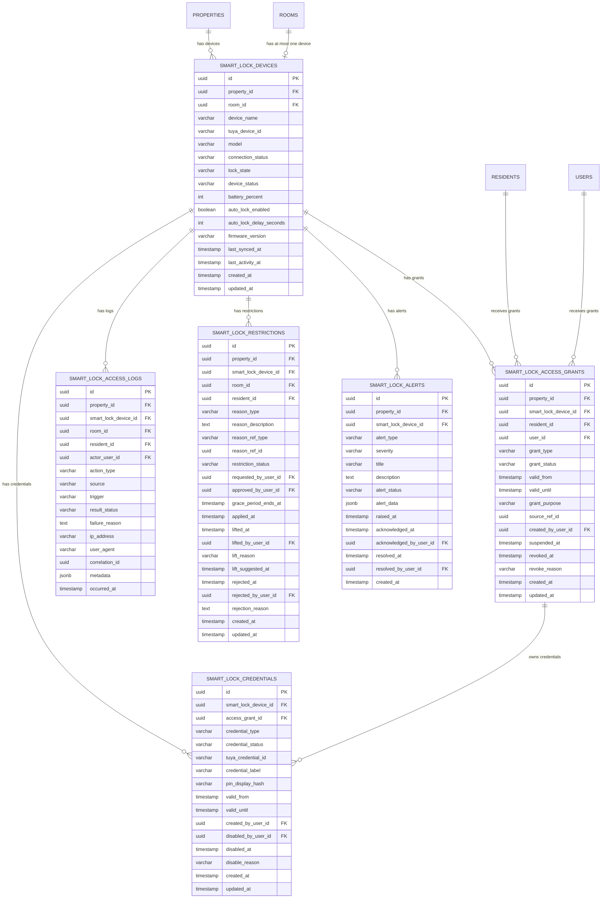
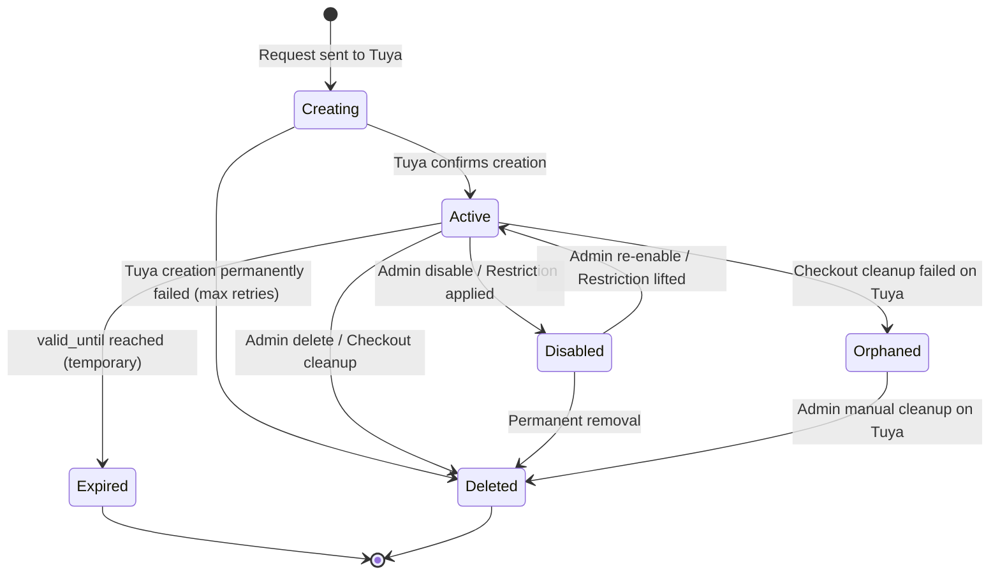

# SMART LOCK DATABASE PLAN — Granada Kost Platform

> **Versi**: 1.0  
> **Tanggal**: 19 Juni 2026  
> **Peran Pembuat**: Principal Database Architect — Smart Lock Context  
> **Status**: Dokumen Analisis Database — Dasar Migration Smart Lock Module  
> **Milestone**: 10B — Smart Lock Database Planning  
> **Dokumen Acuan**:  
> - [SMARTLOCK_DOMAIN.md](file:///d:/PROJECT%20CODING/Granada%20Kost%20Platform/docs/SMARTLOCK_DOMAIN.md)  
> - [DOMAIN_MODEL.md](file:///d:/PROJECT%20CODING/Granada%20Kost%20Platform/docs/DOMAIN_MODEL.md)  
> - [DATABASE_PLANNING.md](file:///d:/PROJECT%20CODING/Granada%20Kost%20Platform/docs/DATABASE_PLANNING.md)  
> - [BACKEND_ARCHITECTURE.md](file:///d:/PROJECT%20CODING/Granada%20Kost%20Platform/docs/BACKEND_ARCHITECTURE.md)  
> - [SECURITY_POLICY.md](file:///d:/PROJECT%20CODING/Granada%20Kost%20Platform/docs/SECURITY_POLICY.md)  
> - [NOTIFICATION_DOMAIN.md](file:///d:/PROJECT%20CODING/Granada%20Kost%20Platform/docs/NOTIFICATION_DOMAIN.md)  
> - [BILLING_DOMAIN.md](file:///d:/PROJECT%20CODING/Granada%20Kost%20Platform/docs/BILLING_DOMAIN.md)

---

## Daftar Isi

1. [Executive Summary](#1-executive-summary)
2. [Locked Decisions](#2-locked-decisions)
3. [Table Structure Evaluation](#3-table-structure-evaluation)
4. [Final Table List](#4-final-table-list)
5. [Table: `smart_lock_devices`](#5-table-smart_lock_devices)
6. [Table: `smart_lock_access_grants`](#6-table-smart_lock_access_grants)
7. [Table: `smart_lock_credentials`](#7-table-smart_lock_credentials)
8. [Table: `smart_lock_access_logs`](#8-table-smart_lock_access_logs)
9. [Table: `smart_lock_restrictions`](#9-table-smart_lock_restrictions)
10. [Table: `smart_lock_alerts`](#10-table-smart_lock_alerts)
11. [Constraint Strategy](#11-constraint-strategy)
12. [Foreign Key Strategy](#12-foreign-key-strategy)
13. [Index Strategy](#13-index-strategy)
14. [Device Status Strategy](#14-device-status-strategy)
15. [Access Credential Strategy](#15-access-credential-strategy)
16. [PIN Strategy](#16-pin-strategy)
17. [Card Strategy](#17-card-strategy)
18. [Fingerprint Strategy](#18-fingerprint-strategy)
19. [Restriction Strategy](#19-restriction-strategy)
20. [Grace Period Persistence Strategy](#20-grace-period-persistence-strategy)
21. [Temporary Access Strategy](#21-temporary-access-strategy)
22. [Technician Access Strategy](#22-technician-access-strategy)
23. [Guest Access Strategy](#23-guest-access-strategy)
24. [Doorbell Event Storage Strategy](#24-doorbell-event-storage-strategy)
25. [Remote Unlock Audit Strategy](#25-remote-unlock-audit-strategy)
26. [Notification Integration Strategy](#26-notification-integration-strategy)
27. [Occupancy Integration Strategy](#27-occupancy-integration-strategy)
28. [Billing Integration Strategy](#28-billing-integration-strategy)
29. [Tuya Mapping Strategy](#29-tuya-mapping-strategy)
30. [Device Capability Strategy](#30-device-capability-strategy)
31. [Development Seed Strategy](#31-development-seed-strategy)
32. [Production Seed Strategy](#32-production-seed-strategy)
33. [Migration Checklist](#33-migration-checklist)
34. [Risks Before Migration](#34-risks-before-migration)
35. [Verdict](#35-verdict)

---

## 1. Executive Summary

Dokumen ini menerjemahkan SMARTLOCK_DOMAIN.md (Milestone 10A, APPROVED) menjadi rencana database PostgreSQL untuk Smart Lock module. Dokumen ini **tidak menghasilkan migration, SQL, atau code** — hanya blueprint final untuk Milestone 10C (Migration).

### 1.1 Konteks

| Aspek | Status |
|---|---|
| **Milestone 10A** | ✅ APPROVED — SMARTLOCK_DOMAIN.md final |
| **Existing DB definitions** | DATABASE_PLANNING.md mendefinisikan 5 placeholder tables: `smart_lock_devices`, `smart_lock_access_grants`, `smart_lock_access_logs`, `smart_lock_restrictions`, `smart_lock_alerts` |
| **Milestone ini** | Mendetailkan kolom, constraint, index, credential model, dan seed data |
| **Output** | Blueprint siap untuk 10C Migration |

### 1.2 Scope

Milestone 10B mendefinisikan:
- Schema PostgreSQL untuk Smart Lock context (6 tables)
- Credential model (PIN, Card, Fingerprint) dalam unified table
- Redis keys untuk rate limiting, idempotency, offline queue
- Seed data untuk development dan production

Milestone 10B **TIDAK** mendefinisikan:
- Migration SQL / Prisma / TypeORM schema
- Application code / NestJS module
- Tuya API integration code
- API endpoint contracts

---

## 2. Locked Decisions

### 2.1 Dari Milestone 10A

| # | Decision | Nilai |
|---|---|---|
| SL-01 | Hardware model | PALOMA DLP 2131 |
| SL-02 | Integration platform | Tuya Cloud API |
| SL-03 | Command routing | Backend only |
| SL-04 | Secret management | Environment variables only |
| SL-05 | Audit requirement | All actions (21 types) |
| SL-06 | Restriction automation | NOT automatic — approval workflow |
| SL-07 | Property owner access | Read-only, NO command |
| SL-08 | Notification | Via existing Notification Module |
| SL-09 | Admin PIN management | Can change, disable |
| SL-10 | Admin card management | Can disable |
| SL-11 | Admin fingerprint management | Can disable |
| SL-12 | Credential storage | Metadata only |
| SL-13 | Anti-corruption layer | TuyaGateway interface |
| SL-14 | Event-driven coupling | Outbox events for cross-context |
| SL-15 | Grace period | 24h between approval and application |

### 2.2 Open Business Decisions (Now Resolved)

| # | Decision | Final Value | Impact on DB |
|---|---|---|---|
| OBD-SL-01 | PIN generation | **System-generated random** | No `pin_value` column; PIN generated at runtime, displayed once, stored only on Tuya |
| OBD-SL-02 | Resident PIN visibility | **Can view in PWA, reveal action audited** | `pin_display_hash` column for secure one-time view; audit trail required |
| OBD-SL-03 | Grace period | **24 jam** | `grace_period_ends_at` column on restrictions table |
| OBD-SL-04 | Restriction lift | **Auto-suggest + admin confirmation** | No auto-lift; `lift_suggested_at` column for tracking suggestion |
| OBD-SL-05 | Normal open mode | **Owner + Manager only** | Application-level RBAC enforcement, no DB impact |
| OBD-SL-06 | Device status sync | **5 menit** | No DB impact — scheduled job interval, not stored |
| OBD-SL-07 | Max active PIN | **Device limit (not hardcoded)** | No `max_pin` column on device; application queries Tuya for capacity |

### 2.3 Dari DATABASE_PLANNING.md Conventions

| Convention | Rule |
|---|---|
| Table names | English, plural, snake_case, prefixed `smart_lock_` |
| Primary key | `id` as UUID |
| Foreign key | Singular table name + `_id` |
| Timestamps | `created_at`, `updated_at` |
| External IDs | `tuya_` prefix |
| Status columns | Explicit status name |
| Enum values | Lowercase snake_case |
| Money | Integer minor unit (IDR) |
| Multi-property | `property_id` wajib pada semua operational tables |

---

## 3. Table Structure Evaluation

### 3.1 Evaluation Matrix

User request meminta evaluasi 7 kandidat tabel. Berikut analisis lengkap:

| Kandidat Tabel | Keputusan | Justifikasi |
|---|---|---|
| **`smart_lock_devices`** | ✅ **Gunakan** | Core table — metadata device per room. Sudah didefinisikan di DATABASE_PLANNING.md. |
| **`smart_lock_access_credentials`** | ✅ **Gunakan** (rename → `smart_lock_credentials`) | Unified credential table untuk PIN, Card, Fingerprint. Satu tabel untuk semua credential types karena semua memiliki lifecycle serupa (create → active → disable → delete). Menghindari 3 tabel terpisah yang redundan. |
| **`smart_lock_access_histories`** | ✅ **Gunakan** (rename → `smart_lock_access_logs`) | Konsisten dengan DATABASE_PLANNING.md naming. Menyimpan setiap lock/unlock/doorbell/failed attempt event. |
| **`smart_lock_restrictions`** | ✅ **Gunakan** | Restriction workflow (pending → approved → applied → lifted). Full lifecycle tracking termasuk grace period. |
| **`smart_lock_events`** | ❌ **Tidak digunakan** | Doorbell events, battery events, dan status events disimpan di `smart_lock_access_logs` (untuk actions) dan `smart_lock_alerts` (untuk alerts). Tabel `smart_lock_events` terpisah menduplikasi storage tanpa value. |
| **`smart_lock_temporary_access`** | ❌ **Tidak digunakan** | Temporary access (technician, guest, inspection) disimpan sebagai `smart_lock_access_grants` dengan `grant_type = 'temporary'` dan explicit `valid_until`. Tabel terpisah tidak diperlukan karena structure identik dengan access grants. |
| **`smart_lock_sync_logs`** | ❌ **Tidak digunakan** | Device sync logs bersifat ephemeral — cukup di application log (structured log). Periodic sync setiap 5 menit menghasilkan volume tinggi tanpa business value di PostgreSQL. Jika monitoring diperlukan, gunakan `smart_lock_alerts` untuk sync failures. |

### 3.2 Rejected Alternative: Separate Tables per Credential Type

Membuat `smart_lock_pins`, `smart_lock_cards`, `smart_lock_fingerprints`:
- ❌ 3 tabel dengan 80% kolom identik (device_id, access_grant_id, status, created_at, dll.)
- ❌ Cross-credential query (disable all credentials for restriction) memerlukan 3 UPDATE statements
- ❌ Future credential type (face recognition) memerlukan tabel baru
- ❌ Application layer perlu 3 repository/service untuk operasi yang semantically identik

**Verdict: Unified `smart_lock_credentials` table dengan `credential_type` discriminator lebih baik.**

### 3.3 Rejected Alternative: smart_lock_events as Separate Table

- ❌ Doorbell events sudah di-log di `smart_lock_access_logs` (`action_type = 'doorbell_ring'`)
- ❌ Battery/offline events sudah di-record di `smart_lock_alerts` (alert_type + severity)
- ❌ Tuya webhook events di-process dan di-translate ke domain records, bukan raw-stored
- ❌ Menambah join/complexity untuk queries yang sudah tersedia di existing tables

**Verdict: Tidak perlu tabel terpisah — events diproses ke access_logs + alerts.**

### 3.4 Existing Tables Referenced (Not Created by This Module)

| Table | Module Owner | Referenced By Smart Lock |
|---|---|---|
| `properties` | Property module | FK: `smart_lock_devices.property_id` |
| `rooms` | Room module | FK: `smart_lock_devices.room_id` |
| `residents` | Resident module | FK: `smart_lock_access_grants.resident_id` |
| `users` | IAM module | FK: actor columns (created_by, approved_by, etc.) |
| `audit_logs` | Audit module | Generic audit entries for config changes |
| `notifications` | Notification module | Smart Lock events produce notifications (consumer, not owner) |
| `business_events` | Outbox | Smart Lock consumes events, does not own outbox table |

---

## 4. Final Table List

### 4.1 Phase 1 — Smart Lock Tables

| # | Table | Type | Purpose |
|---|---|---|---|
| 1 | **`smart_lock_devices`** | New table | Device metadata per room |
| 2 | **`smart_lock_access_grants`** | New table | Access rights per user per device |
| 3 | **`smart_lock_credentials`** | New table | Unified PIN/Card/Fingerprint credentials |
| 4 | **`smart_lock_access_logs`** | New table | All lock/unlock/doorbell/audit events |
| 5 | **`smart_lock_restrictions`** | New table | Restriction lifecycle (billing/manual/security) |
| 6 | **`smart_lock_alerts`** | New table | Battery/offline/security alerts |

### 4.2 Redis Keys (Non-PostgreSQL)

| # | Key Pattern | Purpose | TTL |
|---|---|---|---|
| R1 | `sl:rate:{user_id}:{device_id}:{action}` | Rate limit counters | Sliding window (5 min) |
| R2 | `sl:cmd:{device_id}:{action}:{correlation_id}` | Command idempotency | 5 min |
| R3 | `sl:pin:create:{device_id}:{access_grant_id}` | PIN creation idempotency | 24h |
| R4 | `sl:pin:delete:{device_id}:{credential_id}` | PIN deletion idempotency | 24h |
| R5 | `sl:restrict:{restriction_id}` | Restriction apply idempotency | 24h |
| R6 | `sl:offline_queue:{device_id}` | Queued commands for offline devices | 72h |
| R7 | `sl:grace:{restriction_id}` | Grace period timer | 24h |
| R8 | `sl:doorbell:throttle:{device_id}` | Doorbell notification rate limit | 30s |
| R9 | `sl:sync:lock:{device_id}` | Prevent concurrent sync for same device | 60s |

### 4.3 Entity Relationship Diagram



---

## 5. Table: `smart_lock_devices`

### 5.1 Purpose

Menyimpan metadata setiap Smart Lock device yang terpasang di kamar. Satu room paling banyak satu device aktif. Tabel ini adalah aggregate root untuk Smart Lock bounded context.

### 5.2 Column Specification

| # | Column | Type | Nullable | Default | Keterangan |
|---|---|---|---|---|---|
| 1 | `id` | `UUID` | NOT NULL | `gen_random_uuid()` | Primary key |
| 2 | `property_id` | `UUID` | NOT NULL | — | FK → `properties.id` |
| 3 | `room_id` | `UUID` | NOT NULL | — | FK → `rooms.id`. Unique active device per room |
| 4 | `device_name` | `VARCHAR(200)` | NOT NULL | — | Human-readable: "Lock Kamar 101" |
| 5 | `tuya_device_id` | `VARCHAR(100)` | NOT NULL | — | Device ID pada Tuya Cloud. Globally unique. |
| 6 | `model` | `VARCHAR(100)` | NULL | `'PALOMA DLP 2131'` | Device model identifier |
| 7 | `connection_status` | `VARCHAR(20)` | NOT NULL | `'unknown'` | `online`, `offline`, `unknown` |
| 8 | `lock_state` | `VARCHAR(20)` | NOT NULL | `'unknown'` | `locked`, `unlocked`, `unknown` |
| 9 | `device_status` | `VARCHAR(20)` | NOT NULL | `'provisioned'` | `provisioned`, `active`, `maintenance`, `decommissioned` |
| 10 | `battery_percent` | `SMALLINT` | NULL | — | 0–100. NULL jika belum di-sync. |
| 11 | `auto_lock_enabled` | `BOOLEAN` | NOT NULL | `true` | Device auto-lock setting |
| 12 | `auto_lock_delay_seconds` | `SMALLINT` | NOT NULL | `5` | Detik sebelum auto-lock triggers |
| 13 | `firmware_version` | `VARCHAR(50)` | NULL | — | For tracking firmware updates |
| 14 | `normal_open_mode` | `BOOLEAN` | NOT NULL | `false` | Passage mode — door stays unlocked |
| 15 | `last_synced_at` | `TIMESTAMP WITH TIME ZONE` | NULL | — | Last successful status sync |
| 16 | `last_activity_at` | `TIMESTAMP WITH TIME ZONE` | NULL | — | Last lock/unlock/doorbell activity |
| 17 | `commissioned_at` | `TIMESTAMP WITH TIME ZONE` | NULL | — | When device was activated for use |
| 18 | `decommissioned_at` | `TIMESTAMP WITH TIME ZONE` | NULL | — | When device was taken out of service |
| 19 | `created_at` | `TIMESTAMP WITH TIME ZONE` | NOT NULL | `NOW()` | Record creation |
| 20 | `updated_at` | `TIMESTAMP WITH TIME ZONE` | NOT NULL | `NOW()` | Last update |

### 5.3 Design Decisions

| Decision | Rationale |
|---|---|
| **No `deleted_at` soft-delete** | Devices use `device_status = 'decommissioned'` + `decommissioned_at` for lifecycle end. Physical devices are never truly "deleted" — their audit trail must persist. |
| **`connection_status` vs `lock_state` separated** | A device can be `offline` but its last known `lock_state` is still `locked`. These are independent dimensions. |
| **`device_status` separate from `connection_status`** | `device_status` tracks lifecycle (provisioned → active → decommissioned). `connection_status` tracks real-time connectivity. |
| **`normal_open_mode` boolean** | Passage mode is a binary state. Tracked here because it's a security-sensitive setting that needs audit. |
| **`battery_percent` SMALLINT nullable** | Nullable because new devices haven't synced yet. SMALLINT (2 bytes) sufficient for 0–100 range. |
| **No `max_pin_slots` column** | OBD-SL-07: follows device limit, not hardcoded. Application queries Tuya for capacity when needed. |

### 5.4 Volume Estimation

| Scenario | Volume |
|---|---|
| Current (163 rooms) | ≤ 163 rows |
| Growth (300 rooms, multi-property) | ≤ 300 rows |
| Decommissioned devices (accumulation over years) | +50 rows/year |

> Extremely small table. Zero performance concern.

---

## 6. Table: `smart_lock_access_grants`

### 6.1 Purpose

Menyimpan hak akses user ke device. Satu penghuni = satu active grant per device. Juga digunakan untuk technician access, temporary access, dan master/admin access.

### 6.2 Column Specification

| # | Column | Type | Nullable | Default | Keterangan |
|---|---|---|---|---|---|
| 1 | `id` | `UUID` | NOT NULL | `gen_random_uuid()` | Primary key |
| 2 | `property_id` | `UUID` | NOT NULL | — | FK → `properties.id` |
| 3 | `smart_lock_device_id` | `UUID` | NOT NULL | — | FK → `smart_lock_devices.id` |
| 4 | `resident_id` | `UUID` | NULL | — | FK → `residents.id`. NULL for staff/technician grants |
| 5 | `user_id` | `UUID` | NOT NULL | — | FK → `users.id`. The user receiving access |
| 6 | `grant_type` | `VARCHAR(30)` | NOT NULL | — | `resident`, `technician`, `temporary`, `master` |
| 7 | `grant_status` | `VARCHAR(20)` | NOT NULL | `'active'` | `active`, `suspended`, `revoked`, `expired` |
| 8 | `valid_from` | `TIMESTAMP WITH TIME ZONE` | NOT NULL | `NOW()` | When access starts |
| 9 | `valid_until` | `TIMESTAMP WITH TIME ZONE` | NULL | — | When access ends. NULL = indefinite (resident follows occupancy) |
| 10 | `grant_purpose` | `VARCHAR(100)` | NULL | — | Purpose: `checkin_access`, `work_order`, `inspection`, `cleaning`, `guest_visit`, `emergency`, `master_access` |
| 11 | `source_ref_type` | `VARCHAR(50)` | NULL | — | Reference type: `occupancy`, `work_order`, `checkout_request` |
| 12 | `source_ref_id` | `UUID` | NULL | — | ID of related entity (occupancy_id, work_order_id) |
| 13 | `created_by_user_id` | `UUID` | NOT NULL | — | FK → `users.id`. Who created this grant |
| 14 | `suspended_at` | `TIMESTAMP WITH TIME ZONE` | NULL | — | When grant was suspended (restriction) |
| 15 | `revoked_at` | `TIMESTAMP WITH TIME ZONE` | NULL | — | When grant was revoked |
| 16 | `revoke_reason` | `VARCHAR(50)` | NULL | — | `checkout`, `restriction`, `manual_admin`, `security_incident`, `expired` |
| 17 | `created_at` | `TIMESTAMP WITH TIME ZONE` | NOT NULL | `NOW()` | Record creation |
| 18 | `updated_at` | `TIMESTAMP WITH TIME ZONE` | NOT NULL | `NOW()` | Last update |

### 6.3 Design Decisions

| Decision | Rationale |
|---|---|
| **`resident_id` nullable** | Staff/technician grants don't have a resident_id, only user_id. Resident grants have both. |
| **`valid_until` nullable** | Resident grants follow occupancy lifetime — revoked on checkout, not time-expired. Temporary/technician grants have explicit `valid_until`. |
| **`grant_purpose` column** | Enables audit and reporting: "why was this access granted?" Different from `grant_type` which is structural. |
| **`source_ref_type` + `source_ref_id`** | Polymorphic reference to the entity that triggered grant creation (occupancy, work order). Enables cross-domain tracing. |
| **No separate temporary access table** | Temporary access = access grant with `grant_type = 'temporary'` and explicit `valid_until`. Same lifecycle, same structure. |
| **No separate technician access table** | Technician access = access grant with `grant_type = 'technician'` and explicit `valid_until`. Same lifecycle. |

### 6.4 Volume Estimation

| Scenario | Active Rows | Historical (accumulated) |
|---|---|---|
| 163 rooms occupied | ~163 resident grants + ~5 master grants | — |
| + temporary grants/month | ~20–30/month | ~240–360/year |
| **Steady state** | **~200 active** | **~500/year accumulated** |

---

## 7. Table: `smart_lock_credentials`

### 7.1 Purpose

Unified table untuk semua credential types (PIN, Card, Fingerprint) yang terdaftar pada Smart Lock devices. Setiap credential terkait dengan satu access grant dan satu device.

### 7.2 Column Specification

| # | Column | Type | Nullable | Default | Keterangan |
|---|---|---|---|---|---|
| 1 | `id` | `UUID` | NOT NULL | `gen_random_uuid()` | Primary key |
| 2 | `smart_lock_device_id` | `UUID` | NOT NULL | — | FK → `smart_lock_devices.id` |
| 3 | `access_grant_id` | `UUID` | NULL | — | FK → `smart_lock_access_grants.id`. NULL for master credentials |
| 4 | `credential_type` | `VARCHAR(20)` | NOT NULL | — | `pin`, `card`, `fingerprint` |
| 5 | `credential_status` | `VARCHAR(20)` | NOT NULL | `'creating'` | `creating`, `active`, `disabled`, `expired`, `deleted`, `orphaned` |
| 6 | `tuya_credential_id` | `VARCHAR(200)` | NULL | — | Tuya's internal credential identifier (password_id, card_id, fingerprint_id) |
| 7 | `credential_label` | `VARCHAR(200)` | NOT NULL | — | Human-readable: "PIN Kamar 101 - Andi", "Kartu Utama - Budi" |
| 8 | `pin_display_hash` | `VARCHAR(255)` | NULL | — | Hashed PIN value for resident's secure-reveal feature (PIN type only). bcrypt hash. |
| 9 | `valid_from` | `TIMESTAMP WITH TIME ZONE` | NOT NULL | `NOW()` | When credential becomes active |
| 10 | `valid_until` | `TIMESTAMP WITH TIME ZONE` | NULL | — | When credential expires. NULL = indefinite (follows access grant lifetime) |
| 11 | `finger_index` | `VARCHAR(30)` | NULL | — | Fingerprint only: `right_index`, `right_thumb`, `left_index`, etc. |
| 12 | `card_number_masked` | `VARCHAR(20)` | NULL | — | Card only: masked card UID "****3A7B" |
| 13 | `created_by_user_id` | `UUID` | NOT NULL | — | FK → `users.id`. Creator (admin or system) |
| 14 | `disabled_at` | `TIMESTAMP WITH TIME ZONE` | NULL | — | When credential was disabled |
| 15 | `disabled_by_user_id` | `UUID` | NULL | — | FK → `users.id`. Who disabled |
| 16 | `disable_reason` | `VARCHAR(50)` | NULL | — | `restriction`, `manual_admin`, `checkout`, `security_incident`, `replaced` |
| 17 | `created_at` | `TIMESTAMP WITH TIME ZONE` | NOT NULL | `NOW()` | Record creation |
| 18 | `updated_at` | `TIMESTAMP WITH TIME ZONE` | NOT NULL | `NOW()` | Last update |

### 7.3 Design Decisions

| Decision | Rationale |
|---|---|
| **Unified table (not per-type)** | Section 3.2 justification. All credential types share 80%+ columns and identical lifecycle. |
| **`credential_status` includes `creating`** | Tuya API call can fail mid-creation. `creating` status allows retry without duplicate. Transitions: `creating → active` on Tuya success, `creating → deleted` on permanent failure. |
| **`credential_status` includes `orphaned`** | When checkout cleanup fails to delete credential from device, status = `orphaned` alerts admin for manual cleanup. |
| **`pin_display_hash` for secure reveal** | OBD-SL-02: resident can view PIN in PWA. PIN value is stored as bcrypt hash for verification. The actual 6-digit PIN is generated, sent to Tuya, shown to resident once (or on reveal), and the hash is stored for the reveal feature. Application encrypts PIN with a server-side key for retrieval during reveal. |
| **`finger_index` nullable** | Only populated for fingerprint credentials. `right_index`, `left_thumb`, etc. Enables "which finger is this?" display. |
| **`card_number_masked` nullable** | Only populated for card credentials. Masked UID for admin identification without storing full card number. |
| **`access_grant_id` nullable** | Master credentials (permanent admin PINs) may not be tied to a specific access grant. |
| **No raw PIN value storage** | PIN value is generated at runtime, sent to Tuya, and the hash is stored. Never stored as plaintext. |

### 7.4 PIN Reveal Strategy (OBD-SL-02)

```
PIN Creation Flow:
├── 1. Generate random 6-digit PIN
├── 2. Send to Tuya: createTempPassword(device_id, pin, validFrom, validUntil)
├── 3. Tuya returns: tuya_password_id
├── 4. Encrypt PIN with server-side AES-256 key → encrypted_pin
├── 5. Store in Redis: sl:pin:reveal:{credential_id} = encrypted_pin (TTL: 365 days)
├── 6. Store pin_display_hash = bcrypt(pin) in database
└── 7. Return PIN to admin (display once)

PIN Reveal Flow (Resident PWA):
├── 1. Resident requests: GET /penghuni/smart-lock/my-pin
├── 2. Backend checks: active access_grant, not restricted
├── 3. Retrieve encrypted_pin from Redis: sl:pin:reveal:{credential_id}
├── 4. Decrypt with server-side key → pin_value
├── 5. Audit log: pin_reveal (actor = resident)
└── 6. Return PIN to resident (masked until explicit reveal action)
```

| Storage | Data | Keterangan |
|---|---|---|
| **PostgreSQL** | `pin_display_hash` (bcrypt) | For verification only |
| **Redis** | `sl:pin:reveal:{credential_id}` = AES-encrypted PIN | For secure reveal; TTL = 1 year |
| **Tuya** | Actual PIN on device | Physical lock behavior |

### 7.5 Volume Estimation

| Scenario | Volume |
|---|---|
| 163 rooms × 1 PIN per resident | ~163 PIN credentials |
| + master PINs (1 per device) | +163 master credentials |
| + cards (~30% adoption) | +50 card credentials |
| + fingerprints (~20% adoption) | +33 fingerprint credentials |
| + temporary PINs (accumulated) | +30/month → ~360/year |
| **Active credentials** | **~410** |
| **Accumulated (year)** | **~770** |

---

## 8. Table: `smart_lock_access_logs`

### 8.1 Purpose

Write-optimized audit trail untuk setiap Smart Lock event: lock, unlock, doorbell, failed attempt, sync, restrict, emergency. Ini adalah tabel dengan volume tertinggi di Smart Lock context.

### 8.2 Column Specification

| # | Column | Type | Nullable | Default | Keterangan |
|---|---|---|---|---|---|
| 1 | `id` | `UUID` | NOT NULL | `gen_random_uuid()` | Primary key |
| 2 | `property_id` | `UUID` | NOT NULL | — | FK → `properties.id` |
| 3 | `smart_lock_device_id` | `UUID` | NOT NULL | — | FK → `smart_lock_devices.id` |
| 4 | `room_id` | `UUID` | NOT NULL | — | FK → `rooms.id` (denormalized for query performance) |
| 5 | `resident_id` | `UUID` | NULL | — | FK → `residents.id`. NULL for admin/system actions |
| 6 | `actor_user_id` | `UUID` | NULL | — | FK → `users.id`. NULL for device-initiated events (doorbell, auto-lock) |
| 7 | `action_type` | `VARCHAR(30)` | NOT NULL | — | See Section 8.3 |
| 8 | `source` | `VARCHAR(30)` | NOT NULL | — | See Section 8.3 |
| 9 | `trigger` | `VARCHAR(30)` | NULL | — | `manual`, `doorbell`, `auto_lock`, `schedule`, `checkout_workflow`, `restriction_workflow` |
| 10 | `result_status` | `VARCHAR(20)` | NOT NULL | — | `success`, `failed`, `denied`, `timeout`, `device_offline`, `queued` |
| 11 | `failure_reason` | `TEXT` | NULL | — | Safe error message (no raw Tuya response) |
| 12 | `credential_type_used` | `VARCHAR(20)` | NULL | — | `pin`, `card`, `fingerprint`, `remote`, `auto_lock` |
| 13 | `ip_address` | `VARCHAR(45)` | NULL | — | Request IP (IPv6 max 45 chars) |
| 14 | `user_agent` | `VARCHAR(500)` | NULL | — | Request user agent |
| 15 | `correlation_id` | `UUID` | NULL | — | Request/event correlation |
| 16 | `metadata` | `JSONB` | NULL | — | Extra context: `{ "battery_before": 85, "command_latency_ms": 230 }` |
| 17 | `occurred_at` | `TIMESTAMP WITH TIME ZONE` | NOT NULL | `NOW()` | When event occurred |

### 8.3 Action Type and Source Values

| action_type Values | Keterangan |
|---|---|
| `lock` | Door locked |
| `unlock` | Door unlocked (any method) |
| `remote_unlock` | Remote unlock via app/dashboard |
| `emergency_unlock` | Emergency override unlock |
| `doorbell_ring` | Doorbell pressed |
| `failed_attempt` | Wrong PIN/card/fingerprint |
| `sync_status` | Status sync from Tuya |
| `restrict` | Credentials disabled (restriction applied) |
| `unrestrict` | Credentials re-enabled (restriction lifted) |
| `normal_open_mode_on` | Passage mode enabled |
| `normal_open_mode_off` | Passage mode disabled |
| `credential_created` | PIN/card/fingerprint created |
| `credential_disabled` | Credential disabled |
| `credential_deleted` | Credential deleted |
| `pin_revealed` | Resident viewed their PIN (audit for OBD-SL-02) |

| source Values | Keterangan |
|---|---|
| `resident_app` | Penghuni PWA |
| `admin_dashboard` | Admin/Manager/Owner web app |
| `auto_lock` | Device auto-lock feature |
| `device` | Physical device (doorbell, local PIN entry) |
| `system` | Backend automation (checkout, restriction) |
| `billing_system` | Triggered by billing event |
| `checkout_workflow` | Part of checkout process |
| `maintenance` | Maintenance access |
| `emergency_override` | Emergency action |

### 8.4 Design Decisions

| Decision | Rationale |
|---|---|
| **No `updated_at`** | Access logs are immutable append-only records. No updates after creation. |
| **No `created_at` (uses `occurred_at`)** | Event timestamp IS the creation timestamp. Separate `created_at` is redundant. |
| **`room_id` denormalized** | Avoids JOIN to `smart_lock_devices` for the most common query pattern (filter by room). Room changes are rare (device reassignment). |
| **`metadata` JSONB** | Flexible extra data: battery level, command latency, Tuya response code (sanitized). Not used for primary filtering. |
| **`credential_type_used` column** | For access events, records which credential was used (PIN, card, fingerprint, remote). Useful for security analytics. |
| **No FK on `resident_id` and `actor_user_id`** | These are nullable and reference potentially deactivated users/residents. Soft reference — application layer validates. Avoids FK constraint complications with audit log immutability. |
| **Doorbell events in this table** | `action_type = 'doorbell_ring'`, `source = 'device'`, `result_status = 'success'`. No separate table needed. |
| **PIN reveal audit in this table** | `action_type = 'pin_revealed'`, `source = 'resident_app'`. Tracks OBD-SL-02 compliance. |

### 8.5 Volume Estimation

| Event Type | Volume/day | Keterangan |
|---|---|---|
| Lock/unlock events | ~500–800 | ~3–5 per room per day |
| Doorbell events | ~20–50 | Sporadic |
| Auto-lock events | ~300–500 | After every unlock |
| Sync status | ~4,700 | 163 devices × ~29 syncs/day (every 5 min) |
| Failed attempts | ~5–20 | Hopefully rare |
| Credential operations | ~2–5 | Check-in/out days |
| **Total/day** | **~5,500–6,000** |
| **Total/month** | **~170,000** |
| **Total/year** | **~2,000,000** |

> This is the largest table. At ~2M rows/year, still comfortable for PostgreSQL. Consider retention policy after 2+ years.

### 8.6 Retention Strategy

| Strategy | Value | Keterangan |
|---|---|---|
| Hot data | 6 months | Full query capability |
| Warm data | 6–24 months | Available but slower queries |
| Cold data | > 24 months | Archive to separate table or delete |
| Sync status events | 90 days | High volume, low audit value after initial period |

---

## 9. Table: `smart_lock_restrictions`

### 9.1 Purpose

Menyimpan lifecycle restriction dari request hingga lift/reject. Termasuk grace period tracking, approval workflow, dan billing reference.

### 9.2 Column Specification

| # | Column | Type | Nullable | Default | Keterangan |
|---|---|---|---|---|---|
| 1 | `id` | `UUID` | NOT NULL | `gen_random_uuid()` | Primary key |
| 2 | `property_id` | `UUID` | NOT NULL | — | FK → `properties.id` |
| 3 | `smart_lock_device_id` | `UUID` | NOT NULL | — | FK → `smart_lock_devices.id` |
| 4 | `room_id` | `UUID` | NOT NULL | — | FK → `rooms.id` (denormalized) |
| 5 | `resident_id` | `UUID` | NOT NULL | — | FK → `residents.id`. The restricted resident |
| 6 | `reason_type` | `VARCHAR(30)` | NOT NULL | — | `billing_overdue`, `manual_admin`, `security_incident`, `checkout_completed` |
| 7 | `reason_description` | `TEXT` | NOT NULL | — | "Tagihan Kamar 202 overdue 24 hari" |
| 8 | `reason_ref_type` | `VARCHAR(50)` | NULL | — | `invoice`, `complaint`, `checkout_request` |
| 9 | `reason_ref_id` | `UUID` | NULL | — | ID of related entity |
| 10 | `restriction_status` | `VARCHAR(30)` | NOT NULL | `'pending_approval'` | `pending_approval`, `approved`, `applied`, `rejected`, `lifted`, `cancelled` |
| 11 | `requested_by_user_id` | `UUID` | NOT NULL | — | FK → `users.id`. Admin who requested |
| 12 | `approved_by_user_id` | `UUID` | NULL | — | FK → `users.id`. Owner/Manager who approved |
| 13 | `approved_at` | `TIMESTAMP WITH TIME ZONE` | NULL | — | When approved |
| 14 | `grace_period_ends_at` | `TIMESTAMP WITH TIME ZONE` | NULL | — | `approved_at + 24h`. When restriction will auto-apply |
| 15 | `applied_at` | `TIMESTAMP WITH TIME ZONE` | NULL | — | When credentials actually disabled on device |
| 16 | `lifted_at` | `TIMESTAMP WITH TIME ZONE` | NULL | — | When restriction lifted |
| 17 | `lifted_by_user_id` | `UUID` | NULL | — | FK → `users.id` |
| 18 | `lift_reason` | `VARCHAR(50)` | NULL | — | `payment_cleared`, `manual_override`, `checkout` |
| 19 | `lift_suggested_at` | `TIMESTAMP WITH TIME ZONE` | NULL | — | When system auto-suggested lift (OBD-SL-04) |
| 20 | `rejected_at` | `TIMESTAMP WITH TIME ZONE` | NULL | — | When rejected |
| 21 | `rejected_by_user_id` | `UUID` | NULL | — | FK → `users.id` |
| 22 | `rejection_reason` | `TEXT` | NULL | — | Why rejected |
| 23 | `cancelled_at` | `TIMESTAMP WITH TIME ZONE` | NULL | — | When cancelled (payment during grace) |
| 24 | `cancel_reason` | `VARCHAR(50)` | NULL | — | `payment_received`, `requestor_cancelled` |
| 25 | `created_at` | `TIMESTAMP WITH TIME ZONE` | NOT NULL | `NOW()` | Record creation |
| 26 | `updated_at` | `TIMESTAMP WITH TIME ZONE` | NOT NULL | `NOW()` | Last update |

### 9.3 Design Decisions

| Decision | Rationale |
|---|---|
| **`grace_period_ends_at`** | Persistence of grace period deadline. Redis timer (R7) handles execution, but DB stores the business deadline for queries and display. |
| **`lift_suggested_at`** | OBD-SL-04: auto-suggest + admin confirmation. This timestamp records when system suggested lift (on payment.verified event). Admin then confirms via lift action. |
| **`cancelled_at` + `cancel_reason`** | Payment during grace period cancels restriction before it's applied. Different from rejection (which is by approver) and lift (which is after application). |
| **Multiple restrictions per resident allowed** | A resident can have both `billing_overdue` and `security_incident` restrictions simultaneously. Each has independent lifecycle. |
| **Polymorphic `reason_ref_type` + `reason_ref_id`** | References the trigger entity (invoice, complaint) without formal FK. Same pattern as notification domain. |

---

## 10. Table: `smart_lock_alerts`

### 10.1 Purpose

Menyimpan alerts untuk battery warnings, device offline, failed attempt sequences, and normal open mode warnings. Alerts are separate from access logs because they have a lifecycle (raised → acknowledged → resolved).

### 10.2 Column Specification

| # | Column | Type | Nullable | Default | Keterangan |
|---|---|---|---|---|---|
| 1 | `id` | `UUID` | NOT NULL | `gen_random_uuid()` | Primary key |
| 2 | `property_id` | `UUID` | NOT NULL | — | FK → `properties.id` |
| 3 | `smart_lock_device_id` | `UUID` | NOT NULL | — | FK → `smart_lock_devices.id` |
| 4 | `alert_type` | `VARCHAR(30)` | NOT NULL | — | `battery_warning`, `battery_critical`, `device_offline`, `device_online`, `failed_attempts`, `normal_open_mode_active`, `sync_failed` |
| 5 | `severity` | `VARCHAR(10)` | NOT NULL | — | `info`, `warning`, `danger` |
| 6 | `title` | `VARCHAR(300)` | NOT NULL | — | "Battery rendah pada Lock Kamar 101: 18%" |
| 7 | `description` | `TEXT` | NULL | — | Detailed alert information |
| 8 | `alert_status` | `VARCHAR(20)` | NOT NULL | `'active'` | `active`, `acknowledged`, `resolved`, `auto_resolved` |
| 9 | `alert_data` | `JSONB` | NULL | — | Extra context: `{ "battery_percent": 18, "previous_percent": 22 }` |
| 10 | `raised_at` | `TIMESTAMP WITH TIME ZONE` | NOT NULL | `NOW()` | When alert was raised |
| 11 | `acknowledged_at` | `TIMESTAMP WITH TIME ZONE` | NULL | — | When admin acknowledged |
| 12 | `acknowledged_by_user_id` | `UUID` | NULL | — | FK → `users.id` |
| 13 | `resolved_at` | `TIMESTAMP WITH TIME ZONE` | NULL | — | When resolved (battery replaced, device online, etc.) |
| 14 | `resolved_by_user_id` | `UUID` | NULL | — | FK → `users.id`. NULL for auto-resolved |
| 15 | `created_at` | `TIMESTAMP WITH TIME ZONE` | NOT NULL | `NOW()` | Record creation |

### 10.3 Design Decisions

| Decision | Rationale |
|---|---|
| **`alert_status` lifecycle** | Alerts go through: `active → acknowledged → resolved`. `auto_resolved` for alerts that resolve themselves (device back online). |
| **`alert_data` JSONB** | Flexible data: battery percentage, number of failed attempts, duration offline. Different per `alert_type`. |
| **No `updated_at`** | Alerts are event-sourced: raised_at, acknowledged_at, resolved_at are the timestamps. No generic "updated" needed. |
| **`device_online` alert type** | Counter-alert to `device_offline`. Auto-resolves the corresponding offline alert. |
| **Deduplication** | Application layer prevents duplicate active alerts (e.g., don't create another `battery_warning` if one is already active for this device). |

---

## 11. Constraint Strategy

### 11.1 Primary Key Constraints

| Table | PK | Type |
|---|---|---|
| `smart_lock_devices` | `id` | UUID |
| `smart_lock_access_grants` | `id` | UUID |
| `smart_lock_credentials` | `id` | UUID |
| `smart_lock_access_logs` | `id` | UUID |
| `smart_lock_restrictions` | `id` | UUID |
| `smart_lock_alerts` | `id` | UUID |

### 11.2 Unique Constraints

| Table | Constraint Name | Columns | Condition | Keterangan |
|---|---|---|---|---|
| `smart_lock_devices` | `uq_sld_room_active` | `(room_id)` | `WHERE device_status NOT IN ('decommissioned')` | One active device per room (partial unique) |
| `smart_lock_devices` | `uq_sld_tuya_device_id` | `(tuya_device_id)` | — | Tuya device ID globally unique |
| `smart_lock_access_grants` | `uq_slag_resident_device_active` | `(resident_id, smart_lock_device_id)` | `WHERE grant_status = 'active' AND grant_type = 'resident'` | One active resident grant per device (partial unique) |

### 11.3 Check Constraints

| Table | Constraint Name | Expression | Keterangan |
|---|---|---|---|
| `smart_lock_devices` | `chk_sld_connection_status` | `connection_status IN ('online', 'offline', 'unknown')` | |
| `smart_lock_devices` | `chk_sld_lock_state` | `lock_state IN ('locked', 'unlocked', 'unknown')` | |
| `smart_lock_devices` | `chk_sld_device_status` | `device_status IN ('provisioned', 'active', 'maintenance', 'decommissioned')` | |
| `smart_lock_devices` | `chk_sld_battery` | `battery_percent IS NULL OR (battery_percent >= 0 AND battery_percent <= 100)` | |
| `smart_lock_access_grants` | `chk_slag_grant_type` | `grant_type IN ('resident', 'technician', 'temporary', 'master')` | |
| `smart_lock_access_grants` | `chk_slag_grant_status` | `grant_status IN ('active', 'suspended', 'revoked', 'expired')` | |
| `smart_lock_credentials` | `chk_slc_credential_type` | `credential_type IN ('pin', 'card', 'fingerprint')` | |
| `smart_lock_credentials` | `chk_slc_credential_status` | `credential_status IN ('creating', 'active', 'disabled', 'expired', 'deleted', 'orphaned')` | |
| `smart_lock_access_logs` | `chk_slal_result_status` | `result_status IN ('success', 'failed', 'denied', 'timeout', 'device_offline', 'queued')` | |
| `smart_lock_restrictions` | `chk_slr_reason_type` | `reason_type IN ('billing_overdue', 'manual_admin', 'security_incident', 'checkout_completed')` | |
| `smart_lock_restrictions` | `chk_slr_restriction_status` | `restriction_status IN ('pending_approval', 'approved', 'applied', 'rejected', 'lifted', 'cancelled')` | |
| `smart_lock_alerts` | `chk_sla_severity` | `severity IN ('info', 'warning', 'danger')` | |
| `smart_lock_alerts` | `chk_sla_alert_status` | `alert_status IN ('active', 'acknowledged', 'resolved', 'auto_resolved')` | |

---

## 12. Foreign Key Strategy

### 12.1 Foreign Key Definitions

| Table | Column | References | ON DELETE | ON UPDATE | Keterangan |
|---|---|---|---|---|---|
| `smart_lock_devices` | `property_id` | `properties(id)` | `RESTRICT` | `CASCADE` | Property cannot be deleted with devices |
| `smart_lock_devices` | `room_id` | `rooms(id)` | `RESTRICT` | `CASCADE` | Room cannot be deleted with device |
| `smart_lock_access_grants` | `property_id` | `properties(id)` | `RESTRICT` | `CASCADE` | |
| `smart_lock_access_grants` | `smart_lock_device_id` | `smart_lock_devices(id)` | `RESTRICT` | `CASCADE` | Device cannot be deleted with active grants |
| `smart_lock_access_grants` | `resident_id` | `residents(id)` | `SET NULL` | `CASCADE` | Resident deactivated — grant persists for audit |
| `smart_lock_access_grants` | `user_id` | `users(id)` | `RESTRICT` | `CASCADE` | User cannot be deleted with active grants |
| `smart_lock_access_grants` | `created_by_user_id` | `users(id)` | `RESTRICT` | `CASCADE` | |
| `smart_lock_credentials` | `smart_lock_device_id` | `smart_lock_devices(id)` | `RESTRICT` | `CASCADE` | Device cannot be deleted with credentials |
| `smart_lock_credentials` | `access_grant_id` | `smart_lock_access_grants(id)` | `SET NULL` | `CASCADE` | Grant revoked — credential persists for audit |
| `smart_lock_credentials` | `created_by_user_id` | `users(id)` | `RESTRICT` | `CASCADE` | |
| `smart_lock_access_logs` | `property_id` | `properties(id)` | `RESTRICT` | `CASCADE` | Audit logs must never be orphaned |
| `smart_lock_access_logs` | `smart_lock_device_id` | `smart_lock_devices(id)` | `RESTRICT` | `CASCADE` | |
| `smart_lock_access_logs` | `room_id` | `rooms(id)` | `RESTRICT` | `CASCADE` | |
| `smart_lock_restrictions` | `property_id` | `properties(id)` | `RESTRICT` | `CASCADE` | |
| `smart_lock_restrictions` | `smart_lock_device_id` | `smart_lock_devices(id)` | `RESTRICT` | `CASCADE` | |
| `smart_lock_restrictions` | `resident_id` | `residents(id)` | `RESTRICT` | `CASCADE` | |
| `smart_lock_restrictions` | `requested_by_user_id` | `users(id)` | `RESTRICT` | `CASCADE` | |
| `smart_lock_alerts` | `property_id` | `properties(id)` | `RESTRICT` | `CASCADE` | |
| `smart_lock_alerts` | `smart_lock_device_id` | `smart_lock_devices(id)` | `RESTRICT` | `CASCADE` | |

### 12.2 Design Decisions

| Decision | Rationale |
|---|---|
| **RESTRICT everywhere (except SET NULL)** | Smart Lock data is security-sensitive. No cascading deletes that could silently destroy audit trails. |
| **SET NULL on `access_grants.resident_id`** | When a resident is deactivated, grant history persists. `resident_id = NULL` indicates deactivated resident. |
| **SET NULL on `credentials.access_grant_id`** | When grant is revoked and eventually cleaned, credential audit record persists. |
| **No FK on `access_logs.actor_user_id`** | Access logs reference users that may be deactivated. Soft reference avoids constraint issues. |
| **No FK on `restrictions.approved_by_user_id`** | Approval columns are nullable audit references. RESTRICT would block user management. |
| **No FK on polymorphic `reason_ref_id`** | References multiple tables (invoices, complaints). Formal FK impossible without target table. |

---

## 13. Index Strategy

### 13.1 Primary Indexes (Must-Have Phase 1)

| # | Table | Index Name | Columns | Type | Keterangan |
|---|---|---|---|---|---|
| I-01 | `smart_lock_devices` | `idx_sld_property_status` | `(property_id, device_status)` | B-tree | Admin dashboard: list active devices by property |
| I-02 | `smart_lock_devices` | `idx_sld_room` | `(room_id)` | B-tree | Lookup device by room (check-in, checkout) |
| I-03 | `smart_lock_access_grants` | `idx_slag_device_status` | `(smart_lock_device_id, grant_status)` | B-tree | List active grants for device |
| I-04 | `smart_lock_access_grants` | `idx_slag_resident_active` | `(resident_id, grant_status)` | B-tree | Check if resident has active grant (unlock auth check) |
| I-05 | `smart_lock_access_grants` | `idx_slag_expiry` | `(valid_until)` WHERE `grant_status = 'active' AND valid_until IS NOT NULL` | Partial B-tree | Cron: expire temporary grants |
| I-06 | `smart_lock_credentials` | `idx_slc_device_status` | `(smart_lock_device_id, credential_status)` | B-tree | List active credentials for device (restriction apply) |
| I-07 | `smart_lock_credentials` | `idx_slc_grant` | `(access_grant_id)` | B-tree | Find credentials for a grant (checkout cleanup) |
| I-08 | `smart_lock_credentials` | `idx_slc_orphaned` | `(credential_status)` WHERE `credential_status = 'orphaned'` | Partial B-tree | Admin dashboard: orphaned credentials needing cleanup |
| I-09 | `smart_lock_access_logs` | `idx_slal_device_occurred` | `(smart_lock_device_id, occurred_at DESC)` | B-tree | Device activity timeline |
| I-10 | `smart_lock_access_logs` | `idx_slal_property_action_occurred` | `(property_id, action_type, occurred_at DESC)` | B-tree | Admin: filter by action type across property |
| I-11 | `smart_lock_access_logs` | `idx_slal_room_occurred` | `(room_id, occurred_at DESC)` | B-tree | Room-specific activity log |
| I-12 | `smart_lock_access_logs` | `idx_slal_correlation` | `(correlation_id)` WHERE `correlation_id IS NOT NULL` | Partial B-tree | Debug: trace request across systems |
| I-13 | `smart_lock_restrictions` | `idx_slr_device_status` | `(smart_lock_device_id, restriction_status)` | B-tree | Check active restrictions on device |
| I-14 | `smart_lock_restrictions` | `idx_slr_resident_active` | `(resident_id, restriction_status)` WHERE `restriction_status IN ('pending_approval', 'approved', 'applied')` | Partial B-tree | Check if resident is restricted |
| I-15 | `smart_lock_restrictions` | `idx_slr_grace_period` | `(grace_period_ends_at)` WHERE `restriction_status = 'approved' AND grace_period_ends_at IS NOT NULL` | Partial B-tree | Cron: apply restrictions after grace period |
| I-16 | `smart_lock_alerts` | `idx_sla_device_active` | `(smart_lock_device_id, alert_status)` WHERE `alert_status = 'active'` | Partial B-tree | Active alerts per device |
| I-17 | `smart_lock_alerts` | `idx_sla_property_severity` | `(property_id, severity, raised_at DESC)` | B-tree | Admin dashboard: alerts by severity |

### 13.2 Indexes NOT Created (Deferred)

| Index | Reason |
|---|---|
| BRIN on `smart_lock_access_logs(occurred_at)` | Volume too small for BRIN benefit in Phase 1. Consider at 5M+ rows. |
| `smart_lock_access_logs(actor_user_id)` | Low-frequency query ("what did user X do?"). Use `audit_logs` for this. |
| `smart_lock_restrictions(reason_ref_id)` | Only needed if admin queries "all restrictions for invoice X". Uncommon. |
| `smart_lock_credentials(tuya_credential_id)` | Only needed for Tuya reconciliation. Phase 2. |

---

## 14. Device Status Strategy

### 14.1 Two-Dimensional Status Model

| Dimension | Column | Values | Persistence | Update Frequency |
|---|---|---|---|---|
| **Lifecycle** | `device_status` | `provisioned`, `active`, `maintenance`, `decommissioned` | PostgreSQL | Rare (admin action) |
| **Connectivity** | `connection_status` | `online`, `offline`, `unknown` | PostgreSQL (synced) | Every 5 min (sync job) |
| **Lock position** | `lock_state` | `locked`, `unlocked`, `unknown` | PostgreSQL (synced) | Every lock/unlock event |

### 14.2 Status Sync Flow

```
Every 5 minutes (cron job):
│
├── For each device WHERE device_status IN ('active', 'maintenance'):
│   ├── GET device status from Tuya Cloud
│   ├── Compare with stored connection_status, lock_state, battery_percent
│   ├── If changed:
│   │   ├── UPDATE smart_lock_devices SET connection_status, lock_state, battery_percent, last_synced_at
│   │   ├── If battery crosses threshold → create smart_lock_alerts row
│   │   └── If connection_status changed → create smart_lock_alerts row
│   └── If unchanged:
│       └── UPDATE last_synced_at only
│
└── Log: access_log with action_type = 'sync_status' only on CHANGES (not every 5 min for every device)
```

### 14.3 Battery Alert Thresholds (Stored in Application Config, Not DB)

| Threshold | Alert Type | Severity |
|---|---|---|
| ≤ 20% and > 12% | `battery_warning` | `warning` |
| ≤ 12% | `battery_critical` | `danger` |
| ≤ 5% | `battery_critical` | `danger` (escalated notification) |

---

## 15. Access Credential Strategy

### 15.1 Unified Credential Model

All credential types share `smart_lock_credentials` table with `credential_type` discriminator.

| Credential Type | `credential_type` | Type-Specific Columns Used |
|---|---|---|
| PIN | `pin` | `pin_display_hash` |
| Card | `card` | `card_number_masked` |
| Fingerprint | `fingerprint` | `finger_index` |

### 15.2 Credential Lifecycle (All Types)



### 15.3 Credential ↔ Access Grant Relationship

| Rule | Keterangan |
|---|---|
| 1 access grant → 0..N credentials | A resident can have: 1 PIN + 2 cards + 3 fingerprints |
| Credential inherits grant lifecycle | When grant revoked → all credentials deleted |
| Credential disabled independently | Admin can disable one credential without affecting others |
| Master credentials have no grant | `access_grant_id = NULL` for permanent admin credentials |

---

## 16. PIN Strategy

### 16.1 PIN Creation → Storage → Reveal Flow

| Step | Action | Storage |
|---|---|---|
| 1 | Generate random 6-digit PIN | In-memory only |
| 2 | Send PIN to Tuya (create temp password) | Tuya device + cloud |
| 3 | Receive `tuya_password_id` | `smart_lock_credentials.tuya_credential_id` |
| 4 | bcrypt(PIN) | `smart_lock_credentials.pin_display_hash` |
| 5 | AES-256-encrypt(PIN) | Redis: `sl:pin:reveal:{credential_id}` (TTL: 365d) |
| 6 | Show PIN to admin | Frontend display (one-time view) |
| 7 | Resident reveal (PWA) | Decrypt from Redis + audit log |

### 16.2 PIN Security Rules

| # | Rule | Implementation |
|---|---|---|
| SEC-PIN-01 | PIN never stored plaintext in PostgreSQL | bcrypt hash only |
| SEC-PIN-02 | PIN reveal requires fresh auth | Application RBAC check |
| SEC-PIN-03 | PIN reveal is audited | `access_log(action_type = 'pin_revealed')` |
| SEC-PIN-04 | PIN encrypted in Redis with server-side AES-256 key | Key in environment variable, never in DB |
| SEC-PIN-05 | Redis PIN TTL = 1 year | Auto-expire after credential natural lifecycle |
| SEC-PIN-06 | If Redis PIN lost (restart), admin generates new PIN | Re-creation flow, old PIN deleted from device |

---

## 17. Card Strategy

### 17.1 Card Enrollment (Physical Process)

| Step | Action | DB Write |
|---|---|---|
| 1 | Admin starts enrollment mode on device | — |
| 2 | Resident taps card on device reader | — |
| 3 | Device sends card UID to Tuya Cloud | — |
| 4 | Backend receives enrollment confirmation | Insert `smart_lock_credentials` (type=card) |
| 5 | Admin assigns label and confirms | Update `credential_label`, status → `active` |

### 17.2 Card Data in DB

| Column | Value for Card |
|---|---|
| `credential_type` | `'card'` |
| `tuya_credential_id` | Tuya's card registration ID |
| `card_number_masked` | `"****3A7B"` (last 4 hex of UID) |
| `pin_display_hash` | NULL (not applicable) |
| `finger_index` | NULL (not applicable) |

---

## 18. Fingerprint Strategy

### 18.1 Fingerprint Enrollment (Physical Process)

| Step | Action | DB Write |
|---|---|---|
| 1 | Admin starts enrollment mode on device | — |
| 2 | Resident places finger on sensor (2–3 times for template) | — |
| 3 | Device stores biometric template internally | — |
| 4 | Device sends fingerprint ID to Tuya Cloud | — |
| 5 | Backend receives enrollment confirmation | Insert `smart_lock_credentials` (type=fingerprint) |
| 6 | Admin assigns finger label | Update `finger_index`, status → `active` |

### 18.2 Biometric Data Policy

| Data | Where Stored | Platform Stores? |
|---|---|---|
| Raw biometric template | Device hardware only | ❌ **NEVER** |
| Tuya fingerprint ID | Tuya Cloud | ✅ As `tuya_credential_id` |
| Finger label | Platform DB | ✅ As `finger_index` |
| Enrollment metadata | Platform DB | ✅ Timestamps, status, creator |

---

## 19. Restriction Strategy

### 19.1 Restriction Persistence

| Aspect | Storage |
|---|---|
| Restriction lifecycle | `smart_lock_restrictions` table |
| Grace period deadline | `grace_period_ends_at` column |
| Grace period execution timer | Redis key `sl:grace:{restriction_id}` (TTL: 24h) |
| Credentials disabled tracking | `smart_lock_credentials.credential_status = 'disabled'` + `disable_reason = 'restriction'` |
| Access grant suspended tracking | `smart_lock_access_grants.grant_status = 'suspended'` |

### 19.2 Restriction Apply Effect on Other Tables

| Action | Table | Update |
|---|---|---|
| Restriction applied | `smart_lock_credentials` | All active credentials for resident on device → `credential_status = 'disabled'`, `disable_reason = 'restriction'` |
| Restriction applied | `smart_lock_access_grants` | Active resident grant → `grant_status = 'suspended'`, `suspended_at = NOW()` |
| Restriction lifted | `smart_lock_credentials` | All disabled credentials with `disable_reason = 'restriction'` → `credential_status = 'active'` |
| Restriction lifted | `smart_lock_access_grants` | Suspended grant → `grant_status = 'active'`, `suspended_at = NULL` |

---

## 20. Grace Period Persistence Strategy

### 20.1 Dual Storage

| Storage | Data | Purpose |
|---|---|---|
| **PostgreSQL** | `smart_lock_restrictions.grace_period_ends_at` | Business record — when will restriction auto-apply |
| **Redis** | `sl:grace:{restriction_id}` with TTL=24h | Execution timer — triggers application when expires |

### 20.2 Grace Period Flow with Persistence

```
Restriction approved:
│
├── 1. UPDATE smart_lock_restrictions
│     SET restriction_status = 'approved',
│         approved_at = NOW(),
│         approved_by_user_id = :approver,
│         grace_period_ends_at = NOW() + INTERVAL '24 hours'
│
├── 2. SET Redis key: sl:grace:{restriction_id} = 1, TTL = 86400 (24h)
│
├── 3. Notify penghuni: "Akses akan dibatasi dalam 24 jam"
│
├── [Redis key expires → timer fires]
│   ├── 4. Check restriction_status still = 'approved' (not cancelled)
│   ├── 5. If still approved → apply restriction (disable credentials)
│   └── 6. UPDATE restriction_status = 'applied', applied_at = NOW()
│
└── [If payment received during grace period]
    ├── 4b. DELETE Redis key: sl:grace:{restriction_id}
    ├── 5b. UPDATE restriction_status = 'cancelled', cancelled_at, cancel_reason = 'payment_received'
    └── 6b. Notify penghuni: "Restriction dibatalkan — akses tetap aktif"
```

### 20.3 Redis Restart Recovery

If Redis restarts and grace period timer is lost:
1. Cron job (every 15 min) queries: `SELECT * FROM smart_lock_restrictions WHERE restriction_status = 'approved' AND grace_period_ends_at <= NOW()`
2. For each: apply restriction (deadline already passed)
3. For each where `grace_period_ends_at > NOW()`: re-create Redis timer with remaining TTL

---

## 21. Temporary Access Strategy

Temporary access uses existing `smart_lock_access_grants` + `smart_lock_credentials` tables.

| Field | Value for Temporary Access |
|---|---|
| `grant_type` | `'temporary'` |
| `grant_status` | `'active'` → `'expired'` (auto) |
| `valid_until` | Explicit datetime (e.g., NOW + 4 hours) |
| `grant_purpose` | `'work_order'`, `'inspection'`, `'cleaning'`, `'guest_visit'`, `'emergency'` |
| `source_ref_type` | `'work_order'`, `'checkout_request'` |
| `source_ref_id` | Related entity ID |

Cron job expires grants: `UPDATE smart_lock_access_grants SET grant_status = 'expired' WHERE grant_status = 'active' AND valid_until IS NOT NULL AND valid_until < NOW()`

---

## 22. Technician Access Strategy

Technician access = temporary access with `grant_type = 'technician'`.

| Field | Value |
|---|---|
| `grant_type` | `'technician'` |
| `user_id` | Technician's user_id |
| `resident_id` | NULL |
| `grant_purpose` | `'work_order'` |
| `source_ref_type` | `'work_order'` |
| `source_ref_id` | work_order_id |
| `valid_until` | Work order estimated completion + buffer |

No separate table needed — unified in `smart_lock_access_grants`.

---

## 23. Guest Access Strategy

Phase 1: Guest access = admin-created temporary PIN.

| Table | Usage |
|---|---|
| `smart_lock_access_grants` | `grant_type = 'temporary'`, `grant_purpose = 'guest_visit'`, `valid_until = NOW + 4h` |
| `smart_lock_credentials` | `credential_type = 'pin'`, `valid_until = NOW + 4h` |
| `smart_lock_access_logs` | `action_type = 'credential_created'`, `source = 'admin_dashboard'` |

No separate table. Standard temporary access flow.

---

## 24. Doorbell Event Storage Strategy

### 24.1 Storage Location

Doorbell events stored in `smart_lock_access_logs`:

| Column | Value |
|---|---|
| `action_type` | `'doorbell_ring'` |
| `source` | `'device'` |
| `result_status` | `'success'` |
| `actor_user_id` | NULL (visitor, not a platform user) |
| `resident_id` | Resolved from room → active occupancy |
| `metadata` | `{ "tuya_event_id": "xxx" }` |

### 24.2 No Separate Table

| Justification | Detail |
|---|---|
| Volume | ~20–50/day — not enough to warrant separate table |
| Query pattern | Filter `action_type = 'doorbell_ring'` on `smart_lock_access_logs` |
| Index support | I-10 `(property_id, action_type, occurred_at)` covers doorbell queries |

---

## 25. Remote Unlock Audit Strategy

### 25.1 Audit Record Location

All remote unlock events in `smart_lock_access_logs`:

| Remote Unlock Type | action_type | source | Required Fields |
|---|---|---|---|
| Admin remote unlock | `remote_unlock` | `admin_dashboard` | actor_user_id, device_id, result, correlation_id |
| Resident remote unlock | `remote_unlock` | `resident_app` | actor_user_id, resident_id, device_id, result |
| Emergency unlock | `emergency_unlock` | `emergency_override` | actor_user_id, device_id, result, metadata.reason (mandatory) |
| Doorbell response unlock | `remote_unlock` | `admin_dashboard`/`resident_app` | trigger = `doorbell` |

### 25.2 Emergency Unlock Extra Audit

Emergency unlocks ALSO write to `audit_logs` (generic audit table) for cross-domain visibility:

| audit_logs Column | Value |
|---|---|
| `action` | `smart_lock.emergency_unlock` |
| `resource_type` | `smart_lock_device` |
| `resource_id` | device_id |
| `before_data` | `{ "lock_state": "locked", "restriction_active": true }` |
| `after_data` | `{ "lock_state": "unlocked", "reason": "..." }` |

---

## 26. Notification Integration Strategy

### 26.1 Smart Lock → Notification Module (Event Emission)

Smart Lock module **emits domain events** via `business_events` outbox. Notification module consumes them. No direct FK relationship.

| Domain Event | Notification Type | Emitted When |
|---|---|---|
| `smart_lock.battery_warning` | SLN-01 | Battery ≤ 20% detected |
| `smart_lock.battery_critical` | SLN-02 | Battery ≤ 12% detected |
| `smart_lock.device_offline` | SLN-03 | Device offline > 1 hour |
| `smart_lock.failed_attempts` | SLN-04 | 5+ failed attempts in 10 min |
| `smart_lock.restriction_request` | SLN-05 | Restriction request created |
| `smart_lock.restriction_approved` | SLN-06 | Grace period started |
| `smart_lock.restriction_applied` | SLN-07 | Credentials disabled |
| `smart_lock.restriction_lifted` | SLN-08 | Access restored |
| `smart_lock.access_granted` | SLN-09 | Check-in access created |
| `smart_lock.access_revoked` | SLN-10 | Check-out access removed |
| `smart_lock.doorbell_ring` | SLN-11 | Doorbell pressed |
| `smart_lock.emergency_unlock` | SLN-12 | Emergency override |
| `smart_lock.device_online` | SLN-13 | Device back online |

### 26.2 Database Impact

No Smart Lock tables reference `notifications` table. Communication is through `business_events` outbox (already exists).

---

## 27. Occupancy Integration Strategy

### 27.1 Events Consumed by Smart Lock

| Event | Source | Smart Lock Action | DB Effect |
|---|---|---|---|
| `check_in.completed` | Occupancy module | Create access grant + credentials | INSERT `access_grants`, INSERT `credentials` |
| `check_out.finalized` | Occupancy module | Revoke access grant + delete credentials | UPDATE `access_grants` (revoked), UPDATE `credentials` (deleted), Tuya API calls |

### 27.2 Database Impact

- `smart_lock_access_grants.source_ref_type = 'occupancy'`, `source_ref_id = occupancy_id`
- No FK to `occupancies` table (loose coupling via event + ref_id)
- Smart Lock module never writes to occupancy tables

---

## 28. Billing Integration Strategy

### 28.1 Events Consumed by Smart Lock

| Event | Source | Smart Lock Action | DB Effect |
|---|---|---|---|
| `invoice.overdue_critical` | Billing module | No direct action. Notification sent to admin. | — |
| `payment.verified` | Billing module | Check restrictions, auto-suggest lift | UPDATE `restrictions.lift_suggested_at` |

### 28.2 Admin-Initiated Flow (Not Event-Driven)

Restriction creation is a manual admin action, not an automated event response:

| Step | Actor | DB Effect |
|---|---|---|
| Admin creates restriction | Admin | INSERT `smart_lock_restrictions` (reason_type='billing_overdue', reason_ref_type='invoice', reason_ref_id=invoice_id) |
| Owner approves | Owner/Manager | UPDATE `restrictions` (approved, grace_period_ends_at) |
| Grace period expires | System | UPDATE `restrictions` (applied), UPDATE `credentials` (disabled), UPDATE `access_grants` (suspended) |

### 28.3 Database Impact

- `smart_lock_restrictions.reason_ref_type = 'invoice'`, `reason_ref_id = invoice_id`
- No FK to `invoices` table (loose coupling)

---

## 29. Tuya Mapping Strategy

### 29.1 Tuya ID Columns

| Table | Column | Tuya Source | Purpose |
|---|---|---|---|
| `smart_lock_devices` | `tuya_device_id` | Tuya device ID | Map platform device to Tuya device |
| `smart_lock_credentials` | `tuya_credential_id` | Tuya password/card/fingerprint ID | Map credential to Tuya credential for CRUD |

### 29.2 Tuya Response Storage

| Data | Storage | Keterangan |
|---|---|---|
| Tuya error codes | `smart_lock_access_logs.failure_reason` | Translated to safe message, NOT raw Tuya response |
| Tuya response payload | NOT stored | Anti-corruption layer translates to domain result |
| Tuya webhook event ID | `smart_lock_access_logs.metadata.tuya_event_id` | For deduplication and debugging |
| Tuya auth token | Redis / environment | NEVER in PostgreSQL |

### 29.3 Tuya Webhook Idempotency

Tuya can deliver the same webhook event multiple times. Deduplication:
- Redis key: `sl:tuya_webhook:{event_id}` with TTL 24h
- Before processing, check if key exists → skip if duplicate

---

## 30. Device Capability Strategy

### 30.1 PALOMA DLP 2131 Capabilities (Application Config)

Device capabilities are **NOT stored in database** — they are application-level configuration:

```typescript
// Application-level config, not DB
const PALOMA_DLP_2131_CAPABILITIES = {
  supportsPIN: true,
  supportsCard: true,
  supportsFingerprint: true,
  supportsDoorbell: true,
  supportsNormalOpenMode: true,
  supportsRemoteLock: true,
  supportsRemoteUnlock: true,
  supportsBatteryReport: true,
  maxPinSlots: null, // Query Tuya at runtime (OBD-SL-07)
  maxCardSlots: null,
  maxFingerprintSlots: null,
};
```

### 30.2 Future: Multiple Device Models

If future properties use different device models:
- Add `smart_lock_devices.model` (already exists) to identify model
- Application-level capability map per model
- No DB schema change needed

---

## 31. Development Seed Strategy

### 31.1 Device Seeds

| Room | Device Name | tuya_device_id | connection_status | lock_state | battery | device_status |
|---|---|---|---|---|---|---|
| 101 | Lock Kamar 101 | `dev_mock_101` | `online` | `locked` | 85 | `active` |
| 102 | Lock Kamar 102 | `dev_mock_102` | `online` | `locked` | 72 | `active` |
| 103 | Lock Kamar 103 | `dev_mock_103` | `offline` | `unknown` | 15 | `active` |
| 201 | Lock Kamar 201 | `dev_mock_201` | `online` | `locked` | 95 | `active` |
| 202 | Lock Kamar 202 | `dev_mock_202` | `online` | `locked` | 45 | `active` |
| 301 | Lock Kamar 301 | `dev_mock_301` | `online` | `locked` | 100 | `provisioned` |

### 31.2 Access Grant Seeds

| Resident | Device | grant_type | grant_status | grant_purpose |
|---|---|---|---|---|
| Andi (Room 101) | Lock Kamar 101 | `resident` | `active` | `checkin_access` |
| Budi (Room 102) | Lock Kamar 102 | `resident` | `active` | `checkin_access` |
| Citra (Room 201) | Lock Kamar 201 | `resident` | `suspended` | `checkin_access` |
| Admin Master | Lock Kamar 101 | `master` | `active` | `master_access` |
| Technician | Lock Kamar 201 | `technician` | `active` | `work_order` |

### 31.3 Credential Seeds

| Device | Type | Label | Status |
|---|---|---|---|
| Lock Kamar 101 | `pin` | "PIN Kamar 101 - Andi" | `active` |
| Lock Kamar 101 | `card` | "Kartu Utama - Andi" | `active` |
| Lock Kamar 102 | `pin` | "PIN Kamar 102 - Budi" | `active` |
| Lock Kamar 201 | `pin` | "PIN Kamar 201 - Citra" | `disabled` (restriction) |
| Lock Kamar 201 | `fingerprint` | "Jari telunjuk kanan - Citra" | `disabled` (restriction) |
| Lock Kamar 101 | `pin` | "Master PIN - Admin" | `active` |
| Lock Kamar 201 | `pin` | "PIN Temp - Technician" | `active` (valid_until = 4h) |

### 31.4 Restriction Seeds

| Resident | Device | Reason | Status |
|---|---|---|---|
| Citra (Room 201) | Lock Kamar 201 | `billing_overdue` — "Tagihan Kamar 201 overdue 18 hari" | `applied` |

### 31.5 Alert Seeds

| Device | Type | Severity | Status |
|---|---|---|---|
| Lock Kamar 103 | `device_offline` | `danger` | `active` |
| Lock Kamar 103 | `battery_warning` | `warning` | `active` |
| Lock Kamar 202 | `battery_warning` | `warning` | `acknowledged` |

### 31.6 Access Log Seeds

| Device | Action | Source | Result |
|---|---|---|---|
| Lock Kamar 101 | `unlock` | `device` | `success` |
| Lock Kamar 101 | `lock` | `auto_lock` | `success` |
| Lock Kamar 101 | `doorbell_ring` | `device` | `success` |
| Lock Kamar 102 | `remote_unlock` | `admin_dashboard` | `success` |
| Lock Kamar 201 | `restrict` | `system` | `success` |
| Lock Kamar 201 | `failed_attempt` | `device` | `denied` |
| Lock Kamar 103 | `remote_unlock` | `admin_dashboard` | `device_offline` |

---

## 32. Production Seed Strategy

### 32.1 Production Seed: Device Records

Devices are registered by admin during physical installation. **No device seed data** in production.

### 32.2 Production Seed: NO Sample Data

| Data Type | Seed? | Keterangan |
|---|---|---|
| Devices | ❌ No | Admin registers during installation |
| Access grants | ❌ No | Created by check-in events |
| Credentials | ❌ No | Created by check-in events + Tuya |
| Access logs | ❌ No | Generated by operations |
| Restrictions | ❌ No | Created by admin actions |
| Alerts | ❌ No | Generated by monitoring |

### 32.3 Production Verification

| # | Check | Verification |
|---|---|---|
| 1 | All 6 tables exist with correct columns | `\d smart_lock_*` |
| 2 | Indexes created | `\di` filtered |
| 3 | Check constraints | `SELECT conname FROM pg_constraint WHERE contype = 'c'` |
| 4 | FK constraints | `SELECT conname FROM pg_constraint WHERE contype = 'f'` |
| 5 | Empty tables | All `SELECT COUNT(*) = 0` |
| 6 | Tuya credentials configured | Environment variable check |
| 7 | Redis accessible | `redis-cli ping` |

---

## 33. Migration Checklist

### 33.1 Pre-Migration Checklist

| # | Check | Status | Keterangan |
|---|---|---|---|
| PM-01 | `properties` table exists | Required | FK target |
| PM-02 | `rooms` table exists | Required | FK target |
| PM-03 | `residents` table exists | Required | FK target |
| PM-04 | `users` table exists | Required | FK target |
| PM-05 | `audit_logs` table exists | Required | Emergency unlock dual-write |
| PM-06 | `business_events` table exists | Required | Event outbox |
| PM-07 | DATABASE_PLANNING.md naming conventions reviewed | Required | Consistency |

### 33.2 Migration Execution Order

| Step | Action | Dependencies |
|---|---|---|
| M-01 | Create `smart_lock_devices` | `properties`, `rooms` exist |
| M-02 | Create `smart_lock_access_grants` | `smart_lock_devices`, `residents`, `users` exist |
| M-03 | Create `smart_lock_credentials` | `smart_lock_devices`, `smart_lock_access_grants` exist |
| M-04 | Create `smart_lock_access_logs` | `properties`, `smart_lock_devices`, `rooms` exist |
| M-05 | Create `smart_lock_restrictions` | `smart_lock_devices`, `rooms`, `residents`, `users` exist |
| M-06 | Create `smart_lock_alerts` | `smart_lock_devices` exists |
| M-07 | Create all indexes (I-01 through I-17) | Tables exist |
| M-08 | Verify all constraints | All tables created |

### 33.3 Rollback Plan

| Step | Action |
|---|---|
| R-01 | `DROP TABLE IF EXISTS smart_lock_alerts CASCADE;` |
| R-02 | `DROP TABLE IF EXISTS smart_lock_restrictions CASCADE;` |
| R-03 | `DROP TABLE IF EXISTS smart_lock_access_logs CASCADE;` |
| R-04 | `DROP TABLE IF EXISTS smart_lock_credentials CASCADE;` |
| R-05 | `DROP TABLE IF EXISTS smart_lock_access_grants CASCADE;` |
| R-06 | `DROP TABLE IF EXISTS smart_lock_devices CASCADE;` |

> Rollback aman — semua tabel baru. Tidak ada ALTER pada existing tables.

---

## 34. Risks Before Migration

### 34.1 Risk Assessment

| # | Risk | Severity | Probability | Mitigation |
|---|---|---|---|---|
| RISK-01 | **Tuya credential ID format unknown** | 🟡 Medium | Medium | `tuya_credential_id VARCHAR(200)` generous length. Verify format during Tuya integration. |
| RISK-02 | **PIN reveal storage (Redis) data loss** | 🟡 Medium | Low | If Redis restarts, PIN reveal unavailable. Admin generates new PIN. Business-acceptable. |
| RISK-03 | **Access log volume higher than estimated** | 🟢 Low | Low | 2M/year is conservative. PostgreSQL handles 10M+ easily. Monitor and add retention cron. |
| RISK-04 | **`business_events` table might not exist yet** | 🟡 Medium | Medium | Smart Lock can use NestJS EventEmitter as bridge until outbox is implemented. |
| RISK-05 | **Unified credential table discrimination** | 🟢 Low | Low | `credential_type` CHECK constraint ensures valid types. Type-specific columns nullable. |
| RISK-06 | **Grace period timer lost (Redis restart)** | 🟡 Medium | Low | Recovery cron queries DB for approved restrictions past grace deadline. |
| RISK-07 | **ORM schema conflict with existing models** | 🟡 Medium | Medium | Verify no existing Smart Lock entities in ORM before migration. |

### 34.2 Non-Blocking Open Questions

| # | Question | Default |
|---|---|---|
| OQ-01 | Exact Tuya temp password API response format | VARCHAR(200) accommodates any format |
| OQ-02 | Tuya webhook signature verification method | Handled at application layer, no DB impact |
| OQ-03 | Exact `pgcrypto` extension availability | `CREATE EXTENSION IF NOT EXISTS pgcrypto` in migration |

---

## 35. Verdict

### 35.1 Table Summary

| # | Table | Columns | Indexes | Status |
|---|---|---|---|---|
| 1 | `smart_lock_devices` | 20 | 2 | ✅ Ready |
| 2 | `smart_lock_access_grants` | 18 | 3 | ✅ Ready |
| 3 | `smart_lock_credentials` | 18 | 3 | ✅ Ready |
| 4 | `smart_lock_access_logs` | 17 | 4 | ✅ Ready |
| 5 | `smart_lock_restrictions` | 26 | 3 | ✅ Ready |
| 6 | `smart_lock_alerts` | 15 | 2 | ✅ Ready |
| **Total** | **6 tables** | **114 columns** | **17 indexes** | |

### 35.2 Rejected Tables

| Table | Reason |
|---|---|
| `smart_lock_events` | Events stored in access_logs + alerts |
| `smart_lock_temporary_access` | Uses access_grants with grant_type = 'temporary' |
| `smart_lock_sync_logs` | Application log only |
| `smart_lock_pins` | Unified in credentials |
| `smart_lock_cards` | Unified in credentials |
| `smart_lock_fingerprints` | Unified in credentials |

### 35.3 Redis Keys Summary

| # | Key | Purpose |
|---|---|---|
| R1–R2 | Rate limit + command idempotency | Operational safety |
| R3–R5 | Credential + restriction idempotency | Retry safety |
| R6 | Offline queue | Queued commands |
| R7 | Grace period timer | Restriction execution |
| R8 | Doorbell throttle | Notification rate limit |
| R9 | Sync lock | Prevent concurrent sync |

### 35.4 Final Verdict

## ✅ Verdict A: Siap ke 10C Migration

Alasan:

1. **6 tabel baru** didefinisikan lengkap — kolom, tipe, constraint, FK, dan index.
2. **Unified credential model** menghindari proliferasi tabel per credential type.
3. **PIN reveal strategy** (OBD-SL-02) menggunakan bcrypt hash (DB) + AES-encrypted value (Redis) — security-compliant.
4. **Grace period** persisted di PostgreSQL (`grace_period_ends_at`) + Redis timer (execution). Recovery cron handles Redis restart.
5. **17 indexes** didesain dari real query patterns, bukan blind FK indexing.
6. **Volume estimasi** menunjukkan load moderat — 2M access logs/year, <1K credential/device rows. PostgreSQL handles this trivially.
7. **Rollback aman** — 6 new tables, no ALTER on existing tables.
8. **SMARTLOCK_DOMAIN.md tidak memerlukan revisi** — database plan sepenuhnya kompatibel.
9. **All 7 OBD decisions** fully integrated into schema design.
10. **Cross-domain integration** (occupancy, billing, notification) menggunakan loose coupling (polymorphic refs + events).

### 35.5 Next Step

Milestone 10C (Migration) harus:
1. Verify prerequisite tables exist (properties, rooms, residents, users, audit_logs)
2. Create 6 tables in dependency order (devices → grants → credentials → logs/restrictions/alerts)
3. Create all 17 indexes
4. Run post-migration verification
5. Proceed to 10D (Core Module Scaffolding + Tuya Integration)
