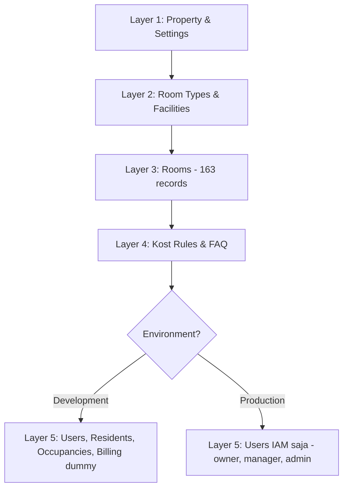

# MASTER DATA MAPPING — Granada Kost Platform

> **Versi**: 1.0  
> **Tanggal**: 17 Juni 2026  
> **Peran Pembuat**: Principal Domain Analyst & Master Data Architect  
> **Status**: Dokumen Analisis Resmi — Dasar Pembuatan Seed Data  
> **Sumber Data**: `DATA_KAMAR_GRANADA.xlsx`, `MASTER_DATA_KOSTATION.docx`

---

## 1. Executive Summary

Dokumen ini menganalisis dan memetakan data dari sumber master data operasional Granada Kost Platform ke struktur database yang sudah diimplementasikan di backend. Tujuannya adalah menjadi **acuan resmi dan satu-satunya dasar** untuk pembuatan seed data baik development maupun production.

### Temuan Kunci

| Aspek | Temuan |
|---|---|
| **Total Kamar** | **163 kamar** — 123 RuKost + 40 ApartKost |
| **Total Unit** | **26 unit** — 16 unit RuKost + 10 unit ApartKost |
| **Gender** | Putra: 81, Putri: 82 |
| **Status Seluruh Kamar** | 100% `Vacant` — tidak ada penghuni aktif saat ini |
| **Data Penghuni** | **Tidak tersedia** — kolom TENANT dan KELAMIN seluruhnya kosong |
| **Tarif Sewa** | **Tidak terisi per kamar** — `Rp0` di semua baris data; sumber lain menyebut Rp 1.800.000/bulan |
| **Data Kontrak** | Dokumen DOCX berisi template perjanjian sewa, bukan data kontrak riil |
| **Budget Target** | RuKost: Rp 2.656.800.000, ApartKost: Rp 864.000.000, Total: Rp 3.520.800.000 |
| **Nama Properti Resmi** | KOST GRANADA STUDENT HOUSE JATINANGOR (GSH JATINANGOR 1) |
| **Alamat** | Jl. Kiara Beres, Desa Cipacing, Kec. Jatinangor, Kab. Sumedang |
| **Rekening** | BSI 7318321153 a/n PT SON SMART LIVING |

---

## 2. Inventaris Sumber Data

### 2.1 DATA_KAMAR_GRANADA.xlsx

| # | Sheet | Konten | Jumlah Baris Data |
|---|---|---|---|
| 1 | `DATA ROOM RUKOST` | Data kamar tipe Rumah Kost | 123 kamar dalam 16 unit |
| 2 | `KPI DIAGRAM RUKOST` | Diagram KPI RuKost | Tidak ada data terstruktur (chart) |
| 3 | `DATA ROOM APARTKOST` | Data kamar tipe Apartemen Kost | 40 kamar dalam 10 unit |
| 4 | `KPI DIAGRAM APARTKOST` | Diagram KPI ApartKost | KPI summary (occupancy, revenue, target) |
| 5 | `Sheet6` | Ringkasan total semua tipe | 16 baris ringkasan |

### 2.2 MASTER_DATA_KOSTATION.docx

Dokumen ini berisi **template perjanjian sewa menyewa** (Surat Perjanjian Sewa Kamar Kost), bukan data penghuni atau data kontrak yang terisi. Template menyebutkan:

- Pihak Kesatu: Manajemen KOST GRANADA STUDENT HOUSE JATINANGOR (Pengelola Kost)
- Pihak Kedua: Penyewa (field kosong, template)
- Alamat: Jl. Kiara Beres, Desa Cipacing, Kec. Jatinangor, Kab. Sumedang
- Metode pembayaran: Transfer BSI 7318321153 a/n PT SON SMART LIVING
- Aturan kos: jam malam 21:00, larangan tamu lawan jenis, larangan merokok, larangan narkoba
- Force Majeure, sanksi, dan ketentuan hukum

### 2.3 Kolom Excel yang Ditemukan

| Kolom | Keterangan | Status Data |
|---|---|---|
| `JUMLAH KAMAR` | Counter nomor urut kamar global | ✅ Terisi |
| `NO. UNIT` | Identitas unit/kavling (merged cell, satu per grup kamar) | ✅ Terisi (merged) |
| `NO. KAMAR` | Nomor kamar dalam unit | ✅ Terisi |
| `TENANT` | Nama penghuni | ❌ Seluruhnya kosong |
| `KELAMIN` | Jenis kelamin penghuni | ❌ Seluruhnya kosong |
| `STATUS` | Status hunian kamar | ✅ Terisi (`Vacant` semua) |
| `WAKTU SEWA/TAHUN` | Durasi/waktu sewa | ❌ Seluruhnya kosong |
| `RATE` | Tarif sewa | ⚠️ Terisi `Rp0` di semua baris data |
| `CHECK IN` | Tanggal check-in | ❌ Seluruhnya kosong |
| `CHECK OUT` | Tanggal check-out | ❌ Seluruhnya kosong |
| `TANGGAL BULAN 2026` | Kolom kalender harian (Col 11–41) | ❌ Seluruhnya kosong |

---

## 3. Mapping Property → Building → Room

### 3.1 Hirarki Fisik yang Ditemukan

```
Granada Student House Jatinangor 1 (GSH JATINANGOR 1)
├── Tipe: RuKost (Rumah Kost)
│   ├── Unit 01 (Putri) — 11 kamar
│   ├── Unit 02 (Putra) — 8 kamar
│   ├── Unit 03 (Putri) — 8 kamar
│   ├── Unit 04 (Putra) — 7 kamar
│   ├── Unit 06 (Putra) — 7 kamar
│   ├── Unit 07 (Putra) — 7 kamar
│   ├── Unit 08 (Putri) — 7 kamar
│   ├── Unit 09 (Putri) — 6 kamar
│   ├── Unit 10 (Putra) — 8 kamar
│   ├── Unit 11 (Putra) — 7 kamar
│   ├── Unit 12 (Putra) — 7 kamar
│   ├── Unit 13 (Putri) — 11 kamar
│   ├── Unit 14 (Putra) — 6 kamar
│   ├── Unit 15 (Putri) — 6 kamar
│   ├── Unit 16 (Putri) — 7 kamar
│   └── Unit 17 (Putri) — 10 kamar
│   Subtotal: 123 kamar (Putra: 57, Putri: 66)
│
└── Tipe: ApartKost (Apartemen Kost)
    ├── Unit 05A (Putri) — 4 kamar
    ├── Unit 05B (Putri) — 4 kamar
    ├── Unit 05C (Putri) — 4 kamar
    ├── Unit 05D (Putri) — 4 kamar
    ├── Unit 18A (Putra) — 4 kamar
    ├── Unit 18B (Putra) — 4 kamar
    ├── Unit 18C (Putra) — 4 kamar
    ├── Unit 18D (Putra) — 4 kamar
    ├── Unit 18E (Putra) — 4 kamar
    └── Unit 18F (Putra) — 4 kamar
    Subtotal: 40 kamar (Putra: 24, Putri: 16)

TOTAL: 163 kamar (Putra: 81, Putri: 82)
```

### 3.2 Mapping ke Struktur Database

| Konsep Excel | Tabel Database | Kolom Database | Keterangan |
|---|---|---|---|
| GSH JATINANGOR 1 | `properties` | `name`, `address` | Satu property untuk seluruh kompleks |
| RuKost / ApartKost | `room_types` | `name`, `base_price` | Dua tipe kamar utama |
| NO. UNIT (01, 02, dst.) | — | — | **Tidak ada kolom unit di tabel `rooms`** ⚠️ |
| NO. KAMAR | `rooms` | `number` | Nomor kamar; perlu strategi composite numbering |
| Status (Vacant) | `rooms` | `room_status` | Mapping langsung: `Vacant` → `vacant` |
| Gender (Putra/Putri) | — | — | **Tidak ada kolom gender policy di tabel `rooms`** ⚠️ |

### 3.3 Keputusan Kritis: Room Number Strategy

Data Excel menunjukkan bahwa nomor kamar **tidak unik secara global** — setiap unit memiliki kamar bernomor 1, 2, 3, dst. Constraint database saat ini adalah `UNIQUE (property_id, number)`.

**Rekomendasi**: Composite room number dengan format `{UNIT}-{KAMAR}`.

| Tipe | Unit Excel | Kamar Excel | Room Number di DB | Contoh |
|---|---|---|---|---|
| RuKost | `01` | `1` s/d `11` | `RK-01-01` s/d `RK-01-11` | `RK-01-05` |
| RuKost | `02` | `1` s/d `8` | `RK-02-01` s/d `RK-02-08` | `RK-02-03` |
| ApartKost | `05A` | `1 B` s/d `4 A` | `AK-05A-1B` s/d `AK-05A-4A` | `AK-05A-3A` |
| ApartKost | `18A` | `1 B` s/d `4 A` | `AK-18A-1B` s/d `AK-18A-4A` | `AK-18A-2B` |

> **Catatan**: Format akhir nomor kamar memerlukan validasi bisnis oleh pengelola. Apakah mereka sudah punya konvensi penamaan kamar yang digunakan sehari-hari? Ini harus dikonfirmasi sebelum seed production.

---

## 4. Analisis Format NO. UNIT

### 4.1 Format RuKost

Format NO. UNIT pada RuKost mengandung informasi yang di-encode:

```
"01 B:5 A:6 Putri"
  │   │     │     └── Gender policy
  │   │     └── Jumlah kamar tipe A (A:6 = 6 kamar tipe A)
  │   └── Jumlah kamar tipe B (B:5 = 5 kamar tipe B)
  └── Nomor unit kavling
```

| Unit | Parsed | Tipe B | Tipe A | Gender | Total Kamar |
|---|---|---|---|---|---|
| `01 B:5 A:6 Putri` | Unit 01 | 5 | 6 | Putri | 11 |
| `02 B:4 A:4 Putra` | Unit 02 | 4 | 4 | Putra | 8 |
| `03 B:4 B:4 Putri` | Unit 03 | 4 (B) | 4 (B) | Putri | 8 ⚠️ Format anomali |
| `04 B:3 A:4 Putra` | Unit 04 | 3 | 4 | Putra | 7 |
| `06 B-3 A-4 Putra` | Unit 06 | 3 | 4 | Putra | 7 ⚠️ Separator berbeda (dash) |
| `07 B-3 A-4 Putra` | Unit 07 | 3 | 4 | Putra | 7 |
| `08 B-3 A-4 Putri` | Unit 08 | 3 | 4 | Putri | 7 |
| `09 B-3 A-3 Putri` | Unit 09 | 3 | 3 | Putri | 6 |
| `10 B-4 A-4 Putra` | Unit 10 | 4 | 4 | Putra | 8 |
| `11 B-3 A-4 Putra` | Unit 11 | 3 | 4 | Putra | 7 |
| `12 B-3 A-4 Putra` | Unit 12 | 3 | 4 | Putra | 7 |
| `13 B-5 A-6 Putri` | Unit 13 | 5 | 6 | Putri | 11 |
| `14 B-3 A-3 Putra` | Unit 14 | 3 | 3 | Putra | 6 |
| `15 B-3 A-3 Putri` | Unit 15 | 3 | 3 | Putri | 6 |
| `16 B-3 A-4 Putri` | Unit 16 | 3 | 4 | Putri | 7 |
| `17 B-5 A-5 Putri` | Unit 17 | 5 | 5 | Putri | 10 |

> **Catatan**: Unit 05 tidak ada di RuKost (nomor 05 dipakai untuk ApartKost). Unit 03 memiliki format anomali `B:4 B:4` (dua kali B, bukan B dan A).

### 4.2 Format ApartKost

Format NO. UNIT pada ApartKost lebih sederhana:

```
"05A PUTRI"
  │    └── Gender policy (uppercase)
  └── Nomor unit kavling + sub-identifier huruf
```

| Unit | Gender | Kamar |
|---|---|---|
| `05A PUTRI` | Putri | 1 B, 2 B, 3 A, 4 A |
| `05B PUTRI` | Putri | 1 B, 2 B, 3 A, 4 A |
| `05C PUTRI` | Putri | 1 B, 2 B, 3 A, 4 A |
| `05D PUTRI` | Putri | 1 B, 2 B, 3 A, 4 A |
| `18A PUTRA` | Putra | 1 B, 2 B, 3 A, 4 A |
| `18B PUTRA` | Putra | 1 B, 2 B, 3 A, 4 A |
| `18C PUTRA` | Putra | 1 B, 2 B, 3 A, 4 A |
| `18D PUTRA` | Putra | 1 B, 2 B, 3 A, 4 A |
| `18E PUTRA` | Putra | 1 B, 2 B, 3 A, 4 A |
| `18F PUTRA` | Putra | 1 B, 2 B, 3 A, 4 A |

### 4.3 Tipe Kamar A dan B (ApartKost)

Nomor kamar ApartKost memiliki suffix `A` atau `B`:
- **Tipe B** (kamar 1 dan 2): kemungkinan kamar lebih besar atau dengan fasilitas berbeda
- **Tipe A** (kamar 3 dan 4): kemungkinan kamar standar

> **Ambigu**: Apakah A dan B merujuk pada tipe kamar (Standard/Deluxe) atau hanya identifikasi posisi? Perlu klarifikasi dari pengelola.

---

## 5. Mapping Status Kamar

### 5.1 Status di Excel vs Status di Database

| Status Excel | Status Database | Keterangan |
|---|---|---|
| `Vacant` | `vacant` | ✅ Mapping langsung, lowercase |
| — | `occupied` | Tidak ada data; akan terisi saat ada penghuni |
| — | `reserved` | Tidak ada data; terkait booking |
| — | `maintenance` | Tidak ada data |
| — | `inactive` | Tidak ada data |

### 5.2 Kondisi Saat Ini

**Seluruh 163 kamar berstatus `Vacant`.** Ini berarti:
- Tidak ada occupancy aktif
- Tidak ada penghuni terdaftar
- Semua kamar siap untuk seed data development dengan status `vacant`

---

## 6. Mapping Gender Policy

### 6.1 Temuan Gender Policy

Gender policy di Excel di-encode dalam kolom NO. UNIT, bukan dalam kolom terpisah. Kolom KELAMIN pada data Excel seluruhnya kosong — kolom ini dimaksudkan untuk gender penghuni individual, bukan policy unit.

| Sumber | Data | Keterangan |
|---|---|---|
| NO. UNIT RuKost | `Putra` / `Putri` (suffix) | Gender policy per unit |
| NO. UNIT ApartKost | `PUTRA` / `PUTRI` (suffix, uppercase) | Gender policy per unit |
| Sheet6 | Summary per gender per tipe | Putra: 81, Putri: 82 |
| Kolom KELAMIN | Seluruhnya kosong | Gender penghuni individual |

### 6.2 Dampak pada Database

Tabel `rooms` saat ini **tidak memiliki kolom gender policy**. Terdapat dua strategi:

**Strategi A — Gender sebagai Atribut Room:**

Tambahkan kolom `gender_policy` pada tabel `rooms` dengan enum `male`, `female`, `mixed`.

**Strategi B — Gender sebagai Atribut Room Type atau Unit:**

Buat entitas `building_units` sebagai penengah antara `properties` dan `rooms`, lalu simpan gender policy di level unit.

**Rekomendasi**: Strategi A lebih pragmatis untuk Phase 1 karena:
- Database belum memiliki entitas `unit` atau `building`
- Gender policy bersifat per-unit, tapi secara teknis bisa disimpan per-room
- Constraint bisnis sederhana: semua kamar dalam satu unit memiliki gender policy yang sama
- Konsistensi gender policy per unit bisa di-enforce via application logic

### 6.3 Mapping Gender Value

| Excel | Database (`rooms.gender_policy`) | Keterangan |
|---|---|---|
| `Putra` / `PUTRA` | `male` | Kost Putra |
| `Putri` / `PUTRI` | `female` | Kost Putri |
| — | `mixed` | Tidak ditemukan di data, tapi perlu disiapkan |

### 6.4 Cross-Reference dengan Resident Gender

Tabel `residents` sudah memiliki kolom `gender` dengan enum `male`, `female`, `other`. Application logic harus memastikan:
- Penghuni `male` hanya bisa menempati kamar `male` atau `mixed`
- Penghuni `female` hanya bisa menempati kamar `female` atau `mixed`
- Penghuni `other` hanya bisa menempati kamar `mixed`

---

## 7. Mapping Occupancy

### 7.1 Kondisi Saat Ini

**Tidak ada data occupancy yang tersedia dari sumber master data.** Seluruh kolom berikut kosong:
- TENANT (nama penghuni)
- KELAMIN (gender penghuni)
- WAKTU SEWA/TAHUN (durasi sewa)
- CHECK IN (tanggal masuk)
- CHECK OUT (tanggal keluar)

### 7.2 Implikasi untuk Seed Data

Karena tidak ada occupancy riil:
- Tabel `occupancies` tidak perlu di-seed dari data Excel untuk production
- Untuk development, occupancy dummy **harus** dibuat dari data fiktif
- Tabel `check_in_records` dan `check_out_requests` tidak memiliki data sumber

---

## 8. Mapping Tarif Sewa

### 8.1 Data Tarif dari Excel

Kolom RATE di Excel seluruhnya berisi `Rp0` untuk baris kamar individual. Namun, area summary (baris di bawah data kamar) menyebutkan:
- **SEWA PERBULAN: Rp 1.800.000** (ditemukan di ApartKost summary)
- **Budget RuKost**: Rp 2.656.800.000 (total target tahunan)
- **Budget ApartKost**: Rp 864.000.000 (total target tahunan)
- **Budget Total**: Rp 3.520.800.000

### 8.2 Kalkulasi Balik (Reverse Engineering Tarif)

**ApartKost:**
- Budget tahunan: Rp 864.000.000
- Jumlah kamar: 40
- Tarif per kamar per tahun: Rp 864.000.000 ÷ 40 = **Rp 21.600.000/tahun = Rp 1.800.000/bulan** ✅ Konsisten

**RuKost:**
- Budget tahunan: Rp 2.656.800.000
- Jumlah kamar: 123
- Tarif per kamar per tahun: Rp 2.656.800.000 ÷ 123 = **Rp 21.600.000/tahun = Rp 1.800.000/bulan** ✅ Konsisten

> **Kesimpulan**: Tarif sewa seragam **Rp 1.800.000/bulan** untuk semua kamar terlepas tipe RuKost atau ApartKost.

### 8.3 Mapping Tarif ke Database

| Data | Tabel | Kolom | Nilai |
|---|---|---|---|
| Tarif sewa | `rooms` | `monthly_price` | `1800000` (integer minor unit IDR) |
| Deposit | `rooms` | `deposit_amount` | ❓ **Tidak tersedia** — perlu input manual |
| Base price per tipe | `room_types` | `base_price` | `1800000` |
| Default deposit | `room_types` | `default_deposit_amount` | ❓ **Tidak tersedia** |

### 8.4 Apakah Ada Variasi Tarif?

Berdasarkan data saat ini: **Tidak ada variasi**. Semua kamar sama Rp 1.800.000/bulan. Namun perlu dikonfirmasi:
- Apakah tipe A dan B (ApartKost) memiliki tarif berbeda?
- Apakah RuKost memiliki variasi tarif berdasarkan ukuran unit (B:3 vs B:5)?
- Apakah ada tarif diskon untuk sewa 6 bulan atau 12 bulan?

---

## 9. Mapping Penghuni

### 9.1 Status Data Penghuni

**Tidak ada data penghuni tersedia dari sumber mana pun:**

| Kolom | Status |
|---|---|
| Nama Penghuni (TENANT) | ❌ Kosong |
| Gender (KELAMIN) | ❌ Kosong |
| KTP | ❌ Tidak ada kolom |
| Phone | ❌ Tidak ada kolom |
| Email | ❌ Tidak ada kolom |
| Emergency Contact | ❌ Tidak ada kolom |
| Tanggal Masuk (CHECK IN) | ❌ Kosong |
| Tanggal Keluar (CHECK OUT) | ❌ Kosong |
| Durasi Sewa (WAKTU SEWA/TAHUN) | ❌ Kosong |

### 9.2 Implikasi

- Tabel `residents` dan `resident_emergency_contacts` **tidak dapat di-seed dari master data** ini
- Seed production hanya berisi property + rooms
- Seed development harus menggunakan data penghuni fiktif
- Dokumen DOCX berisi template perjanjian, bukan daftar penghuni yang sudah dikontrak

---

## 10. Data yang Hilang (Missing Data)

Data berikut **tidak tersedia** di master data tetapi **diperlukan** oleh database:

| # | Data yang Hilang | Tabel Database | Dampak | Severity |
|---|---|---|---|---|
| MD-01 | **Deposit amount** per kamar atau per tipe | `rooms.deposit_amount`, `room_types.default_deposit_amount` | Tidak bisa seed tarif deposit | 🔴 Kritis |
| MD-02 | **Data penghuni aktif** (nama, KTP, phone, email, gender) | `residents` | Tidak bisa seed occupancy | 🟡 Penting |
| MD-03 | **Floor / lantai** per kamar | `rooms.floor` | Tidak bisa mapping floor plan | 🟡 Penting |
| MD-04 | **Ukuran kamar** (size_label) | `rooms.size_label` | Tidak bisa seed ukuran kamar | 🟢 Nice-to-have |
| MD-05 | **Foto kamar** | `rooms.primary_photo_file_id` | Tidak bisa seed foto | 🟢 Nice-to-have |
| MD-06 | **Fasilitas per kamar/tipe** (AC, kasur, WiFi, dll.) | `room_facilities`, `room_facility_assignments` | Tidak bisa seed fasilitas | 🟡 Penting |
| MD-07 | **Logo property** | `properties` (via files) | Tidak bisa seed logo | 🟢 Nice-to-have |
| MD-08 | **Phone dan email property** | `properties.phone`, `properties.email` | Tidak bisa seed kontak property | 🟡 Penting |
| MD-09 | **Gender policy per kamar/unit** (kolom eksplisit) | Belum ada di schema | Perlu schema change atau convention | 🔴 Kritis |
| MD-10 | **Unit/kavling number** (kolom eksplisit) | Belum ada di schema | Tidak bisa representasikan hirarki unit | 🟡 Penting |
| MD-11 | **Kontrak sewa aktif** | `leases` (belum diimplementasi) | Tabel belum ada di database | ⚪ Phase 2 |
| MD-12 | **Variasi tarif** (apakah ada perbedaan tipe A vs B) | `rooms.monthly_price` | Default sama semua | 🟡 Penting |

---

## 11. Data yang Ambigu (Ambiguous Data)

| # | Ambiguitas | Contoh | Dampak | Rekomendasi |
|---|---|---|---|---|
| AM-01 | **Format NO. UNIT tidak konsisten** — separator kadang `:` kadang `-` | `01 B:5 A:6` vs `06 B-3 A-4` | Parsing otomatis rentan error | Normalisasi format unit sebelum seed |
| AM-02 | **Unit 03 anomali** — format `B:4 B:4` (dua kali B, tanpa A) | `03 B:4 B:4 Putri` | Tidak jelas apakah ada kamar tipe A | Klarifikasi ke pengelola |
| AM-03 | **Tipe A dan B (ApartKost)** — belum jelas apakah merujuk tipe kamar, ukuran, atau posisi | `1 B`, `3 A` | Tidak jelas mapping ke `room_types` | Klarifikasi apakah ini subtipe atau identifier posisi |
| AM-04 | **Nomor kamar RuKost vs ApartKost format berbeda** | RuKost: `1`, `2`, `3` vs ApartKost: `1 B`, `2 B`, `3 A` | Perlu convention seragam untuk room number | Gunakan composite number |
| AM-05 | **Batas antara data kamar dan KPI summary tidak jelas** | Baris setelah kamar terakhir berisi OCCUPANCY, REVENUE, dll. | Script parsing harus filter berdasarkan status valid | Filter rows dengan status `Vacant`/`Occupied` saja |
| AM-06 | **Apakah GSH JATINANGOR 1 mengimplikasikan akan ada GSH 2, 3, dst.?** | Sheet6 header: `GSH JATINANGOR 1` | Multi-property readiness | Database sudah multi-property ready |

---

## 12. Data yang Perlu Input Manual

Data berikut **harus** diinput secara manual karena tidak tersedia di sumber mana pun:

| # | Data | Input Oleh | Prioritas |
|---|---|---|---|
| MI-01 | Tarif deposit per tipe kamar | Pengelola kost | 🔴 Kritis — diperlukan sebelum check-in |
| MI-02 | Fasilitas per tipe kamar (AC, kasur, lemari, WiFi, dll.) | Pengelola kost | 🟡 Penting |
| MI-03 | Floor/lantai per kamar | Pengelola kost atau mapping fisik | 🟡 Penting |
| MI-04 | Ukuran kamar (m², label S/M/L) | Pengelola kost | 🟢 Nice-to-have |
| MI-05 | Nomor telepon dan email property | Pengelola kost | 🟡 Penting |
| MI-06 | Jam malam (quiet_hour_start) | Dari DOCX: 21:00 WIB | ✅ Tersedia dari DOCX |
| MI-07 | Batas laporan tamu (guest_report_deadline) | Dari DOCX: 21:00 WIB | ✅ Tersedia dari DOCX |
| MI-08 | Foto kamar | Photo shoot di lokasi | 🟢 Nice-to-have |
| MI-09 | Konvensi penamaan kamar resmi | Pengelola kost | 🔴 Kritis |
| MI-10 | Konfirmasi apakah tarif seragam atau ada variasi | Pengelola kost | 🔴 Kritis |
| MI-11 | Gender policy formal per kamar | Pengelola kost | 🔴 Kritis |

---

## 13. Data yang Tidak Konsisten (Inconsistencies)

| # | Inkonsistensi | Detail | Dampak |
|---|---|---|---|
| IC-01 | **Separator format unit RuKost** | Unit 01–04 pakai `:` (`B:5 A:6`), Unit 06+ pakai `-` (`B-3 A-4`) | Parsing otomatis harus handle keduanya |
| IC-02 | **Casing gender** | RuKost: `Putra`/`Putri` (Title Case), ApartKost: `PUTRA`/`PUTRI` (UPPER CASE) | Normalisasi diperlukan |
| IC-03 | **Unit 03 format anomali** | `03 B:4 B:4 Putri` — seharusnya `B:4 A:4` seperti unit lain? | Kemungkinan typo di data sumber |
| IC-04 | **Nomor unit tidak sekuensial** | RuKost: ada 01, 02, 03, 04, 06, 07... (tanpa 05). ApartKost: 05A-D, 18A-F | 05 dipakai ApartKost — konsisten, bukan error |
| IC-05 | **RATE Rp0 di semua baris** | Tarif seharusnya Rp 1.800.000/bulan berdasarkan budget calculation | Excel digunakan sebagai template kosong; tarif muncul di summary |
| IC-06 | **Jumlah kolom (41) vs data terisi (10)** | Kolom 11–41 adalah kalender harian tapi seluruhnya kosong | Kolom kalender bukan data kamar; diabaikan untuk mapping |
| IC-07 | **Terminologi TENANT di Excel vs Penghuni di sistem** | Excel pakai `TENANT`, Domain Model mewajibkan `Penghuni` | Gunakan `Penghuni` di semua output UI dan seed |

---

## 14. Mapping Data DOCX ke Database

### 14.1 Data yang Dapat Di-extract dari Template Perjanjian

| Data dari DOCX | Tabel | Kolom | Nilai |
|---|---|---|---|
| Nama property | `properties` | `name` | `KOST GRANADA STUDENT HOUSE JATINANGOR` |
| Alamat | `properties` | `address` | `Jl. Kiara Beres, Desa Cipacing, Kec. Jatinangor, Kab. Sumedang` |
| Jam malam | `property_settings` | `quiet_hour_start` | `21:00:00` (dari Pasal 6: tamu melebihi jam malam 21:00) |
| Batas laporan tamu | `property_settings` | `guest_report_deadline` | `21:00:00` |
| Rekening pembayaran | — | — | BSI 7318321153 a/n PT SON SMART LIVING (perlu tabel tersendiri) |
| Durasi sewa | — | — | Per tahun (kontrak tahunan); domain model mendukung 3/6/12 bulan |

### 14.2 Peraturan Kost untuk Seed `kost_rules`

Dari DOCX Pasal 5 dan 6, peraturan yang bisa di-seed:

| # | Peraturan | sort_order |
|---|---|---|
| 1 | Kebersihan kamar merupakan tanggung jawab masing-masing penghuni | 1 |
| 2 | Menjaga kebersihan area umum bersama, buang sampah pada tempat yang telah disediakan | 2 |
| 3 | Tidak menaruh barang-barang pribadi di koridor atau halaman yang dapat mengganggu penghuni lain | 3 |
| 4 | Penghuni bertanggung jawab membersihkan area koridor depan pintu kamar | 4 |
| 5 | Dilarang menggunakan kamar untuk kegiatan yang melanggar hukum dan kesusilaan | 5 |
| 6 | Dilarang menimbulkan kerusakan, keributan, atau gangguan pada kamar sebelah dan tetangga | 6 |
| 7 | Dilarang menyimpan senjata api, amunisi, bahan peledak, bensin, atau bahan bakar berbahaya | 7 |
| 8 | Dilarang membawa, menjual, atau mendistribusikan minuman keras dan narkoba | 8 |
| 9 | Dilarang merusak fasilitas kamar kos atau lingkungan kos | 9 |
| 10 | Dilarang membawa tamu lawan jenis ke dalam kamar | 10 |
| 11 | Dilarang menerima dan membawa tamu melebihi jam malam pukul 21:00 WIB | 11 |
| 12 | Dilarang mencoret-coret tembok, memaku dinding, dan menempelkan stiker di dinding | 12 |
| 13 | Pelanggaran akan dikenakan denda dan penghuni dapat dikeluarkan dari kost | 13 |
| 14 | Penghuni wajib membayar semua kerugian atau kerusakan yang disebabkan oleh tamu | 14 |

---

## 15. Rekomendasi Struktur Seed Development

### 15.1 Seed Layer 1 — Property & Settings (Harus Ada)

```
Tabel: properties
- 1 property: "Granada Student House Jatinangor"
- address: "Jl. Kiara Beres, Desa Cipacing, Kec. Jatinangor, Kab. Sumedang"
- status: "active"

Tabel: property_settings
- default_due_day: 25
- late_fee_percent_per_day: 1.00
- booking_fee_amount: 100000
- quiet_hour_start: "21:00"
- guest_report_deadline: "21:00"
```

### 15.2 Seed Layer 2 — Room Types & Facilities (Harus Ada)

```
Tabel: room_types (2 tipe)
- "RuKost Standard" — base_price: 1800000, default_deposit: [PERLU INPUT MANUAL]
- "ApartKost Standard" — base_price: 1800000, default_deposit: [PERLU INPUT MANUAL]

Catatan: Jika tipe A dan B ApartKost terbukti berbeda, tambahkan:
- "ApartKost Tipe A"
- "ApartKost Tipe B"

Tabel: room_facilities (daftar dari Domain Model)
- AC
- Kasur
- Lemari
- WiFi
- Kamar Mandi Dalam
- Meja
- Kursi
- TV (opsional)
```

### 15.3 Seed Layer 3 — Rooms (163 Kamar)

```
Tabel: rooms (163 records)

RuKost: 123 kamar
- room_type_id: → RuKost Standard
- number: composite format (lihat section 3.3)
- floor: [PERLU INPUT MANUAL atau derivasi dari info unit]
- monthly_price: 1800000
- deposit_amount: [PERLU INPUT MANUAL]
- room_status: "vacant"
- gender_policy: "male" / "female" (dari parsing NO. UNIT)

ApartKost: 40 kamar
- room_type_id: → ApartKost Standard (atau Tipe A / Tipe B)
- number: composite format
- floor: [PERLU INPUT MANUAL]
- monthly_price: 1800000
- deposit_amount: [PERLU INPUT MANUAL]
- room_status: "vacant"
- gender_policy: "male" / "female"
```

### 15.4 Seed Layer 4 — Peraturan & FAQ (Dev + Production)

```
Tabel: kost_rules (14 records dari DOCX)
Tabel: faqs (dari Domain Model mock data)
```

### 15.5 Seed Layer 5 — Development Only (Data Fiktif)

```
Tabel: users (admin, manager, teknisi fiktif)
Tabel: residents (10-20 penghuni fiktif untuk testing)
Tabel: occupancies (10-20 occupancy aktif fiktif)
Tabel: check_in_records (dari occupancy fiktif)
Tabel: invoices (tagihan dummy)
Tabel: payments (pembayaran dummy)
```

### 15.6 Urutan Eksekusi Seed



---

## 16. Rekomendasi Data yang Tidak Boleh Masuk Seed Production

| # | Data | Alasan |
|---|---|---|
| SP-01 | **Penghuni fiktif** | Data PII palsu tidak boleh masuk production; semua penghuni harus input manual |
| SP-02 | **Occupancy fiktif** | Occupancy harus tercipta dari workflow check-in yang sah |
| SP-03 | **Invoice dan payment fiktif** | Data finansial harus tercipta dari billing workflow yang sah |
| SP-04 | **Check-in/check-out records fiktif** | Record harus tercipta dari workflow operasional |
| SP-05 | **Smart Lock device dummy** | Device harus terdaftar dari integrasi Tuya yang riil |
| SP-06 | **CCTV camera dummy** | Camera harus terdaftar dari inventaris NVR riil |
| SP-07 | **Notification dummy** | Notifikasi harus tercipta dari event domain yang sah |
| SP-08 | **Audit log dummy** | Audit log harus tercipta dari operasi riil |
| SP-09 | **Password atau credential default yang lemah** | Semua user production harus set password sendiri |
| SP-10 | **Deposit amount yang belum dikonfirmasi** | Lebih baik seed rooms tanpa deposit (Rp 0) daripada angka salah |

### Data yang BOLEH masuk Seed Production

| # | Data | Alasan |
|---|---|---|
| PP-01 | **Property profile** (nama, alamat, timezone) | Data riil dari dokumen |
| PP-02 | **Property settings** (due day, late fee, jam malam) | Data riil dari dokumen |
| PP-03 | **Room types** (RuKost, ApartKost) | Kategorisasi riil |
| PP-04 | **Room facilities master** (AC, kasur, WiFi, dll.) | Fasilitas riil yang ditawarkan |
| PP-05 | **Rooms** (163 kamar dengan nomor, tipe, gender policy) | Data riil dari Excel |
| PP-06 | **Kost rules** | Data riil dari DOCX |
| PP-07 | **Roles dan permissions** | Konfigurasi RBAC |
| PP-08 | **User admin pertama** (owner platform) | Diperlukan untuk login awal |
| PP-09 | **Complaint categories master** | Standar operasional |

---

## 17. Schema Gap Analysis

Gap antara data yang tersedia dan schema database yang sudah diimplementasi:

| # | Gap | Tipe | Rekomendasi |
|---|---|---|---|
| SG-01 | **Tidak ada kolom `gender_policy` di tabel `rooms`** | Schema gap | Tambahkan kolom `gender_policy TEXT` dengan CHECK `('male', 'female', 'mixed')` |
| SG-02 | **Tidak ada representasi `unit` / kavling di database** | Schema gap | Tambahkan kolom `unit_code TEXT` di tabel `rooms` atau buat tabel `building_units` |
| SG-03 | **Tidak ada tabel `leases`** di implementasi saat ini | Implementation gap | Tabel `leases` sudah direncanakan di DATABASE_PLANNING.md tapi belum dibuat |
| SG-04 | **Room number harus composite** karena nomor kamar tidak unik lintas unit | Convention gap | Tetapkan format composite sebelum seed |
| SG-05 | **Kolom `rooms.floor` belum terisi** — data floor tidak ada di Excel | Data gap | Perlu input manual atau derivasi |
| SG-06 | **Rekening pembayaran** belum ada tabel/kolom di database | Schema gap | Pertimbangkan menambahkan ke `property_settings` atau tabel terpisah |

---

## 18. Ringkasan Keputusan yang Dibutuhkan

Sebelum seed data dapat dibuat, keputusan berikut harus diambil:

| # | Keputusan | Pihak yang Memutuskan | Blocking? |
|---|---|---|---|
| D-01 | Konvensi penamaan kamar resmi (format room number) | Pengelola + Tim Dev | 🔴 Ya |
| D-02 | Tarif deposit per tipe kamar | Pengelola | 🔴 Ya |
| D-03 | Apakah tipe A dan B di ApartKost berbeda tarif/fasilitas? | Pengelola | 🟡 Sebagian |
| D-04 | Apakah perlu kolom `gender_policy` di rooms atau pendekatan lain? | Tim Dev | 🔴 Ya |
| D-05 | Apakah perlu kolom `unit_code` di rooms? | Tim Dev | 🟡 Sebagian |
| D-06 | Floor assignment per kamar | Pengelola | 🟡 Sebagian |
| D-07 | Daftar fasilitas per tipe kamar | Pengelola | 🟡 Sebagian |
| D-08 | Apakah tarif benar seragam Rp 1.800.000/bulan? | Pengelola | 🔴 Ya |
| D-09 | Apakah Unit 03 benar `B:4 B:4` atau typo? | Pengelola | 🟢 Tidak |

---

## Appendix A: Daftar Lengkap Unit dan Kamar

### RuKost (16 unit, 123 kamar)

| # | Unit | Gender | Jumlah Kamar | Nomor Kamar |
|---|---|---|---|---|
| 1 | 01 | Putri | 11 | 1, 2, 3, 4, 5, 6, 7, 8, 9, 10, 11 |
| 2 | 02 | Putra | 8 | 1, 2, 3, 4, 5, 6, 7, 8 |
| 3 | 03 | Putri | 8 | 1, 2, 3, 4, 5, 6, 7, 8 |
| 4 | 04 | Putra | 7 | 1, 2, 3, 4, 5, 6, 7 |
| 5 | 06 | Putra | 7 | 1, 2, 3, 4, 5, 6, 7 |
| 6 | 07 | Putra | 7 | 1, 2, 3, 4, 5, 6, 7 |
| 7 | 08 | Putri | 7 | 1, 2, 3, 4, 5, 6, 7 |
| 8 | 09 | Putri | 6 | 1, 2, 3, 4, 5, 6 |
| 9 | 10 | Putra | 8 | 1, 2, 3, 4, 5, 6, 7, 8 |
| 10 | 11 | Putra | 7 | 1, 2, 3, 4, 5, 6, 7 |
| 11 | 12 | Putra | 7 | 1, 2, 3, 4, 5, 6, 7 |
| 12 | 13 | Putri | 11 | 1, 2, 3, 4, 5, 6, 7, 8, 9, 10, 11 |
| 13 | 14 | Putra | 6 | 1, 2, 3, 4, 5, 6 |
| 14 | 15 | Putri | 6 | 1, 2, 3, 4, 5, 6 |
| 15 | 16 | Putri | 7 | 1, 2, 3, 4, 5, 6, 7 |
| 16 | 17 | Putri | 10 | 1, 2, 3, 4, 5, 6, 7, 8, 9, 10 |

### ApartKost (10 unit, 40 kamar)

| # | Unit | Gender | Jumlah Kamar | Nomor Kamar |
|---|---|---|---|---|
| 1 | 05A | Putri | 4 | 1 B, 2 B, 3 A, 4 A |
| 2 | 05B | Putri | 4 | 1 B, 2 B, 3 A, 4 A |
| 3 | 05C | Putri | 4 | 1 B, 2 B, 3 A, 4 A |
| 4 | 05D | Putri | 4 | 1 B, 2 B, 3 A, 4 A |
| 5 | 18A | Putra | 4 | 1 B, 2 B, 3 A, 4 A |
| 6 | 18B | Putra | 4 | 1 B, 2 B, 3 A, 4 A |
| 7 | 18C | Putra | 4 | 1 B, 2 B, 3 A, 4 A |
| 8 | 18D | Putra | 4 | 1 B, 2 B, 3 A, 4 A |
| 9 | 18E | Putra | 4 | 1 B, 2 B, 3 A, 4 A |
| 10 | 18F | Putra | 4 | 1 B, 2 B, 3 A, 4 A |

---

## Appendix B: Data Kontrak dari DOCX

### Informasi Entitas Legal

| Item | Nilai |
|---|---|
| Nama Badan Hukum | PT SON SMART LIVING |
| Rekening | BSI 7318321153 |
| Atas Nama Rekening | PT SON SMART LIVING |
| Nama Kost | KOST GRANADA STUDENT HOUSE JATINANGOR |
| Alamat | Jl. Kiara Beres, Desa Cipacing, Kec. Jatinangor, Kab. Sumedang |
| Yurisdiksi | Pengadilan Negeri Kab. Sumedang |

### Template Kontrak Fields

| Field | Mapping Database | Status |
|---|---|---|
| Nama Penyewa | `residents.full_name` | Template (kosong) |
| NIK | `residents.ktp_number` | Template (kosong) |
| Alamat Penyewa | — | Tidak ada kolom di `residents` |
| No. Telp Penyewa | `residents.phone` | Template (kosong) |
| No. Kavling | `rooms.unit_code` (diusulkan) | Template (kosong) |
| No. Kamar | `rooms.number` | Template (kosong) |
| Harga Sewa | `rooms.monthly_price` | Template (kosong), per tahun di kontrak |
| Masa Sewa | `leases` (belum ada) | Template (kosong) |

---

## Appendix C: KPI Summary dari Excel

### Sheet: KPI DIAGRAM APARTKOST (Row 13-19)

| Metric | Nilai |
|---|---|
| OCCUPANCY | 0,00% |
| REVENUE | Rp 0 |
| TARGET | Rp 864.000.000 |
| TOTAL KAMAR | 40 |
| INHOUSE | 0 |
| KOST PUTRA (count) | 0 |
| KOST PUTRI (count) | 0 |
| KOST PUTRA (revenue) | Rp 0 |
| KOST PUTRI (revenue) | Rp 0 |

### Sheet: Sheet6 (Summary Gabungan)

| Metric | RuKost | ApartKost | Total |
|---|---|---|---|
| Putra | 57 | 24 | 81 |
| Putri | 66 | 16 | 82 |
| Total Kamar | 123 | 40 | 163 |
| BUDGET | Rp 2.656.800.000 | Rp 864.000.000 | Rp 3.520.800.000 |
| OCCUPANCY | 0,00% | 0,00% | 0,00% |
| REVENUE | Rp 0 | Rp 0 | Rp 0 |
| INHOUSE | 0 | 0 | 0 |
