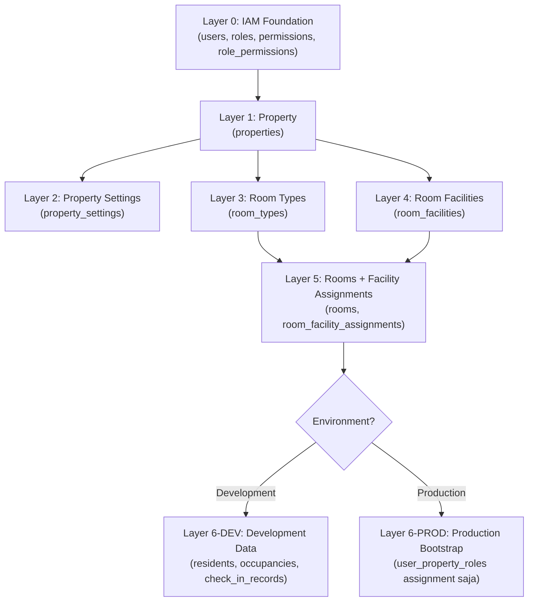
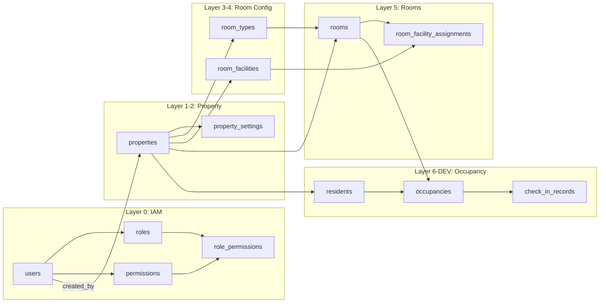

# SEED DATA PLAN — Granada Kost Platform

> **Versi**: 1.0  
> **Tanggal**: 17 Juni 2026  
> **Peran Pembuat**: Principal Data Architect & Seed Planning Specialist  
> **Status**: Dokumen Perencanaan Resmi — Referensi Sebelum Implementasi Seed Script  
> **Dokumen Acuan**:  
> - [MASTER_DATA_MAPPING.md](file:///d:/PROJECT%20CODING/Granada%20Kost%20Platform/docs/MASTER_DATA_MAPPING.md)  
> - [DATABASE_PLANNING.md](file:///d:/PROJECT%20CODING/Granada%20Kost%20Platform/docs/DATABASE_PLANNING.md)  
> - [DOMAIN_MODEL.md](file:///d:/PROJECT%20CODING/Granada%20Kost%20Platform/docs/DOMAIN_MODEL.md)  
> - [BACKEND_ARCHITECTURE.md](file:///d:/PROJECT%20CODING/Granada%20Kost%20Platform/docs/BACKEND_ARCHITECTURE.md)  
> - [API_PLANNING.md](file:///d:/PROJECT%20CODING/Granada%20Kost%20Platform/docs/API_PLANNING.md)

---

## Daftar Isi

1. [Executive Summary](#1-executive-summary)
2. [Strategi Seed Bertahap (Layered Seed)](#2-strategi-seed-bertahap-layered-seed)
3. [Urutan Seed Berdasarkan Dependency Database](#3-urutan-seed-berdasarkan-dependency-database)
4. [Layer 0: IAM Foundation Seed Plan](#4-layer-0-iam-foundation-seed-plan)
5. [Layer 1: Property Seed Plan](#5-layer-1-property-seed-plan)
6. [Layer 2: Property Settings Seed Plan](#6-layer-2-property-settings-seed-plan)
7. [Layer 3: Room Type Seed Plan](#7-layer-3-room-type-seed-plan)
8. [Layer 4: Facility Seed Plan](#8-layer-4-facility-seed-plan)
9. [Layer 5: Room Seed Plan (163 Kamar)](#9-layer-5-room-seed-plan-163-kamar)
10. [Gender Policy Mapping Plan](#10-gender-policy-mapping-plan)
11. [Unit Code Mapping Plan](#11-unit-code-mapping-plan)
12. [Tarif Sewa Mapping Plan](#12-tarif-sewa-mapping-plan)
13. [Validasi dan Quality Checks](#13-validasi-dan-quality-checks)
14. [Risiko Data Duplikat](#14-risiko-data-duplikat)
15. [Risiko Data Inkonsisten](#15-risiko-data-inkonsisten)
16. [Data yang Harus Di-seed untuk Development](#16-data-yang-harus-di-seed-untuk-development)
17. [Data yang Tidak Boleh Di-seed untuk Production](#17-data-yang-tidak-boleh-di-seed-untuk-production)
18. [Rollback Strategy](#18-rollback-strategy)
19. [Checklist Implementasi untuk Backend Team](#19-checklist-implementasi-untuk-backend-team)

---

## 1. Executive Summary

Dokumen ini mendefinisikan **rencana implementasi seed data** untuk Granada Kost Platform berdasarkan hasil analisis `MASTER_DATA_MAPPING.md`. Seed script harus memuat **163 kamar riil** dari data master Excel, parameter properti dari DOCX, serta data pendukung IAM/RBAC agar sistem bisa beroperasi segera setelah deployment.

### Parameter yang Sudah Disetujui

| Parameter | Nilai |
|---|---|
| Total kamar | 163 (123 RuKost + 40 ApartKost) |
| Status awal semua kamar | `vacant` |
| Penghuni aktif saat seed | 0 (tidak ada) |
| Occupancy aktif saat seed | 0 (tidak ada) |
| Tarif sementara | Rp 1.800.000/bulan (seragam) |
| Deposit sementara | 0 |
| Property owner | Read-only |
| Occupancy rule | Satu kamar = satu penghuni aktif |

### Prinsip Seed

1. **Idempotent** — Seed script boleh dijalankan ulang tanpa menyebabkan duplikat atau error.
2. **Layered** — Seed dieksekusi bertahap mengikuti dependency foreign key.
3. **Environment-aware** — Seed membedakan data production vs development.
4. **Transactional** — Setiap layer dijalankan dalam satu transaksi agar bisa rollback penuh jika gagal.
5. **Auditable** — Seed mencatat `created_by_user_id` pada record yang memiliki kolom tersebut menggunakan user system/owner yang di-seed di Layer 0.
6. **Deterministic** — UUID untuk key entities (property, room types) menggunakan UUID v5 atau hardcoded UUID agar referensi antar layer stabil dan idempoten.

---

## 2. Strategi Seed Bertahap (Layered Seed)

### Arsitektur Layer



### Penjelasan Layer

| Layer | Target | Deskripsi | Environment |
|---|---|---|---|
| **Layer 0** | IAM Foundation | Roles, permissions, role-permission mapping, user system/owner | Dev + Prod |
| **Layer 1** | Property | 1 property Granada Student House Jatinangor | Dev + Prod |
| **Layer 2** | Property Settings | Settings operasional property | Dev + Prod |
| **Layer 3** | Room Types | 2 tipe kamar: RuKost Standard, ApartKost Standard | Dev + Prod |
| **Layer 4** | Room Facilities | Master data fasilitas kamar | Dev + Prod |
| **Layer 5** | Rooms | 163 kamar lengkap dengan gender_policy, unit_code, tarif | Dev + Prod |
| **Layer 6-DEV** | Development Data | Penghuni fiktif, occupancy dummy, users tambahan | Dev only |
| **Layer 6-PROD** | Production Bootstrap | Role assignment user owner ke property | Prod only |

### Aturan Antar Layer

1. Setiap layer harus **selesai sukses** sebelum layer berikutnya dijalankan.
2. Layer 3 dan Layer 4 **independen satu sama lain** — boleh dieksekusi paralel, tapi keduanya harus selesai sebelum Layer 5.
3. Layer 6 bergantung pada environment variable (misalnya `NODE_ENV` atau `SEED_ENV`).
4. **Tidak ada layer yang boleh skip** — meskipun tabel sudah memiliki data, seed harus menggunakan `ON CONFLICT DO NOTHING` atau check existence.

---

## 3. Urutan Seed Berdasarkan Dependency Database

### Foreign Key Dependency Graph



### Tabel Urutan Eksekusi

| Urutan | Tabel | Depends On | Layer |
|---|---|---|---|
| 1 | `roles` | — | 0 |
| 2 | `permissions` | — | 0 |
| 3 | `role_permissions` | `roles`, `permissions` | 0 |
| 4 | `users` | — | 0 |
| 5 | `user_property_roles` | `users`, `roles` | 0 (partial), 6-PROD |
| 6 | `properties` | `users` (created_by) | 1 |
| 7 | `property_settings` | `properties` | 2 |
| 8 | `room_types` | `properties`, `users` | 3 |
| 9 | `room_facilities` | `properties`, `users` | 4 |
| 10 | `rooms` | `properties`, `room_types`, `users` | 5 |
| 11 | `room_facility_assignments` | `rooms`, `room_facilities` | 5 |
| 12 | `residents` | `properties`, `users` | 6-DEV |
| 13 | `resident_emergency_contacts` | `residents` | 6-DEV |
| 14 | `occupancies` | `properties`, `rooms`, `residents`, `users` | 6-DEV |
| 15 | `occupancy_history` | `occupancies`, `properties`, `rooms`, `residents`, `users` | 6-DEV |
| 16 | `check_in_records` | `properties`, `rooms`, `residents`, `occupancies`, `users` | 6-DEV |

> [!IMPORTANT]
> Tabel `user_property_roles` di-seed dua kali: pertama di Layer 0 untuk assignment tanpa property_id (global owner role), kemudian di Layer 6-PROD setelah property sudah ada untuk property-scoped assignments.

---

## 4. Layer 0: IAM Foundation Seed Plan

### 4.1 Roles (6 System Roles)

| code | name | is_system_role |
|---|---|---|
| `owner` | Platform Owner | `true` |
| `manager` | Property Manager | `true` |
| `admin` | Administrative Staff | `true` |
| `technician` | Maintenance Technician | `true` |
| `resident` | Penghuni | `true` |
| `property_owner` | Property Owner / Investor | `true` |

> **Idempotency**: `INSERT ... ON CONFLICT (code) DO NOTHING`

### 4.2 Permissions

Berdasarkan BACKEND_ARCHITECTURE.md dan API_PLANNING.md:

| Grup | Permissions |
|---|---|
| **Property** | `property.view`, `property.manage`, `property.settings.manage` |
| **Room** | `room.view`, `room.manage`, `room.status.manage` |
| **Resident** | `resident.view`, `resident.manage`, `resident.self.view`, `resident.self.manage` |
| **Occupancy** | `occupancy.view`, `occupancy.manage` |
| **Billing** | `billing.view`, `billing.manage`, `payment.verify` |
| **Deposit** | `deposit.view`, `deposit.manage` |
| **RBAC** | `rbac.view`, `rbac.manage` |
| **Audit** | `audit.view`, `audit.export` |
| **Smart Lock** | `smart_lock.view`, `smart_lock.command` |
| **CCTV** | `cctv.view` |
| **File** | `file.upload`, `file.private.access` |
| **Report** | `report.view`, `report.export` |
| **Complaint** | `complaint.view`, `complaint.manage`, `complaint.self.create` |
| **Maintenance** | `maintenance.view`, `maintenance.manage` |
| **Notification** | `notification.manage`, `notification.self.view` |

> **Idempotency**: `INSERT ... ON CONFLICT (code) DO NOTHING`

### 4.3 Role-Permission Mapping

Mapping harus mengikuti hierarki RBAC yang didefinisikan di BACKEND_ARCHITECTURE.md:

| Role | Permissions |
|---|---|
| `owner` | **Seluruh permissions** |
| `manager` | Semua kecuali `rbac.manage` |
| `admin` | `property.view`, `room.*`, `resident.*`, `occupancy.*`, `billing.view`, `complaint.*`, `maintenance.*`, `notification.manage`, `file.upload`, `report.view` |
| `technician` | `maintenance.view` (assignment-scoped) |
| `resident` | `resident.self.*`, `complaint.self.create`, `notification.self.view` |
| `property_owner` | `property.view`, `room.view`, `resident.view`, `occupancy.view`, `billing.view`, `report.view` (**read-only, property-scoped**) |

> **Catatan**: Mapping ini harus dikonfirmasi saat implementasi karena permission code yang tepat mungkin berevolusi. Yang penting adalah **pola hierarki** dan **read-only constraint untuk property_owner**.

### 4.4 System User (Seed Owner)

Untuk Production dan Development:

| Field | Nilai Production | Nilai Development |
|---|---|---|
| `email` | `owner@granada.id` | `owner@kostation.test` |
| `display_name` | `System Owner` | `Dev Owner` |
| `password_hash` | **Hashed dari password kuat yang digenerate saat deployment** | Hashed dari password development (`Demo123@`) |
| `user_status` | `active` | `active` |

> [!WARNING]
> Password production **tidak boleh** di-hardcode di seed script. Gunakan environment variable atau generate saat deployment, lalu hash di runtime seed script. Password development boleh deterministic untuk kemudahan testing.

### 4.5 Users Tambahan (Development Only)

| email | display_name | Role assignment |
|---|---|---|
| `manager@kostation.test` | `Dev Manager` | `manager` → property Granada |
| `admin@kostation.test` | `Dev Admin` | `admin` → property Granada |
| `teknisi@kostation.test` | `Dev Teknisi` | `technician` → property Granada |
| `penghuni01@kostation.test` | `Dev Penghuni 01` | `resident` → property Granada |
| `penghuni02@kostation.test` | `Dev Penghuni 02` | `resident` → property Granada |
| `investor@kostation.test` | `Dev Investor` | `property_owner` → property Granada |

---

## 5. Layer 1: Property Seed Plan

### 5.1 Data Property

Sumber: `MASTER_DATA_KOSTATION.docx` dan `DATA_KAMAR_GRANADA.xlsx` (Sheet6)

| Kolom | Nilai | Sumber |
|---|---|---|
| `id` | **Deterministic UUID** — hardcoded atau UUID v5 dari name | Convention |
| `name` | `Granada Student House Jatinangor` | Sheet6 + DOCX |
| `address` | `Jl. Kiara Beres, Desa Cipacing, Kec. Jatinangor, Kab. Sumedang` | DOCX Pasal perjanjian |
| `phone` | `NULL` | Belum tersedia — input manual nanti |
| `email` | `NULL` | Belum tersedia — input manual nanti |
| `timezone` | `Asia/Jakarta` | Default (Jatinangor = WIB) |
| `status` | `active` | Business decision |
| `created_by_user_id` | → UUID user `owner` dari Layer 0 | FK reference |

### 5.2 Mengapa Hanya 1 Property?

- Sheet6 menuliskan `GSH JATINANGOR 1`, mengimplikasikan potensi GSH 2, 3, dst.
- Namun saat ini **hanya 1 properti** yang memiliki data master.
- Database sudah multi-property ready — property baru bisa ditambah tanpa schema change.
- Seed hanya memuat properti yang datanya sudah divalidasi.

### 5.3 Idempotency Strategy

```
INSERT INTO properties (id, name, address, ...)
VALUES ($deterministic_uuid, 'Granada Student House Jatinangor', ...)
ON CONFLICT (id) DO NOTHING;
```

> **Penting**: Gunakan deterministic UUID (hardcoded) agar Layer 2, 3, 4, 5 bisa mereferensikan property_id secara stabil tanpa query tambahan.

---

## 6. Layer 2: Property Settings Seed Plan

### 6.1 Data Property Settings

Sumber: `MASTER_DATA_KOSTATION.docx` (Pasal 5, 6) dan default dari DATABASE_PLANNING.md

| Kolom | Nilai | Sumber |
|---|---|---|
| `property_id` | → UUID property Granada | FK dari Layer 1 |
| `default_due_day` | `25` | DATABASE_PLANNING.md default |
| `late_fee_percent_per_day` | `1.00` | DATABASE_PLANNING.md default |
| `booking_fee_amount` | `100000` | DATABASE_PLANNING.md default |
| `quiet_hour_start` | `21:00:00` | DOCX Pasal 6: "melebihi jam malam di 21:00 WIB" |
| `guest_report_deadline` | `21:00:00` | Derivasi dari jam malam DOCX |

### 6.2 Catatan

- `booking_fee_amount` menggunakan default database karena dokumen master data tidak menyebutkan jumlah booking fee eksplisit.
- `late_fee_percent_per_day` menggunakan default — perlu konfirmasi dari pengelola apakah ada ketentuan denda keterlambatan yang berbeda.
- Kolom `property_settings` memiliki `property_id` sebagai PRIMARY KEY, sehingga idempotency cukup dengan `ON CONFLICT (property_id) DO NOTHING`.

---

## 7. Layer 3: Room Type Seed Plan

### 7.1 Data Room Types

Sumber: `MASTER_DATA_MAPPING.md` Section 3, `DATA_KAMAR_GRANADA.xlsx` (Sheet6)

| # | name | base_price | default_deposit_amount | status | Jumlah Kamar |
|---|---|---|---|---|---|
| 1 | `RuKost Standard` | `1800000` | `0` | `active` | 123 |
| 2 | `ApartKost Standard` | `1800000` | `0` | `active` | 40 |

### 7.2 Keputusan Desain

**Mengapa hanya 2 tipe, bukan 4?**

MASTER_DATA_MAPPING.md mengidentifikasi adanya suffix `A` dan `B` pada nomor kamar ApartKost (`1 B`, `2 B`, `3 A`, `4 A`). Namun:

- Belum dikonfirmasi apakah A dan B merujuk pada tipe kamar berbeda (tarif, ukuran, fasilitas) atau hanya identifikasi posisi.
- Tarif saat ini seragam Rp 1.800.000/bulan tanpa variasi.
- Deposit sementara 0 untuk semua tipe.

**Strategi**: Seed 2 tipe dulu. Jika konfirmasi dari pengelola menunjukkan perbedaan tarif/fasilitas untuk A dan B, tambahkan tipe baru via migration data, bukan dengan mengubah seed.

### 7.3 Deposit Sementara = 0

Sesuai keputusan bisnis yang sudah disetujui, deposit sementara 0 untuk semua tipe. Ini menjadi **placeholder** yang aman karena:

- CHECK constraint `deposit_amount >= 0` tetap terpenuhi.
- Application logic check-in harus memvalidasi apakah deposit sudah dikonfigurasi sebelum mengizinkan proses check-in pada production.
- Tarif deposit riil harus diinput via admin panel setelah konfirmasi dari pengelola.

### 7.4 Kolom Referensi

| Kolom | Nilai |
|---|---|
| `id` | Deterministic UUID (hardcoded) — akan direferensikan oleh 163 rooms |
| `property_id` | → UUID property Granada |
| `created_by_user_id` | → UUID user owner |
| `description` | `NULL` (bisa diisi nanti via admin panel) |

---

## 8. Layer 4: Facility Seed Plan

### 8.1 Data Room Facilities

Sumber: DOMAIN_MODEL.md dan daftar fasilitas umum kost mahasiswa

| # | name | status | Keterangan |
|---|---|---|---|
| 1 | `AC` | `active` | Air Conditioner |
| 2 | `Kasur` | `active` | Tempat tidur |
| 3 | `Lemari` | `active` | Lemari pakaian |
| 4 | `WiFi` | `active` | Akses internet wireless |
| 5 | `Kamar Mandi Dalam` | `active` | Kamar mandi privat di dalam kamar |
| 6 | `Meja` | `active` | Meja belajar/kerja |
| 7 | `Kursi` | `active` | Kursi |
| 8 | `Water Heater` | `active` | Pemanas air (opsional, mungkin hanya tipe tertentu) |

### 8.2 Catatan

- Daftar ini didasarkan pada fasilitas umum kost mahasiswa; **daftar final harus dikonfirmasi pengelola**.
- Facility data bersifat master data — perubahan dilakukan via admin panel, bukan seed ulang.
- `room_facility_assignments` (Layer 5) akan mengassign facility ke room. Karena belum ada data pasti fasilitas per kamar, seed akan mengassign **set fasilitas default ke semua kamar**.

### 8.3 Facility Assignment Strategy (Layer 5)

Karena data fasilitas per kamar/tipe belum tersedia dari sumber master data:

**Opsi A (Direkomendasikan)**: Assign semua 8 fasilitas ke semua 163 kamar sebagai **baseline**, kecuali fasilitas opsional.  
**Opsi B**: Tidak assign fasilitas apapun, biarkan admin mengisi via panel.

**Rekomendasi**: Opsi A untuk development (agar UI dan API testable), Opsi B untuk production (menghindari data yang belum dikonfirmasi).

---

## 9. Layer 5: Room Seed Plan (163 Kamar)

### 9.1 Struktur Data Per Kamar

Setiap record `rooms` memiliki kolom berikut:

| Kolom | Strategi Pengisian | Sumber |
|---|---|---|
| `id` | `gen_random_uuid()` | Auto-generate |
| `property_id` | → UUID property Granada (deterministic) | Layer 1 |
| `room_type_id` | → UUID `RuKost Standard` atau `ApartKost Standard` | Layer 3 |
| `number` | Composite format `{PREFIX}-{UNIT}-{KAMAR}` | Excel + Convention |
| `floor` | `NULL` | Belum tersedia |
| `size_label` | `NULL` | Belum tersedia |
| `monthly_price` | `1800000` | Keputusan bisnis |
| `deposit_amount` | `0` | Keputusan bisnis (sementara) |
| `room_status` | `vacant` | Keputusan bisnis |
| `unit_code` | Parsed dari NO. UNIT Excel | Excel |
| `gender_policy` | `male` atau `female` (dari NO. UNIT suffix) | Excel |
| `primary_photo_file_id` | `NULL` | Belum tersedia |
| `created_by_user_id` | → UUID user owner | Layer 0 |

### 9.2 Room Number Convention

Format final: **`{TYPE_PREFIX}-{UNIT_CODE}-{ROOM_NUMBER}`**

| Tipe | Type Prefix | Contoh Unit | Contoh Kamar | Room Number |
|---|---|---|---|---|
| RuKost | `RK` | `01` | `1` | `RK-01-01` |
| RuKost | `RK` | `01` | `11` | `RK-01-11` |
| RuKost | `RK` | `13` | `5` | `RK-13-05` |
| ApartKost | `AK` | `05A` | `1B` | `AK-05A-1B` |
| ApartKost | `AK` | `18F` | `4A` | `AK-18F-4A` |

**Aturan penomoran kamar RuKost**: Zero-padded 2 digit (`01`, `02`, ..., `11`).  
**Aturan penomoran kamar ApartKost**: Tanpa spasi dari format Excel (`1 B` → `1B`, `3 A` → `3A`).

### 9.3 Daftar Lengkap 163 Kamar

#### RuKost — 123 Kamar (16 Unit)

| # | Unit Code | Gender Policy | Rooms | Room Numbers (seed) |
|---|---|---|---|---|
| 1 | `01` | `female` | 11 | `RK-01-01` s/d `RK-01-11` |
| 2 | `02` | `male` | 8 | `RK-02-01` s/d `RK-02-08` |
| 3 | `03` | `female` | 8 | `RK-03-01` s/d `RK-03-08` |
| 4 | `04` | `male` | 7 | `RK-04-01` s/d `RK-04-07` |
| 5 | `06` | `male` | 7 | `RK-06-01` s/d `RK-06-07` |
| 6 | `07` | `male` | 7 | `RK-07-01` s/d `RK-07-07` |
| 7 | `08` | `female` | 7 | `RK-08-01` s/d `RK-08-07` |
| 8 | `09` | `female` | 6 | `RK-09-01` s/d `RK-09-06` |
| 9 | `10` | `male` | 8 | `RK-10-01` s/d `RK-10-08` |
| 10 | `11` | `male` | 7 | `RK-11-01` s/d `RK-11-07` |
| 11 | `12` | `male` | 7 | `RK-12-01` s/d `RK-12-07` |
| 12 | `13` | `female` | 11 | `RK-13-01` s/d `RK-13-11` |
| 13 | `14` | `male` | 6 | `RK-14-01` s/d `RK-14-06` |
| 14 | `15` | `female` | 6 | `RK-15-01` s/d `RK-15-06` |
| 15 | `16` | `female` | 7 | `RK-16-01` s/d `RK-16-07` |
| 16 | `17` | `female` | 10 | `RK-17-01` s/d `RK-17-10` |
| | | **Subtotal** | **123** | |

**Verifikasi count per gender:**
- Putra (male): Unit 02 (8) + 04 (7) + 06 (7) + 07 (7) + 10 (8) + 11 (7) + 12 (7) + 14 (6) = **57** ✅
- Putri (female): Unit 01 (11) + 03 (8) + 08 (7) + 09 (6) + 13 (11) + 15 (6) + 16 (7) + 17 (10) = **66** ✅
- Total: 57 + 66 = **123** ✅

#### ApartKost — 40 Kamar (10 Unit)

| # | Unit Code | Gender Policy | Rooms | Room Numbers (seed) |
|---|---|---|---|---|
| 1 | `05A` | `female` | 4 | `AK-05A-1B`, `AK-05A-2B`, `AK-05A-3A`, `AK-05A-4A` |
| 2 | `05B` | `female` | 4 | `AK-05B-1B`, `AK-05B-2B`, `AK-05B-3A`, `AK-05B-4A` |
| 3 | `05C` | `female` | 4 | `AK-05C-1B`, `AK-05C-2B`, `AK-05C-3A`, `AK-05C-4A` |
| 4 | `05D` | `female` | 4 | `AK-05D-1B`, `AK-05D-2B`, `AK-05D-3A`, `AK-05D-4A` |
| 5 | `18A` | `male` | 4 | `AK-18A-1B`, `AK-18A-2B`, `AK-18A-3A`, `AK-18A-4A` |
| 6 | `18B` | `male` | 4 | `AK-18B-1B`, `AK-18B-2B`, `AK-18B-3A`, `AK-18B-4A` |
| 7 | `18C` | `male` | 4 | `AK-18C-1B`, `AK-18C-2B`, `AK-18C-3A`, `AK-18C-4A` |
| 8 | `18D` | `male` | 4 | `AK-18D-1B`, `AK-18D-2B`, `AK-18D-3A`, `AK-18D-4A` |
| 9 | `18E` | `male` | 4 | `AK-18E-1B`, `AK-18E-2B`, `AK-18E-3A`, `AK-18E-4A` |
| 10 | `18F` | `male` | 4 | `AK-18F-1B`, `AK-18F-2B`, `AK-18F-3A`, `AK-18F-4A` |
| | | **Subtotal** | **40** | |

**Verifikasi count per gender:**
- Putra (male): Unit 18A-F (6 × 4) = **24** ✅
- Putri (female): Unit 05A-D (4 × 4) = **16** ✅
- Total: 24 + 16 = **40** ✅

**Grand Total: 123 + 40 = 163** ✅

### 9.4 Idempotency Strategy untuk Rooms

```
INSERT INTO rooms (property_id, room_type_id, number, ...)
VALUES (...)
ON CONFLICT ON CONSTRAINT rooms_unique_number DO NOTHING;
```

Constraint `rooms_unique_number` = `UNIQUE (property_id, number)` memastikan bahwa room number yang sudah ada tidak akan diduplikasi.

---

## 10. Gender Policy Mapping Plan

### 10.1 Source of Truth

Gender policy berasal dari suffix pada kolom NO. UNIT di Excel:

| Source | Value | Database Value |
|---|---|---|
| RuKost: `...Putra` | Putra (Title Case) | `male` |
| RuKost: `...Putri` | Putri (Title Case) | `female` |
| ApartKost: `...PUTRA` | PUTRA (Upper Case) | `male` |
| ApartKost: `...PUTRI` | PUTRI (Upper Case) | `female` |

### 10.2 Mapping Rule

```
JIKA unit suffix (case-insensitive) == "putra" → gender_policy = "male"
JIKA unit suffix (case-insensitive) == "putri" → gender_policy = "female"
JIKA tidak ada suffix → gender_policy = "mixed" (default)
```

### 10.3 Constraint Database

Migration 004 sudah menambahkan:
- Kolom `gender_policy TEXT NOT NULL DEFAULT 'mixed'`
- CHECK constraint: `gender_policy IN ('male', 'female', 'mixed')`

### 10.4 Cross-Reference Check

Saat seed selesai, jumlah kamar per gender harus cocok dengan Sheet6:

| Gender Policy | Expected Count |
|---|---|
| `male` | 81 (57 RuKost + 24 ApartKost) |
| `female` | 82 (66 RuKost + 16 ApartKost) |
| `mixed` | 0 |
| **Total** | **163** |

### 10.5 Application Logic yang Harus Ditegakkan (Bukan di Seed)

- Saat occupancy dibuat: validasi `resident.gender` compatible dengan `room.gender_policy`.
- `male` resident hanya masuk room `male` atau `mixed`.
- `female` resident hanya masuk room `female` atau `mixed`.
- `other` resident hanya masuk room `mixed`.

> [!IMPORTANT]
> Validasi gender compatibility adalah **tanggung jawab application layer**, bukan seed. Seed hanya memastikan kolom `gender_policy` terisi dengan benar.

---

## 11. Unit Code Mapping Plan

### 11.1 Source of Truth

Unit code diambil dari kolom NO. UNIT di Excel, dinormalisasi menjadi **hanya nomor/identifikasi unit** (tanpa info tipe kamar dan gender):

| Source (Excel NO. UNIT) | Parsed Unit Code | Normalisasi |
|---|---|---|
| `01 B:5 A:6 Putri` | `01` | 2-digit zero-padded |
| `02 B:4 A:4 Putra` | `02` | 2-digit zero-padded |
| `06 B-3 A-4 Putra` | `06` | 2-digit zero-padded |
| `05A PUTRI` | `05A` | Alphanumeric as-is |
| `18F PUTRA` | `18F` | Alphanumeric as-is |

### 11.2 Daftar Unit Code Final

| # | Unit Code | Tipe | Gender | Jumlah Kamar |
|---|---|---|---|---|
| 1 | `01` | RuKost | female | 11 |
| 2 | `02` | RuKost | male | 8 |
| 3 | `03` | RuKost | female | 8 |
| 4 | `04` | RuKost | male | 7 |
| 5 | `06` | RuKost | male | 7 |
| 6 | `07` | RuKost | male | 7 |
| 7 | `08` | RuKost | female | 7 |
| 8 | `09` | RuKost | female | 6 |
| 9 | `10` | RuKost | male | 8 |
| 10 | `11` | RuKost | male | 7 |
| 11 | `12` | RuKost | male | 7 |
| 12 | `13` | RuKost | female | 11 |
| 13 | `14` | RuKost | male | 6 |
| 14 | `15` | RuKost | female | 6 |
| 15 | `16` | RuKost | female | 7 |
| 16 | `17` | RuKost | female | 10 |
| 17 | `05A` | ApartKost | female | 4 |
| 18 | `05B` | ApartKost | female | 4 |
| 19 | `05C` | ApartKost | female | 4 |
| 20 | `05D` | ApartKost | female | 4 |
| 21 | `18A` | ApartKost | male | 4 |
| 22 | `18B` | ApartKost | male | 4 |
| 23 | `18C` | ApartKost | male | 4 |
| 24 | `18D` | ApartKost | male | 4 |
| 25 | `18E` | ApartKost | male | 4 |
| 26 | `18F` | ApartKost | male | 4 |

**Total: 26 unit unik**

### 11.3 Constraint Database

Migration 004 sudah menambahkan:
- Kolom `unit_code TEXT` (nullable)
- Index `idx_rooms_property_unit_code` pada `(property_id, unit_code) WHERE unit_code IS NOT NULL`

### 11.4 Invariant yang Harus Dijaga

Semua kamar dalam satu unit harus memiliki `gender_policy` yang sama. Ini divalidasi di Section 13 (Quality Checks).

---

## 12. Tarif Sewa Mapping Plan

### 12.1 Keputusan Tarif

| Parameter | Nilai | Sumber |
|---|---|---|
| `monthly_price` | `1800000` (Rp 1.800.000) | Reverse-engineered dari budget; disetujui sebagai tarif sementara |
| `deposit_amount` | `0` | Disetujui sebagai placeholder sementara |
| `base_price` (room_types) | `1800000` | Sama dengan monthly_price karena seragam |
| `default_deposit_amount` (room_types) | `0` | Placeholder sementara |

### 12.2 Apakah Tarif Sudah Final?

**Tidak.** Tarif ini berstatus **sementara** berdasarkan alasan:

1. Kolom RATE di Excel seluruhnya `Rp0` — tarif Rp 1.800.000 di-derive dari budget target.
2. Belum dikonfirmasi apakah tipe A dan B ApartKost memiliki tarif berbeda.
3. Belum dikonfirmasi apakah ada variasi tarif berdasarkan ukuran unit RuKost.
4. Deposit belum ditentukan oleh pengelola.

### 12.3 Impact jika Tarif Berubah

Jika pengelola mengubah tarif **setelah** seed:

| Skenario | Dampak | Mitigasi |
|---|---|---|
| Tarif naik/turun untuk semua kamar | Update `monthly_price` via admin panel atau migration data | Tidak destructive |
| Tarif berbeda per tipe A vs B | Perlu room_types baru + reassign `room_type_id` | Perlu migration data |
| Deposit ditetapkan | Update `deposit_amount` via admin panel | Tidak destructive |
| Variasi tarif per unit | Update individual rooms via admin panel | Tedious tapi possible |

### 12.4 Representasi Tarif dalam Database

Tarif disimpan sebagai **integer dalam unit terkecil IDR** (bukan float/decimal):
- Rp 1.800.000 → `1800000` (integer)
- Rp 0 → `0` (integer)

Ini konsisten dengan CHECK constraint `monthly_price >= 0 AND deposit_amount >= 0`.

---

## 13. Validasi dan Quality Checks

### 13.1 Pre-Seed Validation (Sebelum Seed Dijalankan)

| # | Check | Expected Result | Cara Validasi |
|---|---|---|---|
| PRE-01 | Migration 001–004 sudah berhasil | Semua tabel dan constraint ada | Query `information_schema.tables` |
| PRE-02 | Tidak ada data lama yang konflik | Tabel target kosong atau seed idempoten | Count rows sebelum seed |
| PRE-03 | Environment variable tersedia | `SEED_ENV`, `OWNER_PASSWORD` terset | Check di runtime |
| PRE-04 | Database connection valid | Connection test berhasil | Ping/select 1 |

### 13.2 Post-Seed Validation (Setelah Seed Selesai)

#### Layer 0 Checks

| # | Check | Expected | Query Pattern |
|---|---|---|---|
| POST-L0-01 | Jumlah roles | 6 | `SELECT count(*) FROM roles` |
| POST-L0-02 | Jumlah permissions | ≥ 20 | `SELECT count(*) FROM permissions` |
| POST-L0-03 | Role-permission mapping | Setiap role memiliki ≥1 permission | `SELECT r.code, count(rp.*) FROM roles r LEFT JOIN role_permissions rp ...` |
| POST-L0-04 | User owner exists | 1 | `SELECT count(*) FROM users WHERE email LIKE 'owner@%'` |

#### Layer 1-2 Checks

| # | Check | Expected | Query Pattern |
|---|---|---|---|
| POST-L1-01 | Jumlah properties | 1 | `SELECT count(*) FROM properties` |
| POST-L1-02 | Property status | `active` | `SELECT status FROM properties` |
| POST-L2-01 | Property settings exists | 1 | `SELECT count(*) FROM property_settings` |
| POST-L2-02 | Quiet hour configured | `21:00:00` | `SELECT quiet_hour_start FROM property_settings` |

#### Layer 3-4 Checks

| # | Check | Expected | Query Pattern |
|---|---|---|---|
| POST-L3-01 | Jumlah room types | 2 | `SELECT count(*) FROM room_types WHERE status='active'` |
| POST-L3-02 | Room type names | `RuKost Standard`, `ApartKost Standard` | `SELECT name FROM room_types` |
| POST-L4-01 | Jumlah facilities | ≥ 6 | `SELECT count(*) FROM room_facilities WHERE status='active'` |

#### Layer 5 Checks (Kritis)

| # | Check | Expected | Query Pattern |
|---|---|---|---|
| POST-L5-01 | **Total rooms** | **163** | `SELECT count(*) FROM rooms` |
| POST-L5-02 | Rooms RuKost | 123 | `SELECT count(*) FROM rooms r JOIN room_types rt ON r.room_type_id = rt.id WHERE rt.name = 'RuKost Standard'` |
| POST-L5-03 | Rooms ApartKost | 40 | `SELECT count(*) FROM rooms r JOIN room_types rt ON r.room_type_id = rt.id WHERE rt.name = 'ApartKost Standard'` |
| POST-L5-04 | **Gender male count** | **81** | `SELECT count(*) FROM rooms WHERE gender_policy = 'male'` |
| POST-L5-05 | **Gender female count** | **82** | `SELECT count(*) FROM rooms WHERE gender_policy = 'female'` |
| POST-L5-06 | Gender mixed count | 0 | `SELECT count(*) FROM rooms WHERE gender_policy = 'mixed'` |
| POST-L5-07 | All rooms vacant | 163 | `SELECT count(*) FROM rooms WHERE room_status = 'vacant'` |
| POST-L5-08 | All monthly_price = 1800000 | 163 | `SELECT count(*) FROM rooms WHERE monthly_price = 1800000` |
| POST-L5-09 | All deposit_amount = 0 | 163 | `SELECT count(*) FROM rooms WHERE deposit_amount = 0` |
| POST-L5-10 | No duplicate room numbers | 0 duplicates | `SELECT number, count(*) FROM rooms GROUP BY property_id, number HAVING count(*) > 1` |
| POST-L5-11 | All rooms have unit_code | 163 | `SELECT count(*) FROM rooms WHERE unit_code IS NOT NULL` |
| POST-L5-12 | Unique unit codes | 26 | `SELECT count(DISTINCT unit_code) FROM rooms` |
| POST-L5-13 | Gender consistency per unit | 0 violations | `SELECT unit_code, count(DISTINCT gender_policy) as gp FROM rooms GROUP BY property_id, unit_code HAVING count(DISTINCT gender_policy) > 1` |
| POST-L5-14 | All rooms have room_type_id | 163 | `SELECT count(*) FROM rooms WHERE room_type_id IS NOT NULL` |
| POST-L5-15 | No occupancies exist | 0 | `SELECT count(*) FROM occupancies` |
| POST-L5-16 | No residents exist (prod) | 0 | `SELECT count(*) FROM residents` (prod only) |

### 13.3 Automated Validation Script

Seed script harus menyertakan **validation function** yang dijalankan setelah semua layer selesai:

```
Function: validateSeed()
  - Jalankan semua POST checks
  - Jika ada check yang gagal:
    - Log check yang gagal beserta actual vs expected
    - ROLLBACK seluruh transaksi
    - Exit dengan error code non-zero
  - Jika semua check berhasil:
    - COMMIT
    - Log success summary
```

---

## 14. Risiko Data Duplikat

### 14.1 Skenario Duplikasi dan Mitigasi

| # | Risiko | Penyebab | Mitigasi | Severity |
|---|---|---|---|---|
| DUP-01 | **Room number duplikat** | Room number belum composite; nomor `1` ada di banyak unit | Composite format `RK-01-01` + `UNIQUE(property_id, number)` + `ON CONFLICT DO NOTHING` | 🔴 Kritis — sudah dimitigasi |
| DUP-02 | **Seed dijalankan 2x** | Deployment script double-run | Semua INSERT menggunakan `ON CONFLICT DO NOTHING` | 🟡 Penting — sudah dimitigasi |
| DUP-03 | **Role/permission duplikat** | Seed re-run setelah role ditambah manual | `ON CONFLICT (code) DO NOTHING` | 🟢 Rendah — sudah dimitigasi |
| DUP-04 | **Property duplikat** | Deterministic UUID menghindari ini | `ON CONFLICT (id) DO NOTHING` | 🟢 Rendah — sudah dimitigasi |
| DUP-05 | **Room type duplikat** | Nama sama di-insert ulang | `UNIQUE(property_id, name)` + `ON CONFLICT DO NOTHING` | 🟢 Rendah — sudah dimitigasi |
| DUP-06 | **Facility duplikat** | Nama sama di-insert ulang | `UNIQUE(property_id, name)` + `ON CONFLICT DO NOTHING` | 🟢 Rendah — sudah dimitigasi |
| DUP-07 | **Room facility assignment duplikat** | Re-assign fasilitas ke kamar | `PRIMARY KEY (room_id, facility_id)` + `ON CONFLICT DO NOTHING` | 🟢 Rendah — sudah dimitigasi |

### 14.2 Unique Constraint Coverage

| Tabel | Constraint | Kolom | Protects Against |
|---|---|---|---|
| `roles` | `roles_code_key` | `(code)` | Role duplikat |
| `permissions` | `permissions_code_key` | `(code)` | Permission duplikat |
| `room_types` | `room_types_unique_name` | `(property_id, name)` | Room type duplikat per property |
| `room_facilities` | `room_facilities_unique_name` | `(property_id, name)` | Facility duplikat per property |
| `rooms` | `rooms_unique_number` | `(property_id, number)` | Room number duplikat per property |
| `room_facility_assignments` | PK | `(room_id, facility_id)` | Assignment duplikat |
| `property_settings` | PK | `(property_id)` | Settings duplikat per property |

---

## 15. Risiko Data Inkonsisten

### 15.1 Skenario Inkonsistensi dan Mitigasi

| # | Risiko | Dampak | Mitigasi | Severity |
|---|---|---|---|---|
| INC-01 | **Gender policy tidak cocok antar kamar dalam satu unit** | Unit yang seharusnya "putri" punya kamar "male" | Validation check POST-L5-13: `GROUP BY unit_code HAVING count(DISTINCT gender_policy) > 1` | 🔴 Kritis |
| INC-02 | **Room type assignment salah** | Kamar RuKost di-assign ke ApartKost type | Seed script harus match berdasarkan unit code prefix (01-17 = RuKost, 05A-D/18A-F = ApartKost) | 🔴 Kritis |
| INC-03 | **Total kamar tidak 163** | Data kurang atau lebih dari yang diharapkan | Validation check POST-L5-01 | 🔴 Kritis |
| INC-04 | **Tarif tidak seragam** | Beberapa kamar punya monthly_price berbeda | Validation check POST-L5-08 | 🟡 Penting |
| INC-05 | **Room tanpa unit_code** | Kamar tidak terasosiasi ke unit | Validation check POST-L5-11 | 🟡 Penting |
| INC-06 | **Property settings tidak sinkron** | quiet_hour_start berbeda dari DOCX | Validation check POST-L2-02 | 🟡 Penting |
| INC-07 | **User owner tanpa role assignment** | Owner tidak bisa login/akses | Validation: user owner memiliki role `owner` | 🔴 Kritis |
| INC-08 | **Room status bukan vacant** | Seharusnya semua vacant saat seed awal | Validation check POST-L5-07 | 🔴 Kritis |
| INC-09 | **Orphan room_facility_assignment** | Assignment ke room/facility yang tidak ada | FK constraint mencegah ini | 🟢 Rendah |
| INC-10 | **Partial seed** — beberapa layer berhasil, beberapa gagal | State database tidak konsisten | Transaction per layer + rollback all on failure | 🔴 Kritis |

### 15.2 Invariant yang Harus Selalu Benar Post-Seed

1. `COUNT(rooms) = 163`
2. `COUNT(rooms WHERE gender_policy='male') = 81`
3. `COUNT(rooms WHERE gender_policy='female') = 82`
4. `COUNT(DISTINCT unit_code FROM rooms) = 26`
5. `COUNT(rooms WHERE room_status='vacant') = 163`
6. `COUNT(occupancies) = 0`
7. `COUNT(residents) = 0` (production) atau `COUNT(residents) > 0` (development)
8. Setiap `unit_code` memiliki tepat 1 `gender_policy` value
9. Setiap `rooms.property_id` merujuk ke property yang ada
10. Setiap `rooms.room_type_id` merujuk ke room_type yang ada

---

## 16. Data yang Harus Di-seed untuk Development

### 16.1 Layer 6-DEV: Users Tambahan

Lihat Section 4.5 untuk daftar lengkap. Semua users development menggunakan domain `@kostation.test`.

### 16.2 Layer 6-DEV: Residents Fiktif

| # | full_name | gender | resident_status | Keterangan |
|---|---|---|---|---|
| 1 | `Ahmad Farhan` | `male` | `active` | Testing occupancy putra |
| 2 | `Budi Santoso` | `male` | `active` | Testing occupancy putra |
| 3 | `Citra Dewi` | `female` | `active` | Testing occupancy putri |
| 4 | `Dina Pratiwi` | `female` | `active` | Testing occupancy putri |
| 5 | `Eko Prasetyo` | `male` | `active` | Testing occupancy putra |
| 6 | `Fitri Handayani` | `female` | `active` | Testing occupancy putri |
| 7 | `Galih Permana` | `male` | `active` | Testing check-out flow |
| 8 | `Hana Salsabila` | `female` | `active` | Testing check-out flow |
| 9 | `Irfan Hakim` | `male` | `inactive` | Testing inactive resident |
| 10 | `Jasmine Putri` | `female` | `inactive` | Testing inactive resident |

> Resident fiktif boleh memiliki data tambahan: `phone`, `email`, `ktp_number` dummy. **NIK/KTP harus jelas fiktif** — gunakan prefix `0000000000000001` dst.

### 16.3 Layer 6-DEV: Occupancies Fiktif

Occupancy dibuat untuk **8 resident aktif** ke kamar yang gender-compatible:

| Resident | Room | Alasan |
|---|---|---|
| Ahmad Farhan (male) | `RK-02-01` (male) | Testing occupancy aktif RuKost putra |
| Budi Santoso (male) | `AK-18A-1B` (male) | Testing occupancy aktif ApartKost putra |
| Citra Dewi (female) | `RK-01-01` (female) | Testing occupancy aktif RuKost putri |
| Dina Pratiwi (female) | `AK-05A-1B` (female) | Testing occupancy aktif ApartKost putri |
| Eko Prasetyo (male) | `RK-04-02` (male) | Testing occupancy aktif |
| Fitri Handayani (female) | `RK-03-01` (female) | Testing occupancy aktif |
| Galih Permana (male) | `RK-06-01` (male) | Candidate untuk check-out flow testing |
| Hana Salsabila (female) | `RK-08-01` (female) | Candidate untuk check-out flow testing |

**Aturan occupancy fiktif:**
- `occupancy_status` = `active`
- `start_date` = tanggal seed dijalankan
- `end_date` = `NULL` (ongoing)
- Room yang diassign occupancy harus di-update `room_status` = `occupied`
- Room tanpa occupancy tetap `vacant`
- Hanya 8 dari 163 kamar yang occupied untuk development

### 16.4 Layer 6-DEV: Check-In Records

Setiap occupancy development memiliki 1 check-in record:

- `checked_in_at` = `start_date` occupancy
- `handled_by_user_id` = admin dev user
- `notes` = `Seed data - development check-in`

### 16.5 Layer 6-DEV: Room Facility Assignments

Untuk development, assign semua 8 fasilitas ke semua 163 kamar = **163 × 8 = 1.304 records** di `room_facility_assignments`.

> [!NOTE]
> Development facility assignment boleh blanket karena tujuannya testing. Production harus menunggu konfirmasi fasilitas per tipe/kamar dari pengelola.

---

## 17. Data yang Tidak Boleh Di-seed untuk Production

### 17.1 Daftar Larangan Seed Production

| # | Data | Alasan | Alternative |
|---|---|---|---|
| NO-01 | **Penghuni fiktif** (`residents`) | PII palsu tidak boleh masuk production | Input via admin panel / check-in workflow |
| NO-02 | **Occupancy fiktif** (`occupancies`) | Occupancy harus tercipta dari workflow check-in sah | Workflow operasional |
| NO-03 | **Check-in records fiktif** | Record harus dari operasi riil | Workflow operasional |
| NO-04 | **Check-out requests fiktif** | Record harus dari operasi riil | Workflow operasional |
| NO-05 | **Invoice dan payment** | Data finansial harus dari billing workflow sah | Billing module |
| NO-06 | **Smart Lock devices** | Device harus dari integrasi Tuya riil | Smart Lock module |
| NO-07 | **CCTV cameras** | Camera harus dari inventaris NVR riil | CCTV module |
| NO-08 | **Notification records** | Notifikasi harus dari event domain sah | Notification module |
| NO-09 | **Audit logs** | Audit harus dari operasi riil — seed boleh menghasilkan audit log untuk seed operation itu sendiri, tapi bukan log fiktif | Audit module |
| NO-10 | **Password lemah** (`password123`, `admin`) | Security risk | Generate strong password saat deployment |
| NO-11 | **Users @kostation.test** | Domain development tidak boleh masuk production | Gunakan @granada.id atau email riil |
| NO-12 | **Room facility assignments yang belum dikonfirmasi** | Data fasilitas per kamar belum divalidasi pengelola | Input via admin panel setelah konfirmasi |

### 17.2 Data yang BOLEH Masuk Production

| # | Data | Justifikasi |
|---|---|---|
| OK-01 | Roles dan permissions (6 roles, ≥20 permissions) | Konfigurasi RBAC standar |
| OK-02 | User owner pertama | Diperlukan untuk login awal dan bootstrap |
| OK-03 | Property Granada | Data riil dari dokumen master |
| OK-04 | Property settings | Data riil dari dokumen master |
| OK-05 | 2 room types | Kategorisasi riil yang divalidasi |
| OK-06 | Fasilitas master (tanpa assignment ke rooms) | Master data referensi |
| OK-07 | 163 rooms dengan gender_policy dan unit_code | Data riil dari Excel |
| OK-08 | Role-permission mapping | Konfigurasi RBAC standar |

### 17.3 Perbedaan Kunci Dev vs Prod

| Aspek | Development | Production |
|---|---|---|
| Users | 7 users (owner + 6 dev users) | 1 user (owner saja) |
| Password | Deterministic, boleh weak | Strong, dari env var |
| User domain | `@kostation.test` | `@granada.id` atau email riil |
| Residents | 10 fiktif | 0 |
| Occupancies | 8 fiktif | 0 |
| Room status | 8 occupied, 155 vacant | 163 vacant |
| Facility assignments | 1.304 (blanket) | 0 (tunggu konfirmasi) |
| Check-in records | 8 fiktif | 0 |

---

## 18. Rollback Strategy

### 18.1 Prinsip Rollback

1. **Atomic per Layer** — Setiap layer dijalankan dalam transaksi terpisah.
2. **All-or-Nothing per Layer** — Jika satu INSERT dalam layer gagal, seluruh layer di-rollback.
3. **Forward-Only pada Sukses** — Layer yang sudah commit tidak di-rollback oleh kegagalan layer berikutnya.
4. **Full Rollback Option** — Tersedia script untuk menghapus semua seed data (nuclear option).

### 18.2 Rollback per Skenario

| Skenario | Strategy | Detail |
|---|---|---|
| **Layer 0 gagal** | Rollback Layer 0 | Tidak ada data lain yang bergantung pada IAM yang belum ada |
| **Layer 1 gagal** | Rollback Layer 1 | Property belum ada, Layer 2-5 belum dijalankan |
| **Layer 2 gagal** | Rollback Layer 2 | Hanya property_settings yang rollback; property tetap ada |
| **Layer 3 gagal** | Rollback Layer 3 | Room types rollback; Layer 5 belum dijalankan |
| **Layer 4 gagal** | Rollback Layer 4 | Facilities rollback; Layer 5 belum dijalankan |
| **Layer 5 gagal** | Rollback Layer 5 | **163 rooms rollback** — ini yang paling kritis dan berat |
| **Layer 6-DEV gagal** | Rollback Layer 6 | Data fiktif rollback; core data (Layer 0-5) tetap aman |
| **Perlu full reset** | Nuclear rollback | Hapus semua data seed dari semua tabel |

### 18.3 Nuclear Rollback Order

Jika perlu menghapus seluruh seed data, urutan DELETE harus **kebalikan** dari INSERT (respecting FK):

```
1. DELETE FROM check_in_records        (Layer 6-DEV)
2. DELETE FROM check_out_requests      (Layer 6-DEV)
3. DELETE FROM occupancy_history       (Layer 6-DEV)
4. DELETE FROM occupancies             (Layer 6-DEV)
5. DELETE FROM resident_emergency_contacts (Layer 6-DEV)
6. DELETE FROM residents               (Layer 6-DEV)
7. DELETE FROM room_facility_assignments (Layer 5)
8. DELETE FROM rooms                   (Layer 5)
9. DELETE FROM room_facilities         (Layer 4)
10. DELETE FROM room_types             (Layer 3)
11. DELETE FROM property_settings      (Layer 2)
12. DELETE FROM properties             (Layer 1)
13. DELETE FROM user_property_roles    (Layer 0)
14. DELETE FROM property_owner_assignments (Layer 0)
15. DELETE FROM user_sessions          (Layer 0)
16. DELETE FROM role_permissions       (Layer 0)
17. DELETE FROM users                  (Layer 0)
18. DELETE FROM permissions            (Layer 0)
19. DELETE FROM roles                  (Layer 0)
```

> [!CAUTION]
> Nuclear rollback **menghapus seluruh data termasuk data operasional yang mungkin sudah dibuat melalui aplikasi.** Gunakan hanya pada environment clean atau sebelum go-live. Pada production yang sudah berjalan, **jangan pernah** menjalankan nuclear rollback.

### 18.4 Safeguard

Seed script harus memiliki safeguard:

1. **Environment check** — Nuclear rollback hanya bisa dijalankan pada `NODE_ENV=development` atau dengan flag `--force-nuclear` yang memerlukan konfirmasi manual.
2. **Data check** — Sebelum nuclear rollback, cek apakah ada data operasional (occupancy riil, residents riil, invoices riil). Jika ada, tolak nuclear rollback.
3. **Backup suggestion** — Log peringatan untuk backup database sebelum menjalankan nuclear rollback.

---

## 19. Checklist Implementasi untuk Backend Team

### 19.1 Pre-Implementation

- [ ] **CK-PRE-01**: Pastikan migration 001–004 sudah diterapkan dan berhasil.
- [ ] **CK-PRE-02**: Verifikasi kolom `unit_code` dan `gender_policy` ada di tabel `rooms`.
- [ ] **CK-PRE-03**: Verifikasi constraint `rooms_gender_policy_check` ada dan valid.
- [ ] **CK-PRE-04**: Verifikasi index `idx_rooms_property_unit_code` ada.
- [ ] **CK-PRE-05**: Tentukan password production owner — simpan di env var, bukan di source code.
- [ ] **CK-PRE-06**: Tentukan deterministic UUID untuk property, room types (hardcode di seed script).
- [ ] **CK-PRE-07**: Setup environment variable `SEED_ENV` (development/production).

### 19.2 Seed Script Structure

- [ ] **CK-STRUCT-01**: Buat file seed terpisah per layer atau satu file dengan fungsi per layer.
- [ ] **CK-STRUCT-02**: Setiap layer dalam transaksi sendiri.
- [ ] **CK-STRUCT-03**: Semua INSERT menggunakan `ON CONFLICT DO NOTHING` untuk idempotency.
- [ ] **CK-STRUCT-04**: Gunakan deterministic UUID (hardcoded) untuk entitas yang direferensikan FK (property, room types, system user).
- [ ] **CK-STRUCT-05**: Environment branching untuk Layer 6 (dev vs prod).
- [ ] **CK-STRUCT-06**: Validation function yang jalan otomatis setelah semua layer.
- [ ] **CK-STRUCT-07**: Rollback support per layer.
- [ ] **CK-STRUCT-08**: Logging setiap layer (jumlah records inserted, skipped, errors).

### 19.3 Layer 0 Implementation

- [ ] **CK-L0-01**: Seed 6 system roles.
- [ ] **CK-L0-02**: Seed permissions (≥20 permissions).
- [ ] **CK-L0-03**: Seed role-permission mapping sesuai hierarki RBAC.
- [ ] **CK-L0-04**: Seed user owner dengan password dari env var (production) atau deterministic (development).
- [ ] **CK-L0-05**: Seed user-property-role untuk owner (global, tanpa property_id saat ini).
- [ ] **CK-L0-06**: Development only: seed 6 users tambahan.

### 19.4 Layer 1-2 Implementation

- [ ] **CK-L1-01**: Seed 1 property `Granada Student House Jatinangor` dengan deterministic UUID.
- [ ] **CK-L1-02**: Verifikasi `created_by_user_id` merujuk ke user owner dari Layer 0.
- [ ] **CK-L2-01**: Seed property_settings dengan `quiet_hour_start = '21:00'`.
- [ ] **CK-L2-02**: Production: assign owner role ke property via `user_property_roles`.

### 19.5 Layer 3-4 Implementation

- [ ] **CK-L3-01**: Seed room type `RuKost Standard` (base_price: 1800000, deposit: 0) dengan deterministic UUID.
- [ ] **CK-L3-02**: Seed room type `ApartKost Standard` (base_price: 1800000, deposit: 0) dengan deterministic UUID.
- [ ] **CK-L4-01**: Seed ≥6 room facilities (AC, Kasur, Lemari, WiFi, Kamar Mandi Dalam, Meja, Kursi, Water Heater).

### 19.6 Layer 5 Implementation (KRITIS)

- [ ] **CK-L5-01**: Seed **123 kamar RuKost** sesuai tabel Section 9.3.
- [ ] **CK-L5-02**: Seed **40 kamar ApartKost** sesuai tabel Section 9.3.
- [ ] **CK-L5-03**: Pastikan room number mengikuti format `RK-{UNIT}-{KAMAR}` dan `AK-{UNIT}-{KAMAR}`.
- [ ] **CK-L5-04**: Pastikan `unit_code` terisi untuk semua 163 kamar.
- [ ] **CK-L5-05**: Pastikan `gender_policy` terisi `male` atau `female` — **tidak ada `mixed`** saat seed awal.
- [ ] **CK-L5-06**: Pastikan `monthly_price = 1800000` untuk semua kamar.
- [ ] **CK-L5-07**: Pastikan `deposit_amount = 0` untuk semua kamar.
- [ ] **CK-L5-08**: Pastikan `room_status = 'vacant'` untuk semua kamar (production).
- [ ] **CK-L5-09**: Development only: seed room_facility_assignments (blanket assign semua fasilitas).
- [ ] **CK-L5-10**: Jalankan **semua 16 POST-L5 validation checks**.

### 19.7 Layer 6-DEV Implementation (Development Only)

- [ ] **CK-L6-01**: Seed 10 residents fiktif (gender-matched, KTP fiktif prefix `0000`).
- [ ] **CK-L6-02**: Seed 8 occupancies fiktif (gender-compatible rooms).
- [ ] **CK-L6-03**: Update 8 rooms menjadi `room_status = 'occupied'`.
- [ ] **CK-L6-04**: Seed 8 check_in_records.
- [ ] **CK-L6-05**: Seed occupancy_history untuk setiap occupancy.

### 19.8 Post-Implementation Verification

- [ ] **CK-POST-01**: Jalankan seluruh validation checks dari Section 13.
- [ ] **CK-POST-02**: Login sebagai user owner — verifikasi akses.
- [ ] **CK-POST-03**: Development: login sebagai setiap role — verifikasi permission.
- [ ] **CK-POST-04**: API: hit GET `/rooms` — verifikasi 163 kamar muncul.
- [ ] **CK-POST-05**: API: hit GET `/rooms?gender_policy=male` — verifikasi 81 kamar.
- [ ] **CK-POST-06**: API: hit GET `/rooms?gender_policy=female` — verifikasi 82 kamar.
- [ ] **CK-POST-07**: Development: hit GET `/occupancies?status=active` — verifikasi 8 occupancy.
- [ ] **CK-POST-08**: Verifikasi tidak ada data dari Section 17 (Larangan) masuk production seed.

### 19.9 Documentation

- [ ] **CK-DOC-01**: Document semua deterministic UUIDs yang digunakan.
- [ ] **CK-DOC-02**: Document environment variables yang diperlukan oleh seed.
- [ ] **CK-DOC-03**: Tambahkan instruksi di README untuk menjalankan seed.
- [ ] **CK-DOC-04**: Tambahkan instruksi rollback di README.

---

## Appendix A: Deterministic UUID Registry

Entitas kunci yang memerlukan UUID stabil:

| Entitas | Environment | UUID (Placeholder) | Catatan |
|---|---|---|---|
| Property Granada | Dev + Prod | `{GENERATE_BEFORE_IMPL}` | Digunakan oleh semua FK property_id |
| Room Type RuKost | Dev + Prod | `{GENERATE_BEFORE_IMPL}` | Digunakan oleh 123 rooms |
| Room Type ApartKost | Dev + Prod | `{GENERATE_BEFORE_IMPL}` | Digunakan oleh 40 rooms |
| User Owner | Dev | `{GENERATE_BEFORE_IMPL}` | Dev owner |
| User Owner | Prod | `{GENERATE_BEFORE_IMPL}` | Prod owner |
| Role Owner | Dev + Prod | `{GENERATE_BEFORE_IMPL}` | System role |
| Role Manager | Dev + Prod | `{GENERATE_BEFORE_IMPL}` | System role |
| Role Admin | Dev + Prod | `{GENERATE_BEFORE_IMPL}` | System role |
| Role Technician | Dev + Prod | `{GENERATE_BEFORE_IMPL}` | System role |
| Role Resident | Dev + Prod | `{GENERATE_BEFORE_IMPL}` | System role |
| Role Property Owner | Dev + Prod | `{GENERATE_BEFORE_IMPL}` | System role |

> **Instruksi**: Backend team harus generate UUID v4 untuk setiap placeholder sebelum implementasi dan commit UUID tersebut di seed script. UUID yang sudah di-commit tidak boleh diubah setelah seed pertama kali jalan.

---

## Appendix B: Quick Reference — Room Count Verification

| Verifikasi | Expected | Formula |
|---|---|---|
| Total rooms | 163 | 123 + 40 |
| RuKost rooms | 123 | Sum unit rooms (11+8+8+7+7+7+7+6+8+7+7+11+6+6+7+10) |
| ApartKost rooms | 40 | 10 units × 4 rooms |
| Male rooms | 81 | 57 RuKost + 24 ApartKost |
| Female rooms | 82 | 66 RuKost + 16 ApartKost |
| Unique unit codes | 26 | 16 RuKost + 10 ApartKost |
| Total units | 26 | — |
| RuKost male rooms | 57 | 8+7+7+7+8+7+7+6 |
| RuKost female rooms | 66 | 11+8+7+6+11+6+7+10 |
| ApartKost male rooms | 24 | 6 units × 4 |
| ApartKost female rooms | 16 | 4 units × 4 |
