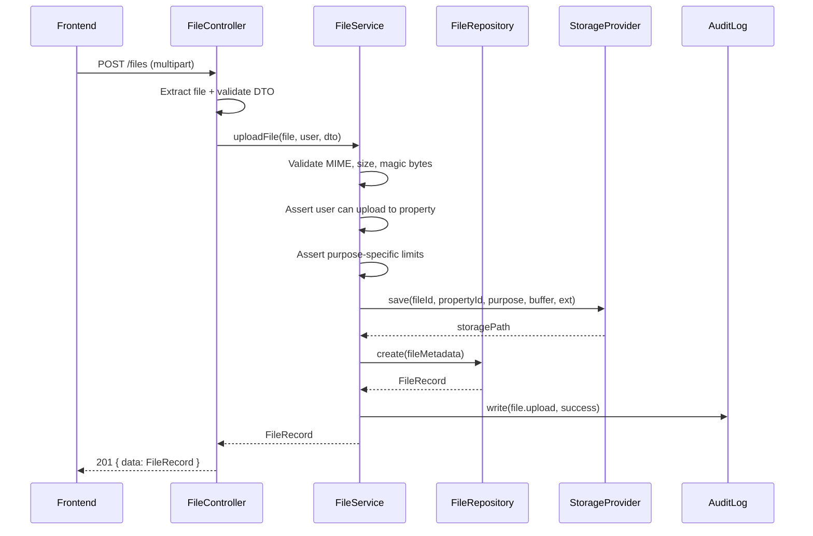
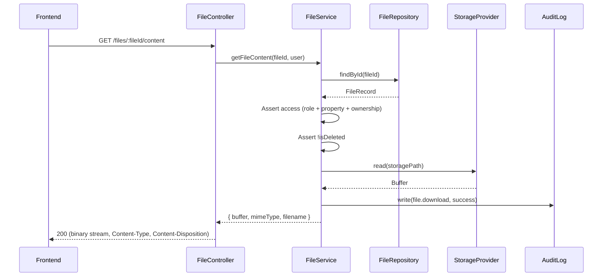
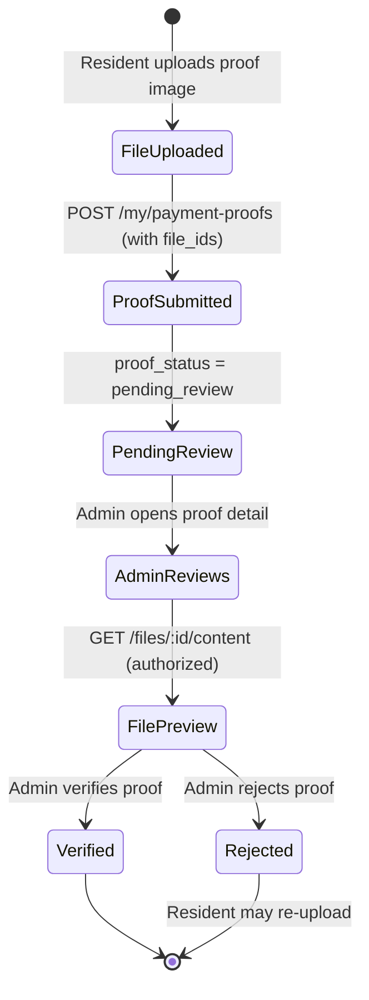

# M12C File Upload Foundation Architecture Plan

Date: 2026-07-02
Revised: 2026-07-02 (Storage-Conscious Revision)

Source:
- `docs/12-product-readiness/MOCKUP_FEATURE_GAP_AUDIT.md` (M12A)
- `docs/12-product-readiness/FEATURE_FLAG_PLACEHOLDER_HARDENING.md` (M12B)
- `docs/01-architecture/FRONTEND_ARCHITECTURE_DECISIONS.md` (ADR-FE-009)
- `docs/01-architecture/ADR-BE-FILE-001_BACKEND_MEDIATED_FILE_ACCESS.md`
- `docs/01-architecture/BACKEND_ARCHITECTURE.md`
- Current codebase inspection

---

## 1. Executive Summary

This document defines the File Upload Foundation Architecture for the Granada Kost Platform (Kostation). The file upload capability is the highest-impact gap identified in M12A: it blocks resident payment proof upload, complaint photo attachment, admin file review, and multiple future features (KTP, vehicle STNK, room photos).

The plan introduces a centralized **File API** at the backend that handles upload, metadata persistence, access control, preview/download, and audit. The frontend integrates through the existing `@granada-kost/api-client` using `multipart/form-data`. Storage begins with local disk (with a defined abstraction layer for future S3/cloud migration).

**Important constraint:** The production/staging VPS may start with only **2 vCPU, 8 GB RAM, and 80 GB SSD**. The file upload architecture must therefore be storage-conscious and abuse-resistant. Kostation is not a file storage platform — file upload exists solely for **operational evidence** (payment proofs, complaint photos, vehicle documents).

Key principles:
- **Backend is the only policy enforcement point.** No direct public storage access from frontend.
- **PostgreSQL is system of record** for all file metadata.
- **File access is scoped by role, property, and ownership context.**
- **Upload validates type, size, purpose, and ownership context.**
- **Preview/download goes through backend authorization** — no raw public URLs.
- **Audit trail for all file lifecycle actions.**
- **Storage-conscious limits are mandatory.** Strict per-purpose file size limits, max file counts, and upload rate limiting protect the constrained VPS.
- **Automated cleanup lifecycle.** Temporary, rejected, soft-deleted, and orphaned files are cleaned on schedule to prevent storage exhaustion.

---

## 2. Current State Analysis

### 2.1 File Upload Capability

The backend currently has **no file upload endpoint**. No `POST /files` route exists. The `@nestjs/platform-express` package ships with Multer 2.1.1 via `node_modules`, but Multer is not imported or configured in any application code. There is no `MulterModule` registration in `AppModule` or any feature module.

### 2.2 API Client

The `@granada-kost/api-client` (`packages/api-client/src/index.ts`) already supports `FormData` body:
- `buildBody()` detects `rawBody instanceof FormData` and skips `Content-Type` header, letting the runtime set the multipart boundary.
- This means the client is **upload-ready** — no API client change is required for `multipart/form-data` upload.

### 2.3 Backend Framework

- NestJS 11.x with `@nestjs/platform-express` (Express-based).
- Raw SQL via `pg` Pool (no Prisma ORM). All repositories use `DatabaseService.client.query<T>()`.
- `class-validator` + `class-transformer` for DTO validation via global `ValidationPipe`.
- JWT-based auth with `JwtAuthGuard` + `RbacGuard` using `@CurrentUser()` decorator.
- Audit logging via `AuditRepository.write()`.

### 2.4 Existing Database Models

There is **no central `files` table**. However, multiple domain-specific file junction tables exist and reference a `file_id UUID` column:

| Table | Migration | FK to parent | file_id column | Notes |
| --- | --- | --- | --- | --- |
| `vehicle_files` | 007 | `vehicles(id)` | `file_id UUID NOT NULL` | Has `file_purpose` enum |
| `complaint_files` | 006 | `complaints(id)` | `file_id UUID NOT NULL` | Unique on `(complaint_id, file_id)` |
| `maintenance_work_order_files` | 006 | `maintenance_work_orders(id)` | `file_id UUID NOT NULL` | Unique on `(work_order_id, file_id)` |
| `payment_proof_files` | 005 | `payment_proofs(id)` | `file_id UUID NOT NULL` | Unique on `(payment_proof_id, file_id)` |

**Critical observation:** All four tables reference `file_id` but there is **no `files` table** to be the FK target. The `file_id` columns are unlinked UUIDs. The M12C migration must create a central `files` table and optionally add FK constraints to existing junction tables.

Additionally, `rooms` has a `primary_photo_file_id` column referencing a file ID without a corresponding files table.

### 2.5 Existing Repository Patterns

Three existing file-attachment repositories follow a consistent pattern:

- `VehicleFileRepository` — `attach()` + `list()`
- `ComplaintFileRepository` — `attach()` + `list()`
- `WorkOrderFileRepository` — `attach()` + `list()`

All use raw SQL, `ON CONFLICT ... DO UPDATE`, and share a `{id, parentId, fileId, uploadedByUserId, caption, createdAt}` shape.

### 2.6 Auth/RBAC Patterns

- `JwtAuthGuard` → verifies JWT, resolves `UserAccessContext` from IAM.
- `RbacGuard` → checks `@RequireRoles()` and `@RequirePermissions()`.
- `@CurrentUser()` → injects `UserAccessContext { id, roles, permissions, propertyIds, sessionId }`.
- Property scoping: `PropertyService.assertCanReadProperty(user, propertyId)` enforces that the user has access to a given property.
- Resident self-scoping: `InvoiceService.getForUser(invoiceId, userId)` / `ComplaintService.getForUser(complaintId, userId)` enforces that the resident can only see their own resources.

### 2.7 Billing / Payment Proof Surface

- `payment_proofs` table exists with `proof_status` lifecycle: `pending_review → verified | rejected | expired`.
- `payment_proof_files` junction table exists.
- `PaymentProofService.submitProof()` creates metadata record but does **not** handle file upload.
- `CreateMyPaymentProofDto` has no `file_id` field.
- Penghuni billing UI (`apps/penghuni/src/routes/_app/billing.tsx`) shows `PayActionDisabled()` component with text "Tersedia setelah File API rilis".
- `usePenghuniBilling.ts` documents: "File upload for payment proof is NOT wired here."

### 2.8 Complaint / Maintenance Surface

- `complaint_files` and `maintenance_work_order_files` tables exist.
- Repositories (`ComplaintFileRepository`, `WorkOrderFileRepository`) exist with `attach()` and `list()`.
- Complaint create exists at `POST /my/complaints` via `MyComplaintController`.
- **No file attachment is integrated into the complaint create flow.**
- Penghuni complaint create is gated in UI: "Resident-safe category/create contract is incomplete."
- Mockup reference shows dummy "Upload foto" buttons in both Admin complaints and Penghuni complaints.

### 2.9 Frontend Disabled Upload Actions

| Location | Current State |
| --- | --- |
| Penghuni Billing | `PayActionDisabled()` — "Tersedia setelah File API rilis" |
| Penghuni Complaints | Create complaint gated, no file picker |
| Admin Settings | "Upload Logo" / "Pilih File" button exists (from mockup) but is dummy |
| Admin Complaints | No production upload — mockup reference only |
| Admin Payments | Proof review is read-only, no file preview/download |

---

## 3. Existing Codebase Findings Summary

| Area | Finding | Status |
| --- | --- | --- |
| Backend file upload endpoint | None exists | **GAP** — must create |
| Multer / multipart | Available in node_modules, not configured | **GAP** — must configure |
| Central `files` table | Does not exist | **GAP** — must create |
| Junction tables | 4 exist (`payment_proof_files`, `complaint_files`, `work_order_files`, `vehicle_files`) | Existing — will FK to new `files` table |
| API client FormData support | Present in `buildBody()` | **READY** |
| Auth/RBAC guards | Mature, pattern-consistent | **READY** |
| Audit logging | `AuditRepository.write()` operational | **READY** |
| Property scoping | `assertCanReadProperty()` operational | **READY** |
| Resident self-scoping | `getForUser()` pattern operational | **READY** |
| Storage config (S3/local) | No storage config in env or config | **GAP** — must add |

---

## 4. Mockup Reference Findings

From mockup inspection:

- **Admin Complaints** (`mockup/Console Admin KOST/src/routes/complaints.tsx`): Shows complaint photo display (``) and "Upload Foto" button (dummy toast).
- **Penghuni Complaints** (`mockup/App Mobile Penghuni KOST/src/routes/_app/complaints.tsx`): Shows "Upload foto (dummy)" button with `ImagePlus` icon.
- **Admin Settings** (`mockup/Console Admin KOST/src/routes/settings.tsx`): Shows "Upload Logo" with `Upload` icon and "Pilih File" button.
- **Complaint mock data** includes `photo: string` (Unsplash URL) per complaint.

Mockup confirms the expected UX surface: inline image preview for complaints, file picker modal, upload progress indication. These inform the frontend integration design but do not dictate backend architecture.

---

## 5. File Upload Goals and Non-Goals

### Goals

1. Create a centralized File API (`POST /files`, `GET /files/:id`, `GET /files/:id/content`, `DELETE /files/:id`).
2. Persist file metadata in PostgreSQL (`files` table).
3. Store file bytes on local disk with an abstraction layer (`FileStorageProvider`) for future S3/cloud migration.
4. Enforce file type, size, and purpose validation at backend.
5. Enforce access control (role + property + ownership) for upload, preview, download, and delete.
6. Support payment proof file attachment (M12C3).
7. Prepare complaint/maintenance file attachment readiness (M12C4).
8. Build admin file preview/review surface (M12C5).
9. Audit all file lifecycle actions.

### Non-Goals

- Payment gateway integration (deferred).
- Complaint create implementation (M12D).
- Direct-to-S3 upload from frontend (Phase 2).
- **Video upload is not supported in Phase 1.** No video MIME types in any purpose allowlist.
- **Chat file attachment is not supported in Phase 1.** If enabled later, max 1 MB per image.
- Real-time upload progress via WebSocket (use standard XHR progress).
- CDN or edge caching.
- Virus/malware scanning (documented as future enhancement).
- Server-side image resize/thumbnail generation (documented as future enhancement; client-side compression is required — see Section 10.6).

---

## 6. Recommended Architecture

### 6.1 Architecture Diagram

```
┌──────────────────┐     multipart/form-data     ┌──────────────────────────┐
│   Frontend App   │ ──────────────────────────── │   NestJS File Controller │
│   (Admin/Penghuni)│ ◄── JSON (file metadata) ── │   @Controller('files')   │
└──────────────────┘                              └──────────┬───────────────┘
                                                             │
                                                    ┌────────▼────────┐
                                                    │  FileService     │
                                                    │  (policy layer)  │
                                                    └───┬──────────┬──┘
                                                        │          │
                                              ┌─────────▼──┐  ┌───▼──────────────┐
                                              │FileRepository│  │FileStorageProvider│
                                              │(PostgreSQL)  │  │(local disk / S3) │
                                              └──────────────┘  └──────────────────┘
```

### 6.2 Module Structure

```
backend/api/src/modules/file/
├── file.module.ts
├── file.controller.ts
├── file.service.ts
├── file.repository.ts
├── storage/
│   ├── file-storage.provider.ts     (interface)
│   └── local-file-storage.ts        (implementation)
├── dto/
│   ├── upload-file.dto.ts
│   └── file-query.dto.ts
├── constants/
│   └── file.constants.ts            (MIME types, size limits, purposes)
├── guards/
│   └── file-access.guard.ts         (ownership/scope check)
└── types/
    └── file.types.ts
```

### 6.3 NestJS Module Registration

`FileModule` will be imported by `AppModule`. It depends on:
- `DatabaseModule` (file metadata persistence)
- `AuditModule` (action logging)
- `IamModule` (user resolution)
- `RbacModule` (role/permission guards)
- `MulterModule.register()` (configured with disk storage + limits)

---

## 7. Storage Strategy

### 7.0 VPS Storage Constraint

The production/staging VPS may start with:

| Resource | Capacity |
| --- | --- |
| CPU | 2 vCPU |
| RAM | 8 GB |
| Disk | **80 GB SSD** |

Budget breakdown for 80 GB SSD:

| Usage | Estimated Budget |
| --- | --- |
| OS + system packages | ~10 GB |
| PostgreSQL data | ~10 GB (generous for Phase 1) |
| Redis data | ~1 GB |
| Application code + node_modules | ~2 GB |
| Logs | ~5 GB (with rotation) |
| **File uploads** | **~40 GB max** |
| Headroom / safety | ~12 GB |

This means the file upload subsystem must operate within approximately **40 GB of usable disk space**. With strict per-file limits (max 5 MB per file) and cleanup policies, this supports thousands of operational files comfortably. However, abuse (large files, rapid uploads, no cleanup) could exhaust this budget.

**Kostation is not a file storage platform.** File upload exists solely for operational evidence: payment proofs, complaint photos, maintenance documentation, vehicle documents, and identity verification.

### 7.1 Phase 1: Local Disk

Files are stored in a configurable local directory:
```
UPLOAD_STORAGE_PATH=./uploads       # default: ./uploads relative to CWD
UPLOAD_MAX_FILE_SIZE_MB=5            # max single file size (reduced from 10)
UPLOAD_BASE_URL=                     # optional: override download URL base
UPLOAD_STORAGE_QUOTA_MB=40960        # optional: total upload storage quota (40 GB)
```

Directory structure:
```
uploads/
├── {property_id}/
│   ├── payment-proof/
│   │   └── {file_id}.{ext}
│   ├── complaint/
│   │   └── {file_id}.{ext}
│   ├── maintenance/
│   │   └── {file_id}.{ext}
│   ├── vehicle/
│   │   └── {file_id}.{ext}
│   └── general/
│       └── {file_id}.{ext}
```

### 7.2 Storage Abstraction

```typescript
export interface FileStorageProvider {
  save(fileId: string, propertyId: string, purpose: string, buffer: Buffer, ext: string): Promise<string>;
  read(storagePath: string): Promise<Buffer>;
  delete(storagePath: string): Promise<void>;
  exists(storagePath: string): Promise<boolean>;
  totalSizeBytes?(): Promise<number>; // optional: for quota monitoring
}
```

`LocalFileStorage` implements this interface. A future `S3FileStorage` can be swapped via config without changing service layer.

### 7.3 Migration Path

To migrate from local to S3:
1. Create `S3FileStorage implements FileStorageProvider`.
2. Add `UPLOAD_STORAGE_DRIVER=s3` env variable.
3. Add S3 config (`UPLOAD_S3_BUCKET`, `UPLOAD_S3_REGION`, `UPLOAD_S3_ACCESS_KEY`, etc.).
4. Register the appropriate provider in `FileModule` based on config.
5. Migrate existing files via a one-time script that reads from `files.storage_path` and re-uploads.

### 7.4 Cleanup and Retention Policy

Automated cleanup prevents storage exhaustion on the constrained VPS:

| Category | Condition | Retention | Cleanup Action |
| --- | --- | --- | --- |
| **Temporary unlinked uploads** | File uploaded but never attached to any domain entity (no junction table entry) | **24 hours** after upload | Soft-delete → physical delete |
| **Soft-deleted files** | `is_deleted = true` | **30 days** after `deleted_at` | Physical delete from disk |
| **Rejected payment proof files** | Attached to a payment proof with `proof_status = 'rejected'` | **90 days** after rejection | Soft-delete → physical delete |
| **Expired payment proof files** | Attached to a payment proof with `proof_status = 'expired'` | **90 days** after expiry | Soft-delete → physical delete |
| **Orphaned files** | File record exists but storage file is missing, or vice versa | Detected by scheduled job | Log warning, mark for admin review |

Cleanup implementation:
- Phase 1: Manual cleanup via admin script (`npm run file:cleanup`). No automated scheduler.
- Phase 2: Scheduled background job (cron) for automated cleanup.
- All cleanup actions are audited with `file.cleanup` action.
- Physical deletion only occurs after the retention period. No immediate physical deletion on soft-delete.

### 7.5 Storage Quota (Optional — Phase 1 Ready, Enforced Later)

Optional per-property storage quota:

```
UPLOAD_PROPERTY_QUOTA_MB=5120       # optional: 5 GB per property
```

When set, `FileService` checks total file size for the property before accepting a new upload. If quota is exceeded, the upload is rejected with error code `FILE_STORAGE_QUOTA_EXCEEDED`.

Phase 1: quota check is implemented but disabled by default (no env var set). Phase 2: enable with appropriate limits per property tier.

### 7.6 Disk Usage Monitoring

The `/health` endpoint should report upload storage usage when available:
- Total files count
- Total storage bytes used (from `SUM(file_size_bytes)` on `files` table where `is_deleted = false`)
- Quota percentage if quota is configured

This enables ops monitoring without direct disk inspection.

---

## 8. Database / File Metadata Design

### 8.1 New `files` Table

```sql
CREATE TABLE IF NOT EXISTS files (
  id UUID PRIMARY KEY DEFAULT gen_random_uuid(),
  property_id UUID NOT NULL REFERENCES properties(id) ON DELETE CASCADE,
  uploader_user_id UUID NOT NULL REFERENCES users(id) ON DELETE RESTRICT,
  original_filename TEXT NOT NULL,
  mime_type TEXT NOT NULL,
  file_size_bytes BIGINT NOT NULL,
  file_purpose TEXT NOT NULL,
  storage_path TEXT NOT NULL,
  storage_driver TEXT NOT NULL DEFAULT 'local',
  checksum_sha256 TEXT,
  is_deleted BOOLEAN NOT NULL DEFAULT false,
  deleted_at TIMESTAMPTZ,
  deleted_by_user_id UUID REFERENCES users(id) ON DELETE SET NULL,
  created_at TIMESTAMPTZ NOT NULL DEFAULT now(),
  CONSTRAINT files_size_check CHECK (file_size_bytes > 0),
  CONSTRAINT files_purpose_check CHECK (
    file_purpose IN (
      'payment_proof',
      'complaint_attachment',
      'maintenance_attachment',
      'vehicle_photo',
      'vehicle_document',
      'room_photo',
      'property_logo',
      'ktp',
      'general'
    )
  ),
  CONSTRAINT files_storage_driver_check CHECK (storage_driver IN ('local', 's3'))
);

CREATE INDEX IF NOT EXISTS idx_files_property_purpose
  ON files(property_id, file_purpose, created_at DESC);

CREATE INDEX IF NOT EXISTS idx_files_uploader
  ON files(uploader_user_id, created_at DESC);

-- Soft-delete index for cleanup jobs
CREATE INDEX IF NOT EXISTS idx_files_deleted
  ON files(is_deleted, deleted_at)
  WHERE is_deleted = true;
```

### 8.2 FK Constraints on Existing Junction Tables

Add foreign key constraints to existing junction tables (via new migration):

```sql
-- Only if the junction tables don't already have FK on file_id:
ALTER TABLE payment_proof_files
  ADD CONSTRAINT payment_proof_files_file_fk
  FOREIGN KEY (file_id) REFERENCES files(id) ON DELETE RESTRICT;

ALTER TABLE complaint_files
  ADD CONSTRAINT complaint_files_file_fk
  FOREIGN KEY (file_id) REFERENCES files(id) ON DELETE RESTRICT;

ALTER TABLE maintenance_work_order_files
  ADD CONSTRAINT maintenance_work_order_files_file_fk
  FOREIGN KEY (file_id) REFERENCES files(id) ON DELETE RESTRICT;

ALTER TABLE vehicle_files
  ADD CONSTRAINT vehicle_files_file_fk
  FOREIGN KEY (file_id) REFERENCES files(id) ON DELETE RESTRICT;
```

### 8.3 File Record Type

```typescript
export type FileRecord = {
  id: string;
  propertyId: string;
  uploaderUserId: string;
  originalFilename: string;
  mimeType: string;
  fileSizeBytes: number;
  filePurpose: FilePurpose;
  storagePath: string;
  storageDriver: 'local' | 's3';
  checksumSha256: string | null;
  isDeleted: boolean;
  deletedAt: Date | null;
  deletedByUserId: string | null;
  createdAt: Date;
};
```

---

## 9. Backend API Design

### 9.1 Endpoints

| Method | Path | Guard | Description |
| --- | --- | --- | --- |
| `POST` | `/api/v1/files` | `JwtAuthGuard` + ownership | Upload a file |
| `GET` | `/api/v1/files/:fileId` | `JwtAuthGuard` + access check | Get file metadata |
| `GET` | `/api/v1/files/:fileId/content` | `JwtAuthGuard` + access check | Download/preview file content |
| `DELETE` | `/api/v1/files/:fileId` | `JwtAuthGuard` + `RbacGuard` | Soft-delete a file |

### 9.2 Upload Endpoint

```
POST /api/v1/files
Content-Type: multipart/form-data

Fields:
  file:            (binary, required) — the uploaded file
  property_id:     (UUID, required) — scoping context
  file_purpose:    (string, required) — one of the valid purposes
  context_id:      (UUID, optional) — parent resource ID (invoice_id, complaint_id, etc.)

Response: 201 Created
{
  "data": {
    "id": "uuid",
    "propertyId": "uuid",
    "originalFilename": "bukti-transfer.jpg",
    "mimeType": "image/jpeg",
    "fileSizeBytes": 245832,
    "filePurpose": "payment_proof",
    "createdAt": "2026-07-02T12:00:00Z"
  }
}
```

### 9.3 File Content / Preview Endpoint

```
GET /api/v1/files/:fileId/content

Response: 200 OK
Content-Type: <original mime type>
Content-Disposition: inline; filename="bukti-transfer.jpg"
Cache-Control: private, max-age=300

(binary file content)
```

The backend reads the file from storage, verifies access, and streams it.
This ensures **no direct public storage URL is ever exposed to the frontend**.

### 9.4 Metadata Endpoint

```
GET /api/v1/files/:fileId

Response: 200 OK
{
  "data": {
    "id": "uuid",
    "propertyId": "uuid",
    "originalFilename": "bukti-transfer.jpg",
    "mimeType": "image/jpeg",
    "fileSizeBytes": 245832,
    "filePurpose": "payment_proof",
    "createdAt": "2026-07-02T12:00:00Z"
  }
}
```

### 9.5 Soft-Delete Endpoint

```
DELETE /api/v1/files/:fileId

Response: 200 OK
{ "data": { "id": "uuid", "isDeleted": true } }
```

Only `owner`, `manager`, or `admin` roles with property scope can delete files.
Soft-delete sets `is_deleted = true` and `deleted_at`. Physical cleanup is a future background job.

---

## 10. Frontend Integration Design

### 10.1 API Client Usage

The existing `ApiClient.post()` already supports `FormData`:

```typescript
const formData = new FormData();
formData.append('file', selectedFile);
formData.append('property_id', propertyId);
formData.append('file_purpose', 'payment_proof');
formData.append('context_id', invoiceId);

const result = await apiClient.post<FileRecord>('/files', formData, {
  idempotencyKey: crypto.randomUUID(),
});
```

### 10.2 New Hook: `useFileUpload`

Create `packages/api-client/src/file-upload.ts` or within each app's `hooks/`:

```typescript
export function useFileUpload() {
  return useMutation<FileRecord, unknown, FileUploadInput>({
    mutationFn: (input) => {
      const formData = new FormData();
      formData.append('file', input.file);
      formData.append('property_id', input.propertyId);
      formData.append('file_purpose', input.filePurpose);
      if (input.contextId) formData.append('context_id', input.contextId);
      return apiClient.post<FileRecord>('/files', formData, {
        idempotencyKey: crypto.randomUUID(),
      });
    },
  });
}
```

### 10.3 File Preview URL Pattern

Per ADR-FE-009, preview uses backend-authorized URL. The preferred approach is **authorized blob fetch via the API client**, not direct `` pointing to the content endpoint, because the API client manages JWT auth headers. Direct `` would require cookie-based content auth, which is not currently supported.

```typescript
// Preferred: fetch blob via API client, create object URL for display
async function fetchFileBlob(fileId: string): Promise<string> {
  const response = await apiClient.rawFetch(`/files/${fileId}/content`);
  const blob = await response.blob();
  return URL.createObjectURL(blob);
}
```

Object URLs must be revoked when the component unmounts (`URL.revokeObjectURL`) to prevent memory leaks.

### 10.4 Client-Side Validation

Per ADR-FE-009 (revised for storage-conscious limits):
- MIME allowlist: `image/jpeg`, `image/png`, `application/pdf`
- Max 2 MB for images, 5 MB for PDFs (revised down from 5/10 MB)
- Validation happens before upload; server re-validates authoritatively.
- Show clear, user-friendly error message in Indonesian when file is too large.

### 10.5 Upload UX Components

- `<FilePickerButton>` — triggers native file input, validates client-side, shows error if invalid.
- `<FileUploadProgress>` — shows upload progress bar using `XMLHttpRequest.upload.onprogress` or fetch stream.
- `<FilePreview>` — displays uploaded file thumbnail (image) or icon (PDF) with filename.
- `<FilePreviewModal>` — full-screen preview for admin review.
- `<WhatsAppFallbackButton>` — shown when upload is unavailable, fails repeatedly, or file is too large. Opens WhatsApp deep link to property admin with pre-filled message context.

### 10.6 Client-Side Image Compression

For complaint camera uploads and other image-from-camera flows, the frontend should compress and resize images before upload to reduce bandwidth and storage consumption.

Recommended settings:
- **Max width**: 1600 px (maintain aspect ratio).
- **JPEG quality**: 0.75–0.80.
- **Output format**: Always JPEG for camera captures (even if source is PNG from screenshot).
- **Implementation**: Use `<canvas>` API to resize and re-encode. No external library required for basic resize; `browser-image-compression` may be used if more control is needed.

Compression is a UX optimization, not a security measure. Server-side size limits remain authoritative.

### 10.7 WhatsApp Admin Fallback

When file upload is unavailable, fails repeatedly, or the file is too large, the frontend should display a WhatsApp fallback option:

```typescript
function whatsappFallbackUrl(adminPhone: string, context: string): string {
  const message = encodeURIComponent(
    `Halo Admin, saya ingin mengirim ${context} tapi tidak dapat mengupload melalui aplikasi. Mohon bantuan.`
  );
  return `https://wa.me/${adminPhone}?text=${message}`;
}
```

Conditions for showing the fallback:
- Upload endpoint returns 5xx three times in a row.
- Client-side validation rejects the file as too large.
- File upload feature flag is disabled.
- Network connectivity issue detected.

The fallback is a safety net for the pre-site-visit period when the VPS may have intermittent issues.

---

## 11. File Type and Size Policy (Storage-Conscious)

Revised limits are based on the 80 GB SSD VPS constraint. Kostation is not a file storage platform — uploads are operational evidence only.

| Purpose | Allowed MIME Types | Max Image Size | Max PDF Size | Max Files Per Entity |
| --- | --- | --- | --- | --- |
| `payment_proof` | `image/jpeg`, `image/png`, `application/pdf` | **2 MB** | **5 MB** | 3 per payment proof |
| `complaint_attachment` | `image/jpeg`, `image/png` | **2 MB** | — | 5 per complaint |
| `maintenance_attachment` | `image/jpeg`, `image/png` | **2 MB** | — | 5 per work order |
| `vehicle_photo` | `image/jpeg`, `image/png` | **2 MB** | — | 3 per vehicle |
| `vehicle_document` | `image/jpeg`, `image/png`, `application/pdf` | **2 MB** | **5 MB** | 2 per vehicle |
| `room_photo` | `image/jpeg`, `image/png` | **2 MB** | — | 10 per room |
| `property_logo` | `image/jpeg`, `image/png` | **1 MB** | — | 1 per property |
| `ktp` | `image/jpeg`, `image/png`, `application/pdf` | **2 MB** | **5 MB** | 1 per resident |
| `general` | `image/jpeg`, `image/png`, `application/pdf` | **2 MB** | **5 MB** | — |
| `chat_attachment` | — | — | — | **Not supported in Phase 1** |
| `video` | — | — | — | **Not supported in Phase 1** |

### Storage Impact Estimation

With these limits, worst-case storage per property (assuming 100 rooms, 100 residents, 50 vehicles):

| Category | Worst-case files | Max size each | Worst-case total |
| --- | --- | --- | --- |
| Payment proofs | 100 residents × 12 months × 3 files | 2 MB | ~7 GB |
| Complaints | 500 complaints × 5 files | 2 MB | ~5 GB |
| Vehicle photos | 50 vehicles × 3 photos | 2 MB | ~300 MB |
| Vehicle documents | 50 vehicles × 2 docs | 5 MB | ~500 MB |
| Room photos | 100 rooms × 10 photos | 2 MB | ~2 GB |
| KTP | 100 residents × 1 file | 2 MB | ~200 MB |
| **Total worst-case** | | | **~15 GB** |

This fits well within the 40 GB upload budget. Cleanup of rejected/expired proofs further reduces actual usage.

### Server-Side Validation

1. Check `Content-Type` header against purpose-specific allowlist.
2. Read file magic bytes to verify actual file type (prevent MIME spoofing). Uses `file-type` npm package (see Section 21).
3. Reject files exceeding purpose-specific size limit.
4. Reject files with dangerous extensions (`.exe`, `.sh`, `.bat`, `.cmd`, `.ps1`, `.vbs`, `.js`, `.html`, `.htm`, `.svg`, `.xml`, etc.).
5. Compute and store `checksum_sha256` for every uploaded file.
6. Optionally detect duplicate uploads by SHA256 checksum within the same property + purpose context (warn but do not reject in Phase 1).

### Upload Rate Limiting

| Scope | Limit | Window |
| --- | --- | --- |
| Per user | 10 uploads | 1 minute |
| Per user | 50 uploads | 1 hour |
| Per property | 100 uploads | 1 hour |

Rate limiting is enforced at the `FileController` level using the existing Redis-based rate limiter pattern. Exceeding the limit returns `429 Too Many Requests`.

---

## 12. Access Control Matrix

| Action | Owner | Manager | Admin | Technician | Resident | Notes |
| --- | --- | --- | --- | --- | --- | --- |
| Upload file | ✅ | ✅ | ✅ | ✅ (assigned WO only) | ✅ (own context only) | Purpose-scoped |
| View own file metadata | ✅ | ✅ | ✅ | ✅ (assigned) | ✅ | — |
| View any file metadata (property) | ✅ | ✅ | ✅ | ❌ | ❌ | Property-scoped |
| Download/preview own file | ✅ | ✅ | ✅ | ✅ (assigned) | ✅ | — |
| Download/preview any file (property) | ✅ | ✅ | ✅ | ❌ | ❌ | Property-scoped |
| Delete file | ✅ | ✅ | ✅ | ❌ | ❌ | Soft-delete only |
| Payment proof file upload | ❌ | ❌ | ❌ | ❌ | ✅ (own invoice) | Resident-only |
| Payment proof file preview | ✅ | ✅ | ✅ | ❌ | ✅ (own proof) | — |
| Complaint file upload | ❌ | ❌ | ✅ | ✅ (assigned) | ✅ (own complaint) | — |
| Complaint file preview | ✅ | ✅ | ✅ | ✅ (assigned) | ✅ (own complaint) | — |
| Maintenance file upload | ❌ | ❌ | ✅ | ✅ (assigned WO) | ❌ | — |
| Maintenance file preview | ✅ | ✅ | ✅ | ✅ (assigned WO) | ❌ | — |

### Access Resolution Flow

```
1. Authenticate user (JwtAuthGuard)
2. Resolve file metadata from `files` table
3. Check: user.propertyIds includes file.propertyId?
   - No → 403 FORBIDDEN
4. Check role-based access:
   - owner/manager/admin → ALLOW (property-scoped)
   - technician → check if user is assigned to related work order/complaint
   - resident → check if file was uploaded by user OR user owns parent resource
5. Log access in audit_logs
```

---

## 13. Upload Lifecycle



### Upload Validation Sequence

1. **Client-side** (UX only): MIME + size check + optional image compression before upload starts.
2. **Multer layer**: Reject files exceeding `UPLOAD_MAX_FILE_SIZE_MB` (5 MB hard ceiling).
3. **FileService**: Validate MIME against purpose-specific allowlist.
4. **FileService**: Read magic bytes via `file-type` to verify actual content type.
5. **FileService**: Check file size against purpose-specific limit (may be lower than Multer ceiling).
6. **FileService**: Reject dangerous file extensions.
7. **FileService**: Compute SHA256 checksum.
8. **FileService**: Optionally check for duplicate checksum within property+purpose (warn, do not reject).
9. **FileService**: Check purpose-specific file count limits.
10. **FileService**: Check upload rate limit (per user, per property).
11. **FileService**: Assert user has permission to upload to the target property.
12. **FileService**: Optionally check property storage quota.

---

## 14. Preview / Download Lifecycle



Content-Type and Content-Disposition headers:
- Images: `Content-Disposition: inline` (for preview in browser/img tag)
- PDFs: `Content-Disposition: inline` (for preview in browser)
- Download force: `?download=true` → `Content-Disposition: attachment`

Cache headers: `Cache-Control: private, max-age=300` (5 min client-side cache, no CDN).

---

## 15. Review / Approval Lifecycle for Payment Proof



### Flow Details

1. **Resident** selects invoice → opens payment proof form.
2. **Resident** picks file(s) → client validates type/size → uploads via `POST /files` with `purpose=payment_proof`.
3. **Backend** returns `file_id(s)`.
4. **Resident** submits proof metadata via `POST /my/payment-proofs` with `file_ids: [uuid]`.
5. **Backend** creates `payment_proofs` record + `payment_proof_files` junction entries.
6. **Admin** sees proof in review queue → clicks to view detail.
7. **Admin** views attached files via `GET /files/:id/content` (authorized by property scope + role).
8. **Admin** verifies or rejects proof.
9. **Audit** logs all actions: upload, preview, verify, reject.

### DTO Changes Required

`CreateMyPaymentProofDto` must be extended:
```typescript
// Added field:
@IsOptional()
@IsArray()
@IsUUID('4', { each: true })
file_ids?: string[];
```

---

## 16. Attachment Lifecycle for Complaints / Maintenance

### Complaint Attachment Flow (M12C4 — readiness only)

1. Resident creates complaint via `POST /my/complaints`.
2. Optionally attaches files by uploading first (`POST /files` with `purpose=complaint_attachment`), then including `file_ids` in the create payload.
3. Backend creates `complaint_files` junction entries linking `complaint.id ↔ file.id`.
4. Admin/technician views complaint detail → sees attached files via `GET /files/:id/content`.

**M12C4 scope**: Only the backend API readiness (accepting `file_ids` in complaint create DTO + creating junction entries). Frontend complaint create UI is deferred to M12D.

### Maintenance Attachment Flow

Similar to complaint. Technician or admin uploads files during work order progress updates. Junction entries created in `maintenance_work_order_files`. This is already partially wired via `WorkOrderFileRepository.attach()`.

---

## 17. Audit and Logging Requirements

### Audit Actions

| Action | `resource_type` | `action` | Logged Data |
| --- | --- | --- | --- |
| Upload file | `file` | `file.upload` | file_id, purpose, mime_type, size, property_id |
| Download/preview file | `file` | `file.download` | file_id, purpose |
| Delete file (soft) | `file` | `file.delete` | file_id, purpose, deleted_by |
| Payment proof submit | `payment_proof` | `payment_proof.submit` | proof_id, file_ids, invoice_id |
| Payment proof verify | `payment_proof` | `payment.verify` | proof_id, payment_id (existing) |
| Payment proof reject | `payment_proof` | `payment.reject` | proof_id, reason (existing) |
| Complaint file attach | `complaint` | `complaint.file_attach` | complaint_id, file_id |

### Logging Rules

- All audit writes include: `actor_user_id`, `property_id`, `ip_address`, `user_agent`, `correlation_id`.
- File content is never logged (no binary in audit).
- Original filename is logged (for traceability) but may be masked in future for PII-sensitive files (KTP).
- Failed upload attempts (validation failures) are logged with `result_status = 'failed'`.
- Unauthorized access attempts are logged with `result_status = 'denied'`.

---

## 18. Security Risks and Mitigations

| Risk | Severity | Mitigation |
| --- | --- | --- |
| **MIME spoofing** | High | Validate magic bytes via `file-type` library, not just Content-Type header. |
| **Path traversal** | High | Never use user-supplied filenames in storage paths. Use `{file_id}.{ext}` only. |
| **File size DoS** | High | Multer 5 MB hard ceiling + purpose-specific limits (1–5 MB) + rate limiting per user (10/min, 50/hr). |
| **Upload volume DoS** | High | Per-user and per-property upload rate limits. Optional property storage quota. |
| **Cross-property file leak** | Critical | Backend enforces `file.propertyId ∈ user.propertyIds` on every access. |
| **Cross-resident file leak** | Critical | Resident can only access files they uploaded or files attached to their own resources. |
| **Stored XSS via filename** | Medium | Sanitize `originalFilename` — strip HTML/JS. Never render as HTML. |
| **Unrestricted file types** | High | Strict allowlist per purpose. No executables, scripts, archives, HTML, SVG, or XML. |
| **Storage exhaustion** | High | Strict per-file limits (max 2 MB images, 5 MB PDFs). Optional per-property quota. Automated cleanup of temporary, rejected, and soft-deleted files (see Section 7.4). |
| **Duplicate upload waste** | Low | SHA256 checksum tracked. Duplicate detection warns (Phase 1) or rejects (Phase 2). |
| **Missing audit trail** | Medium | Audit every file action. Log denied access attempts with `result_status = 'denied'`. |
| **Malware in uploaded files** | Medium | Future: integrate ClamAV or cloud scanning. Phase 1: rely on type/size/magic-byte validation and restricted access. |
| **Direct storage URL exposure** | High | All file access goes through backend. No public-accessible storage URLs. Storage directory outside web root. |

### Abuse Prevention Checklist

- [x] Reject unsupported file types (MIME allowlist per purpose).
- [x] Reject oversized files (purpose-specific limits, Multer hard ceiling).
- [x] Reject dangerous extensions (blocklist: `.exe`, `.sh`, `.bat`, `.cmd`, `.ps1`, `.vbs`, `.js`, `.html`, `.htm`, `.svg`, `.xml`, `.php`, `.asp`, `.jar`, `.war`).
- [x] Validate magic bytes via `file-type` library.
- [x] Rate limit upload attempts (per user: 10/min, 50/hr; per property: 100/hr).
- [x] Track `checksum_sha256` for every uploaded file.
- [x] Consider duplicate upload detection (warn in Phase 1).
- [x] Store files outside public web root.
- [x] All preview/download must go through backend authorization.
- [x] No public storage URL.
- [x] Audit upload, preview/download, delete/reject/review actions.
- [x] Log denied access attempts.

### Additional Hardening

- Storage directory must NOT be within the static file serving path.
- `.htaccess` / nginx deny rules on the uploads directory.
- `Content-Security-Policy` headers on content responses.
- `X-Content-Type-Options: nosniff` on all file content responses.
- Rate limit: max 10 file uploads per minute per user, max 50 per hour.
- SHA256 checksum computed and stored for every file.
- Cleanup policy enforced (see Section 7.4):
  - Temporary unlinked uploads: deleted after 24 hours.
  - Soft-deleted files: physically cleaned after 30 days.
  - Rejected payment proof files: eligible for cleanup after 90 days.
  - Orphaned files: monitored and cleaned by scheduled job.

---

## 19. Implementation Breakdown

### M12C1 — Backend File API Foundation

**Scope**: Core file module, migration, storage provider, upload/download/metadata/delete endpoints.

**Files**:
- `[NEW] backend/api/src/infrastructure/database/migrations/011_files.sql`
- `[NEW] backend/api/src/modules/file/file.module.ts`
- `[NEW] backend/api/src/modules/file/file.controller.ts`
- `[NEW] backend/api/src/modules/file/file.service.ts`
- `[NEW] backend/api/src/modules/file/file.repository.ts`
- `[NEW] backend/api/src/modules/file/storage/file-storage.provider.ts`
- `[NEW] backend/api/src/modules/file/storage/local-file-storage.ts`
- `[NEW] backend/api/src/modules/file/dto/upload-file.dto.ts`
- `[NEW] backend/api/src/modules/file/dto/file-query.dto.ts`
- `[NEW] backend/api/src/modules/file/constants/file.constants.ts`
- `[NEW] backend/api/src/modules/file/types/file.types.ts`
- `[MODIFY] backend/api/src/app.module.ts` — import `FileModule`
- `[MODIFY] backend/api/src/infrastructure/config/configuration.ts` — add `upload` config section
- `[MODIFY] backend/api/src/infrastructure/config/environment.validation.ts` — add upload env vars
- `[MODIFY] backend/api/.env.example` — add upload env vars

**Acceptance**:
- `POST /files` accepts multipart upload, validates, persists metadata, saves to disk.
- `GET /files/:id` returns metadata with access control.
- `GET /files/:id/content` streams file with access control.
- `DELETE /files/:id` soft-deletes with audit.
- All actions produce audit log entries.
- File type/size validation rejects invalid uploads with clear error codes.

---

### M12C2 — Frontend File API Client

**Scope**: Shared upload hook, file picker component, preview component, client-side validation.

**Files**:
- `[NEW] apps/admin/src/hooks/useFileUpload.ts`
- `[NEW] apps/penghuni/src/hooks/useFileUpload.ts`
- `[NEW] apps/admin/src/components/file/FilePickerButton.tsx`
- `[NEW] apps/admin/src/components/file/FilePreview.tsx`
- `[NEW] apps/admin/src/components/file/FilePreviewModal.tsx`
- `[NEW] apps/penghuni/src/components/file/FilePickerButton.tsx`
- `[NEW] apps/penghuni/src/components/file/FilePreview.tsx`
- `[NEW] packages/domain/src/file.ts` — shared file types/constants

**Acceptance**:
- `useFileUpload()` hook handles FormData construction, upload, error handling.
- `FilePickerButton` validates file type/size client-side before upload.
- `FilePreview` renders image thumbnail or PDF icon with filename.
- `FilePreviewModal` provides full-screen authorized preview.
- Build passes for both apps.

---

### M12C3 — Penghuni Payment Proof Upload

**Scope**: Enable resident payment proof upload flow end-to-end.

**Files**:
- `[MODIFY] backend/api/src/modules/billing/dto/create-my-payment-proof.dto.ts` — add `file_ids`
- `[MODIFY] backend/api/src/modules/billing/controllers/my-billing.controller.ts` — handle file_ids
- `[MODIFY] backend/api/src/modules/billing/services/payment-proof.service.ts` — attach files
- `[NEW] backend/api/src/modules/billing/repositories/payment-proof-file.repository.ts`
- `[MODIFY] apps/penghuni/src/routes/_app/billing.tsx` — replace `PayActionDisabled` with working upload
- `[MODIFY] apps/penghuni/src/hooks/usePenghuniBilling.ts` — integrate file upload into proof submission

**Acceptance**:
- Resident can select file → upload → submit payment proof with attached file.
- `PayActionDisabled` component is replaced with a working upload form.
- Backend persists proof + file junction + audit.
- Resident can view their own uploaded proof files.
- Admin can view proof files in review queue (M12C5).

---

### M12C4 — Complaint Attachment Readiness

**Scope**: Backend-only readiness for complaint file attachment. Frontend deferred to M12D.

**Files**:
- `[MODIFY] backend/api/src/modules/complaint/dto/create-my-complaint.dto.ts` — add optional `file_ids`
- `[MODIFY] backend/api/src/modules/complaint/controllers/my-complaint.controller.ts` — handle file_ids
- `[MODIFY] backend/api/src/modules/complaint/services/complaint.service.ts` — attach files on create

**Acceptance**:
- `POST /my/complaints` accepts optional `file_ids` array.
- Backend creates `complaint_files` junction entries.
- Backend validates files exist, belong to same property, are not deleted, and purpose is `complaint_attachment`.
- No frontend changes (complaint create UI is M12D scope).

---

### M12C5 — Admin File Preview/Review

**Scope**: Admin can view uploaded files in payment proof review and complaint detail.

**Files**:
- `[MODIFY] apps/admin/src/routes/payments.tsx` — add file preview in proof detail
- `[MODIFY] apps/admin/src/hooks/useBilling.ts` — fetch proof file metadata
- `[MODIFY] apps/admin/src/routes/complaints.tsx` — add file preview in complaint detail
- `[MODIFY] apps/admin/src/hooks/useComplaints.ts` — fetch complaint file metadata (if hook exists)

**Acceptance**:
- Admin payment proof detail shows attached file thumbnails.
- Clicking thumbnail opens `FilePreviewModal` with full image.
- Admin complaint detail shows attached file thumbnails.
- All file access is authorized through backend.
- File preview/download produces audit log entries.

---

## 20. Acceptance Criteria

### Backend

- [ ] `files` table created via migration 011.
- [ ] `FileModule` registered in `AppModule`.
- [ ] `POST /api/v1/files` — upload with validation, storage, metadata persistence, audit.
- [ ] `GET /api/v1/files/:id` — metadata with access control.
- [ ] `GET /api/v1/files/:id/content` — content stream with access control.
- [ ] `DELETE /api/v1/files/:id` — soft-delete with audit.
- [ ] MIME validation rejects spoofed files (magic bytes via `file-type`).
- [ ] Purpose-specific size validation rejects oversized files (max 2 MB images, 5 MB PDFs).
- [ ] Dangerous extension blocklist enforced.
- [ ] SHA256 checksum computed and stored for every file.
- [ ] Upload rate limiting enforced (10/min per user).
- [ ] Property scoping prevents cross-property access.
- [ ] Resident scoping prevents cross-resident access.
- [ ] Technician scoping prevents access outside assigned context.
- [ ] All actions audited in `audit_logs`.
- [ ] Denied access attempts logged.
- [ ] `CreateMyPaymentProofDto` accepts `file_ids`.
- [ ] Payment proof files persisted in `payment_proof_files`.
- [ ] `CreateMyComplaintDto` accepts optional `file_ids`.
- [ ] Complaint files persisted in `complaint_files`.
- [ ] `Content-Type`, `Content-Disposition`, `X-Content-Type-Options` headers correct on content responses.
- [ ] Storage directory is not publicly accessible.
- [ ] Cleanup script (`file:cleanup`) operational for temporary/soft-deleted files.
- [ ] Backend builds, lints, and type-checks.

### Frontend

- [ ] `useFileUpload()` hook operational in both apps.
- [ ] Client-side MIME/size validation before upload (revised limits).
- [ ] Client-side image compression for camera uploads (max 1600px width, quality 0.75–0.80).
- [ ] `FilePickerButton` component functional.
- [ ] `FilePreview` component renders thumbnails/icons via authorized blob fetch.
- [ ] `FilePreviewModal` component provides authorized full-screen preview.
- [ ] WhatsApp admin fallback button shown when upload fails or file is too large.
- [ ] Penghuni billing: upload proof flow replaces disabled placeholder.
- [ ] Admin payments: proof detail shows file preview.
- [ ] Admin complaints: complaint detail shows file preview.
- [ ] Object URLs revoked on component unmount.
- [ ] Both apps build, lint, and type-check.

---

## 21. Open Questions

1. ~~**Magic byte validation library**: Should we use `file-type` npm package for magic byte detection, or implement a minimal check for JPEG/PNG/PDF signatures?~~
   - **Resolved.** Use `file-type` npm package. It is **not currently installed** — it is a new validation dependency. The correct statement is: "No new framework dependency beyond already-available Multer; `file-type` may be added for magic byte validation."

2. ~~**File count limits enforcement**: Should file count limits per entity be enforced at the file module level or at the domain service level?~~
   - **Resolved.** Domain service level — each domain knows its own limits and context.

3. ~~**Concurrent upload UX**: Should the frontend support selecting and uploading multiple files simultaneously, or one-at-a-time?~~
   - **Resolved.** Support multi-file select for complaint attachments (up to 5). Single file for payment proof (most common case is one screenshot).

4. ~~**Storage path format**: Should storage paths be property-scoped or flat?~~
   - **Resolved.** Property-scoped (`{property_id}/{purpose}/{file_id}.ext`) for operational clarity and future per-property backup/migration.

5. ~~**Existing junction table FK**: Should we guard the migration for orphan file_id values?~~
   - **Resolved.** Use conditional migration. FK additions are deferred if junction tables contain test data without corresponding files rows.

6. ~~**ADR**: Should a new ADR be created?~~
   - **Resolved.** Created as `docs/01-architecture/ADR-BE-FILE-001_BACKEND_MEDIATED_FILE_ACCESS.md`.

### New Open Questions (Storage-Conscious Revision)

7. **`browser-image-compression` dependency**: Should the frontend use `browser-image-compression` for client-side image compression, or rely on native `<canvas>` API only?
   - Recommendation: Start with native `<canvas>` API (zero dependency). Evaluate `browser-image-compression` only if canvas-based compression produces unsatisfactory quality.

8. **WhatsApp admin phone number source**: Where should the WhatsApp fallback phone number come from? Options: (a) property settings in database, (b) hardcoded in env, (c) from `payment_accounts` table contact info.
   - Recommendation: Property settings. Add optional `admin_whatsapp_phone` to `property_settings` table. Fallback to env `ADMIN_WHATSAPP_PHONE` if not set.

9. **Cleanup job scheduling**: Should the Phase 1 cleanup script run via `npm run file:cleanup` manually, or should we implement a basic cron-based scheduler from the start?
   - Recommendation: Manual script in Phase 1. Cron-based scheduler in Phase 2.

---

## 22. Final Recommendation

**Proceed with M12C implementation in the following order:**

1. **M12C1** (Backend File API Foundation) — ~2–3 days
2. **M12C2** (Frontend File API Client) — ~1–2 days
3. **M12C3** (Penghuni Payment Proof Upload) — ~2 days
4. **M12C4** (Complaint Attachment Readiness) — ~1 day
5. **M12C5** (Admin File Preview/Review) — ~1–2 days

**Total estimated effort: 7–10 implementation days.**

This unblocks the two highest-impact product gaps (resident payment proof upload and complaint attachment readiness) and establishes the foundation for all future file-dependent features (room photos, vehicle STNK, KTP, property logo).

**Dependencies:**
- No new framework dependency beyond already-available Multer.
- `file-type` may be added as a new validation dependency for magic byte detection.
- Frontend preview should use authorized blob fetch via API client (not direct `` to content endpoint), unless cookie-based content auth is explicitly supported.

**Risks:**
- Local storage on 80 GB SSD is constrained. Storage-conscious limits (max 2 MB images, 5 MB PDFs) and cleanup policies mitigate this. The storage abstraction layer enables S3 swap without code changes.
- Without virus scanning, uploaded files are trusted based on type/size/magic-byte validation only. This is acceptable for a kost management system with authenticated users, but should be addressed before public-facing upload surfaces.
- File backup/recovery depends on the storage medium. Local disk requires OS-level backup; S3 provides built-in durability.

**Verdict:** M12C is ready for implementation. The architecture aligns with existing patterns (raw SQL repositories, NestJS guards, ADR-FE-009), is storage-conscious for the 80 GB SSD VPS constraint, and provides a clean migration path to cloud storage.

Binding ADR: `docs/01-architecture/ADR-BE-FILE-001_BACKEND_MEDIATED_FILE_ACCESS.md`
