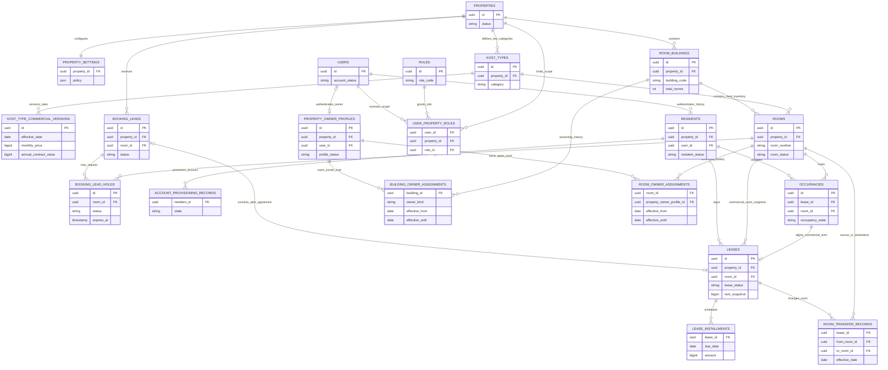

# KMO Database Architecture

Status: **APPROVED TARGET ARCHITECTURE — IMPLEMENTATION PARTIAL**

Program code: `KMO`

## 1. Purpose and Reading Guide

This document is the visual database authority for the KOSTATION overhaul. It
shows domain ownership and relationships without repeating every column. Use it
with:

- [DATA_MODEL_AND_MIGRATION.md](DATA_MODEL_AND_MIGRATION.md) for detailed target
  constraints and migration rules;
- [SCHEMA_IMPLEMENTATION_LEDGER.md](SCHEMA_IMPLEMENTATION_LEDGER.md) for current
  implementation and canonical-database truth;
- [DATA_AUTHORITY_MATRIX.md](DATA_AUTHORITY_MATRIX.md) for source-of-truth and
  explicit non-authority decisions;
- [DOMAIN_LIFECYCLE_CONTRACTS.md](DOMAIN_LIFECYCLE_CONTRACTS.md) for state
  transitions and cross-domain invariants.

Legend:

- **Current**: persistence already represented by committed application/schema
  authority.
- **Target**: approved persistence that remains planned.
- **Transition**: compatibility or reconciliation authority retained until its
  named cutover gate passes.

PostgreSQL is the system of record. UI state, query caches, reports, exported
files, and public projections are consumers, never independent mutation
authorities. Every operational relationship is property-scoped under
`INV-PROPERTY-001`.

## 2. Architecture Rules

- Every mutable authority carries an exact property tuple or proves its property
  through an aligned parent.
- Lifecycle and financial history is append-only where correction requires a
  reversal, compensating entry, archive, or superseding version.
- Files are accessed through mediated file authority. Storage paths, credentials,
  identity documents, and raw provider payloads do not enter ordinary responses,
  reports, audit, or outbox.
- Public catalog data is a projection of effective published category content.
  It is not the editorial source and never exposes exact room or resident data.
- Ambiguous active authorities fail closed; queries must not hide conflicts with
  an arbitrary “best row”.

## 3. Inventory and Resident Lifecycle

State map:

- **Current**: properties, settings, 26 buildings, 163 rooms, users, roles,
  residents, Booking Leads, holds, leases, occupancies, and transfer records.
- **Transition**: migration 022 source adds commercial versions, while bounded
  legacy lease/occupancy reconciliation remains until canonical cutover evidence.
- **Target**: effective Rumah Kost building ownership, Apart Kost room ownership,
  Owner accounts, earned-rent attribution, and settlement remain planned in W10.

Lifecycle meaning:

- A Booking Lead records interest; it is not a reservation.
- A Hold temporarily claims a room; it is not a tenancy.
- A Lead Payment Commitment is a pre-lease commercial agreement bound to one
  active hold. It is neither a W06 payment ledger row nor a lease; it can be
  materialized exactly once by Commit Onboarding.
- Before that materialization, the final lease start date and duration may be
  revised and re-quoted from commercial authority. The payment commitment itself
  is immutable; its rent credit must not exceed the re-quoted contract rent.
- Onboarding provisions identity and commits lease authority; it does not
  automatically prove physical occupancy.
- Lease records the commercial term. Occupancy records the physical stay. Their
  active states must reconcile, with explicit legacy exceptions only.
- The 163-room inventory is fixed. Buildings and categories classify existing
  rooms; routine room creation is not an operational authority.
- Property ownership is future effective-dated authority. Rumah Kost uses a
  whole-building assignment that covers every current and future room; Apart
  Kost uses individual room assignments. Overlapping intervals on the same asset
  fail closed. This remains planned until W10 source, migration, reconciliation,
  and runtime evidence are separately recorded.
- An unassigned asset is operationally `Kostation-owned` without a synthetic
  Owner account. Legacy property-wide assignments are transitional evidence and
  are never backfilled automatically into broader access.

## 4. Billing and Finance

State map:

- **Current**: invoices, invoice line items, payments, proofs, allocations,
  deposit transactions, and mediated files.
- **Transition**: existing lease snapshots and compatibility fields remain while
  later billing ledgers are introduced without rewriting history.
- **Target**: installments, receipts, reversals, other charges, and expense
  lifecycle records remain planned in KMO-W06 and W09.

```mermaid
erDiagram
  LEASES ||--o{ LEASE_INSTALLMENTS : snapshots_schedule
  LEASES ||--o{ BILLING_PERIODS : defines_periods
  LEASES ||--o{ INVOICES : bills
  BILLING_PERIODS o|--o{ INVOICES : groups
  INVOICES ||--|{ INVOICE_LINE_ITEMS : totals_from

  PAYMENTS ||--o{ PAYMENT_PROOFS : supports
  PAYMENTS ||--o{ PAYMENT_ALLOCATIONS : allocates
  INVOICES ||--o{ PAYMENT_ALLOCATIONS : settles
  PAYMENTS ||--o| PAYMENT_RECEIPTS : confirms
  PAYMENTS ||--o{ PAYMENT_REVERSALS : corrected_by

  LEASES ||--o{ LEASE_DEPOSIT_TRANSACTIONS : holds_liability
  INVOICES ||--o{ OTHER_CHARGES : itemizes

  EXPENSE_CATEGORIES ||--o{ EXPENSES : classifies
  EXPENSES ||--o{ EXPENSE_APPROVALS : approves
  EXPENSES ||--o{ EXPENSE_FILES : supports
  EXPENSES ||--o{ EXPENSE_REVERSALS : corrected_by
  FILES o|--o{ PAYMENT_PROOFS : mediates
  FILES ||--o{ EXPENSE_FILES : mediates_evidence

  LEASES ||--o{ OWNER_EARNED_RENT_ATTRIBUTIONS : earns_service
  PAYMENTS ||--o{ OWNER_EARNED_RENT_ATTRIBUTIONS : supports_collection
  OWNER_COMMERCIAL_POLICIES ||--o{ OWNER_EARNED_RENT_ATTRIBUTIONS : snapshots_split
  PROPERTY_OWNER_PROFILES ||--o{ OWNER_EARNED_RENT_ATTRIBUTIONS : receives_entitlement
  PROPERTY_OWNER_PROFILES ||--o{ OWNER_SETTLEMENTS : reconciles_monthly
  OWNER_SETTLEMENTS ||--o{ OWNER_SETTLEMENT_LINES : explains
  OWNER_EARNED_RENT_ATTRIBUTIONS ||--o{ OWNER_SETTLEMENT_LINES : summarized_by
  OWNER_SETTLEMENTS ||--o{ OWNER_SETTLEMENT_ADJUSTMENTS : corrected_by
  OWNER_SETTLEMENTS ||--o| OWNER_PAYOUTS : paid_by

  LEASES {
    uuid id PK
    uuid property_id FK
  }
  LEASE_INSTALLMENTS {
    uuid lease_id FK
    date due_date
    bigint rent_amount
    string plan
  }
  BILLING_PERIODS {
    uuid id PK
    uuid lease_id FK
    date period_start
    date period_end
  }
  INVOICES {
    uuid id PK
    uuid property_id FK
    uuid lease_id FK
    bigint total_amount
    string status
  }
  INVOICE_LINE_ITEMS {
    uuid invoice_id FK
    string purpose
    bigint amount
  }
  PAYMENTS {
    uuid id PK
    uuid property_id FK
    bigint amount
    string status
  }
  PAYMENT_PROOFS {
    uuid payment_id FK
    uuid file_id FK
    string review_state
  }
  PAYMENT_ALLOCATIONS {
    uuid payment_id FK
    uuid invoice_id FK
    bigint allocated_amount
    string allocation_state
  }
  PAYMENT_RECEIPTS {
    uuid payment_id FK
    string receipt_code
    timestamp issued_at
  }
  PAYMENT_REVERSALS {
    uuid payment_id FK
    bigint reversed_amount
    timestamp reversed_at
  }
  LEASE_DEPOSIT_TRANSACTIONS {
    uuid lease_id FK
    string transaction_type
    bigint amount
    timestamp occurred_at
  }
  OTHER_CHARGES {
    uuid invoice_id FK
    string charge_type
    bigint amount
  }
  EXPENSE_CATEGORIES {
    uuid id PK
    string category_code
  }
  EXPENSES {
    uuid id PK
    uuid property_id FK
    bigint amount
    string status
  }
  EXPENSE_APPROVALS {
    uuid expense_id FK
    string decision
    timestamp decided_at
  }
  EXPENSE_FILES {
    uuid expense_id FK
    uuid file_id FK
    string purpose
  }
  EXPENSE_REVERSALS {
    uuid expense_id FK
    bigint reversed_amount
    timestamp reversed_at
  }
  FILES {
    uuid id PK
    uuid property_id FK
    string purpose
  }
  OWNER_COMMERCIAL_POLICIES {
    uuid id PK
    bigint gross_room_month
    bigint owner_share_cap
    bigint management_fee_cap
    date effective_from
  }
  OWNER_EARNED_RENT_ATTRIBUTIONS {
    uuid id PK
    uuid owner_profile_id FK
    uuid lease_id FK
    date service_period
    bigint owner_entitlement
    bigint management_fee
  }
  OWNER_SETTLEMENTS {
    uuid id PK
    uuid owner_profile_id FK
    date settlement_month
    string status
  }
  OWNER_SETTLEMENT_LINES {
    uuid settlement_id FK
    uuid attribution_id FK
    bigint owner_amount
    bigint fee_amount
  }
  OWNER_SETTLEMENT_ADJUSTMENTS {
    uuid settlement_id FK
    bigint amount
    string reason
  }
  OWNER_PAYOUTS {
    uuid settlement_id FK
    bigint amount
    string status
    timestamp paid_at
  }
```

Financial meaning:

- Lease commercial values are immutable snapshots. A later category-rate version
  never rewrites an existing lease, installment, or invoice.
- DP is an advance rent allocation and reduces rent receivable. Security deposit
  is a separate liability with collection, deduction, refund, and balance
  history.
- A payment row without an active allocation is not invoice settlement.
- Verified financial evidence is preserved. Corrections use reversals or
  compensating entries, never destructive edits.
- Reports read these ledgers and allocation authorities. A report or export is
  not a maintained financial balance.
- Owner entitlement is recognized only from verified collection for service that
  has been earned inside the effective ownership period. Advance Booking Fee or
  DP is not immediately distributable merely because cash was received.
- The current standard earned room-month is Rp1.800.000: Rp1.500.000 Owner
  entitlement and Rp300.000 Kostation management fee. Partial earned collection
  follows the 5:1 ratio until both monthly caps are reached.
- A monthly Owner settlement is a review authority, and a payout is a separate
  approved disbursement. Reversal/refund consequences append adjustments; they
  never rewrite payment or earned-rent history.

## 5. Content, Operations, and Communication

State map:

- **Current**: files, vehicles, parking, complaints, maintenance work orders,
  notifications, audit, outbox, and idempotency authorities.
- **Transition**: migration 023 source implements category facilities, gallery
  source/derivative records, publication versions, and separated policy content;
  canonical application remains deferred.
- **Target**: reminder composition/history and report exports remain planned in
  KMO-W08 and W10.

```mermaid
erDiagram
  PROPERTIES ||--o{ PROPERTY_POLICY_DOCUMENTS : versions_policy
  KOST_TYPES ||--o{ KOST_TYPE_CONTENT_FACILITIES : owns
  KOST_TYPES ||--o{ HUNIAN_GALLERY_IMAGES : drafts
  FILES ||--o{ HUNIAN_GALLERY_IMAGES : private_source
  FILES ||--o{ HUNIAN_GALLERY_IMAGES : public_derivative
  KOST_TYPES ||--o{ KOST_TYPE_CONTENT_VERSIONS : publishes

  RESIDENTS ||--o{ VEHICLES : registers
  PARKING_SLOTS o|--o{ VEHICLES : assigns
  ROOMS ||--o{ COMPLAINTS : concerns
  COMPLAINTS ||--o{ MAINTENANCE_WORK_ORDERS : dispatches
  TECHNICIAN_PROFILES ||--o{ MAINTENANCE_WORK_ORDERS : assigned_to

  REMINDER_TEMPLATES ||--o{ REMINDER_MESSAGES : renders
  REMINDER_MESSAGES ||--o{ REMINDER_MESSAGE_INVOICES : snapshots
  INVOICES ||--o{ REMINDER_MESSAGE_INVOICES : motivates
  INVOICE_SHARE_LINKS o|--o{ REMINDER_MESSAGE_INVOICES : mediates
  REMINDER_MESSAGES ||--o{ NOTIFICATIONS : may_signal

  REPORT_EXPORTS }o--|| FILES : produces
  AUDIT_LOGS }o--|| IDEMPOTENCY_COMMANDS : correlates
  BUSINESS_EVENTS }o--|| IDEMPOTENCY_COMMANDS : correlates

  RESIDENTS {
    uuid id PK
    uuid property_id FK
  }
  ROOMS {
    uuid id PK
    uuid property_id FK
  }
  INVOICES {
    uuid id PK
    uuid property_id FK
  }
  PROPERTIES {
    uuid id PK
  }
  KOST_TYPES {
    uuid id PK
    uuid property_id FK
  }
  KOST_TYPE_CONTENT_FACILITIES {
    uuid kost_type_id FK
    string normalized_label
    int sort_order
    string content_state
  }
  HUNIAN_GALLERY_IMAGES {
    uuid kost_type_id FK
    uuid source_file_id FK
    uuid public_derivative_file_id FK
    string content_state
    int sort_order
  }
  KOST_TYPE_CONTENT_VERSIONS {
    uuid kost_type_id FK
    string content_type
    int version
    date effective_date
  }
  PROPERTY_POLICY_DOCUMENTS {
    uuid property_id FK
    string publication_status
    int version
    date effective_date
    json internal_content
    json public_content
  }
  FILES {
    uuid id PK
    uuid property_id FK
    string purpose
  }
  VEHICLES {
    uuid id PK
    uuid property_id FK
    string vehicle_status
  }
  PARKING_SLOTS {
    uuid id PK
    uuid property_id FK
    string parking_state
  }
  COMPLAINTS {
    uuid id PK
    uuid room_id FK
    string complaint_status
  }
  MAINTENANCE_WORK_ORDERS {
    uuid id PK
    uuid complaint_id FK
    string work_order_status
  }
  TECHNICIAN_PROFILES {
    uuid user_id FK
    string technician_status
  }
  REMINDER_TEMPLATES {
    uuid id PK
    int version
    string template_status
  }
  REMINDER_MESSAGES {
    uuid id PK
    string outcome
    timestamp occurred_at
  }
  REMINDER_MESSAGE_INVOICES {
    uuid reminder_message_id FK
    uuid invoice_id FK
    uuid share_link_id FK
  }
  INVOICE_SHARE_LINKS {
    uuid id PK
    string token_hash
    timestamp expires_at
  }
  NOTIFICATIONS {
    uuid id PK
    string notification_status
  }
  REPORT_EXPORTS {
    uuid id PK
    string filter_checksum
    string export_status
  }
  AUDIT_LOGS {
    uuid id PK
    string action
    timestamp created_at
  }
  BUSINESS_EVENTS {
    uuid id PK
    string event_type
    timestamp occurred_at
  }
  IDEMPOTENCY_COMMANDS {
    uuid id PK
    string command_name
    string request_hash
  }
```

Content and operational meaning:

- Facilities and gallery drafts belong to the category authority. Publication
  creates effective immutable versions; the public catalog reads only an
  effective public-safe projection.
- Gallery source files remain private. Public responses use approved derivatives,
  never raw storage paths or administrative file metadata.
- Internal operating policy and public terms are separate fields and response
  authorities.
- Complaint status and Work Order status remain distinct. Dispatch creates or
  changes Work Order authority without silently rewriting unrelated lifecycle
  domains.
- Reminder eligibility derives from invoice/lease truth. Reminder history records
  an attempt or manual outcome; an in-app notification is a separate authority.
- Audit, outbox, and idempotency are transaction-support authorities. They do not
  replace domain rows and must contain only safe, allowlisted evidence.

## 6. Implementation Boundary

Committed source through KMO-W02 implements the migration ledger, fixed inventory
discovery, effective-dated category commercial source, category
facility/gallery publication, and public-safe terms projection. Canonical
database application and consumer runtime status are tracked only in
[SCHEMA_IMPLEMENTATION_LEDGER.md](SCHEMA_IMPLEMENTATION_LEDGER.md).

KMO-W03 through KMO-W12 remain planned unless that ledger and the
[TRACEABILITY_MATRIX.md](TRACEABILITY_MATRIX.md) provide later evidence.

## 7. Contract Settlement and Termination Authority (KMO-W07A)

`lease_contract_settlements` is one-to-one with an onboarded lease and its
contract-rent invoice. It stores only activation/deadline/extension authority;
the outstanding amount remains a projection of immutable invoice credits and
payment allocations. `lease_termination_cases` is a separate case lifecycle:
pending, cancelled, or checked out. It does not mutate occupancy until checkout.

`contract_settlement_deposit_offsets` connects a termination case, the lease,
the contract invoice, and an immutable deposit transaction. It is the only
authority permitted to increase an issued invoice's credit for default arrears
offset. This protects already-recorded Booking Fee/DP credits from being
rewritten and keeps deposit liability distinct from rental revenue.
