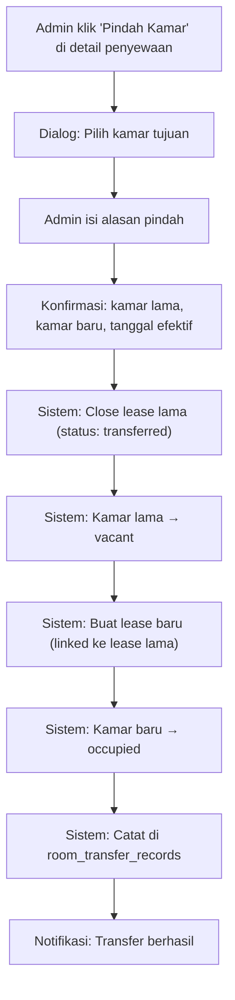
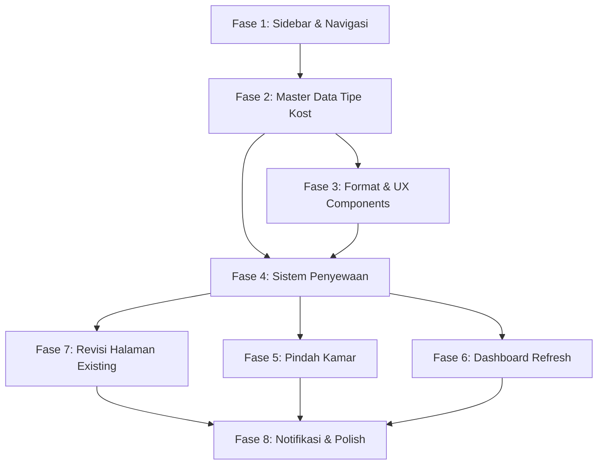

# Revisi Besar Sistem Manajemen Kost — Granada/Kostation

Rencana perombakan menyeluruh halaman admin untuk meningkatkan UX, kelengkapan fitur, dan korelasi data antar modul. Output: planning only — implementasi fullstack diserahkan ke model implementor.

---

## Konteks & Latar Belakang

Sistem saat ini sudah memiliki fondasi yang baik (163 kamar, 26 gedung/unit, billing, payment gateway, booking leads, galeri hunian, public listing). Namun terdapat beberapa kelemahan kritis:

1. **Kurangnya korelasi data** — Penghuni, Pembayaran, Kendaraan berdiri sendiri tanpa koneksi jelas ke Penyewaan
2. **Master data kamar tidak lengkap** — Tidak ada detail penghuni di kamar terisi, harga tahunan belum terformat, fasilitas belum terstruktur
3. **UX navigasi** — Sidebar datar tanpa pengelompokan logis, form kompleks masih di modal dialog
4. **Belum ada entitas Penyewaan** — Penghuni langsung di-check-in tanpa kontrak sewa formal

### Hierarki Data Baru (Hasil Interview)

```
Properti (1 properti = semua kost)
├── Tipe Kost: Rumah Kost
│   ├── Fasilitas (seragam semua kamar Rumah Kost)
│   ├── Harga (seragam: bulanan & tahunan)
│   ├── Ukuran kamar (seragam, misal 3x4)
│   ├── Deskripsi & Aturan (spesifik Rumah Kost)
│   ├── Galeri (1 set foto berlaku semua kamar Rumah Kost)
│   ├── Gedung/Unit: 01, 02, ... 15 (Putra/Putri)
│   │   ├── Lantai: Atas, Bawah
│   │   │   └── Kamar: K01, K02, ...
│   │   └── ...
│   └── ...
├── Tipe Kost: Apart Kost
│   ├── Fasilitas (seragam semua kamar Apart Kost)
│   ├── Harga (berbeda dari Rumah Kost, tapi seragam antar kamar Apart Kost)
│   ├── Ukuran kamar (seragam per tipe)
│   ├── Deskripsi & Aturan (spesifik Apart Kost)
│   ├── Galeri (1 set foto berlaku semua kamar Apart Kost)
│   └── Gedung/Unit: 18A, 18B, ...
│       ├── Lantai: A, B
│       │   └── Kamar: AK-01, AK-02, ...
│       └── ...
├── Aturan Global (jam malam, KTP wajib, dll — berlaku semua tipe)
└── Galeri Area Bersama (lobby, dapur, rooftop — berlaku semua)
```

> [!IMPORTANT]
> **Keputusan kunci**: Harga, fasilitas, ukuran, dan galeri ditentukan di level **Tipe Kost** (bukan per kamar atau per gedung). Semua kamar dalam 1 tipe kost identik.

---

## User Review Required

> [!WARNING]
> **Perubahan Database Schema yang Signifikan**
> Revisi ini memerlukan migrasi database baru (migration 016+) yang menambah/mengubah beberapa tabel:
> - Tabel baru: `kost_types`, `kost_type_facilities`, `kost_type_rules`, `leases`, `lease_history`, `facility_categories`, `room_transfer_records`
> - Modifikasi: `rooms` (tambah relasi ke `kost_types`), `residents` (tambah field baru), `occupancies` (extend untuk lease)
>
> Migrasi bersifat **additive** (tidak menghapus kolom existing) untuk menjaga backward compatibility.

> [!IMPORTANT]
> **Fokus Implementasi: Admin Panel Only**
> Halaman publik `/kamar` **TIDAK diubah** dalam revisi ini. Data master yang baru (fasilitas terstruktur, deskripsi, galeri per tipe) disiapkan di backend/admin agar siap dikonsumsi halaman publik di revisi berikutnya.

---

## Fase 1: Restrukturisasi Sidebar & Navigasi

### Struktur Sidebar Baru

```
┌─────────────────────────────┐
│  🏠 Kos Management          │
│  Sistem Pengelolaan          │
├──────── MASTER DATA ─────────┤
│  📊 Dashboard                │
│  🏠 Kamar            ▼      │
│     ├─ 📋 Ringkasan          │
│     ├─ 🏘️ Rumah Kost         │
│     ├─ 🏢 Apart Kost         │
│     ├─ ✨ Fasilitas           │
│     └─ 🖼️ Galeri              │
│  📋 Syarat & Ketentuan       │
├──────── PENGELOLAAN ─────────┤
│  📝 Penyewaan                │
│  👤 Penghuni                 │
│  💰 Pembayaran               │
│  🚗 Kendaraan & Parkir       │
│  📨 Minat Booking            │
├──────── LAINNYA ─────────────┤
│  📢 Komplain                 │
│  📊 Laporan                  │
│  🔔 Notifikasi               │
│  ⚙️ Pengaturan               │
└─────────────────────────────┘
```

### Perubahan

#### [MODIFY] [app-shell.tsx](file:///var/www/granada-kost-platform/apps/admin/src/components/layout/app-shell.tsx)
- Refactor sidebar dari daftar flat → grouped sections (MASTER DATA, PENGELOLAAN, LAINNYA)
- Implement collapsible dropdown untuk "Kamar" dengan 5 sub-halaman
- Tambahkan section labels (uppercase, muted color, small font)
- Active state indikator dengan highlight + left border accent
- Breadcrumb component global di header (otomatis berdasarkan route path)

#### [NEW] `apps/admin/src/components/layout/Breadcrumb.tsx`
- Breadcrumb otomatis berdasarkan routing hierarchy
- Clickable navigation links
- Current page non-clickable
- Separator dengan chevron icon

#### Route Files Baru
- [NEW] `apps/admin/src/routes/rooms/index.tsx` — Ringkasan Kamar (dashboard mini)
- [NEW] `apps/admin/src/routes/rooms/rumah-kost.tsx` — Daftar & CRUD kamar Rumah Kost
- [NEW] `apps/admin/src/routes/rooms/apart-kost.tsx` — Daftar & CRUD kamar Apart Kost
- [NEW] `apps/admin/src/routes/rooms/fasilitas.tsx` — Master Fasilitas per tipe kost
- [NEW] `apps/admin/src/routes/rooms/galeri.tsx` — Galeri per tipe kost + area bersama
- [NEW] `apps/admin/src/routes/syarat-ketentuan.tsx` — Syarat & Ketentuan (global + per tipe)
- [NEW] `apps/admin/src/routes/penyewaan.tsx` — Halaman Penyewaan
- [NEW] `apps/admin/src/routes/penyewaan/tambah.tsx` — Form Tambah Penyewaan (full page stepper)
- [MODIFY] [rooms.tsx](file:///var/www/granada-kost-platform/apps/admin/src/routes/rooms.tsx) → Redirect ke `rooms/index.tsx` atau hapus (replaced by nested routes)

---

## Fase 2: Master Data Tipe Kost & Kamar (Backend + Frontend)

### 2A. Database Schema — Tipe Kost

#### [NEW] `backend/api/src/infrastructure/database/migrations/016_kost_type_revision.sql`

```sql
-- Tabel utama Tipe Kost (menggantikan konsep room_types untuk identitas tipe)
CREATE TABLE IF NOT EXISTS kost_types (
  id UUID PRIMARY KEY DEFAULT gen_random_uuid(),
  property_id UUID NOT NULL REFERENCES properties(id) ON DELETE CASCADE,
  category TEXT NOT NULL,                -- 'rukost' | 'apartkost'
  name TEXT NOT NULL,                    -- 'Rumah Kost' | 'Apart Kost'
  slug TEXT NOT NULL,                    -- URL-safe identifier
  description_short TEXT,                -- Deskripsi singkat (untuk card listing)
  description_long TEXT,                 -- Deskripsi detail (untuk halaman detail)
  room_size_label TEXT,                  -- e.g. '3 m x 4 m'
  room_size_m2 NUMERIC(6,2),            -- e.g. 12.00
  monthly_price INTEGER NOT NULL,        -- Harga bulanan (IDR, tanpa desimal)
  yearly_price INTEGER NOT NULL DEFAULT 0, -- Harga tahunan
  deposit_amount INTEGER NOT NULL DEFAULT 0, -- Deposit (uang jaminan)
  max_occupants INTEGER NOT NULL DEFAULT 1,  -- 1 kamar = 1 orang (default)
  public_visible BOOLEAN NOT NULL DEFAULT true,
  notes TEXT,                            -- Catatan internal admin
  created_by_user_id UUID REFERENCES users(id),
  updated_by_user_id UUID REFERENCES users(id),
  created_at TIMESTAMPTZ NOT NULL DEFAULT now(),
  updated_at TIMESTAMPTZ NOT NULL DEFAULT now(),
  CONSTRAINT kost_types_category_check CHECK (category IN ('rukost', 'apartkost')),
  CONSTRAINT kost_types_price_check CHECK (monthly_price >= 0 AND yearly_price >= 0 AND deposit_amount >= 0),
  CONSTRAINT kost_types_unique_slug UNIQUE (property_id, slug),
  CONSTRAINT kost_types_unique_category UNIQUE (property_id, category)
);

-- Kategori Fasilitas
CREATE TABLE IF NOT EXISTS facility_categories (
  id UUID PRIMARY KEY DEFAULT gen_random_uuid(),
  property_id UUID NOT NULL REFERENCES properties(id) ON DELETE CASCADE,
  name TEXT NOT NULL,           -- 'Fasilitas Dalam Kamar', 'Fasilitas Kamar Mandi', dll
  icon TEXT,                    -- icon identifier (lucide icon name)
  sort_order INTEGER NOT NULL DEFAULT 0,
  created_at TIMESTAMPTZ NOT NULL DEFAULT now(),
  updated_at TIMESTAMPTZ NOT NULL DEFAULT now(),
  CONSTRAINT facility_categories_unique_name UNIQUE (property_id, name)
);

-- Fasilitas Master (refactor dari room_facilities)
-- Tambah kategori dan relasi ke tipe kost (bukan per kamar)
ALTER TABLE room_facilities
  ADD COLUMN IF NOT EXISTS category_id UUID REFERENCES facility_categories(id) ON DELETE SET NULL,
  ADD COLUMN IF NOT EXISTS icon TEXT,
  ADD COLUMN IF NOT EXISTS description TEXT,
  ADD COLUMN IF NOT EXISTS sort_order INTEGER NOT NULL DEFAULT 0;

-- Fasilitas assignment: dari per-kamar → per-tipe-kost
CREATE TABLE IF NOT EXISTS kost_type_facility_assignments (
  kost_type_id UUID NOT NULL REFERENCES kost_types(id) ON DELETE CASCADE,
  facility_id UUID NOT NULL REFERENCES room_facilities(id) ON DELETE CASCADE,
  created_at TIMESTAMPTZ NOT NULL DEFAULT now(),
  PRIMARY KEY (kost_type_id, facility_id)
);

-- Aturan & Kebijakan per Tipe Kost
CREATE TABLE IF NOT EXISTS kost_type_rules (
  id UUID PRIMARY KEY DEFAULT gen_random_uuid(),
  property_id UUID NOT NULL REFERENCES properties(id) ON DELETE CASCADE,
  kost_type_id UUID REFERENCES kost_types(id) ON DELETE CASCADE, -- NULL = aturan global
  rule_category TEXT NOT NULL,  -- 'general', 'guest', 'resident', 'other'
  icon TEXT,                    -- emoji atau lucide icon
  rule_text TEXT NOT NULL,      -- '✓ Akses 24 jam' atau '❌ Dilarang bawa hewan'
  is_allowed BOOLEAN,           -- true=dibolehkan, false=dilarang, null=netral
  sort_order INTEGER NOT NULL DEFAULT 0,
  created_at TIMESTAMPTZ NOT NULL DEFAULT now(),
  updated_at TIMESTAMPTZ NOT NULL DEFAULT now(),
  CONSTRAINT kost_type_rules_category_check CHECK (
    rule_category IN ('general', 'guest', 'resident', 'other', 'special_notes')
  )
);

-- Extend rooms: tambah kost_type_id
ALTER TABLE rooms
  ADD COLUMN IF NOT EXISTS kost_type_id UUID REFERENCES kost_types(id) ON DELETE SET NULL;
```

### 2B. Backend API — Tipe Kost Module

#### [NEW] `backend/api/src/modules/kost-type/` (module baru)
- `kost-type.module.ts` — NestJS module
- `kost-type.controller.ts` — CRUD endpoints:
  - `GET /api/v1/kost-types` — List tipe kost (admin, property-scoped)
  - `GET /api/v1/kost-types/:id` — Detail tipe kost dengan fasilitas & aturan
  - `POST /api/v1/kost-types` — Create tipe kost
  - `PATCH /api/v1/kost-types/:id` — Update tipe kost
  - `DELETE /api/v1/kost-types/:id` — Soft delete
- `kost-type.service.ts` — Business logic
- `kost-type.repository.ts` — Database queries

#### [NEW] `backend/api/src/modules/facility-category/` (module baru)
- CRUD untuk kategori fasilitas
- Seed default: "Fasilitas Dalam Kamar", "Fasilitas Kamar Mandi", "Fasilitas Bersama", "Akses & Keamanan", "Layanan"

#### [NEW] `backend/api/src/modules/kost-rule/` (module baru)
- CRUD untuk aturan/kebijakan
- Filter: global vs per-tipe-kost
- Kategori: general, guest, resident, other, special_notes

#### [MODIFY] `backend/api/src/modules/room/`
- Extend room service: return `kost_type` data (nama, fasilitas, harga dari tipe kost)
- Extend room query: JOIN ke `kost_types` untuk enrichment
- Harga kamar dibaca dari `kost_types.monthly_price` / `yearly_price` (bukan per kamar)

### 2C. Frontend Admin — Halaman Tipe Kost

#### [NEW] `apps/admin/src/routes/rooms/rumah-kost.tsx`
Halaman daftar kamar Rumah Kost:
- **Header**: Informasi tipe kost (nama, deskripsi singkat, harga, ukuran, jumlah fasilitas)
- **Tabel kamar**: Kode kamar, gedung/unit, lantai, status, penghuni aktif (jika terisi), aksi
- **Filter & Search**: Pencarian kode kamar, filter gedung, filter lantai, filter status
- **Detail penghuni**: Pada kamar berstatus "Terisi", tampilkan nama penghuni, tanggal mulai sewa, sisa durasi sewa
- **Harga terformat**: Format Rupiah dengan dot separator (Rp 1.500.000/bulan)
- **CRUD**: Tombol tambah kamar, edit (modal), view detail (drawer), ubah status, arsipkan

#### [NEW] `apps/admin/src/routes/rooms/apart-kost.tsx`
- Sama seperti Rumah Kost, tapi filter untuk kategori `apartkost`

#### [NEW] `apps/admin/src/routes/rooms/fasilitas.tsx`
Halaman master fasilitas:
- **Grouped by kategori**: Fasilitas Dalam Kamar, Fasilitas Kamar Mandi, dll
- **Drag-and-drop reorder** dalam kategori
- **CRUD**: Tambah fasilitas (nama, icon, deskripsi, kategori)
- **Assign ke Tipe Kost**: Checklist fasilitas mana yang berlaku untuk Rumah Kost vs Apart Kost
- **Search**: Pencarian fasilitas

#### [NEW] `apps/admin/src/routes/rooms/galeri.tsx`
Refactor dari [hunian-gallery.tsx](file:///var/www/granada-kost-platform/apps/admin/src/routes/hunian-gallery.tsx):
- **Selector per tipe kost**: Rumah Kost | Apart Kost | Area Bersama
- **Tetap gunakan** sistem galeri M19 yang sudah ada (upload, set cover, publish, reorder)
- **Perbedaan**: Selector berdasarkan tipe kost (bukan catalog item)

---

## Fase 3: Format Harga & UX Improvements

### 3A. Format Rupiah dengan Dot Separator

#### [MODIFY] [format.ts](file:///var/www/granada-kost-platform/apps/admin/src/lib/format.ts)
- Pastikan `formatIDR()` mengembalikan format: `Rp 1.500.000` (dengan dot separator)
- Tambah fungsi `parseIDR()` untuk input field → angka
- Tambah input component `CurrencyInput` yang auto-format saat user mengetik

#### [NEW] `apps/admin/src/components/ui/currency-input.tsx`
- Input field dengan auto-formatting (Rp 1.500.000)
- Strip non-numeric saat submit
- Visual dot separator saat display
- Prefix "Rp" di dalam input

### 3B. Searchable Select/Dropdown

#### [NEW] `apps/admin/src/components/ui/searchable-select.tsx`
- Dropdown dengan input pencarian di atas list options
- Digunakan di semua select yang memiliki banyak opsi (gedung/unit, kamar, penghuni, dll)
- Fuzzy search support
- Virtualized list untuk performa dengan banyak item

### 3C. Breadcrumb Global

#### [MODIFY] [app-shell.tsx](file:///var/www/granada-kost-platform/apps/admin/src/components/layout/app-shell.tsx)
- Tambahkan breadcrumb bar di bawah header/judul halaman
- Auto-generate dari route path: `Dashboard / Kamar / Rumah Kost / Tambah Kamar`
- Setiap breadcrumb segment clickable (kembali ke parent)

---

## Fase 4: Sistem Penyewaan (Lease Management) — Core Feature

> [!IMPORTANT]
> **Model Sewa: Open-Ended (Langganan Berkelanjutan)**
> Sewa kost bukan kontrak dengan tanggal akhir pasti. Penghuni masuk → tagihan auto-generated tiap bulan/tahun → sewa berjalan terus → sampai admin menutup sewa (checkout). **Tidak ada perpanjangan manual**.

### 4A. Database Schema — Leases

#### [NEW] `backend/api/src/infrastructure/database/migrations/017_lease_system.sql`

```sql
-- Tabel Penyewaan (Lease) — entitas utama pengelolaan
-- Model: OPEN-ENDED — sewa berjalan terus sampai ditutup admin
CREATE TABLE IF NOT EXISTS leases (
  id UUID PRIMARY KEY DEFAULT gen_random_uuid(),
  property_id UUID NOT NULL REFERENCES properties(id) ON DELETE CASCADE,
  room_id UUID NOT NULL REFERENCES rooms(id) ON DELETE RESTRICT,
  resident_id UUID NOT NULL REFERENCES residents(id) ON DELETE RESTRICT,
  occupancy_id UUID REFERENCES occupancies(id) ON DELETE SET NULL,

  lease_code TEXT NOT NULL,              -- Auto-generated: LSE-2026-0001
  lease_status TEXT NOT NULL DEFAULT 'active',
  
  -- Durasi sewa (open-ended)
  start_date DATE NOT NULL,              -- Tanggal mulai sewa
  end_date DATE,                         -- NULL = open-ended (berjalan terus)
                                         -- Terisi hanya saat lease ditutup
  billing_cycle TEXT NOT NULL DEFAULT 'monthly', -- 'monthly' | 'yearly'
  next_billing_date DATE NOT NULL,       -- Tanggal tagihan berikutnya
  
  -- Harga (snapshot dari kost_type saat lease dibuat)
  monthly_price BIGINT NOT NULL,
  yearly_price BIGINT,
  deposit_amount BIGINT NOT NULL DEFAULT 0,
  deposit_status TEXT NOT NULL DEFAULT 'unpaid',
  deposit_returned_amount BIGINT DEFAULT 0,  -- Jumlah deposit dikembalikan
  deposit_deduction_amount BIGINT DEFAULT 0, -- Potongan deposit (kerusakan dll)
  deposit_deduction_notes TEXT,              -- Catatan potongan deposit
  
  -- Catatan
  notes TEXT,
  
  -- Transfer / Pindah Kamar
  transferred_from_lease_id UUID REFERENCES leases(id) ON DELETE SET NULL,
  transfer_reason TEXT,
  
  -- Audit
  created_by_user_id UUID REFERENCES users(id),
  closed_by_user_id UUID REFERENCES users(id),
  closed_at TIMESTAMPTZ,
  close_reason TEXT,                     -- 'checkout' | 'transfer' | 'eviction' | 'other'
  created_at TIMESTAMPTZ NOT NULL DEFAULT now(),
  updated_at TIMESTAMPTZ NOT NULL DEFAULT now(),
  
  CONSTRAINT leases_status_check CHECK (
    lease_status IN ('active', 'ended', 'transferred', 'cancelled')
  ),
  CONSTRAINT leases_billing_cycle_check CHECK (billing_cycle IN ('monthly', 'yearly')),
  CONSTRAINT leases_deposit_status_check CHECK (
    deposit_status IN ('unpaid', 'paid', 'partial_return', 'returned', 'forfeited')
  ),
  CONSTRAINT leases_end_date_check CHECK (end_date IS NULL OR end_date >= start_date),
  CONSTRAINT leases_price_check CHECK (monthly_price >= 0 AND deposit_amount >= 0),
  CONSTRAINT leases_deposit_return_check CHECK (
    deposit_returned_amount >= 0 AND deposit_deduction_amount >= 0
    AND (deposit_returned_amount + deposit_deduction_amount) <= deposit_amount
  ),
  CONSTRAINT leases_unique_code UNIQUE (property_id, lease_code)
);

-- 1 kamar hanya boleh 1 lease aktif
CREATE UNIQUE INDEX IF NOT EXISTS idx_leases_one_active_room
  ON leases(room_id) WHERE lease_status = 'active';

-- 1 resident hanya boleh 1 lease aktif  
CREATE UNIQUE INDEX IF NOT EXISTS idx_leases_one_active_resident
  ON leases(resident_id) WHERE lease_status = 'active';

CREATE INDEX IF NOT EXISTS idx_leases_property_status ON leases(property_id, lease_status);
CREATE INDEX IF NOT EXISTS idx_leases_next_billing ON leases(next_billing_date) WHERE lease_status = 'active';
CREATE INDEX IF NOT EXISTS idx_leases_resident ON leases(resident_id, lease_status);

-- History pindah kamar
CREATE TABLE IF NOT EXISTS room_transfer_records (
  id UUID PRIMARY KEY DEFAULT gen_random_uuid(),
  property_id UUID NOT NULL REFERENCES properties(id) ON DELETE CASCADE,
  resident_id UUID NOT NULL REFERENCES residents(id) ON DELETE RESTRICT,
  from_lease_id UUID NOT NULL REFERENCES leases(id) ON DELETE RESTRICT,
  to_lease_id UUID NOT NULL REFERENCES leases(id) ON DELETE RESTRICT,
  from_room_id UUID NOT NULL REFERENCES rooms(id),
  to_room_id UUID NOT NULL REFERENCES rooms(id),
  transfer_date DATE NOT NULL,
  reason TEXT,
  transferred_by_user_id UUID REFERENCES users(id),
  created_at TIMESTAMPTZ NOT NULL DEFAULT now()
);
```

### 4B. Extend Residents Schema

#### [NEW] Dalam migration 016 atau 017
```sql
-- Tambah field yang diminta pada tabel residents
ALTER TABLE residents
  ADD COLUMN IF NOT EXISTS date_of_birth DATE,
  ADD COLUMN IF NOT EXISTS place_of_birth TEXT,
  ADD COLUMN IF NOT EXISTS address TEXT,
  ADD COLUMN IF NOT EXISTS emergency_phone TEXT,
  ADD COLUMN IF NOT EXISTS ktp_file_id UUID,   -- Upload foto KTP
  ADD COLUMN IF NOT EXISTS profile_photo_file_id UUID;
```

### 4C. Backend — Lease Module

#### [NEW] `backend/api/src/modules/lease/`
- **Endpoints**:
  - `GET /api/v1/leases` — List penyewaan (filter: status, overdue, search penghuni/kamar)
  - `GET /api/v1/leases/:id` — Detail penyewaan lengkap (penghuni + kamar + tagihan + pembayaran)
  - `POST /api/v1/leases` — Buat penyewaan baru (auto-create occupancy, auto-update room status)
  - `PATCH /api/v1/leases/:id` — Update penyewaan (catatan)
  - `POST /api/v1/leases/:id/close` — Tutup/akhiri penyewaan (checkout)
  - `POST /api/v1/leases/:id/close-deposit` — Proses pengembalian deposit (dengan potongan)
  - `POST /api/v1/leases/:id/transfer` — Pindah kamar (close old + create new lease)
  - `GET /api/v1/leases/overdue` — List penyewaan dengan tagihan overdue
  - `GET /api/v1/leases/:id/billing-summary` — Ringkasan tagihan & pembayaran per lease

- **Business Logic (Open-Ended Model)**:
  - Saat lease dibuat: auto-create occupancy, auto-update `rooms.room_status` → `occupied`, set `next_billing_date` = `start_date` + 1 bulan/tahun
  - **Auto-generate tagihan**: Scheduled job (cron) cek `next_billing_date`. Jika hari ini >= `next_billing_date`, generate invoice draft, update `next_billing_date` ke periode berikutnya. Ini berjalan **tanpa batas** selama lease aktif.
  - Saat lease ditutup (checkout): set `end_date` = hari ini, auto-close occupancy, auto-update `rooms.room_status` → `vacant`, stop generating tagihan
  - **Deposit checkout flow**: Admin bisa input potongan (kerusakan/tunggakan) → sisa deposit dikembalikan → status deposit update
  - Saat transfer: close old lease (status `transferred`), create new lease (linked via `transferred_from_lease_id`), update kedua kamar
  - Harga di-snapshot dari `kost_types` saat lease dibuat (immutable setelah itu)

### 4D. Frontend Admin — Halaman Penyewaan

#### [NEW] `apps/admin/src/routes/penyewaan.tsx`

**Tampilan List Penyewaan:**
- **Metric Cards**: Penyewaan Aktif, Tagihan Overdue, Kamar Tersedia, Pendapatan Bulan Ini
- **Filter Bar**: Search (nama penghuni, kode kamar), Status filter, Tombol "Overdue" (filter cepat tagihan belum bayar)
- **Tabel Penyewaan**:
  | Kode | Penghuni | Kamar | Tipe | Mulai Sewa | Durasi | Tagihan Terakhir | Status | Aksi |
  |------|----------|-------|------|-----------|--------|-----------------|--------|------|
  | LSE-001 | Ahmad Fauzi | K-01, Unit 03 | Rumah Kost | 1 Agu 2026 | 11 bulan | Lunas | ✅ Aktif | ... |
  | LSE-002 | Dewi Sari | AK-05, Unit 18A | Apart Kost | 15 Mar 2026 | 16 bulan | ⚠️ Overdue | ✅ Aktif | ... |
- **Kolom Durasi**: Auto-calculated dari `start_date` sampai hari ini (misal "11 bulan" = sudah 11 bulan menyewa)
- **Aksi**: View detail, Pindah Kamar, Tutup Penyewaan (Checkout)
- **Tombol**: "+ Tambah Penyewaan" → navigasi ke form full page

**Detail Penyewaan (drawer atau halaman):**
- **Info Penyewaan**: Kode, tanggal mulai sewa, durasi berjalan (auto-calculated), billing cycle, tagihan berikutnya, catatan
- **Info Penghuni**: Nama, KTP (masked), telepon, email, foto KTP, kontak darurat
- **Info Kamar**: Tipe kost, gedung/unit, lantai, nomor kamar, harga, fasilitas tipe
- **Ringkasan Keuangan**: 
  - Total tagihan: Rp XX.XXX.XXX
  - Sudah dibayar: Rp XX.XXX.XXX (badge hijau)
  - Belum dibayar: Rp XX.XXX.XXX (badge merah)
  - Deposit: status + jumlah (Belum Bayar / Sudah Bayar Rp X.XXX.XXX)
- **Tabel History Pembayaran**: Daftar invoice + bukti bayar terkait lease ini
- **Tombol Aksi**: Pindah Kamar, Checkout (Tutup Penyewaan)
- **Checkout Flow**: Klik Checkout → Dialog konfirmasi → Form pengembalian deposit:
  - Deposit terbayar: Rp X.XXX.XXX
  - Potongan kerusakan: (input nominal + catatan, misal "Kerusakan pintu kamar mandi")
  - Potongan tunggakan: (auto dari tagihan belum lunas)
  - Sisa dikembalikan: Rp X.XXX.XXX (auto-calculated)
  - Tombol "Proses Checkout"

#### [NEW] `apps/admin/src/routes/penyewaan/tambah.tsx`

**Form Multi-Step dengan Breadcrumb/Stepper:**

```
Step 1: Penghuni & Penyewaan  →  Step 2: Pilih Kamar  →  Step 3: Konfirmasi
    [●]─────────────────────────[○]───────────────────────[○]
```

**Step 1 — Detail Penyewaan & Penghuni:**
- Detail Penyewaan:
  - Tanggal Mulai Sewa (date picker)
  - Siklus Tagihan (bulanan / tahunan)
  - Catatan / Keterangan (textarea)
  - ℹ️ Info: "Sewa berjalan otomatis. Tagihan akan di-generate setiap bulan/tahun sampai admin menutup sewa."
- Detail Penghuni:
  - Pilih penghuni existing (searchable select) ATAU "+ Tambah Penghuni Baru"
  - Jika baru: form inline — Nama, Tanggal Lahir, Tempat Lahir, Email, NIK, Alamat, No. Telepon, No. Darurat, Gender, Upload Foto KTP

**Step 2 — Pilih Kamar Kost:**
- Filter: Tipe Kost → Gedung/Unit → Lantai
- Visual grid kamar tersedia (highlight hijau = kosong, abu = terisi)
- Klik kamar → tampil ringkasan (tipe, harga bulanan/tahunan, deposit, fasilitas)
- Harga & deposit otomatis terisi dari tipe kost

**Step 3 — Konfirmasi & Simpan:**
- Ringkasan lengkap: Penghuni + Kamar + Harga + Siklus Tagihan
- Harga per siklus: Rp 1.500.000/bulan (atau Rp XX.XXX.XXX/tahun)
- Deposit yang harus dibayar: Rp X.XXX.XXX
- Tagihan pertama: akan di-generate pada [tanggal]
- Info: "Tagihan berikutnya akan otomatis di-generate setiap bulan/tahun."
- Tombol "Simpan Penyewaan"

---

## Fase 5: Pindah Kamar (Room Transfer)

### Alur Pindah Kamar



- **Tagihan berjalan**: Tagihan yang belum dibayar di lease lama TETAP ada (tidak dihapus)
- **Tagihan baru**: Mulai dari bulan berikutnya di kamar baru
- **History**: Tercatat di `room_transfer_records` + `lease_history`

---

## Fase 6: Dashboard Refresh

#### [MODIFY] [index.tsx](file:///var/www/granada-kost-platform/apps/admin/src/routes/index.tsx) (Dashboard)

**Layout Dashboard Baru:**

```
┌─── Row 1: Metric Cards ──────────────────────────┐
│ Penyewaan  │ Penghuni  │ Kamar      │ Pendapatan │
│ Aktif: 42  │ Aktif: 42 │ Tersedia:  │ Bulan Ini: │
│            │           │ 121/163    │ Rp 63 Jt   │
└────────────┴───────────┴────────────┴────────────┘
┌─── Row 2: Urgent Cards ──────────────────────────┐
│ 🔴 Jatuh Tempo     │ ⚠️ Sewa Berakhir           │
│ 5 tagihan overdue  │ 3 sewa berakhir < 30 hari  │
│ [Lihat Semua →]    │ [Lihat Semua →]            │
└────────────────────┴────────────────────────────┘
┌─── Row 3: Recent Activity ──────────────────────┐
│ Penyewaan Terbaru          │ Pembayaran Terbaru │
│ - Ahmad check-in 1 Jul     │ - Invoice #001 ✓   │
│ - Budi perpanjang sewa     │ - Invoice #002 ⏳   │
│ [Lihat Semua →]            │ [Lihat Semua →]    │
└────────────────────────────┴────────────────────┘
```

- **Quick Actions**: FAB atau button group — "+ Tambah Penyewaan", "Lihat Jatuh Tempo"
- **Chart** (opsional): Occupancy rate trend (line chart) dan revenue trend (bar chart)

---

## Fase 7: Revisi Halaman Existing

### 7A. Halaman Penghuni (Revisi)

#### [MODIFY] [tenants.tsx](file:///var/www/granada-kost-platform/apps/admin/src/routes/tenants.tsx)
- **Tambah kolom tabel**: Kamar (dari lease aktif), Status Sewa, Sisa Durasi
- **Detail Penghuni** (drawer/halaman):
  - Info personal: Nama, NIK (masked), tanggal lahir, tempat lahir, alamat, telepon, email, gender, kontak darurat, foto KTP
  - Info sewa aktif: Kamar, tipe kost, tanggal mulai/akhir, harga
  - Riwayat sewa: Tabel history semua lease (termasuk yang sudah selesai/transfer)
  - Ringkasan pembayaran: Total tagihan, sudah bayar, belum bayar
- **Form Tambah Penghuni**: Field baru — tanggal lahir, tempat lahir, alamat, upload KTP
- **Filter**: Status penghuni, pencarian nama/NIK/telepon

### 7B. Halaman Pembayaran (Revisi)

#### [MODIFY] [payments.tsx](file:///var/www/granada-kost-platform/apps/admin/src/routes/payments.tsx)
- **Korelasi ke Penyewaan**: Setiap invoice menampilkan link ke detail penyewaan
- **Filter tambahan**: Filter per penghuni, per kamar, per tipe kost
- **Tagihan auto-generated**: Label badge "Auto" untuk tagihan yang di-generate sistem vs "Manual"

### 7C. Halaman Kendaraan & Parkir (Gabung)

#### [MODIFY] [vehicles.tsx](file:///var/www/granada-kost-platform/apps/admin/src/routes/vehicles.tsx)
- Gabungkan Kendaraan + Parkir menjadi 1 halaman dengan tab
- **Korelasi ke Penghuni**: Tampilkan data penghuni lengkap (dari lease aktif, bukan snapshot)
- **Tab Kendaraan**: List kendaraan dengan penghuni & kamar
- **Tab Parkir**: Slot parkir, assignment, status

### 7D. Syarat & Ketentuan (Halaman Baru)

#### [NEW] `apps/admin/src/routes/syarat-ketentuan.tsx`
- **Aturan Global**: Berlaku semua tipe kost (jam malam, KTP wajib, dll)
- **Aturan per Tipe Kost**: Tab atau accordion per Rumah Kost / Apart Kost
- **Kategori aturan**: Aturan Umum, Aturan Tamu, Aturan Penghuni, Aturan Lainnya, Catatan Khusus
- **CRUD per aturan**: Tambah, edit, hapus, reorder
- **Preview**: Tombol "Preview Tampilan Publik" untuk melihat bagaimana aturan ditampilkan

---

## Fase 8: Notifikasi & Polish

### 8A. Notifikasi Terfokus

#### [MODIFY] [notifications.tsx](file:///var/www/granada-kost-platform/apps/admin/src/routes/notifications.tsx)
- **Filter notifikasi**: Hanya tampilkan kategori tagihan, pembayaran, jatuh tempo, komplain
- **Sembunyikan**: Notifikasi CCTV, smart lock, dan lainnya yang tidak relevan
- **Badge count** di sidebar: Hitung hanya notifikasi unread dari kategori yang relevan
- **Notifikasi otomatis** (backend):
  - Invoice baru di-generate → notifikasi admin
  - Pembayaran diterima → notifikasi admin
  - Tagihan overdue → notifikasi admin (daily)
  - Sewa akan berakhir H-30 → notifikasi admin
  - Komplain baru → notifikasi admin

### 8B. Konsistensi UI/UX

- **Semua halaman**: Implementasi breadcrumb
- **Semua tabel**: Tambahkan search/filter jika item > 10
- **Semua harga**: Format Rupiah konsisten (Rp X.XXX.XXX)
- **Semua form**: Loading states, error states, success toast
- **Mobile responsive**: Pastikan semua halaman baru responsive
- **Empty states**: Ilustrasi & CTA yang jelas di setiap halaman kosong

---

## Improvisasi Tambahan (Rekomendasi Profesional)

Berikut fitur tambahan yang saya rekomendasikan sebagai ahli manajemen kost, **di luar 11 poin revisi Anda**:

### I1. Status Sewa Visual di Halaman Kamar
Pada tabel kamar, tambahkan **pill indicator** untuk kamar terisi:
- Nama penghuni
- Sisa durasi sewa (misal "5 bulan lagi" atau "⚠️ 14 hari lagi")
- Warna merah jika sewa segera berakhir

### I2. Riwayat Kamar (Room History)
Di detail kamar, tampilkan **timeline** siapa saja yang pernah menghuni kamar tersebut:
```
📅 1 Agu 2026 - sekarang: Ahmad (Aktif)
📅 1 Jan 2025 - 30 Jul 2026: Budi (Selesai)
📅 1 Jun 2024 - 31 Des 2024: Cahya (Transfer ke K-05)
```

### I3. Laporan Pendapatan per Tipe Kost
Di halaman Laporan, tambahkan breakdown pendapatan:
- Total pendapatan Rumah Kost vs Apart Kost
- Occupancy rate per tipe kost
- Rata-rata durasi sewa

### I4. Export Data
Tombol export CSV/Excel di halaman Penyewaan, Penghuni, dan Pembayaran untuk kebutuhan accounting/laporan.

### I5. Penghuni Check-Out Reminder
Selain reminder jatuh tempo tagihan, tambahkan reminder untuk penghuni yang kontraknya segera habis agar admin bisa menghubungi untuk perpanjangan atau persiapan kamar kosong.

### I6. Status Kamar Maintenance dengan Estimasi
Jika kamar berstatus Maintenance, tambahkan field "estimasi selesai" agar admin tahu kapan kamar bisa disewakan kembali.

---

## Verification Plan

### Automated Tests
```bash
# Backend
cd backend/api && npm run lint && npm run build
npm run test  # Unit tests

# Admin Frontend
cd apps/admin && npm run lint && npx tsc --noEmit && npm run build

# Database Migration
npm --workspace @granada-kost/api run db:migrate  # Apply migration
npm --workspace @granada-kost/api run db:migrate:rollback  # Rollback test
```

### Manual Verification
1. **Sidebar Navigation**: Verifikasi semua link sidebar bekerja, dropdown expand/collapse, active state
2. **Form Penyewaan**: Test multi-step form (step 1 → 2 → 3 → simpan), validasi field, back navigation
3. **Pindah Kamar**: Test transfer flow — lease lama closed, kamar lama vacant, lease baru active, kamar baru occupied
4. **Format Rupiah**: Verifikasi semua harga ditampilkan dengan dot separator
5. **Korelasi Data**: Dari detail penghuni, verifikasi link ke penyewaan, kamar, dan pembayaran bekerja
6. **Dashboard**: Verifikasi metric cards menampilkan data real-time yang benar
7. **Responsive**: Test di mobile viewport (375px, 768px, 1024px)

### API Smoke Tests
```bash
# Kost Types
curl -s -H "Authorization: Bearer $TOKEN" http://localhost:3001/api/v1/kost-types | jq '.length'
# Leases
curl -s -H "Authorization: Bearer $TOKEN" http://localhost:3001/api/v1/leases | jq '.length'
# Leases expiring
curl -s -H "Authorization: Bearer $TOKEN" http://localhost:3001/api/v1/leases/expiring | jq '.length'
```

---

## Urutan Implementasi & Dependencies



| Fase | Estimasi Effort | Dependencies |
|------|----------------|--------------|
| Fase 1: Sidebar & Navigasi | Medium | Tidak ada |
| Fase 2: Master Data Tipe Kost | Large | Fase 1 (routes) |
| Fase 3: Format & UX Components | Small | Fase 1 |
| Fase 4: Sistem Penyewaan | X-Large | Fase 2, 3 |
| Fase 5: Pindah Kamar | Medium | Fase 4 |
| Fase 6: Dashboard Refresh | Medium | Fase 4 |
| Fase 7: Revisi Halaman Existing | Large | Fase 4 |
| Fase 8: Notifikasi & Polish | Medium | Fase 5, 6, 7 |

---

## Resolved Decisions

> [!NOTE]
> **Q1: Model Sewa — RESOLVED ✅**
> **Keputusan**: Model **Open-Ended (Langganan Berkelanjutan)**. Sewa berjalan terus tanpa tanggal akhir, tagihan auto-generated setiap siklus (bulanan/tahunan), sampai admin menutup sewa (checkout). **Tidak ada perpanjangan manual**. `end_date` di database = `NULL` selama lease aktif, terisi otomatis saat checkout.

> [!NOTE]
> **Q2: Deposit Return Flow — RESOLVED ✅**
> **Keputusan**: Saat checkout, admin bisa input **potongan deposit** (kerusakan, tunggakan, dll) dengan catatan. Sisa deposit otomatis dihitung dan dikembalikan. Status deposit: `unpaid` → `paid` → `partial_return` / `returned` / `forfeited`. Schema sudah include `deposit_returned_amount`, `deposit_deduction_amount`, dan `deposit_deduction_notes`.

> [!NOTE]
> **Q3: Migrasi Data — RESOLVED ✅**
> **Keputusan**: **Reset seed data** — data dummy existing dihapus dan diganti dengan **data realistis Indonesia** (nama, alamat, NIK, nomor telepon format Indonesia). **Data user & login dipertahankan**. Detail:
> - Pertahankan: tabel `users`, `user_roles`, credential login
> - Reset: `residents`, `occupancies`, `invoices`, `payments`, `vehicles`, `booking_leads`, `complaints`, dll
> - Seed baru: data penghuni realistis (contoh: "Ahmad Fauzi", "Dewi Sari Rahayu"), alamat realistis Indonesia, NIK 16 digit valid, nomor telepon format 08xx, beberapa lease aktif dengan riwayat tagihan

> [!NOTE]
> **Q4: Halaman Publik — DEFERRED**
> Revisi halaman publik `/kamar` dipersiapkan di backend tapi **tidak diimplementasikan** di revisi ini. Implementasi publik menjadi fase tersendiri setelah admin stabil.

---

## Fase 9: Reset & Seed Data Realistis

### Strategi Reset Data

#### [NEW] `backend/api/src/infrastructure/database/seeds/reset-and-seed-realistic.ts`

Script seed yang:
1. **PERTAHANKAN**: Tabel `users`, `user_roles`, `properties`, `property_settings` — login tetap berfungsi
2. **RESET** (truncate cascade): `residents`, `occupancies`, `leases`, `invoices`, `payments`, `vehicles`, `booking_leads`, `complaints`, `room_buildings`, `rooms`, `kost_types`, `facility_categories`, `room_facilities`, `kost_type_rules`, `hunian_gallery_images`
3. **SEED BARU** dengan data realistis:

**Master Data:**
- 2 Kost Types: Rumah Kost (Rp 1.500.000/bulan, Rp 16.000.000/tahun, deposit Rp 1.500.000) & Apart Kost (Rp 2.500.000/bulan, Rp 27.000.000/tahun, deposit Rp 2.500.000)
- 26 Room Buildings: sesuai data existing (Unit 01-15 Putra Rumah Kost, Unit 01-11 Putri Rumah Kost, dll)
- 163 Rooms: sesuai inventori existing
- Fasilitas berkategori: ~25 fasilitas dalam 5 kategori
- Aturan & kebijakan: ~15 aturan (global + per tipe)

**Data Operasional Realistis (contoh):**
```
Penghuni (10 contoh):
├── Ahmad Fauzi Hidayat, L, NIK 3175xxxxxxxxxxxx, Jl. Mangga Dua No. 45, Jakarta Utara
├── Dewi Sari Rahayu, P, NIK 3273xxxxxxxxxxxx, Jl. Pahlawan No. 12, Bandung
├── Rizky Pratama Putra, L, NIK 3374xxxxxxxxxxxx, Jl. Diponegoro No. 88, Semarang
├── Siti Nurhaliza, P, NIK 3578xxxxxxxxxxxx, Jl. Raya Darmo No. 33, Surabaya
├── Budi Santoso, L, NIK 3175xxxxxxxxxxxx, Jl. Gatot Subroto No. 7, Jakarta Selatan
├── Rina Marlina, P, NIK 3204xxxxxxxxxxxx, Jl. Asia Afrika No. 15, Bandung
├── Fajar Dwi Nugroho, L, NIK 3374xxxxxxxxxxxx, Jl. Pemuda No. 56, Semarang
├── Putri Ayu Lestari, P, NIK 3175xxxxxxxxxxxx, Jl. Sudirman No. 23, Jakarta Pusat
├── Andi Wijaya, L, NIK 7371xxxxxxxxxxxx, Jl. Pettarani No. 10, Makassar
└── Nadia Safitri, P, NIK 3578xxxxxxxxxxxx, Jl. Basuki Rahmat No. 42, Surabaya

Lease Aktif (8 contoh — menunjukkan variasi skenario):
├── Ahmad → K-01 Unit 03 Rumah Kost Putra, mulai 1 Jan 2026, bulanan, 6 invoice (4 lunas, 1 overdue, 1 draft)
├── Dewi → K-05 Unit 02 Rumah Kost Putri, mulai 15 Mar 2026, bulanan, 3 invoice (semua lunas)
├── Rizky → AK-03 Unit 18A Apart Kost Putra, mulai 1 Feb 2026, bulanan, 5 invoice (3 lunas, 2 belum bayar)
├── Siti → K-02 Unit 01 Rumah Kost Putri, mulai 1 Jul 2025, bulanan, 12 invoice (11 lunas, 1 draft)
├── Budi → K-08 Unit 05 Rumah Kost Putra, mulai 1 Apr 2026, bulanan, deposit sudah bayar
├── Rina → AK-01 Unit 18B Apart Kost Putri, mulai 1 Jun 2026, bulanan, baru 1 invoice
├── Fajar → K-03 Unit 07 Rumah Kost Putra, mulai 1 Mei 2026, tahunan, 1 invoice tahunan
└── Putri → K-04 Unit 03 Rumah Kost Putri, mulai 1 Des 2025, bulanan (akan digunakan untuk demo pindah kamar)

Lease Selesai (2 contoh — riwayat):
├── Andi → ex K-02 Unit 04 Rumah Kost Putra, Jan-Jun 2026, checkout normal, deposit dikembalikan
└── Nadia → ex AK-02 Unit 18A Apart Kost Putri, Mar-Mei 2026, checkout dengan potongan deposit kerusakan
```

> [!WARNING]
> **Seed data realistis ini untuk development/staging only**. Bukan data pribadi nyata — menggunakan nama umum Indonesia dan NIK/telepon fiktif tapi format valid.
